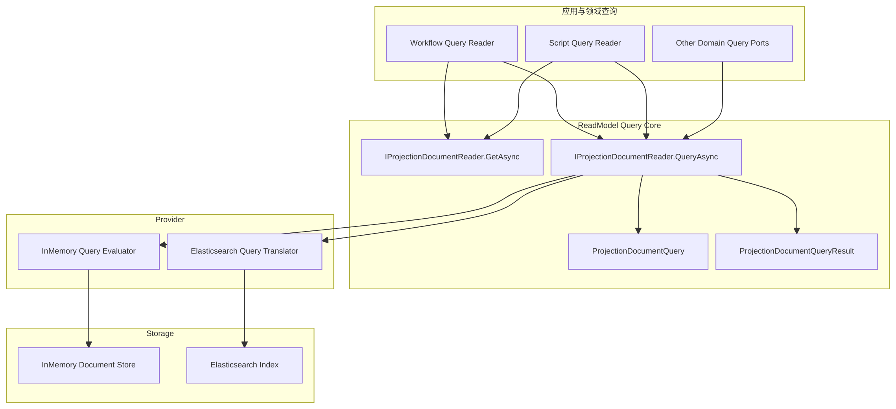
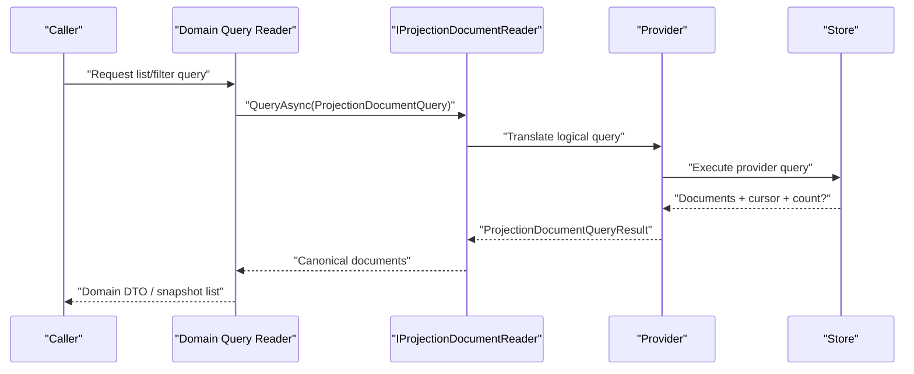

# ReadModel 查询能力重构详细设计（2026-03-15）

## 1. 文档定位

- 状态：`Implemented`
- 版本：`R1`
- 日期：`2026-03-15`
- 关注点：`ReadModel` 的通用查询能力，不重复展开前一轮 `stores/runtime` 瘦身细节
- 适用范围：
  - `src/Aevatar.CQRS.Projection.Stores.Abstractions`
  - `src/Aevatar.CQRS.Projection.Providers.InMemory`
  - `src/Aevatar.CQRS.Projection.Providers.Elasticsearch`
  - `src/workflow/Aevatar.Workflow.Projection`
  - `src/Aevatar.Scripting.Projection`
- 关联文档：
  - `docs/architecture/2026-03-15-readmodel-system-refactor-detailed-design.md`
  - `docs/architecture/2026-03-15-readmodel-best-practice-refactor-blueprint.md`
- 当前分支验证：
  - `dotnet build aevatar.slnx --nologo`
  - `dotnet test aevatar.slnx --nologo`
  - `bash tools/ci/architecture_guards.sh`

本文只回答一个问题：

`ReadModel` 已经具备最小读写能力，但还不具备正式的查询能力。接下来应该如何把 document query 做成框架级一等能力，同时避免重新引入一堆冗余接口和 provider 泄漏。

## 2. 执行摘要

当前 `ReadModel` 系统的问题不是“完全没有查询”，而是查询能力停留在仓储最小面：

- `IProjectionDocumentReader<TReadModel, TKey>` 只有 `GetAsync` 和 `ListAsync(int take)`。
- `workflow` 和 `scripting` 通过各自的 query reader/service 在上层补洞。
- `Elasticsearch` provider 内部已经有排序等查询意图，但没有进入通用契约。
- `graph` 侧已经有正式 `ProjectionGraphQuery`，document 侧却还停留在“取最近 N 条”。

这导致三个直接后果：

1. 框架层没有正式 document query contract。
2. 领域层反复堆 query reader/query service 来补框架缺口。
3. provider 已经在偷偷承担 richer query，但调用方无法显式表达需求。

本次重构的核心建议是：

- 保留现有 `IProjectionDocumentReader<TReadModel, TKey>`。
- 删除 `ListAsync(int take)`。
- 在同一接口上新增一个正式 `QueryAsync(ProjectionDocumentQuery)`。
- 用一个最小、可落地、provider-neutral 的 query object 覆盖：
  - `filter`
  - `sort`
  - `cursor`
  - `take`
  - `include_total_count`
- 这个 query object 的语义基线，对齐 Elasticsearch 的结构化 `Query DSL` 子集。
- 不把全文检索、任意表达式树、跨 document join 塞进框架内核。

一句话：`ReadModel` 需要的是一个正式的 document query contract，不是再造一套 query 框架。

## 3. 现状诊断

### 3.1 当前 document query 抽象过弱

当前接口：

```csharp
public interface IProjectionDocumentReader<TReadModel, in TKey>
    where TReadModel : class, IProjectionReadModel
{
    Task<TReadModel?> GetAsync(TKey key, CancellationToken ct = default);

    Task<IReadOnlyList<TReadModel>> ListAsync(int take = 50, CancellationToken ct = default);
}
```

这意味着框架只能表达两类查询：

- 精确主键读取
- 取前 N 条

它不能正式表达：

- 按字段过滤
- 排序字段和方向
- 游标翻页
- 是否需要总数
- 查询语义的边界和限制

### 3.2 graph 与 document 能力不对称

`graph` 已经有自己的查询对象：

- `ProjectionGraphQuery`
- `GetNeighborsAsync(query)`
- `GetSubgraphAsync(query)`

这说明仓库并不排斥“正式 query object”这一设计，真正缺的是 document 侧没有同等级别的契约。

### 3.3 provider 已经在偷偷做 richer query

`ElasticsearchProjectionDocumentStorePayloadSupport` 里已经存在排序语义：

- 默认按 `CreatedAt desc, _id desc`
- 可配置 `listSortField`

问题不在于 provider 能力不够，而在于这些能力没有进入统一抽象，所以：

- 上层无法显式请求某种排序
- provider 行为只能靠默认值和隐式约定
- 文档系统无法建立一致的查询语义

### 3.4 领域层正在补 framework 的缺

`workflow` 和 `scripting` 现在都在自己补 document query 缺口：

- `WorkflowProjectionQueryReader` 负责 `GetActorSnapshot / ListActorSnapshots / Timeline / Graph`
- `ScriptReadModelQueryReader` 负责 `GetSnapshot / ListSnapshots / ExecuteDeclaredQuery`

其中很多逻辑其实并不属于领域语义，而是在做：

- `take` 限制
- 主读模型 list
- 查询结果排序或映射

如果框架本身有正式 document query contract，这些重复逻辑可以显著收缩。

### 3.5 当前问题不是“缺少更多 query service”

问题不是再加几个：

- `IProjectionDocumentQueryService`
- `IProjectionDocumentListReader`
- `IProjectionDocumentSearchPort`

这样只会重演上一轮的冗余接口问题。

当前真正缺的，是给现有 reader 一个正式查询入口。

## 4. 目标与非目标

### 4.1 目标

本轮查询重构的目标只有五个：

1. 让 document query 成为框架一等能力。
2. 保持接口面最小，不再新增一堆平行抽象。
3. 让 InMemory 和 Elasticsearch 都能以同一语义工作。
4. 让 workflow/scripting 回到“领域 query 负责领域语义，通用 query 负责列表/过滤/翻页”。
5. 保持严格读写分离，不允许 query-time replay 或 query-time materialization。

### 4.2 非目标

以下能力不进入本轮框架内核：

- 通用全文检索 DSL
- 任意布尔表达式树
- 跨 readmodel join
- SQL/LINQ 风格 provider
- query-time projection refresh
- query-time event replay
- 为每个 provider 定义一套独立扩展接口

这些能力如果确实存在业务价值，应留在领域专用 query port 或 provider 专用 adapter，而不是污染内核。

## 5. 设计原则

### 5.1 一个 reader，两个职责

`IProjectionDocumentReader<TReadModel, TKey>` 保留，但职责明确收敛为：

- `GetAsync(key)`：精确读取
- `QueryAsync(query)`：正式查询

删除 `ListAsync(take)`，因为它只是 `QueryAsync` 的退化壳。

### 5.2 query object 必须小而明确

通用 document query 只覆盖“所有 provider 都有实现价值”的能力：

- 标量字段过滤
- 多字段排序
- 游标翻页
- `take`
- 可选总数

并且这组能力的语义，以 Elasticsearch 最常用、最稳定、最容易跨 provider 对齐的结构化查询子集为基线。

### 5.3 领域语义继续留在领域 query

框架通用 query 只负责“怎么查 document”，不负责“领域上这意味着什么”。

例如：

- workflow 的 timeline 和 graph 仍然是领域接口
- scripting 的 declared query 仍然是脚本语义接口
- framework 不负责把这些都折叠进一个万能 query object

### 5.4 provider 细节只能向内吸收

调用方只表达：

- 过滤哪些字段
- 怎么排序
- 游标和页大小

调用方不应该知道：

- ES 的 `_source`
- `search_after`
- `track_total_hits`
- `index sort`

这些都必须被 provider 吸收。

### 5.5 查询字段名要稳定，但不暴露底层索引细节

`ProjectionDocumentQuery` 中的字段路径以 read model 逻辑字段名表达，而不是 provider 原生字段名。

约束如下：

- 默认使用 read model 的稳定字段路径，例如 `DefinitionActorId`、`UpdatedAt`
- provider 负责把逻辑字段路径映射到实际存储字段
- 调用方不能直接传 ES 原生 `_id`、`_source.foo`、`keyword` 后缀等 provider 细节

### 5.6 不直接复用 Elasticsearch 官方 C# 查询类型

当前 Elasticsearch 官方 .NET 客户端使用的是 `Elastic.Clients.Elasticsearch`，其查询模型本质上是：

- `Query DSL` 的 C# 对象模型
- `Fluent API` 和 `Object Initializer API` 两种写法
- 语义上仍然是 Elasticsearch 原生查询，而不是通用 `IQueryable` 标准

本设计不直接把这些官方类型暴露为框架公共契约，原因如下：

- 这会把 `ReadModel` 抽象直接绑死到 Elastic 包
- `InMemory` provider 无法自然复用这套类型作为规范实现
- 调用方会开始依赖 ES 原生字段名和 provider 细节
- 框架内核会被迫跟随 Elastic 客户端类型演进

因此本方案的边界是：

- 框架定义自己的最小 query AST
- AST 的语义基线对齐 Elasticsearch 结构化查询子集
- Elasticsearch provider 在内部把 AST 翻译成 `SearchRequest<TDocument>` 和 `Query`

## 6. 目标架构

### 6.1 总体结构图



### 6.2 查询时序图



## 7. 核心契约设计

### 7.1 `IProjectionDocumentReader` 目标接口

```csharp
public interface IProjectionDocumentReader<TReadModel, in TKey>
    where TReadModel : class, IProjectionReadModel
{
    Task<TReadModel?> GetAsync(TKey key, CancellationToken ct = default);

    Task<ProjectionDocumentQueryResult<TReadModel>> QueryAsync(
        ProjectionDocumentQuery query,
        CancellationToken ct = default);
}
```

重构要求：

- 删除 `ListAsync(int take)`
- 不新增平行的 `IProjectionDocumentQueryService`
- `QueryAsync` 成为唯一正式 list/filter/cursor 入口

### 7.2 `ProjectionDocumentQuery`

建议最小模型：

```csharp
public sealed class ProjectionDocumentQuery
{
    public IReadOnlyList<ProjectionDocumentFilter> Filters { get; init; } = [];

    public IReadOnlyList<ProjectionDocumentSort> Sorts { get; init; } = [];

    public string? Cursor { get; init; }

    public int Take { get; init; } = 50;

    public bool IncludeTotalCount { get; init; }
}
```

说明：

- `Filters` 默认是 `AND` 组合
- `Sorts` 允许多字段排序
- `Cursor` 是 provider 生成、调用方透明传回的不透明游标
- `Take` 由 framework/provider 共同做上限裁剪
- `IncludeTotalCount` 是显式开关，避免默认把昂贵计数塞给所有查询

### 7.3 `ProjectionDocumentFilter`

建议保持一组最小可移植操作符：

```csharp
public sealed class ProjectionDocumentFilter
{
    public string FieldPath { get; init; } = "";

    public ProjectionDocumentFilterOperator Operator { get; init; }

    public ProjectionDocumentValue Value { get; init; } = ProjectionDocumentValue.Empty;
}

public enum ProjectionDocumentFilterOperator
{
    Eq = 0,
    In = 1,
    Exists = 2,
    Gt = 3,
    Gte = 4,
    Lt = 5,
    Lte = 6
}
```

设计取舍：

- 不支持任意 lambda/表达式树
- 不支持 provider-specific 原生 DSL 透传
- 不支持复杂 `OR/NOT` 作为内核默认能力

原因很明确：

- 需要 provider-neutral
- 需要 testable
- 需要让 InMemory 和 ES 语义可对齐
- 需要避免把 query contract 重新做成另一个 mini database
- 需要避免把 `Elastic.Clients.Elasticsearch` 的对象模型直接渗透进框架核心

### 7.4 `ProjectionDocumentValue`

建议使用显式标量联合值，而不是字符串 bag：

```csharp
public sealed class ProjectionDocumentValue
{
    public string? StringValue { get; init; }

    public long? Int64Value { get; init; }

    public double? DoubleValue { get; init; }

    public bool? BoolValue { get; init; }

    public DateTime? DateTimeValue { get; init; }

    public IReadOnlyList<string> StringValues { get; init; } = [];
}
```

这不是完美代数类型，但比：

- `object`
- `Dictionary<string, string>`
- provider 原生 JSON 片段

更稳定，也更符合当前仓库的强类型方向。

### 7.5 `ProjectionDocumentSort`

```csharp
public sealed class ProjectionDocumentSort
{
    public string FieldPath { get; init; } = "";

    public ProjectionDocumentSortDirection Direction { get; init; }
}

public enum ProjectionDocumentSortDirection
{
    Asc = 0,
    Desc = 1
}
```

### 7.6 `ProjectionDocumentQueryResult`

```csharp
public sealed class ProjectionDocumentQueryResult<TReadModel>
{
    public IReadOnlyList<TReadModel> Items { get; init; } = [];

    public string? NextCursor { get; init; }

    public long? TotalCount { get; init; }
}
```

说明：

- `Items` 始终返回 canonical read model
- `NextCursor` 为 `null` 表示没有下一页
- `TotalCount` 只有在 `IncludeTotalCount = true` 时才允许填充

## 8. Provider 映射策略

### 8.1 InMemory

`InMemory` 必须作为 query contract 的参考实现，而不是弱化版本。

实现要求：

- 基于内存字典中的 canonical read model 快照执行查询
- 使用稳定字段路径解析器读取字段值
- 按 filter 执行标量比较
- 按多字段排序执行稳定排序
- cursor 采用 provider 自己编码的排序断点
- `IncludeTotalCount` 返回精确值

注意点：

- 不能为了简单直接退回 JSON 节点查询
- 不能重新引入 JSON clone fallback
- 不能让测试环境的过滤/排序语义和 ES 偏离

### 8.2 Elasticsearch

`Elasticsearch` provider 负责把逻辑查询翻译成 ES DSL，但这些细节不外泄。

映射原则：

- `Eq/In/Exists/Range` 对应标准结构化 DSL
- `Sorts` 翻译成 ES sort 数组
- `Cursor` 翻译为 `search_after`
- `IncludeTotalCount` 映射为显式 total hit 统计
- provider 补充稳定 tie-break sort，避免游标翻页不稳定

实现建议：

- provider 内部优先使用 `Elastic.Clients.Elasticsearch` 官方对象模型构造查询
- 不在框架公共接口中暴露 `Elastic.Clients.Elasticsearch.QueryDsl.Query`
- 不让上层感知 `SearchRequest<TDocument>`、`Field`、`SortOptions` 等类型

明确约束：

- 不允许调用方直接构造 ES JSON 查询
- 不允许 query contract 直接暴露 `_source`、`search_after` 原语
- 不允许把 provider 限制默默降级成“随机 list”

### 8.3 动态索引与查询边界

如果某些 read model 在 host/provider 层启用了动态索引路由：

- query 仍然走同一个 `QueryAsync`
- 路由由 provider/host 在内部解决
- 业务调用方不感知 index name

换句话说，动态索引是 provider 责任，不是 query contract 责任。

## 9. 对齐 Elasticsearch 的边界

### 9.1 应对齐什么

通用 document query 应对齐 Elasticsearch 中最稳定的结构化查询能力：

- `term`
- `terms`
- `exists`
- `range`
- 多字段 `sort`
- `search_after`
- 可选总数统计

这是当前 `ReadModel` 最需要、也是最容易跨 provider 保持一致的一组能力。

### 9.2 不应对齐什么

以下 Elasticsearch 能力不进入通用 query：

- `match`/全文检索
- `query_string`
- script query
- nested query
- 聚合
- ES|QL
- 任意 raw JSON DSL

这些能力要么偏分析，要么 provider-specific，要么无法在 `InMemory` 中稳定复现。

### 9.3 为什么不直接做成 Elastic 薄封装

如果直接把框架公共查询表达式设计成 Elastic 官方对象模型的薄封装，结果通常是：

- provider-neutral 抽象消失
- 测试 provider 与生产 provider 语义不再同级
- 上层模块逐渐把 Elastic 当作内核标准
- 后续任何 provider 替换都要穿透整个调用栈

因此最稳妥的边界仍然是：

- 语义对齐 Elasticsearch
- 类型不依赖 Elasticsearch
- 翻译责任留在 provider 内部

## 10. 领域层职责收敛

### 10.1 Workflow

`workflow` 仍然保留领域接口：

- `GetActorSnapshotAsync`
- `ListActorTimelineAsync`
- `GetActorGraphEdgesAsync`
- `GetActorGraphSubgraphAsync`

但其中 document list/filter 能力应下沉到通用 query。

建议演进：

- `ListActorSnapshotsAsync(take)` 改为内部调用 `QueryAsync`
- 新增领域级 filter/sort 参数时，先映射为 `ProjectionDocumentQuery`
- timeline 保持领域内存结构读取
- graph 继续走 `IProjectionGraphStore`

结果是：

- snapshot list/filter/paging 不再手写
- graph/timeline 这种领域强语义仍然留在 workflow

### 10.2 Scripting

`scripting` 分成两类查询：

- read model snapshot list/get
- declared query execution

建议演进：

- `GetSnapshotAsync` 继续走 `GetAsync`
- `ListSnapshotsAsync` 改为 `QueryAsync`
- declared query 仍然保持脚本语义入口，不进入框架 query

这样可以明确两层边界：

- document query：框架能力
- script declared query：领域/脚本能力

### 10.3 其他模块

未来任何模块如果需要：

- 列表
- 按字段过滤
- 游标翻页

默认先用 `QueryAsync`。

只有当查询已经超出结构化 document query 范围时，才新增领域专用 query port。

## 11. 查询语义边界

### 11.1 什么应该进入通用 query

以下能力属于通用 document query：

- 主键读取
- 按稳定字段过滤
- 排序
- 游标翻页
- 获取 canonical read model 列表

### 11.2 什么不应该进入通用 query

以下能力不该塞进框架级 document query：

- workflow graph 邻居探索
- workflow timeline 语义化裁剪
- scripting declared query
- provider-specific 全文检索
- 聚合分析报表
- 任意 join

这些能力要么是领域能力，要么是分析能力，不是 canonical document query。

### 11.3 为什么不默认支持复杂布尔逻辑

如果一开始就支持：

- `AND/OR/NOT`
- 多层 filter group
- 嵌套表达式树

结果通常是：

- InMemory 和 ES 语义越来越难对齐
- 调用方开始把领域查询全塞进通用 query
- framework 被迫演化成半个数据库方言层

所以 v1 只支持 `AND` 组合，是刻意收窄，不是能力不足。

## 12. 迁移计划

### 12.1 Phase 1：建立核心契约

改动：

- 更新 `IProjectionDocumentReader<TReadModel, TKey>`
- 删除 `ListAsync`
- 新增：
  - `ProjectionDocumentQuery`
  - `ProjectionDocumentFilter`
  - `ProjectionDocumentValue`
  - `ProjectionDocumentSort`
  - `ProjectionDocumentQueryResult<TReadModel>`
- 为 `InMemory` 与 `Elasticsearch` 实现 `QueryAsync`

验收：

- solution build 通过
- provider 单元测试覆盖 filter/sort/cursor/count
- 不引入新别名接口

### 12.2 Phase 2：迁移现有调用方

改动：

- workflow `ListActorSnapshotsAsync` 改用 `QueryAsync`
- scripting `ListSnapshotsAsync` 改用 `QueryAsync`
- 删除 provider 内部旧 `list` 默认排序辅助逻辑的隐式入口

验收：

- workflow/scripting 现有测试通过
- 领域 query reader 不再手写基础 list 逻辑

### 12.3 Phase 3：扩展上层查询入口

改动：

- 为 HTTP/query port 暴露有限、显式的 filter/sort/page 参数
- 只暴露已确认有业务价值的字段
- 不把通用 query object 直接裸露给外部 API

验收：

- API 字段单一语义
- 外部契约不泄漏 provider 字段名

### 12.4 Phase 4：删除旧约定和补丁层

改动：

- 删除只剩包壳意义的 list helper
- 清理文档中旧的 `ListAsync(take)` 描述
- 增加架构门禁，防止新代码继续堆隐式 list/sort 行为

验收：

- 文档、代码、测试一致
- 架构门禁能阻止旧模式回流

## 13. 测试与门禁建议

### 13.1 单元测试

必须补的测试：

- `Eq` 过滤
- `In` 过滤
- `Exists` 过滤
- `Gt/Gte/Lt/Lte` 过滤
- 多字段排序
- `take` 裁剪
- cursor 连续翻页
- `IncludeTotalCount`

### 13.2 Provider 对齐测试

增加对齐测试，验证同一 query 在：

- InMemory
- Elasticsearch

上产生一致的：

- 结果顺序
- 游标推进
- 总数语义

### 13.3 架构门禁

建议新增或补充门禁：

- 禁止新增 `ListAsync(int take)` 调用
- 禁止 provider 内部继续偷偷引入未暴露到通用契约的默认 query 语义
- 禁止在 query reader/service 中自行实现通用 filter/sort/page，除非属于领域强语义

## 14. 风险与取舍

### 14.1 风险一：字段路径解析复杂度上升

这是事实，但这是必须承担的复杂度。

因为如果没有逻辑字段路径解析：

- 调用方就会直接依赖 provider 字段名
- query contract 很快就会泄漏 ES 细节

正确做法是把这层复杂度吸收到 provider 内部，而不是让调用方分担。

### 14.2 风险二：InMemory 与 ES 语义对齐成本

这也是必须承担的成本。

如果测试 provider 和生产 provider 查询语义不一致，框架 query 就没有可信度。

### 14.3 风险三：上层可能试图把一切都塞进通用 query

所以必须提前划边界：

- document query 只做结构化 document 查询
- graph、timeline、declared query 保持独立

## 15. 结论

`ReadModel` 系统当前真正缺的，不是更多 query service，也不是更花哨的 provider 适配层，而是一个正式、最小、诚实的 document query contract。

最佳实践的收敛方案应当是：

- 保留一个 `IProjectionDocumentReader`
- 删除 `ListAsync`
- 新增 `QueryAsync(ProjectionDocumentQuery)`
- 让 InMemory/Elasticsearch 共享同一语义
- 让 workflow/scripting 回到领域查询本位

这条路径能补上当前最明显的框架缺口，同时不会把系统重新推回“抽象越来越多、边界越来越糊”的老问题。
