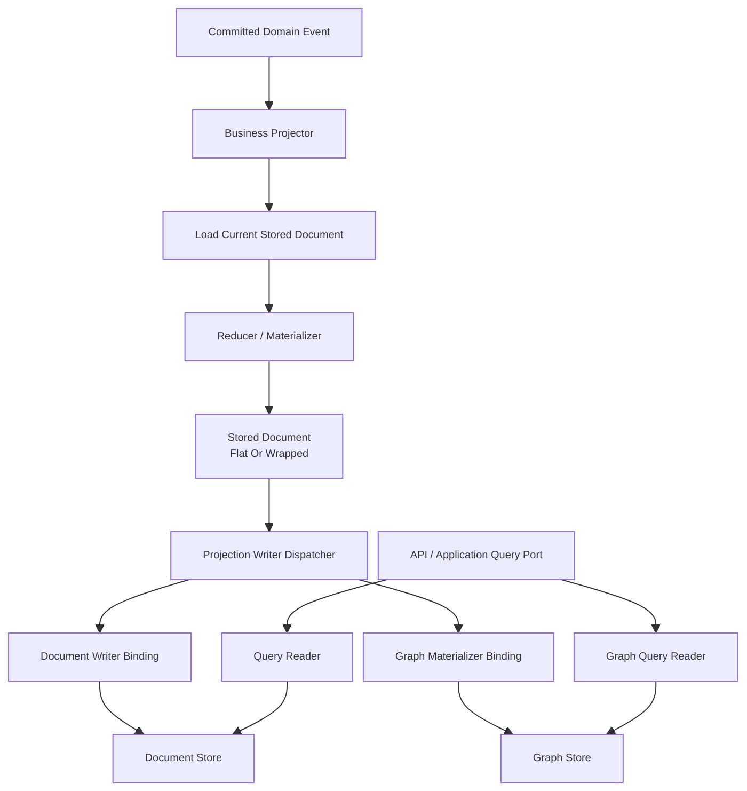
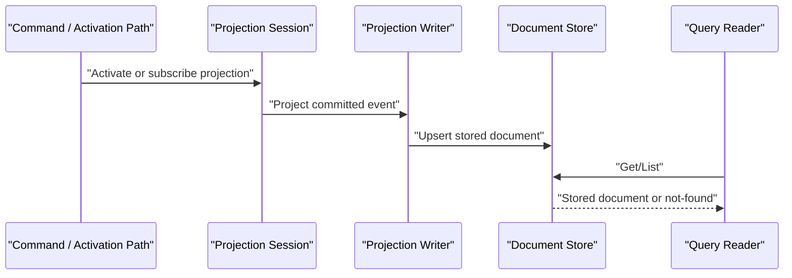

# ReadModel System 重构详细设计（2026-03-15）

## 1. 文档元信息

- 状态：`Proposed`
- 版本：`R1`
- 日期：`2026-03-15`
- 适用范围：
  - `src/Aevatar.CQRS.Projection.Stores.Abstractions`
  - `src/Aevatar.CQRS.Projection.Runtime.Abstractions`
  - `src/Aevatar.CQRS.Projection.Runtime`
  - `src/Aevatar.CQRS.Projection.Providers.InMemory`
  - `src/Aevatar.CQRS.Projection.Providers.Elasticsearch`
  - `src/workflow/Aevatar.Workflow.Projection`
  - `src/Aevatar.Scripting.Projection`
  - `src/Aevatar.CQRS.Projection.StateMirror`
  - `demos/Aevatar.Demos.CaseProjection`
- 关联文档：
  - `docs/architecture/2026-03-14-readmodel-protobuf-first-implementation-blueprint.md`
  - `docs/architecture/2026-03-15-cqrs-projection-readmodels-architecture.md`

## 2. 文档定位

本文不再解释当前系统“是什么”，而是定义 `ReadModel` 系统“应该如何重构”。

重点回答四个问题：

1. 当前 `ReadModel` 系统的结构性问题到底在哪里。
2. 目标态下哪些职责必须拆开。
3. 各层接口应该如何调整。
4. `workflow / scripting / state-mirror / demo` 该按什么顺序迁移。

## 3. 当前系统的核心问题

### 3.1 一句话判断

当前系统的主要问题不是某一个类型命名不好，而是同一组对象同时承载了四层职责：

1. 业务查询事实
2. projection/checkpoint 运行戳
3. store schema 与路由信息
4. graph/materialization 派生结果

这直接导致“对象语义边界失真”。

### 3.2 结构性问题清单

1. `IProjectionReadModel` 只约束 `Id`，其余全部靠约定，导致各模块把 `StateVersion / LastEventId / UpdatedAt / CreatedAt` 之类的 projection 戳随意塞进业务 read model。
2. `IProjectionDocumentStore<TReadModel, TKey>` 和 `IProjectionStoreDispatcher<TReadModel, TKey>` 同时暴露 `Upsert / Mutate / Get / List`，把写侧编排器和读侧仓储混在同一个抽象里。
3. `MutateAsync(TKey, Action<TReadModel>)` 是进程内闭包语义，不可序列化、不可远程化、不可补偿重放，不满足 runtime-neutral 要求。
4. `IDynamicDocumentIndexedReadModel` 把实例级 read model 和索引级 schema 绑在一起，`DocumentMetadata` 这类表级配置从 provider 边界泄漏回业务对象。
5. `IGraphReadModel` 要求业务 read model 自己生成 `GraphNodes / GraphEdges`，把派生图物化逻辑混进 canonical read model。
6. `ProjectionGraphNode.Properties` 与 `ProjectionGraphEdge.Properties` 是开放字符串 bag，稳定业务语义被降级为 `map<string,string>`。
7. query 路径中存在 `EnsureActorProjectionAsync()`，即查询时补投影，破坏读写分离和 query-time materialization 禁令。
8. 多 store 分发实际是“一个权威 query store + 多个最佳努力副本”，默认补偿只有日志，没有 durable recovery。
9. InMemory provider 与 Elasticsearch provider 的 `Mutate` 语义不同，导致“本地能过”不等于“生产正确”。
10. query DTO 经常直接把 projection 戳和业务结果一起暴露到外部接口，进一步放大语义混叠。

## 4. 重构目标

本轮重构只接受以下目标：

1. `ReadModel` 主体只表达业务查询事实，不再直接承载 provider schema、graph 物化或 query-time orchestration。
2. projection 运行戳从业务数据中显式分层，默认 query 不再自动返回运行戳。
3. 写侧分发、读侧查询、graph 物化三类核心职责分别建模，不再通过单一 `store dispatcher` 混合暴露。
4. 删除 `Action<TReadModel>` 风格 mutation，改成显式 load-reduce-store 或显式 CAS 写入语义。
5. 禁止 query path 内部触发补投影；需要预热时必须走显式 priming/lease/observe 协议。
6. `workflow` 与 `scripting` 两条主链都切换到同一套重构后的 `ReadModel` 语义。

## 5. 目标架构原则

### 5.1 语义分层原则

每一份 persisted read-side 信息都要区分三类语义，但不强制拆成三个物理对象：

1. `Business Data`
   - 稳定查询事实
   - 直接服务业务查询和业务决策
2. `Projection Stamp`
   - `state_version / last_event_id / updated_at / created_at`
   - 只表达投影推进与观测戳
3. `Store Route / Store Schema`
   - index name
   - index scope
   - mappings/settings/aliases
   - 只允许存在于 provider/binding 边界

核心要求是“语义分层”，不是“一律三段式包装”。

允许的实现形态有两种：

1. 逻辑分层，物理扁平
   - 一个 document 上同时有业务字段与 projection 戳字段
   - 适用于简单 read model，一张表即可表达
2. 逻辑分层，物理分段
   - `Data / Stamp` 显式成为子消息或独立包装对象
   - 适用于复杂 read model，例如 workflow execution 这类已经同时承担多种职责的模型

不允许的形态只有一种：

1. 把 `Store Route / Store Schema` 也塞回业务 document 实例

也就是说：

- `Business Data` 与 `Projection Stamp` 可以在简单场景中同 document 共存
- `Store Route / Store Schema` 不能回流到业务 read model
- 是否需要 `Data / Stamp` 显式包装，应由模型复杂度决定，而不是全局强制

### 5.2 运行时拆分原则

重构后必须拆成三条核心窄接口：

1. `Projection Writer`
   - 负责把已经构造好的文档写入一个或多个 store
2. `Projection Reader`
   - 负责查询 canonical persisted document
3. `Graph Materializer`
   - 负责把某个 document 转换成 graph mutation

如果某个 provider 确实需要动态分区或特殊路由，这属于 provider 可选扩展，而不是通用 `ReadModel` 抽象。

任何一个业务对象都不应同时实现这三条核心职责。

## 6. 目标架构图



## 7. 目标模型

### 7.1 文档模型

重构后 document 模型采用“逻辑两层、物理可选”的设计：

```text
必有：
  - Id
  - Business Data

可并存于同一 document：
  - Projection Stamp

禁止回流到 document：
  - Store Route / Store Schema
```

推荐的两种物理形态如下。

简单 document：

```proto
message ProjectionStamp {
  int64 state_version = 1;
  string last_event_id = 2;
  google.protobuf.Timestamp updated_at_utc = 3;
  google.protobuf.Timestamp created_at_utc = 4;
}

message ScriptCatalogEntryDocument {
  string id = 1;
  string catalog_actor_id = 2;
  string script_id = 3;
  string active_revision = 4;
  string active_definition_actor_id = 5;
  string active_source_hash = 6;
  ProjectionStamp stamp = 7;
}
```

复杂 document：

```proto
message WorkflowExecutionData {
  string root_actor_id = 1;
  string workflow_name = 2;
  string command_id = 3;
  string input = 4;
  string final_output = 5;
  string final_error = 6;
  WorkflowExecutionSummary summary = 7;
  repeated WorkflowExecutionStepTrace steps = 8;
  repeated WorkflowExecutionTimelineEvent timeline = 9;
}

message WorkflowExecutionStoredDocument {
  string id = 1;
  WorkflowExecutionData data = 2;
  ProjectionStamp stamp = 3;
}
```

选型规则：

1. 简单文档允许扁平存储，不需要为了“形式统一”强制再包一层。
2. 复杂文档在以下情况下应显式拆 `Data / Stamp`：
   - 已经混入大量 projection 运行戳
   - 同时承担 document、graph、debug snapshot 多种职责
   - query 默认只需要业务数据，而不需要 projection 戳
3. 无论扁平还是包装，`DocumentMetadata / Mappings / Settings / Aliases` 都不能进入业务 document。

### 7.2 store schema 留在 provider 边界

`DocumentIndexMetadata` 保留在 provider 边界是允许的，因为它确实是存储索引元模型。

但必须删除“read model 实例暴露 schema”的模式。

目标替换如下：

```text
旧：
  IDynamicDocumentIndexedReadModel
    - DocumentIndexScope
    - DocumentMetadata

新：
  IProjectionDocumentMetadataProvider<TDocument>
    - 提供类型级 schema
```

即：

1. `schema` 是类型级 provider 责任
2. 默认 `read model` 直接就是 document，不再额外引入 `read model -> ES document` 映射层
3. `document` 本身不再返回 `DocumentMetadata`
4. 如果 Elasticsearch 确实需要动态分区，这应留在 provider/host 配置层，作为可选扩展，而不是通用 `ReadModel` 契约

### 7.3 graph 物化拆分

目标替换如下：

```text
旧：
  IGraphReadModel
    - GraphScope
    - GraphNodes
    - GraphEdges

新：
  IProjectionGraphMaterializer<TDocument>
    - Materialize(document) => ProjectionGraphMutation
```

即：

1. canonical document 不再实现 `IGraphReadModel`
2. graph 派生从业务对象中拿走
3. graph binding 只消费 materializer 的结果

## 8. 目标接口重构

### 8.1 文档存储接口

当前问题：

- `IProjectionDocumentStore<TReadModel, TKey>` 既读又写又 mutation
- 上层很容易把它当 repository 使用

目标拆分：

```csharp
public interface IProjectionDocumentWriter<TDocument>
{
    Task<ProjectionWriteResult> UpsertAsync(TDocument document, CancellationToken ct = default);
}

public interface IProjectionDocumentReader<TDocument, in TKey>
{
    Task<TDocument?> GetAsync(TKey key, CancellationToken ct = default);
    Task<IReadOnlyList<TDocument>> ListAsync(int take = 50, CancellationToken ct = default);
}
```

规则：

1. 删除 `MutateAsync(TKey, Action<TDocument>)`
2. provider 如需 OCC，统一基于 `IProjectionReadModel.SourceVersion/SourceEventId` 做条件覆盖
3. 写入结果统一返回 `Applied / Stale / Duplicate / Conflict`

### 8.2 分发接口

当前问题：

- `IProjectionStoreDispatcher` 既分发写入，又暴露 `Get/List`

目标拆分：

```csharp
public interface IProjectionWriteDispatcher<TDocument>
{
    Task UpsertAsync(TDocument document, CancellationToken ct = default);
}
```

规则：

1. `dispatcher` 只管 fan-out write
2. `Get/List` 从 dispatcher 移除
3. 读路径直接走 `IProjectionDocumentReader` 或业务 query reader

### 8.3 provider 路由策略

不新增通用 `IProjectionDocumentRouteResolver<TDocument>`。

原因：

1. 大多数 read model 根本不需要额外路由抽象
2. 为少数动态分区场景把 route interface 提升到核心层，会把简单模型整体拉复杂
3. 默认情况下，`read model` 直接就是 persisted document，provider 直接写入即可

规则：

1. 通用核心层只保留类型级 `IProjectionDocumentMetadataProvider<TDocument>`
2. 若 Elasticsearch 存在少量动态分区需求，优先在 provider/host 注册层通过配置或 provider 私有扩展处理
3. 不允许把 `DocumentIndexScope / DocumentMetadata` 再挂回业务 document 实例

### 8.4 graph 接口

新增：

```csharp
public interface IProjectionGraphMaterializer<TDocument>
{
    ProjectionGraphMutation Materialize(TDocument document);
}
```

其中：

- `ProjectionGraphMutation` 是 graph adapter 边界对象
- 业务模块先产出 typed graph intent
- binding 再把它转换成 provider 可接受的 node/edge 写入

## 9. 查询路径重构

### 9.1 禁止 query-time projection activation

以下模式必须删除：

1. query/read port 内部调用 `EnsureActorProjectionAsync()`
2. query 时发现没有 read model，就先补跑 projection
3. query 时执行隐式 materialization 或回放

目标时序如下：



语义：

1. query 只能读取已经存在的 read model
2. query 不能悄悄触发一次写
3. 若业务需要“先保证可查再返回”，必须通过显式 observe/receipt 协议完成

### 9.2 query DTO 默认不带 projection 戳

默认 query 返回：

- `Data`
- 或面向 UI/API 的业务 DTO

只有以下接口才允许返回 `Stamp`：

1. debug query
2. audit query
3. projection health / lag query

## 10. Graph 层重构

### 10.1 当前问题

当前 graph 设计有三个问题：

1. graph 生命周期管理嵌在每次 read model upsert 里
2. graph 节点和边的业务语义被压平到 `Properties`
3. graph cleanup 依赖 owner 全量扫描，写放大明显

### 10.2 目标设计

graph 层拆成三段：

1. `Typed Graph Intent`
   - 业务模块定义 typed graph relation
2. `Graph Materializer`
   - 把 stored document 转成 typed intent
3. `Graph Adapter Binding`
   - 把 typed intent 映射到 provider node/edge

规则：

1. `input / commandId / success / stepType` 等稳定语义不再直接塞字符串 bag
2. `projectionManaged / projectionOwnerId` 这种托管字段仍允许存在，但只允许留在 adapter 边界
3. graph cleanup 改成“按 owner revision 对账”或“按 snapshot replace set”语义，不在 binding 内做大范围扫表

## 11. Provider 重构

### 11.1 InMemory

目标：

1. `Mutate` 删除后，InMemory 只实现 `Get/List/Upsert`
2. provider 内部 clone 统一优先 protobuf clone
3. 禁止 JSON round-trip 作为核心克隆语义
4. 若仍需测试便利性，也必须保证“先 clone、后 mutate、最后原子替换”

### 11.2 Elasticsearch

目标：

1. document schema 继续来源于 `IProjectionDocumentMetadataProvider<TDocument>`
2. 默认 `read model` 直接作为 ES document 落盘，不新增默认映射层
3. 对 ES 主查询面，优先采用扁平字段落盘，而不是为了形式统一强制包 `data.* / stamp.*`
4. 如果存在少量动态索引需求，收敛到 provider/host 配置，不进入通用 `ReadModel` 抽象
5. 对动态索引模型显式暴露“write-only binding”能力，而不是实现后再在运行时报错

## 12. 业务模块迁移设计

### 12.1 Workflow

#### 目标拆分

把当前 `WorkflowExecutionReport` 拆成：

1. `WorkflowExecutionData`
2. `WorkflowExecutionStamp`
3. `WorkflowExecutionStoredDocument`
4. `WorkflowExecutionGraphMaterializer`
5. `WorkflowExecutionDebugSnapshot`

#### 迁移规则

1. `WorkflowExecutionReadModelProjector` 不再直接 mutate `WorkflowExecutionReport`
2. projector 改成：
   - `reader.GetAsync(id)`
   - reducer 产出新的 `WorkflowExecutionData`
   - stamp updater 产出新的 `WorkflowExecutionStamp`
   - `writer.UpsertAsync(document, condition)`
3. `WorkflowProjectionQueryReader` 默认只映射 `Data`
4. `WorkflowExecutionReadModelMapper` 中 `StateVersion / LastEventId / UpdatedAt` 改到单独 debug DTO
5. graph 逻辑从 `WorkflowExecutionReport` 搬到 `WorkflowExecutionGraphMaterializer`

### 12.2 Workflow Actor Binding

目标：

1. `WorkflowActorBindingDocument` 保留为 document-only model
2. 去掉 query path 的 `EnsureActorProjectionAsync()`
3. actor binding 的“未就绪/未绑定/不存在”改成显式业务状态，不再靠 query 时补投影

### 12.3 Scripting

#### 目标拆分

保留三类主语义：

1. `Authority Stored Documents`
2. `Semantic Stored Documents`
3. `Native Materialized Documents / Graph`

重点改动：

1. `ScriptNativeDocumentReadModel` 删除 `DocumentMetadata` 属性
2. `Fields` 继续允许作为开放 bag，但只用于真正的 native materialization 边界
3. `ScriptReadModelQueryReader` 默认只返回 semantic data
4. `ProjectionScriptDefinitionSnapshotPort` 与 `ProjectionScriptCatalogQueryPort` 删除 query-time `EnsureActorProjectionAsync()`
5. `ScriptNativeDocumentReadModel` 若仍需动态索引，路由策略应收敛到 provider/host，而不是继续挂在 document 实例上

### 12.4 StateMirror

目标：

1. `StateMirrorReadModelProjector` 不再暴露 `Get/List`
2. 它只保留“从 state 产出 document 并写入”的能力
3. 读能力交给独立 query reader 或 document reader

### 12.5 Case Demo

目标：

1. demo 继续保留轻量实现
2. 但接口形状必须与新抽象一致
3. 不允许 demo 成为保留旧接口的理由

## 13. 分阶段实施计划

### Phase 0：门禁与基线

1. 增加架构门禁：
   - 禁止 `ReadPorts/Queries` 中调用 `Ensure*ProjectionAsync`
   - 禁止新增 `Action<TReadModel>` 风格 store mutation
   - 禁止业务 read model 实现 `IDynamicDocumentIndexedReadModel`
   - 禁止业务 read model 实现 `IGraphReadModel`
2. 为 workflow 与 scripting 当前行为补齐最小回归测试

### Phase 1：抽象层重构

1. 新增 `IProjectionDocumentReader`
2. 新增 `IProjectionDocumentWriter`
3. 新增 `IProjectionWriteDispatcher`
4. 新增 `IProjectionGraphMaterializer`
5. 标记以下旧接口为待删除：
   - `IProjectionStoreDispatcher`
   - `IProjectionQueryableStoreBinding`
   - `IDynamicDocumentIndexedReadModel`
   - `IGraphReadModel`
   - `MutateAsync(TKey, Action<TReadModel>)`

### Phase 2：Runtime/Provider 迁移

1. `ProjectionStoreDispatcher` 改成纯写分发器
2. `ProjectionDocumentStoreBinding` 分裂成 reader binding 与 writer binding
3. `ProjectionGraphStoreBinding` 改为消费 materializer
4. InMemory 与 Elasticsearch provider 接上新读写接口

### Phase 3：Workflow 迁移

1. 先迁 `WorkflowActorBinding`
2. 再迁 `WorkflowExecutionReport`
3. 最后迁 query DTO 与 graph materialization

### Phase 4：Scripting 迁移

1. 先迁 authority query ports，去掉 query-time priming
2. 再迁 semantic stored document
3. 最后迁 native document 的动态索引配置收敛与 native graph materializer

### Phase 5：清理旧接口

1. 删除 legacy dispatcher 读接口
2. 删除 `MutateAsync`
3. 删除 `IDynamicDocumentIndexedReadModel`
4. 删除 `IGraphReadModel`
5. 删除为兼容旧模型保留的 mapper/shim

## 14. 关键文件级变更清单

### 14.1 抽象层

需要修改或删除：

1. `src/Aevatar.CQRS.Projection.Stores.Abstractions/Abstractions/ReadModels/IProjectionDocumentStore.cs`
2. `src/Aevatar.CQRS.Projection.Stores.Abstractions/Abstractions/ReadModels/IDynamicDocumentIndexedReadModel.cs`
3. `src/Aevatar.CQRS.Projection.Stores.Abstractions/Abstractions/ReadModels/IGraphReadModel.cs`
4. `src/Aevatar.CQRS.Projection.Runtime.Abstractions/Abstractions/Stores/IProjectionStoreDispatcher.cs`
5. `src/Aevatar.CQRS.Projection.Runtime.Abstractions/Abstractions/Stores/IProjectionQueryableStoreBinding.cs`

需要新增：

1. `src/Aevatar.CQRS.Projection.Stores.Abstractions/Abstractions/ReadModels/IProjectionDocumentReader.cs`
2. `src/Aevatar.CQRS.Projection.Stores.Abstractions/Abstractions/ReadModels/IProjectionDocumentWriter.cs`
3. `src/Aevatar.CQRS.Projection.Runtime.Abstractions/Abstractions/Stores/IProjectionWriteDispatcher.cs`
4. `src/Aevatar.CQRS.Projection.Runtime.Abstractions/Abstractions/Graphs/IProjectionGraphMaterializer.cs`

### 14.2 Workflow

重点文件：

1. `src/workflow/Aevatar.Workflow.Projection/ReadModels/WorkflowExecutionReadModel.Partial.cs`
2. `src/workflow/Aevatar.Workflow.Projection/Projectors/WorkflowExecutionReadModelProjector.cs`
3. `src/workflow/Aevatar.Workflow.Projection/Reducers/*`
4. `src/workflow/Aevatar.Workflow.Projection/Orchestration/WorkflowProjectionQueryReader.cs`
5. `src/workflow/Aevatar.Workflow.Projection/ReadModels/WorkflowExecutionReadModelMapper.cs`
6. `src/workflow/Aevatar.Workflow.Projection/Orchestration/ProjectionWorkflowActorBindingReader.cs`

### 14.3 Scripting

重点文件：

1. `src/Aevatar.Scripting.Projection/ReadModels/ScriptProjectionReadModels.Partial.cs`
2. `src/Aevatar.Scripting.Projection/Projectors/ScriptReadModelProjector.cs`
3. `src/Aevatar.Scripting.Projection/Projectors/ScriptNativeDocumentProjector.cs`
4. `src/Aevatar.Scripting.Projection/Projectors/ScriptNativeGraphProjector.cs`
5. `src/Aevatar.Scripting.Projection/Queries/ScriptReadModelQueryReader.cs`
6. `src/Aevatar.Scripting.Projection/ReadPorts/ProjectionScriptDefinitionSnapshotPort.cs`
7. `src/Aevatar.Scripting.Projection/ReadPorts/ProjectionScriptCatalogQueryPort.cs`

## 15. 验证与门禁

文档落地后，每个阶段至少执行：

1. `dotnet build aevatar.slnx --nologo`
2. `dotnet test aevatar.slnx --nologo`
3. `bash tools/ci/architecture_guards.sh`
4. `bash tools/ci/solution_split_guards.sh`
5. `bash tools/ci/solution_split_test_guards.sh`

若涉及 workflow projection：

1. `bash tools/ci/workflow_binding_boundary_guard.sh`
2. `bash tools/ci/projection_route_mapping_guard.sh`

## 16. 迁移完成判定

只有同时满足以下条件，才视为重构完成：

1. 业务 read model 不再实现 `IGraphReadModel`
2. 业务 read model 不再实现 `IDynamicDocumentIndexedReadModel`
3. query 路径不再调用 `EnsureActorProjectionAsync`
4. `IProjectionStoreDispatcher` 不再暴露 `Get/List`
5. store 层不再暴露 `Action<TReadModel>` mutation
6. workflow 与 scripting 默认 query 不再直接泄漏 projection 戳
7. graph 稳定语义不再通过 `Properties` bag 表达
8. store schema 与动态索引信息不再从业务 read model 实例暴露

## 17. 结论

`ReadModel` 系统当前最大的问题不是某个实现细节，而是：

- 业务事实
- 投影运行戳
- 存储拓扑
- 图物化

被揉进了同一对象和同一接口里。

本次重构的核心不是“换个命名”，而是把这四层职责重新拆回各自边界：

1. 文档只承载业务数据和投影戳
2. store schema 留在 provider 边界，默认不引入额外 ES 映射层
3. graph 派生留在 materializer
4. query 只读，不触发写

只有这样，`ReadModel` 才能真正成为稳定的 CQRS 读侧事实，而不是“查询 DTO + 存储配置 + 运行时上下文 + 图适配器”的混合物。
