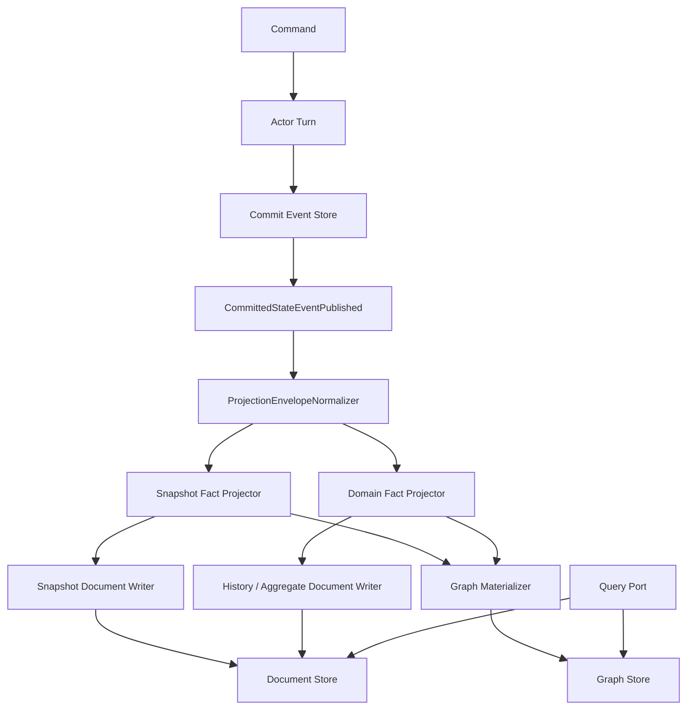
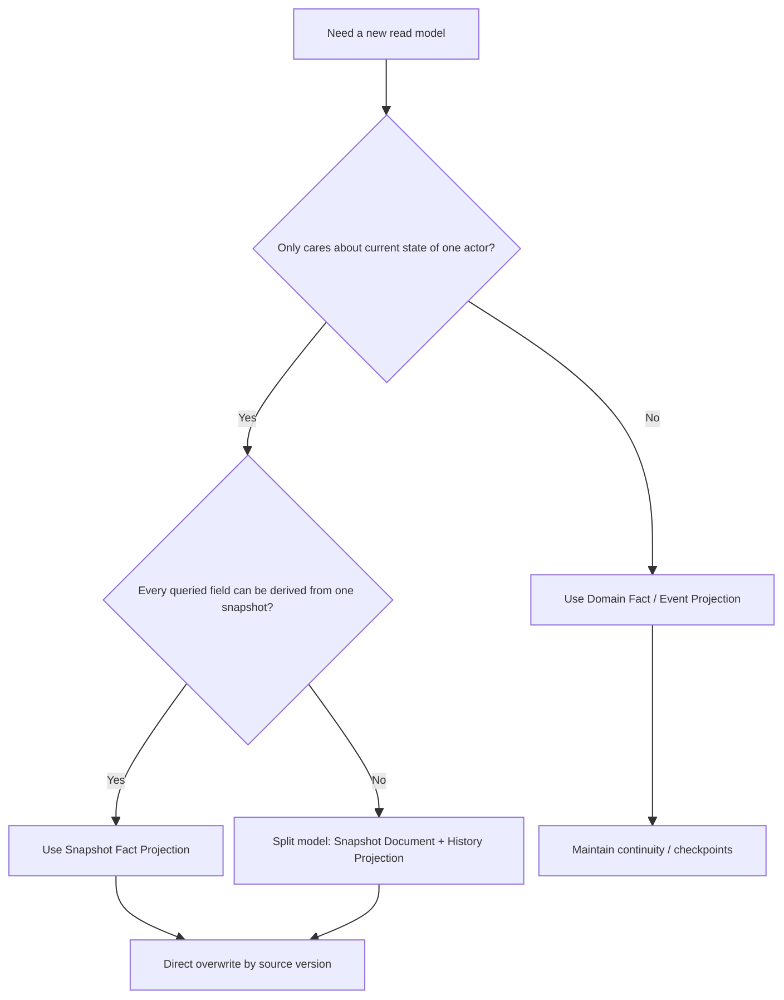
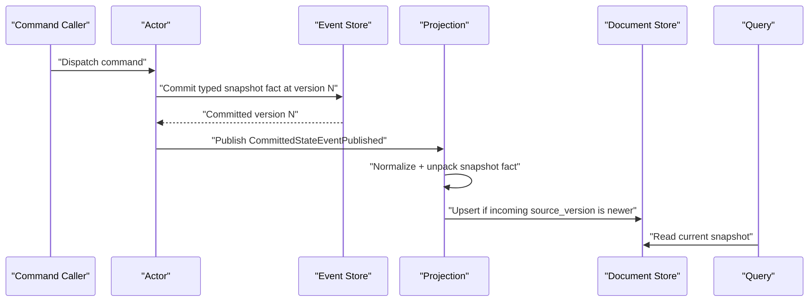

# Snapshot Fact 驱动的 Projection / ReadModel 重构实施蓝图（2026-03-15）

## 1. 文档元信息

- 状态：`Proposed`
- 版本：`R1`
- 日期：`2026-03-15`
- 适用范围：
  - `src/Aevatar.Foundation.Abstractions`
  - `src/Aevatar.CQRS.Projection.Core`
  - `src/Aevatar.CQRS.Projection.Core.Abstractions`
  - `src/Aevatar.CQRS.Projection.Runtime`
  - `src/Aevatar.CQRS.Projection.Runtime.Abstractions`
  - `src/Aevatar.CQRS.Projection.Stores.Abstractions`
  - `src/Aevatar.CQRS.Projection.Providers.InMemory`
  - `src/Aevatar.CQRS.Projection.Providers.Elasticsearch`
  - `src/Aevatar.CQRS.Projection.StateMirror`
  - `src/workflow/Aevatar.Workflow.Abstractions`
  - `src/workflow/Aevatar.Workflow.Projection`
  - `src/Aevatar.Scripting.Abstractions`
  - `src/Aevatar.Scripting.Projection`
- 关联文档：
  - `docs/architecture/2026-03-15-cqrs-projection-readmodels-architecture.md`
  - `docs/architecture/2026-03-15-readmodel-best-practice-refactor-blueprint.md`
  - `docs/architecture/2026-03-15-readmodel-system-refactor-detailed-design.md`

## 2. 文档定位

本文不是现状说明，而是给出本轮重构的最终实施方向：

1. 最强一致性只留在 `actor + committed event store`。
2. `readmodel` 默认不承诺强一致，不走 query-time replay，不走 query-time materialization。
3. 对“单 actor、只关心当前态”的读模型，采用 `Snapshot Fact -> 直接覆盖 readmodel` 的正常路径。
4. 对“历史、审计、timeline、analytics、multi-source aggregate”这类视图，继续采用 `Domain Fact / Domain Event -> 增量 projection`。
5. `rebuild / replay` 只保留为后台修复和迁移工具，禁止成为线上读路径的一部分。

一句话结论：

`Actor may emit projection-ready snapshot facts, but may not own read-model materialization.`

## 3. 最终架构决策

### 3.1 一致性边界

本轮重构后，系统明确采用以下边界：

1. `actor state` 和 `event store committed version` 是唯一权威事实源。
2. `readmodel` 是 committed fact 的异步物化副本，不承诺和写侧实时同步。
3. 查询默认读 `readmodel`，不回 actor 拉当前 state，不回 event store 重放。
4. 需要更强业务保证时，通过事件化协议、completion event 或 actor-owned contract 获取，而不是把 readmodel 强行做成强一致。

### 3.2 三种 projection 输入模式

系统只允许三种输入模式，必须显式选一种，不允许混用语义：

| 模式 | 权威输入 | 正常写法 | 是否允许跳过中间版本 | 典型用途 |
| --- | --- | --- | --- | --- |
| `Snapshot Fact` | 某个 actor 的完整查询快照事实 | 直接覆盖 snapshot document | 允许，只要新快照来自更高源版本 | actor-scoped 当前态 |
| `Domain Fact / Domain Event` | 业务增量事实 | 增量 reducer / materializer | 不允许，缺口必须修复 | timeline / 审计 / analytics |
| `StateMirror` | 已有强类型 state 对象 | 结构镜像辅助 | 仅用于简单镜像 | 开发期或极简单视图 |

### 3.3 禁止事项

本轮重构后，以下做法应视为错误实现：

1. 查询路径触发 `EnsureActorProjectionAsync()` 或任何变体的 query-time priming。
2. 用 `readmodel` 本地 `StateVersion++` 冒充写侧权威版本。
3. 把 `raw actor whole state` 原样广播给所有下游，而不经过面向读侧的强类型快照契约。
4. 让 `readmodel` 依赖 replay 才能得到正确结果。
5. 让快照型 readmodel 携带只能通过事件历史累积得到的字段。
6. 让 actor 直接负责 document store / graph store / query provider 物化。

## 4. 为什么必须改

当前实现已经暴露出三类根本性问题。

### 4.1 快照型 readmodel 仍然在做事件规约

`workflow` 当前通过 reducer 链从 envelope 增量规约 `WorkflowExecutionReport`，再整体 upsert：

- `src/workflow/Aevatar.Workflow.Projection/Projectors/WorkflowExecutionReadModelProjector.cs`
- `src/workflow/Aevatar.Workflow.Projection/Reducers/*`

其中 `StateVersion` 还是本地计数：

- `src/workflow/Aevatar.Workflow.Projection/Reducers/WorkflowExecutionProjectionMutations.cs`

这意味着：

1. 当前态快照和事件历史耦合在一个 document 里。
2. `state_version` 不是 event store 权威版本。
3. projector 必须先读当前文档再做 reducer，复杂度和并发面都偏大。

### 4.2 当前 writer 没有版本条件

当前抽象和 provider 都只有裸 `UpsertAsync`：

- `src/Aevatar.CQRS.Projection.Stores.Abstractions/Abstractions/ReadModels/IProjectionDocumentWriter.cs`
- `src/Aevatar.CQRS.Projection.Runtime.Abstractions/Abstractions/Stores/IProjectionWriteDispatcher.cs`
- `src/Aevatar.CQRS.Projection.Providers.InMemory/Stores/InMemoryProjectionDocumentStore.cs`
- `src/Aevatar.CQRS.Projection.Providers.Elasticsearch/Stores/ElasticsearchProjectionDocumentStore.cs`

结果是：

1. 无法表达“只接受更高源版本”的快照覆盖语义。
2. 无法显式拒绝旧写覆盖。
3. 无法把 `duplicate / stale / conflict / applied` 区分成稳定运行结果。

### 4.3 系统里仍然保留 query-time priming 残留

例如脚本 authority projection 仍有显式 priming 端口：

- `src/Aevatar.Scripting.Projection/ReadPorts/ProjectionScriptAuthorityProjectionPrimingPort.cs`

这类能力只能保留在“启动订阅 / binder / activation”路径，不能继续出现在读侧默认模型里。

## 5. 目标架构

### 5.1 总体结构图



### 5.2 选择路径图



### 5.3 Snapshot 路径时序图



## 6. 快照型 readmodel 的契约

### 6.1 Snapshot Fact 的最低要求

快照型 readmodel 不允许只靠“当前事件类型 + 当前文档”猜下一态。它必须由 actor 直接输出一个对查询足够的快照事实。

推荐约束如下：

```proto
message ProjectionSourceStamp {
  string actor_id = 1;
  int64 source_version = 2;
  string source_event_id = 3;
  google.protobuf.Timestamp occurred_at_utc = 4;
}
```

每个 `Snapshot Fact` 至少要包含：

1. `actor_id`
2. `source_version`
3. `source_event_id`
4. `occurred_at_utc`
5. `snapshot payload`

### 6.2 Snapshot Fact 不是 raw actor state dump

这里的 `snapshot payload` 必须是“面向读侧的稳定强类型契约”，不是任意内部 state dump。

允许：

1. 字段名、层次结构按查询语义组织。
2. 去掉运行时临时字段。
3. 去掉仅 actor 内部使用的控制状态。
4. 对外部可见语义做强类型建模。

不允许：

1. 直接广播 actor 私有运行态。
2. 依赖开放 `map<string,string>` bag 承载稳定查询语义。
3. 用 `Any` 或 JSON dump 把内部 state 原样扩散到 projection 内核。

### 6.3 快照型 readmodel 的覆盖条件

单 actor 当前态文档应采用以下规则：

1. `incoming.source_version < stored.source_version`
   - 结果：`stale`
   - 行为：丢弃，不覆盖
2. `incoming.source_version == stored.source_version && incoming.source_event_id == stored.source_event_id`
   - 结果：`duplicate`
   - 行为：幂等成功，不重复写
3. `incoming.source_version == stored.source_version && incoming.source_event_id != stored.source_event_id`
   - 结果：`conflict`
   - 行为：报警并拒绝
4. `incoming.source_version > stored.source_version`
   - 结果：`applied`
   - 行为：直接覆盖

关键点：

1. 快照型文档允许跳过中间版本，只要新快照本身是完整当前态。
2. 允许跳过，不等于静默吞错；必须记录 `skipped_versions` 指标和日志。
3. 只有“当前态快照”可用这条规则；历史型 projection 不允许这么做。

### 6.4 快照型 readmodel 的设计红线

如果一个文档准备走 snapshot 覆盖模式，那么它的每个字段都必须满足：

`该字段能只由当前 snapshot fact 决定`

因此：

1. 如果某字段只能靠历史累积得到，它就不应该放在快照型文档里。
2. `timeline / append-only history / audit trail / analytics counters` 默认不属于快照型文档。
3. 这类字段必须拆成单独的历史投影或专用统计投影。

## 7. Domain Fact 投影仍然保留的边界

以下模型必须继续消费 `Domain Fact / Domain Event`：

1. `timeline`
2. `audit trail`
3. `analytics / statistics`
4. `multi-source aggregate`
5. 任何“不能由当前态完整决定”的 graph

这类模型的规则和 snapshot 模型相反：

1. 不允许跳版本。
2. 缺口必须进入修复队列或后台重建。
3. 文档上保存的不是单一 `source_version`，而是 `checkpoint / per-source watermark`。

## 8. 目标接口调整

### 8.1 `IProjectionDocumentWriter<TDocument>`

当前接口只有：

```csharp
Task UpsertAsync(TDocument readModel, CancellationToken ct = default);
```

目标改成：

```csharp
public interface IProjectionDocumentWriter<in TDocument>
{
    Task<ProjectionWriteResult> UpsertAsync(
        TDocument document,
        ProjectionWriteCondition? condition = null,
        CancellationToken ct = default);
}
```

其中 `ProjectionWriteResult` 至少区分：

1. `Applied`
2. `Duplicate`
3. `Stale`
4. `Conflict`

`ProjectionWriteCondition` 至少支持：

1. `ReplaceIfNewerSourceVersion`
2. `ReplaceIfExactSourceVersion`

### 8.2 `IProjectionWriteDispatcher<TDocument>`

运行时 dispatcher 也必须透传相同语义，而不是只返回裸成功/失败：

```csharp
public interface IProjectionWriteDispatcher<in TDocument>
{
    Task<ProjectionWriteDispatchResult> UpsertAsync(
        TDocument document,
        ProjectionWriteCondition? condition = null,
        CancellationToken ct = default);
}
```

### 8.3 Provider 行为

本轮重构后 provider 语义必须对齐：

1. `InMemory`
   - 在锁内读取当前版本并执行条件判断
   - 结果必须与生产 provider 一致
2. `Elasticsearch`
   - 不再只做裸 `PUT _doc/{id}`
   - 必须支持版本条件写入或等价的 OCC 语义
3. graph provider
   - 如果 graph 来自 snapshot 文档，至少带上同一个 `source_version`
   - 允许和 document 非原子，但必须可观测偏斜

## 9. 模块级改造方案

### 9.1 Foundation / Projection Core

#### 9.1.1 保持统一 observation 主链

本轮不新造第二套 read pipeline，继续复用：

- `CommittedStateEventPublished`
- `ProjectionEnvelopeNormalizer`
- `ProjectionLifecycleService`
- `ProjectionCoordinator`

`GAgentBase` 当前已经在 commit 成功后发布 committed state event：

- `src/Aevatar.Foundation.Core/GAgentBase.TState.cs`

这条主链保留不动，变化只在“payload 里承载什么事实”。

#### 9.1.2 新增写条件与结果类型

新增文件建议：

1. `src/Aevatar.CQRS.Projection.Stores.Abstractions/Abstractions/ReadModels/ProjectionWriteCondition.cs`
2. `src/Aevatar.CQRS.Projection.Stores.Abstractions/Abstractions/ReadModels/ProjectionWriteResult.cs`
3. `src/Aevatar.CQRS.Projection.Runtime.Abstractions/Abstractions/Stores/ProjectionWriteDispatchResult.cs`

更新文件建议：

1. `src/Aevatar.CQRS.Projection.Stores.Abstractions/Abstractions/ReadModels/IProjectionDocumentWriter.cs`
2. `src/Aevatar.CQRS.Projection.Runtime.Abstractions/Abstractions/Stores/IProjectionWriteDispatcher.cs`
3. `src/Aevatar.CQRS.Projection.Runtime/Runtime/ProjectionStoreDispatcher.cs`
4. `src/Aevatar.CQRS.Projection.Runtime/Runtime/ProjectionDocumentStoreBinding.cs`

#### 9.1.3 加架构守卫

新增/更新守卫建议：

1. 禁止 query/service/read-port 路径直接调用 `EnsureActorProjectionAsync()`。
2. 禁止单 actor snapshot 文档用 `StateVersion++` 本地递增。
3. 禁止 snapshot projector 在正常路径读取 event store 或 replay feed。

### 9.2 Workflow

#### 9.2.1 目标形态

`workflow` 需要先把“当前态快照”和“历史视图”拆开。

目标分层：

1. `WorkflowActorSnapshotDocument`
   - actor 当前态
   - durable completion 判断
   - 直接来源于 snapshot fact
2. `WorkflowExecutionTimelineDocument` 或等价历史投影
   - timeline / audit / append-only history
   - 继续来源于 domain fact
3. `WorkflowGraph`
   - 如果图只表达当前结构关系，则从 snapshot document 派生
   - 如果图表达历史过程，则从历史投影派生

#### 9.2.2 为什么不能继续把所有内容塞进 `WorkflowExecutionReport`

当前 `WorkflowExecutionReport` 同时承载：

1. snapshot
2. timeline
3. graph source
4. projection stamp

这正是它难以切换到 snapshot 覆盖模式的原因。只要 `timeline_entries` 仍在主 document 里，projector 就必须增量累积，不能直接覆盖。

#### 9.2.3 Workflow 的迁移步骤

第一阶段建议不直接改全量报告，而是先新增快照文档：

1. 在 `src/workflow/Aevatar.Workflow.Abstractions` 新增 committed snapshot fact 契约
   - 建议文件：`workflow_projection_snapshot_messages.proto`
   - 示例消息：`WorkflowActorSnapshotCommitted`
2. 在 workflow actor turn 内，在 state 已经应用且 commit 版本已知的同一语义点，生成 typed snapshot fact
3. 在 `src/workflow/Aevatar.Workflow.Projection` 新增 `WorkflowActorSnapshotProjector`
4. `GetActorSnapshotAsync()` 与 durable completion 优先切到新 snapshot document
5. 原 `WorkflowExecutionReadModelProjector` 暂时只保留 timeline / report artifact / debug 兼容用途
6. 待 query 全部切走后，删除 `WorkflowExecutionProjectionMutations.RecordProjectedEvent(report)` 这种本地版本计数逻辑

#### 9.2.4 Workflow 建议字段

优先复用现有查询契约语义：

- `WorkflowActorSnapshot`
- `WorkflowActorProjectionState`

不建议让 actor 直接依赖 `WorkflowExecutionReport` 作为 snapshot 契约，因为它已经混入过多历史和展示字段。

同时明确：

1. `WorkflowExecutionStateUpsertedEvent` 的 `Any state` 过于泛化，不应直接作为 committed snapshot fact。
2. `workflow_run_events.proto` 里的 `WorkflowActorSnapshotPayload` 和 `WorkflowProjectionStateSnapshotPayload` 更接近 query/live payload，不应反向变成 core actor 的正式依赖。
3. 如果要复用字段语义，应在 `Aevatar.Workflow.Abstractions` 里定义新的中立 snapshot fact，而不是让 `Workflow.Core` 直接依赖 projection/query 模型。

### 9.3 Scripting

#### 9.3.1 现状与目标

`scripting` 当前已经比 workflow 更接近正确方向：

1. `ScriptReadModelDocument.StateVersion = fact.StateVersion`
2. native document / graph 会校验 semantic readmodel 的 `StateVersion`

但它仍然是：

1. 先消费 `ScriptDomainFactCommitted`
2. 再执行 behavior `ReduceReadModel(...)`
3. 然后写 `ScriptReadModelDocument`

对“当前脚本 readmodel snapshot”来说，这仍然属于读侧计算。

#### 9.3.2 目标调整

新增 committed snapshot fact 契约：

1. 建议文件：`src/Aevatar.Scripting.Abstractions/script_projection_snapshot_messages.proto`
2. 示例消息：`ScriptReadModelSnapshotCommitted`
3. 内容：
   - `actor_id`
   - `script_id`
   - `definition_actor_id`
   - `revision`
   - `read_model_type_url`
   - `read_model_payload`
   - `source_version`
   - `source_event_id`
   - `occurred_at`

迁移后：

1. `ScriptReadModelProjector` 不再 `ReduceReadModel(...)`
2. projector 只做：
   - unpack snapshot fact
   - 版本条件写入 `ScriptReadModelDocument`
3. `ScriptNativeDocumentProjector` 与 `ScriptNativeGraphProjector`
   - 从 snapshot document 或同一 snapshot fact 派生
   - 继续按 `source_version` 对账
4. `ScriptDomainFactCommitted` 继续保留给 history / audit / aggregate / 语义检查类投影，不与 snapshot fact 混为一种消息

#### 9.3.3 删除 query-time priming

以下能力必须收缩到 activation/binder 边界，不再让 query 依赖它：

- `src/Aevatar.Scripting.Projection/ReadPorts/ProjectionScriptAuthorityProjectionPrimingPort.cs`

### 9.4 StateMirror

`StateMirror` 只保留为辅助工具，不再作为核心 readmodel 方案。

明确规则：

1. 仅用于“结构镜像型、无业务语义”的简单场景
2. 不得作为 query-time 兜底
3. 不得把 JSON 反射镜像继续扩大为核心 runtime 依赖
4. 若 actor 需要生成 snapshot fact，应优先使用 typed mapper，而不是在 actor 内直接依赖 `JsonStateMirrorProjection`

## 10. 分阶段实施计划

### Phase 0：定约束，不改业务语义

目标：

1. 加写条件接口
2. 加写结果类型
3. 加守卫
4. 文档和 ADR 固化

交付：

1. `ProjectionWriteCondition`
2. `ProjectionWriteResult`
3. provider 统一行为测试
4. query-time priming 守卫

### Phase 1：Workflow 当前态快照切出

目标：

1. 新增 workflow snapshot fact
2. 新增 `WorkflowActorSnapshotDocument`
3. 新增 `WorkflowActorSnapshotProjector`
4. durable completion 和 `GetActorSnapshotAsync()` 切换到新文档

交付：

1. workflow 快照查询不再依赖 `WorkflowExecutionReport`
2. workflow 当前态版本与 event store version 一致
3. 本地 `StateVersion++` 不再参与 completion 判断

### Phase 2：Workflow 历史视图与当前态彻底拆开

目标：

1. timeline / report artifact / debug 独立成历史投影
2. graph 明确为“当前结构图”或“历史过程图”
3. 删除 `WorkflowExecutionReport` 的混合职责

交付：

1. `WorkflowExecutionReadModelProjector` 缩减或删除
2. reducer 链只保留历史视图
3. graph materializer 的输入边界清晰

### Phase 3：Scripting 语义 readmodel 切到 snapshot fact

目标：

1. 新增 `ScriptReadModelSnapshotCommitted`
2. semantic readmodel 直接覆盖写入
3. native document / graph 派生到同一 `source_version`

交付：

1. `ScriptReadModelProjector` 去除 `ReduceReadModel(...)`
2. scripting 查询只依赖 persisted snapshot
3. scripting priming 从默认查询模型中移除

### Phase 4：补齐 store 级 OCC 和观测

目标：

1. `InMemory` 与 `Elasticsearch` 行为一致
2. 暴露 `applied / duplicate / stale / conflict`
3. graph/document 偏斜可观测

交付：

1. provider 测试矩阵
2. stale/duplicate 指标
3. skipped-version 指标

### Phase 5：清理旧模型与一次性 backfill 工具

目标：

1. 删除临时双写
2. 删除旧 reducer / 旧 mixed document
3. 保留后台 rebuild 工具用于迁移和灾难恢复

交付：

1. 新快照模型成为唯一正常路径
2. replay 工具只留在后台运维能力

## 11. 测试与验证

### 11.1 单元测试

必须新增：

1. writer 条件写测试
   - newer
   - stale
   - duplicate
   - conflict
2. workflow snapshot projector 测试
   - 高版本覆盖旧版本
   - 跳版本仍保持当前态正确
3. scripting snapshot projector 测试
   - semantic/native 文档版本对齐

### 11.2 集成测试

必须覆盖：

1. actor commit `version=N` 后 readmodel 可见 `source_version=N`
2. 旧快照延迟到达不会覆盖新快照
3. duplicate event 不会重复写
4. query path 不触发 priming / replay

### 11.3 CI 与门禁

涉及本蓝图实施时，提交前至少执行：

1. `dotnet build aevatar.slnx --nologo`
2. `dotnet test aevatar.slnx --nologo`
3. `bash tools/ci/architecture_guards.sh`
4. `bash tools/ci/projection_route_mapping_guard.sh`
5. 涉及 workflow binding / projection lifecycle 时：`bash tools/ci/workflow_binding_boundary_guard.sh`

## 12. 迁移与切换策略

### 12.1 迁移原则

1. 允许短期双写，但双写只能作为迁移窗口内的验证手段。
2. 查询切换后，应立即删除旧路径，不保留空兼容层。
3. backfill 可以使用离线 replay，但只能用于迁移和修复，不得回流到线上 query。

### 12.2 推荐切换顺序

1. 先切换 workflow 当前态快照
2. 再拆 workflow 历史视图
3. 再切换 scripting 语义 readmodel
4. 最后收尾 graph 和 priming

原因：

1. workflow 当前最混乱，也最需要先把“当前态”和“历史视图”拆开
2. scripting 已经保留权威 `state_version`，迁移难度低于 workflow

## 13. 验收标准

本轮重构完成后，应满足以下验收条件：

1. 单 actor 当前态 readmodel 的 `source_version` 与 event store committed version 一致。
2. 快照型 projector 正常路径不再读取当前 persisted document 参与 reducer。
3. query path 不再触发 priming / replay / refresh。
4. workflow durable completion 基于新的 snapshot document，而不是混合报告的本地计数版本。
5. scripting semantic readmodel 不再在 projection 侧重新执行 readmodel reduce。
6. `duplicate / stale / conflict / applied` 在 provider 和 runtime 层可观测。
7. 历史型 readmodel 与快照型 readmodel 的边界在代码和文档中都清晰可见。

## 14. 本文对仓库的直接约束

从本文开始，仓库内对 readmodel 的默认判断改为：

1. 如果它是 `actor-scoped current snapshot`，优先设计为 `Snapshot Fact -> Direct Overwrite Document`。
2. 如果它需要历史或聚合语义，优先设计为 `Domain Fact -> Incremental Projection`。
3. 如果一个 readmodel 既要当前态又要完整历史，默认拆成两个模型，不再把两种语义揉在一个 document。
4. `replay` 是 repair 能力，不是 readmodel 的日常工作模式。
5. `state small` 不是广播原始 state 的充分理由；只有“稳定、可公开、强类型、对查询足够”的快照契约才允许进入 projection 主链。
