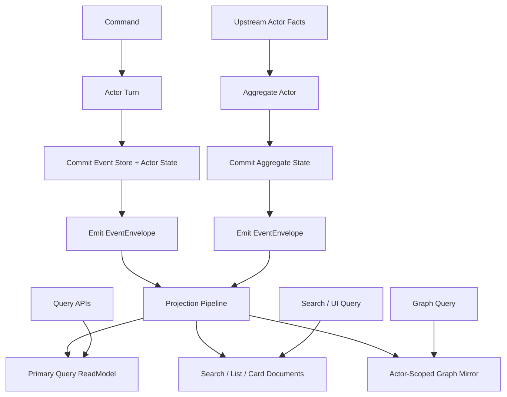
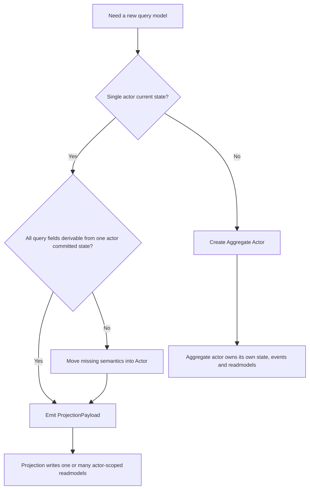
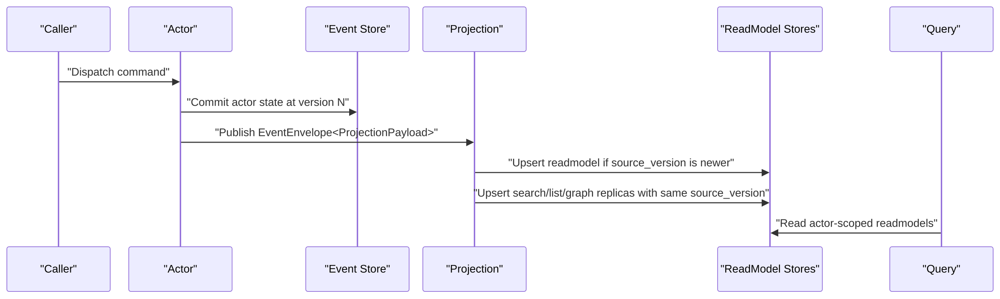

# Actor-State Mirror ReadModel 重构实施蓝图（2026-03-15）

## 1. 文档元信息

- 状态：`Proposed`
- 版本：`R2`
- 日期：`2026-03-15`
- 原则：`删除优于兼容`
- 目标：把现有通用 event-reducer projection 框架，收敛成“以 actor 已提交状态为强事实源、以 readmodel 为唯一查询面、统一通过 `EventEnvelope<ProjectionPayload>` 物化的 projection 框架”
- 关联文档：
  - `docs/architecture/2026-03-15-cqrs-projection-readmodels-architecture.md`
  - `AGENTS.md`

## 2. 执行摘要

本轮重构后的目标架构不是：

- `one actor -> one readmodel`
- `readmodel` 自己再按 event 计算一份当前态
- 用通用 `history/aggregate projection` 长期承载业务语义

本轮重构后的目标架构是：

- `one authoritative actor state -> zero or many actor-scoped current-state readmodels`
- 所有查询仍然只走 `readmodel`
- 对有明确消费场景的当前态查询，可由 actor 的已提交 `state` 计算出强类型 `ProjectionPayload`，再通过 `EventEnvelope` 物化为 readmodel
- `readmodel` 根概念本身就只保留给 actor-scoped current-state replica；不符合者不再叫 readmodel
- `projection` 只负责复制、校验、索引、分发，不再承担第二套业务计算
- 跨 actor 聚合必须建模为新的 `aggregate actor`
- `history / audit / analytics / report` 不再作为默认 readmodel；要么降级为 artifact/export，要么由专门 actor 拥有

一句话结论：

`Actor owns truth. Projection only replicates truth. Aggregation must be actorized.`

## 3. 设计决策

### 3.1 权威事实源

系统唯一权威事实源是：

1. `actor` 的已提交业务状态
2. 与该状态一一对应的 `committed version`
3. 从该状态按需计算出来、并通过 `EventEnvelope` 发布的强类型 `ProjectionPayload`

不是权威事实源的东西：

1. `readmodel`
2. `projection reducer`
3. `query-time materialization`
4. 中间层临时缓存
5. `graph/document/index` store 内的派生副本

### 3.1.1 业务消息语义与查询语义分离

必须明确区分两条不同语义：

1. 业务消息语义
   - 例子：`actor1 -> event envelope A -> actor2 -> event envelope B -> actor1`
   - 这是 actor 与 actor 之间的业务协议
   - 协议语义由参与 actor 自行协商
   - 一致性要求是：
     - 某条消息是否被接收
     - 某个 actor turn 是否 committed
     - 某个 reply / continuation 是否到达
     - 某个业务阶段是否完成

2. 查询语义
   - 例子：`actor3 -> query -> actor2 readmodel`
   - 这是对 actor2 已提交事实的读取
   - 查询语义由 readmodel 契约定义
   - 一致性要求是：
     - 某个 `StateVersion` 是否已物化可见
     - 查询结果是否最终一致但诚实
     - 查询返回是否明确自己的版本水位

因此本轮重构要求：

1. 业务消息链路继续由 actor 协议处理，不通过 query/readmodel 模拟 reply
2. 查询链路继续只走 readmodel，不向 actor 协议偷取“强完成”语义
3. 两条链路的 ACK、完成判定、时延预期、一致性承诺必须分开建模

### 3.1.2 `EventEnvelope` 是唯一投影传输壳

Projection 主链只保留一种 transport envelope：

1. 业务消息与投影消息都统一使用 `EventEnvelope`
2. 是否属于投影消息，只由 `EventEnvelope.Payload` 的强类型契约决定
3. 当前态 readmodel 的标准输入是 `EventEnvelope<ProjectionPayload>`
4. 不再引入额外的投影专用包络层

其中：

1. `ProjectionPayload` 表示 actor 在 committed 之后，基于权威状态计算出的投影输入
2. `state mirror payload` 是 `ProjectionPayload` 的一种特例
3. projector GAgent 解包 payload 后，按消费场景物化一个或多个 readmodel

### 3.2 一个 actor 可以有多个 readmodel

这里要明确修正先前过度收紧的说法。

正确约束不是 `one actor -> one readmodel`，也不是“每个 actor 必有一个 state mirror”，而是：

- `one authoritative actor state -> zero or many actor-scoped readmodels`

允许存在多份 readmodel，例如：

1. `primary query readmodel`
2. `search index document`
3. `graph mirror`
4. `list/card summary document`

但这些 readmodel 必须同时满足：

1. 它们都只表达同一个 actor 当前态的不同查询形态
2. 它们都来自同一个 actor 的 committed state，以及由此产生的 `EventEnvelope<ProjectionPayload>`
3. 它们都带同一个 `StateVersion`
4. 它们不能各自再推导出第二套业务状态机

新增 readmodel 还必须满足：

1. 必须声明明确消费场景，例如 API query、UI card/list、search index、graph traversal
2. 必须声明消费方或入口，例如具体 query reader、application service、host endpoint、页面模块
3. 必须说明为什么现有 readmodel 不能直接复用
4. 没有稳定消费场景的 readmodel 不得新增

如果某个 actor 没有稳定查询消费场景，则：

1. 不必为它新增 readmodel
2. 不必为它单独定义 `state mirror payload`
3. 仍然保留 `actor -> EventEnvelope<business payload or projection payload> -> downstream actor/readmodel` 的主链即可

这条规则还意味着：

1. 不再保留“宽松 readmodel 基类”给历史/报表对象挂靠
2. 凡是不满足 actor-scoped current-state 约束的对象，都不再算 readmodel
3. 这类对象要么改成 `artifact/export/log`，要么回到 `aggregate actor`

### 3.3 聚合必须 actor 化

以下语义不再允许继续落在“通用 readmodel projection”里：

1. 跨 actor 汇总
2. 跨 actor 关联
3. 跨 actor 统计
4. 跨 actor 业务编排结果

这些语义如果是稳定业务事实，必须转成新的 `aggregate actor`：

- 它自己消费上游业务事实或 projection payload
- 它自己维护权威状态
- 它自己按需发布 `EventEnvelope<ProjectionPayload>`
- 它自己拥有 readmodel

### 3.4 正常路径与修复路径分离

正常线上路径禁止：

1. query-time replay
2. query-time priming
3. query-time “先刷新 readmodel 再返回”
4. 读侧临时回 event store 重建状态

允许 replay / rebuild 的场景只有：

1. 后台修复
2. schema 迁移
3. 灾难恢复
4. 数据补洞

这类能力属于 `repair pipeline`，不属于 query path。

## 4. 目标架构图

### 4.1 主体结构

### 4.2 边界判定图

### 4.3 时序图

## 5. 核心抽象

### 5.1 Projection Payload / State Mirror Payload

`ProjectionPayload` 是 actor 基于 committed state 计算出来、作为 `EventEnvelope.Payload` 发布给 projection 的强类型输入契约。  
其中 `state mirror payload` 只是“当前态 readmodel 可直接由 state 推导”时的一种特例，不是每个 actor 的必选项，更不是查询对象本身。

最低必须包含：

1. `ActorId`
2. `StateVersion`
3. `OccurredAtUtc`
4. `SchemaVersion`
5. `StateMirror` 或其他强类型 `ProjectionPayload`

建议同时包含：

1. `LastEventId`
2. `CommandId`
3. `CorrelationId`
4. `Revision / DefinitionId`

### 5.2 Actor-Scoped ReadModel

actor-scoped readmodel 必须满足：

1. 只服务单个 actor 当前态查询
2. 能被单个 `ProjectionPayload` 确定性推进
3. 持久化时保存 `ActorId + StateVersion`
4. 不依赖历史事件重算

### 5.3 主读模型与辅助读模型

同一个 actor 可以有多份 readmodel，但要区分：

1. `Primary Query ReadModel`
   - 当前态主查询文档
   - 最完整、最稳定
   - query/application 显式依赖它
2. `Auxiliary ReadModels`
   - search/list/card/graph 等派生查询形态
   - 仍由同一个 actor 的 committed state 与 `StateVersion` 驱动
   - 不能拥有超出 actor 当前态的新业务事实

### 5.4 Aggregate Actor

当需要跨 actor 语义时，必须显式新建 `aggregate actor`，而不是把逻辑塞到 projection 里。

`aggregate actor` 需要自己承担：

1. 事实归属
2. 顺序语义
3. 状态推进
4. 快照发布
5. 读模型物化

## 6. 强制契约

### 6.1 版本契约

每个 actor-scoped readmodel 必须保存：

1. `ActorId`
2. `StateVersion`
3. `OccurredAtUtc`
4. 可选 `LastEventId`

其中：

- `StateVersion` 必须等于该 actor 权威状态对应的 committed version
- 禁止使用本地 `projection counter`
- 禁止使用本地 `StateVersion++`

### 6.2 写入语义

所有 state-mirror readmodel 的正常写入语义统一为：

`monotonic overwrite by state version`

规则如下：

1. `incoming.version < stored.version`
   - 结果：`stale`
   - 行为：拒绝覆盖
2. `incoming.version == stored.version`
   - 若关键身份相同：`duplicate`
   - 若关键身份不同：`conflict`
3. `incoming.version > stored.version`
   - 结果：`applied`
   - 行为：直接覆盖

### 6.3 Query 契约

query 侧只允许：

1. 直接读已物化 readmodel
2. 返回该 readmodel 的 `StateVersion`
3. 如有需要，显式暴露“最后物化时间”

query 侧禁止：

1. 先读 event store 再临时算结果
2. 先启动 projection 再返回
3. 先回 actor 拉 state 再组装

### 6.4 State Mirror 契约边界

`state mirror payload` 必须面向查询语义建模，不得原样转储 actor 内部结构。

允许：

1. 按查询语义重命名字段
2. 删除内部运行态
3. 删除临时控制字段
4. 保留当前态所需的稳定业务字段

禁止：

1. 透出 actor 私有控制状态
2. 用 bag/JSON/`Any` 承载核心查询语义
3. 把执行期临时对象下沉到 readmodel 契约

## 7. 不再保留的旧设计

本轮重构后，以下设计视为待删除对象：

1. 读侧通过 reducer 从 domain event 重新拼出当前态
2. `workflow` 当前态与 timeline/report 混在同一个 readmodel 文档
3. `scripting` 在 projection 侧调用 `ReduceReadModel(...)`
4. query path 中任何 projection priming / activation / attach live sink
5. 把 `history / aggregate / analytics` 当成默认 readmodel 形态
6. 依赖 projector 读取“当前 readmodel 文档 + 当前事件”才能算出下一态

## 8. 分层改造任务

### 8.1 Abstractions

需要新增或收敛的抽象：

1. `ProjectionPayload / state mirror payload` 的统一强类型基模
2. 收紧后的 `IProjectionReadModel`
3. 条件写接口：
   - 按 `StateVersion` 单调覆盖
   - 返回 `Applied / Stale / Duplicate / Conflict`
4. 独立 readmodel projector 的分发契约

需要删除或弱化的抽象：

1. 以“事件 reducer”表达当前态生成的默认路径
2. 宽松的“只有 Id 就算 readmodel”根接口语义
3. 允许 query/read path 触发 projection 生命周期的抽象
4. 本地 projection counter 冒充 `StateVersion` 的模型
4. 本地 projection counter 冒充 state version 的模型
5. 用 `sink role` 偷偷表达主次顺序的 runtime 设计

### 8.2 Projection Runtime

运行时需要收敛成两件事：

1. 解包 `EventEnvelope<ProjectionPayload>`
2. 把同一份投影输入分发给多个独立的 actor-scoped readmodel projector

必须实现：

1. 每个 readmodel 独立按 `StateVersion` 条件覆盖
2. 同一 `EventEnvelope<ProjectionPayload>` 可驱动多个 projector 并行或顺序执行，但不再通过 `sink role` 表达主次
3. 某个辅助 readmodel 写失败，只标记该 readmodel 降级，不回滚其他已成功 readmodel
4. `Primary Query ReadModel` 是 query/application 层的显式依赖，不由 runtime sink 抽象隐式决定

不再承担：

1. 当前态业务规约
2. 历史补算
3. 读侧动态推导

### 8.3 Providers

所有 document provider 必须支持：

1. 基于 `StateVersion` 的条件 upsert
2. 幂等 duplicate 判定
3. stale/conflict 的稳定结果类型
4. 持久化 `StateVersion`

graph/index provider 的要求是：

1. 仍保存相同 `StateVersion`
2. 明确自己是辅助查询物化，不反向定义主事实
3. 失败时可重试或后台补偿

### 8.4 Workflow

`workflow` 的当前态路径必须改成：

1. 写侧 actor 直接发布 `WorkflowActorSnapshotCommitted`
2. projection 直接写 `WorkflowActorSnapshotDocument`
3. `card/list/graph` 由同一份 committed state 语义和同一 `StateVersion` 派生

需要新增：

1. `workflow` state-mirror proto
2. `WorkflowActorSnapshotDocument`
3. `WorkflowActorSnapshotProjector`
4. `WorkflowActorSnapshotDocumentMapper`
5. 基于 `StateVersion` 的 writer 逻辑

需要迁移的查询入口：

1. `GetActorSnapshotAsync(...)`
2. `GetActorProjectionStateAsync(...)`
3. `WorkflowRunDurableCompletionResolver`
4. `WorkflowRunFinalizeEmitter`
5. `WorkflowRunDetachedCleanupOutboxGAgent`

需要删除或降级：

1. 旧 `WorkflowExecutionReportArtifactProjector` 的当前态职责；现已前移为 `WorkflowRunInsightBridgeProjector -> WorkflowRunInsightGAgent -> WorkflowRunInsightReadModelProjector`
2. `WorkflowExecutionReportArtifactMutations.cs` 中旧的本地版本推进逻辑
3. 当前态与 timeline/report 混写模式

### 8.5 Scripting

`scripting` 的当前态路径必须改成：

1. 写侧直接发布 `ScriptReadModelSnapshotCommitted`
2. projection 直接写 `ScriptReadModelDocument`
3. native document / native graph 都只消费统一的 readmodel 投影输入

需要新增：

1. `scripting` state-mirror proto
2. projection-payload projector
3. 基于 `StateVersion` 的覆盖写

需要删除：

1. projection 侧 `ReduceReadModel(...)` 当前态路径
2. `ScriptExecutionProjectionContext.CurrentSemanticReadModelDocument`
3. native projector 对 `CurrentSemanticReadModelDocument` 的依赖
4. projection 读路径中的 priming 残留

### 8.6 Docs / Guards / Tests

需要同步完成：

1. `AGENTS.md` 与架构文档一致
2. 新增或更新 guard，禁止：
   - query-time priming
   - current-state projector 读取旧 readmodel 做 reducer
   - 本地 `StateVersion++` 冒充权威 `StateVersion`
3. 为 `Applied / Stale / Duplicate / Conflict` 增加 provider tests
4. 为 `workflow / scripting` 增加 state-mirror 路径集成测试

## 9. 迁移步骤

### Phase 0：收紧规则

1. 更新 `AGENTS.md`
2. 更新架构文档
3. 增加 query-time priming guard
4. 增加 state-mirror current-state guard

完成标准：

- 新代码不能继续走旧方向

### Phase 1：打基础设施底座

1. 引入 readmodel 条件写结果模型
2. provider 实现 `StateVersion` 条件覆盖
3. projection 分发改为“同一 `EventEnvelope<ProjectionPayload>` -> 多个独立 readmodel projector”

完成标准：

- state-mirror readmodel 写入具备稳定结果语义

### Phase 2：Workflow 当前态迁移

1. 写侧发布 workflow `EventEnvelope<ProjectionPayload>`
2. 新建 workflow 主查询 readmodel 与 projector
3. 查询入口全部切到新的 workflow readmodel
4. 旧 mixed report model 退化为 artifact/history

完成标准：

- workflow 当前态查询不再依赖 reducer 链

### Phase 3：Scripting 当前态迁移

1. 写侧发布 scripting `EventEnvelope<ProjectionPayload>`
2. 语义 readmodel 改为直接覆盖
3. native document / graph 改为 projection-payload 驱动
4. 删除 projection 侧 `ReduceReadModel` 当前态路径

完成标准：

- scripting 当前态查询不再依赖旧 readmodel 增量规约

### Phase 4：删除旧框架残余

1. 删除默认 history/aggregate current-state projection 思路
2. 删除通用 current-state reducer 路径
3. 清理过时 readmodel / projector / mapper / proto
4. 清理不再需要的兼容分支

完成标准：

- projection 框架语义收敛为 state-mirror replication framework

## 10. 门禁要求

必须新增或强化以下门禁：

1. 禁止 query/read path 触发 priming / activation / ensure projection
2. 禁止 current-state projector 依赖“读旧文档 + 当前事件”规约当前态
3. 禁止本地 `StateVersion++` 出现在 current-state readmodel 路径
4. 禁止新增通用 `history/aggregate view` 作为默认 readmodel
5. 要求 actor-scoped readmodel 持久化 `StateVersion`

## 11. 验收标准

当且仅当下面条件全部满足，本轮重构才算完成：

1. `workflow` 当前态查询全部读取新的 workflow readmodel
2. `scripting` 当前态查询全部读取新的 scripting readmodel
3. query path 中不存在 replay / priming / refresh 逻辑
4. provider 层支持 `Applied / Stale / Duplicate / Conflict`
5. 当前态 readmodel 的版本全部来自权威 actor committed version
6. 旧 event-reducer current-state 路径已删除
7. 新 guard 已进入 CI
8. `dotnet build aevatar.slnx --nologo`
9. `dotnet test aevatar.slnx --nologo`
10. `bash tools/ci/architecture_guards.sh`

## 12. 风险与取舍

### 12.1 主要收益

1. 权威事实源唯一
2. readmodel 语义明显变简单
3. 当前态查询不再依赖第二套业务规约
4. projection 并发面显著收窄
5. `workflow` 与 `scripting` 会收敛到同一条架构主干

### 12.2 明确代价

1. actor 需要更早产出查询语义快照
2. 某些原本依赖 reducer 的字段要回收到 actor 内计算
3. 历史/报表/分析需求必须重新归位
4. 旧实现可以直接删，不再维持兼容

### 12.3 风险控制

1. 先迁当前态主查询，再删旧路径
2. 先迁主查询 readmodel，再补辅助 readmodel
3. 所有 actor-scoped readmodel 统一带 `StateVersion`
4. 以门禁约束防止旧设计回流

## 13. 最终落点

重构完成后的框架定义应该非常简单：

1. actor 拥有业务真相
2. actor 发布强类型当前态快照
3. projection 把同一份快照复制成多个 actor-scoped readmodels
4. 聚合语义通过 aggregate actor 获得
5. replay 只属于修复，不属于查询

这不是对旧 CQRS projection 细节的局部修补，而是把框架主语义改回：

`authoritative actor state + state-mirror replication + actorized aggregation`
