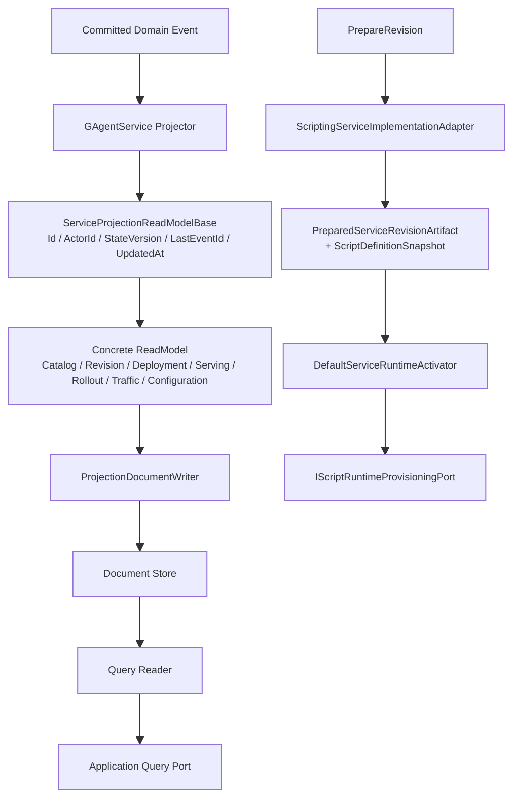

# GAgentService 适配 ReadModel 系统重构详细设计（2026-03-16）

## 1. 文档元信息

- 状态：`Proposed`
- 版本：`R1`
- 日期：`2026-03-16`
- 适用范围：
  - `src/platform/Aevatar.GAgentService.*`
  - `src/platform/Aevatar.GAgentService.Governance.*`
  - `src/Aevatar.Scripting.*`
  - `src/Aevatar.CQRS.Projection.Stores.Abstractions`
- 关联文档：
  - [2026-03-15-readmodel-system-refactor-detailed-design.md](/Users/cookie/aevatar/docs/architecture/2026-03-15-readmodel-system-refactor-detailed-design.md)
  - [2026-03-15-readmodel-query-capability-refactor-detailed-design.md](/Users/cookie/aevatar/docs/architecture/2026-03-15-readmodel-query-capability-refactor-detailed-design.md)
  - [2026-03-15-gagent-service-phase-3-serving-rollout-blueprint.md](/Users/cookie/aevatar/docs/architecture/2026-03-15-gagent-service-phase-3-serving-rollout-blueprint.md)

## 2. 文档定位

本文不是重新定义 `ReadModel System`，而是定义 `GAgentService` 如何完整适配 2026-03-15 的 readmodel 重构。

本轮适配要解决三类问题：

1. `IProjectionReadModel` 契约升级后，`GAgentService` 读模型仍停留在旧接口。
2. `Scripting` 运行时 provisioning 接口升级后，`GAgentService` 的 artifact 和 activator 主链缺失必要事实。
3. `GAgentService` 现有 projection/query/projector 还没有完全切换到新的 readmodel 语义，存在“业务数据”和“projection 戳”建模不一致的问题。

目标不是“编译过掉”，而是把 `GAgentService` 重新收敛到新的 read侧架构主线。

## 3. 当前断点

### 3.1 直接编译断点

当前合并后 `dotnet test aevatar.slnx --nologo` 暴露出两组硬错误：

1. [DefaultServiceRuntimeActivator.cs](/Users/cookie/aevatar/src/platform/Aevatar.GAgentService.Infrastructure/Activation/DefaultServiceRuntimeActivator.cs) 仍按旧签名调用 `IScriptRuntimeProvisioningPort.EnsureRuntimeAsync(...)`。
2. 下列 read model 不再满足新的 [IProjectionReadModel.cs](/Users/cookie/aevatar/src/Aevatar.CQRS.Projection.Stores.Abstractions/Abstractions/ReadModels/IProjectionReadModel.cs) 契约：
   - [ServiceCatalogReadModel.cs](/Users/cookie/aevatar/src/platform/Aevatar.GAgentService.Projection/ReadModels/ServiceCatalogReadModel.cs)
   - [ServiceDeploymentCatalogReadModel.cs](/Users/cookie/aevatar/src/platform/Aevatar.GAgentService.Projection/ReadModels/ServiceDeploymentCatalogReadModel.cs)
   - [ServiceRevisionCatalogReadModel.cs](/Users/cookie/aevatar/src/platform/Aevatar.GAgentService.Projection/ReadModels/ServiceRevisionCatalogReadModel.cs)
   - [ServiceRolloutReadModel.cs](/Users/cookie/aevatar/src/platform/Aevatar.GAgentService.Projection/ReadModels/ServiceRolloutReadModel.cs)
   - [ServiceServingSetReadModel.cs](/Users/cookie/aevatar/src/platform/Aevatar.GAgentService.Projection/ReadModels/ServiceServingSetReadModel.cs)
   - [ServiceTrafficViewReadModel.cs](/Users/cookie/aevatar/src/platform/Aevatar.GAgentService.Projection/ReadModels/ServiceTrafficViewReadModel.cs)
   - [ServiceConfigurationReadModel.cs](/Users/cookie/aevatar/src/platform/Aevatar.GAgentService.Governance.Projection/ReadModels/ServiceConfigurationReadModel.cs)

### 3.2 架构性断点

如果只补字段，不改结构，还会留下三个更深的问题：

1. `ActorId / StateVersion / LastEventId / UpdatedAt` 会被各 read model 继续随意复制，重复逻辑再次扩散。
2. `PreparedServiceRevisionArtifact` 里没有携带 scripting runtime 激活真正需要的 definition snapshot，导致 activator 需要重新侧读。
3. governance / lifecycle / serving 三组 projector 还没有统一采用“canonical document + projection stamp”的写法。

## 4. 重构目标

本轮实施必须满足以下目标：

1. `GAgentService` 所有 canonical read model 全量适配新的 `IProjectionReadModel` 契约。
2. projection 戳字段采用统一实现，不允许每个 read model 各自重复手写一套无约束成员。
3. `Scripting` runtime 激活必须只依赖 `PreparedServiceRevisionArtifact + command input`，不得在 activator 中重新侧读 definition actor。
4. `projector -> reader -> application query` 主链继续保持 CQRS 纯净，不把 query-time priming 或 actor side-read 带回来。
5. 文档、代码、测试、CI 门禁同步闭合。

## 5. 核心设计决议

### 5.1 为 GAgentService 引入统一的 Projection ReadModel 基类

`GAgentService` 这一组 read model 都是平台控制面的 canonical document，具有稳定、同构的 projection 戳：

- `Id`
- `ActorId`
- `StateVersion`
- `LastEventId`
- `UpdatedAt`

这类重复字段不再让每个 read model 各自声明，而是收敛到平台内部抽象基类：

```text
ServiceProjectionReadModelBase
  - Id
  - ActorId
  - StateVersion
  - LastEventId
  - UpdatedAt
```

然后：

- `ServiceCatalogReadModel`
- `ServiceRevisionCatalogReadModel`
- `ServiceDeploymentCatalogReadModel`
- `ServiceServingSetReadModel`
- `ServiceRolloutReadModel`
- `ServiceTrafficViewReadModel`
- `ServiceConfigurationReadModel`

统一继承该基类。

### 5.2 基类只放 projection stamp，不放业务数据

此基类不是新的“万能平台对象”，只表达 projection 戳。

禁止把：

- `TenantId`
- `ServiceId`
- `DeploymentId`
- `Bindings`
- `Endpoints`
- `Policies`

这些业务字段继续上提到基类。

因此这里采用的是：

- `Template Method` 不适合
- `业务继承树` 不需要
- `最窄共性基类` 合适

### 5.3 Scripting artifact 必须补全激活事实

当前 [ScriptingServiceDeploymentPlan](/Users/cookie/aevatar/src/platform/Aevatar.GAgentService.Abstractions/Protos/service_artifact.proto) 只携带：

- `script_id`
- `revision`
- `definition_actor_id`
- `source_hash`
- `package_spec`

但新的 [IScriptRuntimeProvisioningPort.cs](/Users/cookie/aevatar/src/Aevatar.Scripting.Core/Ports/IScriptRuntimeProvisioningPort.cs) 需要：

- `definition_actor_id`
- `script_revision`
- `runtime_actor_id`
- `ScriptDefinitionSnapshot`
- `CancellationToken`

这说明当前 `PreparedServiceRevisionArtifact` 仍然不够“prepared”。

本轮决议：

1. `PreparedServiceRevisionArtifact` 对 scripting 路径增加 `script_definition_snapshot`。
2. `ScriptingServiceImplementationAdapter` 在准备 revision 时即写入该 snapshot。
3. `DefaultServiceRuntimeActivator` 只消费 artifact 中的 snapshot，不再回查 definition actor。

### 5.4 不把完整 snapshot 展平为临时字段

`ScriptDefinitionSnapshot` 是强类型事实，不应该被拆成零散字符串重新塞回 artifact。

因此这里直接采用：

- `typed sub-message` 进入 `PreparedServiceRevisionArtifact`

而不是：

- `definition_schema_hash`
- `runtime_semantics_blob`
- `package_sources_json`

这种信息回退。

### 5.5 Reader / Projector 不额外引入中间 assembler 层

这轮不新增一个平台级 `ReadModelAssembler` 中间层。

原因：

1. 当前 projector 已经是权威 document 构建点。
2. `GAgentService` 读模型数量有限。
3. 新增 assembler 只会再多一层空转发。

因此 projector 直接负责：

- 读取现有 document
- 应用 committed fact
- 更新业务字段
- 更新 projection stamp

## 6. 目标架构图



## 7. 详细设计

### 7.1 抽象层

#### 7.1.1 `PreparedServiceRevisionArtifact`

文件：
- [service_artifact.proto](/Users/cookie/aevatar/src/platform/Aevatar.GAgentService.Abstractions/Protos/service_artifact.proto)

变更：

1. 为 scripting 路径新增 `script_definition_snapshot` typed 字段。
2. 该字段只在 `implementation_kind = scripting` 时使用。
3. 不新增 bag，不新增 `bytes arbitrary_payload`。

建议结构：

```proto
message PreparedServiceRevisionArtifact {
  ServiceIdentity identity = 1;
  string revision_id = 2;
  ServiceImplementationKind implementation_kind = 3;
  string artifact_hash = 4;
  repeated ServiceEndpointDescriptor endpoints = 5;
  ServiceDeploymentPlan deployment_plan = 6;
  bytes protocol_descriptor_set = 7;
  aevatar.scripting.ScriptDefinitionSnapshot script_definition_snapshot = 8;
}
```

#### 7.1.2 `ServiceProjectionReadModelBase`

新增文件建议：
- `src/platform/Aevatar.GAgentService.Projection/ReadModels/ServiceProjectionReadModelBase.cs`
- `src/platform/Aevatar.GAgentService.Governance.Projection/ReadModels/ServiceProjectionReadModelBase.cs`

更优方案是只定义一份共享基类，放在：
- `src/platform/Aevatar.GAgentService.Projection/ReadModels/ServiceProjectionReadModelBase.cs`

再让 governance read model 直接引用。

基类职责：

```csharp
public abstract class ServiceProjectionReadModelBase : IProjectionReadModel
{
    public string Id { get; set; } = string.Empty;
    public string ActorId { get; set; } = string.Empty;
    public long StateVersion { get; set; }
    public string LastEventId { get; set; } = string.Empty;
    public DateTimeOffset UpdatedAt { get; set; }

    protected void CopyProjectionStampTo(ServiceProjectionReadModelBase target) { ... }
}
```

设计判断：

- 这里使用继承是合理的，因为字段完全同构且语义稳定。
- 不引入泛型基类。
- 不把 `DeepClone()` 抽到接口默认实现，避免 clone 逻辑被隐藏和弱化。

### 7.2 Infrastructure

#### 7.2.1 `ScriptingServiceImplementationAdapter`

文件：
- [ScriptingServiceImplementationAdapter.cs](/Users/cookie/aevatar/src/platform/Aevatar.GAgentService.Infrastructure/Adapters/ScriptingServiceImplementationAdapter.cs)

实施：

1. 在 `PrepareRevisionAsync(...)` 中保留当前 `_definitionSnapshotPort.GetRequiredAsync(...)`。
2. 组装 `PreparedServiceRevisionArtifact` 时写入 `ScriptDefinitionSnapshot`。
3. `ProtocolDescriptorSet` 继续来自 snapshot，不重复提取。

#### 7.2.2 `DefaultServiceRuntimeActivator`

文件：
- [DefaultServiceRuntimeActivator.cs](/Users/cookie/aevatar/src/platform/Aevatar.GAgentService.Infrastructure/Activation/DefaultServiceRuntimeActivator.cs)

实施：

1. `ActivateScriptingAsync(...)` 改为从 `request.Artifact.ScriptDefinitionSnapshot` 读取 snapshot。
2. 调用新的 `EnsureRuntimeAsync(...)` 五参版本。
3. 如果 artifact 缺失 snapshot，直接抛出 `InvalidOperationException`，不允许 activator 回退去侧读。

目标实现：

```text
artifact missing snapshot => fail fast
artifact has snapshot => provision runtime
```

### 7.3 Projection

#### 7.3.1 生命周期读模型

文件：
- [ServiceCatalogReadModel.cs](/Users/cookie/aevatar/src/platform/Aevatar.GAgentService.Projection/ReadModels/ServiceCatalogReadModel.cs)
- [ServiceRevisionCatalogReadModel.cs](/Users/cookie/aevatar/src/platform/Aevatar.GAgentService.Projection/ReadModels/ServiceRevisionCatalogReadModel.cs)
- [ServiceDeploymentCatalogReadModel.cs](/Users/cookie/aevatar/src/platform/Aevatar.GAgentService.Projection/ReadModels/ServiceDeploymentCatalogReadModel.cs)
- [ServiceServingSetReadModel.cs](/Users/cookie/aevatar/src/platform/Aevatar.GAgentService.Projection/ReadModels/ServiceServingSetReadModel.cs)
- [ServiceRolloutReadModel.cs](/Users/cookie/aevatar/src/platform/Aevatar.GAgentService.Projection/ReadModels/ServiceRolloutReadModel.cs)
- [ServiceTrafficViewReadModel.cs](/Users/cookie/aevatar/src/platform/Aevatar.GAgentService.Projection/ReadModels/ServiceTrafficViewReadModel.cs)

实施：

1. 全部改为继承 `ServiceProjectionReadModelBase`。
2. `DeepClone()` 中必须复制 projection stamp。
3. projector 更新时统一写：
   - `Id`
   - `ActorId`
   - `StateVersion`
   - `LastEventId`
   - `UpdatedAt`

#### 7.3.2 Governance 读模型

文件：
- [ServiceConfigurationReadModel.cs](/Users/cookie/aevatar/src/platform/Aevatar.GAgentService.Governance.Projection/ReadModels/ServiceConfigurationReadModel.cs)

实施：

1. 同样继承 `ServiceProjectionReadModelBase`。
2. 保持当前 typed 结构：
   - `Identity`
   - `Bindings`
   - `Endpoints`
   - `Policies`
3. 不退回字符串 key，不新增 `Metadata`。

### 7.4 Projector 写入规则

projector 统一采用以下更新模式：

1. 根据 actor 语义生成稳定 `Id`
2. `ActorId` 直接记录权威 actor id
3. `StateVersion` 来自 committed event envelope / committed state version
4. `LastEventId` 来自当前 committed event
5. `UpdatedAt` 来自 event occurred time；若无则用 envelope timestamp

这组字段必须在所有 canonical read model 上保持同一含义。

## 8. 设计模式与 OO 决策

### 8.1 使用的模式

1. `Strategy`
   - `IServiceImplementationAdapter`
   - `static / scripting / workflow` 仍采用适配策略
2. `Template through shared base state`
   - `ServiceProjectionReadModelBase`
3. `Projector`
   - committed fact -> read model
4. `Fail-fast invariant`
   - activator 缺少 scripting snapshot 时直接失败

### 8.2 不使用的模式

1. 不引入新的 `Builder` 层来拼 read model
2. 不引入 `Repository + Mapper + Assembler` 三连层
3. 不引入泛型 `ProjectionReadModelBase<TSelf>`，当前价值不足

## 9. 文件级实施清单

### 9.1 新增

- `src/platform/Aevatar.GAgentService.Projection/ReadModels/ServiceProjectionReadModelBase.cs`

### 9.2 修改

- [service_artifact.proto](/Users/cookie/aevatar/src/platform/Aevatar.GAgentService.Abstractions/Protos/service_artifact.proto)
- [ScriptingServiceImplementationAdapter.cs](/Users/cookie/aevatar/src/platform/Aevatar.GAgentService.Infrastructure/Adapters/ScriptingServiceImplementationAdapter.cs)
- [DefaultServiceRuntimeActivator.cs](/Users/cookie/aevatar/src/platform/Aevatar.GAgentService.Infrastructure/Activation/DefaultServiceRuntimeActivator.cs)
- [ServiceCatalogReadModel.cs](/Users/cookie/aevatar/src/platform/Aevatar.GAgentService.Projection/ReadModels/ServiceCatalogReadModel.cs)
- [ServiceRevisionCatalogReadModel.cs](/Users/cookie/aevatar/src/platform/Aevatar.GAgentService.Projection/ReadModels/ServiceRevisionCatalogReadModel.cs)
- [ServiceDeploymentCatalogReadModel.cs](/Users/cookie/aevatar/src/platform/Aevatar.GAgentService.Projection/ReadModels/ServiceDeploymentCatalogReadModel.cs)
- [ServiceServingSetReadModel.cs](/Users/cookie/aevatar/src/platform/Aevatar.GAgentService.Projection/ReadModels/ServiceServingSetReadModel.cs)
- [ServiceRolloutReadModel.cs](/Users/cookie/aevatar/src/platform/Aevatar.GAgentService.Projection/ReadModels/ServiceRolloutReadModel.cs)
- [ServiceTrafficViewReadModel.cs](/Users/cookie/aevatar/src/platform/Aevatar.GAgentService.Projection/ReadModels/ServiceTrafficViewReadModel.cs)
- [ServiceConfigurationReadModel.cs](/Users/cookie/aevatar/src/platform/Aevatar.GAgentService.Governance.Projection/ReadModels/ServiceConfigurationReadModel.cs)
- 所有对应 projector
- 所有对应 read model tests
- `Aevatar.GAgentService.*` 相关 integration tests

### 9.3 删除

本轮不新增兼容壳，因此：

- 不新增旧接口 shim
- 不新增 activator 回退 reader
- 不新增 per-readmodel projection stamp helper 复制函数

## 10. 测试方案

### 10.1 单元测试

必须补：

1. `ScriptingServiceImplementationAdapter` 产出的 artifact 含 snapshot
2. `DefaultServiceRuntimeActivator` 会把 snapshot 传给 `EnsureRuntimeAsync(...)`
3. 每个 read model 的 `DeepClone()` 会复制 projection stamp
4. 每个 projector 在 committed event 后都会更新：
   - `ActorId`
   - `StateVersion`
   - `LastEventId`
   - `UpdatedAt`

### 10.2 集成测试

必须补：

1. `ServiceRevision -> Deployment -> ActivateScripting` 全链闭环
2. `ServiceCatalog / ServiceConfiguration / Serving / Rollout / Traffic` 查询结果都携带稳定 projection stamp
3. `dotnet test aevatar.slnx --nologo` 全量通过

### 10.3 门禁

提交前必须通过：

- `dotnet build aevatar.slnx --nologo`
- `dotnet test aevatar.slnx --nologo`
- `bash tools/ci/architecture_guards.sh`
- `bash tools/ci/test_stability_guards.sh`
- `bash tools/ci/projection_route_mapping_guard.sh`

## 11. 实施顺序

### 11.1 Step 1

先改 proto 和 artifact 装配：

1. `service_artifact.proto`
2. regenerate generated code
3. `ScriptingServiceImplementationAdapter`
4. `DefaultServiceRuntimeActivator`

### 11.2 Step 2

再引入 `ServiceProjectionReadModelBase`，统一改所有 read model。

### 11.3 Step 3

逐个修 projector 和 query reader，确保 projection stamp 一致。

### 11.4 Step 4

补测试并跑全量门禁。

## 12. 完成态

只有同时满足以下条件，才算本轮适配完成：

1. `dotnet test aevatar.slnx --nologo` 通过
2. `GAgentService` 所有 canonical read model 实现新 `IProjectionReadModel`
3. `DefaultServiceRuntimeActivator` 不再使用旧 scripting provisioning 调用方式
4. `PreparedServiceRevisionArtifact` 对 scripting 路径携带完整 definition snapshot
5. 没有新增兼容壳、临时 bag、字符串化语义回退

