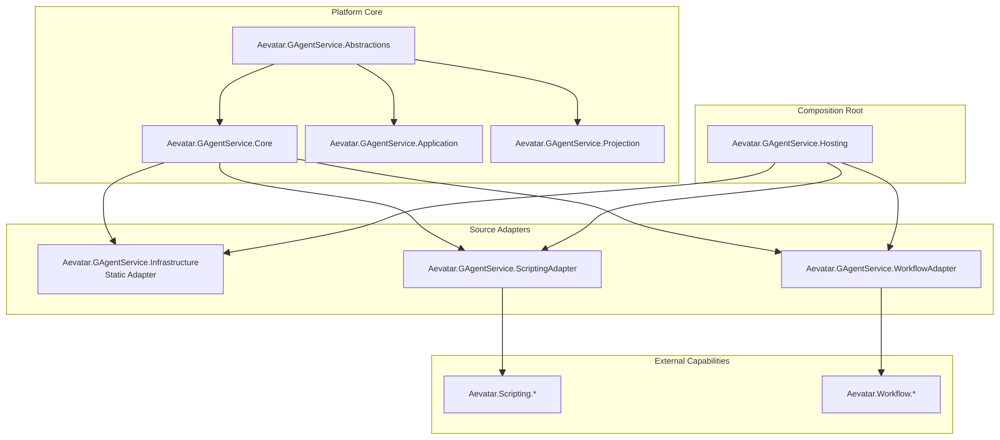
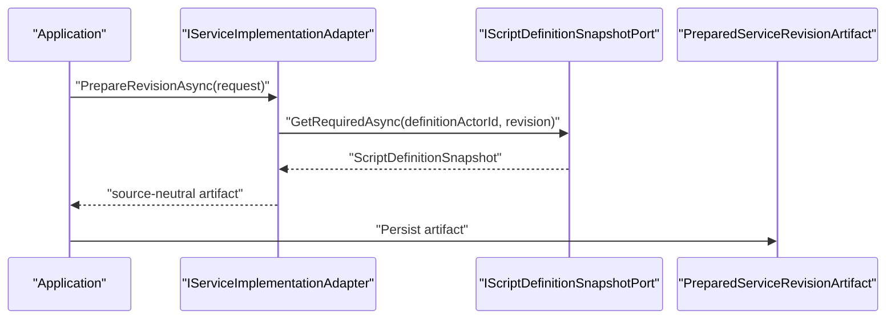
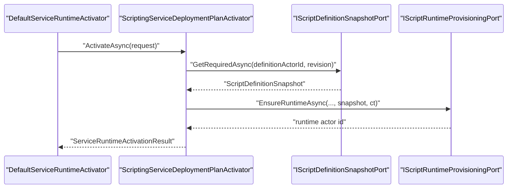

# GAgentService Source Adapter 解耦重构详细设计（2026-03-16）

## 1. 文档元信息

- 状态：`Proposed`
- 版本：`R1`
- 日期：`2026-03-16`
- 适用范围：
  - `src/platform/Aevatar.GAgentService.*`
  - `src/Aevatar.Scripting.*`
  - `src/workflow/Aevatar.Workflow.*`
- 关联文档：
  - [2026-03-14-gagent-as-a-service-platform-blueprint.md](/Users/cookie/aevatar/docs/architecture/2026-03-14-gagent-as-a-service-platform-blueprint.md)
  - [2026-03-15-gagent-service-slimming-refactor-blueprint.md](/Users/cookie/aevatar/docs/architecture/2026-03-15-gagent-service-slimming-refactor-blueprint.md)
  - [2026-03-16-gagent-service-readmodel-adaptation-detailed-design.md](/Users/cookie/aevatar/docs/architecture/2026-03-16-gagent-service-readmodel-adaptation-detailed-design.md)
  - `AGENTS.md`

## 2. 一句话结论

`Aevatar.GAgentService` 不应当在平台核心层强依赖 `scripting/workflow`。正确结构应当是：

- `GAgentService` 核心层保持 `source-neutral`
- `scripting/workflow/static` 作为 `source adapters`
- `Infrastructure/Hosting` 负责装配 adapters
- `Abstractions/Core/Application/Projection` 不得直接引用 `Aevatar.Scripting.*` 或 `Aevatar.Workflow.*`

当前实现里，`Infrastructure/Hosting` 对 `scripting/workflow` 的依赖是合理的；`Abstractions` 对 `scripting` 的依赖是不合理的，应当删除。

## 3. 问题定义

### 3.1 当前错误依赖

目前存在以下结构性问题：

1. [Aevatar.GAgentService.Abstractions.csproj](/Users/cookie/aevatar/src/platform/Aevatar.GAgentService.Abstractions/Aevatar.GAgentService.Abstractions.csproj) 直接引用了 `Aevatar.Scripting.Abstractions`。
2. [service_artifact.proto](/Users/cookie/aevatar/src/platform/Aevatar.GAgentService.Abstractions/Protos/service_artifact.proto) 直接导入 `script_projection_snapshots.proto`，并把 `ScriptDefinitionSnapshot` 放进 `PreparedServiceRevisionArtifact`。
3. `PreparedServiceRevisionArtifact` 作为平台公共 artifact，开始承载 source-specific 强类型对象。

这会带来四个问题：

1. 平台 `Abstractions` 被 `scripting` 污染。
2. `Core/Application/Projection` 被迫沿着 `Abstractions` 间接 source-aware。
3. `PreparedServiceRevisionArtifact` 不再是统一资源模型，而是“平台模型 + scripting 特例”。
4. 后续接入更多来源时，平台核心会继续膨胀成 `oneof source-specific payload bag`。

### 3.2 什么依赖是合理的

以下依赖是合理的：

1. [Aevatar.GAgentService.Infrastructure.csproj](/Users/cookie/aevatar/src/platform/Aevatar.GAgentService.Infrastructure/Aevatar.GAgentService.Infrastructure.csproj) 引用 `Aevatar.Scripting.*` 与 `Aevatar.Workflow.Application.Abstractions`
2. [Aevatar.GAgentService.Hosting.csproj](/Users/cookie/aevatar/src/platform/Aevatar.GAgentService.Hosting/Aevatar.GAgentService.Hosting.csproj) 引用 `Aevatar.Scripting.Hosting` 与 `Aevatar.Workflow.Infrastructure`

原因：

1. `Infrastructure` 是 source adapter 的着陆层。
2. `Hosting` 是组合根，本来就负责 capability bundle 装配。

### 3.3 什么依赖是不合理的

以下依赖不合理：

1. `Abstractions -> Scripting`
2. `Core -> Scripting/Workflow`
3. `Application -> Scripting/Workflow`
4. `Projection -> Scripting/Workflow`

原因：

1. 这些层应只认平台语义：
   - `ServiceDefinition`
   - `ServiceRevision`
   - `PreparedServiceRevisionArtifact`
   - `ServiceDeployment`
   - `ServiceServingSet`
   - `ServiceRollout`
2. 这些层不应关心 revision 的实现来源到底是 `static/script/workflow`。

## 4. 重构目标

### 4.1 必须达到的结果

1. `Aevatar.GAgentService.Abstractions` 不再引用 `Aevatar.Scripting.Abstractions`。
2. [service_artifact.proto](/Users/cookie/aevatar/src/platform/Aevatar.GAgentService.Abstractions/Protos/service_artifact.proto) 恢复为完全 source-neutral 的平台 proto。
3. `DefaultServiceRuntimeActivator` 不再直接需要 `ScriptDefinitionSnapshot` 这种 source-specific typed payload。
4. `scripting/workflow` 的 prepare/activate 差异收敛到 adapter/strategy 层。
5. 平台主对象 `PreparedServiceRevisionArtifact` 只表达统一平台事实，不表达来源实现细节。

### 4.2 明确不在本次解决

1. 不修改 `ServiceDefinition / ServiceRevision / ServiceDeployment / ServiceServingSet / ServiceRollout` 的服务资源模型。
2. 不回退现有 `GAgentService` 的 Phase 1/2/3 功能。
3. 不把 `scripting/workflow` 再抬成平台层一等模型。
4. 不为了“消灭依赖”而把 source-specific 逻辑塞回 `Host/API`。

## 5. 设计原则

### 5.1 Source-Neutral Core

平台核心只表达：

1. 服务身份
2. 服务版本
3. 统一 artifact
4. 部署与 serving 状态
5. 查询与投影视图

平台核心不表达：

1. `ScriptDefinitionSnapshot`
2. `WorkflowDefinitionSnapshot`
3. source-specific runtime semantics carrier

### 5.2 Source Adapter Is an Infrastructure Concern

来源适配是基础设施职责，而不是平台核心职责。

这意味着：

1. `scripting` 的 prepare/activate 逻辑在 adapter 层
2. `workflow` 的 prepare/activate 逻辑在 adapter 层
3. 平台核心只通过抽象调用

### 5.3 平台强类型与 source-specific 强类型分层

强类型不是问题，污染边界才是问题。

正确做法是：

1. 平台层保留平台 typed model
2. source adapter 层保留 source-specific typed model
3. 二者之间通过窄接口桥接

不正确的做法是：

1. 平台公共 proto 直接 import source-specific proto
2. 平台公共 artifact 携带 source-specific sub-message

### 5.4 策略组合优先于继承扩散

这类 source-specific 差异最适合：

1. `Strategy`
2. `Registry`
3. `Composition Root`

而不是：

1. 在平台核心对象上不断增加 `oneof source_spec`
2. 让 activator/adapter 继承出庞大类树

## 6. 目标态架构

### 6.1 分层图



### 6.2 依赖规则

#### 允许

1. `Hosting -> Infrastructure`
2. `Hosting -> ScriptingAdapter`
3. `Hosting -> WorkflowAdapter`
4. `ScriptingAdapter -> Aevatar.Scripting.*`
5. `WorkflowAdapter -> Aevatar.Workflow.*`

#### 禁止

1. `Abstractions -> Aevatar.Scripting.*`
2. `Abstractions -> Aevatar.Workflow.*`
3. `Core -> Aevatar.Scripting.*`
4. `Core -> Aevatar.Workflow.*`
5. `Application -> Aevatar.Scripting.*`
6. `Projection -> Aevatar.Workflow.*`

## 7. 详细设计

### 7.1 `PreparedServiceRevisionArtifact` 回归 source-neutral

文件：

- [service_artifact.proto](/Users/cookie/aevatar/src/platform/Aevatar.GAgentService.Abstractions/Protos/service_artifact.proto)

#### 当前问题

当前多了：

```proto
import "script_projection_snapshots.proto";
...
aevatar.scripting.coreports.ScriptDefinitionSnapshot script_definition_snapshot = 8;
```

这会把平台 artifact 变成 source-specific carrier。

#### 目标结构

`PreparedServiceRevisionArtifact` 只保留：

1. `identity`
2. `revision_id`
3. `implementation_kind`
4. `artifact_hash`
5. `endpoints`
6. `deployment_plan`
7. `protocol_descriptor_set`

即：

```proto
message PreparedServiceRevisionArtifact {
  ServiceIdentity identity = 1;
  string revision_id = 2;
  ServiceImplementationKind implementation_kind = 3;
  string artifact_hash = 4;
  repeated ServiceEndpointDescriptor endpoints = 5;
  ServiceDeploymentPlan deployment_plan = 6;
  bytes protocol_descriptor_set = 7;
}
```

#### 设计判断

`artifact` 是平台统一资源，不是运行时 source-specific scratchpad。

如果某个来源在激活时需要额外事实，应由：

1. source adapter 自己读取
2. 或 source adapter 自己缓存

而不是让平台 artifact 直接长出 source-specific 字段。

### 7.2 运行时激活改成 source-specific strategy

文件：

- [DefaultServiceRuntimeActivator.cs](/Users/cookie/aevatar/src/platform/Aevatar.GAgentService.Infrastructure/Activation/DefaultServiceRuntimeActivator.cs)

#### 当前问题

当前 `DefaultServiceRuntimeActivator` 既是：

1. 平台运行时激活总调度器
2. `static` 激活器
3. `scripting` 激活器
4. `workflow` 激活器

这会带来两类问题：

1. 平台 activator 被迫直接依赖 source-specific typed contract
2. 继续扩来源时会不断膨胀

#### 目标结构

新增内部策略接口：

- `IServiceDeploymentPlanActivator`

建议放在：

- `src/platform/Aevatar.GAgentService.Infrastructure/Activation/IServiceDeploymentPlanActivator.cs`

接口建议：

```csharp
internal interface IServiceDeploymentPlanActivator
{
    ServiceImplementationKind ImplementationKind { get; }

    Task<ServiceRuntimeActivationResult> ActivateAsync(
        ServiceRuntimeActivationRequest request,
        CancellationToken ct = default);
}
```

然后拆成：

1. `StaticServiceDeploymentPlanActivator`
2. `ScriptingServiceDeploymentPlanActivator`
3. `WorkflowServiceDeploymentPlanActivator`

`DefaultServiceRuntimeActivator` 只做：

1. 参数校验
2. 根据 `request.Artifact.ImplementationKind` 选策略
3. 调用策略

这是典型的：

1. `Strategy`
2. `Registry`
3. `Orchestrator`

组合。

#### 为什么不做泛型基类

不建议做：

```csharp
abstract class ServiceDeploymentPlanActivator<TPlan, TExtra>
```

原因：

1. 来源类型有限
2. 逻辑差异明显
3. 泛型基类只会增加阅读成本

这里直接用窄接口 + 3 个具体实现更清晰。

### 7.3 `Scripting` 激活策略自持 snapshot 读取

#### 目标职责

`ScriptingServiceDeploymentPlanActivator` 自己依赖：

1. `IScriptDefinitionSnapshotPort`
2. `IScriptRuntimeProvisioningPort`

职责：

1. 读取 `request.Artifact.DeploymentPlan.ScriptingPlan`
2. 用 `definition_actor_id + revision` 通过 `IScriptDefinitionSnapshotPort` 获取 snapshot
3. 调用 `IScriptRuntimeProvisioningPort.EnsureRuntimeAsync(...)`

#### 为什么这是合理的

1. 它发生在 `Infrastructure`
2. 它通过正式 read port 读取
3. 它不是 actor side-read
4. 它不会污染平台公共 artifact

#### CQRS 边界

这里使用的 [IScriptDefinitionSnapshotPort.cs](/Users/cookie/aevatar/src/Aevatar.Scripting.Core/Ports/IScriptDefinitionSnapshotPort.cs) 是 `read model/query port` 风格读取，而不是直接读取 actor state。  
这符合仓库当前的 CQRS 约束。

### 7.4 `Workflow` 激活策略也采用同一模型

`WorkflowServiceDeploymentPlanActivator` 自己依赖：

1. `IWorkflowRunActorPort`
2. 任何 workflow-specific definition/binding read port

它不应该把 workflow-specific typed object 推到平台 artifact 中。

#### 目标原则

1. workflow 需要的事实，由 workflow adapter 自己拿
2. 平台只提供 `deployment plan`
3. activator 只通过统一接口组合

### 7.5 `ScriptingServiceImplementationAdapter` 保持 prepare 期 source-specific，但输出 source-neutral

文件：

- [ScriptingServiceImplementationAdapter.cs](/Users/cookie/aevatar/src/platform/Aevatar.GAgentService.Infrastructure/Adapters/ScriptingServiceImplementationAdapter.cs)

#### 允许的事情

它可以：

1. 依赖 `IScriptDefinitionSnapshotPort`
2. 使用 snapshot 导出 `endpoints`
3. 使用 snapshot 生成 `protocol_descriptor_set`
4. 验证 revision 存在

#### 不允许的事情

它不应把：

1. `ScriptDefinitionSnapshot`
2. `ScriptRuntimeSemantics`
3. `ScriptPackageSpec`

中的 source-specific typed 对象直接塞进平台 artifact 以外的公共层。

`package_spec` 当前放在 `ScriptingServiceDeploymentPlan` 中是可接受的，因为它仍属于 `deployment_plan.scripting_plan` 这一 source-specific plan，而不是平台通用字段。  
真正的问题是把 `snapshot` 提升进了平台公共 artifact 根对象。

### 7.6 项目拆分建议

当前最小可行改法，可以先不新建项目，只在现有 `Infrastructure` 内部完成解耦。  
但如果要长期干净，推荐拆成：

1. `Aevatar.GAgentService.ScriptingAdapter`
2. `Aevatar.GAgentService.WorkflowAdapter`

#### 推荐职责

`Aevatar.GAgentService.ScriptingAdapter`

1. `ScriptingServiceImplementationAdapter`
2. `ScriptingServiceDeploymentPlanActivator`
3. scripting-specific DI extension

`Aevatar.GAgentService.WorkflowAdapter`

1. `WorkflowServiceImplementationAdapter`
2. `WorkflowServiceDeploymentPlanActivator`
3. workflow-specific DI extension

#### 为什么这比都塞进 `Infrastructure` 更好

1. 依赖边界更清晰
2. 后续再接第四种来源不会污染同一个基础设施项目
3. `Infrastructure` 可以回到 runtime-neutral 的平台基础设施层

#### 为什么这不是当前必须项

1. 这次优先问题是层级污染
2. 先把 `Abstractions` 依赖拆掉更关键
3. 新开项目可以作为第二步

## 8. 时序图

### 8.1 Revision Prepare



### 8.2 Runtime Activate



## 9. 文件级改动方案

### 9.1 删除/回退

1. [Aevatar.GAgentService.Abstractions.csproj](/Users/cookie/aevatar/src/platform/Aevatar.GAgentService.Abstractions/Aevatar.GAgentService.Abstractions.csproj)
   - 删除 `ProjectReference` 到 `Aevatar.Scripting.Abstractions`
   - 删除 `service_artifact.proto` 上的 `AdditionalImportDirs`
2. [service_artifact.proto](/Users/cookie/aevatar/src/platform/Aevatar.GAgentService.Abstractions/Protos/service_artifact.proto)
   - 删除 `import "script_projection_snapshots.proto";`
   - 删除 `script_definition_snapshot`
3. [ScriptingServiceImplementationAdapter.cs](/Users/cookie/aevatar/src/platform/Aevatar.GAgentService.Infrastructure/Adapters/ScriptingServiceImplementationAdapter.cs)
   - 删除 `ScriptDefinitionSnapshot = snapshot.Clone()`

### 9.2 新增

1. `src/platform/Aevatar.GAgentService.Infrastructure/Activation/IServiceDeploymentPlanActivator.cs`
2. `src/platform/Aevatar.GAgentService.Infrastructure/Activation/StaticServiceDeploymentPlanActivator.cs`
3. `src/platform/Aevatar.GAgentService.Infrastructure/Activation/ScriptingServiceDeploymentPlanActivator.cs`
4. `src/platform/Aevatar.GAgentService.Infrastructure/Activation/WorkflowServiceDeploymentPlanActivator.cs`

可选第二步：

5. `src/platform/Aevatar.GAgentService.ScriptingAdapter/*`
6. `src/platform/Aevatar.GAgentService.WorkflowAdapter/*`

### 9.3 修改

1. [DefaultServiceRuntimeActivator.cs](/Users/cookie/aevatar/src/platform/Aevatar.GAgentService.Infrastructure/Activation/DefaultServiceRuntimeActivator.cs)
   - 改成策略路由
   - 移除 source-specific snapshot 参数
2. [ServiceCollectionExtensions.cs](/Users/cookie/aevatar/src/platform/Aevatar.GAgentService.Hosting/DependencyInjection/ServiceCollectionExtensions.cs)
   - 注册各 source activator
3. `GAgentService` 测试项目
   - 新增 activator strategy tests
   - 回收直接断言 `artifact.ScriptDefinitionSnapshot` 的测试

## 10. 测试方案

### 10.1 必须补的单元测试

1. `DefaultServiceRuntimeActivator` 根据 `ImplementationKind` 选择正确策略
2. `ScriptingServiceDeploymentPlanActivator` 会用 `IScriptDefinitionSnapshotPort` 拉取 snapshot
3. `ScriptingServiceImplementationAdapter` 仍能导出 endpoints / descriptor set
4. `PreparedServiceRevisionArtifact` 的 protobuf 序列化不再依赖 `scripting` proto

### 10.2 必须补的架构门禁

建议新增一条静态门禁：

1. `src/platform/Aevatar.GAgentService.Abstractions` 禁止引用 `Aevatar.Scripting.*`
2. `src/platform/Aevatar.GAgentService.Core` 禁止引用 `Aevatar.Workflow.*`

这样可以把“平台核心 source-neutral”从文档要求变成自动化要求。

## 11. 实施顺序

### Step 1

回退 `Abstractions` 上的 `scripting` 依赖：

1. `csproj`
2. `service_artifact.proto`
3. `PreparedServiceRevisionArtifact`

### Step 2

引入 `IServiceDeploymentPlanActivator` 和 3 个具体 activator。

### Step 3

把 [DefaultServiceRuntimeActivator.cs](/Users/cookie/aevatar/src/platform/Aevatar.GAgentService.Infrastructure/Activation/DefaultServiceRuntimeActivator.cs) 改成纯 orchestrator。

### Step 4

修复测试，并补充 source-neutral 架构门禁。

### Step 5

视复杂度决定是否继续拆成 `ScriptingAdapter / WorkflowAdapter` 独立项目。

## 12. 完成定义

满足以下条件才算完成：

1. `GAgentService.Abstractions` 不再引用 `Aevatar.Scripting.Abstractions`
2. 平台公共 proto 不再 import source-specific proto
3. `DefaultServiceRuntimeActivator` 不再直接依赖 `ScriptDefinitionSnapshot`
4. `dotnet build aevatar.slnx --nologo` 通过
5. `dotnet test aevatar.slnx --nologo` 通过
6. 架构门禁能阻止未来重新把 source-specific 依赖塞回平台核心层

## 13. 最终判断

`Aevatar.GAgentService` 不应被理解成“天然强依赖 scripting/workflow 的平台”。  
更准确的模型是：

1. `GAgentService` 是 source-neutral 的服务控制面
2. `scripting/workflow/static` 是其实现来源
3. `source adapters` 才是理解和接入这些来源的地方

当前错误不在于 `Infrastructure/Hosting` 引用了 `scripting/workflow`，而在于 source-specific 类型开始上浮到了平台公共抽象。  
本次重构的目标，就是把这个边界重新切回去。
