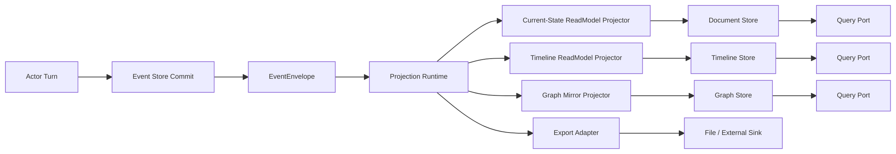

# Remaining Actorization Refactor Blueprint

## 1. 文档元信息

- 文档状态：`Active`
- 文档版本：`v1`
- 更新时间：`2026-03-16`
- 适用范围：
  - `src/Aevatar.Scripting.*`
  - `src/workflow/Aevatar.Workflow.*`
  - `src/Aevatar.CQRS.Projection.*`
  - `src/Aevatar.AI.Projection`
- 目标：在当前已完成的 `committed state -> readmodel` 主链基础上，清理剩余过渡实现，继续向“权威语义归 actor、projection 只做物化、query 只读 readmodel”的终态收敛。

## 2. 结论摘要

当前主链已经完成了两件关键事情：

1. `GAgentBase<TState>` 在 commit 后统一发布 `EventEnvelope<CommittedStateEventPublished>`，并携带 `state_event + state_root`。
2. workflow 的 `report/timeline` 主语义已经从 projection 内部状态机前移到 `WorkflowRunInsightGAgent`。

但这还不是最终态。剩余主债集中在 4 类：

1. `scripting` 仍在 projection/query 侧执行业务型 readmodel/query 逻辑。
2. `Projection Core` 仍保留 reducer 时代的通用抽象和默认注册路径。
3. `workflow` 的 report/export 命名与外围 adapter 还没完全收口，但 timeline/graph 主查询链已经从 monolithic report 中拆开。
4. store dispatch compensation 与 workflow export artifact 仍带明显的 feature-specific 历史痕迹。

这份文档的目标不是重复已经完成的重构，而是明确剩余改造范围、终态边界、文件级动作和验收标准。

## 3. 当前完成态与剩余问题

### 3.1 已完成的关键收口

1. 权威 committed observation 已统一为 `CommittedStateEventPublished`。
2. current-state readmodel 不再允许 query-time replay 或 query-time priming。
3. workflow insight 主语义已经 actor 化：
   - `WorkflowRunInsightBridgeProjector`
   - `WorkflowRunInsightGAgent`
   - `WorkflowRunInsightReadModelProjector`
4. `WorkflowExecutionCurrentStateDocument` 已从 `WorkflowExecutionReport` 主链中剥离，当前态查询不再依赖旧 report reducer。

### 3.2 剩余问题总览

| 编号 | 问题 | 当前表现 | 影响 |
|---|---|---|---|
| R1 | `scripting` 未彻底 actor 化 | projection/query 仍会加载 behavior artifact 并执行业务逻辑 | 业务语义分散在 actor/projection/query 三处 |
| R2 | reducer-era core 未删除 | `IProjectionEventReducer`、AI reducer 注册、旧 README 仍在 | 框架抽象与当前架构不一致 |
| R3 | workflow report/export 外围层仍带历史命名 | `WorkflowExecutionReport` 仍承担 report/export 载体，外围 adapter 还未统一收口 | 报告链与主查询链的边界仍可继续收紧 |
| R4 | export adapter 命名与边界仍旧 | `IWorkflowRunReportExportPort` 这条链仍需完成全仓统一收口 | 容易把导出能力误认为主查询模型 |
| R5 | compensation 仍 workflow-specific | `WorkflowProjectionDispatchCompensationOutboxGAgent` 直接绑定 `WorkflowExecutionReport` | runtime 通用能力仍挂在 feature 模块 |
| R6 | 文档与部分命名残留旧术语 | 少数活文档仍需同步最后一轮主链与 export 命名收口 | 新人会被错误设计误导 |

## 4. 目标终态

### 4.1 终态原则

1. `actor` 是唯一业务语义拥有者。
2. `projection` 只负责把 committed 事实物化成一个或多个 readmodel。
3. `query` 只读取 readmodel，不负责补算事实。
4. 一个 actor 可以对应多个 readmodel，但每个 readmodel 必须有明确消费场景。
5. graph/export/search 都是 readmodel 或导出适配，不是第二套事实源。

### 4.2 终态主链

### 4.3 终态职责分层

| 分层 | 终态职责 | 不再承担的职责 |
|---|---|---|
| Actor | 业务状态、事件、聚合语义、稳定 readmodel 输入 | query-time 读取、projection lifecycle orchestration |
| Projection | committed 观察流订阅、readmodel 物化、store fan-out | 第二套业务状态机、readmodel 重算、行为语义解释 |
| Query | 已物化 readmodel 的读取与窄映射 | replay、priming、behavior dispatch |
| Infrastructure | provider/store/export adapter | 业务语义判断 |

## 5. 软件工程抽象

这轮剩余重构对应的核心软件工程概念如下：

### 5.1 Single Source of Truth

- `actor state + committed events` 是唯一真相。
- `readmodel` 是 materialized view，不是权威状态。

### 5.2 Materialized View

- current-state、timeline、graph 都是物化视图。
- 视图的划分由消费场景决定，而不是由“现在已有哪个文档”决定。

### 5.3 Ports and Adapters

- actor 对 projection 输出 committed observation。
- projection 对 store/export 输出 adapter 调用。
- query 只通过 read-side port 读模型，不反向穿透到 actor。

### 5.4 Replace Implicit Strategy with Explicit Ownership

旧架构里很多策略被藏在 reducer、query service、artifact sink、payload mapper 里。终态要求：

1. 业务策略留在 actor。
2. 物化策略留在 projector/materializer。
3. provider 只做 persistence semantics。

### 5.5 Interface Segregation

- `current-state query`
- `timeline query`
- `graph query`
- `export`

这些接口必须显式分开，不能继续让一个 `WorkflowExecutionReport` 同时承担全部用途。

## 6. 剩余改造工作包

## 6.1 WP1: Scripting 彻底 actor 化

> 2026-03-16 进度：已完成。`ScriptReadModelProjector`、native document/graph projector 已切到 write-side committed payload；`ScriptReadModelQueryReader` 已收口为 snapshot/document 读取；`OnQuery<TQuery, TResult>`、`ExecuteQueryAsync(...)`、`QueryTypeUrls`、`QueryResultTypeUrls` 等 declared-query 生产契约已从 scripting 主链删除；`IScriptBehaviorRuntimeCapabilities.GetReadModelSnapshotAsync(...)` 这类 runtime readmodel 侧读能力也已移除。

### 现状

以下路径仍在 projection/query 侧执行脚本行为语义：

- `src/Aevatar.Scripting.Projection/Projectors/ScriptReadModelProjector.cs`
- `src/Aevatar.Scripting.Projection/Projectors/ScriptNativeDocumentProjector.cs`
- `src/Aevatar.Scripting.Projection/Projectors/ScriptNativeGraphProjector.cs`
- `src/Aevatar.Scripting.Projection/Projectors/ScriptCommittedStateProjectionSupport.cs`
- `src/Aevatar.Scripting.Projection/Queries/ScriptReadModelQueryReader.cs`
- `src/Aevatar.Scripting.Abstractions/Behaviors/IScriptBehaviorBridge.cs`

问题本质：

1. projection 还要拉 definition snapshot。
2. projection 还要解析 behavior artifact。
3. query reader 还要执行 `ExecuteQueryAsync(...)`。

这意味着 `scripting` 还不是“actor 拥有语义，projection 只物化”。

### 目标

把 scripting 当前态查询面拆成两段：

1. actor 输出“已经可被直接物化的 query-side state mirror/readmodel contract”
2. projection 只做 document/graph 物化

### 文件级动作

| 文件 | 动作 | 目标 |
|---|---|---|
| `src/Aevatar.Scripting.Abstractions/Behaviors/IScriptBehaviorBridge.cs` | `修改` | 只保留写侧 dispatch/apply/project，不再保留 declared-query runtime contract |
| `src/Aevatar.Scripting.Core/ScriptBehaviorGAgent.cs` | `修改` | 在 committed 后产出 query-side contract，不再让 projection 补算 semantic readmodel |
| `src/Aevatar.Scripting.Projection/Projectors/ScriptCommittedStateProjectionSupport.cs` | `删除或降级` | 不再承担 query-side 业务映射 |
| `src/Aevatar.Scripting.Projection/Projectors/ScriptReadModelProjector.cs` | `重写` | 直接物化 actor 已给出的 readmodel contract |
| `src/Aevatar.Scripting.Projection/Projectors/ScriptNativeDocumentProjector.cs` | `重写` | 只做 readmodel -> native document materialization |
| `src/Aevatar.Scripting.Projection/Projectors/ScriptNativeGraphProjector.cs` | `重写` | 只做 readmodel -> graph mirror materialization |
| `src/Aevatar.Scripting.Projection/Queries/ScriptReadModelQueryReader.cs` | `修改` | 只读 readmodel，不再拉 definition snapshot/behavior artifact 解释业务语义 |
| `src/Aevatar.Scripting.Core/Ports/IScriptDefinitionSnapshotPort.cs` | `收紧` | 仅供显式 provisioning / definition 管理使用，不再被当前态 query/projector 常规依赖 |

### 验收标准

1. `ScriptReadModelProjector` 不再注入 `IScriptDefinitionSnapshotPort`。
2. `ScriptReadModelProjector` 不再注入 `IScriptBehaviorArtifactResolver`。
3. `ScriptReadModelQueryReader` 不再执行 `behavior.ExecuteQueryAsync(...)`。
4. scripting current-state 路径只依赖 committed observation 中已有的 durable 数据。
5. production path 中不存在 `OnQuery<TQuery, TResult>`、`QueryTypeUrls`、`QueryResultTypeUrls`。

## 6.2 WP2: Projection Core 去 reducer 化

> 2026-03-16 进度：主链已完成。`IProjectionEventReducer`、`Aevatar.AI.Projection/Reducers/*`、workflow host 对 `AddAIDefaultProjectionLayer(...)` 的注册均已移除；剩余工作主要是文档和守卫清理。

### 现状

以下抽象仍然属于旧框架时代：

- `src/Aevatar.CQRS.Projection.Core.Abstractions/Abstractions/Pipeline/IProjectionEventReducer.cs`
- `src/Aevatar.AI.Projection/Reducers/*`
- `src/Aevatar.AI.Projection/DependencyInjection/ServiceCollectionExtensions.cs`
- `src/workflow/extensions/Aevatar.Workflow.Extensions.AIProjection/ServiceCollectionExtensions.cs`
- `src/Aevatar.CQRS.Projection.Core/README.md`

### 目标

彻底明确：

1. runtime 只认识 `projector`
2. 事件到读模型的旧 reducer 路由表不再作为框架主扩展点
3. AI 相关 timeline/role-reply 物化逻辑收口到拥有该语义的 actor 或明确的 materializer 中

### 文件级动作

| 文件 | 动作 | 目标 |
|---|---|---|
| `src/Aevatar.CQRS.Projection.Core.Abstractions/Abstractions/Pipeline/IProjectionEventReducer.cs` | `删除` | 从 core 契约里移除 reducer 扩展点 |
| `src/Aevatar.AI.Projection/Reducers/*` | `删除或迁移` | 不再通过 reducer 模式扩展主投影链 |
| `src/Aevatar.AI.Projection/DependencyInjection/ServiceCollectionExtensions.cs` | `重写` | 删除 `AddAllAIProjectionEventReducers` 相关注册 |
| `src/workflow/extensions/Aevatar.Workflow.Extensions.AIProjection/ServiceCollectionExtensions.cs` | `修改` | 不再调用 reducer-era 扩展 |
| `src/Aevatar.CQRS.Projection.Core/README.md` | `更新` | 文档只保留 current projector model |

### 验收标准

1. 解决方案主链中不存在 `IProjectionEventReducer<,>` 的生产代码依赖。
2. host 组装不再注册 `AddAIDefaultProjectionLayer(...)`。
3. `Projection Core` README 不再把 reducer 作为典型扩展点。

## 6.3 WP3: Workflow readmodel 按消费场景拆分

> 2026-03-16 进度：主查询链已完成。`WorkflowRunTimelineDocument` 已落地，`WorkflowProjectionQueryReader` 已直接读取 timeline document；graph 已改由 `WorkflowRunGraphMirrorReadModel -> WorkflowRunGraphMirrorMaterializer -> Graph Store` 物化，不再从 `WorkflowExecutionReport` 派生。剩余工作仅是 report/export 外围命名和文档收口。

### 现状

虽然 `WorkflowRunInsightGAgent` 已成为语义拥有者，但 report/export 外围仍保留历史命名：

- `src/workflow/Aevatar.Workflow.Projection/Projectors/WorkflowRunInsightReadModelProjector.cs`
- `src/workflow/Aevatar.Workflow.Projection/ReadModels/WorkflowExecutionReadModel.Partial.cs`
- `src/workflow/Aevatar.Workflow.Projection/ReadModels/WorkflowRunGraphMirrorMaterializer.cs`
- `src/workflow/Aevatar.Workflow.Projection/Orchestration/WorkflowProjectionQueryReader.cs`

问题：

1. `WorkflowExecutionReport` 仍是 report/export 载体，尚未完成命名和外围 adapter 收口。
2. timeline 与 graph 主查询链虽然已经拆分，但活文档和少数外围测试/说明仍沿用旧口径。
3. report/export 与主查询链之间的概念边界还可以继续硬化。

### 目标

把 workflow 查询面拆成明确 readmodel，并保持 report/export 只作为外围 adapter：

1. `WorkflowExecutionCurrentStateDocument`
2. `WorkflowRunInsightReportDocument`
3. `WorkflowRunTimelineDocument` 或 timeline store
4. `WorkflowRunGraphMirror`

### 文件级动作

| 文件 | 动作 | 目标 |
|---|---|---|
| `src/workflow/Aevatar.Workflow.Projection/ReadModels/WorkflowExecutionReadModel.Partial.cs` | `已完成` | 已拆出 `WorkflowRunTimelineDocument` / `WorkflowRunGraphMirrorReadModel` |
| `src/workflow/Aevatar.Workflow.Projection/Projectors/WorkflowRunInsightReadModelProjector.cs` | `已完成` | 与 timeline/graph projector 并列，由同一 committed state fan-out 到多个 readmodel |
| `src/workflow/Aevatar.Workflow.Projection/Projectors/WorkflowRunTimelineReadModelProjector.cs` | `新增并完成` | timeline 成为单独消费场景的 readmodel |
| `src/workflow/Aevatar.Workflow.Projection/ReadModels/WorkflowRunGraphMirrorMaterializer.cs` | `新增并完成` | graph 改为从 graph mirror readmodel 物化 |
| `src/workflow/Aevatar.Workflow.Projection/Orchestration/WorkflowProjectionQueryReader.cs` | `已完成` | timeline query 直接读取 `WorkflowRunTimelineDocument` |
| `src/workflow/extensions/Aevatar.Workflow.Extensions.Hosting/WorkflowProjectionProviderServiceCollectionExtensions.cs` | `已完成` | provider 注册已覆盖 timeline document |

### 验收标准

1. 一个 readmodel 只服务一个稳定消费场景。
2. `WorkflowProjectionQueryReader` 不再从单个 `WorkflowExecutionReport` 读取 timeline。
3. graph mirror 不再从 report 派生。

## 6.4 WP4: Workflow export/artifact 降级为 adapter

### 现状

以下链路仍保留旧 `artifact` 命名：

- `src/workflow/Aevatar.Workflow.Application.Abstractions/Reporting/IWorkflowRunReportExportPort.cs`
- `src/workflow/Aevatar.Workflow.Application/Reporting/NoopWorkflowRunReportExporter.cs`
- `src/workflow/Aevatar.Workflow.Infrastructure/Reporting/FileSystemWorkflowRunReportExporter.cs`
- `src/workflow/Aevatar.Workflow.Infrastructure/Reporting/WorkflowRunReportExportOptions.cs`

### 目标

明确这条能力只是导出 adapter，不属于主查询模型，也不是 projection 主职责。

### 文件级动作

| 文件 | 动作 | 目标 |
|---|---|---|
| `IWorkflowRunReportExportPort.cs` | `保留并继续收口` | 已改为 export 语义，继续清理全仓旧引用 |
| `NoopWorkflowRunReportExporter.cs` | `保留` | 对齐 export 语义 |
| `FileSystemWorkflowRunReportExporter.cs` | `保留` | 明确是 file export adapter |
| `WorkflowRunReportExportOptions.cs` | `保留` | 对齐 export 语义 |
| `Workflow Application/Infrastructure` 注册文件 | `修改` | 不再把导出能力表述成 artifact sink |

### 验收标准

1. workflow 主查询和导出能力在命名上彻底分离。
2. `artifact` 只保留在真正离线导出场景，不再用于 readmodel 主链。

## 6.5 WP5: Compensation 上移为 runtime 通用能力

### 现状

workflow 仍保留专用补偿 actor：

- `src/workflow/Aevatar.Workflow.Projection/Orchestration/WorkflowProjectionDispatchCompensationOutboxGAgent.cs`
- `src/workflow/Aevatar.Workflow.Projection/Orchestration/WorkflowProjectionDurableOutboxCompensator.cs`
- `src/workflow/Aevatar.Workflow.Projection/Orchestration/ActorProjectionDispatchCompensationOutbox.cs`

问题：

1. compensation 语义是 projection runtime 问题，不是 workflow 业务问题。
2. 当前实现直接绑定 `WorkflowExecutionReport`。

### 目标

把补偿能力提炼成 `Projection Runtime` 通用组件：

1. feature 模块只提供 readmodel/store binding
2. compensation actor/outbox 归 core/runtime
3. workflow 不再拥有特化的 dispatch compensation 类型

### 文件级动作

| 文件 | 动作 | 目标 |
|---|---|---|
| `WorkflowProjectionDispatchCompensationOutboxGAgent.cs` | `迁移/泛化` | 提炼成 runtime 通用 actor |
| `WorkflowProjectionDurableOutboxCompensator.cs` | `迁移/泛化` | 与具体 readmodel 解耦 |
| `ActorProjectionDispatchCompensationOutbox.cs` | `迁移/泛化` | feature-neutral |
| `Aevatar.CQRS.Projection.Runtime` | `新增` | 安放通用 compensation 组件 |

### 验收标准

1. workflow 模块里不再出现 projection compensation 的 feature-specific actor/outbox 类型。
2. compensation core 可以复用于其它 readmodel。

## 6.6 WP6: 文档与命名清理

### 现状

以下文档或命名仍与当前实现不一致：

- `docs/2026-03-15-cqrs-projection-readmodels-architecture.md`
- `docs/SCRIPTING_ARCHITECTURE.md`
- `src/Aevatar.CQRS.Projection.Core/README.md`

### 目标

文档只描述当前有效主链：

1. `EventEnvelope<CommittedStateEventPublished>`
2. `actor -> committed observation -> projector -> readmodel`
3. 无 `ProjectionPayload`
4. 无 reducer-era 主链

### 验收标准

1. 当前文档中不再把 `ProjectionPayload` 当成现行主链契约。
2. 文档与代码的术语完全一致。

## 7. 分阶段实施顺序

### 阶段一：先拆 `scripting`

原因：

1. 这是当前“语义仍在 projection/query 侧执行”的最大残留。
2. 它最直接违背“业务语义归 actor、query 只读 readmodel”的原则。

动作：

1. 前推 scripting current-state readmodel contract
2. 删除 `ScriptCommittedStateProjectionSupport`
3. 收紧 `ScriptReadModelQueryReader`

### 阶段二：再删 reducer-era core

动作：

1. 删除 `IProjectionEventReducer`
2. 清空 `Aevatar.AI.Projection` reducer 主链
3. 更新 workflow host 组装与 core README

### 阶段三：workflow readmodel 拆分

动作：

1. 按消费场景拆出 timeline/graph/report
2. query 直接面向多个 readmodel
3. graph 不再从 report 派生

### 阶段四：export/compensation 收口

动作：

1. 导出链改名并降级为 adapter
2. compensation 提炼到 runtime

### 阶段五：文档与门禁

动作：

1. 更新 `docs/`
2. 新增或修订门禁，防止 reducer/query-time behavior 执行回流

## 8. 建议新增门禁

1. `scripting_projection_behavior_execution_guard.sh`
   - 禁止 `Aevatar.Scripting.Projection` 注入 `IScriptBehaviorArtifactResolver`
   - 禁止 `Aevatar.Scripting.Projection` 注入 `IScriptDefinitionSnapshotPort`

2. `scripting_query_behavior_execution_guard.sh`
   - 禁止 `ScriptReadModelQueryReader` 调用 `behavior.ExecuteQueryAsync(...)`

3. `projection_reducer_core_guard.sh`
   - 禁止主链项目新增 `IProjectionEventReducer<,>` 生产依赖

4. `workflow_readmodel_scope_guard.sh`
   - 禁止 `WorkflowExecutionReport` 同时被 timeline/graph/current-state query 复用为唯一来源

## 9. 终态验收清单

当以下条件全部满足，才算这轮“剩余 actor 化重构”完成：

1. scripting current-state 路径不再在 projection/query 侧执行 behavior 语义。
2. `IProjectionEventReducer` 从主框架退出。
3. workflow 的 current-state/timeline/graph/report 已拆成明确消费场景的 readmodel。
4. workflow export 不再使用 `artifact sink` 命名。
5. projection compensation 从 workflow feature 模块上移为 runtime 通用能力。
6. 文档中不再保留 `ProjectionPayload` 作为当前主链术语。
7. 全量 `build/test` 与 architecture guards 保持全绿。

## 10. 当前建议

如果继续编码，下一刀最值钱的顺序是：

1. `WP1 scripting actorization`
2. `WP2 reducer core removal`
3. `WP3 workflow readmodel split`

原因很简单：

1. 这三项决定的是“语义到底归谁”。
2. export/compensation/文档清理虽然也要做，但属于边界收口，不是主真相收口。
