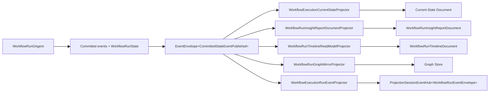

# Workflow 事实源、子 Actor 事件链路与 Projection 重构设计（已落地）

## 一句话结论

workflow 当前已经回到单一 authority：

- `WorkflowRunGAgent`
- `WorkflowRunState`
- root committed events
- `EventEnvelope<CommittedStateEventPublished>`

query artifact 不再经过 secondary actor/secondary state chain，而是直接从 root committed observation 物化。

## 事实源分层

### 1. authority

- [WorkflowRunGAgent.cs](/Users/auric/aevatar/src/workflow/Aevatar.Workflow.Core/WorkflowRunGAgent.cs)
- [workflow_state.proto](/Users/auric/aevatar/src/workflow/Aevatar.Workflow.Core/workflow_state.proto)
- root committed `StateEvent`

这是 workflow run 唯一权威事实源。

### 2. committed observation

- [agent_messages.proto](/Users/auric/aevatar/src/Aevatar.Foundation.Abstractions/agent_messages.proto)
  - `CommittedStateEventPublished { state_event, state_root }`

这不是新事实源，只是权威事实的统一观察壳。

### 3. durable artifacts

当前 durable artifact 主要包括：

- [WorkflowExecutionCurrentStateDocument](/Users/auric/aevatar/src/workflow/Aevatar.Workflow.Projection/workflow_projection_transport.proto)
- [WorkflowRunTimelineDocument](/Users/auric/aevatar/src/workflow/Aevatar.Workflow.Projection/workflow_projection_transport.proto)
- [WorkflowRunGraphMirrorReadModel](/Users/auric/aevatar/src/workflow/Aevatar.Workflow.Projection/workflow_projection_transport.proto)
- [WorkflowRunInsightReportDocument](/Users/auric/aevatar/src/workflow/Aevatar.Workflow.Projection/workflow_projection_transport.proto)

### 4. session/live observation

AGUI / live sink 观察不再承担 durable artifact 责任：

- [WorkflowExecutionProjectionPort.cs](/Users/auric/aevatar/src/workflow/Aevatar.Workflow.Projection/Orchestration/WorkflowExecutionProjectionPort.cs)
- [WorkflowExecutionRunEventProjector.cs](/Users/auric/aevatar/src/workflow/Aevatar.Workflow.Presentation.AGUIAdapter/WorkflowExecutionRunEventProjector.cs)

## 当前主链

## 当前 artifact 构建方式

workflow artifact 不再来自 `WorkflowRunInsightGAgent` 或 secondary state，而是直接来自：

- `state_root : WorkflowRunState`
- `state_event.EventData`

具体实现集中在：

- [WorkflowExecutionArtifactProjectionSupport.cs](/Users/auric/aevatar/src/workflow/Aevatar.Workflow.Projection/Projectors/WorkflowExecutionArtifactProjectionSupport.cs)

它当前会基于 root committed event 类型，把下列 durable 语义写入 artifact：

- `workflow.start`
- `step.request`
- `step.completed`
- `workflow.suspended`
- `signal.waiting`
- `signal.buffered`
- `workflow.completed`
- `workflow.stopped`
- `WorkflowRoleReplyRecordedEvent`
- `WorkflowRoleActorLinkedEvent`
- `SubWorkflowBindingUpsertedEvent`

## 子 actor 如何进入 readmodel

当前正确方式不是“直接暴露子 actor state”，而是：

1. 如果某条事实影响 root 业务推进：
   - child actor 结果先回 root
   - root 提交 committed event/state
   - current-state / artifact 再从 root committed observation 物化

2. 如果某条事实只服务 artifact 查询，但需要 durable：
   - 必须以 typed committed fact 的形式进入主链
   - 不能靠 runtime side-read 或 query-time 拼装

3. 如果某条事实只服务实时展示：
   - 进入 session/live observation
   - 不默认 durable

workflow 当前 artifact 主体仍以 root committed facts 为主，没有再引入 secondary aggregate actor。

## 已删除的错误方向

- `WorkflowRunInsightGAgent` 作为 secondary authority
- `projection bridge -> secondary actor -> readmodel` 这条二次投影链
- 用 `Initialize/Complete` 承担 workflow 聚合/补录语义

## 当前文件落点

### durable

- [WorkflowExecutionCurrentStateProjector.cs](/Users/auric/aevatar/src/workflow/Aevatar.Workflow.Projection/Projectors/WorkflowExecutionCurrentStateProjector.cs)
- [WorkflowRunInsightReportDocumentProjector.cs](/Users/auric/aevatar/src/workflow/Aevatar.Workflow.Projection/Projectors/WorkflowRunInsightReportDocumentProjector.cs)
- [WorkflowRunTimelineReadModelProjector.cs](/Users/auric/aevatar/src/workflow/Aevatar.Workflow.Projection/Projectors/WorkflowRunTimelineReadModelProjector.cs)
- [WorkflowRunGraphMirrorProjector.cs](/Users/auric/aevatar/src/workflow/Aevatar.Workflow.Projection/Projectors/WorkflowRunGraphMirrorProjector.cs)

### session

- [WorkflowExecutionProjectionPort.cs](/Users/auric/aevatar/src/workflow/Aevatar.Workflow.Projection/Orchestration/WorkflowExecutionProjectionPort.cs)
- [WorkflowExecutionRunEventProjector.cs](/Users/auric/aevatar/src/workflow/Aevatar.Workflow.Presentation.AGUIAdapter/WorkflowExecutionRunEventProjector.cs)

### activation

- [WorkflowExecutionReadModelPort.cs](/Users/auric/aevatar/src/workflow/Aevatar.Workflow.Projection/Orchestration/WorkflowExecutionReadModelPort.cs)
- [ProjectionWorkflowExecutionReadModelActivationPort.cs](/Users/auric/aevatar/src/workflow/Aevatar.Workflow.Projection/Orchestration/ProjectionWorkflowExecutionReadModelActivationPort.cs)

## 当前边界

- current-state query 依赖 `state_root`
- timeline/report/graph 依赖 root committed observation
- session release 不会停止 durable materialization
- workflow session activation 只接受 `rootActorId + commandId`，不再传 `workflowName/input`

## 收尾说明

- `WorkflowExecutionArtifactProjectionSupport` 当前仍直接解释一组 root committed event type，这属于 artifact 语义而不是 authority 混淆。
- 如果后续 child actor 需要直接驱动 durable artifact，必须先补足 typed durable fact 与稳定归属键，不能回到 runtime bridge 或 state side-read。
