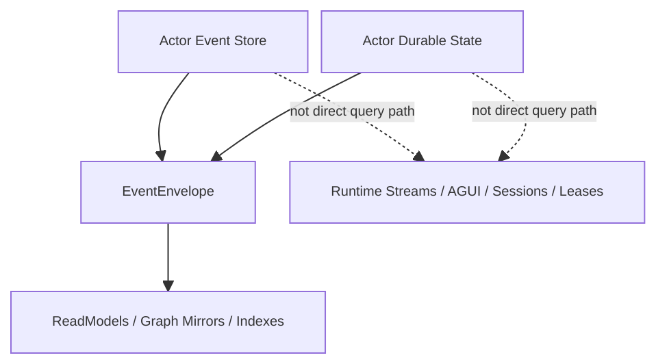
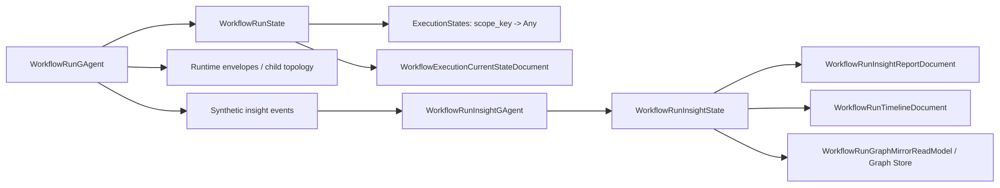
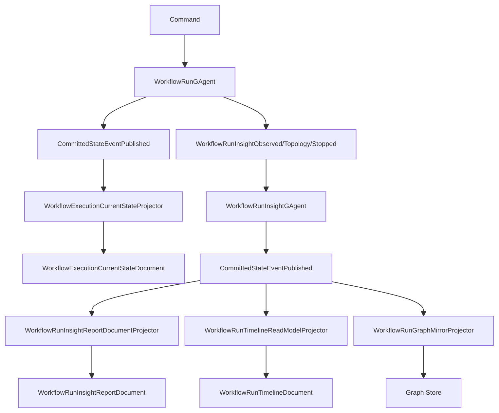
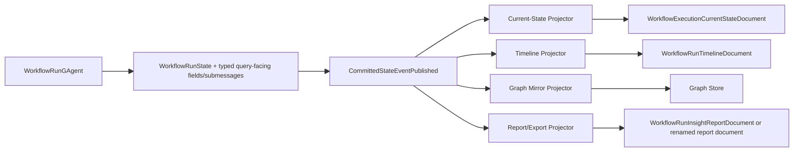

# Workflow 事实源、事件链路与投影重构分析

## 目的

这份文档重新梳理 `workflow` 当前实现中的事实源、事件层次、Projection 链路和查询链路，解决现在最核心的混乱：

1. `WorkflowRunGAgent` 的 committed observation 已经带 `state_root`，为什么还存在第二条 `insight` 状态链。
2. `WorkflowRunState.ExecutionStates` 已经是 durable state 的一部分，为什么还额外引入了 `WorkflowRunInsightGAgent`。
3. 哪些对象是权威事实，哪些只是内部执行态、运行时瞬时结构、或查询副本。
4. 后续重构应该删什么、保留什么，才能回到一条清晰的 actor-owned 主链。

本文只讨论 `workflow`，不展开 `scripting/platform`。

## 结论先行

### 核心判断

1. `WorkflowRunGAgent + EventStore + WorkflowRunState + EventEnvelope<CommittedStateEventPublished>` 才是 workflow run 当前唯一应被视为权威的事实主链。
2. `WorkflowRunState.ExecutionStates` 是 root actor committed durable state 的一部分，但它只是模块内部执行态 bag，不是稳定的查询契约。
3. `WorkflowRunInsightGAgent` 不是 workflow 原始业务模型中的核心 actor，而是后来为 `report/timeline/graph` 查询语义引入的第二套状态机。
4. 当前最大的架构问题不是“Projection 拿不到 state”，而是“查询语义没有收敛回 `WorkflowRunState` 本身”，于是系统又造出了一套 `WorkflowRunInsightState`。
5. 推荐终态是：删除 `WorkflowRunInsightGAgent` 及其整条 secondary chain，让所有 workflow readmodel 直接来自 `CommittedStateEventPublished<WorkflowRunState>`。

### 推荐终态

`Command -> WorkflowRunGAgent committed state -> EventEnvelope<CommittedStateEventPublished> -> many readmodels`

而不是：

`WorkflowRunGAgent -> synthetic insight events -> WorkflowRunInsightGAgent -> insight committed state -> report/timeline/graph`

## 一、系统级事实源层次

先把系统级边界说清楚，避免把几层语义混在一起。

### 1. 权威事实

- `actor committed event store`
- `actor committed durable state`

这两者共同组成 write-side 权威真相。

### 2. committed observation

- `EventEnvelope<CommittedStateEventPublished>`

它不是新的事实源，而是权威事实的统一观察壳。它的价值是：

- `state_event` 告诉读侧这次 committed 了什么
- `state_root` 告诉读侧这次 committed 之后权威 state 是什么

### 3. readmodel

- `document`
- `graph mirror`
- `search/index`

这些都是权威 actor state/facts 的查询副本，不是新的业务真相。

### 4. aggregate actor

如果一个对象：

- 长期消费多个 actor 的 committed facts
- 维护自己的稳定状态
- 对外提供稳定业务语义

那它是业务 `aggregate actor`，不是 projection actor。

### 5. runtime 运行时结构

- actor runtime topology
- `_childAgentIds`
- live sink / stream / session / lease
- AGUI event sink

这些不是业务真相，只是运行时控制面或实时观察面。

## 二、当前 workflow 事实源盘点

### 1. 事实源清单

| 层级 | 对象 | 位置 | 当前语义 | 是否权威 |
|---|---|---|---|---|
| A | `WorkflowRunState` | `src/workflow/Aevatar.Workflow.Core/workflow_state.proto` | root run actor 的 committed durable state | 是 |
| A | root committed `StateEvent` | `src/workflow/Aevatar.Workflow.Abstractions/workflow_execution_messages.proto` + event store | root actor 的 committed domain facts | 是 |
| A- | `WorkflowRunState.ExecutionStates` | `WorkflowRunState.execution_states` | root actor 内部模块 durable execution state bag | 是，但只对 root actor 内部语义成立 |
| B | `CommittedStateEventPublished` | `src/Aevatar.Foundation.Abstractions/agent_messages.proto` | committed 事实的统一观察壳 | 不是新事实源 |
| C | workflow runtime `EventEnvelope` | runtime / stream | 运行期内部消息、AI/tool 流消息、self event | 不是权威事实 |
| C | `_childAgentIds` / runtime topology | `WorkflowRunGAgent` 运行态 | child link / topology 的运行时可见形态 | 不是稳定业务事实 |
| D | `WorkflowRunInsightObservedEvent` / `TopologyCaptured` / `Stopped` | `src/workflow/Aevatar.Workflow.Core/workflow_run_insight.proto` | 为 insight 状态机合成的二级输入事件 | 不应作为主事实源 |
| D | `WorkflowRunInsightState` | `src/workflow/Aevatar.Workflow.Core/workflow_run_insight.proto` | 第二套聚合状态机 | 不应再作为 workflow 默认 authority |
| E | `WorkflowExecutionCurrentStateDocument` | projection readmodel | actor 当前态查询副本 | 否 |
| E | `WorkflowRunTimelineDocument` | projection readmodel | timeline 查询副本 | 否 |
| E | `WorkflowRunGraphMirrorReadModel` | projection readmodel | graph 查询副本 | 否 |
| E | `WorkflowRunInsightReportDocument` | projection readmodel | report/export 查询副本 | 否 |

### 2. 当前真正的问题

当前不是“没有 state 可以投影”，而是：

- `WorkflowRunState` 已经存在。
- `CommittedStateEventPublished` 已经带 `state_root`。
- `ExecutionStates` 已经把大量内部执行态持久化在 root actor 里。

真正的问题是：

- query 需要的一部分稳定语义，没有被收敛成 `WorkflowRunState` 的清晰 typed contract
- 这些语义有一部分散落在 `ExecutionStates`
- 还有一部分停留在 runtime message 或 runtime topology
- 为了把这些散落语义重新组装成 report/timeline/graph，又引入了一套 `WorkflowRunInsightState`

于是 workflow run 被拆成了两套 committed state owner：

1. `WorkflowRunGAgent -> WorkflowRunState`
2. `WorkflowRunInsightGAgent -> WorkflowRunInsightState`

这就是当前混乱的根源。

## 三、当前事件类型分层

### 1. root actor committed domain events

这些是 `WorkflowRunGAgent` 自己持久化并推进 `WorkflowRunState` 的事实，例如：

- `BindWorkflowRunDefinitionEvent`
- `WorkflowRunExecutionStartedEvent`
- `WorkflowExecutionStateUpsertedEvent`
- `WorkflowExecutionStateClearedEvent`
- `WorkflowCompletedEvent`
- `SubWorkflow*` 相关事件

定义位置：

- `src/workflow/Aevatar.Workflow.Abstractions/workflow_execution_messages.proto`

这些 committed events 最终都会被 framework 包成：

- `EventEnvelope<CommittedStateEventPublished>`

发布逻辑在：

- `src/Aevatar.Foundation.Core/GAgentBase.TState.cs`

### 2. workflow runtime/internal events

这些事件主要用于 workflow 执行推进，例如：

- `StartWorkflowEvent`
- `StepRequestEvent`
- `StepCompletedEvent`
- `WaitingForSignalEvent`
- `WorkflowSignalBufferedEvent`
- `TextMessageStartEvent`
- `TextMessageContentEvent`
- `TextMessageEndEvent`
- `ChatResponseEvent`
- `ToolCallEvent`
- `ToolResultEvent`

它们的特点是：

- 首先是运行时推进消息
- 很多通过 `PublishAsync(...)` 在 actor topology 中传播
- 它们不天然等于 root actor 的 committed domain fact

也就是说：

- 它们可以成为事实来源的输入材料
- 但不能直接被误当成权威已提交事实

### 3. committed observation

`CommittedStateEventPublished` 的契约很关键：

- `state_event`
- `state_root`

这意味着当前系统在技术上已经可以直接拿到：

- 这次 committed 了什么
- committed 后权威 state 长什么样

也就是说，对 actor-scoped current-state readmodel 来说，正常路径并不缺任何投影输入。

### 4. 二级 synthetic insight events

当前 `WorkflowRunGAgent` 还在做一件额外的事：

- 观察 runtime envelope
- 把部分 payload 转成 `WorkflowRunInsightObservedEvent`
- 把 runtime topology 转成 `WorkflowRunInsightTopologyCapturedEvent`
- 在 detached cleanup 等路径发 `WorkflowRunInsightStoppedEvent`

对应代码在：

- `WorkflowRunGAgent.HandleWorkflowRunInsightEnvelope(...)`
- `WorkflowRunGAgent.PublishWorkflowRunInsightTopologyAsync(...)`
- `WorkflowRunGAgent.PublishWorkflowRunInsightEventAsync(...)`

这一层不是 committed observation 主链，而是为第二套 `insight` 状态机额外合成的输入边。

## 四、`WorkflowRunState` 里到底有什么

### 1. 已经是稳定顶层语义的部分

`WorkflowRunState` 当前已经明确包含这些强类型字段：

- `definition_actor_id`
- `workflow_yaml`
- `workflow_name`
- `compiled`
- `compilation_error`
- `run_id`
- `status`
- `input`
- `final_output`
- `final_error`
- `command_id`
- sub-workflow 绑定和 pending invocation 相关字段

这些字段已经适合 current-state readmodel 直接物化。

### 2. `ExecutionStates` 的定位

`WorkflowRunState.execution_states` 是：

- `map<string, google.protobuf.Any>`

它里面放的是模块内部的 durable execution state，例如：

- `WorkflowExecutionKernelState`
- `WaitSignalModuleState`
- `DelayModuleState`
- `LLMCallModuleState`
- `HumanInputModuleState`
- `HumanApprovalModuleState`
- `WhileModuleState`
- `Parallel*` 相关 module state

这证明了两件事：

1. 很多执行期语义本来就已经在 root actor committed state 里。
2. `insight` 所需信息并不天然需要第二个 actor 才能持久化。

但它仍然不是最终查询契约，因为：

- 它是 `scope_key -> Any` 的模块状态 bag
- 它表达的是模块内部执行态，不是 query-ready 语义
- 它没有直接组织成稳定的：
  - timeline
  - step traces
  - role replies
  - topology mirror
  - report summary

所以：

- `ExecutionStates` 是事实来源之一
- 但不是最终查询模型

### 3. `step.request / llm.content / tool.call / topology` 是否“都在 root actor 里”

答案是：

- 一部分在 root actor committed state 里，通常以 module state 形式存在
- 一部分在 runtime/internal event 流里
- `topology` 目前更多还是 runtime child relationship 的派生形态
- 它们还没有被统一提升为 `WorkflowRunState` 的稳定查询语义

所以说“这些都在 `WorkflowRunGAgent` 里”只对一半：

- 它们确实有不少已经处在 root actor 边界内
- 但还没有被建模成可以直接投影的统一 typed state contract

## 五、当前投影链路

### 1. 当前已经正确的链

`WorkflowExecutionCurrentStateProjector` 当前直接消费：

- `EventEnvelope<CommittedStateEventPublished<WorkflowRunState>>`

对应代码：

- `src/workflow/Aevatar.Workflow.Projection/Projectors/WorkflowExecutionCurrentStateProjector.cs`

它的语义是正确的：

- root committed state -> actor 当前态 readmodel

### 2. 当前仍然混乱的 secondary chain

虽然旧的 `WorkflowRunInsightBridgeProjector` 已经删掉了，但 secondary chain 没有消失，只是换了位置：

- 以前是 `projection bridge -> insight actor`
- 现在变成 `WorkflowRunGAgent -> synthetic insight events -> WorkflowRunInsightGAgent`

也就是说，错误的“第二状态机”仍然存在，只是 bridge 不再放在 projection 项目里。

当前实际链路是：

1. `WorkflowRunGAgent` 处理 workflow/AI/runtime 事件
2. `WorkflowRunGAgent` 把其中一部分转成 `WorkflowRunInsightObservedEvent`
3. `WorkflowRunGAgent` 从 `_childAgentIds` 派生 `WorkflowRunInsightTopologyCapturedEvent`
4. `WorkflowRunInsightGAgent` 基于这些 synthetic events 维护 `WorkflowRunInsightState`
5. `WorkflowRunInsightReportDocumentProjector / WorkflowRunTimelineReadModelProjector / WorkflowRunGraphMirrorProjector` 再从 `CommittedStateEventPublished<WorkflowRunInsightState>` 物化 readmodel

这就是 workflow 当前最主要的二次聚合链。

### 3. 当前查询层

`WorkflowProjectionQueryReader` 现在按消费场景读：

- actor current-state：`WorkflowExecutionCurrentStateDocument`
- timeline：`WorkflowRunTimelineDocument`
- graph：`Graph Store`
- report/export：`WorkflowRunInsightReportDocument`

表面上查询面已经拆开了，但根部问题仍在：

- current-state 来自 `WorkflowRunState`
- timeline/report/graph 主要来自 `WorkflowRunInsightState`

这意味着 workflow run 的查询语义被拆给了两个 state owner。

## 六、为什么现在会显得混乱

### 1. `CommittedStateEventPublished` 已经带 `state_root`

这意味着：

- 对 actor-scoped current-state readmodel 而言，技术上没有任何“必须再造一个 insight actor”的理由。

### 2. `ExecutionStates` 已经是 root actor durable state 的一部分

这意味着：

- 大量执行期 durable 语义本来就属于 `WorkflowRunGAgent` 的权威边界。

### 3. 但 query 所需语义没有收敛到 `WorkflowRunState`

这意味着：

- 系统没有把 `ExecutionStates` 与顶层 run 语义统一提升成一个清晰的、面向查询的强类型 contract。

### 4. 于是出现了第二套 state owner

`WorkflowRunInsightGAgent` 的出现，本质上是在补这个缺口：

- 把散落在 runtime events、module states、runtime topology 里的东西重新组织
- 再产出 `WorkflowRunInsightState`
- 然后再投影成 report/timeline/graph

从软件工程上说，这相当于：

- 不是直接从权威 state 投影
- 而是又造了一套“查询专用聚合状态机”

### 5. `InitializeAsync / CompleteAsync` 之所以显得奇怪，是因为它们在服务这条错位链路

如果 projector 只是：

- `CommittedStateEventPublished -> readmodel`

那大多数 projector 只需要 `ProjectAsync(...)`。

`InitializeAsync(...)` / `CompleteAsync(...)` 之所以显得奇怪，是因为在历史上它们经常被拿来支撑：

- bridge
- activation
- topology finalize
- secondary chain finalize

所以它们的奇怪，本质上不是接口偶然设计差，而是被错误链路推出来的副产物。

## 七、当前架构图

### 1. 系统级事实层次

### 2. 当前 workflow 事实源图

### 3. 当前 committed observation 与 secondary chain

### 4. 推荐终态

## 八、推荐终态

### 目标原则

1. `WorkflowRunGAgent` 是 workflow run 唯一权威事实拥有者。
2. `WorkflowRunState` 是 workflow run 唯一 committed current-state owner。
3. `WorkflowRunInsightGAgent` 这条 secondary chain 应删除。
4. 所有 workflow readmodels 都直接来自 `CommittedStateEventPublished<WorkflowRunState>`。
5. `ExecutionStates` 若承载查询所需事实，应被逐步提升为 typed contract，而不是继续长期隐藏在 `Any` bag。
6. `topology` 若确实属于稳定查询语义，必须被建模为 root actor state 的一部分，而不是继续依赖 `_childAgentIds` 这类 runtime 派生结构。

### 两种实现路径

#### 路径 A：推荐，删除 `WorkflowRunInsightGAgent`

做法：

1. 删除 `WorkflowRunInsightGAgent` / `WorkflowRunInsightState` / insight projection context/runtime lease。
2. 删除 root actor 当前发 synthetic insight events 的逻辑。
3. 让 workflow readmodel projector 直接消费 `WorkflowRunState`。
4. 把 query 真正需要的稳定字段从 `ExecutionStates` 提升出来：
   - 要么成为 `WorkflowRunState` 顶层强类型字段
   - 要么成为 `WorkflowRunState` 下的强类型子消息

优点：

- 只有一个权威 state owner
- 不再有二次聚合链
- 不再需要 root actor 为查询专门发 synthetic events
- `InitializeAsync(...)` / `CompleteAsync(...)` 这类 secondary-chain 生命周期钩子会自然失去必要性

代价：

- 需要重新设计 `WorkflowRunState` 的 query-facing shape
- 需要明确哪些 `ExecutionStates` 子状态升格为正式 contract

#### 路径 B：仅在确有业务必要时保留 aggregate actor

只有在下述前提同时成立时才勉强合理：

1. `insight` 真的是独立业务 bounded context
2. 它需要独立 actor identity
3. 它消费的是正式 business committed facts
4. 它不是为 readmodel 临时搭出来的“投影 actor”

即使保留，也必须满足：

- 不能由 projection 驱动
- 不能由 runtime bridge 驱动
- 不能依赖 root actor 在运行时临时补 topology
- 后续 readmodel 仍然只应来自 aggregate actor 自己的 committed state/facts

对当前 workflow 语义而言，这条路通常不是最优。

## 九、文件级重构建议

### 第一阶段：统一事实源

以 `WorkflowRunState` 为唯一权威 current-state owner，明确：

- `WorkflowRunInsightState` 不再是 workflow 默认 read-side authority
- `ExecutionStates` 是 durable internal execution state bag
- runtime topology 不是稳定事实源

### 第二阶段：提炼 query contract

从 `ExecutionStates` 中识别真正稳定且需要查询的语义，并提升为 typed contract，例如：

- step traces
- waiting/suspension summary
- signal buffer summary
- LLM/tool interaction summary
- topology mirror
- role replies
- timeline entries

这些不一定都要成为 `WorkflowRunState` 顶层字段，但必须脱离 `Any` bag 的“模块私有解释模式”。

### 第三阶段：删除第二状态机

应删除或重写的核心文件：

| 文件 | 当前角色 | 问题 | 推荐动作 |
|---|---|---|---|
| `src/workflow/Aevatar.Workflow.Core/workflow_state.proto` | root authoritative state | query-facing typed contract 不完整 | 保留并继续 typed 提炼 |
| `src/workflow/Aevatar.Workflow.Core/WorkflowRunGAgent.cs` | root authoritative actor | 当前还在发 synthetic insight events | 保留，但删除这部分查询专用职责 |
| `src/workflow/Aevatar.Workflow.Core/workflow_run_insight.proto` | secondary state/event contract | 第二套状态机 | 删除 |
| `src/workflow/Aevatar.Workflow.Core/WorkflowRunInsightGAgent.cs` | secondary aggregate-like actor | 为查询补造状态 | 删除 |
| `src/workflow/Aevatar.Workflow.Projection/Orchestration/ActorWorkflowRunInsightPort.cs` | insight actor port | 服务 secondary chain | 删除 |
| `src/workflow/Aevatar.Workflow.Projection/Orchestration/IWorkflowRunInsightActorPort.cs` | insight actor abstraction | 服务 secondary chain | 删除 |
| `src/workflow/Aevatar.Workflow.Projection/Orchestration/WorkflowRunInsightProjectionContext.cs` | insight projection context | 服务 secondary chain | 删除 |
| `src/workflow/Aevatar.Workflow.Projection/Orchestration/WorkflowRunInsightRuntimeLease.cs` | insight runtime lease | 服务 secondary chain | 删除 |
| `src/workflow/Aevatar.Workflow.Projection/Projectors/WorkflowRunInsightReportDocumentProjector.cs` | insight-state -> report | 依赖第二状态机 | 重写为 `WorkflowRunState -> report` |
| `src/workflow/Aevatar.Workflow.Projection/Projectors/WorkflowRunTimelineReadModelProjector.cs` | insight-state -> timeline | 依赖第二状态机 | 重写为 `WorkflowRunState -> timeline` |
| `src/workflow/Aevatar.Workflow.Projection/Projectors/WorkflowRunGraphMirrorProjector.cs` | insight-state -> graph | 依赖第二状态机 | 重写为 `WorkflowRunState -> graph` |
| `src/workflow/Aevatar.Workflow.Projection/Projectors/WorkflowRunInsightProjectionMaps.cs` | insight-state mapper | 绑定第二状态机 | 删除或改写为 `WorkflowRunState` mapper |
| `src/workflow/Aevatar.Workflow.Projection/Orchestration/WorkflowProjectionQueryReader.cs` | query adapter | 仍存在 insight/current-state 双源 fallback | 收敛到统一 `WorkflowRunState` 派生文档 |

### 第四阶段：统一 workflow readmodel

最终 workflow readmodel 的来源统一为：

- `CommittedStateEventPublished<WorkflowRunState>`

具体 readmodel 按消费场景拆开：

- `WorkflowExecutionCurrentStateDocument`
- `WorkflowRunTimelineDocument`
- `WorkflowRunGraphMirrorReadModel`
- `WorkflowRunInsightReportDocument`，或者更准确命名的 report/export document

但它们都必须来自同一个权威 state owner。

### 第五阶段：瘦身 projection core

workflow secondary chain 删除后，再继续收紧：

- `IProjectionProjector.InitializeAsync(...)`
- `IProjectionProjector.CompleteAsync(...)`

最终默认 projector 只保留：

- `ProjectAsync(...)`

初始化和完成钩子应退为可选能力接口，而不是强加给所有 projector。

## 十、验收标准

重构完成时，workflow 应满足：

1. `WorkflowRunGAgent` 是 workflow run 唯一 committed state owner。
2. 不再存在 `WorkflowRunInsightGAgent` 这条查询专用 secondary chain。
3. 所有 workflow readmodels 直接消费 `CommittedStateEventPublished<WorkflowRunState>`。
4. `WorkflowProjectionQueryReader` 不再在 `current-state` 和 `insight-state` 之间做双源回退。
5. `topology / timeline / report / graph` 的查询事实全部来自 root actor committed state 的 typed contract，而不是 runtime 瞬时结构。
6. workflow projection README、架构文档、门禁脚本不再出现 “insight bridge / second state owner / projection-driven aggregate” 语义。

## 十一、一句话结论

当前 workflow 的真正问题，不是 Projection 缺输入，而是 query 语义没有收敛回 `WorkflowRunState`，导致系统额外造出了一套 `WorkflowRunInsightState`。后续重构的正确方向不是继续修补 `insight` 链，而是把查询所需稳定语义并回 root actor authority，再让 projection 重新退回成纯物化层。
