# Workflow Run Insight Committed Observation Discussion

## 1. 文档元信息

- 状态：`Active`
- 版本：`R2`
- 日期：`2026-03-16`
- 适用范围：
  - `src/workflow/Aevatar.Workflow.Core`
  - `src/workflow/Aevatar.Workflow.Projection`
  - `src/workflow/Aevatar.Workflow.Presentation.AGUIAdapter`
- 关联文档：
  - `docs/FOUNDATION.md`
  - `docs/architecture/2026-03-16-remaining-actorization-refactor-blueprint.md`
  - `docs/architecture/AEVATAR_MAINNET_ARCHITECTURE.md`
  - `src/workflow/Aevatar.Workflow.Projection/README.md`

## 2. 文档目的

本文用于讨论 `WorkflowRunInsightBridgeProjector` 当前实现、此前的 `committed-only bridge` 方案，以及更新后的推荐终态。

当前结论已经收敛得更明确：

- `WorkflowRunInsightGAgent` 如果保留，应被视为业务 `aggregate actor`
- 聚合属于业务语义，不属于 projection 语义
- 因此 `projection -> aggregate actor -> projection` 本身就是错误结构

本文用于对齐以下问题：

1. `WorkflowRunInsightBridgeProjector` 是否应继续存在。
2. workflow insight 所需事实应该由谁提交。
3. `InitializeAsync(...)` / `CompleteAsync(...)` 为什么会显得很怪。
4. `AGUI/SSE` 的实时流应当属于哪一层语义。
5. 业务聚合与 projection 的边界应如何彻底分开。

## 3. 背景

当前 workflow read-side 主链已经具备以下设计方向：

1. write-side commit 后统一发布 `CommittedStateEventPublished`。
2. `WorkflowRunInsightBridgeProjector` 负责把 workflow run 的 committed observation 桥接到 `WorkflowRunInsightGAgent`。
3. `WorkflowRunInsightReportDocumentProjector`、`WorkflowRunTimelineReadModelProjector`、`WorkflowRunGraphMirrorProjector` 再从 insight actor 的 committed state 物化多个 readmodel。
4. query 侧通过 `WorkflowProjectionQueryReader` 读取 readmodel，不直接读 actor state。

这条链路比“projection 自己维护第二套状态机”更接近正确方向，但它并不满足终态原则。原因很简单：

1. `projection` 不应驱动业务聚合 actor。
2. `aggregate actor` 必须直接消费业务 committed facts。
3. `query` 只读 readmodel。

## 4. 这次暴露出的具体问题

在 `feature/gagent-service-and-readmodel-refactor` 上，真实聊天链路一度失败。修复 DI 缺口后，进一步暴露出一个更核心的问题：

1. `WorkflowRunInsightBridgeProjector` 当前分支实现只接受 `CommittedStateEventEnvelope.TryCreateObservedEnvelope(...)`。
2. 但真实 workflow 运行时，`StartWorkflowEvent`、`StepRequestEvent`、`StepCompletedEvent`、`WorkflowCompletedEvent`、`TextMessage*Event` 等关键事件，并不是都以 root actor committed observation 的形式出现在 bridge 输入上。
3. 结果是 insight actor 收不到这些事实。
4. 直接后果是 `timeline/report/SSE` 语义断裂，`/api/actors/{id}` 和 `/timeline` 无法返回完整结果。

为恢复功能，当前已经采用了一个临时修复：

1. `WorkflowRunInsightBridgeProjector` 优先用 observed envelope，拿不到时回退到原始 runtime envelope。
2. `EventEnvelopeToWorkflowRunEventMapper` 也采用相同回退逻辑。
3. query 侧 snapshot/timeline 优先读 insight report。

这个临时修复已经验证可用，但它不是最纯的架构终态。

## 5. 当前临时修复的问题

当前临时修复的优点是：

1. 改动小。
2. 能快速恢复聊天、timeline、snapshot、重启后查询。
3. 不需要立刻补写侧 committed 事实。

但它存在明显架构问题：

1. `WorkflowRunInsightBridgeProjector` 同时接受 committed envelope 和 runtime envelope，输入边界变得不纯。
2. insight read-side 开始依赖运行时实时消息，而不再只依赖 durable facts。
3. 容易让人误解哪些事件是权威事实，哪些只是 live transport。
4. 一旦未来 runtime 拓扑、relay 规则或 envelope 结构调整，insight 主链会被偶然实现细节影响。

结论：该修复适合作为过渡补丁，不适合作为长期方案。

## 6. 之前的 committed-only bridge 方案为什么还不够

此前一个更纯的思路是：让 `WorkflowRunInsightBridgeProjector` 只消费 committed observation。

也就是说，主链会变成：

```mermaid
%%{init: {"maxTextSize": 100000, "flowchart": {"useMaxWidth": false, "nodeSpacing": 10, "rankSpacing": 50}, "themeVariables": {"fontSize": "10px"}}}%%
flowchart LR
  RUN["WorkflowRunGAgent"]
  COMMIT["Committed Domain Fact"]
  BRIDGE["WorkflowRunInsightBridgeProjector"]
  INSIGHT["WorkflowRunInsightGAgent"]
  RM["Report / Timeline / Graph Projectors"]
  STORE["ReadModel Stores"]

  RUN --> COMMIT
  COMMIT --> BRIDGE
  BRIDGE --> INSIGHT
  INSIGHT --> RM
  RM --> STORE
```

这个方案比“bridge 同时接受 runtime envelope 和 committed envelope”要干净，但它仍然保留了一个核心问题：

- insight actor 仍然是由 projector 驱动的
- 聚合操作仍然发生在 projection 主链旁边
- `InitializeAsync(...)` / `CompleteAsync(...)` 这种 projector lifecycle 钩子仍会继续被业务语义污染

## 7. 为什么当前分支做不到 committed-only

根因不是 bridge 本身，而是写侧事实还没有完全收口。

当前系统里：

1. root workflow run actor 可以收到运行时拓扑事件。
2. 但 observer/committed observation 不会沿 parent-child relay 自动向上转发成 root actor 可直接桥接的统一 committed 输入。
3. 因此 bridge 如果只认 committed observation，就拿不到完整的 workflow/AI 事实。

特别是 `TextMessageContentEvent`、`ToolCallEvent`、`ToolResultEvent` 这类来自 child role actor 的事件，如果没有 root-owned committed fact，bridge 无法在 committed-only 模式下稳定看见它们。

## 8. 更新后的推荐方案

推荐方案不是继续放宽 bridge，也不是把 bridge 改成 committed-only 后继续保留，而是彻底取消这条二次投影链。

### 8.1 核心决议

1. `WorkflowRunInsightGAgent` 若保留，应被明确视为业务 `aggregate actor`。
2. `WorkflowRunInsightBridgeProjector` 应删除，而不是继续演进。
3. `WorkflowRunGAgent` 或其正式业务协议负责提交 insight 所需的 committed business facts。
4. insight actor 直接消费这些 business facts，并提交自己的 committed state/facts。
5. projection 只从 insight actor 的 committed state/facts 物化 report/timeline/graph readmodel。
6. `AGUI/SSE` 继续作为 presentation boundary，允许消费 runtime live stream，但不得作为 query/readmodel/completion 的权威事实源。

### 8.2 推荐原因

这样做有几个直接好处：

1. 恢复“聚合属于业务 actor，projection 只做物化”的主设计。
2. 让 insight actor 的输入重新回到 durable、可重放、可审计的业务事实流。
3. 删除 `InitializeAsync(...)` / `CompleteAsync(...)` 上承载的错误业务语义。
4. 保持 `AGUI/SSE` 的实时性，不强迫 token streaming 立刻完全 durable 化。
5. 避免 query/readmodel 再次绑定 runtime 偶然细节。

## 9. 默认 projector 是否需要调整

答案是：需要。

如果 workflow 最终删除 `WorkflowRunInsightBridgeProjector`，并把 insight 输入改成 root-owned committed business facts，那么默认 current-state projector 也必须同步收紧，否则会引入新的写放大和语义污染。

原因如下：

1. `WorkflowExecutionCurrentStateProjector` 当前对每一个 `CommittedStateEventPublished` 都会 upsert current-state document。
2. 如果 root actor 开始为 `workflow.start`、`step.request`、`llm.content` 等事实额外提交 `WorkflowRunInsightObservedEvent`，那么 current-state document 也会对这些 observation-only event 频繁重写。
3. 这会让 `current-state` 的 `StateVersion/LastEventId/UpdatedAt` 被高频 insight event 推进，但 run snapshot 本身并没有对应的业务状态变化。

因此推荐一起做：

1. `WorkflowExecutionCurrentStateProjector` 只对真正改变 `WorkflowRunState` 快照语义的 committed event 写 current-state。
2. `WorkflowRunInsightObservedEvent` 不驱动 current-state document 更新。

这不是引入新架构，而是把默认 projector 的职责边界收紧到更正确的位置。

## 10. AGUI/SSE 应该怎么定义

需要明确区分两条链路：

### 10.1 committed 主链

用途：

1. report
2. timeline
3. graph
4. durable completion
5. query API

约束：

1. 只依赖 committed facts
2. 不依赖 runtime envelope 偶然结构

### 10.2 runtime live stream

用途：

1. SSE
2. WebSocket
3. 前端实时打字效果

约束：

1. 只作为展示边界的 live adapter
2. 不是 readmodel 权威事实源
3. 不作为 completion/query 的 durable 判断依据

这里的关键点是：

`AGUI/SSE` 保留 runtime 实时流，并不等于把系统重新做成双轨架构。只要它不承担 query/readmodel 的权威语义，它就是边界层的实时适配能力，而不是第二事实源。

## 11. 性能分析

在进入具体对比前，需要先区分两类“写”：

1. `CQRS` 现有写入
2. 为了让 `AGUI/SSE` 也只消费 committed observation 而新增的事实写入

### 11.0 现有 CQRS 写入 vs 新增 committed fact 写入

当前系统里，`CQRS` 本来就会有写入，但那是发生在“事实已经 committed 之后”的 readmodel 物化写入。

也就是说：

1. actor 先 `PersistDomainEventAsync(...)`
2. framework 发布 `CommittedStateEventPublished`
3. projection runtime 消费 committed envelope
4. projector 写 document store / graph store / timeline store，或推 session event

这类写是 CQRS 本来就存在的成本。

但 `AGUI/SSE` 如果也必须只吃 committed observation，会遇到一个额外问题：

1. 现在并不是所有要展示给前端的 live event 都已经是 committed fact。
2. 特别是 `TextMessageContentEvent`，当前是 runtime `PublishAsync(...)`，不是 `PersistDomainEventAsync(...)`。
3. 因此要让这类事件进入 committed-only 主链，必须先新增一次 actor 事实提交。

所以需要明确：

1. 对本来就已经 committed 的事件，切到 committed-only 不一定新增一份事实写。
2. 对当前只是 runtime live publish 的事件，切到 committed-only 会新增一层事实写。

最典型的例子：

1. `WorkflowCompletedEvent`
   - 当前已经会进入 committed path
   - `AGUI` 若只吃 committed observation，通常可以复用现有 committed feed
2. `TextMessageContentEvent`
   - 当前只是 runtime live publish
   - 若要求 `AGUI` 只吃 committed observation，就必须先把它补成 committed fact

因此，性能讨论不能笼统说“CQRS 本来就会写”。更准确的说法是：

1. `readmodel` 写入本来就存在
2. 额外成本来自“把原本不是 committed fact 的 live event 也提升为 committed fact”
3. 这些新增 fact 再进入 CQRS 后，还可能继续放大既有 projector 的写频率

尤其要注意：

如果不收紧 `WorkflowExecutionCurrentStateProjector`，新增的 insight-only committed facts 会继续触发 current-state document 重写，这属于第二层写放大。

### 11.1 与当前临时修复相比

最终方案的成本会更高。

原因：

1. 当前临时修复直接在 bridge 中消费 runtime envelope，少了一次 root actor 持久化。
2. 最终方案要求 root actor 先把 insight 事实提交成 committed business fact，再由 insight actor 直接消费。
3. 对每一条高频 `TextMessageContentEvent`，都会增加一次 committed write。

因此：

1. 最终方案的语义更稳。
2. 当前临时修复的瞬时吞吐更便宜。

### 11.2 与旧架构相比

旧架构通常更便宜，但更不干净。

旧路径的问题在于：

1. projection 直接承担了更多业务语义。
2. report/timeline/current-state 容易被混写到一个大文档或一个大状态机里。
3. 调试、重放、跨节点一致性都更依赖实现细节。

相比之下，最终方案虽然多了一跳 `root actor committed fact -> insight actor`，但它换来了：

1. 更清晰的单一事实源。
2. 更好的重放一致性。
3. 更稳定的 query 语义。
4. 更少的 projection 侧业务状态机。
5. 更清晰的聚合/投影分层。

### 11.3 高风险点：token streaming 写放大

最终方案里最需要谨慎处理的是 `TextMessageContentEvent`。

如果每一个 token delta 都变成 root-owned committed observation，会出现：

1. event 数量上升
2. current-state 之外的 durable write 增加
3. insight actor 和 readmodel projector 的处理频率上升

这意味着最终方案在低频业务事件上更优，在高频 token 事件上未必最优。

## 12. 推荐的性能折中

如果坚持“聚合归业务 actor”的主线，建议采用下面的折中：

1. `workflow.start`
2. `step.request`
3. `step.completed`
4. `workflow.completed`
5. `workflow.suspended`
6. `waiting_for_signal`
7. `tool.call`
8. `tool.result`

这些关键事实 durable 化为 root-owned committed observation。

对于 `TextMessageContentEvent`，建议讨论两种策略：

1. 保持 runtime live stream 全量输出给 SSE，但 durable 侧做 chunk/coalesce。
2. 只 durable `TextMessageStart/End` 和最终 `ChatResponseEvent`，中间 delta 不进入 committed insight 主链。

这两种策略都比“每个 token 都 durable”更现实。

## 13. 推荐实施步骤

### Phase 1

1. 在 `WorkflowRunGAgent` 增加 root-owned insight committed business fact 提交逻辑。
2. `WorkflowRunInsightGAgent` 直接消费这些 committed facts。
3. 删除 `WorkflowRunInsightBridgeProjector`。
4. 保留 `AGUI` runtime live stream。

### Phase 2

1. 收紧 `WorkflowExecutionCurrentStateProjector`。
2. 明确 current-state 只响应真正改变 snapshot 语义的 committed event。

### Phase 3

1. 评估 `TextMessageContentEvent` 的 durable 策略。
2. 在 `full token durable`、`chunk durable`、`start/end only durable` 三者之间做正式决策。

## 14. 当前建议结论

建议采用以下结论作为评审基线：

1. 当前 runtime fallback 修复可保留为短期补丁，但不作为终态。
2. 长期方案不是 `committed-only bridge`，而是删除 `WorkflowRunInsightBridgeProjector`。
3. `WorkflowRunInsightGAgent` 若保留，必须被视为业务 aggregate actor，而不是 projection actor。
4. 为支持该设计，必须补 `WorkflowRunGAgent` 的 root-owned committed business facts。
5. 默认 `WorkflowExecutionCurrentStateProjector` 需要同步收紧，否则会出现语义污染和写放大。
6. `AGUI/SSE` 可以继续保留 runtime live stream，但必须明确它只是 presentation boundary，不是 durable facts 主链。
7. `TextMessageContentEvent` 是否逐条 durable，不应在未评审前直接落地，应单独做性能决策。

## 15. 需要在评审会上明确的问题

1. `TextMessageContentEvent` 是否必须进入 durable insight 主链。
2. 如果要 durable，接受的延迟和写放大上限是多少。
3. current-state document 的 `StateVersion/LastEventId` 是否必须严格只反映 `WorkflowRunState` 语义变化。
4. `AGUI/SSE` 是否接受“实时展示”和“durable timeline”存在细粒度差异。
5. 是否要把“聚合属于业务 actor，不属于 projection”这条规则补充回 `docs/FOUNDATION.md` 和 `Aevatar.Workflow.Projection/README.md`。
