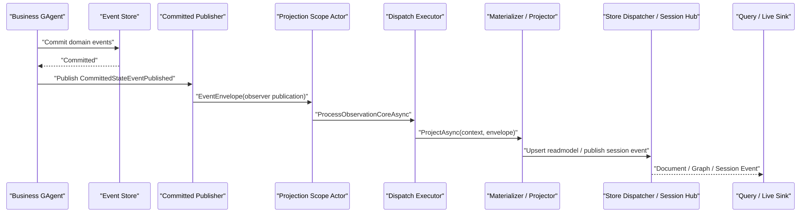
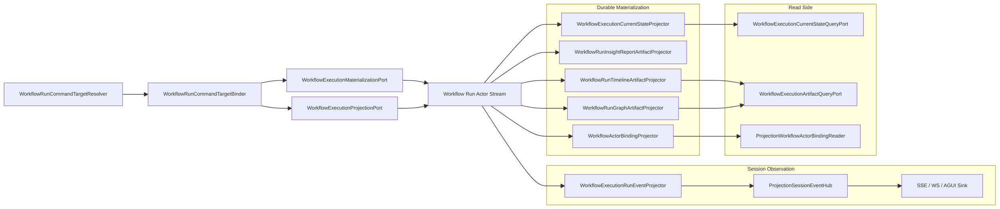
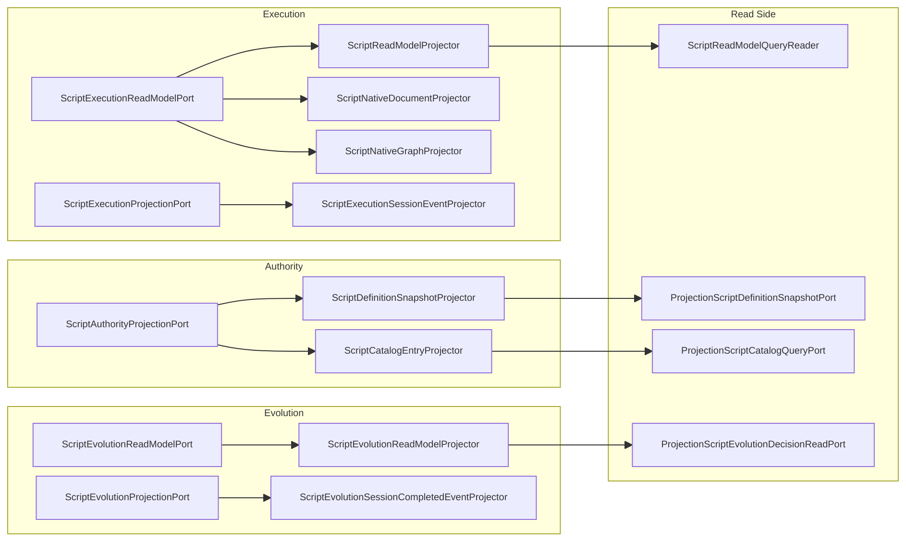
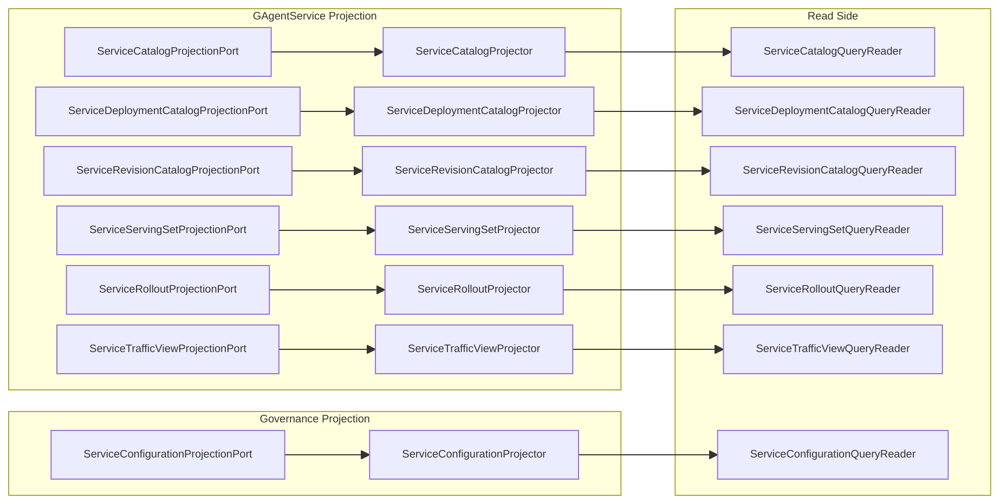

# Projection 全链路分析与问题清单

## 1. 文档信息

- 状态：`Active`
- 日期：`2026-03-17`
- 分析范围：
  - `src/Aevatar.Foundation.*`
  - `src/Aevatar.CQRS.Projection.*`
  - `src/workflow/Aevatar.Workflow.*`
  - `src/Aevatar.Scripting.*`
  - `src/platform/Aevatar.GAgentService*.Projection`

## 2. 结论摘要

当前 Projection 主干已经比较清晰，真实链路可以收敛为：

`actor commit -> EventEnvelope<CommittedStateEventPublished> -> scope actor -> durable materialization / session observation -> document / graph / query / session stream`

和旧控制面相比，当前实现已经完成了几件重要收口：

1. 读侧统一只消费 committed observation，不再允许旧式 `ProjectionEnvelope` 双轨。
2. durable materialization 与 session observation 都改成 actorized scope，host 只保留 activation/release 薄端口。
3. query/read 路径不再允许 projection priming，不再允许 query-time replay。
4. current-state projector 默认从 committed `state_root` 或 committed payload 直接物化，不回读旧 current-state 文档。

但从软件工程角度看，当前系统仍有 8 类明显问题：

1. DI 与 runtime 装配矩阵过宽，存在重复注册、未落地抽象和死代码迹象。
2. `projectionKind` / scope 命名仍偏字符串化，跨子域口径不一致。
3. 一个 root actor 会被多个 scope actor 直接订阅，订阅数随 feature 和 session 数增长。
4. 失败处理能落状态，但缺少成体系的 replay / alert / cleanup 运维闭环。
5. 多个 artifact projector 仍采用 read-modify-write，文档会随事件增长。
6. graph materialization 成本偏高，当前实现接近“每次全量重写 + 清理”。
7. document / graph 多 store fan-out 仍然只是 best-effort，没有事务边界。
8. 各 feature 的 enable / lifecycle / kind 语义不完全对齐，增加理解和运维成本。

## 3. 范围与核验

本次分析以代码为准，同时补跑了现有 Projection 相关门禁：

- `bash tools/ci/committed_state_projection_guard.sh`
- `bash tools/ci/query_projection_priming_guard.sh`
- `bash tools/ci/projection_state_version_guard.sh`
- `bash tools/ci/projection_state_mirror_current_state_guard.sh`
- `bash tools/ci/projection_route_mapping_guard.sh`

上述门禁本次全部通过。这说明“架构方向”大体正确，问题更多集中在复杂度、性能、一致性和可运维性，而不是主语义已经跑偏。

## 4. 工程地图

| 层 | 项目 | 当前职责 |
|---|---|---|
| Foundation | `Aevatar.Foundation.Core` / `Aevatar.Foundation.Abstractions` | actor commit 后发布 `CommittedStateEventPublished` |
| Projection Core Abstractions | `Aevatar.CQRS.Projection.Core.Abstractions` | `context / projector / materializer / lease / session hub` 抽象 |
| Projection Core Runtime | `Aevatar.CQRS.Projection.Core` | scope actor、activation/release、dispatch、session hub |
| Store Runtime | `Aevatar.CQRS.Projection.Runtime` | document/graph fan-out 写入 |
| Store Contracts | `Aevatar.CQRS.Projection.Stores.Abstractions` | readmodel、document、graph 通用契约 |
| Providers | `Aevatar.CQRS.Projection.Providers.*` | `InMemory / Elasticsearch / Neo4j` |
| Workflow Feature | `Aevatar.Workflow.Projection` + `Aevatar.Workflow.Presentation.AGUIAdapter` | current-state、artifacts、binding、AGUI live events |
| Scripting Feature | `Aevatar.Scripting.Projection` | execution/evolution/authority readmodel 与 session 链路 |
| Platform Feature | `Aevatar.GAgentService.Projection` | service catalog / deployment / rollout / serving / traffic / revision |
| Governance Feature | `Aevatar.GAgentService.Governance.Projection` | service configuration readmodel |
| Generic Helpers | `Aevatar.AI.Projection` | AI 通用 applier |

## 5. 全局主链

### 5.1 总览图

```mermaid
%%{init: {"maxTextSize": 100000, "flowchart": {"useMaxWidth": false, "nodeSpacing": 10, "rankSpacing": 50}, "themeVariables": {"fontSize": "10px"}}}%%
flowchart LR
    subgraph WRITE["Write Side"]
        W1["Business GAgent"]
        W2["Event Store Commit"]
        W3["CommittedStateEventPublished Publisher"]
    end

    subgraph OBS["Committed Observation Trunk"]
        O1["EventEnvelope<CommittedStateEventPublished>"]
    end

    subgraph CORE["Projection Core"]
        C1["Projection Port"]
        C2["Activation / Release Service"]
        C3["ProjectionScopeActorRuntime"]
        C4["Projection Scope Actor"]
        C5["ProjectionScopeDispatchExecutor"]
    end

    subgraph MODES["Runtime Modes"]
        M1["Durable Materialization"]
        M2["Session Observation"]
    end

    subgraph STORE["Store Runtime"]
        S1["ProjectionStoreDispatcher"]
        S2["ProjectionDocumentStoreBinding"]
        S3["ProjectionGraphStoreBinding"]
        S4["Document Provider"]
        S5["Graph Provider"]
    end

    subgraph READ["Read / Live Side"]
        R1["Query Reader / Query Port"]
        R2["ProjectionSessionEventHub"]
        R3["Live Sink / SSE / WS / AGUI"]
    end

    W1 --> W2 --> W3 --> O1
    C1 --> C2 --> C3 --> C4
    O1 --> C4
    C4 --> C5
    C5 --> M1
    C5 --> M2
    M1 --> S1
    S1 --> S2 --> S4 --> R1
    S1 --> S3 --> S5 --> R1
    M2 --> R2 --> R3
```

### 5.2 写侧到 committed observation

写侧事实发布非常集中：

1. `GAgentBase<TState>` 完成 commit。
2. 每个 committed `StateEvent` 被包装为 `CommittedStateEventPublished`。
3. payload 同时携带：
  - `state_event`
  - `state_root`
4. publisher 通过 observer publication 把 envelope 发回 actor stream。

这意味着 projection 默认不需要：

- 直接读 event store
- query-time replay
- 从旧 readmodel 反推当前态

### 5.3 核心时序

## 6. Core Runtime 链路

### 6.1 activation / release 链

当前 host/application 不直接保存 projection runtime 事实，而是走：

`ProjectionPort -> ActivationService / ReleaseService -> ProjectionScopeActorRuntime -> Scope Actor`

其中 scope actor key 由以下维度决定：

- `rootActorId`
- `projectionKind`
- `mode`
- `sessionId`（仅 session observation）

### 6.2 scope actor 内部职责

每个 scope actor 负责：

1. 订阅 root actor stream。
2. 把 observation 转成 self signal。
3. 在 actor turn 内顺序执行 materializer / projector。
4. 记录：
  - `last_observed_version`
  - `last_successful_version`
  - `failures`
  - `released`

### 6.3 durable 与 session 的职责划分

| 维度 | Durable Materialization | Session Observation |
|---|---|---|
| 输入 | committed observation | actor envelope / committed observation |
| scope key | `rootActorId + projectionKind + durable` | `rootActorId + projectionKind + sessionId + session` |
| handler 抽象 | `IProjectionMaterializer<TContext>` | `IProjectionProjector<TContext>` |
| 输出 | document / graph readmodel | session event stream |
| 查询对象 | query ports / readers | live sink |

## 7. Store Runtime 链路

### 7.1 runtime fan-out

所有 readmodel 写入统一收口到：

- `ProjectionStoreDispatcher<TReadModel>`
- `ProjectionDocumentStoreBinding<TReadModel>`
- `ProjectionGraphStoreBinding<TReadModel>`

默认语义是：

1. 先写 document binding。
2. 再写 graph binding。
3. 中间失败时只走 compensator。
4. 当前默认 compensator 只是日志告警，不做事务补偿。

### 7.2 provider 装配

仓库当前 provider 形态：

- document:
  - `InMemory`
  - `Elasticsearch`
- graph:
  - `InMemory`
  - `Neo4j`

Workflow 与 Scripting 都在 Hosting 层强制“每种 store 类型只能启用一个 provider”。

## 8. Feature 链路

### 8.1 Workflow

Workflow 是当前最完整、链路最多的 projection 子域。

#### 8.1.1 Workflow 全链路图

#### 8.1.2 Workflow durable 链

- current-state:
  - `WorkflowExecutionCurrentStateProjector`
- artifacts:
  - `WorkflowRunInsightReportArtifactProjector`
  - `WorkflowRunTimelineArtifactProjector`
  - `WorkflowRunGraphArtifactProjector`
  - `WorkflowActorBindingProjector`

#### 8.1.3 Workflow session 链

- `WorkflowExecutionProjectionPort`
- `WorkflowExecutionRunEventProjector`
- `ProjectionSessionEventHub<WorkflowRunEventEnvelope>`
- `ChatEndpoints / ChatWebSocketRunCoordinator / SSE Writer`

#### 8.1.4 Workflow query 链

- actor current-state:
  - `WorkflowExecutionCurrentStateQueryPort`
- timeline / graph:
  - `WorkflowExecutionArtifactQueryPort`
- binding reader:
  - `ProjectionWorkflowActorBindingReader`

### 8.2 Scripting

Scripting 不是一条链，而是三组链并存：

1. execution
2. evolution
3. authority

#### 8.2.1 Scripting 全链路图

#### 8.2.2 Scripting 链路特点

- execution 同时有 durable current-state 与 session raw envelope live stream。
- evolution 既有 durable readmodel，也有 session completed event 通知。
- authority 负责 definition snapshot 与 catalog entry。
- scripting 还额外叠加：
  - `ScriptNativeDocumentMaterializer`
  - `ScriptNativeGraphMaterializer`
  - schema/materialization compiler

### 8.3 Platform / Governance

platform projection 全部是 durable materialization，没有 session live sink。

#### 8.3.1 Platform / Governance 图

#### 8.3.2 Platform / Governance 特点

- 基本都是 actor-scoped durable readmodel。
- query reader 全部直接读 document store。
- 没有 live sink。
- serving set / traffic view 属于“当前态复制”。
- catalog / rollout / revision / configuration 更像增量聚合文档。

### 8.4 Generic Helper 链

#### 8.4.1 AI Projection

`Aevatar.AI.Projection` 不直接定义业务 port，而是提供 durable materialization applier：

- `AITextMessageStartProjectionApplier`
- `AITextMessageContentProjectionApplier`
- `AITextMessageEndProjectionApplier`
- `AIToolCallProjectionApplier`
- `AIToolResultProjectionApplier`

它是 feature projectors 的子部件，不是单独一条 runtime。

## 9. 当前实现已经守住的点

下面这些点，当前代码和 guard 都已经基本守住：

1. committed-only：投影链默认以 `CommittedStateEventPublished` 为唯一主输入。
2. query 不 priming：query/read 路径不再触发 activation 或 ensure。
3. current-state 不本地发明版本号。
4. current-state 不回读旧 current-state 文档。
5. reducer route mapping 使用精确 `TypeUrl` 命中，而不是字符串 contains。
6. Workflow provider 选择在 Hosting 层，避免业务层直连 provider。

## 10. 从软件工程角度看存在的问题

### 10.1 装配矩阵过宽，抽象与实现有漂移

问题表现：

1. Workflow、Scripting、Platform、Governance 都在各自 `ServiceCollectionExtensions` 里手工注册 context factory、lease factory、activation、release、query、metadata、projector。
2. `ProjectionAssemblyRegistration` 已存在，但当前仓库没有实际使用它。
3. `AddProjectionMaterializationRuntimeCore(...)` 和 `AddEventSinkProjectionRuntimeCore(...)` 是公开注册入口，但当前实现本身不注册任何内容，只是空语义包装。

结果：

- 新增一个 projection feature 的样板代码很多。
- 抽象层数不少，但真正复用的只有一部分。
- 维护者会误以为某些 “runtime registration helper” 真正承担了装配职责。

### 10.2 `projectionKind` 仍然偏字符串化，而且口径不一致

问题表现：

1. 各 feature port 通过字符串字面量或常量传 `ProjectionKind`。
2. 命名风格不一致：
  - Workflow session 和 durable 使用不同 kind。
  - Scripting execution 的 session 与 durable 复用了同一个 kind 文本。
  - Governance 直接在 port 里写 `"service-configuration"` 字面量。

结果：

- 监控、日志、排障时很难统一按 kind 维度观察。
- 代码重构时容易产生“字符串改了一半”的问题。
- 同样的运行时结构，在各子域里看起来像不同协议。

### 10.3 scope actor 数量和订阅数量会随 feature/session 扩张

问题表现：

1. 每个 scope actor 都会直接订阅 root actor stream。
2. durable materialization 与 session observation 都是单独 scope。
3. 一个 root actor 可能同时挂多个 projection kind。

结果：

- 订阅数不是按 actor 数增长，而是按 `actor * projectionKinds * sessions` 增长。
- Workflow/Scripting 这种 feature 较重的子域，会天然放大 stream fan-out。
- 这不会立刻违反语义，但会提高运行时和运维复杂度。

### 10.4 失败能落状态，但缺少完整运维闭环

问题表现：

1. scope failure 会把失败 envelope 持久到 `ProjectionScopeState.Failures`。
2. 当前代码里有 `ReplayProjectionFailuresCommand`，但仓库里没有看到成体系的外部入口、后台恢复作业或告警整合。

结果：

- 框架具备“记录失败”的能力，但没有真正的操作面。
- full envelope 持久进 failure state，本身也会带来状态膨胀风险。
- 一旦某类 projector 持续失败，系统更像是“积压失败事实”，而不是“可控恢复”。

### 10.5 artifact projector 中的 read-modify-write 仍然很重

问题表现：

1. Workflow `report/timeline/graph/binding` 都会先读旧文档，再基于当前事件改写，再整体 upsert。
2. Platform 的 catalog / rollout / revision / configuration 也有类似增量拼装。
3. 这类 readmodel 往往不是小快照，而是会不断累积列表和聚合字段。

结果：

- 每次事件都需要一次额外读。
- 文档越大，序列化和 provider 交互成本越高。
- 逻辑虽然还在 committed 主链上，但读侧物化变成了“持续维护一个不断长大的聚合文档”。

### 10.6 graph materialization 是当前最重的热点

问题表现：

1. `ProjectionGraphStoreBinding` 对每次 upsert 都会：
  - 重新 materialize 整个 graph
  - upsert 全部目标 nodes/edges
  - 枚举 owner 下现存 nodes/edges
  - 删除目标集合以外的 managed nodes/edges
2. Workflow `WorkflowRunGraphArtifactProjector` 又是每个 committed event 都可能更新 graph artifact document。

结果：

- 复杂度接近 `O(graph size)` 每事件。
- 在单线程 scope actor 下，这类重写会直接拉长 durable 链延迟。
- run 越长、graph 越大，这条链越像“持续全量重算”。

### 10.7 document / graph 双写仍然只是 best-effort

问题表现：

1. `ProjectionStoreDispatcher` 顺序写多个 sink。
2. document 成功、graph 失败时，只会进入 compensator。
3. 当前默认 compensator 只是日志，不会回滚 document，也不会把 graph 补齐成一个有 SLA 的异步事务。

结果：

- readmodel 与 graph 之间存在显式短暂或长期不一致窗口。
- 当前一致性保证更多依赖“重复事件重放后最终会再写一次”，而不是明确的事务边界。
- 这对 query 来说是诚实的，但对运维和排障仍然不够友好。

### 10.8 feature 级 enable / lifecycle 语义不统一

问题表现：

1. Workflow、Scripting 都有显式 options 开关。
2. Platform/Governance projection port 目前基本是 always-on。
3. 有的 feature 同时提供 durable + session，有的只有 durable。

结果：

- 运维配置和 feature contract 难以一眼看清。
- “为什么这个子域能禁用、那个不能禁用” 缺少统一口径。
- 运行时能力虽然复用了 Core，但 feature outward contract 仍然不够对称。

## 11. 我认为最值得优先处理的 4 个方向

1. 收敛装配模型：
   - 把重复的 `context/lease/activation/release` 手工注册进一步模板化。
   - 删除未实际承载职责的空 helper 或未使用抽象。

2. 压缩 artifact 写放大：
   - 对 timeline/report/graph 这类增长型 artifact 明确分层。
   - 避免每个事件都做整文档 read-modify-write 或整图清理。

3. 补齐失败运维闭环：
   - 给 projection failure 增加明确的 replay、告警、观测和清理通道。
   - 不要只把 envelope 存进去，然后靠人工猜。

4. 统一 kind / lifecycle 语义：
   - 统一 `projectionKind` 命名口径。
   - 明确哪些 feature 必须 always-on，哪些可以配置关闭。
   - 让日志、监控、排障维度稳定下来。

## 12. 总结

当前 Projection 系统的“主设计方向”已经是对的：

- committed-only
- actorized scope runtime
- durable / session 分轨
- query 不 priming
- current-state 不 query-time replay

所以现在最需要解决的，已经不是“方向错误”，而是“系统工程化还不够收敛”：

- 装配复杂度偏高
- artifact 与 graph 路径写放大明显
- 多 store 一致性与失败恢复仍偏弱
- feature contract 还不够统一

如果后续要继续重构，我建议优先把“装配收口 + artifact 减重 + failure ops”作为同一阶段推进，而不是只继续新增 projector。
