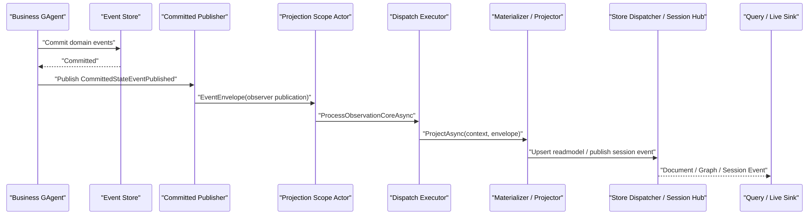
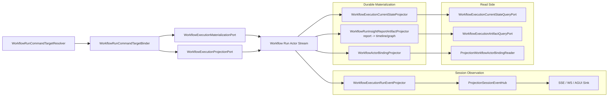
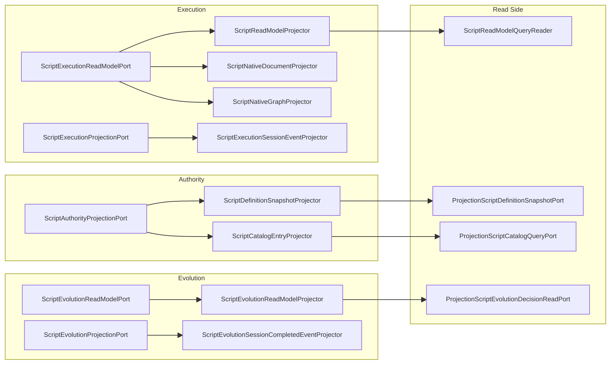
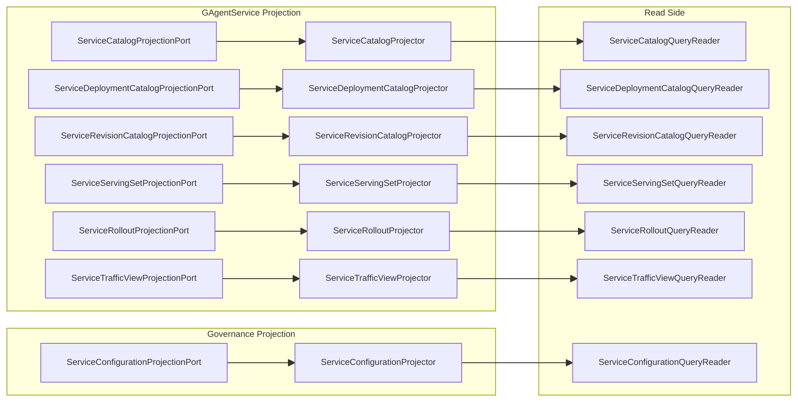

# Projection 全链路分析与问题清单

## 1. 文档信息

- 状态：`Active`
- 日期：`2026-03-17`
- 分析范围：
  - `src/Aevatar.Foundation.*`
  - `src/Aevatar.CQRS.Projection.*`
  - `src/workflow/Aevatar.Workflow.*`
  - `src/Aevatar.Scripting.*`
  - `src/platform/Aevatar.GAgentService*.Projection`

## 2. 结论摘要

当前 Projection 主干已经比较清晰，真实链路可以收敛为：

`actor commit -> EventEnvelope<CommittedStateEventPublished> -> scope actor -> durable materialization / session observation -> document / graph / query / session stream`

和旧控制面相比，当前实现已经完成了几件重要收口：

1. 读侧统一只消费 committed observation，不再允许旧式 `ProjectionEnvelope` 双轨。
2. durable materialization 与 session observation 都改成 actorized scope，host 只保留 activation/release 薄端口。
3. query/read 路径不再允许 projection priming，不再允许 query-time replay。
4. current-state projector 默认从 committed `state_root` 或 committed payload 直接物化，不回读旧 current-state 文档。

但从软件工程角度看，当前系统仍有 8 类明显问题：

1. feature 级 DI 与 runtime 装配矩阵仍然偏宽，虽然核心 helper 已收口，但 feature 手工装配仍然很多。
2. `projectionKind` / scope 命名已集中到 feature 常量集，但本质上仍是字符串协议。
3. 一个 root actor 会被多个 scope actor 直接订阅，订阅数随 feature 和 session 数增长。
4. failure handling 已有 replay / alert / retention 骨架，但仍缺少完整运维闭环。
5. 部分 artifact projector 仍采用 read-modify-write，文档会随事件增长。
6. graph materialization 成本偏高，当前实现接近“每次全量重写 + 清理”。
7. document / graph 多 store fan-out 仍然只是 best-effort，没有事务边界。
8. 各 feature 的 enable / lifecycle 语义已更接近一致，但 outward contract 仍不完全对齐。

## 3. 范围与核验

本次分析以代码为准，同时补跑了现有 Projection 相关门禁：

- `bash tools/ci/committed_state_projection_guard.sh`
- `bash tools/ci/query_projection_priming_guard.sh`
- `bash tools/ci/projection_state_version_guard.sh`
- `bash tools/ci/projection_state_mirror_current_state_guard.sh`
- `bash tools/ci/projection_route_mapping_guard.sh`

上述门禁本次全部通过。这说明“架构方向”大体正确，问题更多集中在复杂度、性能、一致性和可运维性，而不是主语义已经跑偏。

## 4. 工程地图

| 层 | 项目 | 当前职责 |
|---|---|---|
| Foundation | `Aevatar.Foundation.Core` / `Aevatar.Foundation.Abstractions` | actor commit 后发布 `CommittedStateEventPublished` |
| Projection Core Abstractions | `Aevatar.CQRS.Projection.Core.Abstractions` | `context / projector / materializer / lease / session hub` 抽象 |
| Projection Core Runtime | `Aevatar.CQRS.Projection.Core` | scope actor、activation/release、dispatch、session hub |
| Store Runtime | `Aevatar.CQRS.Projection.Runtime` | document/graph fan-out 写入 |
| Store Contracts | `Aevatar.CQRS.Projection.Stores.Abstractions` | readmodel、document、graph 通用契约 |
| Providers | `Aevatar.CQRS.Projection.Providers.*` | `InMemory / Elasticsearch / Neo4j` |
| Workflow Feature | `Aevatar.Workflow.Projection` + `Aevatar.Workflow.Presentation.AGUIAdapter` | current-state、artifacts、binding、AGUI live events |
| Scripting Feature | `Aevatar.Scripting.Projection` | execution/evolution/authority readmodel 与 session 链路 |
| Platform Feature | `Aevatar.GAgentService.Projection` | service catalog / deployment / rollout / serving / traffic / revision |
| Governance Feature | `Aevatar.GAgentService.Governance.Projection` | service configuration readmodel |
| Generic Helpers | `Aevatar.AI.Projection` | AI 通用 applier |

## 5. 全局主链

### 5.1 总览图

```mermaid
%%{init: {"maxTextSize": 100000, "flowchart": {"useMaxWidth": false, "nodeSpacing": 10, "rankSpacing": 50}, "themeVariables": {"fontSize": "10px"}}}%%
flowchart LR
    subgraph WRITE["Write Side"]
        W1["Business GAgent"]
        W2["Event Store Commit"]
        W3["CommittedStateEventPublished Publisher"]
    end

    subgraph OBS["Committed Observation Trunk"]
        O1["EventEnvelope<CommittedStateEventPublished>"]
    end

    subgraph CORE["Projection Core"]
        C1["Projection Port"]
        C2["Activation / Release Service"]
        C3["ProjectionScopeActorRuntime"]
        C4["Projection Scope Actor"]
        C5["ProjectionScopeDispatchExecutor"]
    end

    subgraph MODES["Runtime Modes"]
        M1["Durable Materialization"]
        M2["Session Observation"]
    end

    subgraph STORE["Store Runtime"]
        S1["ProjectionStoreDispatcher"]
        S2["ProjectionDocumentStoreBinding"]
        S3["ProjectionGraphStoreBinding"]
        S4["Document Provider"]
        S5["Graph Provider"]
    end

    subgraph READ["Read / Live Side"]
        R1["Query Reader / Query Port"]
        R2["ProjectionSessionEventHub"]
        R3["Live Sink / SSE / WS / AGUI"]
    end

    W1 --> W2 --> W3 --> O1
    C1 --> C2 --> C3 --> C4
    O1 --> C4
    C4 --> C5
    C5 --> M1
    C5 --> M2
    M1 --> S1
    S1 --> S2 --> S4 --> R1
    S1 --> S3 --> S5 --> R1
    M2 --> R2 --> R3
```

### 5.2 写侧到 committed observation

写侧事实发布非常集中：

1. `GAgentBase<TState>` 完成 commit。
2. 每个 committed `StateEvent` 被包装为 `CommittedStateEventPublished`。
3. payload 同时携带：
  - `state_event`
  - `state_root`
4. publisher 通过 observer publication 把 envelope 发回 actor stream。

这意味着 projection 默认不需要：

- 直接读 event store
- query-time replay
- 从旧 readmodel 反推当前态

### 5.3 核心时序

## 6. Core Runtime 链路

### 6.1 activation / release 链

当前 host/application 不直接保存 projection runtime 事实，而是走：

`ProjectionPort -> ActivationService / ReleaseService -> ProjectionScopeActorRuntime -> Scope Actor`

其中 scope actor key 由以下维度决定：

- `rootActorId`
- `projectionKind`
- `mode`
- `sessionId`（仅 session observation）

### 6.2 scope actor 内部职责

每个 scope actor 负责：

1. 为 `root actor stream -> scope actor stream` 建立并维护 relay binding。
2. 在自己的 inbox 内接收 forwarded committed observation。
3. 在 actor turn 内顺序执行 materializer / projector。
4. 记录：
  - `last_observed_version`
  - `last_successful_version`
  - `failures`
  - `released`

### 6.3 durable 与 session 的职责划分

| 维度 | Durable Materialization | Session Observation |
|---|---|---|
| 输入 | committed observation | actor envelope / committed observation |
| scope key | `rootActorId + projectionKind + durable` | `rootActorId + projectionKind + sessionId + session` |
| handler 抽象 | `IProjectionMaterializer<TContext>` | `IProjectionProjector<TContext>` |
| 输出 | document / graph readmodel | session event stream |
| 查询对象 | query ports / readers | live sink |

## 7. Store Runtime 链路

### 7.1 runtime fan-out

所有 readmodel 写入统一收口到：

- `ProjectionStoreDispatcher<TReadModel>`
- `ProjectionDocumentStoreBinding<TReadModel>`
- `ProjectionGraphStoreBinding<TReadModel>`

默认语义是：

1. 先写 document binding。
2. 再写 graph binding。
3. 中间失败时只走 compensator。
4. 当前默认 compensator 只是日志告警，不做事务补偿。

### 7.2 provider 装配

仓库当前 provider 形态：

- document:
  - `InMemory`
  - `Elasticsearch`
- graph:
  - `InMemory`
  - `Neo4j`

Workflow 与 Scripting 都在 Hosting 层强制“每种 store 类型只能启用一个 provider”。

## 8. Feature 链路

### 8.1 Workflow

Workflow 是当前最完整、链路最多的 projection 子域。

#### 8.1.1 Workflow 全链路图

#### 8.1.2 Workflow durable 链

- current-state:
  - `WorkflowExecutionCurrentStateProjector`
- artifacts:
  - `WorkflowRunInsightReportArtifactProjector`
    - 单一可变 artifact source，读取 `report` 后派生覆盖 `timeline/graph`
  - `WorkflowActorBindingProjector`

#### 8.1.3 Workflow session 链

- `WorkflowExecutionProjectionPort`
- `WorkflowExecutionRunEventProjector`
- `ProjectionSessionEventHub<WorkflowRunEventEnvelope>`
- `ChatEndpoints / ChatWebSocketRunCoordinator / SSE Writer`

#### 8.1.4 Workflow query 链

- actor current-state:
  - `WorkflowExecutionCurrentStateQueryPort`
- timeline / graph:
  - `WorkflowExecutionArtifactQueryPort`
- binding reader:
  - `ProjectionWorkflowActorBindingReader`

### 8.2 Scripting

Scripting 不是一条链，而是三组链并存：

1. execution
2. evolution
3. authority

#### 8.2.1 Scripting 全链路图

#### 8.2.2 Scripting 链路特点

- execution 同时有 durable current-state 与 session raw envelope live stream。
- evolution 既有 durable readmodel，也有 session completed event 通知。
- authority 负责 definition snapshot 与 catalog entry。
- scripting 还额外叠加：
  - `ScriptNativeDocumentMaterializer`
  - `ScriptNativeGraphMaterializer`
  - schema/materialization compiler

### 8.3 Platform / Governance

platform projection 全部是 durable materialization，没有 session live sink。

#### 8.3.1 Platform / Governance 图

#### 8.3.2 Platform / Governance 特点

- 基本都是 actor-scoped durable readmodel。
- query reader 全部直接读 document store。
- 没有 live sink。
- serving set / traffic view 属于“当前态复制”。
- catalog / rollout / revision / configuration 更像增量聚合文档。

### 8.4 Generic Helper 链

#### 8.4.1 AI Projection

`Aevatar.AI.Projection` 不直接定义业务 port，而是提供 durable materialization applier：

- `AITextMessageStartProjectionApplier`
- `AITextMessageContentProjectionApplier`
- `AITextMessageEndProjectionApplier`
- `AIToolCallProjectionApplier`
- `AIToolResultProjectionApplier`

它是 feature projectors 的子部件，不是单独一条 runtime。

## 9. 当前实现已经守住的点

下面这些点，当前代码和 guard 都已经基本守住：

1. committed-only：投影链默认以 `CommittedStateEventPublished` 为唯一主输入。
2. query 不 priming：query/read 路径不再触发 activation 或 ensure。
3. current-state 不本地发明版本号。
4. current-state 不回读旧 current-state 文档。
5. reducer route mapping 使用精确 `TypeUrl` 命中，而不是字符串 contains。
6. Workflow provider 选择在 Hosting 层，避免业务层直连 provider。
7. core runtime registration helper 已真正承担 activation / release / context / failure ops 装配职责。
8. Workflow artifact durable 链已从三路 projector 收敛到单一 `report` 累积源，再派生 `timeline/graph`。

## 10. 从软件工程角度看存在的问题

### 10.1 装配矩阵仍偏宽，但核心 runtime helper 已收口

问题表现：

1. Workflow、Scripting、Platform、Governance 都在各自 `ServiceCollectionExtensions` 里手工注册 context factory、lease factory、activation、release、query、metadata、projector。
2. 旧的 `ProjectionAssemblyRegistration` 已删除，但 feature 层仍有不少重复样板。
3. `AddProjectionMaterializationRuntimeCore(...)` 和 `AddEventSinkProjectionRuntimeCore(...)` 现在已经真正注册 activation / release / context / failure ops；但 projector、query port、feature options 仍要逐域手工装配。

结果：

- 新增一个 projection feature 的样板代码很多。
- 核心 runtime helper 已不再误导，但 feature outward wiring 仍显分散。
- 抽象复用比之前更好，不过装配复杂度还没完全降下来。

### 10.2 `projectionKind` 已集中命名，但本质上仍是字符串协议

问题表现：

1. 各 feature 已收口到 `WorkflowProjectionKinds / ScriptProjectionKinds / ServiceProjectionKinds / ServiceGovernanceProjectionKinds` 这类集中常量。
2. 但这些常量仍是字符串协议，scope actor key、日志和运维维度仍依赖文本口径稳定。
3. session 与 durable 在不同 feature 之间仍有不同的 outward naming 习惯。

结果：

- 直接散落的字面量问题已明显下降。
- 但 kind 仍缺少更强的仓库内语义约束，改名和排障仍依赖人工保持一致。

### 10.3 scope actor 数量和 relay binding 数量会随 feature/session 扩张

问题表现：

1. 每个 scope actor 都会为对应 root actor stream 建立一条 relay binding。
2. durable materialization 与 session observation 都是单独 scope。
3. 一个 root actor 可能同时挂多个 projection kind。

结果：

- relay binding 数不是按 actor 数增长，而是按 `actor * projectionKinds * sessions` 增长。
- Workflow/Scripting 这种 feature 较重的子域，会天然放大 stream fan-out。
- 这不会立刻违反语义，但会提高运行时和运维复杂度。

### 10.4 failure ops 已有骨架，但仍缺少完整运维闭环

问题表现：

1. scope failure 会把失败 envelope 持久到 `ProjectionScopeState.Failures`。
2. 当前 core 已新增 `IProjectionFailureReplayService`、`IProjectionFailureAlertSink` 与 bounded retention，scope failure 不再无限增长。
3. 但仓库里仍没有看到成体系的外部入口、后台恢复作业或告警整合。

结果：

- 框架已经具备“记录失败 + 触发告警 + 管理员重放”的基础能力。
- 但缺少真正的操作面和恢复编排，仍然更像骨架而不是完整产品能力。
- full envelope 持久进 failure state 的体积风险，也只是通过 retention 做了上限控制。

### 10.5 artifact projector 中的 read-modify-write 仍然很重

问题表现：

1. Workflow durable artifact 已收敛为“只读 `report`，再派生覆盖 `timeline/graph`”，不再由三个 projector 各自 read-modify-write。
2. Platform 的 catalog / rollout / revision / configuration 仍有类似增量拼装。
3. 这类 readmodel 往往不是小快照，而是会不断累积列表和聚合字段。

结果：

- Workflow artifact 写放大已经从“三次读 + 三次拼装”压到“一次读 + 派生覆盖写”。
- 但增长型文档依然存在，文档越大，序列化和 provider 交互成本仍会上升。
- 平台类增量聚合文档依旧会面临同类问题。

### 10.6 graph materialization 是当前最重的热点

问题表现：

1. `ProjectionGraphStoreBinding` 对每次 upsert 都会：
  - 重新 materialize 整个 graph
  - upsert 全部目标 nodes/edges
  - 枚举 owner 下现存 nodes/edges
  - 删除目标集合以外的 managed nodes/edges
2. 即使 Workflow 已把 artifact projector 合并，`WorkflowRunInsightReportArtifactProjector` 仍会在每个 committed event 后覆盖写 graph artifact document。

结果：

- 复杂度接近 `O(graph size)` 每事件。
- 在单线程 scope actor 下，这类重写会直接拉长 durable 链延迟。
- run 越长、graph 越大，这条链越像“持续全量重算”。

### 10.7 document / graph 双写仍然只是 best-effort

问题表现：

1. `ProjectionStoreDispatcher` 顺序写多个 sink。
2. document 成功、graph 失败时，只会进入 compensator。
3. 当前默认 compensator 只是日志，不会回滚 document，也不会把 graph 补齐成一个有 SLA 的异步事务。

结果：

- readmodel 与 graph 之间存在显式短暂或长期不一致窗口。
- 当前一致性保证更多依赖“重复事件重放后最终会再写一次”，而不是明确的事务边界。
- 这对 query 来说是诚实的，但对运维和排障仍然不够友好。

### 10.8 feature 级 enable / lifecycle 语义不统一

问题表现：

1. Workflow、Scripting、Platform、Governance 现在都已有显式 options / kind 常量收口。
2. 但不同 feature 对“禁用时 query 怎么表现、session 是否存在、materialization 是否必须常开”的 outward contract 仍不完全一致。
3. 有的 feature 同时提供 durable + session，有的只有 durable。

结果：

- 旧的“有些子域完全没有显式开关”问题已经收敛。
- 但 feature outward contract 仍然不够对称，运维仍需要分别理解各子域行为。

## 11. 我认为最值得优先处理的 4 个方向

1. 收敛装配模型：
   - 把重复的 `projector/query/options` feature 样板继续模板化。
   - 保持 core helper 只做真正承担职责的收口，不再回到空包装。

2. 压缩 artifact 写放大：
   - 继续把 Platform/Governance 一类增长型文档向“单一 source + 派生输出”靠拢。
   - graph 侧要避免每个事件都做整图清理。

3. 补齐失败运维闭环：
   - 把已有 replay / alert / retention 骨架接出真正的 admin surface、观测与后台恢复作业。
   - 不要停留在“能记失败”，而要可观测、可重放、可清理。

4. 统一 kind / lifecycle 语义：
   - 继续稳定 `projectionKind` 命名口径和 outward contract。
   - 明确哪些 feature 必须 always-on，哪些可以配置关闭。
   - 让日志、监控、排障维度稳定下来。

## 12. 总结

当前 Projection 系统的“主设计方向”已经是对的：

- committed-only
- actorized scope runtime
- durable / session 分轨
- query 不 priming
- current-state 不 query-time replay

所以现在最需要解决的，已经不是“方向错误”，而是“系统工程化还不够收敛”：

- feature 装配复杂度仍偏高
- graph 路径仍是热点，平台类增长文档仍有写放大
- 多 store 一致性与 failure ops 仍偏弱
- feature outward contract 还不够统一

如果后续要继续重构，我建议优先把“装配收口 + artifact 减重 + failure ops”作为同一阶段推进，而不是只继续新增 projector。

## 13. 本轮重构落地状态（2026-03-17，`projection-worktree`）

这轮代码调整已经把文档里的部分问题真正压下去了，但还没有把全部 8 项一次性全部关闭。

### 13.1 已明显解决或实质收敛

1. `10.6 graph materialization 热点`
   - `ProjectionGraphStoreBinding` 已删除，runtime 改为 `IProjectionGraphWriter<TReadModel> -> ReplaceOwnerGraphAsync(...)` 的 owner-level 覆盖写。
   - Workflow graph 不再先写 `WorkflowRunGraphArtifactDocument` 再由 graph store 重扫，而是直接从 `WorkflowRunInsightReportDocument` 物化 graph。
   - 这把原来“每次 graph upsert 都枚举 owner 现存 nodes/edges 再逐项清理”的热点从 runtime 层拿掉了。

2. `10.5 artifact 写放大`
   - Workflow durable artifact 链进一步减重：`report -> timeline/graph` 仍保留单一累积源，但 graph artifact document 已移除。
   - Platform / Governance 中，`ServiceRevisionCatalogProjector` 与 `ServiceConfigurationProjector` 已改成基于 committed `state_root` 的覆盖写，不再回读旧文档做增量拼装。

3. `10.8 feature enable / lifecycle 语义`
   - Platform / Governance query reader 已统一遵守 `Enabled` 语义，禁用时返回 `null/[]`，不再出现“部分 feature 无 gate、部分 feature 有 gate”的明显不对称。

### 13.2 仍然只解决了一部分

1. `10.5`
   - `ServiceCatalogProjector`、`ServiceRolloutProjector` 仍有增长型聚合文档问题。
   - 这些 readmodel 依赖的权威状态还没有完全收敛到可直接覆盖复制的形态，所以这一项只能算部分完成。

2. `10.8`
   - Query disable 语义已经向 Platform / Governance 对齐，但不同 feature 的 session / materialization 是否 always-on，仍没有被统一成一个仓库级 contract。

### 13.3 本轮未直接处理的项

1. `10.1` 装配模板化与 outward wiring 继续收口。
2. `10.2` `projectionKind` 从字符串协议升级为更强类型语义。
3. `10.3` scope actor / stream fan-out 扩张模型。
4. `10.4` failure ops 的 admin surface、后台恢复作业与告警整合。
5. `10.7` document / graph 双写的事务化或 SLA 化补偿。

### 13.4 验证状态

本轮 worktree 已完成并通过：

1. `dotnet build aevatar.slnx --nologo -m:1 -p:UseSharedCompilation=false`
2. `bash tools/ci/architecture_guards.sh`
3. `bash tools/ci/query_projection_priming_guard.sh`
4. `bash tools/ci/projection_state_version_guard.sh`
5. `bash tools/ci/projection_state_mirror_current_state_guard.sh`
6. `bash tools/ci/projection_route_mapping_guard.sh`
7. `bash tools/ci/committed_state_projection_guard.sh`
8. `bash tools/ci/test_stability_guards.sh`
9. `bash tools/ci/coverage_quality_guard.sh`

其中覆盖率门禁结果为：

- filtered line coverage = `88.4%`
- filtered branch coverage = `72.0%`
