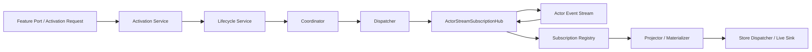
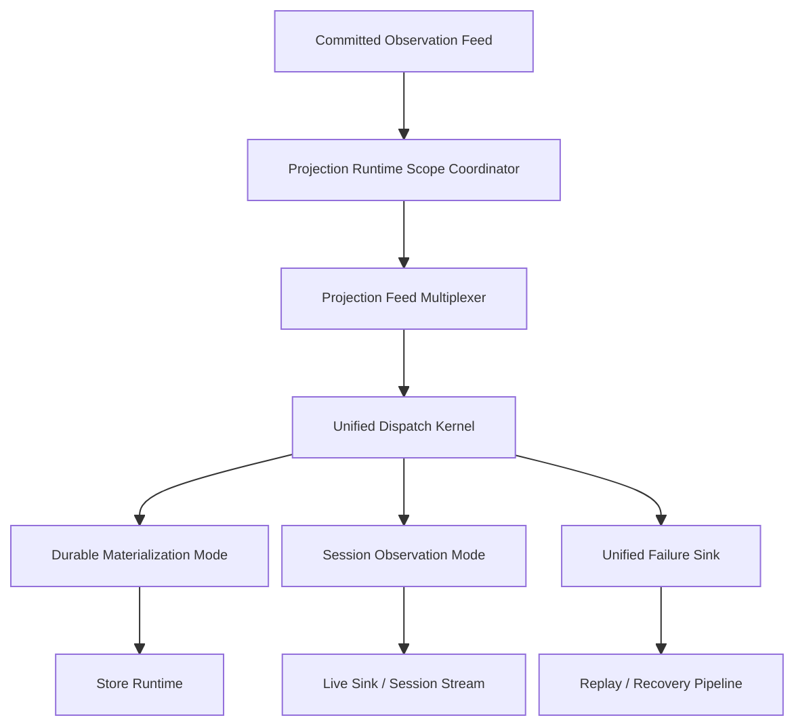

# Projection 框架层问题与重构实施蓝图

## 1. 文档目标

本文只分析 Projection 框架层本身，不讨论 Workflow、Scripting、Platform 的业务语义差异，重点回答三件事：

- 现有 Projection 框架内核存在哪些结构性问题。
- 重构后的框架边界、抽象和运行时形态应该是什么。
- 如何在不把系统打散的前提下，分阶段完成重构。

本文对应的是框架层重构蓝图，不是最终代码设计稿。目标是先统一约束、主干和实施顺序。

## 2. 范围与非目标

### 2.1 范围

本次重构范围限定在以下模块：

- `Aevatar.CQRS.Projection.Core.Abstractions`
- `Aevatar.CQRS.Projection.Core`
- `Aevatar.CQRS.Projection.Runtime`

涉及的核心职责包括：

- Projection runtime activation / lease / session / context
- actor stream subscription
- dispatch / routing / failure reporting / replay
- store materialization runtime
- framework guardrail 与约束收口

### 2.2 非目标

以下内容不在本文直接落地范围内：

- 不重新定义 Workflow/Scripting/Platform 的业务 read model。
- 不在本轮直接改造所有 feature projectors。
- 不在本轮引入新的业务 actor 协议。
- 不把 artifact/export/log 类视图全部一次性删除。

这些能力只在“迁移影响”章节中描述框架落地后的适配要求。

## 3. 当前框架快照

现有 Projection 框架实际上由两套非常接近的运行时叠加而成：

- `Session Observation`
- `Durable Materialization`

两者都包含相似的构件：

- activation service
- lifecycle service
- coordinator
- dispatcher
- subscription registry
- runtime lease

只是接口名和上下文类型不同。

当前主链路可以概括为：

框架表面上做了 `session` 和 `materialization` 的职责分离，但内部运行时机制并没有被统一抽象，反而复制了两套近似实现。

## 4. 框架层面的主要问题

### 4.1 Durable activation 不是幂等的权威事实

`ContextProjectionMaterializationActivationService.EnsureAsync(...)` 当前语义是“收到请求就创建一个新的 context + lifecycle + runtime lease，并立即启动订阅”。框架没有提供按以下维度唯一化的权威运行时事实：

- `actorId`
- `projection kind`
- `runtime mode`

结果是：

- 同一 actor 的 durable projection 可被重复激活。
- activation 调用者如果不长期持有 lease，框架层也不会自动复用既有 runtime。
- “是否已经存在 durable materialization” 不是一个可查询、可复用、可释放的权威状态。

这与仓库顶级约束冲突：Projection 运行态不应依赖中间层调用链偶然持有的进程内对象。

### 4.2 “Shared actor stream subscription” 名义存在，事实不存在

`ActorStreamSubscriptionHub<TMessage>` 当前每次 `SubscribeAsync(...)` 都会直接调用底层 `stream.SubscribeAsync<TMessage>(...)`。它没有：

- actor 维度的复用键
- ref-count
- 物理订阅复用
- host 内派发复用

因此它不是 “hub”，只是一个薄包装。

这会带来两个结果：

- 同一 actor 在同一 host 上可能被 durable/session 多次重复订阅。
- 随着 projection view 数量增加，底层订阅和反序列化开销近似线性增长。

### 4.3 Session 与 Materialization 运行时内核高度重复

以下成对类型几乎是同构的：

- `ProjectionLifecycleService` / `ProjectionMaterializationLifecycleService`
- `ProjectionCoordinator` / `ProjectionMaterializationCoordinator`
- `ProjectionDispatcher` / `ProjectionMaterializationDispatcher`
- `ProjectionSubscriptionRegistry` / `ProjectionMaterializationSubscriptionRegistry`

这种复制带来的问题不是“代码丑”，而是：

- 修一侧时很容易漏另一侧。
- 失败语义、路由规则、日志行为逐渐漂移。
- feature 团队理解成本高，容易把 session 路径和 durable 路径当成两套框架。

正确的语义区分应该保留，但内核机制不应该复制。

### 4.4 失败语义没有闭环

当前 dispatch 失败处理主要停留在：

- catch exception
- report failure
- log warning/error

问题在于失败后框架没有统一的可恢复语义：

- projector/materializer 失败通常直接丢事件
- route/filter/unpack 失败没有统一 durable replay 语义
- 只有 store fan-out 失败部分接入了 compensation/outbox/replay

因此现在的补偿系统只覆盖“写 store 失败”，没有覆盖“框架 dispatch 主链失败”。

这会造成两个严重后果：

- Projection 主链对暂时性失败不具备完整恢复能力。
- 线上数据缺口很难界定是 reducer 失败、dispatch 失败还是 store 失败。

### 4.5 公共 lease 抽象泄露了 transport/runtime 细节

当前公共抽象存在几个明显的设计泄露：

- `IProjectionRuntimeLease.GetLiveSinkSubscriptionCount()` 混入了 live sink 统计语义。
- `IProjectionStreamSubscriptionRuntimeLease.ActorStreamSubscriptionLease` 直接暴露底层 stream lease。
- `IProjectionContextRuntimeLease` 与 `IProjectionPortSessionLease` 的边界更像实现拼装结果，而不是稳定领域抽象。

这类泄露会导致：

- feature 层开始依赖 runtime 内部装配细节。
- durable materialization 也不得不背 live sink 语义。
- 框架未来替换 transport 或 subscription 形态时很难演进。

### 4.6 Durable materialization 没有在框架入口强制 committed-only

仓库规则明确要求 projection 只消费 committed facts，但当前框架没有把这条规则收成 runtime guardrail。

目前 durable 路径的 committed-only 主要依赖每个 materializer 自己做：

- `CommittedStateEventEnvelope.TryUnpack...`
- payload 类型判断
- event 类型兜底

框架层只做 observer publication 和 route filter，不做 committed observation 入口约束。

结果是：

- 框架无法从机制上保证 durable materialization 只消费 committed state feed。
- feature 模块可以继续把“过滤 committed payload”的责任散落到 projector/materializer 里。

### 4.7 Store runtime 的成功语义过弱

`ProjectionStoreDispatcher` 当前是顺序 fan-out：

- 先 document
- 再 graph
- 失败时再尝试补偿

框架层缺少更清晰的写入语义建模：

- 没有标准化 per-sink outcome
- 没有统一 freshness/watermark 表达
- 没有把“部分成功”建模为明确状态

这导致上层很难准确表达：

- 当前 read model 到底写到了哪一个权威版本
- 哪个 sink 成功，哪个 sink 失败
- replay 应该从哪个粒度恢复

### 4.8 框架级门禁还不够

仓库已有较多 projection 相关 guard，但框架层还有几个关键约束没有自动化：

- durable activation 必须可复用、不可重复激活
- durable materialization 必须 committed-only
- dispatch 主链失败必须进入统一 replay 语义
- framework public abstraction 不得泄露 transport handle

没有这些门禁，重构后规则仍然容易回退。

## 5. 重构目标与硬约束

本轮框架重构必须满足以下硬约束。

### 5.1 保留单一主干

系统只保留一条 Projection 主干：

- 权威输入：`EventEnvelope<CommittedStateEventPublished>` 或其同源 durable feed
- 统一 runtime control plane
- 一对多分发到 session observation 与 durable materialization

不能保留两套互不相干的 projection framework。

### 5.2 运行态事实必须有权威来源

以下事实必须由 actor 或分布式状态承载，而不是进程内字典：

- 某个 durable runtime scope 是否存在
- scope 当前 owner 是谁
- scope 当前 lease 是否有效
- session 是否仍处于附着状态

host 内缓存可以存在，但只能是派生缓存，不能是权威事实。

### 5.3 session 与 durable 语义分离，内核统一

必须同时做到两点：

- session observation 与 durable materialization 保持清晰语义区分
- activation / dispatch / failure / replay / subscription 等底层机制统一抽象

### 5.4 durable 路径必须 committed-only

durable materialization 的入口必须由框架保证 committed-only，而不是让每个 materializer 自行判断。

### 5.5 失败必须可重放

凡是进入 projection dispatch 主链的 committed event，如果没有被明确判定为“路由不匹配/正常忽略”，失败就必须进入统一 replay/recovery 语义。

### 5.6 公共抽象必须 runtime-neutral

feature 层可见的 lease/context/port 抽象不能泄露：

- stream implementation
- live sink 内部计数
- provider-specific handle
- host 内局部缓存结构

## 6. 目标架构

目标不是继续维护两套 runtime，而是形成“一个控制平面 + 两种运行模式 + 一个公共内核”。

其中：

- `Projection Runtime Scope Coordinator` 是权威控制平面。
- `Projection Feed Multiplexer` 是 host 内的非权威物理订阅复用层。
- `Unified Dispatch Kernel` 统一处理路由、派发、失败建模。
- `Durable Materialization Mode` 与 `Session Observation Mode` 只保留语义差异，不复制底层引擎。

## 7. 目标抽象设计

### 7.1 引入 Runtime Scope 作为统一事实单元

建议新增统一 scope 抽象：

- `ProjectionRuntimeScopeKey`
- `ProjectionRuntimeMode`
- `ProjectionRuntimeScopeState`

建议语义如下：

- `ProjectionRuntimeScopeKey`
  - `RootActorId`
  - `ProjectionKind`
  - `RuntimeMode`
  - `SessionId`（仅 session 模式需要）
- `ProjectionRuntimeMode`
  - `DurableMaterialization`
  - `SessionObservation`

这样可以明确：

- durable scope 的唯一键是 `actor + projection kind + durable mode`
- session scope 的唯一键是 `actor + projection kind + session id + session mode`

框架层不再把“lease 对象是否还活着”误当成事实源。

### 7.2 把 activation 改成 scope ensure / attach 语义

现有 `EnsureAsync(...)` 需要拆成更诚实的语义：

- `EnsureScopeAsync(...)`
- `AttachScopeAsync(...)`
- `ReleaseScopeAsync(...)`

其中：

- `EnsureScopeAsync(...)` 只负责确保权威 scope 存在并返回 scope 句柄。
- `AttachScopeAsync(...)` 只负责当前 host 附着到 scope，并建立本地订阅/派发。
- `ReleaseScopeAsync(...)` 负责显式释放 durable 或 session 附着。

这样可以避免当前“activation = 直接新建 runtime + 立即订阅”的隐式行为。

### 7.3 保留权威 control plane，新增本地 multiplexer

必须严格区分两类状态：

- 权威运行态事实
- host 内局部执行缓存

建议引入两个独立抽象：

- `IProjectionRuntimeScopeCoordinator`
- `IProjectionFeedMultiplexer`

职责分工：

- `IProjectionRuntimeScopeCoordinator`
  - 基于 actor/distributed state 维护 scope 是否存在、owner、lease、模式
  - 是 activation/release 的唯一权威入口
- `IProjectionFeedMultiplexer`
  - 仅在单 host 内复用同一 actor 的物理 stream subscription
  - 维护 ref-count、local consumers、fan-out
  - 不是权威事实源

这满足两个仓库约束：

- 不在中间层把本地字典当事实源
- 允许把本地缓存作为派生执行优化

### 7.4 合并 dispatch 内核

建议把当前两套 dispatcher/coordinator/registry 合并为一套内部内核，例如：

- `ProjectionDispatchKernel`
- `ProjectionDispatchPlan`
- `ProjectionDispatchScope`
- `ProjectionDispatchResult`

其中 mode-specific 差异只通过策略接口注入：

- `IProjectionDispatchModeAdapter`

由它决定：

- durable 还是 session
- route/filter 规则
- sink 类型
- success/failure 映射方式

这样可以保留语义差异，但不复制主流程。

### 7.5 把 committed-only 前移到 durable mode adapter

durable mode adapter 必须在统一入口做 committed-only 过滤，并在框架层输出标准化结果：

- `AcceptedCommittedObservation`
- `IgnoredNonCommittedObservation`
- `RejectedInvalidObservation`

不能再把 committed payload 判断散落到每个 materializer 内部。

这条规则应成为 durable dispatch kernel 的第一层 guardrail。

### 7.6 统一失败建模与 replay

建议新增统一失败记录模型，例如：

- `ProjectionDispatchFailureRecord`

至少包含：

- `ScopeKey`
- `ActorId`
- `ProjectionKind`
- `RuntimeMode`
- `EventType`
- `SourceVersion`
- `FailureStage`
- `FailureCategory`
- `RetryDisposition`

`FailureStage` 至少覆盖：

- subscription receive
- route resolution
- payload normalization
- projector/materializer execution
- store dispatch
- session sink dispatch

然后把当前只覆盖 store 的补偿链，扩展为统一 dispatch failure sink：

- `IProjectionDispatchFailureSink`
- `IProjectionDispatchReplayService`

原则是：

- 正常忽略必须显式可区分
- 非正常失败必须 durable 化并可重放

### 7.7 清理公共 lease 抽象

建议把公共 lease 抽象收敛为两层：

- feature-visible scope lease
- internal execution attachment

外部只保留类似：

- `IProjectionScopeLease`
- `IProjectionSessionLease`

内部才保留：

- stream subscription handle
- local sink attachment
- host execution token

这意味着以下能力不应继续暴露在公共接口中：

- `ActorStreamSubscriptionLease`
- `GetLiveSinkSubscriptionCount()`
- 任何 provider-specific 或 transport-specific handle

### 7.8 强化 store runtime 合同

`ProjectionStoreDispatcher` 需要从“顺序调用几个 sink”提升为“返回明确 outcome 的 store runtime”。

建议补充以下建模：

- `ProjectionStoreWriteOutcome`
- `ProjectionStoreSinkOutcome`
- `ProjectionMaterializationWatermark`

最少要能表达：

- document 成功 / graph 失败
- 当前成功写到的权威版本
- 哪个失败可重试，哪个需要人工介入

这样查询侧、replay 侧和治理侧才有共同语言。

## 8. 分阶段实施方案

### 8.1 Phase 1: 建立统一 scope 模型与新抽象

目标：

- 引入 `ProjectionRuntimeScopeKey`、`ProjectionRuntimeMode`、`IProjectionRuntimeScopeCoordinator`
- 新增统一 failure record/sink 抽象
- 为旧 lease/public port 加 `[Obsolete]` 或迁移层

涉及模块：

- `Aevatar.CQRS.Projection.Core.Abstractions`
- `Aevatar.CQRS.Projection.Core`

产出要求：

- 新旧抽象并存
- 不改 feature 行为
- 文档和命名先统一

### 8.2 Phase 2: 提取统一 dispatch kernel

目标：

- 合并 session/materialization 的 dispatcher/coordinator/registry 主逻辑
- 以 mode adapter 替代双份 orchestration 实现

优先改造对象：

- `ProjectionLifecycleService`
- `ProjectionMaterializationLifecycleService`
- `ProjectionCoordinator`
- `ProjectionMaterializationCoordinator`
- `ProjectionDispatcher`
- `ProjectionMaterializationDispatcher`
- `ProjectionSubscriptionRegistry`
- `ProjectionMaterializationSubscriptionRegistry`

阶段结果：

- 对外仍保留 session/materialization 入口
- 内部主流程统一

### 8.3 Phase 3: durable activation 改为权威 scope ensure

目标：

- durable runtime existence 改由 `IProjectionRuntimeScopeCoordinator` 管理
- activation 从“创建新 runtime”改为“ensure/attach 既有 scope”

关键要求：

- 同一 `actor + projection kind + durable mode` 只能存在一个权威 durable scope
- 重复 activation 必须幂等
- scope 生命周期必须可查询、可释放

这一步是整个框架重构的核心里程碑。

### 8.4 Phase 4: 落地 host-local feed multiplexer

目标：

- 让同一 host 上同一 actor 的物理订阅只建立一次
- durable/session 都从 multiplexer 拿逻辑 consumer attachment

优先改造对象：

- `ActorStreamSubscriptionHub`

实现要求：

- 可以用本地字典做 ref-count 和 fan-out
- 但必须明确声明其为 host-local derived cache
- 权威状态仍由 scope coordinator 管理

### 8.5 Phase 5: 统一 dispatch failure 与 replay 语义

目标：

- 把 projector/materializer/store/session sink 失败纳入统一 failure sink
- replay 不再只服务 store compensation

优先改造对象：

- `ProjectionDispatchCompensationOutboxGAgent`
- `ProjectionDispatchCompensationReplayHostedService`
- `DurableProjectionDispatchCompensator`

建议结果：

- compensation 语义升级为 generalized replay pipeline
- store failure 只是其一个 stage

### 8.6 Phase 6: durable committed-only guardrail 与 store outcome 落地

目标：

- durable mode 在框架入口统一做 committed-only 过滤
- `ProjectionStoreDispatcher` 输出显式 outcome / watermark

优先改造对象：

- `ProjectionDispatchRouteFilter`
- `ProjectionStoreDispatcher`
- `ProjectionMaterializationDispatcher`

结果要求：

- materializer 不再自己做 committed payload 兜底
- replay/freshness/query 都能读到统一结果模型

### 8.7 Phase 7: feature 迁移与旧抽象删除

目标：

- Workflow/Scripting/Platform 改接新 scope/lease 模型
- 删除旧 runtime lease 泄露接口
- 删除双份 orchestration 残留实现

这一阶段完成后，Projection 框架才算真正收口。

## 9. 迁移影响

虽然本文不展开 feature 细节，但框架重构后，所有 feature module 至少要做以下收敛：

- activation port 从“拿到 lease 就启动一套 runtime”改为“ensure scope + attach”
- durable projector/materializer 删除 committed payload 自行兜底逻辑
- query/binder 不得再假设 activation 每次都会创建新 runtime
- session/live sink 路径只消费 session adapter 暴露的稳定 lease，不再依赖内部 runtime handle

换句话说，feature 层需要接受的核心变化只有一个：

Projection runtime 从“临时拼装对象”升级为“有权威 scope 的基础设施能力”。

## 10. 风险与注意事项

### 10.1 不要把本地 multiplexer 再误做成事实源

这次重构里最容易走偏的一点，是把 host-local multiplexer 做成另一个“注册中心”。

必须强调：

- multiplexer 只负责本地物理订阅复用
- 它可以重建、丢失、重附着
- 它不负责声明某个 scope 是否存在

### 10.2 不要为了统一而抹掉语义边界

session observation 与 durable materialization 的业务语义不同，这点必须保留。

统一的是：

- orchestration kernel
- failure model
- scope lifecycle model

不是把 session 也强行变成 durable materialization。

### 10.3 不要继续扩大 replay 的职责

replay 只用于恢复 projection dispatch 主链失败，不应被重新扩展成：

- query-time rebuild
- on-demand priming
- feature 自定义 side rebuild

否则会再次违反仓库的 projection/query 边界约束。

### 10.4 Store outcome 建模不能伪装成强一致

即使 document 和 graph 都写成功，也只能说明：

- 某个权威版本已经被这些 sinks 成功物化

不能暗示：

- 所有查询入口都已经强一致可见
- 所有下游索引都已刷新完成

结果模型必须诚实表达边界。

## 11. 建议新增的 CI / 守卫

建议补充以下守卫脚本：

- `tools/ci/projection_runtime_scope_guard.sh`
  - 禁止 durable activation 直接 new runtime 并绕过 scope coordinator
- `tools/ci/projection_committed_only_guard.sh`
  - 禁止 durable materialization path 直接消费非 committed payload
- `tools/ci/projection_dispatch_failure_replay_guard.sh`
  - 禁止 dispatch 主链 catch 后仅 log/report 而不进入统一 replay sink
- `tools/ci/projection_public_abstraction_guard.sh`
  - 禁止公共接口暴露 transport-specific lease / handle

这些守卫是这轮重构长期生效的必要条件。

## 12. 结论

当前 Projection 框架的根问题不是“代码重复”本身，而是缺少一个统一、权威、诚实的 runtime 模型。现状把很多关键事实分散在：

- activation 调用链
- 临时 lease 对象
- 重复的 dispatcher/registry
- 局部补偿逻辑

结果是 durable/session 两条链都能工作，但框架不具备足够清晰的事实边界和故障恢复边界。

这次重构应当以 `runtime scope` 为中心收口：

- 用权威 control plane 管 scope 事实
- 用 host-local multiplexer 做物理订阅复用
- 用 unified dispatch kernel 收敛 session/materialization 主流程
- 用统一 failure/replay 模型闭合 dispatch 故障语义

只有这样，Projection 框架才能从“可运行的一组组件”升级为“可治理、可扩展、可验证的基础设施主干”。
