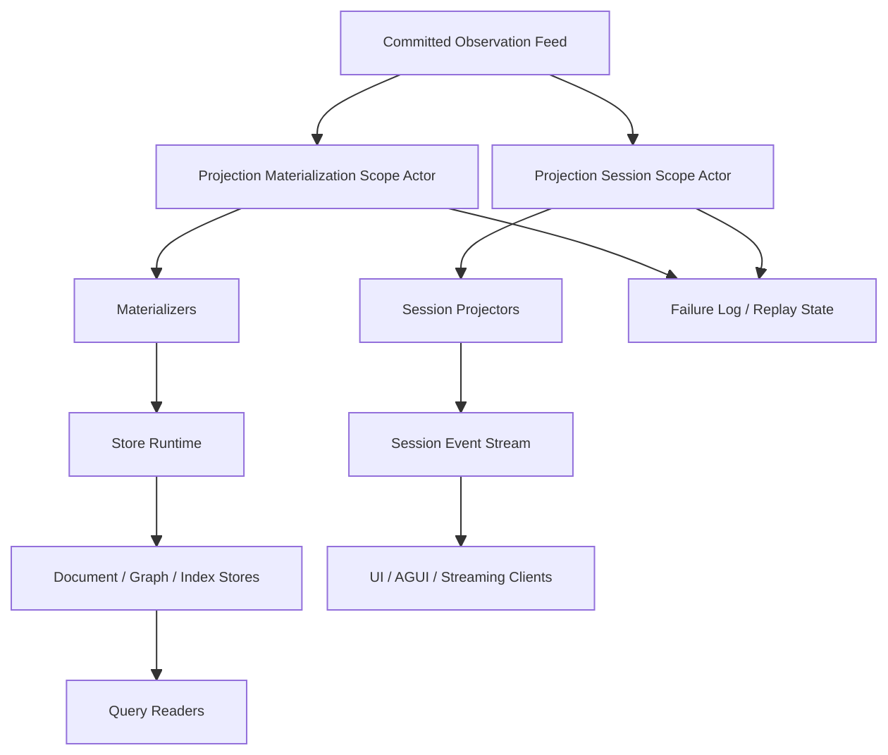

# Projection 框架 Actor 化瘦身重构蓝图

## 1. 文档定位

本文替换上一版 Projection 框架蓝图。

上一版的问题是：虽然看到了 `runtime scope / failure / committed-only` 这些核心矛盾，但实现方向仍然偏向“再造一个更完整的 projection runtime 平台”，复杂度继续上升，不符合当前仓库的顶级约束：

- Projection 两条链路都必须 Actor 化。
- Projection 运行态事实必须由 Actor 或分布式状态持有。
- 中间层不能再持有 `actorId / sessionId / scopeId -> runtime` 这类进程内事实映射。
- 框架必须瘦身，而不是继续叠控制面。

本文的目标不是“改良现有框架”，而是直接给出一个更瘦、更硬、更 Actor-first 的新框架方案。

## 2. 这次重构的核心结论

Projection 框架接下来只做一件事：

- 把 `Durable Materialization` 和 `Session Observation` 两条链路都收敛成 `scope actor`。

也就是说：

- `durable scope` 是 actor。
- `session scope` 是 actor。
- scope 的存在性、生命周期、订阅状态、失败记录、水位，都属于 scope actor 状态。
- host 侧只保留非常薄的 port / store adapter / session stream adapter。

这意味着以下方向全部放弃：

- 不再做 host-local runtime registry。
- 不再做 host-local multiplexer 作为框架核心。
- 不再保留 session/materialization 两套 lifecycle/dispatcher/registry。
- 不再让 live sink 附着关系参与 projection 生命周期判断。
- 不再保留额外的 ownership coordinator 作为 durable/session scope 事实源。

scope actor 自己就是控制面。

## 3. 当前框架的根问题

当前 Projection 框架的主要问题，不是某几个类写得重复，而是框架模型本身偏离了 Actor-first。

### 3.1 运行态事实不在 Actor 里

当前“某个 projection 是否已经启动”主要散落在：

- activation service
- lifecycle service
- runtime lease
- subscription registry
- 调用方是否还持有 lease

这意味着：

- `durable projection` 的存在性不是权威事实。
- `session projection` 的附着状态不是权威事实。
- 运行态依赖中间层对象关系，而不是 actor 状态。

### 3.2 session 与 materialization 各自复制了一套框架

当前核心组件成双成对出现：

- `ProjectionLifecycleService` / `ProjectionMaterializationLifecycleService`
- `ProjectionCoordinator` / `ProjectionMaterializationCoordinator`
- `ProjectionDispatcher` / `ProjectionMaterializationDispatcher`
- `ProjectionSubscriptionRegistry` / `ProjectionMaterializationSubscriptionRegistry`

这说明框架没有抓住真正的差异。

真正的差异只有：

- 一个输出 durable read model
- 一个输出 session stream

而不是两套完全独立的 runtime。

### 3.3 ActorStreamSubscriptionHub 仍然是中间层协调器

即使不把它视为权威事实源，它仍然把订阅和派发职责放在了 Actor 外部的中间层对象里。

问题在于：

- runtime 状态仍然由普通服务对象持有
- projection 是否 attached 仍不在 actor state 中
- 订阅失败、释放失败、重试语义仍然在 actor 外部收敛

这和“Projection 运行态 Actor 化”的目标相冲突。

### 3.4 live sink 附着语义绑坏了 session projection

现在 session projection 的释放逻辑依赖：

- 当前还有没有 live sink
- release service 是否判断 idle

这会把两个本应解耦的事情绑在一起：

- projection session 是否存在
- 某个 UI/client sink 是否还在订阅

正确模型应该是：

- session projection actor 负责把事件发布到 session stream
- UI/client sink 自己订阅 session stream
- sink 不应该反过来成为 projection 生命周期的事实源

### 3.5 durable committed-only 仍然没有收在框架入口

当前 durable materialization 虽然名义上只吃 committed 事实，但实际上大部分判断还散在 projector/materializer 内部。

这不符合框架职责。

durable scope actor 的入口就应该天然只接收 committed observation，不给 feature 模块继续兜底的空间。

### 3.6 failure / replay 仍然是“局部补偿”

现在 replay/compensation 主要覆盖 store fan-out 失败。

但真正的 projection 主链失败还包括：

- observation 收到但路由失败
- payload normalize 失败
- projector/materializer 执行失败
- session publish 失败

如果这些失败不进入同一个 scope actor 的恢复语义，最终一致性就不闭环。

### 3.7 Projection 框架被做得太像子平台

当前框架已经开始包含：

- activation orchestration
- lifecycle orchestration
- registry
- subscription hub
- compensation outbox
- replay hosted service
- ownership coordinator

这已经不是“projection framework”，而是一个单独的小平台。

我们现在要做的不是继续增强它，而是删层、收口、Actor 化。

## 4. 重构目标与硬约束

### 4.1 一切运行态事实都回到 scope actor

以下事实必须放到 scope actor 状态里：

- scope 是否存在
- scope 是否 active
- observation 是否 attached
- 最后处理到哪个 committed version
- 最后一次 materialization / session publish 结果
- 待 replay 失败项
- release / detach / cleanup 状态

### 4.2 actor id 直接等于 scope key

不要再有“scope actor + ownership coordinator actor”双层控制面。

正确做法是：

- scope key 直接编码为 actor id
- actor runtime 的单身份语义就是唯一控制面

建议：

- durable scope actor id = `projection:durable:{projectionKind}:{rootActorId}`
- session scope actor id = `projection:session:{projectionKind}:{rootActorId}:{sessionId}`

### 4.3 host 侧不保留长期 registry

host 侧允许存在的，只能是：

- port
- session stream codec/hub
- store runtime/provider
- actor dispatch/runtime adapter

host 侧禁止再保留：

- `scope -> runtime lease` 字典
- `actor -> context` 字典
- `session -> live sink list` 事实态
- `projection already started` 进程内标记

### 4.4 session projection 不再管理 live sink 生命周期

Projection 框架只负责：

- 生成 session event stream

不再负责：

- 维护某个 sink 是否 attached
- 用 sink 数量决定 session scope 是否释放
- 在 framework core 中保存 sink subscription handle

### 4.5 durable projection 必须天然 committed-only

durable scope actor 的 observation 入口必须只接收：

- `EventEnvelope<CommittedStateEventPublished>` 或同源 committed feed

feature materializer 看到的输入默认就是 committed fact，不再自己过滤。

### 4.6 replay 必须内聚到 scope actor

replay 不再是 framework 外侧的“补偿平台”。

正确模型是：

- scope actor 记录失败
- scope actor 触发 replay
- scope actor 推进自己的水位和恢复状态

### 4.7 framework 只提供最小主干

新框架只保留以下最小职责：

- scope actor protocol
- observation attach / detach
- ordered dispatch
- durable materialization runtime
- session stream publish runtime
- failure log / replay

除此之外一律不要再长。

## 5. 目标架构总图

这张图有两个关键点：

- 两条链路都直接是 actor，不再绕一层中间生命周期框架。
- `UI sink` 不再附着到 projection runtime 本身，而是订阅 session event stream。

## 6. 新框架的最小组成

## 6.1 两类 scope actor

只保留两类 actor：

- `ProjectionMaterializationScopeGAgent`
- `ProjectionSessionScopeGAgent`

它们都只表达运行态，不承载业务事实。

### 6.1.1 durable scope actor 职责

- 确保自己已经附着到目标 actor 的 committed observation feed
- 顺序接收 committed observation
- 调用 materializers
- 调用 store runtime
- 记录 per-sink outcome
- 记录失败并支持 replay
- 推进 durable watermark

### 6.1.2 session scope actor 职责

- 确保自己已经附着到目标 actor 的 observation feed
- 顺序接收 observation
- 调用 session projectors
- 发布 session event stream
- 记录 publish 失败
- 管理 session release / cleanup 状态

## 6.2 一个薄 port 层

host/application 侧只看到极薄端口：

- `EnsureDurableScopeAsync(scopeKey)`
- `ReleaseDurableScopeAsync(scopeKey)`
- `EnsureSessionScopeAsync(scopeKey)`
- `ReleaseSessionScopeAsync(scopeKey)`

端口职责只有：

- 计算 scope key
- 创建或获取 scope actor
- 发送 typed command

它不再：

- new context
- new runtime lease
- 持有 registry
- 订阅 actor stream
- 管理 sink attach/detach

## 6.3 一个薄 observation adapter

scope actor 需要一个极薄 observation adapter，用于：

- 订阅目标 actor observation feed
- 把收到的 envelope 重新事件化回 scope actor 自己的 inbox

注意：

- adapter 不是 registry
- adapter 不持有跨 scope 的事实状态
- adapter 只是 actor 到 stream 的连接器

## 6.4 一个薄 session stream adapter

session scope actor 不再理解 `IEventSink<TEvent>`。

它只需要：

- publish `TEvent` 到 session stream

UI / AGUI / downstream streaming client 如果要消费，就自己从 session stream 读。

## 6.5 一个更诚实的 store runtime

durable scope actor 调用的 store runtime 必须返回显式结果，而不是只有一个模糊 `Applied / Conflict`。

至少应包含：

- 当前 committed version
- 每个 sink 的结果
- 哪些 sink 成功
- 哪些 sink 失败
- 是否可重试

这些结果写回 scope actor state，作为恢复和治理依据。

## 7. 新框架中的状态与协议

## 7.1 durable scope state

建议 durable scope actor state 至少包含：

- `ScopeKey`
- `Status`
- `ObservationAttached`
- `LastObservedCommittedVersion`
- `LastMaterializedCommittedVersion`
- `LastSuccessfulStoreVersion`
- `LastStoreOutcomes`
- `PendingFailures`
- `Released`

这里最重要的是：

- `LastObservedCommittedVersion` 和 `LastMaterializedCommittedVersion` 必须显式分开

这样才能诚实表达：

- 我已经看到了某个 committed version
- 但不一定已经成功物化到了所有 sinks

## 7.2 session scope state

建议 session scope actor state 至少包含：

- `ScopeKey`
- `Status`
- `ObservationAttached`
- `LastObservedVersion`
- `LastPublishedVersion`
- `PendingFailures`
- `Released`
- `ExpiresAtUtc` 或 `LastTouchedAtUtc`

session actor 的关键不是 sink 数量，而是：

- session 是否仍然有效
- stream 是否仍应继续发布

## 7.3 scope actor command / event

建议最小协议如下：

- command
  - `EnsureProjectionScopeCommand`
  - `ReleaseProjectionScopeCommand`
  - `ReplayProjectionFailuresCommand`
  - `RefreshProjectionAttachmentCommand`
- internal event / signal
  - `ProjectionObservationArrivedEvent`
  - `ProjectionScopeAttachedEvent`
  - `ProjectionScopeReleasedEvent`
  - `ProjectionDispatchFailedEvent`
  - `ProjectionReplayCompletedEvent`
  - `ProjectionWatermarkAdvancedEvent`

这些协议必须是强类型 proto，而不是 bag。

## 8. 两条链路如何变瘦

## 8.1 Durable Materialization 链

```mermaid
%%{init: {"maxTextSize": 100000, "flowchart": {"useMaxWidth": false, "nodeSpacing": 10, "rankSpacing": 50}, "themeVariables": {"fontSize": "10px"}}}%%
flowchart LR
  A["EnsureDurableScope"] --> B["ProjectionMaterializationScopeGAgent"]
  B --> C["Attach Committed Observation"]
  C --> D["ProjectionObservationArrivedEvent"]
  D --> E["Materializer Dispatch"]
  E --> F["Store Runtime"]
  F --> G["Per-Sink Outcomes"]
  G --> H["Advance Watermark / Record Failure"]
```

这条链路的瘦身点在于：

- 删除 lifecycle/registry/dispatcher 这一整层 host runtime
- 删除额外 ownership coordinator
- committed-only 在 actor 入口强制
- 失败与重放直接回到 scope actor

## 8.2 Session Observation 链

```mermaid
%%{init: {"maxTextSize": 100000, "flowchart": {"useMaxWidth": false, "nodeSpacing": 10, "rankSpacing": 50}, "themeVariables": {"fontSize": "10px"}}}%%
flowchart LR
  A["EnsureSessionScope"] --> B["ProjectionSessionScopeGAgent"]
  B --> C["Attach Observation Feed"]
  C --> D["ProjectionObservationArrivedEvent"]
  D --> E["Session Projector Dispatch"]
  E --> F["Publish Session Stream"]
  F --> G["UI / AGUI / Consumers Subscribe Directly"]
```

这条链路的瘦身点在于：

- projection 不再知道具体 sink
- 不再维护 live sink attach/detach 列表
- 不再用 sink 数量决定 projection release
- 发布失败也由 session scope actor 自己记录与恢复

## 9. 必须删除的旧框架层

这次重构不考虑兼容性，因此以下旧层应直接删除，而不是保留适配壳。

### 9.1 host 中间生命周期层

- `ContextProjectionActivationService`
- `ContextProjectionMaterializationActivationService`
- `ContextProjectionReleaseService`
- `ContextProjectionMaterializationReleaseService`
- `ProjectionLifecycleService`
- `ProjectionMaterializationLifecycleService`
- `ProjectionSubscriptionRegistry`
- `ProjectionMaterializationSubscriptionRegistry`
- `ProjectionDispatcher`
- `ProjectionMaterializationDispatcher`
- `ProjectionCoordinator`
- `ProjectionMaterializationCoordinator`

### 9.2 host 中间订阅层

- `ActorStreamSubscriptionHub`
- `IActorStreamSubscriptionHub`
- `IProjectionStreamSubscriptionRuntimeLease`

### 9.3 live sink 绑定层

- `IProjectionPortSessionLease`
- `EventSinkProjectionSessionSubscriptionManager`
- `EventSinkProjectionLiveForwarder`
- `EventSinkProjectionFailurePolicyBase`
- `DefaultEventSinkProjectionFailurePolicy`
- `GetLiveSinkSubscriptionCount()` 相关语义

如果某些 feature 需要“给外部返回一个 session handle”，也只能返回 opaque handle，不再包含 sink attachment 逻辑。

### 9.4 多余控制面

- `ProjectionOwnershipCoordinatorGAgent`
- `ActorProjectionOwnershipCoordinator`
- `ProjectionOwnershipCoordinatorOptions`

scope actor 自身就是唯一控制面后，这一层应删除。

### 9.5 外围补偿平台化实现

- `ProjectionDispatchCompensationOutboxGAgent`
- `ProjectionDispatchCompensationReplayHostedService`
- 以及一切只围绕 store fan-out 的独立补偿框架

replay 要回到 scope actor 内聚处理。

## 10. 新框架建议保留的最小抽象

只保留必要抽象，不重新堆一层框架。

- `ProjectionRuntimeScopeKey`
- `ProjectionRuntimeMode`
- `IProjectionScopePort`
- `IProjectionObservationAdapter`
- `IProjectionSessionPublisher<TEvent>`
- `IProjectionStoreRuntime<TReadModel>`
- `ProjectionStoreWriteOutcome`
- `ProjectionStoreSinkOutcome`

其中：

- `IProjectionScopePort` 只负责 ensure/release
- `IProjectionObservationAdapter` 只负责 actor 附着 observation
- `IProjectionSessionPublisher<TEvent>` 只负责 publish stream
- `IProjectionStoreRuntime<TReadModel>` 只负责写 store 并返回 outcome

不要再重新引入：

- lifecycle
- registry
- coordinator
- multiplexer
- ownership overlay

## 11. Store runtime 需要同步瘦身

当前 `ProjectionStoreDispatcher` 的问题不是“顺序写”本身，而是它被放在一个独立补偿体系里，导致 durable failure 被拆开了。

新模型中应当改成：

- store runtime 只做一件事：按 sink 写并返回 outcome
- replay 决策由 durable scope actor 做
- sink 层不再自己启动补偿平台

建议 store runtime 至少返回：

- `SourceVersion`
- `AppliedSinks`
- `FailedSinks`
- `FinalDisposition`

这样 durable scope actor 才能在自己的 state 里留下诚实记录。

## 12. Graph 默认策略必须收紧

当前默认 graph binding 会做：

- upsert nodes/edges
- 全量列 owner 的 nodes/edges
- 删除脏数据

这对“框架默认行为”来说太重了。

新的框架默认策略应改成：

- 框架只负责 upsert 当前 materialized graph payload
- graph cleanup 不再作为默认框架行为

如果某个 graph view 确实需要全量替换语义，应显式声明为：

- full-snapshot graph projection

然后由该 projection 自己带 revision / prune 策略，或者单独由 artifact actor 管理。

不要把 O(n) owner scan 当成基础设施默认动作。

## 13. 对 Workflow / Scripting / Platform 的迁移要求

虽然本文只谈框架，但迁移会带来明确影响：

### 13.1 Workflow

- `WorkflowExecutionRuntimeLease` 不再承担 heartbeat / listener / stop handler 组合职责
- projection port 只负责 ensure session scope actor
- AGUI/live sink 改成直接订阅 session stream

### 13.2 Scripting

- `ScriptExecutionProjectionPort` / `ScriptEvolutionProjectionPort` 改为 session scope ensure port
- `ScriptExecutionReadModelPort` / `ScriptEvolutionReadModelPort` 改为 durable scope ensure port

### 13.3 Platform

- 所有 materialization port 改为 durable scope ensure port
- committed-only 过滤必须从 projector 内部移除，改由 framework 入口承担

## 14. 分阶段实施方案

## 14.1 Phase 1: 先删错层

先做删除，不先做增强。

目标：

- 删掉旧 lifecycle/registry/dispatcher 双套 host runtime
- 删掉 ownership coordinator
- 删掉 live sink attach/detach 进入 projection core 的能力

这一步完成前，不要继续加新 service 层。

## 14.2 Phase 2: 引入 scope actor 协议与状态

目标：

- 定义 `durable scope actor` 和 `session scope actor` 的 proto contract
- 定义 scope state
- 定义 ensure/release/replay/internal observation signal

这一步的重点是把运行态事实建模清楚。

## 14.3 Phase 3: durable 链路先 Actor 化

目标：

- 先把 durable materialization 全量切到 scope actor
- durable actor 直接消费 committed observation
- durable actor 直接维护 failure / watermark / replay

原因：

- durable 链路要求最高
- current-state read model 是最重要的权威副本

## 14.4 Phase 4: session 链路 Actor 化并与 sink 解耦

目标：

- session actor 负责 observation -> session stream
- UI/client 直接订阅 session stream
- 删除 sink attach/detach runtime 逻辑

这一步完成后，session projection 会大幅变薄。

## 14.5 Phase 5: store runtime 收敛

目标：

- `ProjectionStoreDispatcher` 改成 outcome runtime
- 删除独立补偿平台
- replay 回到 durable scope actor

## 14.6 Phase 6: feature 侧全部切换

目标：

- Workflow/Scripting/Platform 全部改接新 scope actor 端口
- 删除旧 runtime lease 体系
- 删除旧 event sink lifecycle port

## 14.7 Phase 7: 守卫与文档收口

目标：

- 加 CI guard，防止重新长回去
- 更新所有 Projection 相关架构文档

## 15. 必须新增的守卫

建议新增以下门禁：

- `tools/ci/projection_actorization_guard.sh`
  - 禁止在 `Projection.Core` 中重新出现 `registry/lifecycle/coordinator` 型中间层运行态
- `tools/ci/projection_no_host_scope_cache_guard.sh`
  - 禁止在 Projection/Application/Orchestration 中出现 `scopeId/actorId/sessionId -> runtime/lease/context` 的长期字典事实态
- `tools/ci/projection_no_sink_lifecycle_guard.sh`
  - 禁止在 Projection.Core 中重新引入 live sink attach/detach 生命周期管理
- `tools/ci/projection_durable_committed_only_guard.sh`
  - 校验 durable scope 只消费 committed observation
- `tools/ci/projection_scope_actor_guard.sh`
  - 校验 durable/session 两条链路的 runtime facts 由 scope actor 持有

## 16. 结论

这次重构最重要的不是“统一抽象”，而是回到一个更简单、更硬的结构：

- Projection 两条链路都 Actor 化
- scope actor 自己持有运行态事实
- host 侧不再维护 runtime registry
- session 只发布 stream，不再管理 sink
- durable 只吃 committed observation
- replay 回到 scope actor 内部

如果这条路线执行到位，Projection 框架会从现在这个“偏平台化、偏中间层协调”的形态，收敛为一个真正符合仓库约束的、Actor-first 的最小主干。

也就是说，新的框架不是“更聪明的协调器”，而是：

- 更少的层
- 更少的对象
- 更少的隐式生命周期
- 更清楚的权威事实边界

这才是这轮 Projection 重构应该达到的终态。
