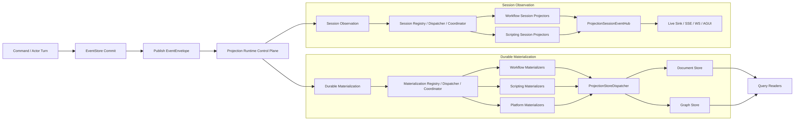
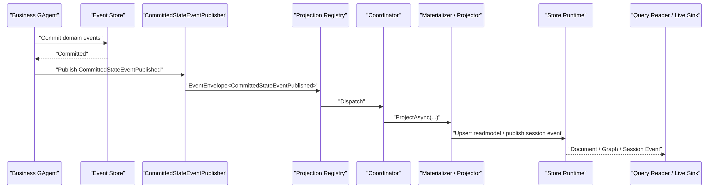
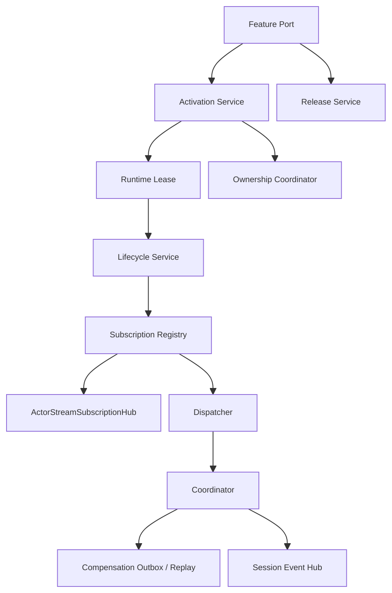
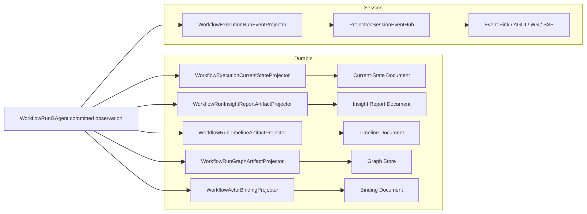
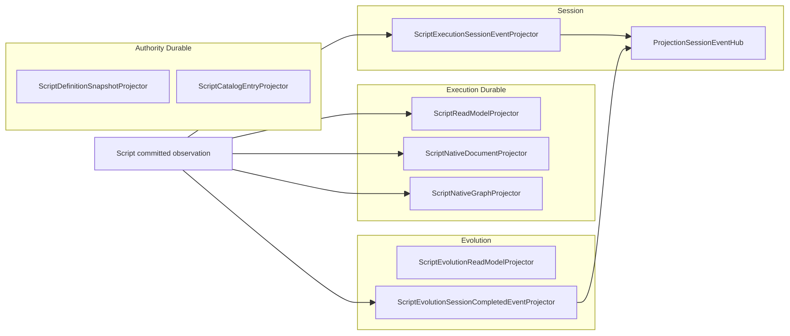

# Projection 全链路架构分析与问题清单

## 1. 文档信息

- 状态：`Historical Baseline + Post-Refactor Note`
- 日期：`2026-03-17`
- 范围：
  - `src/Aevatar.Foundation.*`
  - `src/Aevatar.CQRS.Projection.*`
  - `src/workflow/Aevatar.Workflow.*`
  - `src/Aevatar.Scripting.*`
  - `src/platform/Aevatar.GAgentService*.Projection`

## 2. 结论摘要

本文原始主体记录的是 2026-03-17 当天重构前的 Projection 系统全链路问题。对应的框架层问题已经在同日完成 actorized scope 重构；旧的 lifecycle / registry / ownership / compensation control plane 不再代表当前实现。

当前主干已经收口为：

`actor committed fact/state -> committed observation trunk -> scope actor runtime -> durable materialization + session observation -> document/graph/query/session stream`

已完成的框架层收敛包括：

1. durable 与 session 两条链都改为 `scope actor` 持有唯一运行态事实。
2. host 侧删除 `ContextProjection*Service / Projection*Registry / ActorStreamSubscriptionHub / ownership / compensation replay` 这套旧控制面。
3. platform projection 改为 committed-only，不再回退 raw envelope，也不再发明本地 `StateVersion`。
4. Workflow projection session 只发布 session stream，不再用 live sink 数量决定 projection 生命周期。
5. Workflow accepted-only 路径删掉无生产实现的 detached cleanup scheduler，改回通用 `DefaultDetachedCommandDispatchService<...>`。

这份文档中剩余的大段旧控制平面描述保留为历史分析基线，方便对照重构前后的复杂度差异。

## 3. 分析边界与项目地图

### 3.1 基础事实发布

- `src/Aevatar.Foundation.Core/GAgentBase.TState.cs`
- `src/Aevatar.Foundation.Runtime.Implementations.Local/Actors/LocalActorPublisher.cs`
- `src/Aevatar.Foundation.Runtime.Implementations.Orleans/Actors/OrleansGrainEventPublisher.cs`
- `src/Aevatar.Foundation.Abstractions/agent_messages.proto`

### 3.2 Projection Core

- `src/Aevatar.CQRS.Projection.Core.Abstractions`
- `src/Aevatar.CQRS.Projection.Core`
- `src/Aevatar.CQRS.Projection.Runtime`
- `src/Aevatar.CQRS.Projection.Runtime.Abstractions`
- `src/Aevatar.CQRS.Projection.Stores.Abstractions`

### 3.3 Feature Projection

- workflow：
  - `src/workflow/Aevatar.Workflow.Projection`
  - `src/workflow/Aevatar.Workflow.Presentation.AGUIAdapter`
- scripting：
  - `src/Aevatar.Scripting.Projection`
- platform：
  - `src/platform/Aevatar.GAgentService.Projection`
  - `src/platform/Aevatar.GAgentService.Governance.Projection`

### 3.4 Provider / Query

- document provider：
  - `src/Aevatar.CQRS.Projection.Providers.InMemory`
  - `src/Aevatar.CQRS.Projection.Providers.Elasticsearch`
- graph provider：
  - `src/Aevatar.CQRS.Projection.Providers.InMemory`
  - `src/Aevatar.CQRS.Projection.Providers.Neo4j`

## 4. 总体架构

### 4.1 总览图

### 4.2 核心语义分层

| 层 | 当前语义 | 代表抽象 |
|---|---|---|
| Write Side | `Command -> Commit -> Committed Observation` | `CommittedStateEventPublished` |
| Control Plane | activation / release / subscription / ownership / replay | `ContextProjection*Service`、`Projection*Registry` |
| Durable Materialization | committed observation -> readmodel | `IProjectionMaterializer<TContext>` |
| Session Observation | envelope -> session event -> sink | `IProjectionProjector<TContext>` |
| Store Runtime | document/graph 一对多写分发 | `IProjectionWriteDispatcher<TReadModel>` |
| Read Side | 直接读 persisted snapshot/document/graph | `IProjectionDocumentReader`、`IProjectionGraphStore` |

## 5. 主干链路

### 5.1 committed observation 如何进入 Projection

写侧事实发布非常明确：

1. actor turn 内完成 `EventStore` commit。
2. `GAgentBase<TState>` 在 commit 成功后逐条发布 `CommittedStateEventPublished`。
3. 发布通道仍然使用统一 `EventEnvelope`，route 是 `observer publication`。
4. Projection 默认消费 actor stream 上的 committed observation，而不是直接读 `IEventStore`。

### 5.2 committed observation 主链时序

## 6. Runtime Control Plane

### 6.1 控制平面组成

当前控制平面至少包括：

- activation：
  - `ContextProjectionActivationService`
  - `ContextProjectionMaterializationActivationService`
- release：
  - `ContextProjectionReleaseService`
  - `ContextProjectionMaterializationReleaseService`
- stream subscription：
  - `ProjectionSubscriptionRegistry`
  - `ProjectionMaterializationSubscriptionRegistry`
  - `ActorStreamSubscriptionHub`
- session event hub：
  - `ProjectionSessionEventHub`
- ownership：
  - `ActorProjectionOwnershipCoordinator`
  - `ProjectionOwnershipCoordinatorGAgent`
- compensation / replay：
  - `DurableProjectionDispatchCompensator`
  - `ProjectionDispatchCompensationOutboxGAgent`
  - `ProjectionDispatchCompensationReplayHostedService`

### 6.2 控制平面图

### 6.3 durable 与 session 的当前分工

#### durable materialization

- 输入：`ProjectionMaterializationStartRequest`
- 上下文：`IProjectionMaterializationContext`
- 执行单元：`IProjectionMaterializer<TContext>`
- 理论语义：actor-scoped durable readmodel materialization

#### session observation

- 输入：`ProjectionSessionStartRequest`
- 上下文：`IProjectionSessionContext`
- 执行单元：`IProjectionProjector<TContext>`
- 理论语义：session-scoped live observation

当前类型系统已经把二者分开，这是现有设计里最正确的一步。

## 7. Workflow Projection 链路

### 7.1 Workflow durable materialization

Workflow durable materialization 当前有两条 projection family：

1. `workflow-execution-materialization`
   - `WorkflowExecutionCurrentStateProjector`
   - `WorkflowRunInsightReportArtifactProjector`
   - `WorkflowRunTimelineArtifactProjector`
   - `WorkflowRunGraphArtifactProjector`
2. `workflow-binding`
   - `WorkflowActorBindingProjector`

### 7.2 Workflow session observation

Workflow session observation 当前主要输出：

- `WorkflowExecutionRunEventProjector`
  - 输入：workflow run committed observation
  - 输出：`WorkflowRunEventEnvelope`
  - 通道：`workflow-run`

### 7.3 Workflow 详细链路

### 7.4 Workflow 侧链

Workflow 还有比其他 feature 更重的控制平面侧链：

- projection ownership heartbeat
- projection control session stream
- detached cleanup outbox
- detached cleanup replay hosted service
- dispatch failure reporter
- sink failure policy

这些侧链说明 workflow projection 不只是 readmodel materialization，还承担了 run session 生命周期协调。

## 8. Scripting Projection 链路

### 8.1 Scripting durable materialization 分类

#### execution

- `ScriptReadModelProjector`
- `ScriptNativeDocumentProjector`
- `ScriptNativeGraphProjector`

输入不是直接 unpack `ScriptExecutionState`，而是读取 committed observation 中的 `ScriptDomainFactCommitted`。

#### authority

- `ScriptDefinitionSnapshotProjector`
- `ScriptCatalogEntryProjector`

#### evolution

- `ScriptEvolutionReadModelProjector`

### 8.2 Scripting session observation

- `ScriptExecutionSessionEventProjector`
  - 直接把 envelope 转成 session event
- `ScriptEvolutionSessionCompletedEventProjector`
  - 只对 `ScriptEvolutionSessionCompletedEvent` 做 session 通知

### 8.3 Scripting 详细图

Scripting 当前是所有 feature 里最接近“write-side 先产出 durable fact，projection 只消费 durable fact”的方向。

## 9. Platform / GAgentService Projection 链路

### 9.1 Platform durable views

平台侧当前全部是 durable materialization，没有 session/live 观察链：

- service：
  - catalog
  - deployments
  - revisions
  - serving
  - rollouts
  - traffic
- governance：
  - configuration

### 9.2 Platform 使用方式

应用服务在 dispatch command 之前，会主动调用各个 projection port 的 `EnsureProjectionAsync(actorId)`。

这意味着 platform projection 当前依赖 command-side activation，而不是统一的后台长期 materializer。

### 9.3 Platform 当前特殊点

platform projector 并不严格只接受 `CommittedStateEventPublished`。

`ServiceCommittedStateSupport` 和 `ServiceGovernanceCommittedStateSupport` 当前逻辑是：

1. 如果 envelope 是 committed observation，就读取 observed payload / version。
2. 否则退回到原始 envelope payload。
3. 如果没有 observed version，就本地发明 `StateVersion`。

这是当前系统中和仓库架构规则最明显不一致的一段实现。

## 10. Store / Provider / Query 链路

### 10.1 store runtime

store runtime 只有一件事：

`IProjectionWriteDispatcher<TReadModel>.UpsertAsync(readModel)`

其内部顺序遍历所有 active sink：

1. `ProjectionDocumentStoreBinding<TReadModel>`
2. `ProjectionGraphStoreBinding<TReadModel>`

### 10.2 provider 选择

Workflow host 当前策略是：

- document provider：Elasticsearch 或 InMemory，必须二选一
- graph provider：Neo4j 或 InMemory，必须二选一

这是正确的 capability 选择方式，不再是旧式 binding resolver。

### 10.3 query 路径

当前 query 基本遵循一条规则：

`Query -> persisted document / graph`

典型例子：

- workflow：
  - current-state document
  - timeline document
  - graph store
- scripting：
  - `ScriptReadModelDocument`
- platform：
  - service catalog/configuration document

这部分总体上比 materialization 更健康。

## 11. 现存问题清单

以下问题按严重程度和架构影响排序。

### 11.1 P0：durable materialization 没有 actor 级唯一 lease/订阅复用

#### 现象

`ContextProjectionMaterializationActivationService.EnsureAsync(...)` 每次都会：

1. 创建新的 `TContext`
2. 创建新的 `TRuntimeLease`
3. `StartAsync(...)`
4. 在 registry 中再订阅一次该 actor 的 stream

而调用方大量是这种模式：

- `await EnsureActorProjectionAsync(actorId, ct)`
- 立即丢弃返回 lease

典型调用点：

- workflow：`WorkflowExecutionMaterializationPort`
- scripting：`ProjectionScript*ReadModelActivationPort`
- platform：`Service*ProjectionPort`
- governance：`ServiceConfigurationProjectionPort`

#### 后果

1. 同一个 actor 重复 activation 会叠加多条 stream subscription。
2. 每条 committed observation 会被重复 materialize。
3. document/graph 会出现重复写负载。
4. 生命周期上没有地方回收这些 anonymous materialization lease。
5. 这已经不是“潜在优化点”，而是运行时事实源缺失。

#### 根因

当前 durable path 缺少：

- `actorId + projectionKind -> runtimeLease` 唯一注册表
- activation 幂等返回
- release ownership / active lease introspection

### 11.2 P1：故障恢复不闭环

#### 当前已有能力

- store fan-out 失败后可写入 compensation outbox
- replay hosted service 可轮询触发补偿

#### 缺口

以下失败不会自动重放：

1. `IProjectionMaterializer<TContext>` 自身抛错
2. `IProjectionProjector<TContext>` 自身抛错
3. 读旧文档失败
4. envelope 解包失败
5. durable registry dispatch 失败后，只有 warning / reporter，没有 durable retry

#### 结果

当前系统对“写入了一半”比对“根本没投进去”更关心。

这会导致 materializer 级错误成为 silent data loss 风险。

### 11.3 P1：platform projection 仍保留 raw envelope fallback 和本地 StateVersion 发明

`ServiceCommittedStateSupport` / `ServiceGovernanceCommittedStateSupport` 当前会：

1. 在 committed observation 不成立时直接使用原始 `envelope.Payload`
2. 在 `observedStateVersion == 0` 时本地推进 `StateVersion`

这和仓库明确的架构规则冲突：

- projection 只消费 committed 事实
- current-state readmodel version 必须跟权威源对齐

#### 风险

1. 读侧可能消费未承诺为 committed 的 runtime message。
2. readmodel version 失去和权威写侧的一一对应。
3. 不同 runtime/provider 下可能出现不同投影结果。

### 11.4 P1：多个 projector 仍是“读旧文档 + 增量补丁”模型

workflow 的：

- report
- timeline
- graph mirror

platform 的：

- catalog
- deployments
- revisions
- serving
- rollouts
- traffic
- configuration

大量使用如下模式：

1. `GetAsync(existing)`
2. `ShouldSkip(existing, stateEvent)` 或 mutate existing
3. 再 `UpsertAsync`

#### 问题

如果 projection 是后来激活、漏过早期事件、或者旧文档被删，这类 projector 往往只能得到一个“部分历史构造物”，而不是可验证地从权威当前态重建出来的 readmodel。

这意味着：

- 它更像 artifact accumulator
- 不是严格意义上的 actor current-state replica

### 11.5 P1：shared actor stream subscription 只存在于命名

`ActorStreamSubscriptionHub<TMessage>` 当前实现没有：

- actorId 级 ref-count
- 已存在 subscription lease 复用
- 共享 dispatch multiplex

它只是：

1. `GetStream(actorId)`
2. `SubscribeAsync(handler)`
3. 返回 disposable lease

所以：

- registry 每注册一次，底层就真订阅一次
- 文档中的 shared subscription 描述与实现不一致

### 11.6 P2：document + graph 非原子，graph cleanup 成本高

#### 非原子

`ProjectionStoreDispatcher` 顺序执行多个 sink。

结果是：

- document 成功，graph 失败
- graph 成功，document stale

这是当前模型允许的，但系统没有统一跨 store freshness contract。

#### cleanup 成本

`ProjectionGraphStoreBinding` 当前 graph upsert 后还会：

1. 列 owner 的所有 managed edges
2. 列 owner 的所有 managed nodes
3. 做差集删除

在图规模变大时，这个代价会持续上升。

### 11.7 P2：workflow control plane 过重

workflow projection 当前叠加了：

- ownership coordinator actor
- heartbeat
- projection control channel
- session runtime lease stop hook
- sink failure event
- dispatch failure event
- detached cleanup outbox
- detached cleanup replay

这导致：

1. 理解成本高
2. 排障路径长
3. feature 行为和 control plane 强耦合

workflow 当前最复杂的不是 projector，而是 projection lifecycle coordination。

### 11.8 P2：复合 query 没有统一 freshness 边界

例如 workflow 的 enriched snapshot 是：

1. 先读 current-state document
2. 再读 graph subgraph

两者没有：

- 同一版本戳
- 同一 committed watermark
- 同一 query fence

所以 query 结果可能是混合版本。

### 11.9 P2：工程样板过多，核心与 feature 耦合面偏大

当前新增一个 projection view，通常要补：

1. context
2. runtime lease
3. activation service registration
4. release service registration
5. projection port
6. metadata provider
7. materializer/projector
8. query reader
9. provider registration

这说明核心抽象虽然分层了，但装配成本仍偏高。

### 11.10 P3：CI guard 覆盖了边界，但没有覆盖最危险的 lifecycle 问题

当前已有 guard 覆盖：

- query 不能 priming projection
- current-state projector 不能本地发明 version
- state mirror 路径不能回读旧 readmodel
- reducer-era route mapping 禁止回潮

但还没有 guard 覆盖：

1. durable materialization 重复 activation 是否复用 lease
2. platform projector 是否只能消费 committed observation
3. materializer failure 是否进入 durable replay
4. registry 是否持有权威 activation 状态

## 12. 软件工程角度的总体评价

### 12.1 做对了的部分

1. 统一 committed observation trunk 是正确主干。
2. query/read path 基本已经诚实。
3. provider 选择已从 binding resolver 收口为 document/graph capability。
4. workflow/scripting/AGUI 共享同一输入主链，而不是双轨投影。
5. CI guard 已经开始把架构约束自动化。

### 12.2 还没有完成的部分

1. runtime control plane 还没有真正形成“单一权威 activation/lease state”。
2. durable materialization 还没有从“临时启动订阅”进化到“actor-scoped 常驻物化”。
3. artifact projector 与 current-state projector 的语义还没有完全分层。
4. failure handling 仍偏 store-centric，不够 materialization-centric。
5. platform 路径还保留了过渡态逻辑。

## 13. 建议的收敛方向

### 13.1 第一阶段：修正 durable materialization 生命周期

目标：

- 建立 `actorId + projectionKind` 唯一 runtime lease registry
- `EnsureActorProjectionAsync(...)` 变成幂等返回现有 lease
- 提供 active lease introspection / release

这是最优先的修正项。

### 13.2 第二阶段：强制所有 feature 只消费 committed observation

目标：

- 删除 platform raw envelope fallback
- 删除本地 `StateVersion` 补算
- 所有 projection version 都只来自权威 committed version

### 13.3 第三阶段：重划 current-state 与 artifact 的边界

建议：

- current-state readmodel：
  - 只能从 `state_root` 或等价 durable current-state fact 构建
- artifact readmodel：
  - 明确标记为 artifact/export/history
  - 不再伪装成 current-state replica

### 13.4 第四阶段：把 failure handling 扩展到 materializer 级

建议：

- materializer/projector dispatch failure 也进入 durable replay
- 明确 replay contract：
  - 哪些 readmodel 可重放
  - 哪些 session event 不可重放

### 13.5 第五阶段：重做 graph materialization 策略

方向：

- 避免每次全 owner 扫描
- 改成 versioned replace-set 或 delta-aware graph contract

## 14. 推荐新增 guard

建议新增以下 guard：

1. `projection_materialization_activation_reuse_guard`
   - 禁止 durable activation 丢弃唯一 lease 语义
2. `platform_projection_committed_only_guard`
   - 禁止 platform projector fallback 到 raw envelope payload
3. `projection_runtime_subscription_reuse_guard`
   - 禁止所谓 shared hub 实际重复订阅
4. `projection_failure_replay_coverage_guard`
   - 要求 durable dispatch failure 进入统一 replay contract

## 15. 最终判断

当前 Projection 系统已经完成了主干收口，但还没有完成运行态收口。

更准确地说：

- 语义主干已经对了
- 类型分层已经对了
- query 边界基本对了
- runtime lifecycle、subscription reuse、failure closure 还没有对完

如果只看架构方向，当前系统是可继续演进的。

如果看工程成熟度，当前最大的实际风险不是“字段命名”或“抽象命名”，而是：

`durable materialization runtime 仍缺少唯一 activation / lease / subscription 权威状态。`
