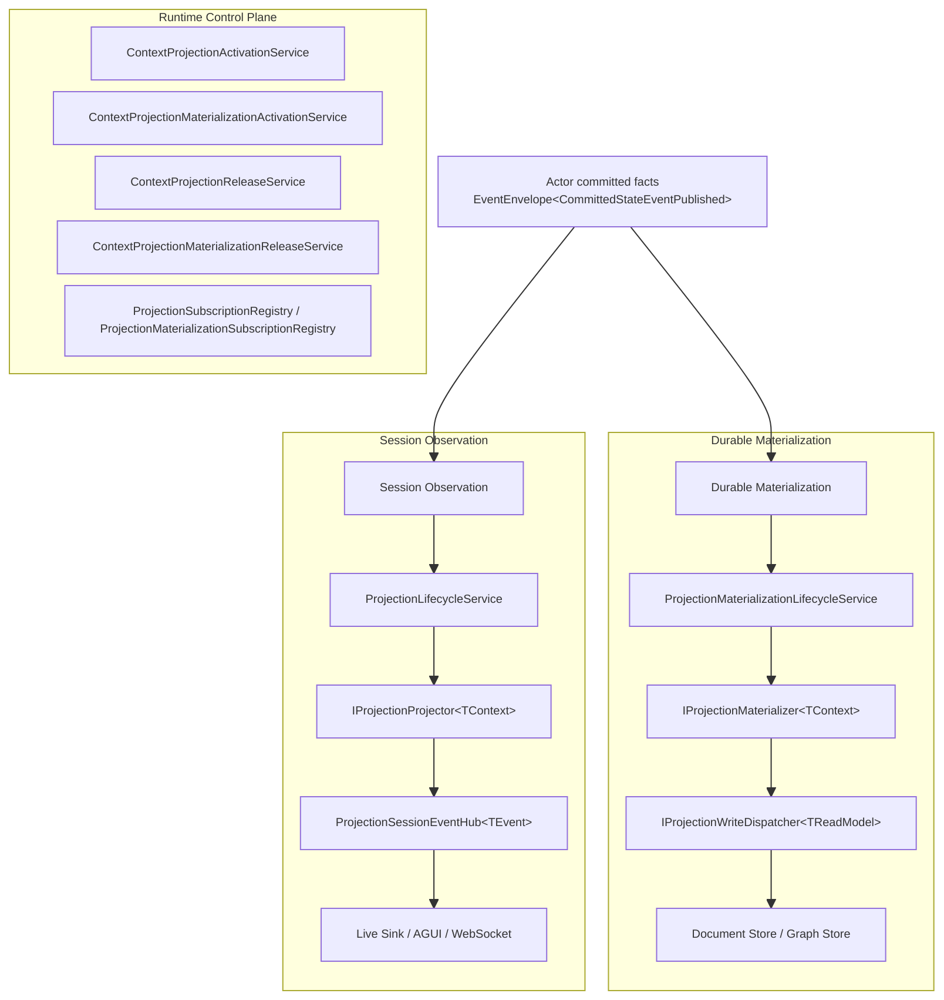

# Projection System 拆分式重构蓝图（已落地）

## 状态

- 本文描述当前代码中的已落地架构。
- 本次重构已经把 projection system 明确拆成三层：
  - `Durable Materialization`
  - `Session Observation`
  - `Runtime Control Plane`

## 一句话结论

当前系统不再把“写 readmodel”与“对外会话观察”混成一套接口：

- durable readmodel 物化只消费 committed observation，并直接写 document/graph store
- session observation 只负责 attach/detach/lease/live sink/AGUI 事件流
- runtime control plane 只负责启动、停止、订阅和 lease，不再承载 feature bag 业务字段

## 当前总图

## Durable Materialization

### 职责

只负责：

- `EventEnvelope<CommittedStateEventPublished>` -> readmodel
- committed typed artifact fact -> durable artifact readmodel

不负责：

- `SessionId`
- attach/detach
- live sink
- query-time priming

### 当前核心契约

- [IProjectionMaterializer.cs](/Users/auric/aevatar/src/Aevatar.CQRS.Projection.Core.Abstractions/Abstractions/Pipeline/IProjectionMaterializer.cs)
- [IProjectionMaterializationContext.cs](/Users/auric/aevatar/src/Aevatar.CQRS.Projection.Core.Abstractions/Abstractions/Core/IProjectionMaterializationContext.cs)
- [ProjectionMaterializationStartRequest.cs](/Users/auric/aevatar/src/Aevatar.CQRS.Projection.Core.Abstractions/Abstractions/Core/ProjectionMaterializationStartRequest.cs)
- [IProjectionMaterializationActivationService.cs](/Users/auric/aevatar/src/Aevatar.CQRS.Projection.Core.Abstractions/Abstractions/Ports/IProjectionMaterializationActivationService.cs)
- [IProjectionMaterializationReleaseService.cs](/Users/auric/aevatar/src/Aevatar.CQRS.Projection.Core.Abstractions/Abstractions/Ports/IProjectionMaterializationReleaseService.cs)
- [ProjectionMaterializationLifecycleService.cs](/Users/auric/aevatar/src/Aevatar.CQRS.Projection.Core/Orchestration/ProjectionMaterializationLifecycleService.cs)
- [MaterializationProjectionPortBase.cs](/Users/auric/aevatar/src/Aevatar.CQRS.Projection.Core/Orchestration/MaterializationProjectionPortBase.cs)

### 关键实现结果

- materialization start request 不再带 `SessionId`
- materialization activation/release 不再与 session lease 共用同一个接口名
- materialization port 不再伪造 `SessionId = actorId`

## Session Observation

### 职责

只负责：

- 启动可观察 projection session
- attach/detach sink
- 把 committed observation 或 live signal 转成 session event

不负责：

- durable readmodel 物化
- current-state document 更新

### 当前核心契约

- [IProjectionProjector.cs](/Users/auric/aevatar/src/Aevatar.CQRS.Projection.Core.Abstractions/Abstractions/Pipeline/IProjectionProjector.cs)
- [IProjectionSessionContext.cs](/Users/auric/aevatar/src/Aevatar.CQRS.Projection.Core.Abstractions/Abstractions/Core/IProjectionSessionContext.cs)
- [ProjectionSessionStartRequest.cs](/Users/auric/aevatar/src/Aevatar.CQRS.Projection.Core.Abstractions/Abstractions/Core/ProjectionSessionStartRequest.cs)
- [IProjectionSessionActivationService.cs](/Users/auric/aevatar/src/Aevatar.CQRS.Projection.Core.Abstractions/Abstractions/Ports/IProjectionSessionActivationService.cs)
- [IProjectionSessionReleaseService.cs](/Users/auric/aevatar/src/Aevatar.CQRS.Projection.Core.Abstractions/Abstractions/Ports/IProjectionSessionReleaseService.cs)
- [ProjectionLifecycleService.cs](/Users/auric/aevatar/src/Aevatar.CQRS.Projection.Core/Orchestration/ProjectionLifecycleService.cs)
- [EventSinkProjectionLifecyclePortBase.cs](/Users/auric/aevatar/src/Aevatar.CQRS.Projection.Core/Orchestration/EventSinkProjectionLifecyclePortBase.cs)

### 关键实现结果

- session port 仍然有 `SessionId`
- session release 只影响 live/session 订阅，不暗示 durable materialization 停止
- workflow 的 `workflowName/input` 之类 feature bag 参数已经从 session activation API 移除

## Runtime Control Plane

### 职责

只负责：

- activation
- release
- stream subscription registration
- live sink subscription
- runtime lease stop hook

不负责：

- 业务聚合
- readmodel 语义推导
- query 结果拼装

### 当前核心实现

- [ContextProjectionActivationService.cs](/Users/auric/aevatar/src/Aevatar.CQRS.Projection.Core/Orchestration/ContextProjectionActivationService.cs)
- [ContextProjectionMaterializationActivationService.cs](/Users/auric/aevatar/src/Aevatar.CQRS.Projection.Core/Orchestration/ContextProjectionMaterializationActivationService.cs)
- [ContextProjectionReleaseService.cs](/Users/auric/aevatar/src/Aevatar.CQRS.Projection.Core/Orchestration/ContextProjectionReleaseService.cs)
- [ContextProjectionMaterializationReleaseService.cs](/Users/auric/aevatar/src/Aevatar.CQRS.Projection.Core/Orchestration/ContextProjectionMaterializationReleaseService.cs)
- [ProjectionSubscriptionRegistry.cs](/Users/auric/aevatar/src/Aevatar.CQRS.Projection.Core/Orchestration/ProjectionSubscriptionRegistry.cs)
- [ProjectionMaterializationSubscriptionRegistry.cs](/Users/auric/aevatar/src/Aevatar.CQRS.Projection.Core/Orchestration/ProjectionMaterializationSubscriptionRegistry.cs)

## 已删除或失效的旧抽象

- `InitializeAsync(...)`
- `CompleteAsync(...)`
- `TTopology`
- `TCompletion`
- 让 durable materialization 复用 `ProjectionSessionStartRequest`
- 让 session activation API 传递 `workflowName/input` 之类业务字段

## 各子系统当前落点

### workflow

- durable：
  - [WorkflowExecutionCurrentStateProjector.cs](/Users/auric/aevatar/src/workflow/Aevatar.Workflow.Projection/Projectors/WorkflowExecutionCurrentStateProjector.cs)
  - [WorkflowRunInsightReportDocumentProjector.cs](/Users/auric/aevatar/src/workflow/Aevatar.Workflow.Projection/Projectors/WorkflowRunInsightReportDocumentProjector.cs)
  - [WorkflowRunTimelineReadModelProjector.cs](/Users/auric/aevatar/src/workflow/Aevatar.Workflow.Projection/Projectors/WorkflowRunTimelineReadModelProjector.cs)
  - [WorkflowRunGraphMirrorProjector.cs](/Users/auric/aevatar/src/workflow/Aevatar.Workflow.Projection/Projectors/WorkflowRunGraphMirrorProjector.cs)
- session：
  - [WorkflowExecutionProjectionPort.cs](/Users/auric/aevatar/src/workflow/Aevatar.Workflow.Projection/Orchestration/WorkflowExecutionProjectionPort.cs)
  - [WorkflowExecutionRunEventProjector.cs](/Users/auric/aevatar/src/workflow/Aevatar.Workflow.Presentation.AGUIAdapter/WorkflowExecutionRunEventProjector.cs)

### scripting

- durable：
  - [ScriptReadModelProjector.cs](/Users/auric/aevatar/src/Aevatar.Scripting.Projection/Projectors/ScriptReadModelProjector.cs)
  - [ScriptNativeDocumentProjector.cs](/Users/auric/aevatar/src/Aevatar.Scripting.Projection/Projectors/ScriptNativeDocumentProjector.cs)
  - [ScriptNativeGraphProjector.cs](/Users/auric/aevatar/src/Aevatar.Scripting.Projection/Projectors/ScriptNativeGraphProjector.cs)
- session：
  - [ScriptExecutionProjectionPort.cs](/Users/auric/aevatar/src/Aevatar.Scripting.Projection/Orchestration/ScriptExecutionProjectionPort.cs)
  - [ScriptExecutionSessionEventProjector.cs](/Users/auric/aevatar/src/Aevatar.Scripting.Projection/Projectors/ScriptExecutionSessionEventProjector.cs)

### platform

- 已统一走 materialization activation/release
- 不再用 session request 承载 durable service catalog/readmodel 物化

## 收尾说明

- durable materialization 仍然通过 feature command/application 层显式 activation；这已经是清晰的 orchestration policy，不再是类型系统混淆，但仍可继续评估是否要默认常驻。
- workflow artifact projector 仍会解释一组 root committed event type 来构建 report/timeline/graph；这是 artifact 语义，不再是 secondary authority。
