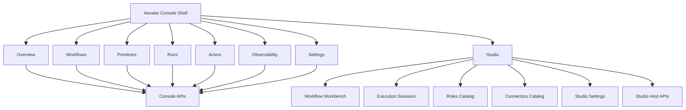
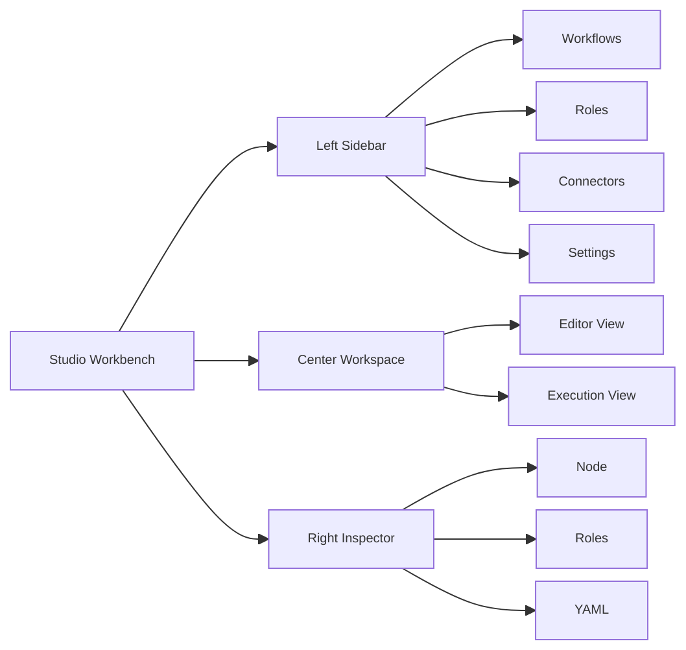

# Aevatar Console 接入 Aevatar App Studio 架构方案

## 1. 文档目标

本文定义一个明确目标：

- `aevatar-console-web` 继续作为 **Aevatar Console 主前端**
- `aevatar app` 中已经成熟的 workflow / Studio 能力被 **完整收编**
- `workflow` 只是 Console 的一个子域，不得反向吞掉 `Overview / Primitives / Runs / Actors / Observability / backend capability` 这些 Console 主能力
- 第一阶段默认 **不修改后端主链**，前端允许一次结构化重构

补充阅读：

- 当前代码状态下 `Console` 与 `App` 在 workflow 维度的职责差异，见 `docs/architecture/2026-03-19-aevatar-console-app-workflow-comparison.md`

本文基于以下现状代码与文档：

- `docs/2026-03-18-aevatar-app-login-workflow-execution-mechanism.md`
- `tools/Aevatar.Tools.Cli/Frontend/src/App.tsx`
- `tools/Aevatar.Tools.Cli/Frontend/src/api.ts`
- `tools/Aevatar.Tools.Cli/Hosting/NyxIdAppAuthentication.cs`
- `tools/Aevatar.Tools.Cli/Hosting/AppStudioEndpoints.cs`
- `tools/Aevatar.Tools.Cli/Studio/Host/Controllers/WorkspaceController.cs`
- `tools/Aevatar.Tools.Cli/Studio/Application/Services/ExecutionService.cs`
- `apps/aevatar-console-web/config/routes.ts`
- `apps/aevatar-console-web/src/pages/studio/index.tsx`

## 2. 结论

最优解不是把 `aevatar app` 当作另一个前端长期并存，也不是把 `aevatar-console-web` 重构成只剩 Studio 的应用。

最优解是：

- `Console Shell` 保留并继续强化系统能力展示、资产浏览、运行观测与后台信息入口
- `Studio Module` 作为 Console 内的一等子产品，完整吸收 `aevatar app` 的 workflow authoring / execution session / roles / connectors / settings 能力
- `tools/Aevatar.Tools.Cli/Frontend` 最终删除
- `tools/Aevatar.Tools.Cli` 的 Host/BFF 在第一阶段继续保留，作为 Studio 宿主语义与 API 提供方

一句话概括：

> `Console` 是产品壳，`Studio` 是 workflow 子域；不是“Console 变 App”，而是“App 的 Studio 能力并入 Console”。

## 3. 设计约束

本方案遵循以下约束：

1. 不破坏 `Console` 的主定位  
   `aevatar-console-web` 必须继续承担后端能力展示、信息查询、运行观测与资产浏览。

2. 不引入第二套长期前端  
   `tools/Aevatar.Tools.Cli/Frontend` 只能作为迁移来源，不能与 `console-web` 长期双维护。

3. 第一阶段不修改后端主链  
   不修改 `src/` 下的 workflow/runtime 主链；优先复用当前 `tools/Aevatar.Tools.Cli` 提供的 Studio Host API。

4. 尊重现有权威事实边界  
   published workflow、workflow binding、Studio catalog、execution UI 聚合，来自不同事实源，不能在前端混成一个模型。

## 4. 当前系统的真实边界

根据 `2026-03-18-aevatar-app-login-workflow-execution-mechanism.md`，当前 `aevatar app` 的 workflow 主线不是“前端直接调 actor”，而是：

1. `NyxID/OIDC + Cookie` 解决登录与 scope
2. `ServiceCatalogReadModel` 解决 scope 下 published workflow 列表与 active definition actor
3. `WorkflowActorBindingDocument` 解决 actor 绑定与 source 补全
4. `WorkflowRunActorPort + WorkflowRunGAgent` 解决每次 run 的真正执行
5. `WorkflowRunEventEnvelope + CurrentState readmodel` 解决实时流与 durable completion
6. `ExecutionService + IStudioWorkspaceStore` 解决 Studio execution 面板自己的本地聚合态

其中必须明确区分 4 套事实源：

### 4.1 Published workflow 列表

权威源：

- `ServiceCatalogReadModel`

语义：

- 当前 scope 下有哪些已发布 workflow
- 当前 active deployment 的 definition actor 是谁

### 4.2 Workflow actor binding

权威源：

- `WorkflowActorBindingDocument`

语义：

- 这个 actor 是否 workflow-capable
- 它是 definition binding 还是 run binding
- 它绑定的 `workflowName / workflowYaml / inlineWorkflowYamls / definitionActorId / runId`

### 4.3 Studio connectors / roles catalog

权威源：

- `Chrono-storage` 中的 Studio catalog
- 本地 draft 存储

语义：

- 这是 Studio authoring 配置，不等于 runtime `IConnectorRegistry`

### 4.4 Studio execution 面板状态

权威源：

- `ExecutionService` 写入的 `StoredExecutionRecord`

语义：

- 这是 UI 聚合视图，不是 runtime 分布式权威状态

## 5. 为什么不能简单“把 App 页面搬进 Console”

不能原样整页复制的原因不是视觉风格，而是模型边界：

1. `aevatar app` 前端不是单页编辑器，而是完整 `Studio Workbench`
2. 旧 `App.tsx` 是一个单体壳，耦合了登录门面、workspace、catalog、execution、右侧 inspector、theme、settings
3. `Console` 本身已经有自己的主导航、能力页和后台信息展示页
4. 如果整页复制，会导致新的双轨：
   - 一套 Console 页
   - 一套 Studio Frontend 页
5. 如果继续把 workflow 逻辑散落到 `playground / yaml / settings / studio` 四处，长期会重新形成第二系统

所以要迁的是：

- **Studio 的宿主语义**
- **Studio 的工作台结构**
- **Studio 的 API 与状态模型**

而不是整页照搬。

## 6. 目标架构

### 6.1 顶层形态



### 6.2 两层前端

#### Console Shell

职责：

- 全局导航
- 系统总览
- 后端 capability / primitives 展示
- published workflow library
- run / actor / observability 查询
- 系统级设置

主要依赖：

- `consoleApi`
- runtime capability / query APIs

#### Studio Module

职责：

- workflow 编排
- YAML 编辑
- published workflow fork / scope workflow save
- workspace / draft 工作流管理
- execution session 面板
- roles / connectors catalog
- Studio runtime / provider settings
- Ask AI / import / upload

主要依赖：

- `/api/auth/me`
- `/api/app/context`
- `/api/workspace/*`
- `/api/editor/*`
- `/api/executions/*`
- `/api/roles/*`
- `/api/connectors/*`
- `/api/settings/*`
- `/api/app/workflow-generator`

## 7. 信息架构

推荐保留并收敛为下面这组入口：

1. `Overview`
2. `Workflows`
3. `Studio`
4. `Primitives`
5. `Runs`
6. `Actors`
7. `Observability`
8. `Settings`

### 7.1 每个入口的单一职责

#### `Overview`

- 展示 Console 总览
- 展示 workflow/runs/actors/observability/studio 入口
- 不做实际 authoring

#### `Workflows`

- 展示已发布 workflow library
- 展示 workflow capability 资产
- 提供 `Open in Studio`
- 不负责编辑

#### `Studio`

- 作为 workflow authoring 唯一主入口
- 承担旧 `aevatar app` 的完整 workflow 前端职责

#### `Primitives`

- 展示后端暴露的 primitives/capabilities
- 为 Studio 提供“Use in Studio”深链

#### `Runs`

- 展示全局运行视图与人工交互态
- 支持跳回 Studio execution

#### `Actors`

- 展示 actor、binding、graph、timeline
- 支持从 Studio execution 跳转到 actor 视图

#### `Observability`

- 展示观测入口、trace、外部链接

#### `Settings`

- 仅保留 Console 系统级设置
- 不再承担 workflow authoring 设置

## 8. Studio 目标页面结构

Studio 内部应直接吸收旧 `aevatar app` 的 workbench 结构：



这套结构对应旧 `App.tsx` 中已经验证过的模式：

- `workspacePage = workflows | roles | connectors | studio | settings`
- `studioView = editor | execution`
- `rightPanelTab = node | roles | yaml`

### 8.1 一致性原则

对于 `Studio` 子域，页面结构和功能应尽量与 `aevatar app` 保持一致。

这样做的收益是：

- 降低迁移风险，直接复用已经跑通的 workbench 结构与交互模型
- 降低用户从旧 `aevatar app` 切换到 `console-web` 的学习成本
- 降低 `tools/Aevatar.Tools.Cli/Frontend` 下线前的双维护成本
- 避免 `console-web` 在 Studio 域重新发明第二套 authoring 信息架构

但“一致”只适用于 `Studio` 子域，不适用于整个 `Console`。

### 8.2 哪些要一致，哪些不要一致

| 范围 | 是否与 `aevatar app` 保持一致 | 说明 |
| --- | --- | --- |
| `Studio` 左侧工作区结构 | 是 | 保持 `Workflows / Roles / Connectors / Settings` 的工作区分区 |
| `Studio` 中央主区结构 | 是 | 保持 `Editor / Execution` 双视图 |
| `Studio` 右侧检查面板 | 是 | 保持 `Node / Roles / YAML` inspector 结构 |
| `Studio` execution 面板 | 是 | 保持旧 app 的 execution trace、resume、stop、日志与交互组织方式 |
| `Studio` catalog 页面 | 是 | 保持 roles / connectors / settings 的工作台式组织，而不是散落到多个 Console 页面 |
| `Studio` bootstrap 语义 | 是 | 采用 `/api/auth/me` 与 `/api/app/context` 的宿主语义，而不是在 Studio 内自建第二套登录恢复逻辑 |
| 顶层主导航 | 否 | `Console` 仍保留 `Overview / Workflows / Studio / Primitives / Runs / Actors / Observability / Settings` |
| `Overview` 页面 | 否 | 它是 Console 总览，不是 Studio 首页 |
| `Primitives` / capability 展示 | 否 | 保持 Console 的系统能力展示职能 |
| `Runs` / `Actors` / `Observability` | 否 | 保持 Console 的全局观测与查询职能，不并入 Studio workbench |
| Console 系统级 `Settings` | 否 | 保留系统设置语义，不被 Studio authoring 设置替代 |

### 8.3 实施原则

后续实施时应遵循下面这条硬规则：

> `Studio` 要像 `aevatar app`，`Console` 仍然要像 `Console`。

也就是说：

- 可以把旧 `aevatar app` 的 Studio 模块完整迁入 `console-web/src/modules/studio`
- 不能把整个 `Console Shell` 重构成旧 `aevatar app` 的站点骨架
- 不能为了追求“完全一致”而削弱 Console 的 capability 展示、运行观测和系统入口
- 不能把 Studio 继续拆散到 `playground / yaml / settings / workflows` 多个入口里

## 9. 登录与宿主语义如何统一

这是“完美接入”里最关键的一块。

### 9.1 当前差异

当前：

- `aevatar app` 使用 `NyxID/OIDC + Cookie + /api/auth/me + /api/app/context`
- `console-web` 仍有一套浏览器端 `PKCE + access token` 逻辑

如果两套继续并存，Studio 永远只是“嵌进去的另一块页面”，而不是真正并入 Console。

### 9.2 推荐方案

在第一阶段：

- `Studio` 子域完全采用 `app` 的宿主登录语义
- 即：
  - `/api/auth/me`
  - `/api/app/context`
  - host cookie session
  - scope resolver
- `Console` 其他 runtime/query 页面可以暂时保留现有登录方式

### 9.3 原则

不要让 Studio 再自己做一套前端 PKCE/OIDC。

Studio 需要的不是“一个 token”，而是：

- 当前是否已登录
- 当前 `scopeId`
- 当前 `workflowStorageMode`
- 当前 `host mode = embedded | proxy`
- 当前哪些 feature 可用

这些都来自 `/api/auth/me` 和 `/api/app/context`，而不是单靠前端 token 就能恢复。

## 10. API 分层

### 10.1 Console API

保留 `consoleApi` 作为 Console Shell 数据层。

负责：

- capability snapshot
- workflow library / capability workflows
- actors
- runs
- observability
- backend information

### 10.2 Studio Host API

新增或强化独立的 `studioHostApi` 层。

负责：

- auth session
- app context
- workspace settings
- workflow files
- editor parse / serialize / validate / normalize / diff
- executions
- roles / connectors
- settings
- workflow generator

原则：

- Studio 相关能力不得再分散到 `consoleApi`、`configurationApi`、`shared/playground/*`
- Studio 只能通过这一个 Host API 层拿数据

## 11. 前端目录重构建议

建议从当前“按页面堆积”的方式，重构成“Shell + Module”。

### 11.1 推荐目录

```text
apps/aevatar-console-web/src/
  app/
    shell/
    navigation/
    layout/

  modules/
    console/
      overview/
      workflows/
      primitives/
      runs/
      actors/
      observability/
      settings/

    studio/
      bootstrap/
      api/
      models/
      routes/
      layout/
      workflows/
      editor/
      execution/
      catalogs/
      settings/
      inspectors/
      state/

  shared/
    auth/
    ui/
    graphs/
    datetime/
```

### 11.2 Studio 内部组件建议

- `StudioBootstrapGate`
- `StudioWorkbenchLayout`
- `WorkflowWorkspaceSidebar`
- `WorkflowCanvasPane`
- `WorkflowYamlPane`
- `ExecutionPane`
- `RolesCatalogPane`
- `ConnectorsCatalogPane`
- `StudioSettingsPane`
- `InspectorPane`

## 12. 现有页面如何调整

### 12.1 保留并继续演进

- `overview`
- `workflows`
- `primitives`
- `runs`
- `actors`
- `observability`
- `settings`

### 12.2 重构为 Studio 子域主入口

- `studio`

### 12.3 下线或只保留兼容跳转

- `playground`
- `yaml`

### 12.4 页面间的正确关系

- `Workflows -> Open in Studio`
- `Primitives -> Use in Studio`
- `Studio execution -> Open in Runs`
- `Studio actor context -> Open in Actors`
- `Overview -> Studio / Workflows / Runs / Actors / Observability` 统一入口

## 13. 分阶段迁移方案

### Phase 1：统一前端入口

目标：

- `Studio` 成为 workflow 唯一主入口
- `playground / yaml` 退为兼容跳转

完成标准：

- 所有 workflow 编辑动作从 `Studio` 发起
- `Workflows` 仅保留 library 语义

### Phase 2：重做 Studio 壳

目标：

- 用旧 `aevatar app` 的 workbench 结构重构 `Studio`

完成标准：

- 左侧 `Workflows / Roles / Connectors / Settings`
- 中间 `Editor / Execution`
- 右侧 `Node / Roles / YAML`

### Phase 3：统一 Studio bootstrap 与登录宿主语义

目标：

- Studio 全量采用 `/api/auth/me + /api/app/context`

完成标准：

- Studio 不再依赖浏览器端独立 PKCE 状态恢复
- Studio 页面只面向 host session/scope 语义

### Phase 4：删除旧前端资产

目标：

- 删除 `tools/Aevatar.Tools.Cli/Frontend`

完成标准：

- Console 成为唯一前端
- 不再存在第二套 workflow 前端实现

### Phase 5：评估后端宿主收编

目标：

- 在前端完全迁移稳定后，再决定是否将 Studio Host 从 `tools/` 收编到正式宿主

说明：

- 这不是当前阶段前置条件
- 也不应与前端迁移耦合在一起

## 14. 风险与注意事项

### 14.1 最大风险：把 Console 误重构成 Studio

如果把所有资源都投入 `/studio`，却削弱了：

- capability 展示
- runs/actors/observability
- 后端信息页

那会把 Console 主价值砍掉。

### 14.2 第二风险：继续双轨

如果保留：

- `playground`
- `yaml`
- `settings` 里的 workflow 编辑
- `studio`

长期共存，就等于重建第二系统。

### 14.3 第三风险：只搬 UI，不搬宿主语义

如果只是把旧页面画出来，但不统一：

- `/api/auth/me`
- `/api/app/context`
- `scopeResolved / scopeId / workflowStorageMode`
- `ExecutionService` 的聚合语义

那么接入是不完整的。

## 15. 最终决策

本方案的正式决策如下：

1. `aevatar-console-web` 保持为 Aevatar Console 主前端
2. `workflow` 是 Console 内的一个一等子域，而不是 Console 的全部
3. `aevatar app` 的 workflow / Studio 前端能力全部迁入 `Console -> Studio`
4. `tools/Aevatar.Tools.Cli/Frontend` 最终删除
5. 第一阶段不改后端主链，继续复用 `tools/Aevatar.Tools.Cli` 的 Studio Host API
6. Studio 内部采用 `app` 的宿主语义与 workbench 结构，而不是继续在 Console 中发明另一套 authoring 模型

## 16. 下一步实施建议

按优先级，下一步应依次做：

1. 把当前 `Studio` 页拆成 `Workbench Layout + Workflow Sidebar + Editor Pane + Execution Pane + Inspector Pane`
2. 引入统一 `StudioBootstrapGate`，标准化 `/api/auth/me + /api/app/context`
3. 将 `roles/connectors/settings/executions` 从“tab 拼装”升级成旧 app 风格的工作台分区
4. 清理 `overview/workflows/settings` 中残留的 legacy workflow authoring 文案和逻辑
5. 在前端完全迁移后，再评估后端宿主归并
