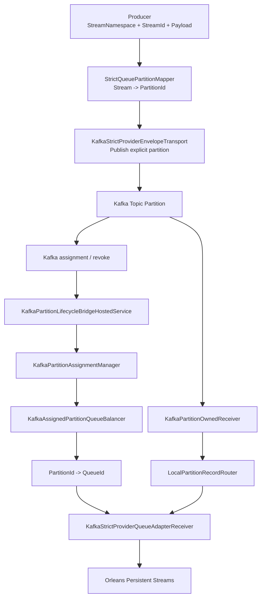

# Historical KafkaStrictProvider Stable Baseline

## Purpose

This document records the pre-refactor `KafkaStrictProvider` implementation as a stable baseline before the provider-native cleanup.

It exists for two reasons:

- the current implementation has reached a usable and test-verified strict correctness milestone
- the next step is expected to be a structural simplification, so the current stable behavior must be recorded explicitly

This document is a historical milestone snapshot, not the current architecture and not the long-term target architecture.

The repository has since removed `MassTransitAdapter` entirely. Any comparison to that path in this document should be read as milestone-era context, not as a description of a still-supported runtime option.

## What This Version Achieves

The recorded `KafkaStrictProvider` backend provided a strict Kafka shared-group path with these properties:

- producer-side `StreamNamespace + StreamId -> PartitionId` deterministic routing
- `QueueCount == TopicPartitionCount == actual topic partitions` fail-fast validation
- explicit Kafka partition lifecycle handling
- explicit local handoff before offset commit
- honest `at-least-once` delivery
- rolling-update-safe replay when handoff is not fully acknowledged
- multi-silo runtime correctness tested with shared distributed runtime state

This version is intentionally stricter than the old `MassTransitAdapter` path.

## Core Runtime Shape



## Canonical Mapping

The current stable version uses one strict mapping contract:

```text
PartitionId = SHA256(StreamNamespace + "\n" + StreamId) % QueueCount
QueueId = queues[PartitionId]
PartitionId = index of QueueId in queues[]
```

This gives one canonical slot:

- business identity: `StreamNamespace + StreamId`
- transport ownership slot: `PartitionId`
- Orleans local receiver binding: `QueueId`

So producer and consumer meet on the same strict slot, not on two unrelated routing decisions.

## Commit And Replay Semantics

This baseline records the following strict rule:

- polling a Kafka record is not enough to commit
- decoding a Kafka record is not enough to commit
- local enqueue is not enough to commit
- offset becomes committable only after strict local handoff acknowledgement reaches the Orleans queue receiver boundary

As a result:

- crash before handoff acknowledgement causes replay
- revoke before handoff acknowledgement causes replay
- uncommitted offsets remain replayable by the next owner

This is the main correctness milestone of the current version.

## Why This Version Is Stable

This version was worth recording because several correctness gaps were closed:

- false commit before Orleans delivery boundary was removed
- revoke/shutdown races no longer silently turn canceled handoff into success
- startup now validates strict topology invariants instead of silently degrading
- real host wiring now activates the strict backend correctly
- lifecycle callback failures are visible and retried instead of being silently swallowed

So even though the structure is still heavy, the behavior is no longer "best effort".

## Why This Is Not The Final Shape

The recorded implementation was stable, but it was not the preferred long-term structure.

Main reason:

- it behaves more like a dedicated Kafka transport subsystem than a standard Orleans stream backend

That brings extra components:

- lifecycle bridge
- assignment manager
- owned receiver layer
- local handoff router
- extra control-plane complexity

So the next phase is expected to keep the same strict behavior while simplifying the structure into a more Orleans-native provider shape.

## Relationship To Other Paths

### `MassTransitAdapter`

At the time of this baseline, `MassTransitAdapter` was still present in the repository as the simpler transport-backed Orleans stream path.

That comparison is retained only to explain why this baseline existed as a separate milestone.

### `KafkaStrictProvider`

The recorded stable `KafkaStrictProvider` path should be understood as:

- a specialized strict Kafka backend
- not a thin extension of `MassTransit`
- a correctness-first milestone

## Known Structural Drawback

This baseline intentionally records one important architectural drawback:

- ownership correctness is achieved through an explicit Kafka lifecycle control plane outside the standard Orleans provider shape

That is acceptable for this milestone.
It is also the main reason the next refactor exists.

## Next Step

The next structural refactor should aim to:

- preserve the same strict correctness target
- preserve the same mapping contract
- preserve honest commit/replay behavior
- reduce the separate transport-runtime feel
- converge toward an Orleans Persistent Streams style Kafka backend

That future step is described separately in:

- [2026-03-19-orleans-kafka-strict-provider-refactor.md](/Users/liyingpei/Desktop/Code/aevatar/docs/architecture/2026-03-19-orleans-kafka-strict-provider-refactor.md)

## Recommended Use Of This Document

Use this document as the historical baseline when:

- reviewing the current stable implementation
- writing the PR description for the current milestone
- evaluating whether the next refactor preserves current guarantees
- checking that future simplification does not quietly weaken correctness
