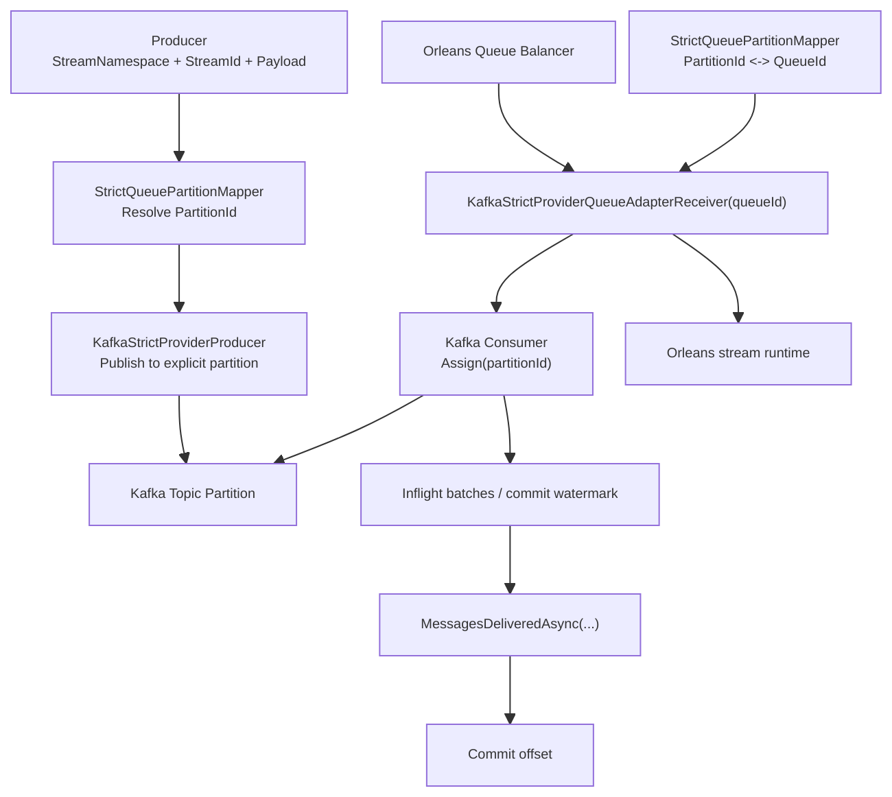

# Orleans Kafka Strict Provider Backend Architecture

## Status

This document describes the current Orleans-native strict Kafka backend in the repository after the provider-native cleanup.

It is used when:

- `Provider = Orleans`
- `OrleansStreamBackend = KafkaStrictProvider`

Its purpose is to make Kafka partition binding and Orleans queue ownership converge to one runtime slot, so multi-pod shared-group consumption remains correct during rebalance and rolling update.

## Core Design

The strict path keeps only one business identity in the message contract:

- `StreamNamespace`
- `StreamId`
- `Payload`

It does not add `TargetQueueId` or any second routing fact to the envelope.

Instead, producer and consumer both rely on the same strict mapping contract:

1. producer resolves `PartitionId` from `StreamNamespace + StreamId`
2. Orleans queue ownership activates exactly one local `QueueId`
3. that `QueueId` maps back to the same `PartitionId`
4. only that queue receiver binds and consumes that partition locally

So the two sides meet on one shared slot, instead of each side making an independent routing decision.

## Core Architecture View



## One Mapping Contract For Both Sides

The key design point is that producer-side identity and consumer-side ownership are unified by the same mapper.

### Canonical slot

The strict path uses `PartitionId` as the canonical ownership slot.

- producer side: `StreamNamespace + StreamId -> PartitionId`
- consumer side: `QueueId <-> PartitionId`

`QueueId` is not an independently computed ownership fact anymore.
It is the Orleans-side projection of the same strict partition slot.

### Mapping rule

Current implementation:

```text
PartitionId = SHA256(StreamNamespace + "\n" + StreamId) % QueueCount
QueueId = queues[PartitionId]
Reverse(QueueId) = index of QueueId in queues[]
```

This means:

- the producer does not guess a pod
- Orleans queue ownership decides which receiver becomes active
- that active receiver binds the matching Kafka partition directly

### Why the IDs now align

There are three IDs in the path:

| Layer | ID | Meaning |
| --- | --- | --- |
| Business stream | `StreamNamespace + StreamId` | stable business identity |
| Kafka transport | `PartitionId` | cluster ownership slot |
| Orleans runtime | `QueueId` | local receiver binding for that same slot |

The alignment rule is:

1. `StreamNamespace + StreamId` deterministically selects one `PartitionId`
2. Orleans queue balancing decides which pod currently owns the corresponding `QueueId`
3. that pod deterministically resolves the same slot to exactly one `PartitionId`
4. only the receiver for that `QueueId` binds and consumes that partition locally

So producer and consumer are no longer solving two different routing problems.
They are both talking about the same slot from opposite sides.

## End-to-End Flow

### Producer path

1. application publishes an envelope with `StreamNamespace + StreamId + Payload`
2. `StrictQueuePartitionMapper` computes the target `PartitionId`
3. `KafkaStrictProviderProducer` publishes directly to that partition

### Consumer path

1. Orleans queue balancing activates `QueueAdapterReceiver(queueId)`
2. `StrictQueuePartitionMapper` resolves `queueId -> partitionId`
3. `KafkaStrictProviderQueueAdapterReceiver` directly binds that partition with Kafka `Assign(partitionId)`
4. receiver polls records from that partition
5. receiver converts records into Orleans `IBatchContainer`
6. Orleans stream runtime pulls the batches
7. receiver advances the contiguous commit watermark only after `MessagesDeliveredAsync(...)`

### Revoke / rolling update path

1. Orleans queue ownership moves from old pod to new pod
2. old receiver stops polling and does not commit beyond the last contiguous acknowledged watermark
3. unacknowledged offsets remain replayable
4. new pod activates the same strict queue
5. new receiver binds the same partition and resumes from Kafka committed offsets

## Commit Boundary

The strict backend commits Kafka offsets only after Orleans delivery acknowledgement reaches the bound queue receiver.

This means:

- polling a Kafka record is not enough
- decoding a record is not enough
- putting a record into an intermediate local queue is not enough
- offset commit becomes eligible only after the strict local handoff boundary is acknowledged

So the path is honest about `at-least-once` delivery.
If revoke or crash happens before local handoff acknowledgement, the offset stays replayable.

## Required Topology Invariants

The strict path depends on these invariants:

- `QueueCount == TopicPartitionCount`
- actual Kafka topic partition count must equal the configured strict partition count
- producer and consumer must use the same `StrictQueuePartitionMapper`
- `KafkaStrictProvider` multi-silo mode requires shared persistent runtime state instead of `InMemory` pubsub

If those invariants are broken, startup must fail instead of silently degrading.

## Failure Handling

The strict path does not silently swallow lifecycle failures.

Current policy:

- receiver and startup failures are logged visibly
- retry is bounded and local to the failing action
- the whole backend is not taken down just because one local action fails

This keeps the projection chain observable without turning a local backend issue into a full service outage.

## Main Components

### `StrictQueuePartitionMapper`

- computes `StreamNamespace + StreamId -> PartitionId`
- resolves `PartitionId -> QueueId`
- resolves `QueueId -> PartitionId`
- is the single mapping contract shared by producer path and Orleans runtime

### `KafkaStrictProviderProducer`

- publishes envelopes to explicit partitions
- validates strict topic topology
- owns producer lifecycle only

### `KafkaStrictProviderQueueAdapterReceiver`

- is the Orleans queue receiver bound to one strict queue
- directly owns Kafka partition consumption for that queue
- tracks inflight offsets and commit watermark
- completes strict acknowledgement at the Orleans delivery boundary

## What This Design Guarantees

- no second routing fact is added to the message contract
- producer-side routing and consumer-side queue ownership come from the same strict mapper
- multi-pod shared-group consumption is driven by strict `QueueId <-> PartitionId` ownership
- rolling update correctness depends on receiver handoff and Kafka committed offsets, not on local best-effort drop/retry
- local handoff and offset commit boundaries are explicit and honest

## Non-Goals

This design does not claim:

- exactly-once processing
- free partition-count expansion without migration
- compatibility with `InMemory` multi-silo pubsub for strict shared-group correctness
