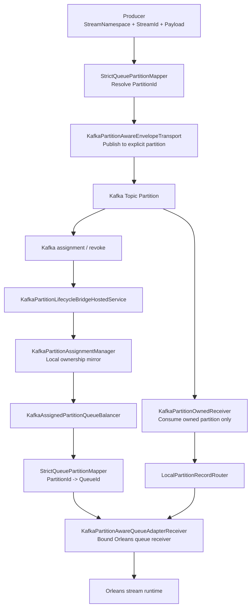

# Kafka Partition-Aware Transport Architecture

## Status

This document describes the strict Kafka shared-group path that is now implemented in the repository.

It is used when:

- `Provider = Orleans`
- `OrleansStreamBackend = KafkaPartitionAware`

Its purpose is to make Kafka partition ownership and Orleans queue ownership converge to one runtime fact, so multi-pod shared-group consumption remains correct during rebalance and rolling update.

## Core Design

The strict path keeps only one business identity in the message contract:

- `StreamNamespace`
- `StreamId`
- `Payload`

It does not add `TargetQueueId` or any second routing fact to the envelope.

Instead, producer and consumer both rely on the same strict mapping contract:

1. producer resolves `PartitionId` from `StreamNamespace + StreamId`
2. Kafka assigns that `PartitionId` to a pod
3. the assigned pod maps that same `PartitionId` back to the matching Orleans `QueueId`
4. only that queue receiver is activated locally

So the two sides meet on one shared slot, instead of each side making an independent routing decision.

## Core Architecture View



## One Mapping Contract For Both Sides

The key design point is that producer-side identity and consumer-side ownership are unified by the same mapper.

### Canonical slot

The strict path uses `PartitionId` as the canonical ownership slot.

- producer side: `StreamNamespace + StreamId -> PartitionId`
- consumer side: `PartitionId -> QueueId`

`QueueId` is not an independently computed ownership fact anymore.
It is the Orleans-side projection of the same strict partition slot.

### Mapping rule

Current implementation:

```text
PartitionId = SHA256(StreamNamespace + "\n" + StreamId) % QueueCount
QueueId = queues[PartitionId]
Reverse(QueueId) = index of QueueId in queues[]
```

This means:

- the producer does not guess a pod
- Kafka owns cluster-level partition assignment
- Orleans queue ownership is derived from the assigned partition, not from a second unrelated routing decision

### Why the IDs now align

There are three IDs in the path:

| Layer | ID | Meaning |
| --- | --- | --- |
| Business stream | `StreamNamespace + StreamId` | stable business identity |
| Kafka transport | `PartitionId` | cluster ownership slot |
| Orleans runtime | `QueueId` | local receiver binding for that same slot |

The alignment rule is:

1. `StreamNamespace + StreamId` deterministically selects one `PartitionId`
2. Kafka assignment decides which pod currently owns that `PartitionId`
3. that pod deterministically resolves the same slot to exactly one `QueueId`
4. only the receiver for that `QueueId` is activated locally

So producer and consumer are no longer solving two different routing problems.
They are both talking about the same slot from opposite sides.

## End-to-End Flow

### Producer path

1. application publishes an envelope with `StreamNamespace + StreamId + Payload`
2. `StrictQueuePartitionMapper` computes the target `PartitionId`
3. `KafkaPartitionAwareEnvelopeTransport` publishes directly to that partition

### Consumer path

1. Kafka rebalancing assigns partitions to pods
2. `KafkaPartitionLifecycleBridgeHostedService` converts Kafka lifecycle into runtime lifecycle notifications
3. `KafkaPartitionAssignmentManager` maintains the local owned partition set
4. `KafkaAssignedPartitionQueueBalancer` exposes the matching Orleans queues
5. `KafkaPartitionOwnedReceiver` consumes only records from the partitions currently owned by this pod
6. `LocalPartitionRecordRouter` hands the record to the local queue receiver bound to that partition
7. `KafkaPartitionAwareQueueAdapterReceiver` turns the record into Orleans stream batches

### Revoke / rolling update path

1. Kafka revokes partition ownership from the old pod
2. local owned receivers stop accepting new records for that partition
3. in-flight local handoff is canceled or drained honestly
4. uncommitted records remain replayable
5. Kafka assigns the partition to the new pod
6. the new pod activates the matching Orleans queue receiver for the same slot

## Commit Boundary

The strict path commits Kafka offsets only after local handoff is acknowledged by the bound Orleans queue receiver.

This means:

- polling a Kafka record is not enough
- decoding a record is not enough
- putting a record into an intermediate local queue is not enough
- offset commit becomes eligible only after the strict local handoff boundary is acknowledged

So the path is honest about `at-least-once` delivery.
If revoke or crash happens before local handoff acknowledgement, the offset stays replayable.

## Required Topology Invariants

The strict path depends on these invariants:

- `QueueCount == TopicPartitionCount`
- actual Kafka topic partition count must equal the configured strict partition count
- producer and consumer must use the same `StrictQueuePartitionMapper`
- `KafkaPartitionAware` multi-silo mode requires shared persistent runtime state instead of `InMemory` pubsub

If those invariants are broken, startup must fail instead of silently degrading.

## Failure Handling

The strict path does not silently swallow lifecycle failures.

Current policy:

- lifecycle failures are logged visibly
- retry is bounded and local to the failing lifecycle action
- the whole transport is not taken down just because one lifecycle callback fails

This keeps the projection chain observable without turning a local control-plane issue into a full service outage.

## Main Components

### `StrictQueuePartitionMapper`

- computes `StreamNamespace + StreamId -> PartitionId`
- resolves `PartitionId -> QueueId`
- resolves `QueueId -> PartitionId`
- is the single mapping contract shared by producer path and Orleans runtime

### `KafkaPartitionAwareEnvelopeTransport`

- publishes envelopes to explicit partitions
- consumes records from Kafka
- manages lifecycle callbacks for assignment and revoke
- commits offsets only after strict local handoff acknowledgement

### `KafkaPartitionLifecycleBridgeHostedService`

- bridges Kafka partition lifecycle into runtime lifecycle notifications

### `KafkaPartitionAssignmentManager`

- maintains the local owned partition set
- acts as the local ownership mirror for the current pod

### `KafkaAssignedPartitionQueueBalancer`

- exposes the Orleans queue set corresponding to currently owned partitions

### `KafkaPartitionOwnedReceiver`

- consumes records only for partitions owned by the current pod
- handles revoke and shutdown honestly for in-flight records

### `LocalPartitionRecordRouter`

- routes a partition-owned record to the matching local queue receiver
- does not invent ownership, only delivers within the local strict slot

### `KafkaPartitionAwareQueueAdapterReceiver`

- is the Orleans queue receiver bound to one strict queue
- converts local handoff records into Orleans stream batches
- completes strict local handoff acknowledgement at the receiver boundary

## What This Design Guarantees

- no second routing fact is added to the message contract
- producer-side routing and consumer-side queue ownership come from the same strict mapper
- multi-pod shared-group consumption is driven by Kafka partition ownership
- rolling update correctness depends on assignment transfer, not on local best-effort drop/retry
- local handoff and offset commit boundaries are explicit and honest

## Non-Goals

This design does not claim:

- exactly-once processing
- free partition-count expansion without migration
- compatibility with `InMemory` multi-silo pubsub for strict shared-group correctness
