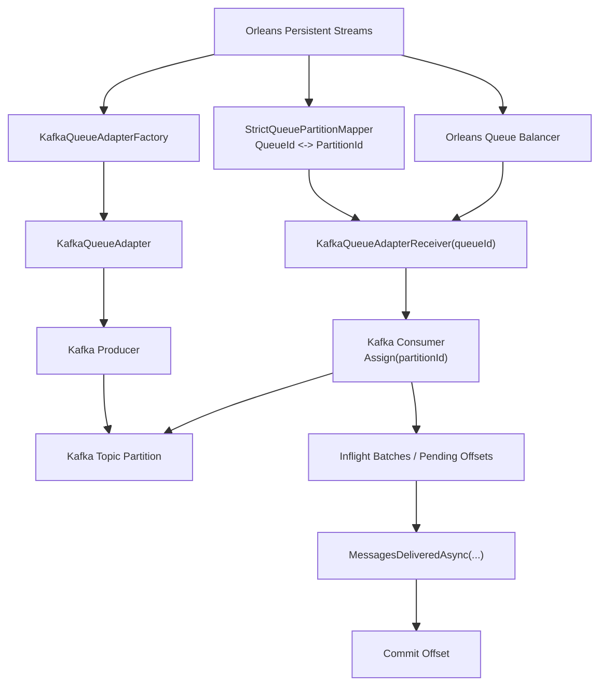

# Orleans Kafka Strict Provider Refactor

## Purpose

This document defines the refactor target for the current `KafkaStrictProvider` backend.

Goal:

- keep the same strict correctness target as the current implementation
- remove the "second transport system" shape
- converge to a standard Orleans Persistent Streams style Kafka backend
- continue without `MassTransit`

This is primarily a structural refactor target, but it does change where ownership authority lives.

So this document must prove that the refactor preserves the same strict safety target instead of only asserting "same semantics".

## Target Outcome

After refactor, the strict Kafka path should be understood as:

- an Orleans Persistent Streams backend
- backed by Kafka through `Confluent.Kafka`
- using Orleans queue ownership as the local receiver activation authority
- keeping honest `at-least-once` delivery and rolling-update safety

It should no longer depend on a separate lifecycle control plane such as:

- partition assignment manager
- lifecycle bridge hosted service
- owned partition receiver registry
- local partition handoff router

Current progress:

- provider-native receiver consumption has already replaced the old read-path control plane
- old lifecycle control-plane types have been removed from the active backend
- broad hosting and integration tests are green on the provider-native shape
- the remaining work is mainly documentation and naming cleanup around the provider-native shape

## Core Design

The strict backend keeps one canonical slot:

- `PartitionId`

And aligns both sides around it:

1. producer resolves `StreamNamespace + StreamId -> PartitionId`
2. `PartitionId` maps to one Orleans `QueueId`
3. `QueueAdapterReceiver(queueId)` directly consumes that `PartitionId`

So the refactor keeps the current strict mapping contract, but moves control back into the Orleans stream provider model.

## Core Architecture



## Mapping Contract

The strict mapping contract stays the same:

```text
PartitionId = SHA256(StreamNamespace + "\n" + StreamId) % QueueCount
QueueId = queues[PartitionId]
PartitionId = index of QueueId in queues[]
```

This means:

- business identity stays `StreamNamespace + StreamId`
- transport slot stays `PartitionId`
- Orleans local binding stays `QueueId`

The difference from the current implementation is not the mapping.
The difference is where the ownership logic lives.

## Ownership Model

### Stable baseline implementation

The stable baseline that was recorded before this refactor used Kafka lifecycle as an explicit control plane:

- Kafka assignment
- lifecycle bridge
- assignment manager
- owned receiver
- local handoff router
- queue receiver

### Refactor target

Refactored provider uses Orleans queue ownership directly:

- Orleans queue balancer decides local queues
- each local `QueueId` binds one `PartitionId`
- receiver directly `Assign(partitionId)`
- no extra ownership orchestration layer exists outside the provider itself

This is more Orleans-native and removes the extra transport-runtime layer.

But this is also the most important semantic change in the refactor:

- current implementation: Kafka assign/revoke is the authoritative ownership signal and Orleans follows it
- target implementation: Orleans queue ownership becomes the activation lease and Kafka consumer assignment follows it

So the refactor is only valid if the provider can make that authority flip explicit and safe.

## Ownership Authority Proof

The refactor must justify why Orleans queue ownership can replace the current Kafka-driven control plane without weakening correctness.

### Required ownership equivalence

The provider-native design is only acceptable if all of the following are true:

1. each strict `QueueId` maps to exactly one `PartitionId`
2. the Orleans queue balancer activates at most one local receiver for that `QueueId` across the cluster at a time
3. a receiver only ever consumes the single `PartitionId` bound to its owned `QueueId`
4. when Orleans queue ownership moves, the old receiver stops committing before the new receiver starts committing

If any of those statements cannot be enforced by Orleans Persistent Streams runtime behavior plus provider code, then Kafka assignment must remain the authoritative lease.

### What must be proven in implementation

The implementation blueprint for this refactor must explicitly show:

- which Orleans queue balancing guarantee is treated as the distributed lease
- how receiver startup is serialized so two pods do not actively consume the same strict slot
- how receiver shutdown/drain happens before ownership handoff is considered complete
- how provider code prevents "old queue owner still consuming" during rolling update windows

Without that proof, this refactor is not only a cleanup. It is a correctness change.

### Chosen lease authority for the refactor

The target refactor must make this explicit:

- the distributed lease is Orleans queue ownership for the strict provider queue
- provider code may rely on the standard Orleans queue balancing contract only if it can prove the required single-owner behavior for the strict slot
- if standard queue balancing hooks are not sufficient to make that lease explicit, a very thin strict queue balancer may remain, but only as a lease adapter inside the Orleans provider model

So the refactor target is not "no balancer concept at all".
The target is "no separate Kafka lifecycle control plane outside the Orleans provider ownership model".

## Producer Path

1. Orleans stream publish enters `KafkaQueueAdapter`
2. adapter resolves `PartitionId` using `StrictQueuePartitionMapper`
3. producer publishes directly to that Kafka partition

No `TargetQueueId` or second routing fact is added to the envelope.

## Consumer Path

1. Orleans queue balancer activates `QueueAdapterReceiver(queueId)`
2. receiver resolves `partitionId = mapper.GetPartitionId(queueId)`
3. receiver creates a Kafka consumer bound to that partition
4. receiver polls records from that partition
5. receiver converts records into `IBatchContainer`
6. Orleans stream runtime pulls the batches
7. `MessagesDeliveredAsync(...)` advances the committable offset

## Offset Recovery Authority

The provider-native design must define one durable recovery source for restart and ownership handoff.

Chosen target:

- Kafka committed offsets for the strict consumer group are the recovery authority
- local `inflight` / `acked` / watermark state is process-local only and must never be treated as cross-owner truth
- a new receiver starts from the Kafka committed offset for its `PartitionId`
- if no committed offset exists yet for that partition, startup follows the configured reset policy for the strict backend

This means:

- local watermark state is only a commit-progress helper
- Kafka committed offsets remain the durable handoff boundary across crash, revoke, and rolling update
- the new owner must never infer resume position from old-owner memory

## Operational Cost

The provider-native model is structurally simpler, but it is not operationally free.

Compared with the current design, the target model likely increases:

- Kafka consumer count per silo
- TCP connections and sockets to Kafka brokers
- poll loops and local background work
- per-rebalance startup / shutdown churn when `QueueCount` is high

So this refactor should be evaluated as a complexity trade:

- lower control-plane complexity inside the codebase
- potentially higher consumer/process overhead at runtime

The design is still acceptable if that trade is explicit and the target topology keeps `QueueCount` in a reasonable range for expected silo count and broker capacity.

## Commit Boundary

The refactor must preserve the same honest commit rule as the current strict implementation:

- polling a Kafka record is not enough
- decoding a Kafka record is not enough
- creating an in-memory batch is not enough
- offset becomes committable only after `MessagesDeliveredAsync(...)`

So the refactor keeps:

- honest `at-least-once`
- replay on crash or revoke before delivery acknowledgement
- no false commit before Orleans delivery boundary

## Commit Watermark Algorithm

The provider-native receiver must define contiguous commit progress explicitly.

### Receiver-owned state

Each `QueueAdapterReceiver(queueId)` must track at least:

- `nextDeliveredOffset`: highest Kafka offset already committed
- `inflight[offset]`: batches handed to Orleans but not yet acknowledged
- `acked[offset]`: batches acknowledged by `MessagesDeliveredAsync(...)` but not yet committed because earlier offsets are still pending
- `closing`: shutdown/revoke flag that blocks new polling and new commits

### Required rules

1. polling a record creates an in-flight entry keyed by its Kafka offset
2. converting to `IBatchContainer` does not make the offset committable
3. `MessagesDeliveredAsync(...)` marks the specific batch offset as acknowledged
4. commit may advance only while there is a contiguous acknowledged range immediately after `nextDeliveredOffset`
5. if offset `N+2` is acknowledged before `N+1`, `N+2` must stay pending and must not be committed yet
6. shutdown/revoke must stop polling first, then wait for in-flight acknowledgements or abandon them honestly
7. abandoned or unacknowledged offsets must remain replayable on the next owner

### Pseudocode shape

```text
on poll(offset):
  inflight[offset] = batch

on MessagesDeliveredAsync(offset):
  acked[offset] = true
  while acked contains nextDeliveredOffset + 1:
    nextDeliveredOffset++
    remove inflight[nextDeliveredOffset]
    remove acked[nextDeliveredOffset]
  commit(nextDeliveredOffset)
```

The real implementation must also define:

- batch-to-offset identity
- duplicate `MessagesDeliveredAsync(...)` handling
- revoke while `MessagesDeliveredAsync(...)` races with shutdown
- whether commit happens synchronously per acknowledgement or on a small flush loop

## Rolling Update Semantics

The refactor must preserve rolling-update behavior:

1. old pod loses Orleans queue ownership
2. corresponding receiver begins shutdown/drain
3. unacknowledged offsets are not committed
4. new pod acquires the same queue
5. new receiver binds the same partition
6. replay continues from the last committed offset

This keeps the current strict correctness target, but implements it inside the provider model instead of through a separate transport control plane.

For this to stay true in the provider-native model, queue ownership transfer and commit watermark transfer must line up.
The new receiver may replay any offset above the last committed contiguous watermark, but it must not assume ownership based on locally observed in-flight state from the old receiver.

## Required Invariants

The strict provider must still fail fast when these invariants are broken:

- `QueueCount == TopicPartitionCount`
- actual Kafka topic partition count equals configured partition count
- producer and consumer use the same `StrictQueuePartitionMapper`
- multi-silo strict mode uses shared distributed runtime state instead of `InMemory` pubsub

## Component Plan

### Keep

- `StrictQueuePartitionMapper`
- `KafkaStrictProviderQueueAdapter`
- `KafkaStrictProviderQueueAdapterFactory`
- `KafkaStrictProviderQueueAdapterReceiver`
- `KafkaStrictProviderBatchContainer`
- Kafka topology validation logic

### Remove

- `KafkaPartitionLifecycleBridgeHostedService`
- `KafkaPartitionAssignmentManager`
- `KafkaPartitionOwnedReceiver`
- `LocalPartitionRecordRouter`
- `PartitionOwnedReceiverRegistry`

### Reshape

`KafkaStrictProviderEnvelopeTransport` should be reduced to transport helpers only:

- Kafka producer
- optional shared serialization helpers
- topology validation

It should no longer orchestrate:

- partition ownership
- lifecycle bridge callbacks
- local handoff control
- owned receiver lifecycle

`KafkaStrictProviderQueueAdapterReceiver` becomes the main strict consumer component:

- binds `QueueId -> PartitionId`
- owns Kafka consumer assignment for that partition
- tracks inflight delivery
- advances commit watermark in `MessagesDeliveredAsync(...)`
- handles shutdown/drain honestly

Queue balancing should be handled in one of these two ways:

- preferred: reuse the standard Orleans queue balancer contract as the strict queue lease
- fallback: keep a much thinner provider-native strict queue balancer whose only job is to materialize the Orleans queue lease explicitly

The refactor must not keep the current Kafka-driven assignment control plane.

Current progress:

- these control-plane types have already been detached from the active path
- the remaining cleanup is mainly around test coverage and provider-native receiver hardening

## Why This Is Better

Compared with the current implementation, this refactor:

- keeps the same strict delivery goal
- removes the "second transport system" feel
- aligns with standard Orleans Persistent Streams mental model
- makes Kafka a backend of the Orleans provider instead of a parallel runtime
- reduces the number of lifecycle and routing components

The tradeoff is that ownership proof and offset management move into the receiver/provider layer and therefore must be specified more rigorously than in the current document.

## Non-Goals

This refactor does not aim to:

- add `MassTransit` back into the strict path
- weaken current strict semantics into best-effort routing
- change the current `StreamId -> PartitionId` mapping contract
- support free partition expansion without migration

## Migration Order

### Phase 1

- document the target architecture
- freeze the target mapping and commit semantics

### Phase 2

- move strict consumer logic into `KafkaStrictProviderQueueAdapterReceiver`
- let receiver directly bind Kafka partition from `QueueId`

### Phase 3

- remove lifecycle bridge / assignment manager / local router / owned receiver layers

### Phase 4

- update unit and integration tests to the provider-native structure
- keep the same strict behavior expectations as current tests

### Current status

- Phase 2 is complete
- Phase 3 is complete
- Phase 4 test migration is functionally complete for the active strict path

## Success Criteria

The refactor is complete when:

- strict shared-group tests still pass
- rolling-update tests still pass
- commit semantics remain honest
- ownership authority equivalence is documented and verified by tests
- Kafka committed offsets are the only durable resume source across owner handoff
- receiver-owned commit watermark logic is covered by out-of-order ack and shutdown/revoke tests
- the strict backend no longer depends on a separate Kafka lifecycle control plane outside the Orleans provider model
