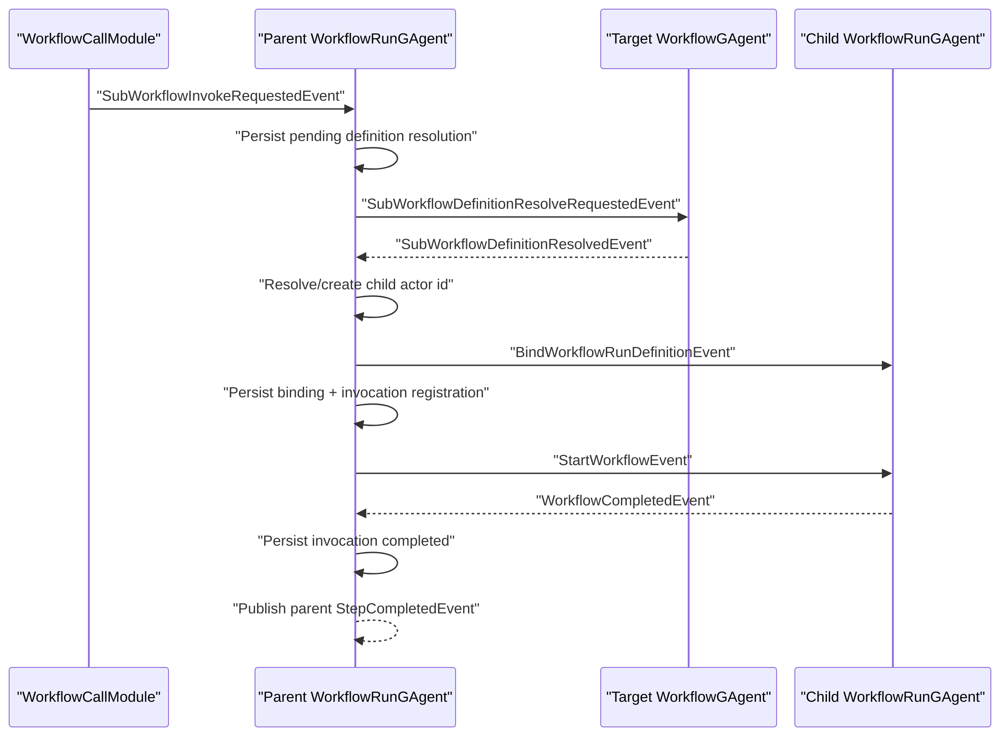

# Workflow Call Actor-to-Actor 重构方案（2026-03-19）

## 1. 文档元信息

- 状态：Planned
- 版本：R1
- 日期：2026-03-19
- 关联文档：
  - `src/workflow/README.md`
  - `docs/architecture/archive/2026-03/workflow-actor-binding-read-boundary-refactor-plan-2026-03-09.md`
  - `docs/architecture/archive/2026-03/2026-03-16-workflow-fact-sources-event-and-projection-refactor.md`
- 适用范围：
  - `src/workflow/Aevatar.Workflow.Abstractions`
  - `src/workflow/Aevatar.Workflow.Core`
  - `src/workflow/Aevatar.Workflow.Projection`
  - `test/Aevatar.Workflow.Core.Tests`
  - `test/Aevatar.Integration.Tests`
- 文档定位：
  - 本文定义 `workflow_call` 从“Core 内部 resolver 侧查 YAML + 直接起 child run”重构为“`WorkflowRunGAgent <-> WorkflowGAgent` 的业务协议 + continuation”后的目标方案。
  - 本文只处理 `workflow_call` 的 definition 获取与 child run 启动主链，不引入第二套 workflow engine，不回退 definition/run split。

## 2. 背景与关键决策（统一认知）

当前 workflow 主链已经明确了两条边界：

1. `WorkflowGAgent` 只拥有 definition facts。
2. `WorkflowRunGAgent` 只拥有 run facts。

但当前 `workflow_call` 实现没有遵守这个边界：

- `WorkflowCallModule` 先发出 `SubWorkflowInvokeRequestedEvent`。
- `WorkflowRunGAgent` 再把该事件交给 `SubWorkflowOrchestrator`。
- `SubWorkflowOrchestrator` 直接在 Core 中通过 `IWorkflowDefinitionResolver` 查 YAML。
- 同一个 turn 里继续创建并绑定 child `WorkflowRunGAgent`。

这条链路的根本问题不是“能不能跑”，而是它把 definition authority 从 `WorkflowGAgent` 偷渡到了中间编排层。

本次重构必须坚持以下决策：

1. `workflow_call` 的 definition authority 必须回到目标 `WorkflowGAgent`。
2. parent `WorkflowRunGAgent` 不能同步等待另一个 actor 的返回，必须 continuation 化。
3. Core 运行态不再依赖 `IWorkflowDefinitionResolver` 作为 `workflow_call` 的主路径。
4. child run 绑定 definition 时，必须携带真实 `DefinitionActorId`，不能再留空。
5. singleton child 绑定的稳定键不能只看 `workflow_name`，至少要看 `definition_actor_id`。

## 3. 重构目标

本轮只保留以下可验收目标：

1. `workflow_call` 命名工作流路径必须通过目标 `WorkflowGAgent` 返回 definition snapshot。
2. `WorkflowRunGAgent` 处理 `workflow_call` 时必须采用“发送请求事件 -> 结束当前 turn -> 回复事件继续”的 continuation 模式。
3. child `WorkflowRunGAgent` 的 `BindWorkflowRunDefinitionEvent` 必须带上真实 `DefinitionActorId`，并建议带上 definition version。
4. parent run 对 pending definition resolution、pending child invocation、singleton binding 的事实都必须落在 run actor state 中。
5. 运行时主链只保留一套：`WorkflowCallModule -> parent WorkflowRunGAgent -> target WorkflowGAgent -> child WorkflowRunGAgent`。
6. 投影、测试、README 和架构文档必须同步更新，不保留旧语义空壳。

## 4. 范围与非范围

### 4.1 本次范围

- `workflow_call` 的 definition resolve 协议
- `WorkflowGAgent` 对 sub-workflow definition request 的处理
- `WorkflowRunGAgent` 对 request/reply/failure/timeout 的 continuation 编排
- `WorkflowRunState` 中与 sub-workflow resolution / binding / invocation 相关的 typed state
- 相关 protobuf 契约、测试与文档

### 4.2 非范围

- 不重写 `/api/chat` 顶层 run 创建路径
- 不引入通用 actor query/reply 框架
- 不把 `workflow_call` 再做成第二套 generic messaging substrate
- 不在本轮统一 actorize inline workflow bundle；phase 1 允许 inline bundle 继续走本地 snapshot 路径
- 不为兼容旧实现保留长期双轨逻辑

## 5. 架构硬约束（必须满足）

1. `WorkflowCallModule` 只负责把 step 转为内部意图事件，禁止在 module 中做 definition 查找。
2. `WorkflowRunGAgent` 发起跨 actor definition 请求时，禁止直接 `await` 另一 actor 的业务回复。
3. `WorkflowGAgent` 只返回 definition snapshot，不承担 child run 的运行态或 completion 状态。
4. `workflow_call` 的 stable binding key 必须以 `definition_actor_id` 为主，不得只以 `workflow_name` 作为 singleton 复用依据。
5. `BindWorkflowRunDefinitionEvent.definition_actor_id` 在 named workflow_call 路径上必须非空。
6. 所有影响业务语义和恢复能力的数据必须落在 typed proto 字段中，不允许塞入 bag 或 process-local registry。
7. projection/read model 若消费了扩展后的 sub-workflow facts，版本与 authority 必须继续对齐 root run actor committed version。
8. 文档、测试、验证命令必须和实现同步，不允许“代码变了但 README 仍描述旧路径”。

## 6. 当前基线（代码事实）

### 6.1 当前正确部分

- `WorkflowCallModule` 现在已经只做步骤到内部意图的转换，见 `src/workflow/Aevatar.Workflow.Core/Modules/WorkflowCallModule.cs`。
- 顶层 run 创建链路已经是“先拿 definition snapshot，再创建新的 `WorkflowRunGAgent`”，见 `src/workflow/Aevatar.Workflow.Application/Runs/WorkflowRunActorResolver.cs`。
- `WorkflowGAgent` 当前只承载 definition YAML、inline definitions、compiled flag 和 version，见 `src/workflow/Aevatar.Workflow.Core/WorkflowGAgent.cs`。

### 6.2 当前偏差部分

- `WorkflowRunGAgent` 在本地 self event handler 中直接调用 `SubWorkflowOrchestrator.HandleInvokeRequestedAsync(...)`，见 `src/workflow/Aevatar.Workflow.Core/WorkflowRunGAgent.cs`。
- `SubWorkflowOrchestrator` 在 Core 内部直接依赖 `IWorkflowDefinitionResolver`，见 `src/workflow/Aevatar.Workflow.Core/Primitives/SubWorkflowOrchestrator.cs`。
- `SubWorkflowOrchestrator` 直接创建 child `WorkflowRunGAgent`、直接派发 bind envelope、直接发送 start event，见同文件。
- `CreateWorkflowRunBindEnvelope(...)` 给 child run 绑定 definition 时把 `DefinitionActorId` 设为空字符串，导致 provenance 丢失。
- `WorkflowGAgent` 当前没有处理 `workflow_call` definition request 的业务协议 handler。
- `WorkflowRunState.SubWorkflowBinding` 目前只存 `workflow_name + child_actor_id + lifecycle`，不足以支撑 definition actor 级别的诚实复用。

## 7. 需求分解与状态矩阵

| ID | 需求 | 验收标准 | 当前状态 | 证据 | 差距 |
| --- | --- | --- | --- | --- | --- |
| R1 | definition authority 回归 `WorkflowGAgent` | named `workflow_call` 不再通过 Core resolver 取 YAML | 未完成 | `SubWorkflowOrchestrator.cs` 直接调用 resolver | 需要 actor protocol |
| R2 | parent run 使用 continuation | request turn 不再同步完成 definition resolve + child run start | 未完成 | `HandleInvokeRequestedAsync(...)` 同一 turn 内完成全部动作 | 需要 request/reply/failure/timeout 事件 |
| R3 | child run 绑定 definition provenance | `BindWorkflowRunDefinitionEvent.definition_actor_id` 在 named path 非空 | 未完成 | bind envelope 里写空字符串 | 需要 snapshot contract 修复 |
| R4 | singleton binding 以 definition actor 为键 | 同名不同 definition actor 不冲突；definition 更新可诚实 rebinding | 未完成 | `SubWorkflowBinding` 只存 workflow name | 需要 state/event 扩展 |
| R5 | 失败和超时路径可恢复 | definition 不存在、未编译、reply 超时都会转成 parent step failure | 部分完成 | 现在只有同步异常转 step failure | 需要 typed failure/timeout continuation |
| R6 | 不引入 generic actor query/reply | 新协议只服务 `workflow_call` 业务 | 未完成 | 当前需要 resolver；无 actor protocol | 需要窄协议命名和语义 |
| R7 | 读侧和投影事实同步 | 若 sub-workflow binding/registration 字段扩展，projection 能正确反映 | 未完成 | projector 只认旧字段 | 需要同步更新投影与测试 |
| R8 | 文档和测试同步 | README、架构文档、Core/Integration tests 全部更新 | 未完成 | 当前文档仍描述旧 `workflow_call` 行为 | 需要完整补齐 |

## 8. 差距详解

### 8.1 Core 里存在越权 definition 读取

`SubWorkflowOrchestrator` 当前直接从：

- `WorkflowRunState.InlineWorkflowYamls`
- `IWorkflowDefinitionResolver`

两条路径拿 definition。inline bundle 作为 parent run 已绑定 snapshot 的一部分，保留本地解析是可接受的；但 named workflow 通过 service resolver 读取 definition，违反了 definition actor 是唯一 authority 的边界。

### 8.2 没有“待解析 definition”的显式运行态

当前 pending state 只覆盖“child run 已经注册但尚未完成”的阶段，没有“definition request 已发出但 child run 尚未创建”的 typed state。只要改成 actor-to-actor continuation，就必须补这层事实，否则 crash/replay 后无法判断：

- 哪个 invocation 正在等 definition reply
- reply 回来时是否仍然有效
- timeout 后该清理哪个 request

### 8.3 child run 绑定失去 definition provenance

当前 child run bind 时 `definition_actor_id` 为空，意味着：

- child run 自身无法诚实说明来自哪个 definition actor
- 后续 singleton reuse 无法知道复用的是哪一个 authority
- query / projection / diagnostics 无法定位 child run 的 definition source

### 8.4 singleton 绑定键过弱

当前 binding 仅由 `workflow_name + lifecycle` 识别，存在两个问题：

1. 同名不同 definition actor 会冲突。
2. 同一个 definition actor 版本更新后，reuse 逻辑无法知道需要 rebinding。

### 8.5 `WorkflowGAgent` 还没有成为 `workflow_call` 协议参与者

`WorkflowGAgent` 目前只处理 `BindWorkflowDefinitionEvent`，没有对 sub-workflow definition resolve 的 request/reply 契约，导致 `workflow_call` 只能绕过它。

## 9. 目标架构

### 9.1 actor 职责

#### `WorkflowCallModule`

- 输入：`StepRequestEvent`
- 输出：`SubWorkflowInvokeRequestedEvent`
- 职责：只规范化 step 参数和 invocation id

#### parent `WorkflowRunGAgent`

- 维护 `workflow_call` 的 pending resolution / pending invocation / singleton binding 事实
- 决定是否创建或复用 child `WorkflowRunGAgent`
- 在收到 child completion 后把结果翻译回 parent `StepCompletedEvent`

#### target `WorkflowGAgent`

- 校验自己当前 definition 是否可用于 `workflow_call`
- 返回稳定的 definition snapshot
- 不直接持有 child run 的运行态

#### child `WorkflowRunGAgent`

- 接收 typed definition snapshot
- 绑定 definition
- 启动执行并独立推进 run

### 9.2 建议新增 protobuf 契约

建议在 `src/workflow/Aevatar.Workflow.Abstractions/workflow_execution_messages.proto` 中新增如下契约：

```proto
message WorkflowDefinitionSnapshot
{
  string definition_actor_id = 1;
  string workflow_name = 2;
  string workflow_yaml = 3;
  map<string, string> inline_workflow_yamls = 4;
  string scope_id = 5;
  int32 definition_version = 6;
}

message SubWorkflowDefinitionResolveRequestedEvent
{
  string invocation_id = 1;
  string parent_actor_id = 2;
  string parent_run_id = 3;
  string parent_step_id = 4;
  string workflow_name = 5;
  string lifecycle = 6;
  string requested_definition_actor_id = 7;
}

message SubWorkflowDefinitionResolvedEvent
{
  string invocation_id = 1;
  WorkflowDefinitionSnapshot definition = 2;
}

message SubWorkflowDefinitionResolveFailedEvent
{
  string invocation_id = 1;
  string workflow_name = 2;
  string definition_actor_id = 3;
  string error = 4;
}

message SubWorkflowDefinitionResolveTimedOutEvent
{
  string invocation_id = 1;
  string workflow_name = 2;
  string definition_actor_id = 3;
}
```

补充建议：

- `BindWorkflowRunDefinitionEvent` 后续可以演进为直接携带 `WorkflowDefinitionSnapshot`，减少字段漂移。
- phase 1 若想控制 blast radius，可先不重构 `BindWorkflowRunDefinitionEvent` 结构，但必须在现有字段里填入真实 `definition_actor_id`。

### 9.3 建议扩展 state / event

建议扩展以下事实模型：

1. `WorkflowRunState.SubWorkflowBinding`
   - `definition_actor_id`
   - `definition_version`
   - 现有 `workflow_name / child_actor_id / lifecycle`

2. 新增 `PendingSubWorkflowDefinitionResolution`
   - `invocation_id`
   - `parent_run_id`
   - `parent_step_id`
   - `workflow_name`
   - `definition_actor_id`
   - `lifecycle`

3. `SubWorkflowBindingUpsertedEvent`
   - 补 `definition_actor_id`
   - 补 `definition_version`

4. `SubWorkflowInvocationRegisteredEvent`
   - 建议补 `definition_actor_id`
   - 建议补 `definition_version`

### 9.4 target definition actor 解析规则

phase 1 推荐规则：

1. 若 `workflow_call` 指向的 workflow name 存在于 parent run 已绑定的 inline bundle，则继续走本地 snapshot 路径，不发跨 actor 请求。
2. 若 step 参数显式提供 `definition_actor_id`，则优先以此作为目标 actor。
3. 否则按 canonical named workflow definition actor id 规则推导：`workflow-definition:{workflow_name_lower}`。

补充说明：

- `workflow` 字段仍然只表达 workflow name。
- 若需要显式 source actor，应新增独立字段 `definition_actor_id`，不能让 `workflow` 同时承载“名称查找 + actor 寻址”。

### 9.5 目标事件流



### 9.6 parent run continuation 语义

parent run 在 `workflow_call` 上要拆成两个 turn：

#### turn A：收到 `SubWorkflowInvokeRequestedEvent`

- 校验 `parent_step_id / workflow_name / lifecycle`
- 解析 target definition actor id
- 持久化 pending definition resolution
- 发送 `SubWorkflowDefinitionResolveRequestedEvent`
- 返回，不创建 child run

#### turn B：收到 resolved / failed / timeout

- `Resolved`：
  - 校验 invocation 仍在 pending 集合中
  - 按 `definition_actor_id + lifecycle` 创建或复用 child actor
  - 对 child actor 做 bind/rebind
  - 持久化 `SubWorkflowBindingUpsertedEvent` 与 `SubWorkflowInvocationRegisteredEvent`
  - 发送 `StartWorkflowEvent`
- `Failed` 或 `TimedOut`：
  - 清理 pending definition resolution
  - 发布 parent `StepCompletedEvent(success=false)`

### 9.7 child actor id 规则

建议改成基于 definition actor 的稳定标识，而不是只基于 workflow name：

- singleton：
  - `{parent_run_actor_id}:workflow:{sanitized_definition_actor_id}`
- transient / scope：
  - `{parent_run_actor_id}:workflow:{sanitized_definition_actor_id}:{guid}`

好处：

- 同名不同 definition actor 不冲突
- definition authority 一眼可追踪
- 复用键与 authority 语义一致

### 9.8 definition version 语义

若 `WorkflowGAgent` 返回的 `definition_version` 与当前 singleton binding 上次记录的不一致，则 parent run 必须在 reuse child actor 前先重新绑定 definition。允许复用 actor id，但不允许假装“同一 child actor 就代表 definition 未变”。

## 10. 重构工作包（WBS）

### WP1：契约与状态建模

- 目标：补齐 actor protocol 和 pending/binding typed state
- 范围：
  - `workflow_execution_messages.proto`
  - `workflow_state.proto`
  - 相关生成代码
- DoD：
  - 新 request/reply/failure/timeout 事件已定义
  - `SubWorkflowBinding` 能表达 `definition_actor_id`
  - 测试可 round-trip 新 proto
- 优先级：P0
- 状态：Planned

### WP2：`WorkflowGAgent` definition resolve 协议

- 目标：让 definition actor 真正成为 `workflow_call` authority
- 范围：
  - `WorkflowGAgent.cs`
  - definition 相关测试
- DoD：
  - 可处理 resolve request
  - 未编译、workflow 名称不匹配、definition 不可用时能返回 typed failure
- 优先级：P0
- 状态：Planned

### WP3：`WorkflowRunGAgent` continuation 编排

- 目标：移除 named workflow_call 的 resolver 主路径
- 范围：
  - `WorkflowRunGAgent.cs`
  - `SubWorkflowOrchestrator.cs`
- DoD：
  - `SubWorkflowInvokeRequestedEvent` turn 不再同步查 definition
  - resolved / failed / timeout 都能恢复与清理
  - child bind 带真实 `DefinitionActorId`
- 优先级：P0
- 状态：Planned

### WP4：binding/projection/文档/测试收尾

- 目标：把 definition actor 语义补到读侧和文档
- 范围：
  - `Aevatar.Workflow.Projection`
  - `README.md`
  - Core/Integration tests
- DoD：
  - 新字段被 projector 正确消费
  - 关键测试覆盖新增 continuation 与 rebinding 语义
  - README 与架构文档更新完成
- 优先级：P1
- 状态：Planned

## 11. 里程碑与依赖

### M1：协议与状态冻结

- 完成 WP1
- 产物：
  - 新 proto
  - 新 state
  - proto coverage tests

### M2：actor 主链打通

- 依赖：M1
- 完成 WP2 + WP3
- 产物：
  - definition actor reply
  - run actor continuation
  - child bind provenance 修复

### M3：投影和文档收尾

- 依赖：M2
- 完成 WP4
- 产物：
  - projector / tests / README / architecture docs

## 12. 验证矩阵（需求 -> 命令 -> 通过标准）

| 需求 | 验证命令 | 通过标准 |
| --- | --- | --- |
| 契约可编译 | `dotnet build aevatar.slnx --nologo` | 全部项目编译通过 |
| Core 协议行为 | `dotnet test test/Aevatar.Workflow.Core.Tests/Aevatar.Workflow.Core.Tests.csproj --nologo` | `SubWorkflow*` 相关测试通过 |
| 集成行为 | `dotnet test test/Aevatar.Integration.Tests/Aevatar.Integration.Tests.csproj --filter WorkflowGAgentCoverageTests --nologo` | 新旧 run/definition 协议测试通过 |
| 测试稳定性 | `bash tools/ci/test_stability_guards.sh` | 无新增 polling 违规 |
| 架构门禁 | `bash tools/ci/architecture_guards.sh` | 无新增跨层/同步等待/generic 滥用违规 |
| 文档一致性 | 人工审查 `src/workflow/README.md` 与本文件 | README 不再描述旧 `workflow_call` 主链 |

## 13. 完成定义（Final DoD）

满足以下条件才算本次重构完成：

1. named `workflow_call` 主路径不再依赖 `IWorkflowDefinitionResolver`。
2. `WorkflowGAgent` 成为 `workflow_call` definition snapshot 的唯一 authority。
3. `WorkflowRunGAgent` 在 `workflow_call` 上使用 request/reply/failure/timeout continuation，而不是同步查 definition。
4. child `WorkflowRunGAgent` 的 `DefinitionActorId` 在 named path 非空。
5. singleton binding 以 `definition_actor_id` 为主键完成复用与 rebinding 判断。
6. Core / Integration tests、README、架构文档、验证命令全部闭环。

## 14. 风险与应对

### 风险 1：named workflow actor id 解析仍然隐式

- 风险：只靠 `workflow_name -> canonical definition actor id` 规则，后续多租户或 scope 隔离场景可能不够。
- 应对：phase 1 保持 canonical 规则；phase 2 在 `workflow_call` step 上新增显式 `definition_actor_id` 参数。

### 风险 2：reply/timeout 竞态

- 风险：超时后 reply 才到，或者 parent run 已结束后 reply 才到。
- 应对：所有 reply/timeout 必须带 `invocation_id`，parent run 必须按 pending 集合显式对账，过期消息直接忽略。

### 风险 3：singleton child actor 复用后 definition 漂移

- 风险：definition actor 更新了 YAML，但旧 child actor 被误判为可直接复用。
- 应对：binding 记录 `definition_version`；版本变化时先 bind/rebind，再 start。

### 风险 4：投影字段遗漏

- 风险：state/event 已扩展，但 projector 没跟上，导致 query 看到旧语义。
- 应对：将 projector 和 read model 适配纳入同一工作包，不允许文档/测试只改一半。

## 15. 执行清单（可勾选）

- [ ] 定义 `WorkflowDefinitionSnapshot` typed sub-message
- [ ] 定义 definition resolve request/reply/failure/timeout 事件
- [ ] 扩展 `WorkflowRunState.SubWorkflowBinding`
- [ ] 增加 pending definition resolution state
- [ ] 为 `WorkflowGAgent` 增加 resolve request handler
- [ ] 为 `WorkflowRunGAgent` 增加 resolved/failure/timeout handlers
- [ ] 移除 named workflow_call 对 `IWorkflowDefinitionResolver` 的主路径依赖
- [ ] 修复 child bind `DefinitionActorId`
- [ ] 更新 singleton binding key 与 rebinding 语义
- [ ] 更新 projector / read model / tests
- [ ] 更新 `src/workflow/README.md`

## 16. 当前执行快照（2026-03-19）

- 已完成：
  - 问题定位
  - 目标主链和边界决策
  - 契约草案、状态草案、工作包拆分
- 部分完成：
  - 无
- 未开始：
  - 代码实现
  - 测试调整
  - projector 适配
- 阻塞项：
  - 无外部阻塞；进入实现前需要按本文冻结 proto/state 形状

## 17. 变更纪律

1. 本方案落地时，不保留 named workflow_call 的长期双轨逻辑。
2. 若新增 `definition_actor_id` step 参数，必须同步更新 parser/validator/README/示例 YAML。
3. 若扩展 `SubWorkflowBindingUpsertedEvent` 或 `SubWorkflowInvocationRegisteredEvent`，必须同步更新对应 projector 与测试。
4. 若实现中发现 inline workflow path 也需要 actor 化，必须另起文档，不得在本方案中偷偷扩大范围。
5. 本文是实现基线；实现过程中若调整协议字段或阶段边界，必须先改文档再改代码。
