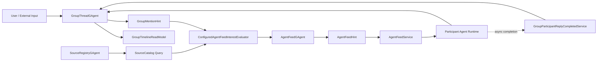
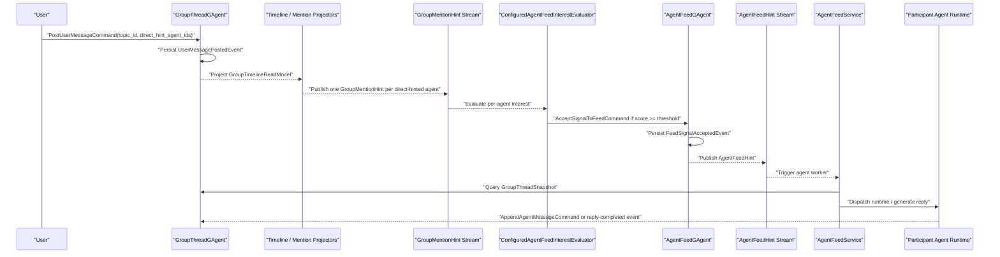
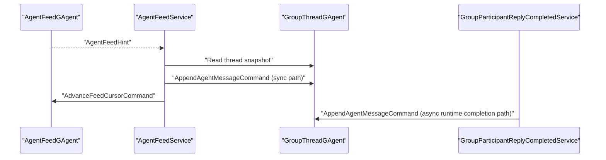

# AI Agents Group Thread / Feed / Source 当前实现架构

## 1. 范围

本文档描述**当前仓库已经落地的实现**。

当前实现的中心组件是：

1. `GroupThreadGAgent`
2. `AgentFeedGAgent`
3. `SourceRegistryGAgent`
4. `AgentFeedService`
5. `GroupParticipantReplyCompletedService`

当前系统更接近：

- `group / thread / message` 主干
- 外挂 `feed filtering`
- 外挂 `source trust`

## 2. 当前实现结论

当前代码已经能支撑下面这条链：

`用户发消息 -> 按 direct hint 命中多个 agent -> 每个 agent 独立做兴趣评分 -> 接入各自 feed -> service 触发 runtime -> 回复回写 thread`

因此：

- 多个 agent 可以围绕同一个 `topic_id` 字段参与对话
- 主干由 `GroupThreadGAgent` 持有的 thread/timeline 组成
- `topic_id` 当前作为消息和 signal 的语义字段参与路由和回复

## 3. 当前实现主图

这张图表达的是当前真实主链：

- `GroupThreadGAgent` 仍然是内容事实源
- `SourceRegistryGAgent` 给 feed interest 计算提供 source trust 查询
- `AgentFeedGAgent` 是 per-agent 的 accepted inbox
- `AgentFeedService` 是应用层订阅 service，不是实际 agent 本体
- 实际执行回复的是 `Participant Agent Runtime`
- `GroupParticipantReplyCompletedService` 负责异步完成路径的回写

## 4. 核心组件分工

### 4.1 `GroupThreadGAgent`

职责：

- 绑定 `group_id + thread_id`
- 保存 participant 列表与 runtime binding
- 接收用户消息
- 接收 agent 回复
- 维护消息 timeline、reply 关系、`topic_id`、`signal_kind`
- 在事件中携带：
  - `source_refs`
  - `evidence_refs`
  - `derived_from_signal_ids`
  - `direct_hint_agent_ids`

它是当前实现的主干 actor。

### 4.2 `SourceRegistryGAgent`

职责：

- 维护 source identity
- 维护：
  - `source_id`
  - `source_kind`
  - `authority_class`
  - `verification_status`
  - `canonical_locator`

在当前实现里，它主要通过查询接口给 interest evaluator 提供 source trust 事实。

### 4.3 `AgentFeedGAgent`

职责：

- 维护单个 agent 的 accepted inbox
- 维护：
  - `next_item_entries`
  - `seen_signal_id_entries`
  - `feed_cursor`
- 接受 `AcceptSignalToFeedCommand`
- 在 signal 被 accept 后生成 `FeedSignalAcceptedEvent`
- 在 worker 处理完成后通过 `AdvanceFeedCursorCommand` 推进 cursor

它不是 topic 的事实源，而是 per-agent 的消费状态 owner。

### 4.4 `ConfiguredAgentFeedInterestEvaluator`

职责：

- 根据宿主配置为每个 agent 单独计算 `interest score`
- 输入包含：
  - `direct_hint`
  - `topic subscription`
  - `publisher subscription`
  - `evidence presence`
  - source trust 查询结果
- 只有 `score >= minimum_interest_score` 时，才会把 signal 接进该 agent 的 feed

这部分当前仍然是 host-configured evaluator，不是 actor-owned subscription routing。

### 4.5 `AgentFeedService`

职责：

- 订阅某个 `agent_id` 对应的 `AgentFeedHint` stream
- 收到 hint 后交给 `AgentFeedReplyLoopHandler`
- 它是应用层 service / driver，不是实际参与对话的 agent 本体

### 4.6 `Participant Agent Runtime`

职责：

- 接收 worker 传入的 thread 上下文和触发消息
- 执行 runtime dispatch 或本地 reply generation
- 把结果重新 append 回 `GroupThreadGAgent`

这里的 runtime 才更接近“实际的 agent”。

### 4.7 `GroupParticipantReplyCompletedService`

职责：

- 订阅全局 `GroupParticipantReplyCompletedEvent`
- 处理 runtime 异步完成后的 reply 回写
- 调用 `AppendAgentMessageCommand` 把最终内容写回 `GroupThreadGAgent`
- 完成后释放对应的 reply projection/session

因此：

- `AgentFeedService` 是 feed 到 runtime 的应用层驱动器
- `Participant Agent Runtime` 是实际生成回复的执行体
- `GroupParticipantReplyCompletedService` 是异步完成路径的收尾 service

## 5. 当前实现时序

### 5.1 用户消息触发多 agent 回复

### 5.2 agent 回复完成后的回写

## 6. 三个 agent 围绕一个 topic 怎么处理

假设有 `agent-a`、`agent-b`、`agent-c`，用户发一条消息：

- `group_id = g1`
- `thread_id = t1`
- `topic_id = payments`
- `direct_hint_agent_ids = [agent-a, agent-b, agent-c]`

当前实现会这样处理：

1. `GroupThreadGAgent` 持久化这条用户消息。
2. `GroupTimelineReadModel` 更新。
3. `GroupMentionHintProjector` 为 `agent-a`、`agent-b`、`agent-c` 各发一条 `GroupMentionHint`。
4. `ConfiguredAgentFeedInterestEvaluator` 对三个 agent 分别算分。
5. 只有达到各自阈值的 agent，才会向自己的 `AgentFeedGAgent` 提交 `AcceptSignalToFeedCommand`。
6. 被 accept 的 agent 会收到自己的 `AgentFeedHint`，service 被触发。
7. service 读取 thread 快照，执行 runtime，生成回复并 append 回 thread。

所以最终结果可能是：

- `0` 个 agent 回复
- `1` 个 agent 回复
- `2` 个 agent 回复
- `3` 个 agent 都回复

当前实现没有“全局只选一个最佳 agent”的统一仲裁器。  
它是**每个 agent 独立评分、独立 accept、独立回复**。

## 7. 当前实现的真实语义

### 7.1 更接近 `group/thread`

当前系统首先关心的是：

- 这条 thread 里谁发了什么
- 哪些 participant 被 direct hint 命中
- 哪些 agent 应该回复

所以现在的骨架是：

`group -> thread -> messages`

### 7.2 `topic_id` 已存在

当前 message / event 已经携带：

- `topic_id`
- `signal_kind`
- `source_refs`
- `evidence_refs`
- `derived_from_signal_ids`

这些字段让消息既能作为 thread 消息，也能带上 signal/topic 语义。

### 7.3 `SourceRegistryGAgent` 和 `AgentFeedGAgent` 不冲突

当前三者关系是：

- `GroupThreadGAgent` 管内容事实
- `SourceRegistryGAgent` 管 source trust 事实
- `AgentFeedGAgent` 管 per-agent 接受与消费状态

它们不是互相覆盖，而是：

- 一个主干
- 两个增强层

## 8. 当前实现的限制

当前实现有几个重要限制：

1. 主触发仍然是 `direct_hint`
   - 没有 `direct_hint`，不会自然形成完整 topic 订阅式扩散
2. `GroupMentionHintProjector` 当前只针对用户消息做 hint 投影
   - agent 回复不会自动再 fan-out 成下一轮 agent 触发
3. interest routing 仍然依赖宿主配置
   - 不是 actor-owned 的完整订阅系统
4. 当前没有全局 `top_n_agents_per_signal`
   - 多个 agent 可以同时被 accept 并同时回复

所以当前实现更准确地说是：

`direct_hint-driven multi-agent reply loop`

## 9. 结论

当前仓库已经实现的是：

`以 GroupThreadGAgent 为主干、叠加 AgentFeedGAgent、SourceRegistryGAgent、AgentFeedService 和 GroupParticipantReplyCompletedService 的多 agent 回复系统`

其中：

- `GroupThreadGAgent` 是当前的中心 actor
- `AgentFeedGAgent` 决定某个 agent 是否真正进入执行
- `SourceRegistryGAgent` 为 interest 评分提供 source trust 事实
- `AgentFeedService` 和 `Participant Agent Runtime` 负责把 accepted signal 变成真实回复

因此，如果现在有三个 agent 围绕一个 `topic_id` 聊，它们会通过：

`thread event -> direct hint -> per-agent score -> feed accept -> worker execute -> append back`

这条链被组织起来的。
