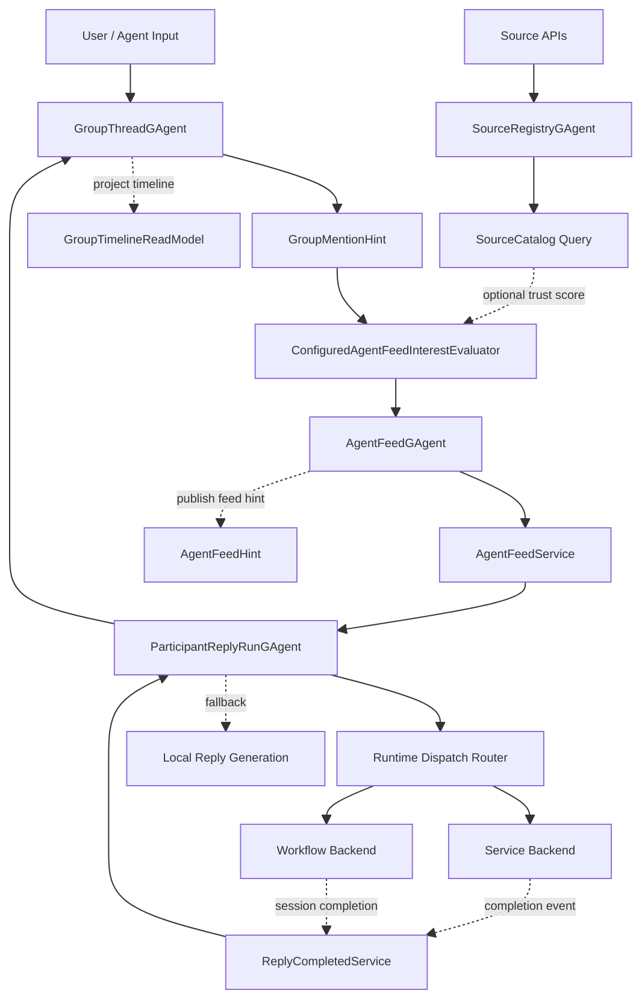
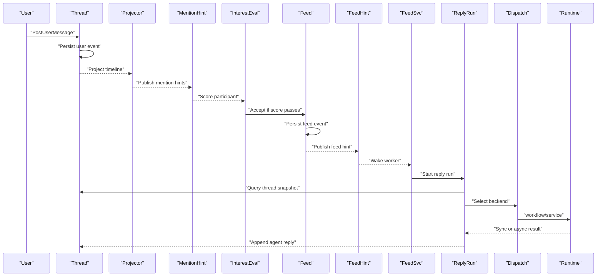
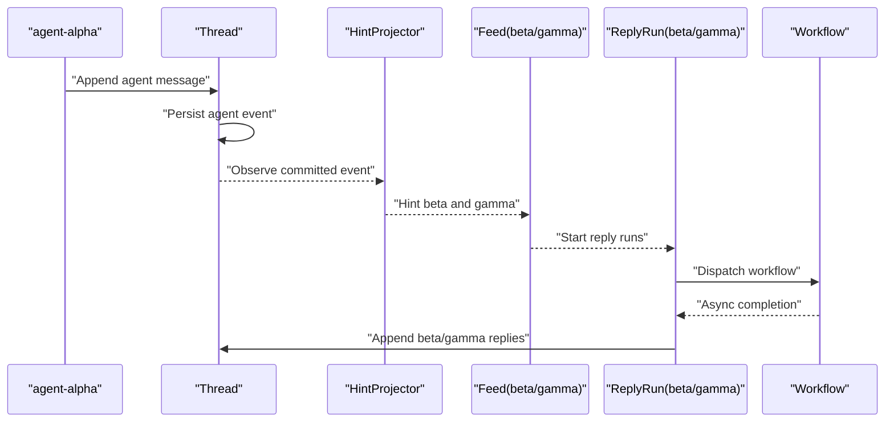
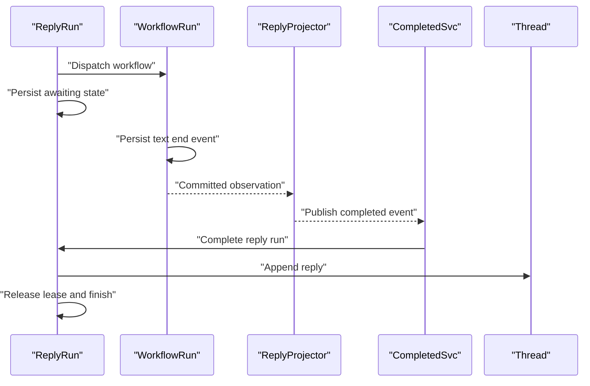

# Group Chat Multi-Agent Attention 当前实现架构

## 1. 范围

本文档描述 **当前仓库已经落地并验证过的实现**，不是目标态草图。

当前主链已经支持两类入口：

1. 用户消息触发多个 participant 回复
2. agent 主动发一条消息，并通过 `direct_hint_agent_ids` 点名另外两个 agent 回复

当前系统的中心组件是：

1. `GroupThreadGAgent`
2. `AgentFeedGAgent`
3. `SourceRegistryGAgent`
4. `AgentFeedService`
5. `ParticipantReplyRunGAgent`
6. `GroupParticipantReplyCompletedService`

当前系统更准确地说是：

- `group / thread / message` 主干
- 外挂 `per-agent feed filtering`
- 外挂 `source trust`
- 外挂 `reply session actor`

## 2. 当前实现结论

当前代码已经能稳定支撑下面这两条链：

1. `用户发消息 -> 按 direct hint 命中多个 agent -> 每个 agent 独立做兴趣评分 -> 接入各自 feed -> service 唤醒 reply run actor -> runtime 生成回复 -> reply run actor 回写 thread`
2. `agent 发消息 -> 该消息携带 direct hint -> Mention projector 继续投 hint -> 另外两个 agent 重复同一条主链回复`

因此：

- 多个 agent 可以围绕同一个 `thread/topic_id` 参与回复
- 主干事实由 `GroupThreadGAgent` 持有
- 每个 participant 是否真正进入执行，由 `AgentFeedGAgent` 和兴趣评分决定
- 每次回复的编排、终态和异步完成由 `ParticipantReplyRunGAgent` 收敛

## 3. 当前实现主图

这张图表达的是当前真实主链：

- `GroupThreadGAgent` 是 thread/timeline 的事实源
- `SourceRegistryGAgent` 为 interest evaluator 提供 source trust 查询
- `AgentFeedGAgent` 是 per-agent 的 accepted inbox
- `AgentFeedService` 只负责把 feed hint 转成 `StartParticipantReplyRunCommand`
- `ParticipantReplyRunGAgent` 是一次 reply session 的权威状态 owner
- runtime dispatch 当前已落地 `service + workflow` 两个 backend
- `GroupParticipantReplyCompletedService` 只负责把异步完成信号转回 reply run actor

这里要特别注意：

- `SourceRegistryGAgent` 不属于 participant runtime binding，也不是 agent 配置入口
- 它管理的是独立的 `source catalog / source trust`
- 它只在 interest evaluator 需要根据 `source_refs / evidence_refs` 算分时，作为旁路事实源参与

## 4. 核心组件分工

### 4.1 `GroupThreadGAgent`

职责：

- 绑定 `group_id + thread_id`
- 保存 participant 列表与 runtime binding
- 接收用户消息
- 接收 agent 回复
- 维护消息 timeline、reply 关系、`topic_id`、`signal_kind`
- 持久化这些业务字段：
  - `source_refs`
  - `evidence_refs`
  - `derived_from_signal_ids`
  - `direct_hint_agent_ids`

participant runtime binding 已经收敛为 typed target：

- `service_target`
- `workflow_target`
- `script_target`
- `local_target`

但是当前真正已经打通的 backend 只有：

- `service_target`
- `workflow_target`

`script_target / local_target` 目前还是协议预留，不是已完成能力。

### 4.2 `SourceRegistryGAgent`

职责：

- 维护 source identity
- 维护：
  - `source_id`
  - `source_kind`
  - `authority_class`
  - `verification_status`
  - `canonical_locator`

在当前实现里，它主要通过查询接口给 interest evaluator 提供 source trust 事实。

### 4.3 `AgentFeedGAgent`

职责：

- 维护单个 agent 的 accepted inbox
- 维护：
  - `next_item_entries`
  - `seen_signal_id_entries`
  - `feed_cursor`
- 接受 `AcceptSignalToFeedCommand`
- 在 signal 被 accept 后生成 `FeedSignalAcceptedEvent`
- 在 reply run 接受后通过 `AdvanceFeedCursorCommand` 推进 cursor

它不是 topic 的事实源，而是 per-agent 的消费状态 owner。

### 4.4 `ConfiguredAgentFeedInterestEvaluator`

职责：

- 根据宿主配置为每个 agent 单独计算 `interest score`
- 输入包含：
  - `direct_hint`
  - `topic subscription`
  - `publisher subscription`
  - `evidence presence`
  - source trust 查询结果
- 只有 `score >= minimum_interest_score` 时，才会把 signal 接进该 agent 的 feed

这一层当前仍然是 host-configured evaluator，不是 actor-owned subscription system。

### 4.5 `AgentFeedService`

职责：

- 订阅某个 `agent_id` 对应的 `AgentFeedHint` stream
- 收到 hint 后交给 `AgentFeedReplyLoopHandler`
- 它不是实际参与对话的 agent，也不再持有 reply session 状态
- 它只负责把 hint 转成 `StartParticipantReplyRunCommand`

`AgentFeedReplyLoopHandler` 当前已经非常薄，只做 command 转发。

### 4.6 `ParticipantReplyRunGAgent`

职责：

- 绑定一次 `group_id + thread_id + participant_agent_id + source_event_id` reply session
- 查询 thread 快照并定位触发消息
- 决定走 runtime dispatch 还是本地 reply generation fallback
- dispatch 当前已路由到：
  - `service`
  - `workflow`
- 统一持有：
  - `started`
  - `awaiting_completion`
  - `completed`
  - `no_content`
  - `failed`
  - `reply_message_id`
  - `root_actor_id`
  - `session_id`
- 负责：
  - `AppendAgentMessageCommand`
  - `AdvanceFeedCursorCommand`
  - reply projection lease 的 ensure/release

它是当前实现里 reply session 的权威状态 owner。

一个关键实现细节是：

- 对 `SyncCompleted`，reply run actor 会直接 append reply，再推进 feed cursor
- 对 `AsyncObserved`，reply run actor 会先 ensure reply projection、推进 feed cursor，再等待异步 completion 回来收敛终态

因此 feed cursor 当前表示的是“这条 accepted item 已进入 reply session 主链”，不是“最终一定已经落成 thread message”。

### 4.7 `Participant Runtime Dispatch Router`

职责：

- 对 `GroupParticipantRuntimeBinding` 做 backend 选择
- 当前根据 DI 中已注册的 dispatcher 动态组装

当前实现中真正已注册的 dispatcher 只有：

- `GAgentServiceParticipantRuntimeDispatchPort`
- `WorkflowParticipantRuntimeDispatchPort`

所以当前 runtime backend 支持矩阵是：

| target | 协议字段 | 当前实现 |
|---|---|---|
| `service_target` | 已有 | 已打通 |
| `workflow_target` | 已有 | 已打通 |
| `script_target` | 已有 | 未打通 |
| `local_target` | 已有 | 未打通 |

### 4.8 `GroupParticipantReplyCompletedService`

职责：

- 订阅全局 `GroupParticipantReplyCompletedEvent`
- 把 runtime 异步完成事件转换成 `CompleteParticipantReplyRunCommand`
- 把最终回写、lease release、终态收敛交回 `ParticipantReplyRunGAgent`

对 workflow backend：

- `WorkflowRunGAgent` 持久化 `TextMessageEndEvent(session_id)`
- `GroupParticipantReplySessionProjector` 从统一 projection 主链观察到它
- projector 统一转换成 `GroupParticipantReplyCompletedEvent`
- `GroupParticipantReplyCompletedService` 再把它转回 reply run actor

## 5. 当前实现时序

### 5.1 用户消息触发多 agent 回复

### 5.2 agent 主动发起问题，另外两个 agent 回复

这条链已经在真实宿主上验证过，当前 demo 脚本是：

- [group-chat-agent-relay-demo.sh](/Users/liyingpei/Desktop/Code/aevatar/tools/group-chat-agent-relay-demo.sh)

### 5.3 异步 workflow completion 的回写

## 6. 三个 agent 围绕一个 topic 怎么处理

假设有 `agent-alpha`、`agent-beta`、`agent-gamma`，用户发一条消息：

- `group_id = g1`
- `thread_id = t1`
- `topic_id = payments`
- `direct_hint_agent_ids = [agent-alpha, agent-beta, agent-gamma]`

当前实现会这样处理：

1. `GroupThreadGAgent` 持久化这条用户消息。
2. `GroupTimelineReadModel` 更新。
3. `GroupMentionHintProjector` 为 `agent-alpha`、`agent-beta`、`agent-gamma` 各发一条 `GroupMentionHint`。
4. `ConfiguredAgentFeedInterestEvaluator` 对三个 agent 分别算分。
5. 只有达到各自阈值的 agent，才会向自己的 `AgentFeedGAgent` 提交 `AcceptSignalToFeedCommand`。
6. 被 accept 的 agent 会收到自己的 `AgentFeedHint`。
7. `AgentFeedService` 把 hint 转成 `StartParticipantReplyRunCommand`。
8. `ParticipantReplyRunGAgent` 读取 thread 快照，执行 runtime，生成回复并 append 回 thread。

所以最终结果可能是：

- `0` 个 agent 回复
- `1` 个 agent 回复
- `2` 个 agent 回复
- `3` 个 agent 都回复

当前实现没有“全局只选一个最佳 agent”的统一仲裁器。  
它仍然是 **每个 agent 独立评分、独立 accept、独立回复**。

## 7. 当前实现的真实语义

### 7.1 系统主干仍然是 `group -> thread -> messages`

当前系统首先关心的是：

- 这条 thread 里谁发了什么
- 哪些 participant 被 direct hint 命中
- 哪些 agent 被自己的 feed 接受
- 哪些 reply session 最终成功 append 回 thread

所以骨架仍然是：

`group -> thread -> messages`

### 7.2 `topic_id / signal_kind / source_refs` 已经进入主模型

当前消息和事件已经携带：

- `topic_id`
- `signal_kind`
- `source_refs`
- `evidence_refs`
- `derived_from_signal_ids`
- `direct_hint_agent_ids`

这让 thread message 不只是“聊天文本”，也携带稳定的 signal 语义。

### 7.3 `SourceRegistryGAgent`、`AgentFeedGAgent`、`ParticipantReplyRunGAgent` 不是冲突关系

当前三者关系是：

- `GroupThreadGAgent` 管 thread/timeline 事实
- `SourceRegistryGAgent` 管 source trust 事实
- `AgentFeedGAgent` 管 per-agent feed accept/cursor 事实
- `ParticipantReplyRunGAgent` 管一次 reply session 的推进与终态

它们不是互相覆盖，而是：

- 一个内容主干
- 一个 source trust 增强层
- 一个 per-agent feed 层
- 一个 reply session 编排层

## 8. 当前实现的限制

当前实现有几个重要限制：

1. 主触发仍然高度依赖 `direct_hint`
   - 如果没有 direct hint，也没有命中配置型 topic/publisher 订阅，系统不会自然形成广泛扩散
2. agent message 现在 **可以** 继续投 hint
   - 但前提是这条 agent message 自己携带 `direct_hint_agent_ids`
3. 默认不会自动无限互聊
   - 当前 AI 自动生成的回复由 `ParticipantReplyRunGAgent` append 回 thread 时，`direct_hint_agent_ids` 为空
   - 因此普通 AI 回复不会自动触发下一轮 fan-out
4. interest routing 仍然依赖宿主配置
   - 不是 actor-owned 的完整订阅系统
5. 当前没有全局 `top_n_agents_per_signal`
   - 多个 agent 可以同时被 accept 并同时回复
6. runtime target 虽然已经 typed 化
   - 但当前真正打通的只有 `workflow + service`
   - `script/local` 还没有进入 dispatch 主链

所以当前实现更准确地说是：

`direct_hint-driven multi-agent reply system with actor-owned reply runs`

## 9. 当前 demo 与对外接口

当前已经可用的对外接口包括：

- `POST /api/group-chat/groups/{groupId}/threads`
- `POST /api/group-chat/groups/{groupId}/threads/{threadId}/messages`
- `POST /api/group-chat/groups/{groupId}/threads/{threadId}/agent-messages`
- `GET /api/group-chat/groups/{groupId}/threads/{threadId}`

其中：

- `messages` 用于用户发消息
- `agent-messages` 用于 agent 主动发起一条消息，并可通过 `directHintAgentIds` 点名其他 agent

这也是当前“一个 AI 发问题，另外两个 AI 回复”的 demo 入口。

## 10. 结论

当前仓库已经实现的是：

`以 GroupThreadGAgent 为主干、叠加 AgentFeedGAgent、SourceRegistryGAgent、AgentFeedService、ParticipantReplyRunGAgent 和 GroupParticipantReplyCompletedService 的多 agent 回复系统`

其中：

- `GroupThreadGAgent` 是 thread/timeline 的中心 actor
- `AgentFeedGAgent` 决定某个 agent 是否真正进入执行
- `SourceRegistryGAgent` 为 interest 评分提供 source trust 事实
- `AgentFeedService` 负责把 feed hint 转成 reply session 启动命令
- `ParticipantReplyRunGAgent` 负责把 accepted signal 收敛成一次可追踪的 reply session
- runtime dispatch 当前已落地 `workflow/service` 双 backend
- `GroupParticipantReplyCompletedService` 负责把异步完成信号转回 reply run actor

因此，如果现在有三个 agent 围绕一个 `topic_id` 聊，它们会通过：

`thread event -> mention hint -> per-agent score -> feed accept -> reply run -> runtime execute -> append back`

这条链被组织起来。

如果是“一个 AI 发起问题，另外两个 AI 回复”的 demo，则会走：

`agent message append -> mention hint -> per-agent feed -> reply run -> workflow/service runtime -> append back`

这条同一主链，只是入口从 `user message` 换成了 `agent message`。
