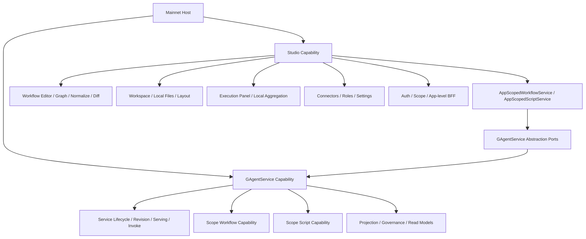

# Studio 独立于 GAgentService 的必要性说明（2026-03-24）

## 1. 文档目标

- 说明为什么 `Studio` 不应整体合并进 `GAgentService`。
- 明确 `GAgentService` 与 `Studio` 各自的职责边界、事实源边界与依赖方向。
- 给出推荐的组合方式，避免后续在宿主层、应用层和运行时层重新混层。

## 2. 结论

`Studio` 不应整体并入 `GAgentService`。

更准确地说：

- `GAgentService` 是 `Studio` 在 workflow/script 发布、激活、查询、调用上的正式 capability 内核。
- `Studio` 是面向 authoring、workspace、catalog、execution panel、settings、app-level BFF 的宿主子域。
- 两者应该保持“`Studio` 依赖 `GAgentService` 抽象端口”的单向关系，而不是把 `Studio` 反向吞进 `GAgentService`。

可以收敛的是组合层与少量桥接层，不是把 `Aevatar.Studio.*` 四层整体并进 `Aevatar.GAgentService.*`。

## 3. 当前代码事实

当前 Mainnet Host 已经采用并列组合，而不是吞并：

- `builder.AddGAgentServiceCapabilityBundle();`
- `builder.AddStudioCapability();`

见：

- `src/Aevatar.Mainnet.Host.Api/Program.cs`

当前依赖方向也已经是单向的：

- `Studio` 通过 `IScopeWorkflowQueryPort / IScopeWorkflowCommandPort / IScopeScriptQueryPort / IScopeScriptCommandPort` 等抽象接入正式能力。
- `Studio` 项目引用 `Aevatar.GAgentService.Abstractions`，而不是 `Aevatar.GAgentService.Core / Hosting / Projection / Governance`。

见：

- `src/Aevatar.Studio.Hosting/StudioCapabilityExtensions.cs`
- `src/Aevatar.Studio.Application/Aevatar.Studio.Application.csproj`
- `src/Aevatar.Studio.Hosting/Aevatar.Studio.Hosting.csproj`

这说明现有结构已经在表达一个清晰事实：

- `GAgentService` 是平台能力边界。
- `Studio` 是产品宿主与 authoring 子域。

## 4. GAgentService 的边界

`GAgentService` 的核心职责是把可发布、可激活、可调用的能力组织成统一的 service/runtime 契约。

从代码上看，它的边界包括：

### 4.1 service lifecycle 与 runtime activation

- service 定义
- revision 创建
- prepare / publish / default-serving / activate
- invoke dispatch

见：

- `src/platform/Aevatar.GAgentService.Hosting/Endpoints/ServiceEndpoints.cs`
- `src/platform/Aevatar.GAgentService.Hosting/DependencyInjection/ServiceCollectionExtensions.cs`

### 4.2 scope workflow/script capability 的正式发布面

workflow scope 能力并不是一个编辑器，而是把 scope 下 workflow 作为正式 service revision 管理：

- `ScopeWorkflowCommandApplicationService` 会创建 service definition、创建 revision、prepare、publish、set default serving、activate。

script scope 能力也不是一个 IDE，而是正式 definition/catalog/promotion 主链：

- `ScopeScriptCommandApplicationService` 会 upsert definition snapshot，再 promote catalog revision。

见：

- `src/platform/Aevatar.GAgentService.Application/Workflows/ScopeWorkflowCommandApplicationService.cs`
- `src/platform/Aevatar.GAgentService.Application/Scripts/ScopeScriptCommandApplicationService.cs`

### 4.3 projection / read model / governance

`GAgentService` 还承担：

- projection provider 注册
- service catalog / revision / serving / rollout / traffic 等 read model
- governance capability

见：

- `src/platform/Aevatar.GAgentService.Hosting/DependencyInjection/ServiceCollectionExtensions.cs`

### 4.4 GAgentService 不应承担的职责

按照上述边界，`GAgentService` 不应承担：

- workflow YAML 编辑器
- graph/yaml/diff/normalize 这类 authoring 逻辑
- 本地 workspace 与目录管理
- 本地 execution panel 聚合态
- Studio connectors / roles / settings
- OIDC claim/header/config 混合 scope 解析
- `/api/auth/me`、`/api/app/context` 这类 app-level BFF 协议

这些都不是 service runtime 或 governance 主链语义。

## 5. Studio 的边界

`Studio` 的职责不是“再造一套 runtime”，而是提供围绕 runtime capability 的 authoring/product 层。

### 5.1 authoring 语义

`Studio` 拥有明确的编辑器和文档模型语义：

- workflow parse
- graph mapping
- normalize
- validate
- diff

见：

- `src/Aevatar.Studio.Application/Studio/Services/WorkflowEditorService.cs`
- `src/Aevatar.Studio.Domain/Studio/Services/WorkflowDocumentNormalizer.cs`
- `src/Aevatar.Studio.Domain/Studio/Services/WorkflowValidator.cs`

这些逻辑是 authoring domain，不是 `GAgentService` 的 runtime domain。

### 5.2 workspace 与本地文件语义

`Studio` 负责：

- workflow directory 管理
- workflow 文件读写
- 本地 layout 文件
- 本地 workspace settings

见：

- `src/Aevatar.Studio.Application/Studio/Services/WorkspaceService.cs`
- `src/Aevatar.Studio.Infrastructure/Storage/FileStudioWorkspaceStore.cs`

这类文件系统语义天然属于 product workspace，不属于 service capability 内核。

### 5.3 execution panel 聚合态

`Studio` 的 `ExecutionService` 管理的是 UI 面板自己的执行记录：

- 启动执行时先写 `StoredExecutionRecord`
- 后续通过 HTTP 调 runtime
- 本地保存 frames、resume/stop 记录

见：

- `src/Aevatar.Studio.Application/Studio/Services/ExecutionService.cs`

这不是 runtime 分布式权威状态，而是 Studio UI 聚合态。若把它放进 `GAgentService`，会制造“UI 记录 == 业务事实”的误导。

现有架构文档也已明确：

- published workflow 列表、workflow binding、studio catalog、execution panel 状态来自不同事实源
- `ExecutionService + IStudioWorkspaceStore` 只是 Studio execution 面板自己的本地聚合态

见：

- `docs/architecture/2026-03-18-aevatar-console-studio-integration-architecture.md`

### 5.4 connectors / roles / settings 是 Studio authoring 配置

`Studio` 管理：

- connectors catalog
- roles catalog
- settings
- 本地 draft
- Chrono-storage 中的 studio catalog

见：

- `src/Aevatar.Studio.Application/Studio/Services/ConnectorService.cs`
- `src/Aevatar.Studio.Application/Studio/Services/RoleCatalogService.cs`
- `src/Aevatar.Studio.Application/Studio/Services/SettingsService.cs`
- `src/Aevatar.Studio.Infrastructure/DependencyInjection/ServiceCollectionExtensions.cs`
- `src/Aevatar.Studio.Infrastructure/Storage/ChronoStorageConnectorCatalogStore.cs`
- `src/Aevatar.Studio.Infrastructure/Storage/ChronoStorageRoleCatalogStore.cs`

这些配置是 Studio authoring 边界，不等于 runtime 内部 registry，也不等于 `GAgentService` 的 service definition。

### 5.5 app-level BFF / auth / scope 解析

`Studio` 当前还提供：

- `/api/auth/me`
- `/api/app/context`
- `/api/app/scripts/draft-run`
- claim/header/config/env 混合 scope 解析

见：

- `src/Aevatar.Studio.Hosting/Endpoints/StudioEndpoints.cs`
- `src/Aevatar.Studio.Infrastructure/ScopeResolution/AppScopeResolver.cs`

这些都是宿主产品语义，不应下沉到 `GAgentService` 变成 capability core 的职责。

## 6. 为什么不能把 Studio 整体并进 GAgentService

### 6.1 语义层次不同

`GAgentService` 解决的是：

- 如何把能力发布成 service
- 如何管理 revision / serving / activation
- 如何统一 invoke/query/read model

`Studio` 解决的是：

- 如何编辑
- 如何保存草稿
- 如何组织 workspace
- 如何展示 execution panel
- 如何给前端提供 app-level authoring 协议

两者不是同一层问题。

把 `Studio` 并进 `GAgentService`，相当于把“产品工作台”塞进“平台 capability 内核”，会直接混淆层次。

### 6.2 事实源不同

`GAgentService` 关注的是正式发布态、read model、activation 和 invocation。

`Studio` 里存在多种非 runtime 权威事实：

- 本地 workspace 文件
- 本地 execution records
- connectors/roles draft
- app settings

这些状态不是 service runtime 的权威事实源。

如果它们进入 `GAgentService` 主包，会让模块边界看起来像“都属于 service capability 的正式状态”，这在语义上是错误的。

### 6.3 依赖方向会反转

当前是：

- `Studio -> GAgentService.Abstractions`

如果整体合并，最终结果通常会变成：

- `GAgentService` 反向承担 YAML 编辑、文件存储、settings、OIDC scope 解析、app endpoint

这会把 `GAgentService` 从 capability 内核推成“平台能力 + authoring 产品 + 本地宿主”三合一模块。

这违背了仓库顶层要求里的分层、宿主组合与依赖反转原则。

### 6.4 宿主组合与内核能力会混成一层

`StudioEndpoints` 里有明显的 app-level 组合协议：

- 认证上下文
- app context
- script draft-run

文档也明确说这些 endpoint 只做宿主组合，不承载 scripting 或 workflow 的核心业务编排。

见：

- `docs/2026-03-17-aevatar-app-workflow-scripts-studio.md`

如果把它们并进 `GAgentService`，就会把“宿主组合层”错误地下沉成“能力内核层”。

### 6.5 工程依赖会被污染

当前 `Studio.Infrastructure` 带有明确的宿主与编辑器依赖，例如：

- `YamlDotNet`
- `Microsoft.AspNetCore.Authentication.OpenIdConnect`

见：

- `src/Aevatar.Studio.Infrastructure/Aevatar.Studio.Infrastructure.csproj`

而 `GAgentService.Hosting` 当前关注的是 capability、projection、governance、workflow/scripting capability 组合。

见：

- `src/platform/Aevatar.GAgentService.Hosting/Aevatar.GAgentService.Hosting.csproj`

把两者合并后，`GAgentService` 会被迫承载一批与 service runtime 内核无关的宿主依赖和配置面。

### 6.6 测试与演进节奏也不同

`GAgentService` 的演进重点是：

- capability 契约
- projection
- governance
- service lifecycle correctness

`Studio` 的演进重点是：

- authoring UX
- graph/yaml contract
- workspace 模型
- execution panel 行为
- settings/catalog/import/export

把两者绑成一个模块，会让任一侧的变更都扩大另一侧的回归面。

## 7. 可以共享什么，不该共享什么

### 7.1 可以共享

可以共享与继续收敛的部分：

- `IScopeWorkflow*` / `IScopeScript*` 这类 capability 端口
- app scope 与 capability 间的桥接 adapter
- 统一 bundle/host 注册入口
- 少量稳定 DTO 或错误模型

例如，后续可以新增一个更高层的宿主组合入口，把：

- `AddGAgentServiceCapabilityBundle()`
- `AddStudioCapability()`

封装成 mainnet 专用 bundle，但内部模块仍保持独立。

### 7.2 不该共享

不应收进 `GAgentService` 主体的部分：

- workflow editor domain
- workspace/file store
- execution panel local aggregation
- connectors/roles/settings authoring store
- `/api/app/*` BFF 协议
- auth/session/scope 产品层逻辑

这些都不属于 service runtime 或 governance 主链。

## 8. 推荐架构

推荐继续保持如下关系：

对应原则如下：

1. `GAgentService` 保持 capability 内核定位。
2. `Studio` 保持 authoring/product 子域定位。
3. `Studio` 只依赖 `GAgentService` 抽象端口，不依赖其内部实现。
4. Mainnet Host 负责组合二者，而不是让其中一个吞掉另一个。

## 9. 对未来重构的约束

后续如果继续收敛，建议遵循以下约束：

1. 只合并薄组合层，不合并领域边界。
2. 只上提稳定抽象，不把 Studio 的本地/产品语义下沉进 capability core。
3. 若 `Studio` 中某一能力被证明已成为正式平台能力，应先抽象成新的独立 capability，再被 `Studio` 与其他宿主共同复用。
4. 禁止通过“都跑在同一个 Mainnet Host 里”来证明“应该合并成一个模块”。

## 10. 最终判断

`Studio` 与 `GAgentService` 的关系应当是：

- `GAgentService` 提供正式 runtime capability。
- `Studio` 站在其上方提供 authoring、workspace、catalog、execution panel 与 app-level BFF。

因此：

- `Studio` 独立存在是必要的。
- `GAgentService` 不应吸收 `Studio`。
- 正确的演进方向是“组合更清晰、抽象更窄、桥接更薄”，不是“把 Studio 整包塞回 GAgentService”。
