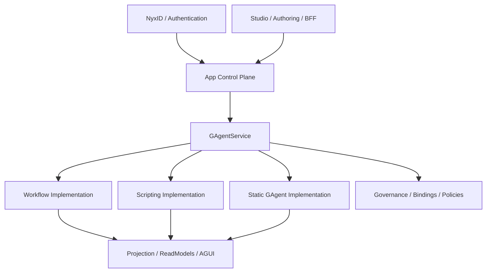

# 基于当前代码现状的 Aevatar AI App 平台组织建议（2026-03-25）

## 1. 文档目标

基于仓库当前已经落地的代码边界，回答一个更高层的问题：

- 如果 `Aevatar` 要长期作为一个持续运行的 `mainnet`
- 并且希望任何 AI app 都能在这里：
  - 定制自己的 workflow YAML
  - 定制和上传自己的 scripts
  - 部署自己派生自 `AIGAgentBase` / `GAgentBase` 的 GAgent
  - 接上 NyxID 登录
  - 再由平台把请求路由到这个 app 关联的服务

那么系统应该如何组织，才能既复用当前代码，又不把边界重新做乱。

本文只讨论“应该怎么组织”，不直接展开实现细节。

## 2. 基于现状的结论

当前代码已经具备一个很强的基础，但还没有形成真正的一等 `AI App` 领域对象。

现状里已经成立的是：

- `Aevatar.Mainnet.Host.Api` 已经是长期运行宿主，组合了：
  - `AddAevatarPlatform(...)`
  - `AddGAgentServiceCapabilityBundle()`
  - `AddStudioCapability()`
  - `AddNyxIdAuthentication()`
- `GAgentService` 已经是统一 capability kernel：
  - 能管理 service / revision / deployment / serving / invoke
  - 能承载 `workflow / scripting / static actor` 三种实现类型
  - 能通过 readmodel 查询当前 active deployment 与 primary actor
  - 能通过 governance 管理 binding / endpoint exposure / policy
- `Studio` 已经不是 runtime 本体，而是 authoring/BFF 子域：
  - workflow 编辑
  - script 编辑
  - workspace / execution panel / settings / connectors / roles
  - app-level `/api/auth/me` 与 `/api/app/context`
- `NyxID` 现在已经能把用户身份水位映射到 `scope_id`
- `scope workflow` 与 `scope script` 这两条“按 scope 发布能力”的路径已经打通

但当前还没成立的是：

- “一个 AI app” 的稳定权威模型
- “一个 AI app 发布了哪些能力资产”的正式 release 模型
- “一个 AI app 的公网入口应该打到哪个 service/endpoint” 的正式 route 模型
- “自定义 GAgent 上传部署” 的正式 packaging / trust / activation 模型

所以，当前系统不是“不能做 AI app 平台”，而是：

- `GAgentService` 已经像容器编排内核
- `Studio` 已经像作者工作台
- 但中间缺了一层真正的 `App Control Plane`

## 3. 现有代码里最应该保留的边界

### 3.1 `GAgentService` 继续做 capability kernel，不升级成“AI App 本体”

这是当前最重要的边界。

`GAgentService` 适合继续负责：

- service identity
- revision 生命周期
- artifact prepare / publish / activate
- serving / rollout / invoke
- service-scoped binding / endpoint / policy
- 统一 readmodel 与 invoke gateway

它不适合直接吞下：

- app catalog
- app release
- app route
- app authoring
- NyxID app-level BFF
- workspace / draft / execution panel

换句话说：

- `GAgentService` 是“服务能力内核”
- 不是“AI app 产品模型”

### 3.2 `Studio` 继续做 authoring 与 BFF，不并进 `GAgentService`

当前 `Studio` 的边界是对的，应该保留：

- workflow graph/yaml/normalize/validate
- script 编辑与 draft run
- workspace / execution panel / settings
- connectors / roles catalog
- app-level auth/context API

未来即使新增 `AI App` 能力，`Studio` 也应该通过新的 app 端口去调用，而不是直接把 Studio 域搬进 `GAgentService`。

### 3.3 `Workflow`、`Scripting`、`Static GAgent` 都继续作为 service implementation kind

这也是一个关键结论。

AI app 不应该再单独定义三套平行 runtime：

- 一套 workflow runtime
- 一套 script runtime
- 一套 custom GAgent runtime

更合理的组织是：

- workflow 只是 `GAgentService` 的一种 service implementation kind
- script 只是 `GAgentService` 的一种 service implementation kind
- static/custom GAgent 只是 `GAgentService` 的一种 service implementation kind

这样 app 层只需要组织“能力组合”，不需要重新发明第二套 runtime 主链。

## 4. 推荐组织：在 `GAgentService` 之上新增一层 `App Control Plane`

建议新增一个独立 capability，而不是把逻辑继续塞进 `Studio` 或 `GAgentService`。

推荐命名方向：

- `platform/Aevatar.AppPlatform.*`

当前代码已经落下的 Phase 1 bootstrap slice：

- `platform/Aevatar.AppPlatform.Abstractions`
- `platform/Aevatar.AppPlatform.Core`
- `platform/Aevatar.AppPlatform.Application`
- `platform/Aevatar.AppPlatform.Infrastructure`
- `platform/Aevatar.AppPlatform.Hosting`

不要命名成：

- `Aevatar.GAgentService.Apps.*`

因为它不是 `GAgentService` 的内部子概念，而是压在其上的更高一层产品控制面。

### 4.1 这层应该拥有哪些权威对象

最小闭环建议只引入两个长期权威对象：

1. `AppDefinition`
2. `AppRelease`

如果后续确实需要域名/路径路由解耦，再引入：

3. `AppRoute`

#### `AppDefinition`

表达 app 的稳定身份与归属，例如：

- `appId`
- `ownerScopeId`
- `displayName`
- `visibility`
- `description`
- `defaultReleaseId`
- `entryRouteMode`
- `authMode`

这里的核心语义是：

- “这个 app 是谁的”
- “这个 app 叫什么”
- “默认对外暴露哪个 release”

#### `AppRelease`

表达某个 app 某次已发布版本具体挂了哪些能力资产。

建议 release 里不要直接塞 bag，而是强类型引用：

- workflow service refs
- script service refs
- static service refs
- public entry refs
- companion/internal service refs

也就是说：

- `AppRelease` 不直接承载 workflow yaml / script source / actor binary
- 它只引用已经通过正式 capability 发布好的 service/revision

这样不会复制权威事实源。

## 5. AI App 的正确分层

对应职责建议如下：

### 5.1 Identity Plane

- NyxID 登录
- 标准 claims 映射
- `scope_id` 解析
- 后续可扩展 `app membership / app role / publisher role`

### 5.2 App Control Plane

- app 定义
- app release
- app 入口选择
- app 级查询
- app 级 publish orchestration
- app route resolve

### 5.3 Capability Plane

由现有 `GAgentService` 继续负责：

- service lifecycle
- revision artifact
- activation / serving / invoke
- governance / binding / policy

### 5.4 Authoring Plane

由现有 `Studio` 继续负责：

- workflow/script 编辑
- draft
- execution panel
- connectors / roles / settings

## 6. 你关心的三类资产，建议分别这样落位

### 6.1 Workflow YAML

当前路径已经基本正确：

- `Studio` 编辑 YAML
- `App Control Plane` 决定它属于哪个 app/asset
- 再调用 `GAgentService` 的 workflow capability 发布成一个 workflow service

不要让 app 层自己直接持有 workflow definition actor。

权威主链仍应是：

- `App asset -> GAgentService service/revision -> WorkflowGAgent activation -> WorkflowRunGAgent execution`

### 6.2 Scripts

当前路径也基本可复用：

- `Studio` 编辑 script source
- `App Control Plane` 决定它属于哪个 app/asset
- 再调用 scope/script capability 或其 app-aware 版本，完成：
  - definition snapshot upsert
  - catalog promote
  - scripting service revision publish

不要把 script catalog 直接塞进 app actor 状态里。

### 6.3 自定义 `AIGAgentBase` / `GAgentBase`

这里是当前架构最大的分叉点。

基于代码现状，现在已经存在：

- `StaticServiceRevisionSpec.ActorTypeName`
- `StaticServiceImplementationAdapter`
- `DefaultServiceRuntimeActivator.ActivateStaticAsync(...)`

这说明：

- “部署 host 内已存在的自定义 GAgent 类型” 这条路已经有基础
- 但“让第三方上传任意自定义 GAgent 源码/二进制，然后平台在线安装运行” 还没有正式能力闭环

所以应该把这件事拆成两个阶段：

#### 阶段 A：先支持 trusted static GAgent

即：

- app 团队把自定义 GAgent 编进 mainnet 可加载程序集
- app release 只引用 `actor_type_name`
- 由 static service activation 创建 actor

这条路简单、可控、最符合当前代码。

#### 阶段 B：再做 uploaded custom GAgent packaging

如果你真的希望“任何 app 团队上传自己的 `GAgentBase`/`AIGAgentBase` 实现”，那就必须新增一条独立 capability：

- source package / binary package 上传
- protobuf contract 校验
- dependency / sandbox / trust 校验
- 编译或装载
- 生成可激活的 revision artifact

这件事不应该直接塞进 `GAgentService` 核心，也不应该塞进 `Studio`。

更合理的是以后单独做：

- `platform/Aevatar.AppPackaging.*`

或者等价的 build/package capability。

## 7. 路由应该怎么组织

你说的“框架可以自己 routing 到这个 AI app 的关联服务上”，我建议分成两层：

### 7.1 公网入口路由：`AppRoute -> Entry Service`

外部请求不要直接路由到某个 workflow actor 或 script actor。

应该先解析：

- 当前用户是谁
- 当前命中哪个 app
- 当前 app 默认或指定 entry 是哪个 service/endpoint

然后只把请求转发到：

- `GAgentService invoke`
  或
- workflow run capability

也就是说，公网入口应该是：

- `App -> Entry Service`

不是：

- `App -> Internal Actor`

### 7.2 app 内部路由：`Service Binding / Governance`

app 内部多个能力之间的关联，不建议额外造一套 app-internal registry。

应优先复用现有治理面：

- `service binding`
- `endpoint exposure`
- `policy`

推荐的组织方式是：

- 每个 app 至少有一个 public entry service
- 这个 entry service 通过 binding 引用内部 service、connector、secret
- workflow 或 static GAgent 在运行时再根据 binding 决定调用哪些相关能力

这样“app 关联服务”本质上仍然是正式 service graph，而不是宿主里的临时路由表。

## 8. service identity 应该如何映射到 AI app

当前 `scope workflow` 路径把：

- `tenantId`
- `appId`

基本写死成 capability 常量，例如：

- `user-workflows`
- `workflow`

这适合“单一能力发布面”，但不适合“多 AI app 主网平台”。

如果要走 AI app 平台化，建议把 service identity 的四段语义真正用起来：

- `tenantId`：publisher/owner scope 或 org
- `appId`：AI app stable id
- `namespace`：environment / release channel
- `serviceId`：app 内部 service id

一个更适合 app 平台的例子是：

- `tenantId = <owner-scope-token>`
- `appId = copilot`
- `namespace = prod`
- `serviceId = chat-gateway`

以及：

- `tenantId = <owner-scope-token>`
- `appId = copilot`
- `namespace = prod`
- `serviceId = retrieval-script`

这样：

- app 维度天然存在于 service identity 中
- routing、query、governance 都不用再旁造第二套键体系

也就是说，未来不要再把 app 维度藏在硬编码 capability options 里。

## 9. Studio 侧应该怎么收敛

当前 `AppScopedWorkflowService` / `AppScopedScriptService` 的方向是对的，但语义上还停留在：

- “scope 下面有 workflow/script”

如果要升级到 AI app 平台，建议变成：

- “app 下面有 workflow/script/static-service asset”

Studio 后续应该依赖的不是零散 capability，而是新的 app 端口，例如：

- `IAppDefinitionCommandPort / IAppDefinitionQueryPort`
- `IAppReleaseCommandPort / IAppReleaseQueryPort`
- `IAppAssetCommandPort / IAppAssetQueryPort`

然后由 app 应用层再去编排：

- workflow capability
- scripting capability
- static service capability

这样可以避免：

- Studio 直接知道太多 GAgentService 细节
- app 逻辑继续散在 BFF 层
- embedded / proxy 的双分派模式持续扩大

## 10. 建议的实现顺序

### Phase 1：先补一层 `App Control Plane`

先只做：

- `AppDefinition`
- `AppRelease`
- app query/readmodel
- app 发布编排

但不改 workflow/script runtime 主链。

### Phase 2：把现有 scope workflow/script 升级成 app-aware asset publish

目标是：

- workflow/script 不再只是 “scope-owned”
- 而是 “app-owned asset”

scope 仍然保留 owner 语义，但 app 变成正式业务主键之一。

### Phase 3：做 public app route

把：

- `NyxID + app identity + entry service resolve + invoke`

串成真正的 app gateway。

### Phase 4：再决定是否支持 uploaded custom GAgent

这是最大风险点，必须最后单独做，不要一开始就混到 app 主链里。

## 11. 一个必须先拍板的问题

如果只问“现在基于代码现状，应该怎么组织”，我的建议已经足够明确：

- `Mainnet Host`
- `Studio`
- `App Control Plane`
- `GAgentService`
- `Workflow / Scripting / Static GAgent`

但如果要继续往实现走，必须先拍板一个问题：

### 你要支持的 custom GAgent，到底是哪一种？

是下面哪种：

1. **Trusted host-bundled GAgent**
   - 开发者把自定义 GAgent 编进 mainnet 部署物
   - 平台只负责 activation / serving / routing

2. **Uploaded source/binary GAgent**
   - 开发者把源码或二进制上传到平台
   - 平台负责校验、编译/装载、隔离、激活、回滚

这两个方向的系统复杂度不是一个量级。

当前代码只天然支持第 1 种；
如果要支持第 2 种，就必须新增 packaging/build/sandbox capability，而不是继续在现有 `GAgentService` 或 `Studio` 上打补丁。

## 12. 总结

一句话总结：

`Aevatar` 现在最合理的组织，不是把 `GAgentService` 直接包装成“AI app 框架”，而是：

- 把 `GAgentService` 保持为统一 capability kernel
- 把 `Studio` 保持为 authoring/BFF
- 在两者之间新增一层 `App Control Plane`
- 让 `AI App = 一个带 identity / release / route 的 service composition`

这样最符合当前代码，也最适合以后把 `Aevatar` 真的做成长期运行的 `mainnet`。
