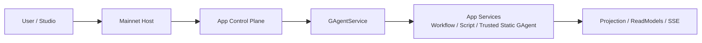
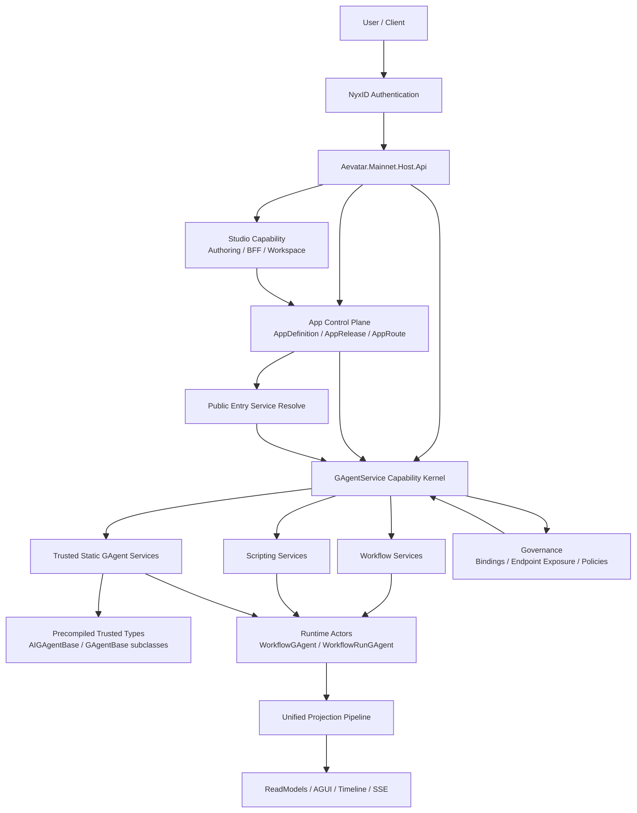
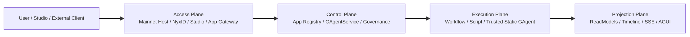

# Aevatar AI App Trusted Type 架构图（2026-03-25）

本文只讨论一种受控部署模式：

- 自定义 GAgent 只支持 **预编进 mainnet 宿主** 的 trusted type
- 不支持第三方上传源码/二进制后由平台在线编译或装载

在这个前提下，AI app 的正式组织方式如下。

## 极简版架构图



如果只记一条主线，可以记成：

- `Aevatar Mainnet` 负责长期运行
- `App Control Plane` 负责“这个 AI app 是什么、默认暴露什么”
- `GAgentService` 负责“把能力发布、激活、调用起来”
- `App Services` 只分三类：workflow、script、trusted static gagent
- `Projection` 负责对外查询、事件流和恢复

## 高层架构图



## 推荐采用的 4 层正式图

这是我更建议你们真正落地时采用的版本。



这 4 层里：

- `Access Plane` 负责接入，不负责业务事实
- `Control Plane` 负责“发布什么、激活什么、入口打到哪里”
- `Execution Plane` 负责真正执行
- `Projection Plane` 负责观察与查询

这是在完整功能不丢失的前提下，比较安全的最小压缩。

## 当前仓库目录映射

### 1. Access Plane

推荐归入这一层的当前代码：

- `src/Aevatar.Mainnet.Host.Api`
- `src/Aevatar.Authentication.*`
- `src/Aevatar.Studio.*`

其中：

- `Aevatar.Mainnet.Host.Api` 是组合根
- `Aevatar.Authentication.*` 负责 NyxID claims 映射与认证接入
- `Aevatar.Studio.*` 负责 authoring / BFF / workspace

### 2. Control Plane

当前已经存在的部分：

- `src/platform/Aevatar.GAgentService.Abstractions`
- `src/platform/Aevatar.GAgentService.Core`
- `src/platform/Aevatar.GAgentService.Application`
- `src/platform/Aevatar.GAgentService.Governance.*`
- `src/platform/Aevatar.GAgentService.Hosting`

当前已经实现的 Phase 1 bootstrap control plane：

- `src/platform/Aevatar.AppPlatform.Abstractions`
- `src/platform/Aevatar.AppPlatform.Core`
- `src/platform/Aevatar.AppPlatform.Application`
- `src/platform/Aevatar.AppPlatform.Infrastructure`
- `src/platform/Aevatar.AppPlatform.Hosting`

后续仍建议新增的部分：

- `src/platform/Aevatar.AppPlatform.Projection`

也就是说：

- `GAgentService` 继续是 control plane 的能力内核
- `AppPlatform` 则是压在它上面的一层 app 注册、release、route 编排
- 当前代码先采用 **配置驱动的 bootstrap adapter** 作为权威来源占位，后续再替换成 actor/projection 化实现

### 3. Execution Plane

推荐归入这一层的当前代码：

- `src/workflow/Aevatar.Workflow.*`
- `src/Aevatar.Scripting.*`
- trusted static gagent 所在业务项目

这里第三项不是单独的平台项目，而是：

- 任何宿主内预编译的 trusted GAgent 类型实现
- 它们通过 `StaticServiceRevisionSpec.ActorTypeName` 被引用和激活

### 4. Projection Plane

推荐归入这一层的当前代码：

- `src/Aevatar.CQRS.Projection.*`
- `src/platform/Aevatar.GAgentService.Projection`
- `src/platform/Aevatar.GAgentService.Governance.Projection`
- workflow / scripting 自己的 projection 组件

这一层必须单独保留，不能为了“压层”再并回执行面。

## 具体项目组合图（逻辑组合视图）

下面这张图按“具体项目”展开，但它表达的是 **逻辑组合/归属关系**，不是严格的 direct project reference 图。

说明：

- 没有标 `(planned)` 的都是仓库当前已有项目
- 标了 `(planned)` 的是建议新增项目
- `trusted agents` 项目是业务方自定义工程，不应该做进平台内核
- `trusted agents` 在 trusted type 模式下需要 **编进主网宿主部署物**
- 这张图里的箭头统一表达“逻辑组合/工程归属/部署收敛关系”，不单独区分 direct reference、transitive composition、host-time assembly
- 即便 `trusted agents` 最终编进主网宿主，也不应表现为 `GAgentService.Core -> business project` 的反向平台依赖

```mermaid
%%{init: {"maxTextSize": 100000, "flowchart": {"useMaxWidth": false, "nodeSpacing": 10, "rankSpacing": 50}, "themeVariables": {"fontSize": "10px"}}}%%
flowchart TB
  subgraph A["Access Plane"]
    Mainnet["src/Aevatar.Mainnet.Host.Api"]
    WfHost["src/workflow/Aevatar.Workflow.Host.Api\n(standalone host)"]
    AuthAbs["src/Aevatar.Authentication.Abstractions"]
    AuthHost["src/Aevatar.Authentication.Hosting"]
    AuthNyx["src/Aevatar.Authentication.Providers.NyxId"]
    StudioHost["src/Aevatar.Studio.Hosting"]
    StudioApp["src/Aevatar.Studio.Application"]
    StudioDomain["src/Aevatar.Studio.Domain"]
    StudioInfra["src/Aevatar.Studio.Infrastructure"]
  end

  subgraph B["Control Plane"]
    AppHost["src/platform/Aevatar.AppPlatform.Hosting\n(phase 1 implemented)"]
    AppInfra["src/platform/Aevatar.AppPlatform.Infrastructure\n(phase 1 implemented)"]
    AppApp["src/platform/Aevatar.AppPlatform.Application\n(phase 1 implemented)"]
    AppCore["src/platform/Aevatar.AppPlatform.Core\n(phase 1 implemented)"]
    AppAbs["src/platform/Aevatar.AppPlatform.Abstractions\n(phase 1 implemented)"]

    GSHost["src/platform/Aevatar.GAgentService.Hosting"]
    GSApp["src/platform/Aevatar.GAgentService.Application"]
    GSCore["src/platform/Aevatar.GAgentService.Core"]
    GSAbs["src/platform/Aevatar.GAgentService.Abstractions"]

    GovHost["src/platform/Aevatar.GAgentService.Governance.Hosting"]
    GovApp["src/platform/Aevatar.GAgentService.Governance.Application"]
    GovCore["src/platform/Aevatar.GAgentService.Governance.Core"]
    GovAbs["src/platform/Aevatar.GAgentService.Governance.Abstractions"]

    ScriptHost["src/Aevatar.Scripting.Hosting"]
  end

  subgraph C["Execution Plane"]
    WfSdk["src/workflow/Aevatar.Workflow.Sdk"]
    WfApp["src/workflow/Aevatar.Workflow.Application"]
    WfAppAbs["src/workflow/Aevatar.Workflow.Application.Abstractions"]
    WfCore["src/workflow/Aevatar.Workflow.Core"]
    WfInfra["src/workflow/Aevatar.Workflow.Infrastructure"]
    WfAbs["src/workflow/Aevatar.Workflow.Abstractions"]

    ScriptApp["src/Aevatar.Scripting.Application"]
    ScriptCore["src/Aevatar.Scripting.Core"]
    ScriptInfra["src/Aevatar.Scripting.Infrastructure"]
    ScriptAbs["src/Aevatar.Scripting.Abstractions"]

    AICore["src/Aevatar.AI.Core"]
    AIAbs["src/Aevatar.AI.Abstractions"]
    AITools["src/Aevatar.AI.ToolProviders.MCP\nsrc/Aevatar.AI.ToolProviders.Skills"]
    AIProviders["src/Aevatar.AI.LLMProviders.MEAI\nsrc/Aevatar.AI.LLMProviders.Tornado"]

    TrustedAgents["src/apps/<app>.TrustedAgents\n(planned business project)"]
  end

  subgraph D["Projection Plane"]
    CQRSAbs["src/Aevatar.CQRS.Projection.Core.Abstractions"]
    CQRSCore["src/Aevatar.CQRS.Projection.Core"]
    CQRSRuntimeAbs["src/Aevatar.CQRS.Projection.Runtime.Abstractions"]
    CQRSRuntime["src/Aevatar.CQRS.Projection.Runtime"]
    CQRSStores["src/Aevatar.CQRS.Projection.Stores.Abstractions"]
    CQRSProviders["src/Aevatar.CQRS.Projection.Providers.InMemory\nsrc/Aevatar.CQRS.Projection.Providers.Elasticsearch\nsrc/Aevatar.CQRS.Projection.Providers.Neo4j"]

    GSProj["src/platform/Aevatar.GAgentService.Projection"]
    GovProj["src/platform/Aevatar.GAgentService.Governance.Projection"]
    AppProj["src/platform/Aevatar.AppPlatform.Projection\n(planned)"]
    WfProj["src/workflow/Aevatar.Workflow.Projection"]
    WfAgui["src/workflow/Aevatar.Workflow.Presentation.AGUIAdapter"]
    ScriptProj["src/Aevatar.Scripting.Projection"]
    AIProj["src/Aevatar.AI.Projection"]
  end

  subgraph E["Shared Platform Substrate"]
    Foundation["src/Aevatar.Foundation.Abstractions\nsrc/Aevatar.Foundation.Core\nsrc/Aevatar.Foundation.Runtime*"]
    Hosting["src/Aevatar.Hosting\nsrc/Aevatar.Bootstrap\nsrc/Aevatar.Bootstrap.Extensions.AI"]
    Config["src/Aevatar.Configuration"]
    Agui["src/Aevatar.Presentation.AGUI"]
  end

  Mainnet --> StudioHost
  Mainnet --> AuthHost
  Mainnet --> AuthNyx
  Mainnet --> GSHost
  Mainnet --> AppHost
  StudioHost --> StudioApp
  StudioHost --> StudioInfra
  StudioApp --> StudioDomain
  StudioApp --> AppAbs
  StudioApp --> GSAbs

  AppHost --> AppApp
  AppHost --> AppInfra
  AppApp --> AppCore
  AppApp --> AppAbs
  AppInfra --> AppAbs
  AppApp --> GSAbs
  AppApp --> GovAbs

  GSHost --> GSApp
  GSApp --> GSCore
  GSApp --> GSAbs
  GSApp --> WfAppAbs
  GSApp --> ScriptAbs
  GSHost --> GovHost

  GovHost --> GovApp
  GovApp --> GovCore
  GovApp --> GovAbs
  GovApp --> GSAbs

  GSHost --> WfInfra
  GSHost --> ScriptHost

  WfApp --> WfAppAbs
  WfApp --> WfCore
  WfInfra --> WfCore
  WfInfra --> WfAbs
  WfAgui --> WfAppAbs

  ScriptHost --> ScriptApp
  ScriptApp --> ScriptCore
  ScriptInfra --> ScriptCore
  ScriptCore --> ScriptAbs

  TrustedAgents --> AICore
  TrustedAgents --> Foundation

  GSProj --> CQRSCore
  GovProj --> CQRSCore
  WfProj --> CQRSCore
  ScriptProj --> CQRSCore
  AIProj --> CQRSCore
  CQRSCore --> CQRSAbs
  CQRSRuntime --> CQRSRuntimeAbs
  CQRSRuntime --> CQRSStores
  CQRSProviders --> CQRSStores

  Mainnet --> Hosting
  GSHost --> Hosting
  WfHost --> Hosting
  ScriptHost --> Hosting
  StudioHost --> Hosting

  Mainnet --> Foundation
  GSCore --> Foundation
  WfCore --> Foundation
  ScriptCore --> Foundation
  AICore --> Foundation

  StudioHost --> Config
  GSHost --> Config
  WfHost --> Config

  StudioHost --> Agui
  WfAgui --> Agui
```



## 这张项目图的读法

可以把它压缩理解成下面这几句：

- `Aevatar.Mainnet.Host.Api` 是最终组合根
- `Aevatar.Studio.*` 只负责接入与 authoring
- `Aevatar.GAgentService.* + Governance.*` 是统一控制面
- `Aevatar.Workflow.* / Aevatar.Scripting.* / trusted agents project` 是执行面
- `Aevatar.CQRS.Projection.* + 各能力 projection` 是统一读侧
- `Aevatar.Foundation.*` 是整个系统共同依赖的底座
- `trusted agents` 必须编进宿主部署物，但不应倒灌成平台 core 对业务工程的依赖

## 这一版压层后的关键约束

为了压成 4 层，但不破坏语义，我建议明确保留下面几个规则：

1. `Studio` 只能留在 `Access Plane`
   - 不能并进 `Control Plane`
   - 否则 authoring 和 capability kernel 会重新混层

2. `AppPlatform + GAgentService` 只能在概念上压到同一 `Control Plane`
   - 但代码上仍应保持独立模块
   - `AppPlatform` 依赖 `GAgentService` 抽象，而不是反过来

3. `Projection Plane` 必须单独存在
   - 不能和 `Execution Plane` 合并
   - 否则会破坏仓库当前最强调的读写分离与统一投影主链

4. trusted static gagent 只是一种 execution implementation
   - 不是新的平台层
   - 不是新的宿主层
   - 不是新的 app control plane

## 推荐的一句话口径

如果你要对外讲得很短，我建议统一成这句：

> Aevatar mainnet 实际上分成 4 层：接入层、控制层、执行层、投影层；AI app 不是独立 runtime，而是在控制层注册、在执行层运行、在投影层被观察的一组 service composition。

## 分层说明

### 1. `Aevatar.Mainnet.Host.Api`

主网宿主，长期运行，负责组合：

- NyxID 认证
- Studio 能力
- App 控制面
- GAgentService 能力内核

### 2. `Studio Capability`

只负责 authoring 与 BFF：

- workflow YAML 编辑
- scripts 编辑
- workspace / settings / execution panel

它不直接拥有 runtime 权威事实。

### 3. `App Control Plane`

负责 AI app 这一层的正式业务模型：

- `AppDefinition`
- `AppRelease`
- `AppRoute`

它决定：

- 一个 app 有哪些能力资产
- 当前默认 release 是哪个
- 对外入口应该打到哪个 service

### 4. `GAgentService Capability Kernel`

继续作为统一 capability kernel：

- service / revision / deployment / serving
- invoke gateway
- governance / binding / policy

它不直接等于 app 本体。

### 5. 三种 service implementation

在 trusted type 模式下，AI app 的能力仍然收敛为三类正式 service：

- `Workflow Services`
- `Scripting Services`
- `Trusted Static GAgent Services`

其中第三类的关键约束是：

- 只能引用宿主进程内已存在的 .NET 类型
- 通过 `ActorTypeName` 激活
- 不存在运行时上传、动态编译、动态装载

### 6. `Trusted Static GAgent Services`

这是自定义 `AIGAgentBase` / `GAgentBase` 的正确落位：

- app 团队先把 trusted GAgent 编进 mainnet 宿主程序集
- app release 再引用相应的 static service revision
- `GAgentService` 激活时创建对应 actor

这条路径和 workflow/script 一样，仍然走统一：

- revision
- activation
- serving
- invoke
- projection

### 7. `Governance`

app 内部能力之间的关联，不再额外造 app 内注册表，而是优先复用：

- service bindings
- endpoint exposure
- policies

这样 public entry service 可以安全地引用：

- workflow service
- scripting service
- trusted static gagent service
- connector / secret

### 8. `Unified Projection Pipeline`

三类 service 最终都进入统一投影链路：

- read model
- timeline
- AGUI
- SSE / 查询恢复

这符合仓库当前“统一投影主链”的架构要求。

## 推荐的请求主链

```mermaid
%%{init: {"maxTextSize": 100000, "flowchart": {"useMaxWidth": false, "nodeSpacing": 10, "rankSpacing": 50}, "themeVariables": {"fontSize": "10px"}}}%%
flowchart LR
  A["Client Request"] --> B["NyxID Login / Claims"]
  B --> C["AppRoute Resolve"]
  C --> D["Entry Service Resolve"]
  D --> E["GAgentService Invoke"]
  E --> F["Workflow / Script / Trusted Static GAgent"]
  F --> G["Committed Events"]
  G --> H["Unified Projection Pipeline"]
  H --> I["SSE / AGUI / ReadModels"]
```



## AppDefinition / AppRelease Actor 建模补充

### AppDefinition Actor

**定位**：长期权威事实拥有者，管理 app 的稳定身份与归属。

**状态结构**（Protobuf）：

```protobuf
message AppDefinitionState {
  string app_id = 1;
  string owner_scope_id = 2;
  string display_name = 3;
  AppVisibility visibility = 4;
  string description = 5;
  string default_release_id = 6;
  string entry_route_mode = 7;
  int64 version = 8;
}

enum AppVisibility {
  APP_VISIBILITY_PRIVATE = 0;
  APP_VISIBILITY_PUBLIC = 1;
}
```

**Actor 特征**：

| 维度 | 决策 | 理由 |
|------|------|------|
| 生命周期 | 长期 | app identity 是持久事实，不是临时编排 |
| 热点风险 | 低 | `defaultReleaseId` 切换是低频运维操作（发布/回滚），不是请求路径上的热点写入 |
| ActorId | `app:{app_id}` | 稳定寻址，不泄露实现细节 |
| 读取方式 | readmodel | 请求路径上的 route resolve 走 readmodel，不直读 actor 状态 |

**事件**：

```protobuf
message AppDefinitionCreated {
  string app_id = 1;
  string owner_scope_id = 2;
  string display_name = 3;
  AppVisibility visibility = 4;
}

message AppDefaultReleaseChanged {
  string app_id = 1;
  string previous_release_id = 2;
  string new_release_id = 3;
}

message AppDefinitionUpdated {
  string app_id = 1;
  string display_name = 2;
  string description = 3;
  AppVisibility visibility = 4;
}
```

### AppRelease Actor

**定位**：创建后不可变的快照，记录某次发布具体挂了哪些能力资产。

**状态结构**（Protobuf）：

```protobuf
message AppReleaseState {
  string release_id = 1;
  string app_id = 2;
  string created_by_scope_id = 3;
  int64 created_at_unix_ms = 4;
  AppReleaseStatus status = 5;
  repeated AppServiceRef service_refs = 6;
  repeated AppEntryRef entry_refs = 7;
  int64 version = 8;
}

enum AppReleaseStatus {
  APP_RELEASE_STATUS_DRAFT = 0;
  APP_RELEASE_STATUS_PUBLISHED = 1;
  APP_RELEASE_STATUS_ARCHIVED = 2;
}

message AppServiceRef {
  string service_key = 1;           // tenant_id:app_id:namespace:service_id
  string revision_id = 2;           // 锁定到具体 revision
  ServiceImplementationKind kind = 3;
  AppServiceRole role = 4;          // ENTRY / COMPANION / INTERNAL
}

message AppEntryRef {
  string entry_id = 1;
  string service_key = 2;
  string endpoint_id = 3;
}

enum AppServiceRole {
  APP_SERVICE_ROLE_ENTRY = 0;
  APP_SERVICE_ROLE_COMPANION = 1;
  APP_SERVICE_ROLE_INTERNAL = 2;
}
```

**Actor 特征**：

| 维度 | 决策 | 理由 |
|------|------|------|
| 生命周期 | 长期但低活跃 | release 创建后只做状态转换（draft → published → archived），不接受内容变更 |
| 不可变性 | `service_refs` / `entry_refs` 在 `PUBLISHED` 后冻结 | release 是快照，变更内容必须创建新 release |
| ActorId | `app-release:{app_id}:{release_id}` | 包含 app_id 方便前缀扫描 |
| 热点风险 | 无 | 创建低频，读取走 readmodel |

**事件**：

```protobuf
message AppReleaseCreated {
  string release_id = 1;
  string app_id = 2;
  string created_by_scope_id = 3;
  repeated AppServiceRef service_refs = 4;
  repeated AppEntryRef entry_refs = 5;
}

message AppReleasePublished {
  string release_id = 1;
  string app_id = 2;
}

message AppReleaseArchived {
  string release_id = 1;
  string app_id = 2;
}
```

### AppDefinition 与 AppRelease 的一致性模型

```
                    ┌─────────────────────┐
                    │   AppDefinition     │
                    │   (actor, 权威)      │
                    │                     │
                    │ default_release_id ─┼──→ AppRelease actor
                    └────────┬────────────┘
                             │ committed events
                             ▼
                    ┌─────────────────────┐
                    │  AppDefinition      │
                    │  ReadModel          │
                    │  (projection 物化)   │
                    └────────┬────────────┘
                             │ route resolve 查询
                             ▼
                    ┌─────────────────────┐
                    │  AppRoute Resolve   │
                    │  (请求路径，读 RM)    │
                    └─────────────────────┘
```

- **写路径**：`SetDefaultRelease command → AppDefinition actor → AppDefaultReleaseChanged event → projection 物化`
- **读路径**：`route resolve 只读 AppDefinition readmodel`，不直读 actor
- **一致性**：最终一致。route resolve 读到的 default_release_id 可能滞后于 actor 最新状态，但这在发布场景下可接受（发布是运维操作，秒级延迟无影响）
- **AppRelease 与 AppDefinition 无强一致要求**：AppDefinition 只持有 `default_release_id` 引用，AppRelease 自身是独立 actor。切换 release 是 AppDefinition 的单 actor 事务

### ReadModel 设计

| ReadModel | 权威源 | 文档 ID | 用途 |
|-----------|--------|---------|------|
| `AppDefinitionReadModel` | AppDefinition actor | `app:{app_id}` | app 列表、详情、route resolve |
| `AppReleaseReadModel` | AppRelease actor | `app-release:{app_id}:{release_id}` | release 详情、service ref 查询 |
| `AppReleaseCatalogReadModel` | AppRelease actor（聚合） | `app-releases:{app_id}` | 某 app 下所有 release 列表 |

`AppReleaseCatalogReadModel` 如果有跨 release 聚合的稳定业务语义（如"列出 app 所有 release 并分页"），应建模为 aggregate actor，而非 query-time 拼装。

---

## Service Identity 迁移规划

### 现状

当前 service identity 四段结构已存在：

```protobuf
message ServiceIdentity {
  string tenant_id = 1;
  string app_id = 2;
  string namespace = 3;
  string service_id = 4;
}
```

但使用方式是硬编码常量：

| 能力 | tenant_id | app_id | namespace | service_id |
|------|-----------|--------|-----------|------------|
| Scope Workflow | `user-workflows` | `workflow` | `user:{hash(scopeId)}` | `{workflowId}` |
| Scope Script | 未走 ServiceIdentity 四段 | — | — | — |

Service Key = `tenant_id:app_id:namespace:service_id`，已作为所有 readmodel 的 document ID。

### 目标态

```
tenant_id  = {owner_scope_token}       // app 归属的 scope（来自 NyxID）
app_id     = {app_stable_id}           // AI app 稳定标识
namespace  = {environment_or_channel}   // prod / staging / dev
service_id = {service_name}            // app 内部 service 标识
```

示例：

```
scope_abc123:copilot:prod:chat-gateway
scope_abc123:copilot:prod:retrieval-script
scope_abc123:copilot:prod:knowledge-agent
```

### 迁移分三步

#### Step 1：Script 对齐 ServiceIdentity（Phase 1 前置）

**问题**：Script 当前没走 ServiceIdentity 四段，用的是独立的 catalog/definition actor id 体系。

**动作**：
1. `ScopeScriptCommandApplicationService` 对齐 workflow 的模式，通过 `ScopeScriptCapabilityConventions.BuildIdentity(options, scopeId, scriptId)` 构建 ServiceIdentity
2. 新增 `ScopeScriptCapabilityOptions`，补齐 `TenantId` / `AppId` 常量（临时值，如 `user-scripts` / `script`）
3. Script readmodel 的 document ID 切换到 `ServiceKeys.Build(identity)`
4. 确保 script 的 governance（binding/endpoint/policy）走 ServiceIdentity

**风险**：script readmodel 键变更需要 reindex。开发期影响可控。

#### Step 2：预留 app-aware 字段，但不改 scope 路径（Phase 1）

**动作**：
1. `ScopeWorkflowCapabilityOptions` 和 `ScopeScriptCapabilityOptions` 新增 `AppId` 配置项（默认值保持 `workflow` / `script`）
2. 新的 `AppPlatform` 发布路径使用真实 `app_id`，`tenant_id` 填 `owner_scope_token`
3. Service Key 格式不变（仍然是 `:`  分隔四段），只是填入值从常量变为动态
4. ReadModel document ID 格式不变，自然兼容

**关键约束**：Phase 1 期间，旧的 scope workflow/script 路径和新的 app-aware 路径并存，通过 `tenant_id + app_id` 前缀自然隔离，不需要额外的路由切换逻辑。

#### Step 3：scope 路径升级为 app-aware（Phase 2）

**动作**：
1. 每个 scope 下的 workflow/script 默认归属于该 scope 的"默认 app"
2. `AppScopedWorkflowService` / `AppScopedScriptService` 改为调用 `IAppAssetCommandPort`，不再直调 `ScopeWorkflowCommandApplicationService`
3. `tenant_id` 统一为 `owner_scope_token`，`app_id` 统一为真实 app id
4. 旧数据迁移：后台 materializer 按旧 key 读取，按新 key 写入，完成后切换查询路径

**数据迁移策略**：
- ReadModel 是 projection 物化的副本，可以从 event store 重放重建
- Service Key 变更 = document ID 变更 = 需要 reindex
- 推荐策略：新 projection 并行写入新 key，验证一致后切换查询端，删旧 key
- Governance binding/policy 中的 `InvokeAllowedCallerServiceKeys` 需要同步更新引用

### 迁移风险矩阵

| 风险 | 影响 | 缓解 |
|------|------|------|
| ReadModel reindex 期间查询不可用 | 中 | 新旧 key 并行写入，原子切换读路径 |
| Governance policy 中的 service key 引用过期 | 高 | Step 2 新路径直接用新 key；旧路径保持旧 key 直到 Step 3 统一迁移 |
| Script 对齐 ServiceIdentity 影响现有 catalog actor | 中 | catalog actor id 保持不变，只补 ServiceIdentity 维度 |
| 四段 key 中特殊字符冲突 | 低 | `ServiceKeys.Build` 已做 normalize，`:` 分隔符与值内容不冲突 |

---

## NyxId 集成分析与补充服务建议

### 当前 NyxId 能力与 Aevatar App 平台需求对照

| Aevatar App 平台需求 | NyxId 当前能力 | 差距 |
|---------------------|---------------|------|
| 用户登录、身份识别 | OAuth 2.0 + OIDC，JWT bearer token | **已满足** |
| scope_id 解析 | bearer token `sub` claim → user id | **已满足**（Aevatar 侧映射） |
| App 注册（开发者注册 AI app） | OAuth Client 注册（admin + developer self-service） | **部分满足**，见下 |
| App 级别权限（谁能发布、谁能调用） | RBAC roles/groups/permissions | **需扩展** |
| App 级别 scope（隔离 app 资源） | 无 Organization / Workspace / Tenant | **需新增** |
| Service Account 代表 app 调用 | Service Account + Client Credentials | **已满足** |
| App 内 service 间 delegation | RFC 8693 token exchange | **已满足** |
| App 发布审批 | Approval system（push-based） | **可复用** |

### NyxId 需要新增的服务

#### 1. Organization / Workspace 模型（优先级：高）

**问题**：NyxId 当前是 flat 用户模型，没有 org/workspace 层级。Aevatar 的 `owner_scope_id` 需要一个归属容器。

**建议新增**：

```
Organization
├── id (UUID)
├── name
├── slug
├── owner_user_id
├── plan / tier
├── created_at
└── members[] → OrganizationMember
    ├── user_id
    ├── org_role (owner / admin / member / viewer)
    └── joined_at
```

**API 端点**：
- `POST /api/v1/organizations` — 创建 org
- `GET /api/v1/organizations` — 列出用户所属 org
- `GET /api/v1/organizations/{org_id}` — org 详情
- `PUT /api/v1/organizations/{org_id}` — 更新 org
- `DELETE /api/v1/organizations/{org_id}` — 删除 org
- `POST /api/v1/organizations/{org_id}/members` — 邀请成员
- `DELETE /api/v1/organizations/{org_id}/members/{user_id}` — 移除成员
- `PATCH /api/v1/organizations/{org_id}/members/{user_id}/role` — 变更成员角色

**Token claim 扩展**：
```json
{
  "sub": "user-uuid",
  "orgs": [
    {"id": "org-uuid", "slug": "acme", "role": "admin"}
  ]
}
```

**与 Aevatar 的映射**：`owner_scope_id = org_id`（个人用户可以有一个隐式 personal org）

#### 2. App Registration 模型（优先级：高）

**问题**：NyxId 的 OAuth Client 是"允许第三方应用代表用户操作 NyxId"，而 Aevatar 的 App 是"在 Aevatar 平台上运行的 AI 应用"。这是两个不同的概念。

**建议新增**：

```
PlatformApp
├── id (UUID)
├── org_id → Organization
├── name
├── slug
├── description
├── visibility (private / public)
├── oauth_client_id → OauthClient (optional, app 自身的 OAuth client)
├── created_by (user_id)
├── created_at
└── status (active / suspended / archived)
```

**API 端点**：
- `POST /api/v1/apps` — 注册 app（需 org admin 或 owner）
- `GET /api/v1/apps` — 列出当前 org 下的 app
- `GET /api/v1/apps/{app_id}` — app 详情
- `PUT /api/v1/apps/{app_id}` — 更新 app
- `DELETE /api/v1/apps/{app_id}` — 删除 app
- `POST /api/v1/apps/{app_id}/api-keys` — 为 app 创建 API key
- `GET /api/v1/apps/{app_id}/members` — app 级别成员/权限

**Token claim 扩展**（app context 请求时）：
```json
{
  "sub": "user-uuid",
  "app_id": "app-uuid",
  "app_role": "publisher",
  "org_id": "org-uuid"
}
```

#### 3. App-scoped Roles & Permissions（优先级：中）

**问题**：当前 RBAC 是全局的（admin/user），没有 app 级别的权限控制（谁能发布、谁能调用、谁能查看）。

**建议扩展**：

在现有 Role 模型上增加 `app_id` 可选字段（类似现有的 `client_id` 字段）：

```
Role (现有)
├── ... existing fields ...
├── client_id (optional, for client-scoped roles)  ← 已有
├── app_id (optional, for app-scoped roles)         ← 新增
```

**预定义 app-scoped roles**：
- `app:owner` — 完全控制，可删除 app
- `app:publisher` — 可发布 release、管理 service
- `app:developer` — 可编辑 workflow/script，不可发布
- `app:viewer` — 只读访问

**Permission 扩展**：
```
apps:create          — 在 org 下创建 app
apps:read            — 查看 app 信息
apps:write           — 更新 app 设置
apps:delete          — 删除 app
apps:publish         — 发布 release
apps:invoke          — 调用 app 的 public entry
apps:manage-members  — 管理 app 成员权限
```

#### 4. App-scoped OAuth Scope（优先级：中）

**建议新增 scope**：
- `apps:read` — 读取 app 信息
- `apps:write` — 管理 app
- `apps:publish` — 发布 app release
- `apps:invoke` — 调用 app service

这些 scope 可以配置到 OAuth Client 的 `allowed_scopes` 中，控制第三方应用对 Aevatar app 的访问范围。

#### 5. App Public Access Token（优先级：低，Phase 3）

**场景**：AI app 对外暴露 public entry 时，终端用户可能不是 NyxId 注册用户。

**建议**：
- 复用现有 Service Account + Client Credentials 机制
- 每个 app 可以创建自己的 service account 作为 public access identity
- 或者支持 anonymous token（受限 scope，只能访问 public app entry）

### 集成架构

```
┌──────────────────────────────────────────────┐
│                   NyxId                       │
│                                              │
│  User ──→ Organization ──→ PlatformApp       │
│    │          │                  │            │
│    │          │                  ├── OAuth Client (optional) │
│    │          │                  └── App-scoped Roles       │
│    │          │                                             │
│    │          └── Org-scoped Roles                          │
│    └── Global Roles                                        │
│                                              │
│  Token: { sub, orgs, app_id, app_role, permissions }      │
└──────────────────────────┬───────────────────┘
                           │ JWT bearer token
                           ▼
┌──────────────────────────────────────────────┐
│              Aevatar Mainnet                  │
│                                              │
│  NyxId Auth Middleware                       │
│    → extract org_id as owner_scope_id        │
│    → extract app_id for app-aware routing    │
│    → extract app_role for authorization      │
│                                              │
│  App Control Plane                           │
│    → AppDefinition.owner_scope_id = org_id   │
│    → ServiceIdentity.tenant_id = org_scope   │
│                                              │
│  GAgentService                               │
│    → governance policy checks app_role       │
└──────────────────────────────────────────────┘
```

### 建议的 NyxId 开发顺序

| 阶段 | 内容 | 与 Aevatar Phase 的对应 |
|------|------|------------------------|
| NyxId Phase A | Organization 模型 + API + token claim 扩展 | Aevatar Phase 1 前置 |
| NyxId Phase B | PlatformApp 注册 + app-scoped roles/permissions | Aevatar Phase 1 同步 |
| NyxId Phase C | App-scoped OAuth scope + 第三方授权 | Aevatar Phase 2-3 |
| NyxId Phase D | App public access token / anonymous token | Aevatar Phase 3 |

---

## 一句话总结

在 trusted type 前提下：

- `AI App = App Control Plane + GAgentService service composition`
- 自定义 GAgent = `Trusted Static GAgent Service`
- 不需要引入 source upload / build / sandbox packaging 子系统
- NyxId 需要新增 Organization + PlatformApp + App-scoped RBAC 来支撑 app 级别的权限控制
