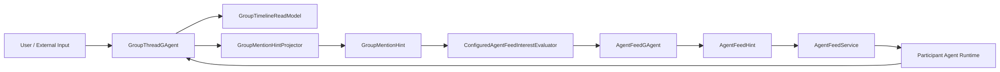

# Group Chat Agent Relay 最小实现版改造清单

## 1. 目标

本文档描述一个**最小实现版**改造方案，使当前 `GroupThreadGAgent -> hint -> feed -> service -> runtime -> append` 主链支持：

- 多个 agent 围绕同一个 `topic_id` 自主响应
- agent 回复后继续触发下一轮候选 agent
- 在不引入 `TopicGAgent` / `GroupGAgent` 新中心模型的前提下，先把多轮接力跑起来

本文档只描述改造方案，不表示当前代码已经实现。

## 2. 当前限制

当前实现不能形成多轮 agent 接力，关键原因是：

- [GroupMentionHintProjector.cs](/Users/liyingpei/Desktop/Code/aevatar/src/platform/Aevatar.GroupChat.Projection/Projectors/GroupMentionHintProjector.cs) 只处理 `UserMessagePostedEvent`
- agent 回复写回 [GroupThreadGAgent.cs](/Users/liyingpei/Desktop/Code/aevatar/src/platform/Aevatar.GroupChat.Core/GAgents/GroupThreadGAgent.cs) 后，不会再生成下一轮 `GroupMentionHint`
- 当前主链只能做到“用户触发一轮，多 agent 并行响应”，不能做到“agent 回复后继续接力”

## 3. 最小方案

最小方案不改主链，只补两个能力：

1. 让 `AgentMessageAppendedEvent` 也能生成下一轮 `GroupMentionHint`
2. 给 thread 补最小 relay 控制字段，防止无限循环

主链保持不变：

`thread event -> mention hint -> feed scoring -> feed accept -> agent service -> runtime -> append back to thread`

## 4. 改造后主图

改造后的关键变化只有一条：

- `GroupMentionHintProjector` 不再只处理用户消息，也处理 agent 回复消息

## 5. 需要改的文件

### 5.1 协议层

[group_thread.proto](/Users/liyingpei/Desktop/Code/aevatar/src/platform/Aevatar.GroupChat.Abstractions/Protos/group_thread.proto)

建议新增最小字段：

- `CreateGroupThreadCommand`
  - `bool enable_agent_relay`
  - `int32 max_agent_relay_depth`
- `GroupThreadState`
  - `bool enable_agent_relay`
  - `int32 max_agent_relay_depth`
- `GroupThreadMessageState`
  - `int32 relay_depth`
- `PostUserMessageCommand`
  - `int32 relay_depth`
- `AppendAgentMessageCommand`
  - `int32 relay_depth`
- `UserMessagePostedEvent`
  - `int32 relay_depth`
- `AgentMessageAppendedEvent`
  - `int32 relay_depth`
- `GroupMentionHint`
  - `int32 relay_depth`
- `GroupParticipantReplyCompletedEvent`
  - `int32 relay_depth`

最小语义：

- 用户消息默认 `relay_depth = 0`
- agent 回复时，`relay_depth = parent.relay_depth + 1`
- 当 `relay_depth >= max_agent_relay_depth` 时，不再继续 fan-out

### 5.2 Thread 权威状态

[GroupThreadGAgent.cs](/Users/liyingpei/Desktop/Code/aevatar/src/platform/Aevatar.GroupChat.Core/GAgents/GroupThreadGAgent.cs)

需要改动：

- 在 `CreateGroupThreadCommand` 落事件时保存：
  - `enable_agent_relay`
  - `max_agent_relay_depth`
- 在 `HandlePostUserMessageAsync` 中把用户消息的 `relay_depth` 设为 `0`
- 在 `HandleAppendAgentMessageAsync` 中：
  - 找到 `reply_to_message_id` 对应的 parent message
  - 计算 `relay_depth = parent.relay_depth + 1`
  - 把 `relay_depth` 写入 `AgentMessageAppendedEvent`
- 在状态迁移时把 `relay_depth` 写入 `GroupThreadMessageState`

### 5.3 下一轮 Hint 生成

[GroupMentionHintProjector.cs](/Users/liyingpei/Desktop/Code/aevatar/src/platform/Aevatar.GroupChat.Projection/Projectors/GroupMentionHintProjector.cs)

这是最关键的改造点。

当前：

- 只处理 `UserMessagePostedEvent`

改造后：

- 处理 `UserMessagePostedEvent`
- 也处理 `AgentMessageAppendedEvent`

最小候选规则建议：

- 对用户消息：
  - 保持现有逻辑
  - 优先使用 `direct_hint_agent_ids`
- 对 agent 消息：
  - 若 `enable_agent_relay == false`，直接返回
  - 若 `relay_depth >= max_agent_relay_depth`，直接返回
  - 候选 agent = 当前 thread 的 `participant_agent_ids`
  - 排除当前发送者自己
  - 如果消息显式带 `direct_hint_agent_ids`，优先只发给这些 agent
  - 如果没有显式 direct hint，则向其余 participant 发 hint，让 feed evaluator 再筛

需要在 `GroupMentionHint` 中补充：

- `relay_depth`
- `sender_kind = Agent`
- `sender_id = participant_agent_id`

### 5.4 Feed 路由

[GroupMentionHintFeedRoutingHandler.cs](/Users/liyingpei/Desktop/Code/aevatar/src/platform/Aevatar.GroupChat.Application/Workers/GroupMentionHintFeedRoutingHandler.cs)

最小改动：

- 透传新增的 `relay_depth`
- 增加一条防自触发规则：
  - `hint.sender_id == hint.participant_agent_id` 时直接忽略

### 5.5 Feed 打分

[ConfiguredAgentFeedInterestEvaluator.cs](/Users/liyingpei/Desktop/Code/aevatar/src/platform/Aevatar.GroupChat.Hosting/Feeds/ConfiguredAgentFeedInterestEvaluator.cs)

最小改动：

- 若 `hint.sender_kind == Agent` 且 `hint.sender_id == hint.participant_agent_id`，直接返回 `null`
- 其余打分逻辑保持不变

这一步不是主阻塞点，重点是让 agent 消息进入现有 feed 评分链。

### 5.6 同步回复路径

[AgentFeedReplyLoopHandler.cs](/Users/liyingpei/Desktop/Code/aevatar/src/platform/Aevatar.GroupChat.Application/Workers/AgentFeedReplyLoopHandler.cs)

需要改动：

- 从触发消息读取 `relay_depth`
- 生成 `AppendAgentMessageCommand` 时带上：
  - `relay_depth = triggerMessage.relay_depth + 1`
- 保持现有 `replyMessageId` 去重逻辑不变

### 5.7 异步回复路径

[GroupParticipantReplyCompletedService.cs](/Users/liyingpei/Desktop/Code/aevatar/src/platform/Aevatar.GroupChat.Application/Workers/GroupParticipantReplyCompletedService.cs)

需要改动：

- `GroupParticipantReplyCompletedEvent` 增加 `relay_depth`
- 回写 `AppendAgentMessageCommand` 时透传 `relay_depth`

这样 sync path 和 async path 才会保持一致。

### 5.8 读侧模型与查询

[GroupTimelineCurrentStateProjector.cs](/Users/liyingpei/Desktop/Code/aevatar/src/platform/Aevatar.GroupChat.Projection/Projectors/GroupTimelineCurrentStateProjector.cs)  
[GroupTimelineQueryPort.cs](/Users/liyingpei/Desktop/Code/aevatar/src/platform/Aevatar.GroupChat.Projection/Queries/GroupTimelineQueryPort.cs)

对应的 snapshot / readmodel DTO 也要同步补：

- message 的 `relay_depth`
- thread 的 `enable_agent_relay`
- thread 的 `max_agent_relay_depth`

## 6. 最小防环规则

最小实现至少要有下面三条：

1. 不给消息发送者自己发下一轮 hint
2. thread 级别开启开关：`enable_agent_relay`
3. thread 级别最大深度：`max_agent_relay_depth`

这一版先不做复杂策略：

- 不做全局 `top_n_agents_per_signal`
- 不做 topic-level governance
- 不做单独 `GroupGAgent`
- 不做 actor-owned subscription model 重构

## 7. 建议测试

最少补这些测试：

- [GroupMentionHintProjectorTests.cs](/Users/liyingpei/Desktop/Code/aevatar/test/Aevatar.GroupChat.Tests/Projection/GroupMentionHintProjectorTests.cs)
  - `AgentMessageAppendedEvent` 可以产出下一轮 hint
  - 不会给发送者自己发 hint
  - 超过 `max_agent_relay_depth` 后停止 fan-out
- [GroupThreadGAgentTests.cs](/Users/liyingpei/Desktop/Code/aevatar/test/Aevatar.GroupChat.Tests/Core/GroupThreadGAgentTests.cs)
  - `relay_depth` 正确写入 state
  - reply 消息从 parent 正确推导下一层深度
- [AgentFeedReplyLoopHandlerTests.cs](/Users/liyingpei/Desktop/Code/aevatar/test/Aevatar.GroupChat.Tests/Application/AgentFeedReplyLoopHandlerTests.cs)
  - sync path 能透传 `relay_depth`
- [GroupParticipantReplyCompletedServiceTests.cs](/Users/liyingpei/Desktop/Code/aevatar/test/Aevatar.GroupChat.Tests/Application/GroupParticipantReplyCompletedServiceTests.cs)
  - async path 能透传 `relay_depth`
- [GroupMentionHintReplyLoopIntegrationTests.cs](/Users/liyingpei/Desktop/Code/aevatar/test/Aevatar.GroupChat.Tests/Application/GroupMentionHintReplyLoopIntegrationTests.cs)
  - A 回复后能继续触发 B
  - B 回复后能继续触发 C
  - 到达深度上限后停止

## 8. 建议实施顺序

建议按这个顺序做，改动面最小：

1. `proto`
2. `GroupThreadGAgent`
3. `GroupMentionHintProjector`
4. `AgentFeedReplyLoopHandler`
5. `GroupParticipantReplyCompletedService`
6. `GroupTimeline` readmodel/query
7. tests

## 9. 结论

当前代码要支持“多 agent 围绕 topic 自主多轮接力聊天”，最小改法不是先引入新的中心 actor，而是：

- 在 thread 模型里补最小 relay 语义
- 让 agent 回复也能进入现有 hint -> feed -> service -> runtime 链

也就是说，最小实现版的核心是：

`UserMessagePostedEvent / AgentMessageAppendedEvent -> GroupMentionHint -> AgentFeed -> Agent Runtime -> AppendAgentMessageCommand`

只要这条链被打通，再加上最小防环规则，就能先把 agent-to-agent relay 跑起来。
