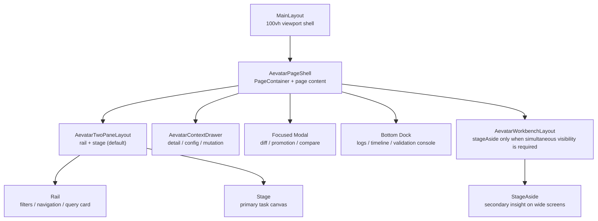

# Aevatar Console Design System（TS 版，2026-03-31）

## 1. 文档目标

- 将 `aevatarWorkbench` 设计契约、`MainLayout` 视口架构与页面壳层抽象沉淀为团队统一规范。
- 保证未来新增任何 Console 页面时，前端可以在 10 分钟内复用现有底座，产出风格、节奏、状态语义 100% 一致的新页面。
- 明确什么页面该用 `Drawer`、什么页面该用 `Modal`、什么页面只能留在主工作区，防止重新长回“后端字段直译页”。

## 2. 代码级事实源

以下文件是当前 Console UI 设计系统的权威事实源：

- 主题、Token、状态语义、公共样式函数：
  - `apps/aevatar-console-web/src/shared/ui/aevatarWorkbench.ts`
- 页面壳层、工作区布局、抽屉与状态标签组件：
  - `apps/aevatar-console-web/src/shared/ui/aevatarPageShells.tsx`
- 全局 100vh 视口底座：
  - `apps/aevatar-console-web/src/layouts/MainLayout.tsx`
- 运行时注入位置：
  - `apps/aevatar-console-web/src/app.tsx`
- ProLayout 默认设置：
  - `apps/aevatar-console-web/config/defaultSettings.ts`

结论只有一个：

- 设计系统不是设计稿，而是已经固化进 TS 代码的运行时契约。

## 3. 核心设计哲学

### 3.1 Viewport First

- 所有受保护页面默认继承 `MainLayout`。
- 页面高度基于 `100vh - headerHeight` 计算，页面内部区域各自滚动。
- 禁止再出现“页面整体向下无限增长，主操作区被明细面板挤压”的旧布局。

### 3.2 Stage First

- 页面主工作区永远优先于详情面板。
- 用户的第一视觉区必须回答“我现在在操作什么”。
- 任何字段明细、配置细节、历史上下文，都应该后置到 `Drawer`、`Modal` 或底部 `Dock`。

### 3.3 Progressive Disclosure

- 平时只展示决策所需信息。
- 点击、告警、审批、比较等关键时刻，再唤起上下文浮层。
- 不允许为了“信息完整”而在首屏堆满后端字段。

### 3.4 Semantic Color Consistency

- `run / observation / governance / evolution / asset` 使用同一套语义色映射。
- 用户不应该在不同模块里重新学习“蓝色、黄色、红色分别代表什么”。

## 4. 架构总览



## 5. Token 契约

`aevatarWorkbench.ts` 已经定义了当前统一 Token：

- `headerHeight = 56`
- `contentPadding = 20`
- `sectionGap = 16`
- `borderRadius = 4`
- `compactRadius = 2`
- `inspectorWidth = 720`

视觉基调：

- 主色：工业冷色蓝 `#2563eb`
- 成功色：冷静绿 `#2f8f6a`
- 警告色：琥珀黄 `#d68b28`
- 错误色：治理红 `#c2414b`
- 背景：`colorBgLayout -> colorBgContainer` 的冷灰蓝渐变

实现约束：

- 卡片边角统一使用 `4px`，微型元素 `2px`
- 所有面板边框统一使用 `colorBorderSecondary`
- 面板阴影只允许使用 `boxShadowSecondary`
- 禁止模块自己发明新的主色和状态色

## 6. 页面结构语法

### 6.1 全局壳层

所有受保护页面默认由 `src/app.tsx` 包裹进：

- `ConfigProvider(theme = aevatarThemeConfig)`
- `ProConfigProvider`
- `MainLayout`

这意味着业务页面无需重复声明页面级主题，只需要组合页面壳层组件。

### 6.2 标准页面骨架

推荐顺序如下：

1. `AevatarPageShell`
2. `AevatarTwoPaneLayout`
3. `AevatarPanel`
4. `AevatarContextDrawer`
5. 可选的 `Modal / Console Dock`

只有当“主舞台内容”和“次级洞察”必须同时常驻可见时，才升级为 `AevatarWorkbenchLayout + stageAside`。

标准骨架示例：

```tsx
import React from "react";
import { Button, Space } from "antd";
import {
  AevatarContextDrawer,
  AevatarPageShell,
  AevatarPanel,
  AevatarStatusTag,
  AevatarTwoPaneLayout,
} from "@/shared/ui/aevatarPageShells";

const ExamplePage: React.FC = () => {
  const [drawerOpen, setDrawerOpen] = React.useState(false);

  return (
    <AevatarPageShell
      title="Example Capability"
      content="One focused stage, one contextual drawer, one consistent operator rhythm."
      extra={
        <Space>
          <AevatarStatusTag domain="governance" status="active" />
          <Button type="primary">Primary Action</Button>
        </Space>
      }
    >
      <AevatarTwoPaneLayout
        rail={
          <AevatarPanel title="Navigator">
            Filters, query cards, or task shortcuts live here.
          </AevatarPanel>
        }
        stage={
          <AevatarPanel title="Main Stage" minHeight={520}>
            The core user task must stay here.
          </AevatarPanel>
        }
      />

      <AevatarContextDrawer
        open={drawerOpen}
        onClose={() => setDrawerOpen(false)}
        title="Inspector"
        subtitle="Context enters on demand."
      >
        Drawer detail goes here.
      </AevatarContextDrawer>
    </AevatarPageShell>
  );
};
```

## 7. 页面类型模板

未来新增任何后端能力页面时，默认都应从“两段工作区 + Drawer/Modal”起步。只有确实存在“必须与主舞台同时可见”的次级洞察时，才升级为 `AevatarWorkbenchLayout + stageAside`。

### 7.1 Card Flow Workspace

适用场景：

- `Services`
- `Actors`
- `Primitives`
- `Assets`
- 任何“目录 + 详情”的能力页

结构：

- 左侧 `rail` 放筛选、查询、范围切换
- 中间 `stage` 放 `ProList` 或高信息密度卡片流
- 详情全部收进右侧 `Drawer`

强制要求：

- 禁止再创建独立 detail route
- 选中项通过 query string 或本地 state 驱动 Drawer

### 7.2 Dashboard Board

适用场景：

- `Overview`
- `Scopes Overview`
- 任何“先判断状态再决定去哪”的总览页

结构：

- 使用 `ProCard` 的 `ghost` 模式与页面底色融合
- 首屏展示状态板、入口路径、关键风险与快捷动作
- 详情通过 Drawer 或次级卡片下钻

### 7.3 Lab Workspace

适用场景：

- `Invoke`
- `Workflow playground`
- 任何“参数配置 -> 执行 -> 结果洞察”的实验页

结构：

- 左侧参数配置
- 中间执行预览与主结果
- 结果洞察默认进入 Drawer；只有必须并排观测时才启用 `stageAside`
- 复杂协议、端点说明走 Drawer

### 7.4 Mission Control

适用场景：

- `Mission Control`
- 复杂拓扑、执行流、干预面板场景

结构：

- 中间聚焦画布永远优先
- 右侧不是固定栏，而是情境化 Drawer
- 底部 `Dock` 承载 timeline、live logs、validation console

### 7.5 Authoring Workspace

适用场景：

- `Studio`
- 任何编辑器型页面

结构：

- 左侧导航树
- 中间编辑器
- 底部可折叠控制台
- Promotion / Diff / Compare 统一走全屏或大尺寸 Modal

### 7.6 Governance Workbench

适用场景：

- `Governance`
- `Deployments`
- 任何治理、策略、审计、灰度控制场景

结构：

- 主工作区展示状态面与变化面
- 高风险动作全部进入 Extra-Wide Drawer
- 审计视图优先使用时间轴，不要回退成原始日志表

## 8. 交互控件选型规则

### 8.1 什么时候用 Drawer

用 `Drawer` 的场景：

- 查看单个对象详情
- 修改策略、权重、暴露配置
- 查看节点快照、工具调用、影响范围
- 做中低风险的上下文内动作

不要用 `Drawer` 的场景：

- 需要跨对象对比
- 需要大面积代码 diff
- 需要用户做高风险确认

### 8.2 什么时候用 Modal

用 `Modal` 的场景：

- Promotion 前 diff 对比
- 双 revision 比较
- 影响范围评审
- 删除、回滚、批量治理等高风险动作确认

要求：

- Modal 必须是聚焦态，不承担常驻详情职责

### 8.3 什么时候用 Bottom Dock

用 `Dock` 的场景：

- live logs
- timeline
- validation progress
- build console

要求：

- Dock 只承载连续流数据
- Dock 可折叠、可拉伸
- Dock 不能替代主工作区

## 9. 状态语义契约

所有状态标签必须通过 `resolveAevatarSemanticTone()` 推导，不允许页面本地手搓颜色判断。

### 9.1 Asset

- `active / published -> success`
- `draft -> warning`

### 9.2 Observation

- `streaming / live -> info`
- `snapshot_available -> warning`
- `projection_settled -> success`
- `delayed / disconnected -> error`

### 9.3 Evolution

- `pending / proposed / build_requested -> info`
- `validated / promoted -> success`
- `validation_failed / rejected / promotion_failed -> error`
- `rollback_requested / rolled_back -> warning`

### 9.4 Governance

- `active / published / public / ready / validated / promoted -> success`
- `failed / missing / blocked / rejected -> error`
- `retired / disabled / internal / canary / pending / proposed -> warning`

### 9.5 Run

- `running / active / live / streaming -> info`
- `waiting / waiting_signal / waiting_approval / human_input / suspended -> warning`
- `completed / published -> success`
- `failed / stopped / disconnected -> error`

推荐做法：

- 页面组件统一使用 `AevatarStatusTag`
- 不再直接使用裸 `Tag` 承担状态表达

## 10. 新页面 10 分钟落地流程

### 10.1 第一步：选模板

从第 7 节先选页面类型，而不是先画布局。

### 10.2 第二步：建立壳层

页面第一版只做三件事：

- 放进 `AevatarPageShell`
- 用 `AevatarTwoPaneLayout` 切出 `rail` 和 `stage`
- 加一个空的 `AevatarContextDrawer`

只要这三步完成，页面节奏就已经不会跑偏。

### 10.3 第三步：映射状态

先做领域状态到 `asset / run / observation / governance / evolution` 的映射，再做 UI。

错误做法：

- 先在页面里写一堆 `if (status === "...") color = ...`

正确做法：

- 把状态 label 和 tone 都交给 `aevatarWorkbench.ts`

### 10.4 第四步：把明细后移

凡是下面这些信息，默认都不要进首屏：

- 原始 type url
- actor identity 细节
- command id / correlation id
- protobuf payload 原文
- 非关键 headers

这些内容默认进入 Drawer、Debug 面板或复制区。

### 10.5 第五步：再决定是否需要 Modal 或 Dock

判断标准：

- 持续流数据，进入 `Dock`
- 比较与评审，进入 `Modal`
- 单对象详情与配置，进入 `Drawer`

## 11. 路由层规范

- 禁止新增“列表页 + 独立 detail 页面”的双路由结构
- 默认采用“单一路由 + query 驱动选中态 + Drawer”
- 只有当页面本身就是完整工作区时，才允许独立顶级路由

当前推荐模式：

- `/services?serviceId=...`
- `/governance?view=policies&policyId=...`
- `/scopes/invoke?serviceId=...&endpointId=...`

不推荐模式：

- `/services/:serviceId`
- `/assets/:assetId/detail`
- `/policies/:policyId/edit`

## 12. 反模式清单

以下模式在 Aevatar Console 中应视为禁止：

- 旧式“三栏平铺”，导致三块内容同时竞争首屏注意力
- 新页面默认先挂常驻 `stageAside`，把本应后置的上下文摊回首屏
- 首屏大表格直接铺满，没有用户任务主语
- 用独立 detail route 承载对象详情
- 页面整体滚动，没有 100vh 视口边界
- 页面自己发明状态颜色
- 页面把开发者字段放到第一视觉区
- 右侧常驻固定栏，挤压主工作区
- 为了“全量展示”而丢失决策节奏

## 13. 页面完成定义（Definition of Done）

一个新页面只有同时满足以下条件，才算符合设计系统：

1. 继承 `MainLayout` 的 100vh 视口语义
2. 默认采用 `AevatarPageShell + AevatarTwoPaneLayout`；只有有明确同时可见诉求时才升级到 `AevatarWorkbenchLayout`
3. 主工作区明确回答“用户当前在做什么”
4. 详情、配置、治理动作进入 Drawer 或 Modal
5. 所有状态标签使用统一语义色
6. 页面在 `lg / xxl` 下都保持工作区完整性
7. 不暴露无决策价值的后端字段到首屏
8. 路由不新增旧式 detail 页面

## 14. 当前模板映射

当前 Console 已经形成如下模板样本：

- `Overview`：状态看板
  - `apps/aevatar-console-web/src/pages/overview/index.tsx`
- `Assets`：卡片流工作区
  - `apps/aevatar-console-web/src/pages/scopes/assets.tsx`
- `Invoke`：实验室工作区
  - `apps/aevatar-console-web/src/pages/scopes/invoke.tsx`
- `Mission Control`：主舞台 + 抽屉 + Dock
  - `apps/aevatar-console-web/src/pages/MissionControl/index.tsx`
- `Studio`：编辑器工作区
  - `apps/aevatar-console-web/src/pages/studio/index.tsx`
- `Deployments`：治理型两段工作区
  - `apps/aevatar-console-web/src/pages/Deployments/index.tsx`
- `Governance`：治理时间轴工作台
  - `apps/aevatar-console-web/src/pages/governance/index.tsx`
- `Services / Actors / Primitives / Workflows`：平台能力卡片流
  - `apps/aevatar-console-web/src/pages/services/index.tsx`
  - `apps/aevatar-console-web/src/pages/actors/index.tsx`
  - `apps/aevatar-console-web/src/pages/primitives/index.tsx`
  - `apps/aevatar-console-web/src/pages/workflows/index.tsx`

## 15. 最终结论

`aevatarWorkbench` 的意义，不是提供一组“漂亮组件”，而是把 Console 的产品心智固定成一条稳定主线：

- 用户永远先进入一个清晰的工作区
- 用户只在需要时才被上下文包围
- 状态语义跨模块完全一致
- 每个新页面都不再从零设计，而是从已验证的工作台模板开始

未来新增任何能力页时，团队不应该再问“这个页面怎么排版”，而应该先问：

- 这是卡片流、看板、实验室、治理台，还是 Mission Control？

只要这个问题答对，页面就会天然落在同一套设计系统里。
