# Aevatar Mainnet 架构说明

本文档描述 Aevatar Mainnet 在 `AI Native App + Aevatar SDK + Mainnet + Chrono Platform` 体系中的架构定位，涵盖核心概念、分层设计、工作流编排、连接器体系、投影管线、运行时模式，以及基于 Docker / Kubernetes / Aspire DCP 的运维最佳实践。Mainnet 负责 Agent 承载与 workflow 编排，Chrono Platform 负责承载并编排 storage、notification、search 等能力微服务；AI Native App 开发者通过 Aevatar SDK 连接 Mainnet，注入 `workflow_yaml` 与 `agent_profile`（role agent + connector 配置），从而构建 multi-agent workflow。本文在原有设计基础上增加性能瓶颈评审与重构方案，目标是在不破坏既有分层与语义约束的前提下提升吞吐、降低尾延迟并增强多租户稳定性。

目标读者：平台开发者、DevOps 工程师、AI Native App 构建者。

---

## 1. 全局视图

Aevatar Mainnet 是一个运行在云端的 **Agent Host + Workflow 编排网络**。AI Native Apps 基于 Mainnet 构建，每个 App 的终端用户可以通过 App 从 Mainnet 中实例化一组 AI Agents 为自己服务。  
AI Native App 开发者通过 **Aevatar SDK** 接入 Mainnet，在调用时注入 `workflow_yaml`、输入以及 `agent_profile`（role agent + connector 配置），从而快速实现自己的 multi-agent workflow。Mainnet 执行过程中会向 App 回抛 AGUI 事件流（SSE / WebSocket），用于实时展示多 Agent 协作进度和结果。

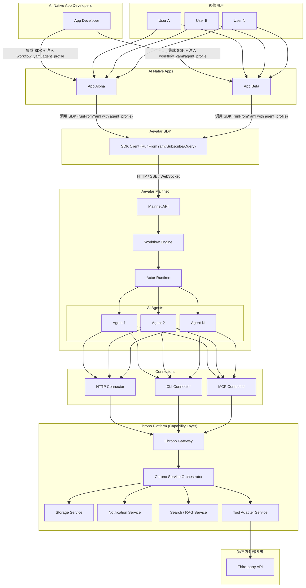

核心角色：

| 角色 | 说明 |
|---|---|
| AI Native App 开发者 | 通过 Aevatar SDK 接入 Mainnet，注入 workflow YAML 与 agent profile（role+connector），构建 multi-agent workflow |
| 终端用户 | 通过 AI Native App 与 Mainnet 交互，每个用户可拥有独立的 Agent 实例 |
| AI Native App | 基于 Aevatar SDK/Mainnet API 构建的应用，定义工作流模板、角色和连接器配置 |
| Aevatar SDK | App 侧接入层，封装 runFromYaml、agent profile 注入、事件订阅、状态查询与能力目录 |
| Aevatar Mainnet | Agent Host 与 workflow 编排层，负责 Agent 生命周期管理、事件投影与推送 |
| Chrono Platform | 能力微服务平台，承载并编排 storage、notification、search、tool adapter 等能力 |
| Connector | Agent 能力桥接通道，通过 HTTP / CLI / MCP 协议把 Mainnet 工作流连接到 Chrono 能力 |
| 第三方外部系统 | 由 Chrono Platform 或 Connector 间接访问的外部 API / SaaS / 企业系统 |

---

## 2. 核心概念

Aevatar 的编程模型建立在四个基础抽象之上，定义在 `src/Aevatar.Foundation.Abstractions` 与 `src/Aevatar.Foundation.Core`。

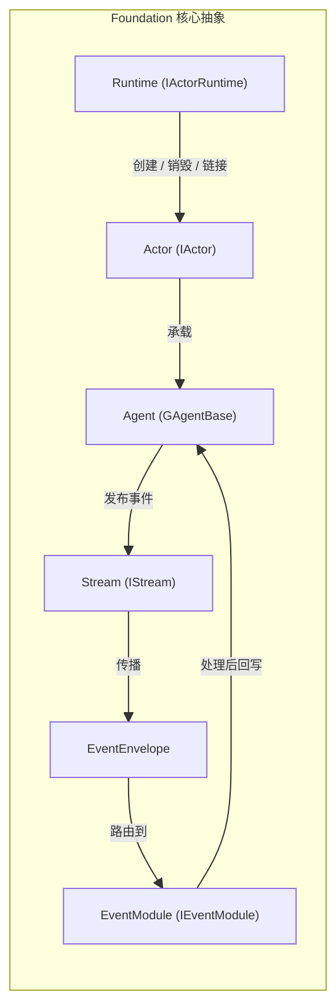

| 概念 | 接口 | 说明 |
|---|---|---|
| Agent | `IAgent` / `IAgent<TState>` | 业务逻辑单元，处理事件、维护状态 |
| Actor | `IActor` | Agent 的运行容器，提供串行处理保证与父子层级关系 |
| Runtime | `IActorRuntime` | Actor 生命周期与拓扑管理器（创建、销毁、链接、解链） |
| Stream | `IStream` / `IStreamProvider` | 事件传播通道，支持方向路由（Self / Down / Up / Both） |
| EventEnvelope | `EventEnvelope` (Proto) | 统一传输契约，包含 payload、publisher、direction、correlation 等元数据 |
| EventModule | `IEventModule` | 可插拔事件处理器，`CanHandle` 过滤 + `HandleAsync` 执行，按 `Priority` 排序 |

主链路：所有业务事件先包入 `EventEnvelope.payload` → 按 `EventDirection` 路由到目标 Stream → `GAgentBase` 把静态 `[EventHandler]` 与动态 `IEventModule` 合并后按优先级执行。

---

## 3. 分层架构

系统遵循严格的 `Abstractions / Domain / Application / Infrastructure / Host` 分层，上层依赖抽象，禁止跨层反向依赖。

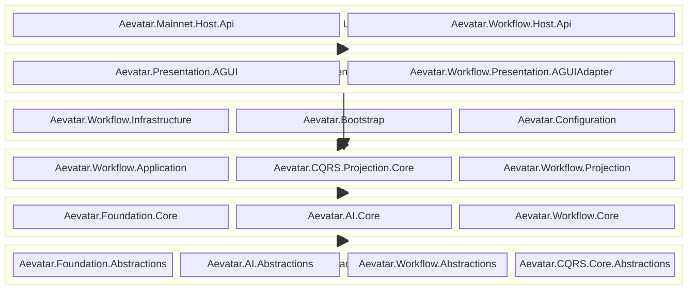

各层职责：

| 层 | 职责 | 关键项目 |
|---|---|---|
| Host | API 组合与宿主，不承载核心业务逻辑 | `Aevatar.Mainnet.Host.Api`、`Aevatar.Workflow.Host.Api` |
| Presentation | 协议适配（AGUI / SSE / WebSocket） | `Aevatar.Presentation.AGUI`、`Aevatar.Workflow.Presentation.AGUIAdapter` |
| Infrastructure | 持久化、文件 I/O、连接器引导 | `Aevatar.Workflow.Infrastructure`、`Aevatar.Bootstrap`、`Aevatar.Configuration` |
| Application | 编排、查询门面、工作流注册表、投影协调 | `Aevatar.Workflow.Application`、`Aevatar.Workflow.Projection` |
| Domain / Core | GAgent、RoleGAgent、WorkflowGAgent、模块系统 | `Aevatar.Foundation.Core`、`Aevatar.AI.Core`、`Aevatar.Workflow.Core` |
| Abstractions | 接口、Proto 契约、基础类型 | `Aevatar.Foundation.Abstractions`、`Aevatar.AI.Abstractions`、`Aevatar.Workflow.Abstractions` |

运行时实现按部署模式可替换：

| 运行时项目 | 说明 |
|---|---|
| `Aevatar.Foundation.Runtime` | 本地单进程运行时（InMemory Actor / Stream / Store） |
| `Aevatar.Foundation.Runtime.Implementations.Orleans` | Orleans 分布式 Actor 运行时 |
| `Aevatar.Foundation.Runtime.Implementations.Orleans.Streaming` | Orleans 流适配 + Stream Forward 拓扑 |
| `Aevatar.Foundation.Runtime.Transport.Implementations.MassTransitKafka` | Kafka 传输层（via MassTransit） |

---

## 4. Agent 实例化与生命周期

用户通过 AI Native App + SDK 向 Mainnet 发起 Run 请求时（推荐 `inline-yaml-per-run`，也兼容按 `workflow_name` 引用），系统按如下流程实例化并运行 Agent 集群。

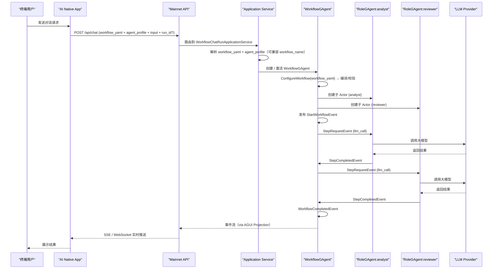

Actor 层级关系：每个 Workflow 运行时形成一棵 Actor 树，`WorkflowGAgent` 作为根节点，每个 `RoleGAgent` 作为子节点。在 Orleans 模式下，Actor 自动分布到集群中的不同 Silo。

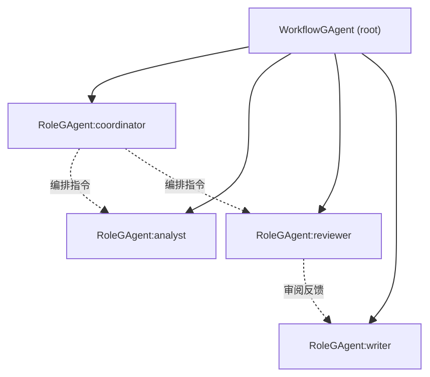

生命周期要点：

1. **创建**：Application Service 通过 `IActorRuntime.CreateAsync` 创建 `WorkflowGAgent`（可结合 `run_id` / `workflow_hash` 做复用策略）
2. **配置**：优先使用请求内 `workflow_yaml` 调用 `WorkflowGAgent.ConfigureWorkflow(yaml)`；兼容按 `workflow_name` 从注册表加载 YAML
3. **Profile 注入**：Mainnet 解析请求内 `agent_profile`（role agent + connector 配置），并与平台默认配置合并后做策略校验，生成 run 级执行上下文
4. **执行**：事件驱动的步骤循环（`WorkflowLoopModule`），每个步骤由对应的 `IEventModule` 处理
5. **完成**：发布 `WorkflowCompletedEvent`，清理运行态变量和超时计时器
6. **销毁**：通过 `IActorRuntime.DestroyAsync` 回收 Actor 及其子树

---

## 5. 工作流编排引擎

工作流引擎是 Aevatar Mainnet 的核心编排能力，代码位于 `src/workflow/`。

### 5.1 YAML 声明式工作流

AI Native App 的编排能力直接来自 SDK 对 Mainnet 的请求能力：将 `workflow_yaml`、`agent_profile` 与输入一起提交后，Mainnet 在运行时实例化并驱动 `WorkflowGAgent`。  
该模式在交互形态上类似“调用智能合约”：每次调用显式给出“执行逻辑（YAML）+ 输入参数”。

调用模式建议：

| 模式 | 说明 | 适用场景 |
|---|---|---|
| Inline YAML（推荐） | 请求内携带 `workflow_yaml` + `agent_profile` + `input`，Mainnet 直接编译并执行 | AI Native App 需要快速迭代流程、并按环境定义 role 与 Chrono 连接策略 |
| Registry 引用（兼容） | 请求内携带 `workflow_name`，Mainnet 从注册表加载 YAML | 预发布流程、受控版本流程、合规审批流程 |

工作流通过 YAML DSL 定义，包含角色声明和步骤编排：

```yaml
name: analysis_workflow
description: "多角色协作分析工作流"
roles:
  - id: analyst
    name: Analyst
    system_prompt: "你是一名数据分析师"
    provider: deepseek
    model: deepseek-chat
    connectors: [data_api]
  - id: reviewer
    name: Reviewer
    system_prompt: "你是一名审阅专家"
    provider: deepseek
    model: deepseek-chat
steps:
  - id: analyze
    type: llm_call
    target_role: analyst
    parameters:
      prompt: "分析以下数据: {{input}}"
    next: review
  - id: review
    type: llm_call
    target_role: reviewer
    parameters:
      prompt: "审阅分析结果: {{analyze.output}}"
    next: store_result
  - id: store_result
    type: connector_call
    target_role: analyst
    parameters:
      connector: data_api
      operation: /v1/results
      timeout_ms: "10000"
```

### 5.2 事件驱动执行模型

整个执行链路由事件驱动，无直接方法调用：

```mermaid
%%{init: {"maxTextSize": 100000, "flowchart": {"useMaxWidth": false, "nodeSpacing": 10, "rankSpacing": 50}, "themeVariables": {"fontSize": "10px"}}}%%
flowchart LR
    CR["ChatRequestEvent"] --> SW["StartWorkflowEvent"]
    SW --> SR1["StepRequestEvent (step 1)"]
    SR1 --> SC1["StepCompletedEvent (step 1)"]
    SC1 --> SR2["StepRequestEvent (step 2)"]
    SR2 --> SC2["StepCompletedEvent (step 2)"]
    SC2 --> SRN["StepRequestEvent (step N)"]
    SRN --> SCN["StepCompletedEvent (step N)"]
    SCN --> WC["WorkflowCompletedEvent"]
```

`WorkflowLoopModule` 负责主循环：接收 `StartWorkflowEvent` 后派发第一个步骤，每个 `StepCompletedEvent` 到达后评估下一步（`Next` / `Branches`），直到没有后续步骤时发布 `WorkflowCompletedEvent`。

### 5.3 模块系统

步骤执行由可插拔的 `IEventModule` 实现，通过 `IWorkflowModulePack` 注册：

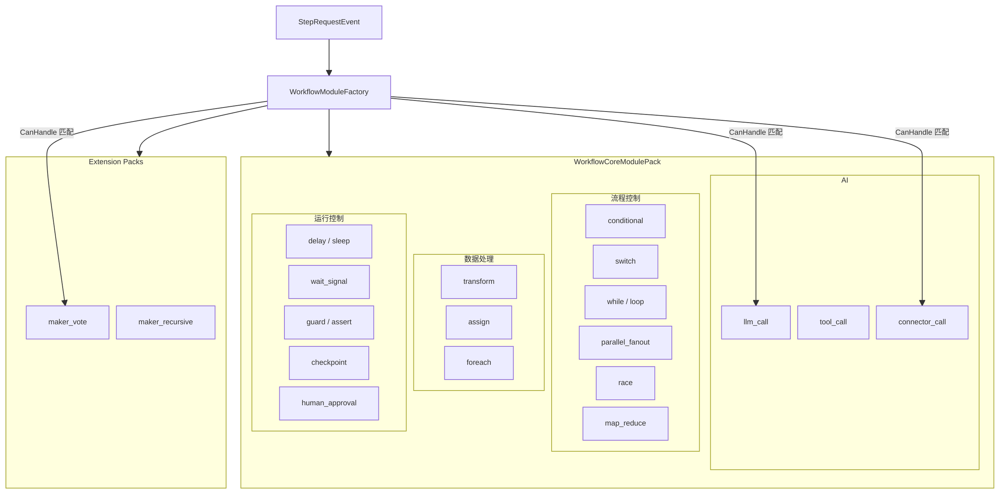

扩展模块通过实现 `IWorkflowModulePack` 注册，与内建模块遵循相同的抽象模型与生命周期协议：

```csharp
public sealed class MakerModulePack : IWorkflowModulePack
{
    public IReadOnlyList<WorkflowModuleRegistration> Modules =>
    [
        WorkflowModuleRegistration.Create<MakerVoteModule>("maker_vote"),
        WorkflowModuleRegistration.Create<MakerRecursiveModule>("maker_recursive"),
    ];
}
```

---

## 6. Connector 体系（Chrono 能力桥接）

Connector 是 Agent 连接能力层的统一通道。默认路径是由 Connector 访问 Chrono Platform，再由 Chrono 编排底层微服务完成数据存储、消息推送、工具调用等操作；该机制在系统职责上类似区块链中的 Oracle 适配层。  
在 SDK 模式下，AI Native App 开发者可在请求内提交 `agent_profile`（role + connector），让 Mainnet 按 profile 生成 RoleGAgent 配置并将 connector 解析到指定 Chrono service instance（通过策略校验后生效）。

### 6.1 统一抽象

三种 Connector 共享同一接口：

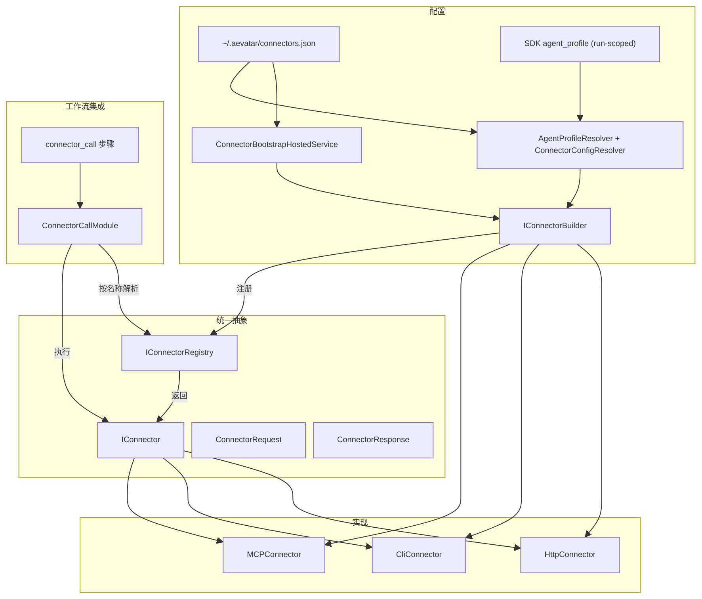

### 6.2 三种 Connector 对比

| 特性 | HTTP Connector | CLI Connector | MCP Connector |
|---|---|---|---|
| 用途 | 调用外部 HTTP API | 执行本地预装命令 | 连接 MCP Server 执行工具 |
| 配置关键字段 | `baseUrl`, `defaultHeaders` | `command`, `fixedArguments` | `serverName`, `command`, `arguments` |
| Operation 语义 | URL 路径 | CLI 附加参数 | 工具名称 |
| 安全机制 | `allowedMethods`, `allowedPaths`, `allowedInputKeys` | `allowedOperations`, `allowedInputKeys` | `allowedTools`, `allowedInputKeys` |
| 元数据 | `status_code`, `url`, `duration_ms` | `exit_code`, `command`, `duration_ms` | `server`, `tool`, `duration_ms` |

### 6.3 Agent 通过 Chrono Platform 的交互模式

Agent 通过 Connector 调用 Chrono 能力服务的典型场景：

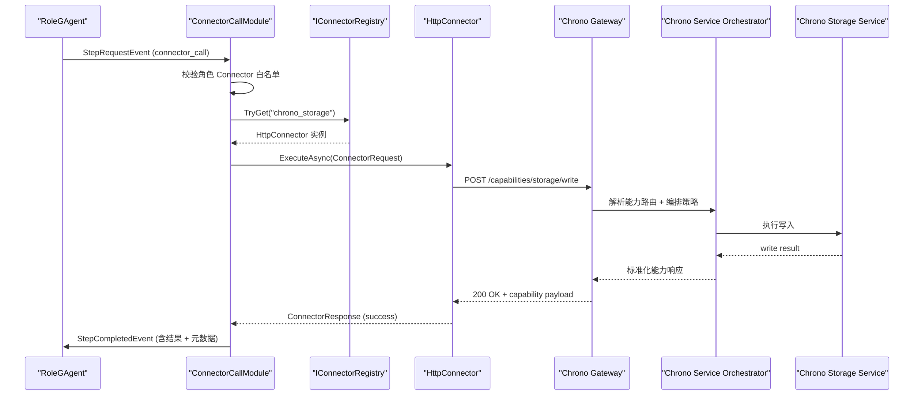

内建的弹性策略：`retry`（0-5次）、`timeout_ms`（100ms-300s）、`on_missing`（connector 不存在时 fail / skip）、`on_error`（失败时 fail / continue）。

### 6.4 Chrono Platform 定位（类 Oracle 机制）

Chrono Platform 是 Mainnet 的外部能力承载层：Mainnet 保持 workflow 编排与事件语义主链路，Chrono 负责将异构微服务能力以统一契约提供给 Agent。

| 维度 | Chrono Platform 职责 | 对 Mainnet 的价值 |
|---|---|---|
| 能力承载 | 承载 storage、notification、search、tool adapter 等微服务 | Mainnet 无需内置大量可变能力，保持内核精简 |
| 能力编排 | 将多个底层服务组合成稳定能力端点（含回退/补偿） | Agent 以单次 connector 调用获取复合能力 |
| 协议与安全 | 统一鉴权、限流、审计、mTLS 与出口治理 | 降低每个 Agent/Workflow 的接入复杂度 |
| 响应标准化 | 统一结果结构、错误码与可观测元数据 | 便于工作流步骤做重试、降级与投影追踪 |

“类 Oracle”的含义是：Chrono 负责把链外/站外能力可靠带回 Agent 执行上下文；但其信任模型仍是平台治理模型，不等同于去信任共识网络。

### 6.5 SDK 注入 Agent Profile（Role + Connector）

AI Native App 开发者可在 SDK 请求中提交 `agent_profile`。该 profile 同时描述：

- **Role Agent 配置**：角色 ID、system prompt、provider/model、角色可用 connector 列表。
- **Connector 配置**：connector 到 Chrono service instance 的映射（例如 `chrono-storage-dev`、`chrono-storage-prod`）。

配置合并优先级建议：

1. 请求内 `agent_profile`（run 级）  
2. App 级 profile 模板（可选）  
3. 平台默认 role/connector 配置

建议最小字段（`agent_profile`）：

| 字段 | 说明 |
|---|---|
| `roles[].id` | 角色标识（与 workflow steps 中 `target_role` 对应） |
| `roles[].system_prompt/provider/model` | 角色模型与行为配置 |
| `roles[].connectors` | 角色允许调用的 connector 名单 |
| `connectors[].name/type` | connector 基础标识（`http` / `cli` / `mcp`） |
| `connectors[].base_url` | Chrono service instance 地址（开发者可指定） |
| `connectors[].allowed_methods/allowed_paths` | 方法与路径白名单 |

治理要求：

- Mainnet 必须对请求内 `agent_profile` 执行策略校验（角色白名单、域名白名单、方法/路径白名单、租户隔离策略）。
- 运行期仅允许在当前 run 的 profile 上下文内生效，不回写全局平台配置。
- 角色 `connectors` 允许列表仍是最终授权边界，避免工作流绕过角色权限。

---

## 7. CQRS 与投影管线

系统遵循 CQRS 模式：`Command → Event`（写路径）、`Query → ReadModel`（读路径）。CQRS 读模型与 AGUI 实时推送共享同一套 Projection Pipeline，统一入口、一对多分发。

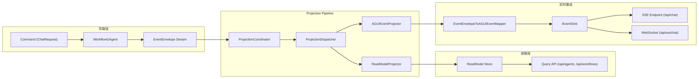

投影关键组件：

| 组件 | 职责 |
|---|---|
| `ProjectionCoordinator` | 接收 Actor 事件流，协调投影生命周期 |
| `ProjectionDispatcher` | 一对多分发，将事件分发到所有注册的 Projector |
| `WorkflowExecutionReadModelProjector` | 将事件归约为 `WorkflowExecutionReport` 读模型 |
| `WorkflowExecutionAGUIEventProjector` | 将事件转换为 AGUI 协议事件 |
| `EventEnvelopeToAGUIEventMapper` | 事件映射器链，域事件 → AGUI 事件 |
| `IEventSink<WorkflowRunEvent>` | 实时事件通道，对接 SSE / WebSocket 端点 |

读模型 Reducer 按事件类型精确路由（基于 `TypeUrl`）：
- Workflow 核心 Reducer：`StartWorkflowEventReducer`、`StepRequestEventReducer`、`StepCompletedEventReducer`、`WorkflowSuspendedEventReducer`、`WorkflowCompletedEventReducer`
- AI 扩展 Reducer（启用 `AddWorkflowAIProjectionExtensions()` 后）：`TextMessageStartProjectionReducer`、`TextMessageContentProjectionReducer`、`TextMessageEndProjectionReducer`、`ToolCallProjectionReducer`、`ToolResultProjectionReducer`

---

## 8. 运行时模式与基础设施

### 8.1 三种运行模式

系统通过配置切换运行模式，所有模式共享同一业务代码：

| 模式 | Actor Runtime | Stream 实现 | 状态持久化 | Forward 拓扑存储 | 适用场景 |
|---|---|---|---|---|---|
| InMemory | `LocalActorRuntime` | `InMemoryStream` | `InMemoryStateStore` | 进程内字典 | 开发 / 单元测试 |
| MassTransit | `LocalActorRuntime` | `MassTransitStream` | InMemory | 进程内字典 | 单节点 + 消息总线 |
| Orleans | Orleans Silo | Orleans + MassTransit + Kafka | Garnet (Redis) | `IStreamTopologyGrain` | 生产分布式部署 |

### 8.2 Orleans 分布式拓扑

生产模式下采用 Orleans 虚拟 Actor 模型 + Kafka 事件传输 + Garnet 持久化：

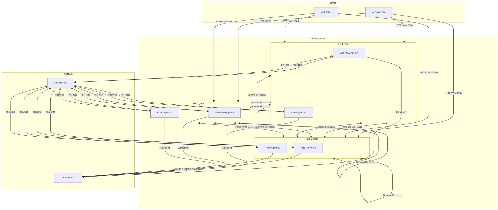

### 8.3 关键配置

Orleans 模式的核心配置项（通过环境变量或 `appsettings.Distributed.json`）：

| 配置项 | 说明 | Distributed 模板值 |
|---|---|---|
| `ActorRuntime:Provider` | 运行时提供者 | `Orleans` |
| `ActorRuntime:OrleansStreamBackend` | 流后端 | `MassTransitAdapter` |
| `ActorRuntime:OrleansPersistenceBackend` | 持久化后端 | `InMemory` / `Garnet` |
| `ActorRuntime:OrleansGarnetConnectionString` | Garnet 连接串 | `localhost:6379` |
| `ActorRuntime:MassTransitTransportBackend` | MassTransit 传输后端 | `Kafka` |
| `ActorRuntime:MassTransitKafkaBootstrapServers` | Kafka 地址 | `localhost:9092` |
| `ActorRuntime:MassTransitKafkaTopicName` | Kafka 主题 | `aevatar-mainnet-agent-events` |
| `ActorRuntime:MassTransitKafkaConsumerGroup` | Kafka 消费组（建议按环境隔离） | `aevatar-mainnet-cg` |
| `Orleans:ClusteringMode` | 集群模式 | `Localhost` / `Development` |
| `Orleans:ClusterId` | 集群 ID | `aevatar-mainnet-cluster` |
| `Orleans:ServiceId` | 服务 ID（与 ClusterId 组合隔离） | `aevatar-mainnet-service` |
| `Orleans:SiloPort` | Silo 通信端口 | `11111` |
| `Orleans:GatewayPort` | 网关端口 | `30000` |
| `Orleans:QueueCount` | 流队列并行度（影响消费吞吐） | `8` |
| `Orleans:QueueCacheSize` | 队列缓存大小（影响突发吸收） | `4096` |

说明：上表给的是 Mainnet `Distributed` 模式模板值。`AevatarActorRuntimeOptions` 的全局默认值仍偏向本地开发（例如 `Provider=InMemory`、`OrleansStreamBackend=InMemory`）。

装配顺序（`Program.cs`）：

1. `AddAevatarDefaultHost(...)` — Bootstrap + Runtime Provider 选择
2. `AddMainnetDistributedOrleansHost()` — 按配置启用 Orleans Silo
3. `AddWorkflowCapabilityWithAIDefaults()` — 注册工作流能力
4. `AddWorkflowMakerExtensions()` — 注册 Maker 扩展

---

## 9. 运维最佳实践

### 9.1 Docker Compose（开发与测试）

仓库已提供完整的 Docker Compose 配置：

**基础设施启动**（`docker-compose.yml`）：

```bash
docker compose up -d kafka garnet
```

提供 Kafka（KRaft 模式，无 Zookeeper）+ Garnet + Kafka UI。

**3 节点集群**（`docker-compose.mainnet-cluster.yml`）：

```bash
bash tools/cluster/start-mainnet-cluster.sh
```

启动 3 个 Mainnet 节点（端口 19081 / 19082 / 19083），共享 Kafka 和 Garnet，Orleans 以 Development 模式集群。

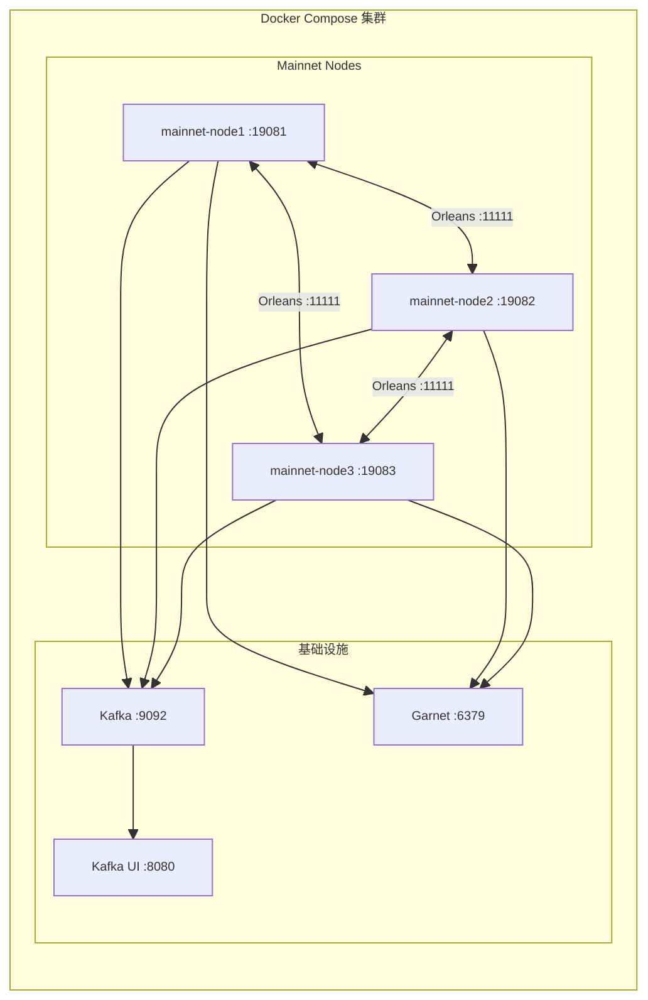

验证命令：

```bash
bash tools/ci/orleans_garnet_persistence_smoke.sh    # Orleans + Garnet 持久化烟测
bash tools/ci/distributed_3node_smoke.sh             # 3 节点一致性集成测试
```

### 9.2 Kubernetes 生产架构（推荐）

对于生产部署，建议采用 Kubernetes 编排，充分利用 Orleans 的弹性伸缩能力。

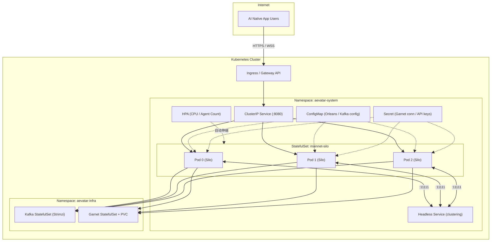

**关键设计决策：**

**1) StatefulSet 部署 Orleans Silo**

每个 Pod 对应一个 Silo，使用 Headless Service 实现 Silo 间发现。StatefulSet 保证稳定的网络标识，有利于 Orleans 集群成员管理。

```yaml
# 关键 K8s 资源示意
apiVersion: apps/v1
kind: StatefulSet
metadata:
  name: mainnet-silo
  namespace: aevatar-system
spec:
  serviceName: mainnet-silo-headless
  replicas: 3
  template:
    spec:
      containers:
        - name: mainnet
          image: aevatar/mainnet-host-api:latest
          ports:
            - containerPort: 8080    # API
            - containerPort: 11111   # Orleans Silo
            - containerPort: 30000   # Orleans Gateway
          env:
            - name: AEVATAR_Orleans__ClusteringMode
              value: "Development"
            - name: AEVATAR_Orleans__PrimarySiloEndpoint
              value: "mainnet-silo-0.mainnet-silo-headless:11111"
          livenessProbe:
            httpGet:
              path: /health/live
              port: 8080
          readinessProbe:
            httpGet:
              path: /health/ready
              port: 8080
```

生产集群建议将 `ClusteringMode` 替换为持久化 Membership Provider（如 Redis / Azure Table / ADO.NET），避免依赖 Primary Silo。

**2) 基础设施选型**

| 组件 | 自建方案 | 托管方案 |
|---|---|---|
| Kafka | Strimzi Operator（K8s 原生） | Confluent Cloud / AWS MSK / Azure Event Hubs |
| Garnet / Redis | Garnet StatefulSet + PVC | AWS ElastiCache / Azure Cache for Redis |
| Ingress | NGINX Ingress Controller | 云厂商 ALB / Gateway API |

**3) 健康探针**

- **Liveness**：Orleans Silo 健康状态（Silo 是否正常运行）
- **Readiness**：Kafka 连接就绪 + Grain 可激活（Silo 已加入集群且可服务）

**4) 网络策略**

```yaml
# 限制 Pod 间流量
apiVersion: networking.k8s.io/v1
kind: NetworkPolicy
metadata:
  name: mainnet-silo-policy
spec:
  podSelector:
    matchLabels:
      app: mainnet-silo
  ingress:
    - ports:
        - port: 8080     # API
        - port: 11111    # Orleans Silo-to-Silo
        - port: 30000    # Orleans Gateway
```

**5) 自动伸缩**

HPA 基于 CPU 使用率或自定义指标（活跃 Agent 数量）水平伸缩：

- 新 Pod 启动后自动加入 Orleans 集群
- Grain 通过 Orleans Placement Strategy 自动分布到新 Silo
- 缩容时 Orleans 自动将 Grain 迁移到剩余 Silo

### 9.3 Microsoft Aspire / DCP（开发内循环）

Aspire 通过 Developer Control Plane (DCP) 管理本地容器生命周期，适合替代手动 `docker compose up` 的开发场景。

**建议新增 AppHost 项目**：`aspire/Aevatar.Mainnet.AppHost`

```csharp
var builder = DistributedApplication.CreateBuilder(args);

var kafka = builder.AddKafka("kafka");
var garnet = builder.AddGarnet("garnet");

var mainnet = builder.AddProject<Projects.Aevatar_Mainnet_Host_Api>("mainnet")
    .WithReference(kafka)
    .WithReference(garnet)
    .WithEnvironment("ASPNETCORE_ENVIRONMENT", "Distributed")
    .WithEnvironment("AEVATAR_ActorRuntime__Provider", "Orleans")
    .WithEnvironment("AEVATAR_ActorRuntime__MassTransitTransportBackend", "Kafka");

builder.Build().Run();
```

Aspire 带来的收益：

| 能力 | 说明 |
|---|---|
| 自动服务发现 | 容器端口和连接串自动注入，无需手动维护 |
| 健康仪表板 | 内建 Dashboard 可视化所有服务状态、日志、指标 |
| 一键调试 | F5 启动全部依赖，断点调试 Mainnet 代码 |
| 环境一致性 | 开发环境与生产拓扑保持一致的服务依赖图 |
| 生产桥接 | 通过 `azd` 可直接生成 K8s / ACA 部署清单 |

**DCP 到生产的迁移路径**：

```
Aspire AppHost (本地开发)
    ↓ azd infra synth
Bicep / K8s Manifests (基础设施即代码)
    ↓ azd deploy / kubectl apply
Azure Container Apps / Kubernetes (生产)
```

### 9.4 Chrono Platform 集成最佳实践

Agent 通过 Connector 访问 Chrono Platform 能力层时，建议遵循以下实践：

**1) 配置集中管理**

将 `connectors.json` 外部化为 K8s ConfigMap / Secret，通过 Volume Mount 注入到 Pod：

```yaml
volumes:
  - name: connector-config
    configMap:
      name: aevatar-connectors
volumeMounts:
  - name: connector-config
    mountPath: /root/.aevatar/connectors.json
    subPath: connectors.json
```

SDK 场景下补充建议：

- App 开发者可通过 SDK 在 run 请求中传入 `agent_profile`（含 role+connector），其中 connector 部分可指定 Chrono service instance。
- Mainnet 对请求内 `agent_profile` 做策略校验后与平台默认配置合并；不通过校验的配置直接拒绝。
- 对生产环境建议启用“App 级 profile + run 级 override”双层模型，避免完全自由注入导致治理失控。

**2) 网络拓扑**

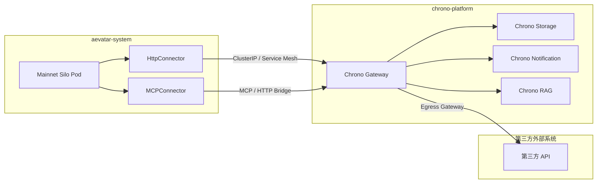

- Mainnet 到 Chrono：通过 K8s Service（ClusterIP）或 Service Mesh（Istio / Linkerd）建立 mTLS 内网通道。
- Chrono 到第三方 API：通过 Egress Gateway 统一出口，便于审计、限速与故障隔离。
- MCP 适配器：优先部署在 Chrono 侧（Sidecar 或独立 Pod），避免 Mainnet 直接耦合异构工具实现。

**3) 弹性与可观测性**

Connector 已内建弹性策略（retry / timeout / on_error），运维侧补充：
- 熔断器：在 Service Mesh 层配置 Circuit Breaker
- 可观测性：Connector 元数据（`duration_ms`、`status_code`、`exit_code`）流经投影管线，可接入 Prometheus + Grafana
- 日志关联：`ConnectorRequest.RunId` / `StepId` 可用于跨服务链路追踪

### 9.5 伸缩与性能治理策略

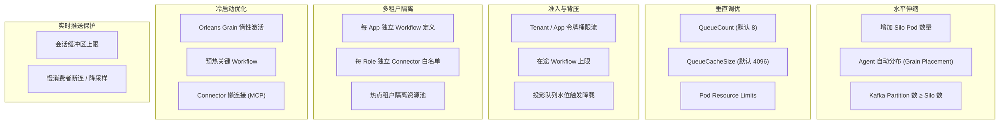

| 策略 | 触发信号 | 自动动作 | 运维动作 |
|---|---|---|---|
| 水平伸缩 | `cpu_usage`、`active_runs`、`kafka_consumer_lag` 持续升高 | HPA 扩容 Silo，Placement 自动重平衡 | `kubectl scale sts mainnet-silo --replicas=N` 或调高 HPA 上限 |
| 垂直调优 | `mailbox_delay_p95`、`projection_queue_depth` 升高 | 动态提高 `QueueCount` 或收紧并发 | 调整 `QueueCount` / `QueueCacheSize` / Pod 资源配额 |
| 准入与背压 | `projection_queue_depth` 或 `sink_buffer_usage` 超阈值 | 降低新 Run 准入，返回 429 + `Retry-After` | 调整限流配额与突发窗口 |
| 多租户隔离 | 单租户 `qps` / `connector_cost` 异常高 | 热点租户进入独立资源池，限制跨租户干扰 | 将租户路由到独立 Silo 池或独立 Topic |
| 冷启动优化 | 首包延迟 `first_token_latency_p95` 偏高 | 预热高频 Workflow 与 Connector 客户端池 | 在低峰执行预热批次 |
| Kafka 分区治理 | `partition_skew_ratio`、`consumer_lag` 不均衡 | 自动重分配消费与扩分区 | 设置 `num.partitions >= max(silo_replicas, target_parallelism)` |
| 实时推送保护 | `ws_slow_consumer_count`、`dropped_events` 升高 | 慢连接降采样或断连，保障主链路 | 调整每会话缓冲、推送批量与心跳参数 |

---

## 10. 性能瓶颈评审与重构方案

本节给出对现有设计的性能评审结论与重构后的目标架构。重构遵循三条红线：

1. 保持 `Command -> Event` 与 `Query -> ReadModel` 的读写分离语义。
2. CQRS 与 AGUI 继续共享同一套 Projection Pipeline，不走双轨。
3. 运行态事实状态继续由 Actor 持久态或分布式状态承载，不在中间层引入 `runId -> context` 进程内事实映射。

### 10.1 评审结论：潜在瓶颈总览

| 链路阶段 | 潜在瓶颈 | 典型症状 | 关键指标 |
|---|---|---|---|
| API 接入 | 缺少细粒度准入控制，突发流量直接压向 Runtime | 入口 QPS 抖动时全链路延迟同时升高 | `request_rate`, `429_rate`, `inflight_runs` |
| Workflow / Role Actor | 热点 Workflow 或租户集中到少量 Grain | 单 Silo CPU 打满，`mailbox_delay` 激增 | `grain_activation_count`, `mailbox_delay_p95` |
| 跨 Silo 通信 | 角色切换频繁导致跨节点消息风暴 | `silo_to_silo_rtt` 升高，尾延迟变长 | `cross_silo_msgs`, `silo_rtt_p95` |
| Kafka 传输 | 分区不足或键分布不均，消费组不均衡 | 消费滞后持续上升，局部分区积压 | `consumer_lag`, `partition_skew_ratio` |
| Projection 分发 | 单批次过小/过大、无背压水位治理 | 投影队列堆积，读模型更新延迟 | `projection_queue_depth`, `projector_latency_p95` |
| 实时推送 | 慢消费者拖累广播通道 | WS/SSE 缓冲膨胀、连接抖动 | `sink_buffer_usage`, `ws_slow_consumer_count` |
| Connector / Chrono 外部依赖 | Chrono 或第三方 API 抖动放大到主链路 | `connector_timeout`、重试风暴 | `connector_error_rate`, `connector_duration_p95` |
| 状态持久化 | 高峰写放大导致 Garnet 延迟抬升 | Step 完成确认变慢，重试增多 | `redis_cmd_latency_p95`, `state_write_rate` |
| LLM 调用 | 占 60-75% 延迟预算，无连接池化 / 无流式转发 / 无故障转移 | 首包延迟高、Provider 单点故障导致全链路阻塞 | `llm_call_duration_p95`, `first_token_latency_p95`, `llm_error_rate` |
| 序列化与大包体 | 大 EventEnvelope / 大模型返回导致拷贝与 GC 压力 | GC Pause 升高，吞吐下降 | `payload_size_p95`, `gc_pause_ms` |

### 10.2 重构目标：SLO 与预算拆解

建议以 3 级 SLO 管理性能目标：

| 目标层级 | 指标 | 目标值（建议） |
|---|---|---|
| 交互体验 | 首包延迟 `first_token_latency_p95` | ≤ 1200ms |
| 流程执行 | 单步骤调度延迟 `step_schedule_latency_p95` | ≤ 120ms |
| 稳态吞吐 | 单集群事件吞吐 `events_per_sec` | 按容量模型线性扩展，扩容后 10 分钟内恢复到稳态 |
| 数据新鲜度 | 读模型延迟 `read_model_freshness_p95` | ≤ 2s |
| 实时推送 | 推送端到端延迟 `realtime_push_latency_p95` | ≤ 800ms |

延迟预算建议（交互类工作流）：

- API 准入与路由：`80ms`
- Workflow/Role 调度：`120ms`
- Connector/LLM 调用：`600-900ms`（主耗时）
- Projection + 推送：`150-250ms`
- 预算冗余（抖动）：`200ms`

### 10.3 重构后的主链路（单主干）

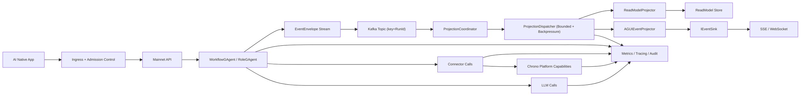

设计要点：

1. 入口先做准入与背压，再进入 Workflow 执行，避免故障从后端向前扩散。
2. 事件统一进入单投影主链路后再一对多分发，保持 CQRS 与 AGUI 语义一致。
3. 投影与推送分别做队列隔离，慢消费者不反向阻塞工作流执行。

### 10.4 关键重构项（按瓶颈分类）

**1) 准入与背压（P0）**

- 以 `tenantId + appId` 作为限流键，令牌桶 + 突发窗口双阈值。
- 推荐实现：ASP.NET Core 内建 `Microsoft.AspNetCore.RateLimiting` 中间件，通过 `RateLimitPartition.GetSlidingWindowLimiter(tenantId + appId)` 实现复合键限流，配合 `AddRateLimiter` + `UseRateLimiter` 与策略配置自动返回 429 + `Retry-After`。
- 设置在途 Workflow 上限（`max_inflight_runs`），超限快速失败。
- 当 `projection_queue_depth` 超阈值时自动降载，优先保护写路径与状态一致性。

**2) Actor 热点治理与 Orleans 调优（P0）**

- Workflow 放置键采用 `tenantId/workflowId/runId`，降低热点碰撞。
- **共置优先策略（To-Be）**：若 Runtime 层后续暴露 Orleans Placement 配置，可评估将强耦合角色优先共置到父 `WorkflowGAgent` 所在 Silo，降低跨 Silo 往返。
- **Grain 回收策略（To-Be）**：`CollectionAgeLimit` 默认值受 Orleans 版本与集群配置影响，不应假设固定数值。建议基于压测结果按 Grain 类型分层配置回收窗口，并在工作流完成后主动调用 `DeactivateOnIdle()` 释放资源。
- **串行调度优化评估（To-Be）**：`WorkflowGAgent` 当前按串行语义处理事件。若后续要缩短步骤间调度间隙，应优先在 Runtime 层评估“同 run 事件的本地连续处理策略”，并在并发安全审计后再落地。
- 对高 fan-out 场景，优先使用已有的 `parallel_fanout` 模块（内部创建多个并发子活动），而非引入新的分片 Agent 抽象，保持模型简洁。

**3) Kafka 与流并行度（P0）**

- 保证同一 `runId` 有序：消息键固定 `runId`，跨 `runId` 并行。需验证当前 `MassTransitKafka` 传输实现是否已将 `RunId` 用作 Kafka 分区键；若使用默认随机分区，同一 Run 的事件可能乱序到达投影端。
- 分区数至少满足 `num_partitions >= max(silo_replicas, target_parallelism)`。
- 消费组按环境/业务域隔离，避免不同流量池互相争抢。
- 对于多租户隔离要求极高的场景，考虑为高流量租户/App 部署独立 Mainnet 实例并配置独立 Kafka Topic/ConsumerGroup（实例级环境变量），从传输层实现硬隔离。

**4) Projection Pipeline 吞吐优化（P0）**

- Dispatcher 使用有界队列与高水位告警，拒绝无上限排队。推荐实现：`Channel<T>.CreateBounded(new BoundedChannelOptions(capacity) { FullMode = BoundedChannelFullMode.Wait })`，`Wait` 模式自然向上游施加背压而不丢弃数据。
- Projector 采用微批（如 32-256）写入，降低存储写放大。
- Reducer 保持幂等（基于事件版本/序列号），支持安全重放与重试。

**5) 实时推送防抖（P1）**

- 每会话设置缓冲区上限（事件数与字节数双阈值）。推荐实现：每个 SSE/WebSocket 连接使用独立的 `Channel<T>.CreateBounded(new BoundedChannelOptions(N) { FullMode = BoundedChannelFullMode.DropOldest })`，缓冲区满时自动丢弃最旧事件，避免自定义环形缓冲区实现。
- 对慢连接执行降采样、合并事件或断连，防止拖垮广播链路。
- 推送通道与读模型更新通道分离，单通道故障不扩散。

**6) Connector 外部依赖治理（P1）**

- 以 Connector 为粒度设置并发预算（Bulkhead）和熔断策略。推荐实现：使用 `System.Threading.RateLimiter.ConcurrencyLimiter` 包装每个 `IConnector` 实例，可在 `IConnectorRegistry` 层作为装饰器注入，无需修改 Connector 本身。
- 重试采用指数退避 + 抖动，禁止零间隔重试风暴。
- 为 `connector_call` 设置 payload 上限与超时预算，超限快速失败。

**7) 状态与序列化成本控制（P1）**

- Grain 持久态仅保存最小必要运行态，避免大对象驻留。
- 大响应体（例如长文本）落外部对象存储，仅在事件里传引用。
- 对大包体启用压缩阈值，降低网络与序列化开销。

**8) LLM 调用优化（P0）**

LLM 调用占据 60-75% 的延迟预算（600-900ms），是首包延迟的决定性因素，必须作为 P0 优化。

- **流式 Token 转发**：`RoleGAgent` 已产出 `TextMessageStartEvent` / `TextMessageContentEvent` / `TextMessageEndEvent`。必须确认 AGUI Projector 对 `TextMessageContentEvent` 做增量转发（逐 chunk 推送），而非缓冲到 `TextMessageEndEvent` 才整体输出。这直接决定用户感知的首包延迟是 200ms 还是 2s。
- **`HttpClient` 连接池化**：LLM Provider 的 HTTP 调用必须通过 `IHttpClientFactory` 获取 `HttpClient`（单例或池化），避免每次调用重建 TCP/TLS 连接。连接复用可减少 50-100ms 握手开销。
- **Provider 故障转移**：当主 LLM 端点响应超时或返回 5xx 时，`ILLMProviderFactory` 应支持自动切换到备用 Provider。可实现为装饰器模式，包装 primary + fallback，对上层透明。
- **Prompt 缓存**：对确定性步骤（`evaluate`、`reflect`、`guard`）及 `maker_recursive` 的重复迭代，相同 prompt hash 可命中缓存，跳过 LLM 调用。缓存粒度为 `hash(system_prompt + user_message + model)`，TTL 按步骤类型配置。
- **Token 预算管理**：为每个 `llm_call` 步骤设置 `max_tokens` 上限，防止模型生成超长响应导致延迟和序列化开销不可控。在 YAML `parameters` 中声明，由 `LLMCallModule` 传入 Provider。

**推荐 .NET 原生实现对照表**

| 场景 | 自研方案（避免） | 推荐 .NET 原生方案 |
|---|---|---|
| API 准入限流 | 自定义令牌桶中间件 | `Microsoft.AspNetCore.RateLimiting` + `SlidingWindowRateLimiter` |
| Projection 背压队列 | 自定义有界队列 | `System.Threading.Channels.Channel<T>.CreateBounded(Wait)` |
| 推送会话缓冲 | 自定义环形缓冲区 | `System.Threading.Channels.Channel<T>.CreateBounded(DropOldest)` |
| Connector 并发隔离 | 自定义 Bulkhead | `System.Threading.RateLimiter.ConcurrencyLimiter` 装饰器 |
| LLM HTTP 连接池 | 手动管理 `HttpClient` | `IHttpClientFactory` + 命名客户端 |

### 10.5 容量规划模型（可执行）

建议在容量评审中统一使用以下估算：

1. Silo 副本数估算  
   `required_silos = ceil((qps * avg_steps_per_run * cpu_ms_per_step) / (cpu_cores_per_silo * 1000 * target_utilization))`

2. Kafka 分区数估算  
   `required_partitions = ceil(total_events_per_sec / target_events_per_partition_sec)`

3. Projection Worker 数估算  
   `projector_workers = min(required_partitions, cpu_cores_total * 2)`

建议初始目标：

- `target_utilization = 0.55 ~ 0.65`（保留抖动余量）
- `target_events_per_partition_sec` 按压测结果回填，不用经验常数硬编码
- 扩容触发采用多指标联合：`cpu + lag + queue_depth`

### 10.6 降级矩阵（故障不扩散）

| 场景 | 自动降级动作 | 保留能力 | 暂停能力 | 恢复条件 |
|---|---|---|---|---|
| Kafka `consumer_lag` 持续升高 | 收紧新 Run 准入，优先处理存量 | 运行中 Workflow | 新建低优先级 Workflow | `consumer_lag` 连续 5 分钟低于阈值 |
| Garnet 延迟升高 | 限制高频状态写入，合并写批次 | 核心步骤执行 | 非关键中间态细粒度落盘 | `redis_cmd_latency_p95 < 10ms` 持续 3 分钟 |
| Connector 超时风暴 | 熔断对应 Connector，回退到兜底分支 | 核心内部步骤 | 外部依赖步骤 | 该 Connector 错误率降至 5% 以下持续 2 分钟 |
| SSE/WS 慢消费者激增 | 会话降采样/断连，改为拉模式补偿 | 核心业务写路径 | 全量实时细粒度推送 | 所有活跃连接 `buffer_usage < 50%` |
| 热点租户突发 | 租户限流 + 隔离资源池 | 其他租户 SLA | 热点租户非关键任务 | 该租户 QPS 回落到配额 2 倍以内持续 5 分钟 |
| LLM Provider 故障 | 自动切换备用 Provider | 核心工作流执行 | 非关键评估/反思步骤 | 主 Provider 成功率恢复到 95% 以上持续 5 分钟 |

降级状态管理要求：进入降级时记录时间戳与触发指标；满足恢复条件后自动退出降级模式并发出恢复通知。禁止无限期停留在降级态。

### 10.7 验证与门禁（建议纳入 CI）

除现有烟测外，建议新增性能门禁场景：

1. **稳态吞吐测试**：持续流量下验证 `consumer_lag` 不持续增长。
2. **突发流量测试**：验证准入与背压动作是否生效（429 与恢复时间）。
3. **慢依赖测试**：注入 Connector 高延迟，验证熔断与降级矩阵。
4. **慢消费者测试**：注入 WS 慢连接，验证主链路不被拖慢。
5. **热点租户测试**：单租户高压下验证跨租户 SLA 隔离。

达标条件（示例）：

- `p95` 延迟与 `p99` 延迟同时满足 SLO；
- `consumer_lag` 在扩容后 10 分钟内回落；
- 无内存持续增长趋势与无不可恢复队列积压。

### 10.8 分阶段落地计划

| 阶段 | 目标 | 交付物 |
|---|---|---|
| P0（先保稳定） | 准入、背压、热点治理、投影有界队列、LLM 流式转发与连接池化 | 配置项 + 指标面板 + 自动扩缩策略 |
| P1（再提效率） | Connector 并发治理、推送慢消费者保护、微批投影、LLM Provider 故障转移 | 降级矩阵落地 + 压测报告 |
| P2（长期优化） | 大包体优化、冷热分层、Prompt 缓存、容量模型自动回填 | 季度容量评审机制 + 自动化调参脚本 |

### 10.9 可观测性指标目录

10.2 的 SLO 和 10.6 的降级矩阵依赖具体的指标名称。以下为建议的标准指标目录，所有指标应导出为 Prometheus 格式并配置对应告警规则。

指标治理约束：Prometheus 指标默认禁止使用高基数标签（如 `run_id`、`session_id`、`user_id`、`tenant_id` 原值）；此类维度应进入 Trace/日志，指标侧使用分桶或分层标签（如 `tenant_tier`、`route`、`protocol`）。

**API 层**

| 指标名称 | 类型 | 标签 | 说明 |
|---|---|---|---|
| `aevatar_api_request_duration_seconds` | Histogram | `method`, `route`, `status`, `tenant_tier` | API 请求延迟分布 |
| `aevatar_api_inflight_requests` | Gauge | `tenant_tier` | 当前在途请求数 |
| `aevatar_api_rate_limited_total` | Counter | `tenant_tier`, `app` | 被限流的请求总数 |

**Workflow 执行层**

| 指标名称 | 类型 | 标签 | 说明 |
|---|---|---|---|
| `aevatar_workflow_run_duration_seconds` | Histogram | `workflow`, `status` | 单次 Run 总执行时长 |
| `aevatar_workflow_step_schedule_duration_seconds` | Histogram | `workflow`, `step_type` | 步骤调度延迟（从 StepRequest 到 Module 开始处理） |
| `aevatar_workflow_first_token_duration_seconds` | Histogram | `workflow` | 首 Token 延迟（从 ChatRequest 到首个 `TextMessageContentEvent`） |
| `aevatar_workflow_inflight_runs` | Gauge | `tenant_tier`, `workflow` | 当前在途 Run 数量 |

**LLM 层**

| 指标名称 | 类型 | 标签 | 说明 |
|---|---|---|---|
| `aevatar_llm_call_duration_seconds` | Histogram | `provider`, `model`, `status` | LLM 调用延迟 |
| `aevatar_llm_tokens_total` | Counter | `provider`, `model`, `direction` | Token 计数（`direction`: `input` / `output`） |
| `aevatar_llm_cache_hit_total` | Counter | `step_type` | Prompt 缓存命中次数 |

**Connector 层**

| 指标名称 | 类型 | 标签 | 说明 |
|---|---|---|---|
| `aevatar_connector_duration_seconds` | Histogram | `connector`, `type`, `operation`, `status` | Connector 调用延迟 |
| `aevatar_connector_errors_total` | Counter | `connector`, `type`, `error_kind` | Connector 错误计数 |
| `aevatar_connector_circuit_state` | Gauge | `connector` | 熔断器状态（0=closed, 1=open, 2=half-open） |

**Projection 层**

| 指标名称 | 类型 | 标签 | 说明 |
|---|---|---|---|
| `aevatar_projection_queue_depth` | Gauge | `projector` | 投影队列当前深度 |
| `aevatar_projection_batch_duration_seconds` | Histogram | `projector` | 单批次投影处理时长 |
| `aevatar_projection_events_processed_total` | Counter | `projector`, `event_type` | 投影处理事件总数 |

**实时推送层**

| 指标名称 | 类型 | 标签 | 说明 |
|---|---|---|---|
| `aevatar_push_active_connections` | Gauge | `protocol` | 活跃 SSE/WebSocket 连接数 |
| `aevatar_push_buffer_usage_ratio` | Gauge | `protocol` | 推送缓冲区使用率（聚合视角） |
| `aevatar_push_dropped_events_total` | Counter | `reason` | 丢弃事件计数（`reason`: `buffer_full` / `slow_consumer`） |

**Orleans 运行时**

| 指标名称 | 类型 | 标签 | 说明 |
|---|---|---|---|
| `orleans_grain_activation_count` | Gauge | `grain_type` | Grain 激活数量 |
| `orleans_silo_to_silo_rtt_seconds` | Histogram | `source_silo`, `target_silo` | 跨 Silo RTT |
| `orleans_grain_mailbox_delay_seconds` | Histogram | `grain_type` | Grain 邮箱排队延迟 |

**基础设施**

| 指标名称 | 类型 | 标签 | 说明 |
|---|---|---|---|
| `kafka_consumer_lag` | Gauge | `group`, `topic`, `partition` | Kafka 消费滞后 |
| `kafka_partition_skew_ratio` | Gauge | `group`, `topic` | 分区消费偏斜比 |
| `redis_cmd_latency_seconds` | Histogram | `command` | Garnet/Redis 命令延迟 |

SLO 告警规则示例：

```yaml
# first_token_latency_p95 > 1200ms 持续 5 分钟
- alert: HighFirstTokenLatency
  expr: histogram_quantile(0.95, rate(aevatar_workflow_first_token_duration_seconds_bucket[5m])) > 1.2
  for: 5m
  labels:
    severity: warning
  annotations:
    summary: "首包延迟 P95 超过 SLO (1200ms)"
```

### 10.10 工作流故障恢复

当 Orleans Silo 在工作流执行中途崩溃时，承载 `WorkflowGAgent` 的 `RuntimeActorGrain` 会在其他 Silo 上重新激活。是否能从断点恢复，取决于 run 级运行态是否持久化。

**当前实现现状（As-Is）**

- `WorkflowState` 当前仅持久化工作流配置与统计字段（如 `workflow_yaml`、`workflow_name`、`version`、`compiled`、执行计数）。
- `WorkflowLoopModule` 的 run 运行态（`_activeRunIds`、`_variablesByRunId`、`_stepToRunId`、`_timeouts`）当前为内存态，不进入持久化。
- 因此当前语义下，Silo 故障后可恢复 `WorkflowGAgent` 与配置，但不能自动恢复到“故障前步骤断点”；中断中的 run 需要由上层重试/重提。
- `checkpoint` 模块当前为简化实现（记录日志并透传 input），并不等价于持久化快照机制。

**生产环境强制要求 `OrleansPersistenceBackend=Garnet`**

当前默认的 `InMemory` 持久化意味着 Silo 崩溃后 Grain 状态完全丢失。对于生产部署，这是不可接受的。

**目标恢复能力（To-Be）**

要实现“步骤级断点恢复”，`WorkflowGAgent` 持久态至少需要包含：

| 状态字段 | 说明 | 恢复时作用 |
|---|---|---|
| `WorkflowDefinition` | 编译后的工作流定义 | 重新激活后无需再次编译 YAML |
| `CurrentStepId` | 当前执行到的步骤 ID | 从最近一个已完成步骤的下一步恢复 |
| `RunVariables` | 运行时变量（步骤输出、用户输入） | 恢复后后续步骤可引用之前步骤的输出 |
| `CompletedStepIds` | 已完成步骤集合 | 幂等判断，避免重复执行已完成步骤 |
| `RunId` / `CorrelationId` | 运行标识 | 恢复后投影端可继续关联同一 Run |

目标恢复流程（To-Be）：

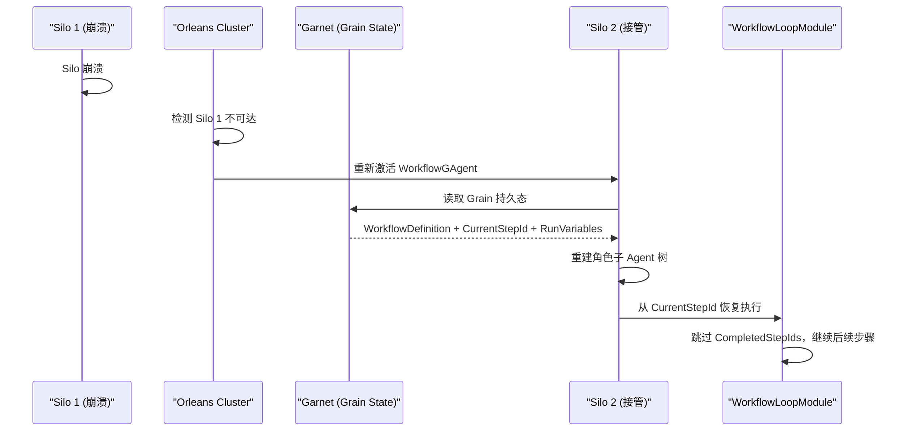

注意事项：

- 当前 `checkpoint` 模块不持久化快照；若需要分段恢复，需为 `checkpoint` 增加真实持久化实现并纳入运行态恢复协议。
- LLM 调用不具备幂等性（相同 prompt 可能返回不同结果）。恢复时如果上一个 `llm_call` 步骤已发出请求但未收到响应，应将该步骤标记为需重试，而非跳过。
- 投影端通过 `RunId` 关联事件，Silo 故障转移后产出的事件仍会正确归入同一 Run 的投影上下文。

---

## 11. 与区块链网络 + DApp 的对照与 SDK 初步规划

从系统形态上看，Aevatar 更接近“执行网络 + 能力网络 + DApp”的三层组合：`Aevatar Mainnet` 负责 Agent 承载与 workflow 编排，`Chrono Platform` 负责能力微服务供给，`AI Native App` 负责产品化交互。  
差异在于，Aevatar 的核心目标是 **AI Agent 协作与能力编排**，而不是“无信任价值结算”。

### 11.1 对照结论（可作为沟通口径）

- 对外叙事可类比为：`Aevatar Mainnet ~= Agent Execution Network`，`Chrono Platform ~= Oracle-like Capability Network`，`AI Native App ~= DApp`。
- 对内实现必须坚持现有主链路：`Command -> Event -> Projection -> Push`，不引入平行执行体系。
- Mainnet 保持轻量 Agent Host，不承载高变能力细节；能力扩展默认下沉到 Chrono Platform。
- SDK 的职责是“标准化接入与能力封装”，而不是在客户端重做编排引擎或维护事实状态。

### 11.2 架构映射对照表

| 区块链世界 | Aevatar 世界 | 说明 |
|---|---|---|
| Chain / L2 网络 | Aevatar Mainnet（Orleans + CQRS + Projection） | 共享执行底座，承载多应用租户 |
| DApp 前后端 | AI Native App | 面向终端用户的产品形态 |
| 钱包账户 / 地址 | Tenant + User + Agent Identity | 这里是业务身份，不是链上账户资产语义 |
| 交易（Tx） | Command（如启动 workflow run、发送输入） | 写入意图入口，异步产出事件 |
| 区块确认 / Finality | Actor 串行执行 + 持久化 + 事件可追踪 | 不是拜占庭共识；是工程一致性与可恢复性 |
| 智能合约 | Workflow YAML + RoleGAgent + EventModule | 业务逻辑的声明式 + 代码化组合 |
| Oracle / Data Feed | Chrono Platform + Connector | 将外部能力（storage/notification/search/third-party）可靠引入 Agent |
| 链上日志（Event Log） | Domain Events + EventEnvelope | 统一事件信封，支持关联追踪 |
| Indexer / The Graph | Projection Pipeline + ReadModel | 一对多投影，支撑 Query 与实时推送 |
| RPC Provider | Mainnet Host API（HTTP/SSE/WebSocket） | 统一协议入口与订阅出口 |
| Web3 SDK（ethers / viem） | Aevatar SDK（待规划） | 为 App 开发者提供统一开发体验 |

### 11.3 关键差异与边界（避免误解）

- **信任模型不同**：Aevatar 面向可治理、可观测、可运维的云服务，不以“去信任共识”作为基础前提。
- **Oracle 类比边界**：Chrono 属于平台治理下的能力层，不是链上去信任预言机网络。
- **确定性不同**：工作流中含 LLM 调用，天然存在非确定性；应通过幂等键、重试策略、补偿机制治理。
- **结算语义不同**：Aevatar 当前不内建链上资产结算层；若需计费/结算，应作为独立模块接入。
- **性能目标不同**：优先首包时延、吞吐与多租户稳定性，而非区块出块时间和链上 gas 最优。

### 11.4 SDK 初步规划（第一版）

SDK 目标：让 AI Native App 以最少样板代码完成“发命令、收事件、查读模型、用能力”四件事，并严格对齐 Mainnet + Chrono 的协同主链路。

**设计原则**

| 原则 | 约束 |
|---|---|
| 单一主干 | SDK 只走 `Host API + Projection`，不新增旁路数据通道 |
| 读写分离 | 写入统一走 Command API；读取统一走 Query/ReadModel API |
| 事件优先 | 长流程状态以事件与投影为准，不在 SDK 内维护事实态缓存 |
| 能力分层 | 高变能力通过 Chrono 暴露，SDK 仅做能力目录与调用参数封装 |
| 配置可注入 | 开发者可通过 SDK 传入 run 级 `agent_profile`（role+connector），指定 Chrono service instance |
| 可演进 | 协议与能力通过版本协商扩展，避免一次性大而全 |

**建议模块拆分（逻辑包）**

| 模块 | 职责 | 对标 Web3 SDK 习惯 |
|---|---|---|
| `sdk-core` | 基础类型、错误模型、重试策略、幂等键、序列化 | 类似 `core/utils` |
| `sdk-auth` | Tenant/App/User 凭据注入、签名头与鉴权续期 | 类似 `wallet/signer` |
| `sdk-client` | Command/Query API 封装，统一请求管道 | 类似 `provider/rpc` |
| `sdk-realtime` | SSE/WebSocket 订阅、断线重连、游标续传 | 类似 `event/listener` |
| `sdk-workflow` | workflow run 启动参数构建、变量绑定、agent profile 注入 | 类似 `contract/method wrapper` |
| `sdk-capability` | Chrono 能力目录查询、connector profile 选择、能力调用参数构建 | 类似 `oracle/data adapter` |
| `sdk-observability` | trace/correlation 透传、指标埋点钩子 | 类似 `debug plugin` |

**MVP 能力边界（建议先做）**

1. 启动与跟踪一次 workflow run（含 `RunId` / `CorrelationId` 回传）。
2. 通过 SDK 提交 run 级 `agent_profile`，定义 role agent 与 connector 到 Chrono service instance 的映射。
3. 订阅运行事件流（SSE/WebSocket 二选一即可起步，建议先 SSE）。
4. 查询 run/read model 当前状态（支持最终一致性提示与轮询退避）。
5. 提供最小能力目录查询与 connector profile 选择能力（面向 Chrono）。
6. 提供统一错误码与重试建议（429、超时、网络抖动、幂等冲突）。

**版本节奏（建议）**

- `v0.1`（可用）：`sdk-core + sdk-client + sdk-realtime`，先覆盖对话与工作流主路径。
- `v0.2`（增强）：补 `sdk-auth`、`sdk-workflow` 与 `sdk-capability`（会话管理、批量 run、能力目录）。
- `v0.3`（治理）：补 `sdk-observability`、限流自适应与能力探测（feature negotiation）。

**建议首批 SDK 契约（接口层）**

- `IMainnetClient`: `RunFromYamlAsync`、`SendCommandAsync`、`QueryAsync`。
- `IRunSubscription`: `SubscribeRunEventsAsync(runId)`、`ResumeFromCursorAsync(cursor)`。
- `IRunQueryService`: `GetRunStatusAsync(runId)`、`GetRunTimelineAsync(runId)`。
- `ICapabilityCatalog`: `ListCapabilitiesAsync()`、`ResolveConnectorProfileAsync(capabilityId)`。
- `IAevatarCredentialProvider`: 凭据获取、刷新与失效回调。

**Inline 模式最小请求契约（建议）**

| 字段 | 必填 | 说明 |
|---|---|---|
| `workflow_yaml` | 是 | 本次 run 的工作流定义（inline 传入） |
| `input` | 是 | 用户输入或上游上下文 |
| `tenant_id` | 是 | 多租户隔离维度 |
| `app_id` | 是 | AI Native App 维度 |
| `run_id` | 否 | 调用方自定义 run 标识；不传则由服务端生成 |
| `idempotency_key` | 否 | 幂等键，用于重试去重 |
| `agent_profile` | 否（建议） | run 级 agent 配置（role agent + connector）；用于指定角色模型和 Chrono 连接目标 |
| `agent_profile.merge_mode` | 否 | `merge` / `replace`，控制与平台默认 profile 的合并方式 |
| `capability_profile` | 否 | 指定 Chrono 能力配置档（如 `default` / `restricted`） |
| `workflow_name` | 否 | 兼容字段：未提供 `workflow_yaml` 时按注册表查找 |

**Inline 模式最小响应契约（建议）**

| 字段 | 说明 |
|---|---|
| `run_id` | 本次运行唯一标识 |
| `correlation_id` | 跨链路追踪标识（命令、事件、投影统一关联） |
| `stream_endpoint` | SSE/WS 订阅地址 |
| `accepted_at` | 服务端受理时间（UTC） |
| `workflow_hash` | YAML 内容哈希（用于编译缓存与审计） |
| `resolved_connectors` | 实际生效的 connector 列表（含解析到的 Chrono instance） |

**SDK API 草案（合约调用体验）**

- `runFromYaml(request)`：发起一次 inline YAML run，返回受理结果（`run_id`、`stream_endpoint`）。
- `withAgentProfile(profile)`：为 run 注入 agent profile（可作为 `runFromYaml` 的参数 builder）。
- `subscribeRunEvents(runId, options?)`：订阅 run 事件流，支持断线续传。
- `getRunStatus(runId)`：查询 run 当前状态（running/succeeded/failed）。
- `getRunTimeline(runId)`：查询步骤级时间线（用于排障与审计）。

> 实施建议：先在一个语言栈做 MVP（建议 TypeScript 或 .NET 二选一），待协议稳定后再扩展第二语言，避免双栈同时演进导致契约漂移。

### 11.5 AI Native App 编排能力来源（Inline YAML 模型）

AI Native App 的编排能力并非“写死在 Mainnet”，而是由 SDK 在每次调用时提交 `workflow_yaml + agent_profile` 触发。  
Mainnet 的职责是将该 YAML 编译为可执行工作流，并按 `agent_profile` 组装 RoleGAgent 与 connector 解析上下文后驱动 `WorkflowGAgent`。

从 SDK 交互视角，每次 run 的关键交换可简化为“2 类注入 + 1 类回抛”：

| 交互类型 | 字段 | 作用 |
|---|---|---|
| 注入（编排） | `workflow_yaml` | 描述多 Agent 如何协作（步骤、分支、控制流） |
| 注入（画像） | `agent_profile` | 描述 role agent 配置与 connector 连接目标（Chrono 实例） |
| 回抛（事件） | AGUI Events | Mainnet 通过 AGUI 事件流向 App 回抛执行进度、增量输出与完成态 |

“智能合约式”类比关系：

| Aevatar 元素 | 合约世界类比 | 说明 |
|---|---|---|
| `workflow_yaml` | 合约代码载荷 | 每次调用显式携带执行逻辑 |
| `agent_profile` | 执行画像参数 | 定义 role agent 配置与 connector 的 Chrono 连接目标 |
| `RunFromYaml` 请求 | 合约调用交易 | 提交输入参数并触发执行 |
| `WorkflowGAgent` | 合约运行实例 | 在 run 生命周期内维护执行上下文 |
| `RunId` / `CorrelationId` | 交易哈希 / 回执关联键 | 用于追踪执行进度与结果 |
| Projection ReadModel | Indexer 视图 | 提供查询与前端展示数据 |

### 11.6 智能合约式调用时序（Inline YAML）

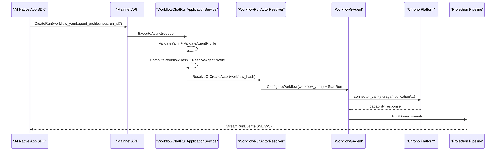

### 11.7 开发者接入图（SDK 注入 YAML 实现 Multi-Agent Workflow）

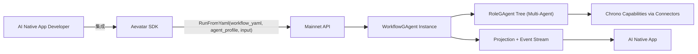

开发者视角下，Aevatar SDK 提供四类关键能力：

- **连接主网**：封装 Mainnet API 的请求、鉴权、重试与幂等。
- **注入编排**：通过 `runFromYaml` 在调用时提交 `workflow_yaml + agent_profile`，触发多 Agent 角色树执行。
- **画像配置**：开发者可在 SDK 中定义 role agent 与 connector 到 Chrono service instance 的映射（dev/staging/prod）。
- **消费结果**：通过 `subscribeRunEvents` 与 `getRunStatus/getRunTimeline` 实时消费执行状态与输出。

### 11.8 Inline YAML 风险与治理

| 风险 | 触发场景 | 治理措施 |
|---|---|---|
| 恶意或越权步骤 | 提交未授权 `step type` 或 connector | `step type allowlist` + 角色 `connector allowlist` + capability profile |
| 超大 YAML 包体 | 单请求 YAML 过大导致解析/GC 压力 | 设置 YAML 大小上限与请求体限制 |
| 恶意 connector 目标地址 | 请求内注入未授权 Chrono/外网地址 | connector endpoint allowlist + egress policy + 租户隔离校验 |
| 高频重复编译 | 相同 YAML 被频繁提交 | 基于 `workflow_hash` 的编译缓存 |
| 重试导致重复执行 | 网络抖动触发客户端重放 | `idempotency_key` + `run_id` 幂等去重 |
| 租户噪音放大 | 单租户高频 run 挤压全局资源 | `tenant_id + app_id` 限流、在途 run 上限、背压降载 |

---

## 附录

### A. 端口清单

| 端口 | 用途 |
|---|---|
| 8080 | Mainnet API（HTTP / SSE / WebSocket） |
| 11111 | Orleans Silo 间通信 |
| 30000 | Orleans Gateway |
| 9092 | Kafka Broker |
| 6379 | Garnet (Redis) |

### B. 环境变量速查

| 变量 | 说明 |
|---|---|
| `ASPNETCORE_ENVIRONMENT` | 运行环境（`Distributed` 启用分布式模式） |
| `AEVATAR_ActorRuntime__Provider` | `Orleans` / `InMemory` |
| `AEVATAR_ActorRuntime__OrleansStreamBackend` | `MassTransitAdapter` / `InMemory` |
| `AEVATAR_ActorRuntime__OrleansPersistenceBackend` | `Garnet` / `InMemory` |
| `AEVATAR_ActorRuntime__OrleansGarnetConnectionString` | Garnet 连接串 |
| `AEVATAR_ActorRuntime__MassTransitTransportBackend` | MassTransit 传输后端（Kafka） |
| `AEVATAR_ActorRuntime__MassTransitKafkaBootstrapServers` | Kafka 地址 |
| `AEVATAR_ActorRuntime__MassTransitKafkaTopicName` | Kafka Topic 名称 |
| `AEVATAR_ActorRuntime__MassTransitKafkaConsumerGroup` | Kafka 消费组 |
| `AEVATAR_Orleans__ClusteringMode` | `Localhost` / `Development` |
| `AEVATAR_Orleans__ClusterId` | Orleans 集群 ID |
| `AEVATAR_Orleans__ServiceId` | Orleans 服务 ID |
| `AEVATAR_Orleans__PrimarySiloEndpoint` | 主 Silo 地址（Development 模式） |
| `AEVATAR_Orleans__QueueCount` | Orleans 流消费并行度 |
| `AEVATAR_Orleans__QueueCacheSize` | Orleans 流队列缓存大小 |

### C. 快速启动命令

```bash
# 本地开发（InMemory 模式）
dotnet run --project src/Aevatar.Mainnet.Host.Api

# 本地分布式（Docker Compose 基础设施）
docker compose up -d kafka garnet
ASPNETCORE_ENVIRONMENT=Distributed dotnet run --project src/Aevatar.Mainnet.Host.Api

# 3 节点集群
bash tools/cluster/start-mainnet-cluster.sh

# 验证
bash tools/ci/orleans_garnet_persistence_smoke.sh
bash tools/ci/distributed_3node_smoke.sh
```

### D. 相关文档

- [Foundation 层设计](../FOUNDATION.md)
- [工作流引擎设计](../WORKFLOW.md)
- [事件溯源指南](../EVENT_SOURCING.md)
- [分布式架构详解](mainnet-host-api-distributed-orleans-tm-kafka.md)
- [Stream Forward 架构](../STREAM_FORWARD_ARCHITECTURE.md)
