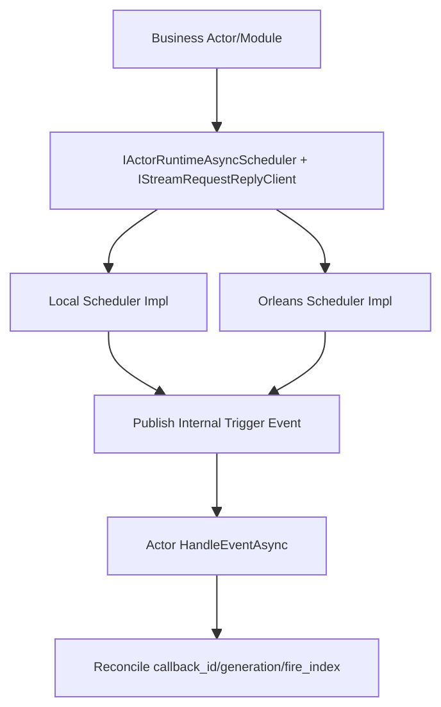

# Actor Runtime 流式异步能力上提重构蓝图（v4, Zero-Compatibility）

## 1. 文档元信息
1. 状态：`Implemented`
2. 版本：`v4`
3. 日期：`2026-03-05`
4. 决策级别：`Architecture Breaking Change`
5. 目标：
   1. 将 stream request/reply、timeout、timer 统一上提到 Actor Runtime。
   2. 将契约统一放入 `Aevatar.Foundation.Abstractions`，实现放入 `Aevatar.Foundation.Runtime.*`。
   3. 保证 `Local` 与 `Orleans` 契约一致、实现机制不同。

## 2. 核心决策（冻结）
1. `Orleans` 不走“业务线程回调模型”；使用 Orleans 原生调度能力（grain turn + grain timer，持久场景用 reminder 能力）。
2. `Local` 可使用基础设施线程调度循环，但线程只发内部触发事件，不直接推进业务。
3. 业务推进唯一入口是 Actor `HandleEventAsync` 主流程。
4. 调度交付语义定义为 `at-least-once`，通过 `callback_id + generation + fire_index` 达到业务 `effectively-once`。
5. 无兼容双轨：删除旧 helper 与重复实现。

## 3. 背景与当前基线（代码事实）
1. 旧 request/reply helper 在 CQRS 抽象层：
   1. `src/Aevatar.CQRS.Core.Abstractions/Streaming/EventStreamQueryReplyAwaiter.cs`
2. 调用方位于 Scripting 基础设施：
   1. `src/Aevatar.Scripting.Infrastructure/Ports/RuntimeScriptQueryClient.cs`
3. 业务侧散落 timeout/watchdog 实现：
   1. `src/workflow/Aevatar.Workflow.Core/Modules/WorkflowLoopModule.cs`
   2. `src/workflow/Aevatar.Workflow.Core/Modules/WaitSignalModule.cs`
   3. `src/workflow/Aevatar.Workflow.Core/Modules/LLMCallModule.cs`
   4. `src/Aevatar.Scripting.Core/ScriptRuntimeGAgent.cs`
4. Orleans 版本：
   1. `Microsoft.Orleans 10.0.1`（`Directory.Packages.props`）

## 4. 范围与非范围
### 4.1 范围
1. 上提 timeout/timer/request-reply 到 Runtime + Abstractions。
2. 引入统一调度事实模型（callback lease / generation / status）。
3. 迁移 Workflow 与 Scripting 目标调用方。
4. 删除 CQRS 层旧 helper。
5. 引入守卫，阻止回归散落 `Task.Run + Task.Delay`。

### 4.2 非范围
1. 不重写业务事件领域语义。
2. 不在 API 层增加事实缓存。
3. 不保留向后兼容壳层。

## 5. 架构硬约束（必须满足）
1. 回调只发信号：回调上下文不得直接推进业务分支。
2. 业务推进内聚：成功/失败/重试只在 Actor 事件处理主流程完成。
3. 显式对账：内部触发事件必须携带 `callback_id + generation`，Actor 必须校验。
4. 事实源唯一：
   1. Orleans 生产语义下，调度事实以持久态为唯一权威。
   2. Local 调度状态仅为开发态临时事实，不可外溢为生产语义。
5. 中间层不得新增 `actor/run/session -> context` 事实字典。

## 6. 目标架构总览

## 7. 抽象层契约（Abstractions）
### 7.1 必须新增
1. `IActorRuntimeAsyncScheduler`
2. `RuntimeTimeoutRequest`
3. `RuntimeTimerRequest`
4. `RuntimeCallbackLease`
5. `RuntimeCallbackStatus`
6. `IStreamRequestReplyClient`
7. `StreamRequestReplyRequest<TResponse>`
8. `RuntimeCallbackMetadataKeys`

### 7.2 契约语义
1. 同一 `actor_id + callback_id` 重复注册必须产生递增 `generation`。
2. `CancelAsync(actorId, callbackId, expectedGeneration)` 使用 CAS 语义。
3. 触发事件必须携带：
   1. `callback_id`
   2. `generation`
   3. `fire_index`（timer）
   4. `fired_at_utc`
4. request/reply 异常语义分离：
   1. 取消 -> `OperationCanceledException`
   2. 超时 -> `TimeoutException`

## 8. Runtime 实现矩阵（契约一致，机制不同）
### 8.1 Local Runtime
1. 使用进程内调度器（最小堆或时间轮）管理到期任务。
2. 到期只发布内部触发事件到 Actor Self Stream。
3. 不在调度线程内执行业务逻辑。
4. 进程重启任务丢失可接受（开发态语义）。

### 8.2 Orleans Runtime
1. 双策略并存：
   1. `Inline`：在 `RuntimeActorGrain` 当前 turn 内直接 `RegisterGrainTimer`，无额外 grain hop。
   2. `Dedicated`：通过 `RuntimeCallbackSchedulerGrain` 调度，适用于非当前 turn/跨上下文调用。
2. 策略选择（已落地为可配置算法）：
   1. `AsyncCallbackSchedulingMode=ForceInline`：
      1. 必须命中当前 actor turn 绑定（`actor_id` 一致），否则直接抛错（不静默降级）。
   2. `AsyncCallbackSchedulingMode=ForceDedicated`：
      1. 永远走 dedicated grain，即使当前 turn 已绑定。
   3. `AsyncCallbackSchedulingMode=Auto`（默认）：
      1. 若命中 turn 绑定且 `due_time <= AsyncCallbackInlineMaxDueTimeMs`（默认 `60000`）则走 `Inline`。
      2. 其余情况走 `Dedicated`。
3. Dedicated 交付模式（timer/reminder）同样可配置：
   1. `AsyncCallbackDedicatedDeliveryMode=Timer`：强制 timer。
   2. `AsyncCallbackDedicatedDeliveryMode=Reminder`：强制 reminder。
   3. `AsyncCallbackDedicatedDeliveryMode=Auto`（默认）：
      1. 当 `due_time` 或 `period` 大于等于 `AsyncCallbackReminderThresholdMs`（默认 `300000`）时用 reminder。
      2. 否则用 timer。
4. Reminder provider 自动装配（已落地）：
   1. `PersistenceBackend=InMemory`：`UseInMemoryReminderService()`。
   2. `PersistenceBackend=Garnet`：`UseRedisReminderService()`，连接串复用 `GarnetConnectionString`。
5. 禁止把 `Task.Run + Task.Delay` 作为 Orleans 业务调度主路径。
6. 回调运行在 grain turn 语义中，但仍只发内部事件。

### 8.3 Timer vs Reminder 选型边界（强制）
1. `GrainTimer`：
   1. 适用激活生命周期内调度。
   2. 不保证跨停机恢复。
2. `Reminder`：
   1. 适用跨激活/重启后仍需触发。
   2. 需配合持久状态处理重复触发与补偿。

## 9. 可靠性交付模型与竞态裁决
### 9.1 交付语义
1. 内部触发事件交付语义定义为 `at-least-once`。
2. 业务侧必须通过对账做到 `effectively-once`。

### 9.2 状态机（调度事实）
1. `Scheduled`
2. `Canceled`
3. `Fired`（one-shot）
4. `Active`（periodic）
5. `Completed`（业务确认结束）

### 9.3 竞态规则（必须写死）
1. `Cancel` 与 `Fired` 并发：
   1. 以 `generation` + CAS 判定；不匹配一律拒绝。
2. 触发晚到：
   1. 若 `generation` 过期，丢弃并计数 `dropped_stale_total`。
3. 重复触发：
   1. 同 `callback_id + generation + fire_index` 仅第一次生效。
4. tombstone：
   1. 取消记录保留一个可配置窗口，防止延迟事件复活。

## 10. 时间语义与时钟策略
1. 统一使用 `UTC` 记录事实时间（`scheduled_at_utc`、`fired_at_utc`）。
2. 本地等待使用单调时钟差值避免系统时间回拨影响。
3. 长停顿（GC pause/节点抖动）后策略必须可配置：
   1. `skip_missed`
   2. `coalesce_to_one`
   3. `catch_up`
4. 默认推荐：
   1. one-shot：`coalesce_to_one`
   2. periodic：`skip_missed` + 记录 `late_fire_ms`

## 11. 容量治理与背压
1. 配额维度：
   1. 每 actor 最大活跃 callback 数
   2. 每租户最大活跃 callback 数
   3. 全局最大活跃 callback 数
2. 超限策略：
   1. 拒绝新建（返回可观测错误码）
   2. 非关键 timer 降级
3. 防风暴策略：
   1. 批量到期抖动（jitter）
   2. 最大并发触发限制
4. reply stream 限流：
   1. 限制并发请求数
   2. 超限时快速失败

## 12. 可观测性与 SLO
### 12.1 必须指标
1. `runtime_callback_scheduled_total`
2. `runtime_callback_fired_total`
3. `runtime_callback_canceled_total`
4. `runtime_callback_dropped_stale_total`
5. `runtime_callback_cancel_race_total`
6. `runtime_callback_late_fire_ms`
7. `stream_request_reply_inflight`
8. `stream_request_reply_timeout_total`
9. `stream_request_reply_orphan_reply_total`

### 12.2 日志字段
1. `actor_id`
2. `callback_id`
3. `generation`
4. `fire_index`
5. `request_id`
6. `correlation_id`

### 12.3 SLO（建议初始值）
1. timeout 触发成功率 >= 99.9%
2. stale 丢弃率可解释且稳定
3. orphan reply stream 长时间堆积为 0

## 13. Stream Request/Reply 生命周期治理
1. 删除旧类：
   1. `src/Aevatar.CQRS.Core.Abstractions/Streaming/EventStreamQueryReplyAwaiter.cs`
2. 新增：
   1. `IStreamRequestReplyClient`（Abstractions）
   2. `RuntimeStreamRequestReplyClient`（Runtime）
3. 生命周期要求：
   1. reply stream 订阅必须 `await using` 自动释放。
   2. 查询完成后执行显式回收（结合 `IStreamLifecycleManager`）。
   3. 超时/取消都必须回收。
4. 孤儿回复治理：
   1. 记录 orphan 指标。
   2. 提供周期性清理任务。

## 14. 协议演进与滚动升级
1. 内部触发事件新增 `schema_version`。
2. 升级策略：
   1. 新版本先兼容读取旧版本。
   2. 稳定后再移除旧写入路径。
3. 版本切换期间禁止同时改业务语义与调度语义。
4. 文档、守卫、测试必须同 PR 同步。

## 15. 迁移工作包（WBS）
### WP1 抽象层
1. 定义 scheduler/request-reply 契约与 metadata 常量。
2. 定义状态机与错误码。

### WP2 Runtime 通用层
1. 实现 `RuntimeStreamRequestReplyClient`。
2. 实现 generation/CAS/tombstone 语义。

### WP3 Local 实现
1. 落地本地调度器。
2. 支持指标与日志。

### WP4 Orleans 实现
1. timer/reminder 双机制接入与边界策略。
2. 持久状态恢复与重复触发对账。

### WP5 调用方迁移
1. Workflow 三模块迁移。
2. Scripting timeout/query 迁移。
3. 删除 CQRS 旧 helper。

### WP6 治理与门禁
1. 新增守卫：阻止业务目录散落 `Task.Run + Task.Delay`。
2. 新增守卫：新增 runtime callback 事件必须包含 `callback_id + generation`。
3. 新增守卫：request/reply 路径必须显式释放订阅。

## 16. 测试策略（补齐）
1. 单元测试：
   1. CAS cancel/fired 竞态
   2. generation 覆盖
   3. timeout vs cancel 异常语义
2. 组件测试：
   1. one-shot 与 periodic 的 fire_index 行为
   2. orphan reply 回收
3. 集成测试：
   1. Workflow timeout 经 runtime 回推触发
   2. Scripting timeout 经 runtime 回推触发
4. Orleans 专项：
   1. 重启恢复
   2. reminder 重复触发幂等
5. 稳定性测试：
   1. 虚拟时钟/可控时间优先
   2. 避免无界 `Task.Delay` 轮询

## 17. 验证矩阵
1. `dotnet restore aevatar.slnx --nologo`
2. `dotnet build aevatar.slnx --nologo`
3. `dotnet test aevatar.slnx --nologo`
4. `bash tools/ci/architecture_guards.sh`
5. `bash tools/ci/solution_split_test_guards.sh`
6. `bash tools/ci/test_stability_guards.sh`
7. 新增：`bash tools/ci/runtime_async_callback_guards.sh`

## 18. 验收标准（DoD）
1. request/reply 已上提到 Foundation 抽象 + Runtime 实现。
2. CQRS 旧 helper 已删除。
3. 目标业务模块不再自行线程回调推进业务。
4. Orleans 路径采用原生调度机制且可恢复。
5. Local 与 Orleans 契约一致、机制分离、语义一致。
6. 竞态裁决、容量治理、可观测性、协议演进都有代码与测试落地。
7. 全部门禁通过。

## 19. 风险与应对
1. 风险：timer/reminder 混用造成重复。
   1. 应对：统一幂等键和状态机。
2. 风险：高峰触发风暴。
   1. 应对：配额 + jitter + 并发闸门。
3. 风险：滚动升级事件版本不兼容。
   1. 应对：schema version + 双读窗口。

## 20. 当前执行快照（2026-03-05）
1. 已完成：
   1. `IActorRuntimeAsyncScheduler` / `IStreamRequestReplyClient` 已落地到 `Aevatar.Foundation.Abstractions`。
   2. `RuntimeStreamRequestReplyClient` 已落地到 Runtime，并统一回收 reply stream 生命周期。
   3. `Local` 与 `Orleans` 两套 runtime scheduler 已落地，均采用“回调只发内部事件”模型。
   4. Workflow 的 `step timeout`、`retry backoff`、`delay` 已迁移为 runtime callback 事件化推进。
   5. Scripting 的 definition-query timeout 已迁移为 runtime callback 事件化推进。
   6. `WaitSignal` 与 `LLM watchdog` 已修复 stale generation 竞态处理。
   7. 兼容路径已裁剪：`SignalReceivedEvent` 需显式 `run_id + step_id` 对账，不再做模糊匹配。
2. 已验证：
   1. `dotnet build aevatar.slnx --nologo`
   2. `dotnet test test/Aevatar.Workflow.Core.Tests/Aevatar.Workflow.Core.Tests.csproj --nologo`
   3. `dotnet test test/Aevatar.Scripting.Core.Tests/Aevatar.Scripting.Core.Tests.csproj --nologo`
   4. `dotnet test test/Aevatar.Foundation.Runtime.Hosting.Tests/Aevatar.Foundation.Runtime.Hosting.Tests.csproj --nologo`
   5. `bash tools/ci/architecture_guards.sh`
   6. `bash tools/ci/solution_split_guards.sh`
   7. `bash tools/ci/solution_split_test_guards.sh`
   8. `bash tools/ci/test_stability_guards.sh`
3. Orleans 双策略实现状态：
   1. `Inline + Dedicated` 调度路径已同时可用并有单元测试覆盖。
   2. `Dedicated(Timer + Reminder)` 双交付路径已可配置并有单元测试覆盖。
   3. reminder service 已在 `ISiloBuilder` 按持久化后端自动配置。
