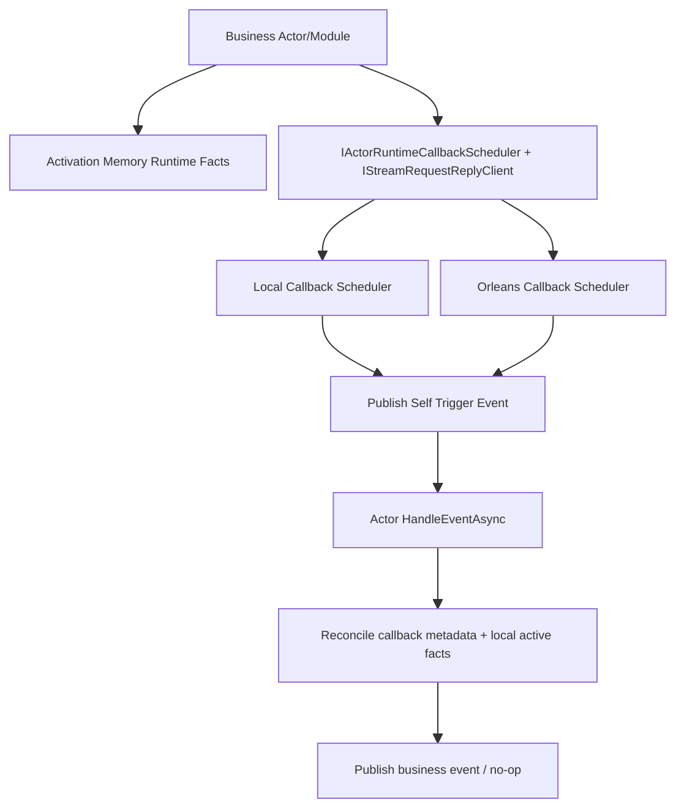

# Actor Runtime 流式回调与 Request/Reply 能力重构蓝图（v5, Volatile Runtime Revision）

## 1. 文档元信息
1. 状态：`Revised`
2. 版本：`v5`
3. 日期：`2026-03-06`
4. 决策级别：`Architecture Breaking Change`
5. 本版修正：
   - 撤回“把 callback runtime facts 写入 business actor event-sourced state”的设计。
   - 统一改为：`business state event-sourced`，`runtime callback coordination volatile`。

## 2. 核心决策（冻结）
1. `Runtime.Callbacks` 保留，作为 runtime 统一延迟/超时/timer/request-reply 能力抽象。
2. `scheduler` 的交付事实由后端自己负责：
   - `Local` 可纯内存。
   - `Orleans Dedicated` 可借助 grain state/reminder 保证交付。
3. `business actor` 不把 timeout/retry/wait/session 这类运行时协调事实写进自己的 event-sourced `State`。
4. `business actor runtime coordination` 只保留在 activation 内存：
   - activation 丢失
   - grain deactivation / re-activation
   - 节点重启 / rebalance
   都视为 in-flight runtime 放弃，不做恢复。
5. fired callback 必须自描述，至少带齐：
   - `callback_id`
   - `generation`
   - `fire_index`
   - `fired_at_utc`
   - 业务相关键（如 `run_id / step_id / session_id / attempt`）
6. 业务推进唯一入口仍是 Actor `HandleEventAsync` 主流程；回调线程/定时器线程只发信号。

## 3. 为什么这样修正

### 3.1 不再把 runtime facts 塞进 event-sourced state
1. 这类事实变化频繁：timeout arm/cancel、retry backoff、pending waiter、watchdog。
2. 如果全部写进 business actor 的 event-sourced state，会带来：
   - 事件流噪音增大
   - snapshot 写放大
   - 业务事实与技术协调事实混层
3. 对当前系统更合理的分界是：
   - `业务事实` 进 event sourcing
   - `runtime coordination` 留在 activation 内存
   - `scheduler delivery` 由 runtime backend 自己保证

### 3.2 为什么“消息带着信息回来”是正确方向
1. fired callback 如果足够自描述，actor 可以只依赖当前 activation 的本地活跃态完成对账。
2. 这样不需要为 runtime callback coordination 引入第二套持久 business state。
3. 代价是显式接受 `volatile execution`：activation 一丢，运行态就丢。

## 4. 范围与非范围

### 4.1 范围
1. 上提 timeout/timer/request-reply 到 Runtime + Abstractions。
2. 保留 `callback lease / generation / fire_index / backend` 作为统一调度契约。
3. workflow 与 scripting 调用侧统一改为：
   - activation 内存运行态
   - fired callback 强校验
4. 引入门禁，阻止回归第二套 `Task.Delay` 路径和弱 metadata 校验。

### 4.2 非范围
1. 不建设“可恢复工作流运行态”。
2. 不把 pending timeout/retry/session 事实放进 business actor state。
3. 不为 activation 丢失后的 in-flight runtime 提供自动恢复。

## 5. 架构硬约束（必须满足）
1. 回调只发信号：回调线程不得直接推进业务分支。
2. 业务推进内聚：成功/失败/重试/超时只在 Actor 事件处理流程内完成。
3. 显式对账：fired callback 必须至少命中 `callback_id + generation`；缺 metadata 一律丢弃。
4. volatile runtime 明确化：
   - actor activation runtime facts 不持久
   - activation 丢失后，晚到 callback 只能 `no-op`
5. 业务 `run_id / callback_id` 不得复用，避免 activation 丢失后的晚到事件误命中新运行。
6. 禁止为了 runtime callback coordination 向 business actor 的 event-sourced `State` 引入大块技术状态。

## 6. 目标架构总览

## 7. 抽象层契约（保留）
1. `IActorRuntimeCallbackScheduler`
2. `RuntimeCallbackTimeoutRequest`
3. `RuntimeCallbackTimerRequest`
4. `RuntimeCallbackLease`
5. `RuntimeCallbackMetadataKeys`
6. `IStreamRequestReplyClient`
7. `StreamRequestReplyRequest<TResponse>`

### 7.1 契约语义
1. 同一 `actor_id + callback_id` 重复注册必须产生递增 `generation`。
2. `CancelAsync(RuntimeCallbackLease lease)` 使用 lease/CAS 语义。
3. `RuntimeCallbackLease.Backend` 是取消路由的权威事实。
4. fired callback 必须带：
   - `callback_id`
   - `generation`
   - `fire_index`
   - `fired_at_utc`
5. 业务侧事件还应带最小充分相关键：
   - `run_id`
   - `step_id`
   - `session_id`
   - `attempt / step_run_key`
   视场景选择。

## 8. Runtime 实现矩阵

### 8.1 Local Runtime
1. 使用进程内 scheduler。
2. 到期只发 self 事件，不直接推进业务。
3. 进程重启任务丢失可接受。
4. business actor activation memory 丢失后，晚到 callback 直接丢弃。

### 8.2 Orleans Runtime
1. `Inline`：当前 grain turn 内 timer。
2. `Dedicated`：`RuntimeCallbackSchedulerGrain` + timer/reminder。
3. `Auto`：短延时 inline，长延时 dedicated。
4. reminder/grain state 只解决“callback 能不能送达”，不解决“业务 actor runtime 是否恢复”。
5. 如果 business actor activation 已变更，哪怕 reminder 还会投递，actor 也应把命不中本地活跃态的 callback 当作 stale/no-op。
6. 禁止保留第二套 `Task.Delay` 业务重试路径。

## 9. 可靠性交付模型

### 9.1 交付语义
1. callback delivery 语义：`at-least-once`
2. business effect 语义：依赖 actor 内对账达到 `effectively-once`

### 9.2 volatile execution 语义
1. activation 存活期间：
   - 本地 runtime facts 有效
   - callback 可正常对账
2. activation 丢失后：
   - 本地 runtime facts 清空
   - in-flight timeout/retry/wait/watchdog 视为放弃
   - 晚到 callback 必须 `no-op`
3. 这不是 bug，而是显式设计选择。

## 10. 业务侧最小内存事实模型
1. `WorkflowLoopModule`：
   - `run_id -> current_step / current_input / retry_attempt / active lease`
2. `WaitSignalModule`：
   - `run_id + signal_name + step_id -> waiter`
3. `LLMCallModule`：
   - `session_id -> pending request / watchdog lease`
4. `DelayModule`：
   - `run_id + step_id -> pending delay`
5. `ScriptRuntimeGAgent`：
   - `request_id -> pending definition query`

这些事实都只存在 activation 内存，不进入 event-sourced business state。

## 11. fired callback 消息设计要求
1. timeout/retry/timer fired 事件必须带足够业务相关键。
2. 如果某个模块希望减少本地缓存，可让 fired 事件携带继续业务所需的最小业务载荷。
3. 但 fired 事件再完整，也不能替代“当前 activation 的活跃态”校验。
4. 所以最终判定规则仍是：
   - metadata 命中
   - 本地活跃态命中
   - 两者都命中才推进业务

## 12. 治理与门禁
1. 必须新增或补强以下守卫：
   - runtime callback 主链禁止回退到 `Task.Delay` 第二路径
   - fired callback 缺 `callback_id/generation` 时必须被测试覆盖并拒绝推进业务
   - business actor 不得再次把 runtime callback coordination 写进 event-sourced state
2. 必测场景：
   - Orleans `Auto` 模式长延时 dedicated callback cancel 正确命中
   - InMemory stale cancel 不误删新 generation
   - activation 内存事实清空后，晚到 callback `no-op`
   - workflow/script 都使用统一的 strict metadata 校验器

## 13. 当前实现与目标的偏差（2026-03-06）
1. 已做对：
   - `Runtime.Callbacks` 命名收敛
   - Orleans cancel 以 `lease.Backend` 路由
   - InMemory stale cancel 竞态修复
2. 仍未做完：
   - `RuntimeActorGrain` 仍有 `Task.Delay` retry 第二路径
   - workflow/script fired callback 仍多为弱 generation 校验
   - workflow 偏 volatile、script 偏 persisted，语义没有统一

## 14. 最终决策
1. 不把 callback runtime coordination 写进 business actor event-sourced state。
2. 明确采用 `volatile runtime`。
3. scheduler correctness 和 fired callback 自描述是主线；state 恢复不是主线。
4. 如果未来确实需要“可恢复工作流运行态”，应单独引入 `run actor / execution actor`，而不是把当前这批技术事实继续塞进现有 business actor state。
