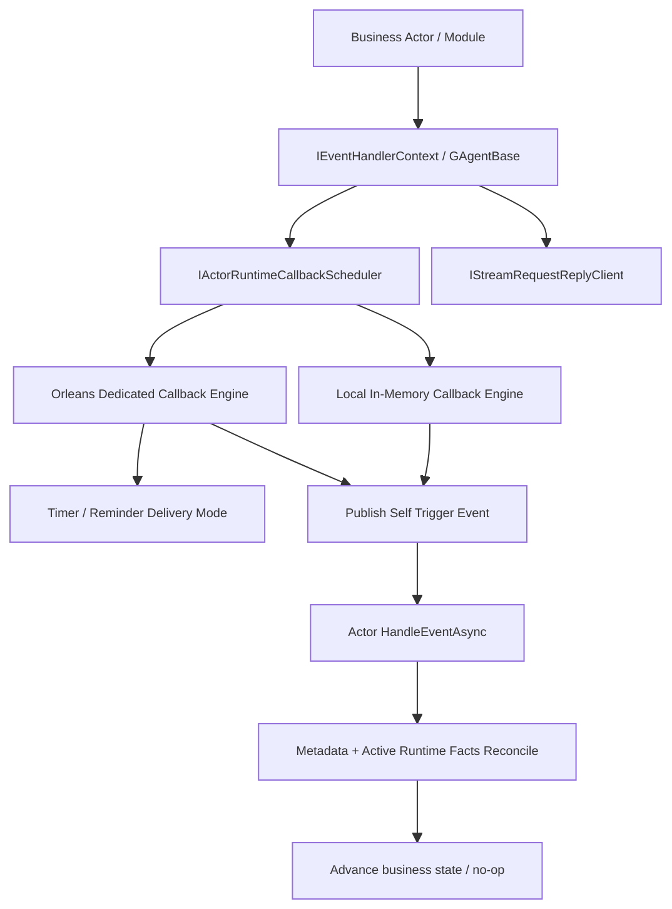

# Actor Runtime 流式回调与 Request/Reply 能力重构蓝图（v7, Durable-Only Public Callback Revision）

## 1. 文档元信息
1. 状态：`Revised`
2. 版本：`v7`
3. 日期：`2026-03-06`
4. 决策级别：`Architecture Breaking Change`
5. 本版结论：
   - 公共 callback contract 只保留 `Durable`。
   - 删除公共 `TurnBound` 暴露，不再让业务模块显式选择 inline grain-turn 语义。
   - `TurnBound` 若未来再次出现，只能以 Orleans 内部实现手段或场景化内部端口出现，不能重新作为通用业务 API 暴露。

## 2. 决策摘要（冻结）
1. 公共回调接口统一收口为 `IActorRuntimeCallbackScheduler`，其语义固定为 `durable callback scheduling`。
2. `IEventHandlerContext` 与 `GAgentBase` 只保留 durable 调度方法：
   - `ScheduleSelfDurableTimeoutAsync(...)`
   - `ScheduleSelfDurableTimerAsync(...)`
   - `CancelDurableCallbackAsync(...)`
3. 删除公共 `TurnBound` API、公共 kind/type tag、公共 DI 注册，以及 Orleans 的公共 turn-bound wrapper。
4. Orleans 对外只暴露 dedicated callback engine；内部是否采用 timer / reminder 属于基础设施后端策略，不属于业务语义。
5. 业务层与 workflow/script/runtime retry 统一只依赖 durable callback，不再感知 inline turn 绑定、`AsyncLocal` binding、或 Orleans activation 上下文。

## 3. 为什么改成 Durable-Only

### 3.1 真实调用面已经证明：公共层只需要 Durable
1. 当前真实业务调用都属于正确性路径：
   - workflow timeout / retry backoff / delay / wait_signal timeout
   - LLM watchdog timeout
   - runtime delayed retry
   - scripting definition query timeout
2. 这些路径一旦丢调度，结果不是“体验差一点”，而是业务推进会停住或丢失。
3. 因此它们都必须走 durable 语义，而不应该让调用侧再决定“是不是 turn-bound”。

### 3.2 TurnBound 在当前代码里没有真实业务 caller
1. 此次重构前，`TurnBound` 只出现在：
   - 公共帮助方法
   - 公共上下文接口
   - Orleans 包装器和测试壳
2. workflow / scripting / runtime correctness 主链没有真实业务调用它。
3. 继续保留这层公共能力，只会让抽象比真实需求更宽，违反“删除优于兼容”“不保留无效层”。

### 3.3 单一签名承载两种语义会迫使下层“动态猜测”
1. 旧设计的问题不是“实现里少了一个 if”，而是同一个 `ScheduleTimeoutAsync(...)` 同时承载：
   - 脱离当前 turn 的 durable 语义
   - 依赖当前 grain turn binding 的 turn-bound 语义
2. 只要两者继续共用一套公共签名，下层就只能根据“当前上下文是否还活着”去动态猜。
3. 这正是之前 Orleans retry 路径出现 bug 的根因：绑定一离开作用域，调度语义就错了。

## 4. 最终公共架构

## 5. 公共抽象层契约（保留）
1. `IActorRuntimeCallbackScheduler`
2. `RuntimeCallbackTimeoutRequest`
3. `RuntimeCallbackTimerRequest`
4. `RuntimeCallbackLease`
5. `RuntimeCallbackMetadataKeys`
6. `IStreamRequestReplyClient`
7. `StreamRequestReplyRequest<TResponse>`

### 5.1 公共契约语义
1. 所有公共 callback 调度都按 durable 解释。
2. 调度器必须能在脱离当前 actor/grain turn 的情况下工作。
3. `lease.Backend` 仍是取消路由的权威事实。
4. fired callback 仍必须至少携带：
   - `callback_id`
   - `generation`
   - `fire_index`
   - `fired_at_utc`
5. 业务模块仍必须提供最小充分相关键，如：
   - `run_id`
   - `step_id`
   - `session_id`
   - `attempt`

## 6. 被删除的公共能力
1. `TurnBoundCallbackSchedulerKind`
2. `DurableCallbackSchedulerKind`
3. `IActorRuntimeCallbackScheduler<TKind>`
4. `IEventHandlerContext.ScheduleSelfTurnBound*`
5. `IEventHandlerContext.CancelTurnBoundCallbackAsync`
6. `GAgentBase.ScheduleSelfTurnBound*`
7. `GAgentBase.CancelTurnBoundCallbackAsync`
8. `OrleansActorRuntimeTurnBoundCallbackScheduler`

## 7. Runtime 实现矩阵

### 7.1 Local Runtime
1. 继续使用进程内 callback engine。
2. 公开语义仍是 durable，但在 Local 下其实现可以完全是内存内的。
3. 对业务来说，Local 与 Orleans 共享同一套公共契约，不暴露不同模式。

### 7.2 Orleans Runtime
1. 公共调度统一通过 dedicated callback engine 完成。
2. dedicated engine 由 `IRuntimeCallbackSchedulerGrain` 承载。
3. delivery mode 只保留：
   - `Timer`
   - `Reminder`
   - `Auto`
4. `Timer / Reminder / Auto` 仅是 Orleans 基础设施后端策略，不是业务 API 语义。
5. runtime delayed retry 显式走 dedicated durable path，不再存在 turn-bound 逃逸问题。

## 8. 业务使用规则
1. 以下场景一律使用公共 durable callback：
   - workflow delay
   - workflow timeout
   - retry backoff
   - wait_signal timeout
   - LLM watchdog timeout
   - runtime delayed retry
   - scripting request/query timeout
2. 这些路径的共同特征是：
   - 会跨出当前 handler/turn
   - 丢调度会影响业务正确性
3. 业务模块不应也不再需要知道：
   - 当前是否还在 grain turn 内
   - Orleans activation 是否仍绑定某个 inline scheduler
   - 当前后端是 timer 还是 reminder

## 9. 关于“如果以后真有轻量场景怎么办”

### 9.1 当前项目里唯一说得过去的未来场景
1. 最接近真实需求的是：`RoleGAgent` 流式输出到 AGUI / ProjectionSession / SSE/WS 的微批量合并。
2. 当前链路已经存在：
   - `RoleGAgent` 持续发布 `TextMessageContentEvent`
   - workflow projection 把 AGUI 事件映射为 `WorkflowRunEvent`
   - `ProjectionSessionEventHub` 将事件投递到 live session stream
   - `WorkflowRunOutputStreamer` 一条条推到 SSE / WS
3. 如果未来需要 `20ms ~ 40ms` 级别的 UI flush 节流，那是“展示体验优化”，不是业务事实推进。

### 9.2 这类场景也不应该重新暴露通用 TurnBound
1. 未来如果真做这件事，对上层暴露的应该是语义端口，例如：
   - `IStreamingFlushScheduler`
   - `IRoleOutputBatcher`
   - `IProjectionLiveOutputCoalescer`
2. Orleans 版实现内部可以选择 inline timer 或其他更轻量机制。
3. 但这不应该重新演化成：
   - 公共 `TurnBound` callback API
   - 公共 `ScheduleSelfTurnBoundTimeoutAsync(...)`
4. 原因很简单：上层需要的是“flush / batch / coalesce”语义，不是“grain turn binding”语义。

## 10. Request/Reply 能力与本次重构的边界
1. `IStreamRequestReplyClient` 保持不变。
2. request/reply 的能力上提与 callback durable-only 收口不冲突。
3. request/reply 的 timeout 若需要 runtime callback 参与，也统一走 durable callback。

## 11. 实施结果（本轮重构）
1. 公共 callback 接口已收口为 durable-only。
2. `IEventHandlerContext` / `GAgentBase` 的 `TurnBound` API 已删除。
3. Orleans 公共 turn-bound wrapper 与其公共 DI 注册已删除。
4. 旧的 inline binding wrapper / wrapper test 已移除。
5. Orleans runtime retry 继续只走 durable dedicated scheduler。

## 12. 验证要求
1. `dotnet build aevatar.slnx --nologo`
2. `dotnet test test/Aevatar.Foundation.Runtime.Hosting.Tests/Aevatar.Foundation.Runtime.Hosting.Tests.csproj --nologo`
3. `dotnet test test/Aevatar.Foundation.Core.Tests/Aevatar.Foundation.Core.Tests.csproj --nologo`
4. `dotnet test test/Aevatar.Scripting.Core.Tests/Aevatar.Scripting.Core.Tests.csproj --nologo`
5. `dotnet test test/Aevatar.Workflow.Core.Tests/Aevatar.Workflow.Core.Tests.csproj --nologo`
6. `bash tools/ci/test_stability_guards.sh`

## 13. 最终决策
1. 当前项目公共层只需要 `Durable` callback capability。
2. `TurnBound` 不是当前系统已证明需要的公共能力。
3. 上层业务模块不需要知道 `TurnBound`，也不应知道 Orleans inline grain-turn 细节。
4. 若未来出现真正合理的“轻量会话编排/展示节流”需求，应新增场景化语义端口，由 Orleans 内部自行决定实现手段，而不是恢复通用 `TurnBound` API。
