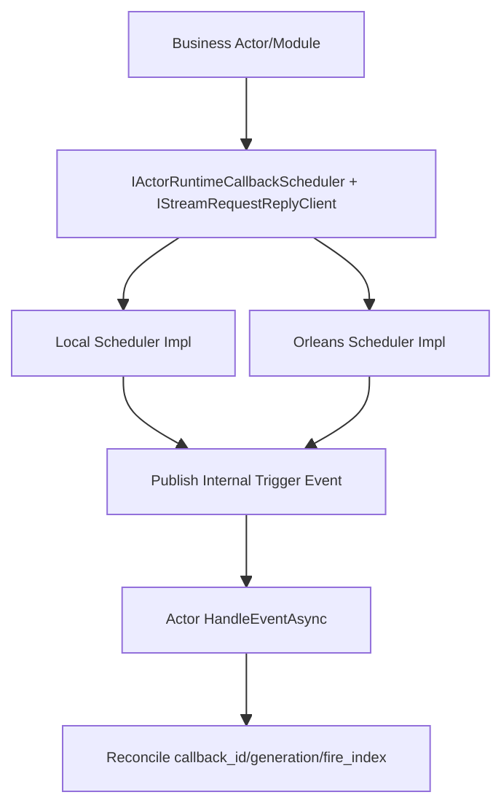

# Actor Runtime 流式回调与 Request/Reply 能力重构蓝图（v4, Zero-Compatibility）

## 1. 文档元信息
1. 状态：`Implemented`
2. 版本：`v4`
3. 日期：`2026-03-05`
4. 决策级别：`Architecture Breaking Change`
5. 目标：
   1. 将 stream request/reply、timeout、timer 统一上提到 Actor Runtime。
   2. 将契约统一放入 `Aevatar.Foundation.Abstractions`，实现放入 `Aevatar.Foundation.Runtime.*`。
   3. 保证 `Local` 与 `Orleans` 契约一致、实现机制不同。

## 2. 核心决策（冻结）
1. `Orleans` 不走“业务线程回调模型”；使用 Orleans 原生调度能力（grain turn + grain timer，持久场景用 reminder 能力）。
2. `Local` 可使用基础设施线程调度循环，但线程只发内部触发事件，不直接推进业务。
3. 业务推进唯一入口是 Actor `HandleEventAsync` 主流程。
4. 调度交付语义定义为 `at-least-once`，通过 `callback_id + generation + fire_index` 达到业务 `effectively-once`。
5. 无兼容双轨：删除旧 helper 与重复实现。

## 3. 背景与当前基线（代码事实）
1. 旧 request/reply helper 在 CQRS 抽象层：
   1. `src/Aevatar.CQRS.Core.Abstractions/Streaming/EventStreamQueryReplyAwaiter.cs`
2. 调用方位于 Scripting 基础设施：
   1. `src/Aevatar.Scripting.Infrastructure/Ports/RuntimeScriptQueryClient.cs`
3. 业务侧散落 timeout/watchdog 实现：
   1. `src/workflow/Aevatar.Workflow.Core/Modules/WorkflowLoopModule.cs`
   2. `src/workflow/Aevatar.Workflow.Core/Modules/WaitSignalModule.cs`
   3. `src/workflow/Aevatar.Workflow.Core/Modules/LLMCallModule.cs`
   4. `src/Aevatar.Scripting.Core/ScriptRuntimeGAgent.cs`
4. Orleans 版本：
   1. `Microsoft.Orleans 10.0.1`（`Directory.Packages.props`）

## 4. 范围与非范围
### 4.1 范围
1. 上提 timeout/timer/request-reply 到 Runtime + Abstractions。
2. 引入统一调度事实模型（callback lease / generation / status）。
3. 迁移 Workflow 与 Scripting 目标调用方。
4. 删除 CQRS 层旧 helper。
5. 引入守卫，阻止回归散落 `Task.Run + Task.Delay`。

### 4.2 非范围
1. 不重写业务事件领域语义。
2. 不在 API 层增加事实缓存。
3. 不保留向后兼容壳层。

## 5. 架构硬约束（必须满足）
1. 回调只发信号：回调上下文不得直接推进业务分支。
2. 业务推进内聚：成功/失败/重试只在 Actor 事件处理主流程完成。
3. 显式对账：内部触发事件必须携带 `callback_id + generation`，Actor 必须校验。
4. 事实源唯一：
   1. Orleans 生产语义下，调度事实以持久态为唯一权威。
   2. Local 调度状态仅为开发态临时事实，不可外溢为生产语义。
5. 中间层不得新增 `actor/run/session -> context` 事实字典。

## 6. 目标架构总览

## 7. 抽象层契约（Abstractions）
### 7.1 必须新增
1. `IActorRuntimeCallbackScheduler`
2. `RuntimeCallbackTimeoutRequest`
3. `RuntimeCallbackTimerRequest`
4. `RuntimeCallbackLease`
5. `RuntimeCallbackStatus`
6. `IStreamRequestReplyClient`
7. `StreamRequestReplyRequest<TResponse>`
8. `RuntimeCallbackMetadataKeys`

### 7.2 契约语义
1. 同一 `actor_id + callback_id` 重复注册必须产生递增 `generation`。
2. `CancelAsync(RuntimeCallbackLease lease)` 使用 lease/CAS 语义，取消路由必须由 lease 中记录的调度后端决定。
3. `RuntimeCallbackLease` 必须至少携带：
   1. `actor_id`
   2. `callback_id`
   3. `generation`
   4. `backend`
4. 触发事件必须携带：
   1. `callback_id`
   2. `generation`
   3. `fire_index`（timer）
   4. `fired_at_utc`
5. request/reply 异常语义分离：
   1. 取消 -> `OperationCanceledException`
   2. 超时 -> `TimeoutException`

## 8. Runtime 实现矩阵（契约一致，机制不同）
### 8.1 Local Runtime
1. 使用进程内调度器管理到期任务。
2. 到期只发布内部触发事件到 Actor Self Stream。
3. 不在调度线程内执行业务逻辑。
4. 进程重启任务丢失可接受（开发态语义）。
5. InMemory `CancelAsync` 必须满足 generation 条件删除；旧 lease 取消不得误删新 generation callback。

### 8.2 Orleans Runtime
1. 双策略并存：
   1. `Inline`：在 `RuntimeActorGrain` 当前 turn 内直接 `RegisterGrainTimer`，无额外 grain hop。
   2. `Dedicated`：通过 `RuntimeCallbackSchedulerGrain` 调度，适用于非当前 turn/跨上下文调用。
2. 策略选择（已落地为可配置算法）：
   1. `RuntimeCallbackSchedulingMode=ForceInline`：
      1. 必须命中当前 actor turn 绑定（`actor_id` 一致），否则直接抛错（不静默降级）。
   2. `RuntimeCallbackSchedulingMode=ForceDedicated`：
      1. 永远走 dedicated grain，即使当前 turn 已绑定。
   3. `RuntimeCallbackSchedulingMode=Auto`（默认）：
      1. 若命中 turn 绑定且 `due_time <= RuntimeCallbackInlineMaxDueTimeMs`（默认 `60000`）则走 `Inline`。
      2. 其余情况走 `Dedicated`。
3. Orleans `CancelAsync` 必须以 `RuntimeCallbackLease.Backend` 为唯一路由依据，禁止根据“当前是否存在 inline binding”猜测 callback 所在位置。
4. Dedicated 交付模式（timer/reminder）同样可配置：
   1. `RuntimeCallbackDedicatedDeliveryMode=Timer`：强制 timer。
   2. `RuntimeCallbackDedicatedDeliveryMode=Reminder`：强制 reminder。
   3. `RuntimeCallbackDedicatedDeliveryMode=Auto`（默认）：
      1. 当 `due_time` 或 `period` 大于等于 `RuntimeCallbackReminderThresholdMs`（默认 `300000`）时用 reminder。
      2. 否则用 timer。
5. Reminder provider 自动装配（已落地）：
   1. `PersistenceBackend=InMemory`：`UseInMemoryReminderService()`。
   2. `PersistenceBackend=Garnet`：`UseRedisReminderService()`，连接串复用 `GarnetConnectionString`。
6. 禁止把 `Task.Run + Task.Delay` 作为 Orleans 业务调度主路径。
7. 回调运行在 grain turn 语义中，但仍只发内部事件。

### 8.3 Timer vs Reminder 选型边界（强制）
1. `GrainTimer`：
   1. 适用激活生命周期内调度。
   2. 不保证跨停机恢复。
2. `Reminder`：
   1. 适用跨激活/重启后仍需触发。
   2. 需配合持久状态处理重复触发与补偿。

## 9. 可靠性交付模型与竞态裁决
### 9.1 交付语义
1. 内部触发事件交付语义定义为 `at-least-once`。
2. 业务侧必须通过对账做到 `effectively-once`。

### 9.2 状态机（调度事实）
1. `Scheduled`
2. `Canceled`
3. `Fired`（one-shot）
4. `Active`（periodic）
5. `Completed`（业务确认结束）

### 9.3 竞态规则（必须写死）
1. `Cancel` 与 `Fired` 并发：
   1. 以 `generation` + CAS 判定；不匹配一律拒绝。
2. 触发晚到：
   1. 若 `generation` 过期，丢弃并计数 `dropped_stale_total`。
3. 重复触发：
   1. 同 `callback_id + generation + fire_index` 仅第一次生效。
4. tombstone：
   1. 取消记录保留一个可配置窗口，防止延迟事件复活。

## 10. 时间语义与时钟策略
1. 统一使用 `UTC` 记录事实时间（`scheduled_at_utc`、`fired_at_utc`）。
2. 本地等待使用单调时钟差值避免系统时间回拨影响。
3. 长停顿（GC pause/节点抖动）后策略必须可配置：
   1. `skip_missed`
   2. `coalesce_to_one`
   3. `catch_up`
4. 默认推荐：
   1. one-shot：`coalesce_to_one`
   2. periodic：`skip_missed` + 记录 `late_fire_ms`

## 11. 容量治理与背压
1. 配额维度：
   1. 每 actor 最大活跃 callback 数
   2. 每租户最大活跃 callback 数
   3. 全局最大活跃 callback 数
2. 超限策略：
   1. 拒绝新建（返回可观测错误码）
   2. 非关键 timer 降级
3. 防风暴策略：
   1. 批量到期抖动（jitter）
   2. 最大并发触发限制
4. reply stream 限流：
   1. 限制并发请求数
   2. 超限时快速失败

## 12. 可观测性与 SLO
### 12.1 必须指标
1. `runtime_callback_scheduled_total`
2. `runtime_callback_fired_total`
3. `runtime_callback_canceled_total`
4. `runtime_callback_dropped_stale_total`
5. `runtime_callback_cancel_race_total`
6. `runtime_callback_late_fire_ms`
7. `stream_request_reply_inflight`
8. `stream_request_reply_timeout_total`
9. `stream_request_reply_orphan_reply_total`

### 12.2 日志字段
1. `actor_id`
2. `callback_id`
3. `generation`
4. `fire_index`
5. `request_id`
6. `correlation_id`

### 12.3 SLO（建议初始值）
1. timeout 触发成功率 >= 99.9%
2. stale 丢弃率可解释且稳定
3. orphan reply stream 长时间堆积为 0

## 13. Stream Request/Reply 生命周期治理
1. 删除旧类：
   1. `src/Aevatar.CQRS.Core.Abstractions/Streaming/EventStreamQueryReplyAwaiter.cs`
2. 新增：
   1. `IStreamRequestReplyClient`（Abstractions）
   2. `RuntimeStreamRequestReplyClient`（Runtime）
3. 生命周期要求：
   1. reply stream 订阅必须 `await using` 自动释放。
   2. 查询完成后执行显式回收（结合 `IStreamLifecycleManager`）。
   3. 超时/取消都必须回收。
4. 孤儿回复治理：
   1. 记录 orphan 指标。
   2. 提供周期性清理任务。

## 14. 协议演进与滚动升级
1. 内部触发事件新增 `schema_version`。
2. 升级策略：
   1. 新版本先兼容读取旧版本。
   2. 全量切换后再删除旧字段。
3. 由于本次为 zero-compatibility 重构，仓内实现允许直接迁移，不保留旧契约转发层。

## 15. 测试与门禁要求
1. 必须覆盖：
   1. `Auto` 模式长延时 callback 返回 `Dedicated` lease，且取消时按 lease 后端命中 dedicated。
   2. InMemory 路径下旧 lease 取消不会误删新 generation callback。
   3. callback 触发事件包含完整 reconciliation metadata。
2. 必须通过：
   1. `dotnet build aevatar.slnx --nologo`
   2. `bash tools/ci/architecture_guards.sh`
   3. `bash tools/ci/test_stability_guards.sh`

## 16. 当前实现落点（2026-03-06）
1. 抽象层命名已从 `Runtime.Async` 收敛到 `Runtime.Callbacks`。
2. 对外取消契约已从参数式 `actorId + callbackId + generation` 收敛为 `RuntimeCallbackLease`。
3. `RuntimeCallbackLease` 已显式携带 `Backend`，作为取消路由的权威事实。
4. Orleans `Auto` 模式下的 dedicated callback 取消已修复为按 lease 后端路由。
5. InMemory scheduler 已修复旧 lease cancel 误删新 generation 的 compare/remove 竞态。
