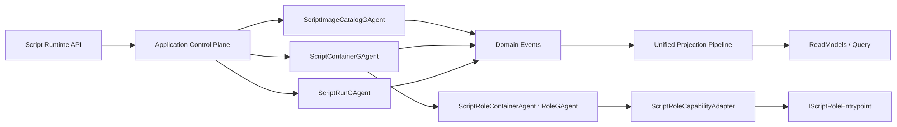

# AI Script Runtime 架构实施变更文档（Best Implementation v1.1）

## 1. 文档元信息
- 状态：Planned
- 版本：v1.1
- 日期：2026-02-28
- 适用分支：`feat/dynamic-gagent-script-runtime`
- 目标：在不依赖 `src/workflow/*` 的前提下，落地 Docker 语义对齐的 AI Script Runtime，并复用 `RoleGAgent` 执行内核
- 上位蓝图：`docs/architecture/dynamic-gagent-csharp-script-runtime-requirements.md`

## 2. 最终决策（ADR 摘要）

### ADR-1：脚本能力接入采用 Adapter-only（冻结）
1. 仅允许脚本实现 `IScriptRoleEntrypoint`。
2. 禁止脚本直接继承 `RoleGAgent`/`AIGAgentBase<TState>`。
3. 平台通过 `ScriptRoleCapabilityAdapter` 映射脚本能力到 `IRoleAgent`。

### ADR-2：执行面复用 RoleGAgent
1. 平台宿主为 `ScriptRoleContainerAgent : RoleGAgent`。
2. 脚本不接管 Actor 生命周期，只提供能力快照。
3. 宿主仍遵守 `GAgentBase<TState>` 事件溯源模型。

### ADR-3：控制面自建，语义对齐 Docker
1. `Image`：不可变构建产物（digest）。
2. `Container`：基于 image digest 运行的实例。
3. `Exec Session`：容器内一次运行会话（run_id）。
4. `Registry`：tag/digest 解析与存储。

### ADR-4：事实源坚持 Actor 化
1. `Image/Container/Run` 事实分别由 Actor 持有。
2. 中间层禁止 `id -> context` 事实态映射。
3. 回调线程只发内部事件，不直接改运行态。

### ADR-5：一致性策略采用“幂等键 + 乐观并发 + 显式冲突码”
1. 所有写接口必须接收 `Idempotency-Key`。
2. 所有可覆盖语义必须接收并校验 `If-Match` 版本。
3. 冲突必须返回领域冲突码，不允许隐式覆盖。

### ADR-6：沙箱策略必须接口化并可执行验证
1. 沙箱策略不是原则文本，必须以接口合同 + 测试门禁落地。
2. 编译、装载、执行、网络、资源配额必须分别可替换且可测。

## 3. 口径一致性修复（Blocking Fix）

### 3.1 单一口径
1. 本文与上位蓝图统一为 `Adapter-only`。
2. `Native + Adapter` 双模式定义被废弃，不再进入 WBS 与验收矩阵。

### 3.2 文档一致性守卫（新增）
1. 新增脚本：`tools/ci/architecture_doc_consistency_guards.sh`。
2. 守卫规则：
- 若实施文档出现 `Adapter-only`，则需求文档不得出现 `Native 模式`。
- 若任一文档出现 `双模式契约`，CI 失败。

## 4. 基线与差距（与代码现状对照）

### 4.1 已有可复用能力
1. `IRoleAgent` 契约：`src/Aevatar.AI.Abstractions/Agents/IRoleAgent.cs`。
2. `RoleGAgent` 执行能力：`src/Aevatar.AI.Core/RoleGAgent.cs`。
3. `AIGAgentBase<TState>` 组合能力：`src/Aevatar.AI.Core/AIGAgentBase.cs`。
4. `GAgentBase<TState>` 事件溯源恢复：`src/Aevatar.Foundation.Core/GAgentBase.TState.cs`。

### 4.2 当前缺口
1. 无 `Image/Container/Run` 领域 Actor 与事件。
2. 无脚本编译、审计、缓存、执行基础设施。
3. 无 Script Runtime 独立 API 与 Query 模型。
4. 无 Adapter-only 的强制治理与测试门禁。

## 5. 目标架构（To-Be）


## 6. 领域模型与权威状态归属

### 6.1 Image 领域
1. Actor：`ScriptImageCatalogGAgent`。
2. 状态：
- `images[image_name][digest]`
- `tags[image_name][tag] -> digest`
- `image_versions[image_name]`
3. 事件：
- `ScriptImageBuiltEvent`
- `ScriptImagePublishedEvent`
- `ScriptImageDeprecatedEvent`
- `ScriptImageRevokedEvent`

### 6.2 Container 领域
1. Actor：`ScriptContainerGAgent`（一容器一 actor）。
2. 状态：
- `container_id`
- `image_digest`
- `runtime_profile`
- `status`
- `role_actor_id`
- `resource_quota_snapshot`
3. 事件：
- `ScriptContainerCreatedEvent`
- `ScriptContainerStartedEvent`
- `ScriptContainerStoppedEvent`
- `ScriptContainerDestroyedEvent`

### 6.3 Run 领域
1. Actor：`ScriptRunGAgent`（一 run 一 actor）。
2. 状态：
- `run_id`
- `container_id`
- `status`
- `result/error`
- `started_at/completed_at`
3. 事件：
- `ScriptRunStartedEvent`
- `ScriptRunCompletedEvent`
- `ScriptRunFailedEvent`
- `ScriptRunCanceledEvent`
- `ScriptRunTimedOutEvent`

## 7. 一致性、幂等与冲突协议（接口级）

### 7.1 幂等键规范
1. 写 API 必须携带 `Idempotency-Key`（HTTP Header）。
2. 幂等窗口默认 24h，可配置。
3. 同 key + 同请求体重复调用返回首次结果。
4. 同 key + 不同请求体返回 `IDEMPOTENCY_PAYLOAD_MISMATCH`。

### 7.2 乐观并发规范
1. 对 tag 覆盖、container 状态迁移等写操作必须携带 `If-Match`。
2. 版本不匹配返回 `VERSION_CONFLICT`。
3. 所有状态变更返回新 `ETag`。

### 7.3 冲突错误码（固定）
1. `IMAGE_TAG_CONFLICT`
2. `IMAGE_NOT_PUBLISHED`
3. `CONTAINER_STATE_CONFLICT`
4. `RUN_ALREADY_TERMINAL`
5. `IDEMPOTENCY_PAYLOAD_MISMATCH`
6. `VERSION_CONFLICT`

### 7.4 必须落地的接口合同
```csharp
public interface IIdempotencyPort
{
    Task<IdempotencyAcquireResult> AcquireAsync(string scope, string key, byte[] requestHash, CancellationToken ct);
    Task CommitAsync(string scope, string key, byte[] responseHash, CancellationToken ct);
}

public interface IConcurrencyTokenPort
{
    Task<ConcurrencyCheckResult> CheckAndAdvanceAsync(string aggregateId, string expectedVersion, CancellationToken ct);
}

public interface IImageReferenceResolver
{
    Task<ImageDigestResolveResult> ResolveAsync(string imageName, string tagOrDigest, CancellationToken ct);
}
```

## 8. RoleGAgent 复用与 Adapter 注入

### 8.1 平台宿主 Agent
1. `ScriptRoleContainerAgent : RoleGAgent`。
2. 状态：`ScriptRoleContainerState`（digest、entrypoint、capability_hash）。
3. 事件：`ConfigureScriptRoleCapabilitiesEvent`。

### 8.2 注入流程
1. Container Start -> 创建/激活 `ScriptRoleContainerAgent`。
2. Adapter 从 artifact 实例化 `IScriptRoleEntrypoint`。
3. Adapter 生成 `ScriptRoleCapabilitySnapshot`。
4. 宿主 Agent 通过事件应用：
- `RoleAgentConfig`
- 工具定义（`IScriptToolFactory` -> `IAgentTool`）
- Hook 策略（白名单）

### 8.3 约束
1. 脚本不得直接调用 `SetModules`。
2. 脚本不得直接操作 `IActorRuntime`。
3. 所有脚本能力输出必须可序列化并入状态。

## 9. 编译、装载与沙箱技术合同（可执行级）

### 9.1 强制接口
```csharp
public interface IScriptCompilationPolicy
{
    IReadOnlySet<string> AllowedReferences { get; }
    IReadOnlySet<string> BlockedNamespacePrefixes { get; }
    Task<PolicyValidationResult> ValidateAsync(ScriptSourceBundle bundle, CancellationToken ct);
}

public interface IScriptAssemblyLoadPolicy
{
    Task<ScriptAssemblyHandle> LoadAsync(CompiledScriptArtifact artifact, CancellationToken ct);
    Task<UnloadResult> UnloadAsync(ScriptAssemblyHandle handle, TimeSpan timeout, CancellationToken ct);
}

public interface IScriptSandboxPolicy
{
    Task<SandboxPrepareResult> PrepareAsync(ScriptExecutionContext context, CancellationToken ct);
}

public interface IScriptResourceQuotaPolicy
{
    Task<ResourceQuotaDecision> EvaluateAsync(ScriptExecutionContext context, CancellationToken ct);
}

public interface IScriptNetworkPolicy
{
    Task<NetworkAccessDecision> AuthorizeAsync(ScriptNetworkRequest request, CancellationToken ct);
}
```

### 9.2 装载与卸载硬约束
1. 采用可回收 `AssemblyLoadContext`（collectible=true）。
2. run 完成后必须触发卸载流程。
3. 卸载超时必须告警并标记容器为 `DEGRADED`。

### 9.3 安全硬约束
1. 默认拒绝文件系统写入与进程创建。
2. 默认拒绝出站网络，按 `IScriptNetworkPolicy` 放行。
3. 禁止反射访问平台私有核心服务。

## 10. API 变更设计（含一致性字段）

### 10.1 Command API
1. `POST /api/script-runtime/images:build`
2. `POST /api/script-runtime/images/{imageName}/tags/{tag}:publish`
3. `POST /api/script-runtime/containers:create`
4. `POST /api/script-runtime/containers/{containerId}:start`
5. `POST /api/script-runtime/containers/{containerId}/exec`
6. `POST /api/script-runtime/runs/{runId}:cancel`
7. `POST /api/script-runtime/containers/{containerId}:stop`
8. `DELETE /api/script-runtime/containers/{containerId}`

### 10.2 一致性 Header 约定
1. 所有写接口：`Idempotency-Key` 必填。
2. 覆盖类写接口：`If-Match` 必填。
3. 所有写响应：返回 `ETag`。

### 10.3 Query API
1. `GET /api/script-runtime/images/{imageName}/tags/{tag}`
2. `GET /api/script-runtime/images/{imageName}/digests/{digest}`
3. `GET /api/script-runtime/containers/{containerId}`
4. `GET /api/script-runtime/containers/{containerId}/runs`
5. `GET /api/script-runtime/runs/{runId}`

## 11. 分阶段实施包（WBS）

### WP-1（P0）：Contracts + Core Skeleton
1. 新建 `Abstractions/Core`。
2. 落地 Image/Container/Run 事件与状态。
3. 新建三类 GAgent 骨架。

### WP-2（P0）：RoleGAgent 复用 + Adapter-only
1. 新增 `ScriptRoleContainerAgent : RoleGAgent`。
2. 新增 `IScriptRoleEntrypoint` + `ScriptRoleCapabilityAdapter`。
3. 落地 capability snapshot 事件与状态应用。

### WP-3（P0）：一致性协议（幂等 + 并发）
1. 落地 `IIdempotencyPort` 与 `IConcurrencyTokenPort`。
2. API 接入 `Idempotency-Key/If-Match/ETag`。
3. 固化冲突错误码并补测试。

### WP-4（P0）：Compiler + Sandbox + Registry
1. 落地编译器端口与实现。
2. 落地 5 个沙箱策略接口与默认实现。
3. 落地 registry 与 digest 解析。

### WP-5（P1）：Application + API
1. 新增应用服务（Image/Container/Run）。
2. 新增 capability endpoint。
3. 接入默认 host 组合扩展。

### WP-6（P1）：Projection + Query
1. 新增 `Aevatar.AI.Script.Projection`。
2. 落地 reducer/projector/read model。
3. 接入统一 projection pipeline。

### WP-7（P1）：Guards + Tests + SLO
1. 新增 script 架构守卫与文档一致性守卫。
2. 新增 replay/adapter/sandbox 合同测试。
3. 新增性能与可用性验收门槛。

## 12. 文件级变更清单（首批）

### 12.1 新增目录
1. `src/Aevatar.AI.Script.Abstractions/`
2. `src/Aevatar.AI.Script.Core/`
3. `src/Aevatar.AI.Script.Application/`
4. `src/Aevatar.AI.Script.Infrastructure/`
5. `src/Aevatar.AI.Script.Projection/`
6. `test/Aevatar.AI.Script.Core.Tests/`
7. `test/Aevatar.AI.Script.Infrastructure.Tests/`
8. `test/Aevatar.AI.Script.Host.Api.Tests/`

### 12.2 修改现有装配点
1. `src/Aevatar.Bootstrap/Hosting/WebApplicationBuilderExtensions.cs`（新增 Script Runtime capability 装配入口）
2. `aevatar.slnx`（纳入新项目）
3. `tools/ci/architecture_guards.sh`（新增 script->workflow 与中间层映射守卫）
4. `tools/ci/solution_split_guards.sh`（加入 script 子解）
5. `tools/ci/solution_split_test_guards.sh`（加入 script 子解测试）
6. `tools/ci/architecture_doc_consistency_guards.sh`（新增）

## 13. 测试与验收矩阵（含性能/可用性）

| 目标 | 命令 | 通过标准 |
|---|---|---|
| 架构守卫 | `bash tools/ci/architecture_guards.sh` | 无 script->workflow 依赖、无中间层事实态映射 |
| 文档一致性守卫 | `bash tools/ci/architecture_doc_consistency_guards.sh` | `Adapter-only` 口径无冲突 |
| 分片构建 | `bash tools/ci/solution_split_guards.sh` | 含 script 子解构建通过 |
| 分片测试 | `bash tools/ci/solution_split_test_guards.sh` | 含 script 子解测试通过 |
| 稳定性守卫 | `bash tools/ci/test_stability_guards.sh` | 无违规轮询等待 |
| Script Core | `dotnet test test/Aevatar.AI.Script.Core.Tests/Aevatar.AI.Script.Core.Tests.csproj --nologo` | replay 合同通过 |
| Script Infra | `dotnet test test/Aevatar.AI.Script.Infrastructure.Tests/Aevatar.AI.Script.Infrastructure.Tests.csproj --nologo` | 编译/沙箱/缓存测试通过 |
| Script API | `dotnet test test/Aevatar.AI.Script.Host.Api.Tests/Aevatar.AI.Script.Host.Api.Tests.csproj --nologo` | 生命周期 API 测试通过 |
| 性能基线 | `bash tools/ci/script_runtime_perf_guards.sh` | P95 `exec start` < 200ms；P95 首 token < 800ms |
| 可用性基线 | `bash tools/ci/script_runtime_availability_guards.sh` | 30 分钟稳定性场景成功率 >= 99.5% |
| 故障恢复 | `bash tools/ci/script_runtime_resilience_guards.sh` | 强制 cancel/timeout/actor restart 后状态一致 |

## 14. SLO 与容量门槛（上线前必须达标）

| 指标 | 门槛 |
|---|---|
| `exec_start_latency_p95` | < 200ms |
| `first_token_latency_p95` | < 800ms |
| `run_success_rate_30m` | >= 99.5% |
| `container_reclaim_time_p95` | < 5s |
| `script_alc_unload_success_rate` | >= 99.9% |

## 15. 发布与迁移策略
1. 阶段 1（影子发布）：开放 image build/publish + 只读 query。
2. 阶段 2（受控运行）：开放 container create/start/exec，仅 allowlist 租户。
3. 阶段 3（全面放开）：默认 capability 打开并发布迁移指南。
4. 回滚策略：按 capability 开关禁用写接口；保留 image/container/run 审计事实。

## 16. 风险与缓解
1. 风险：脚本越权。
- 缓解：接口化沙箱策略 + 默认拒绝网络 + 资源配额。

2. 风险：并发冲突导致状态漂移。
- 缓解：`Idempotency-Key + If-Match + ETag + 固定冲突码`。

3. 风险：adapter 行为漂移。
- 缓解：`IRoleAgent` 合同测试 + golden snapshot 回归。

4. 风险：容器泄漏。
- 缓解：ALC 可回收 + 强制卸载 + 回收时间门槛。

## 17. 完成定义（DoD）
1. Script Runtime 不依赖 workflow 即可独立运行。
2. 执行面复用 `RoleGAgent` 且脚本仅通过 Adapter 注入能力。
3. Image/Container/Run 事实可回放恢复。
4. 幂等、并发冲突、错误码协议已落地并通过测试。
5. 沙箱 5 策略接口已落地并通过安全测试。
6. API、Projection、测试、门禁、SLO 全部达标。

## 18. 执行清单
- [ ] WP-1 Contracts + Core Skeleton
- [ ] WP-2 RoleGAgent Reuse + Adapter-only
- [ ] WP-3 Consistency Protocol
- [ ] WP-4 Compiler + Sandbox + Registry
- [ ] WP-5 Application + API
- [ ] WP-6 Projection + Query
- [ ] WP-7 Guards + Tests + SLO

## 19. 当前快照（2026-02-28）
- 已完成：实施文档修订到 v1.1（修复口径冲突、并发协议、沙箱合同、SLO 验收缺口）。
- 未完成：代码实施与测试落地。
- 当前阻塞：无。
