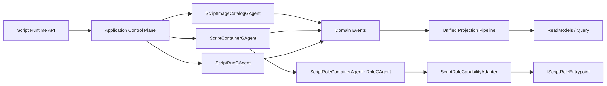

# AI Script Runtime 架构实施变更文档（Best Implementation）

## 1. 文档元信息
- 状态：Planned
- 版本：v1.0
- 日期：2026-02-28
- 适用分支：`feat/dynamic-gagent-script-runtime`
- 目标：在不依赖 `src/workflow/*` 的前提下，落地 Docker 语义对齐的 AI Script Runtime，并复用 `RoleGAgent` 执行内核

## 2. 最终决策（ADR 摘要）

### ADR-1：脚本能力接入采用 Adapter-only
1. P0 仅允许脚本实现 `IScriptRoleEntrypoint`。
2. 禁止脚本直接继承 `RoleGAgent`/`AIGAgentBase<TState>`。
3. 平台侧通过 `ScriptRoleCapabilityAdapter` 把脚本能力映射到 `IRoleAgent` 能力。

### ADR-2：执行面复用 RoleGAgent
1. 新增平台宿主 `ScriptRoleContainerAgent : RoleGAgent`。
2. 脚本行为不接管 Actor 生命周期，只通过事件配置注入能力。
3. `ScriptRoleContainerAgent` 仍遵守 `GAgentBase<TState>` 事件溯源模型。

### ADR-3：控制面自建，语义对齐 Docker
1. `Image` 对应不可变构建产物（digest）。
2. `Container` 对应运行实例（生命周期独立）。
3. `Exec Session` 对应一次执行会话（run_id）。
4. `Registry` 对应 image 存储与 tag/digest 解析。

### ADR-4：事实源坚持 Actor 化
1. `Image/Container/Run` 事实分别由 Actor 持有。
2. 中间层禁止进程内 `id -> context` 事实态映射。
3. 回调线程只发内部事件，不直接改运行态。

## 3. 基线与差距（与代码现状对照）

### 3.1 已有可复用能力
1. `IRoleAgent` 契约已稳定：`src/Aevatar.AI.Abstractions/Agents/IRoleAgent.cs`。
2. `RoleGAgent` 已实现流式文本与 tool call 事件：`src/Aevatar.AI.Core/RoleGAgent.cs`。
3. `AIGAgentBase<TState>` 已具备 LLM/Tool/Hook/Middleware 主干：`src/Aevatar.AI.Core/AIGAgentBase.cs`。
4. `GAgentBase<TState>` 已强制事件溯源恢复：`src/Aevatar.Foundation.Core/GAgentBase.TState.cs`。

### 3.2 当前缺口
1. 无 `Image/Container/Run` 专用领域模型与 Actor。
2. 无脚本编译、审计、缓存、执行基础设施。
3. 无 Script Runtime 独立 API 与 Query 模型。
4. 无“RoleGAgent 复用 + Script Adapter”实施层。

## 4. 目标架构（To-Be）

## 5. 目标项目结构与依赖约束

### 5.1 新增项目
1. `src/Aevatar.AI.Script.Abstractions`
2. `src/Aevatar.AI.Script.Core`
3. `src/Aevatar.AI.Script.Application`
4. `src/Aevatar.AI.Script.Infrastructure`
5. `src/Aevatar.AI.Script.Projection`
6. `src/Aevatar.AI.Script.Host.Api`（可选；也可作为 capability 挂到现有 host）

### 5.2 依赖约束
1. `Aevatar.AI.Script.*` 禁止引用 `src/workflow/*`。
2. `Core` 仅依赖 `Abstractions + Foundation.Abstractions/Core + AI.Abstractions/Core`。
3. `Application` 仅依赖抽象端口。
4. `Infrastructure` 提供编译/执行/registry 具体实现。
5. `Host` 只做 API 协议适配与 DI 组合。

## 6. 领域模型与事件合同

### 6.1 Image 领域
1. Actor：`ScriptImageCatalogGAgent`。
2. 状态建议：
- `images[image_name][digest]`
- `tags[image_name][tag] -> digest`
- `status`
3. 关键事件：
- `ScriptImageBuiltEvent`
- `ScriptImagePublishedEvent`
- `ScriptImageDeprecatedEvent`
- `ScriptImageRevokedEvent`

### 6.2 Container 领域
1. Actor：`ScriptContainerGAgent`（一容器一 actor）。
2. 状态建议：
- `container_id`
- `image_digest`
- `runtime_profile`
- `status`
- `role_actor_id`
3. 关键事件：
- `ScriptContainerCreatedEvent`
- `ScriptContainerStartedEvent`
- `ScriptContainerStoppedEvent`
- `ScriptContainerDestroyedEvent`

### 6.3 Run 领域
1. Actor：`ScriptRunGAgent`（一 run 一 actor，推荐）。
2. 状态建议：
- `run_id`
- `container_id`
- `status`
- `result/error`
3. 关键事件：
- `ScriptRunStartedEvent`
- `ScriptRunCompletedEvent`
- `ScriptRunFailedEvent`
- `ScriptRunCanceledEvent`
- `ScriptRunTimedOutEvent`

## 7. RoleGAgent 复用实施方案（关键）

### 7.1 平台宿主 Agent
1. 新增 `ScriptRoleContainerAgent : RoleGAgent`。
2. 新增状态 `ScriptRoleContainerState`（绑定 digest、entrypoint、capability hash）。
3. 新增事件 `ConfigureScriptRoleCapabilitiesEvent`。

### 7.2 Adapter 注入流程
1. Container Start 时，`ScriptContainerGAgent` 创建/激活 `ScriptRoleContainerAgent` 子 actor。
2. `ScriptRoleCapabilityAdapter` 从 image artifact 实例化 `IScriptRoleEntrypoint`。
3. Adapter 输出 `ScriptRoleCapabilitySnapshot`。
4. `ScriptRoleContainerAgent` 落事件并应用：
- `RoleAgentConfig`（Provider/Model/SystemPrompt 等）
- 工具声明（通过平台 `IScriptToolFactory` 生成 `IAgentTool` 并注册）
- 可选 Hook 策略（仅白名单）

### 7.3 约束
1. 脚本不得直接调用 `SetModules` 改写核心模块链路。
2. 脚本不得直接操作 ActorRuntime。
3. 脚本输出能力必须可序列化为 snapshot 并入状态事实。

## 8. 编译与运行时实施

### 8.1 Build Pipeline
1. 源码标准化（换行、编码、引用排序）。
2. 安全审计（语法 + 语义）。
3. Roslyn 编译生成 artifact。
4. 计算 digest（源码 + manifest + compiler version + policy profile）。
5. 写入 registry。

### 8.2 Runtime Pipeline
1. `Container:start` 拉取 digest 对应 artifact。
2. 构建实例级 IoC 子容器。
3. 初始化 `ScriptRoleContainerAgent` 并注入 capability snapshot。
4. `exec` 触发 run actor 与上行事件。

### 8.3 缓存策略
1. 编译缓存键：`digest`。
2. 运行缓存键：`container_id + digest`。
3. 回收策略：LRU + 引用计数 + TTL。

## 9. API 变更设计

### 9.1 Command API
1. `POST /api/script-runtime/images:build`
2. `POST /api/script-runtime/images/{imageName}/tags/{tag}:publish`
3. `POST /api/script-runtime/containers:create`
4. `POST /api/script-runtime/containers/{containerId}:start`
5. `POST /api/script-runtime/containers/{containerId}/exec`
6. `POST /api/script-runtime/runs/{runId}:cancel`
7. `POST /api/script-runtime/containers/{containerId}:stop`
8. `DELETE /api/script-runtime/containers/{containerId}`

### 9.2 Query API
1. `GET /api/script-runtime/images/{imageName}/tags/{tag}`
2. `GET /api/script-runtime/images/{imageName}/digests/{digest}`
3. `GET /api/script-runtime/containers/{containerId}`
4. `GET /api/script-runtime/containers/{containerId}/runs`
5. `GET /api/script-runtime/runs/{runId}`

## 10. 分阶段实施包（WBS）

### WP-1（P0）：Contracts + Core Skeleton
1. 新建 `Abstractions/Core` 项目。
2. 落地 Image/Container/Run proto、事件与状态。
3. 新建三类 GAgent 骨架。

### WP-2（P0）：RoleGAgent 复用与 Adapter
1. 新增 `ScriptRoleContainerAgent : RoleGAgent`。
2. 新增 `IScriptRoleEntrypoint` 与 `ScriptRoleCapabilityAdapter`。
3. 落地 capability snapshot 事件与状态应用。

### WP-3（P0）：Compiler + Sandbox + Registry
1. 新增脚本编译器端口与实现。
2. 新增安全审计器与白名单策略。
3. 新增 artifact registry 端口与实现。

### WP-4（P1）：Application + API
1. 新增应用服务（Image/Container/Run）。
2. 新增独立 capability endpoint。
3. 接入默认 host 组合扩展。

### WP-5（P1）：Projection + Query
1. 新增 `Aevatar.AI.Script.Projection`。
2. 落地 reducer/projector/read model。
3. 接入统一 projection pipeline。

### WP-6（P1）：Guards + Tests
1. 新增架构守卫（script 项目禁依赖 workflow）。
2. 新增 replay 合同测试（Image/Container/Run）。
3. 新增 adapter compatibility tests（`IRoleAgent` 能力合同）。

## 11. 文件级变更清单（首批）

### 11.1 新增目录（建议）
1. `src/Aevatar.AI.Script.Abstractions/`
2. `src/Aevatar.AI.Script.Core/`
3. `src/Aevatar.AI.Script.Application/`
4. `src/Aevatar.AI.Script.Infrastructure/`
5. `src/Aevatar.AI.Script.Projection/`
6. `test/Aevatar.AI.Script.Core.Tests/`
7. `test/Aevatar.AI.Script.Infrastructure.Tests/`
8. `test/Aevatar.AI.Script.Host.Api.Tests/`

### 11.2 需要修改的现有装配点（建议）
1. `src/Aevatar.Bootstrap/Hosting/WebApplicationBuilderExtensions.cs`（新增 Script Runtime capability 装配入口）
2. `aevatar.slnx`（纳入新项目）
3. `tools/ci/architecture_guards.sh`（新增 script->workflow 依赖守卫）
4. `tools/ci/solution_split_guards.sh`（加入 script 子解）

## 12. 测试与验收矩阵

| 目标 | 命令 | 通过标准 |
|---|---|---|
| 架构守卫 | `bash tools/ci/architecture_guards.sh` | 无 script->workflow 依赖、无中间层事实态映射 |
| 分片构建 | `bash tools/ci/solution_split_guards.sh` | 含 script 子解构建通过 |
| 分片测试 | `bash tools/ci/solution_split_test_guards.sh` | 含 script 子解测试通过 |
| 稳定性守卫 | `bash tools/ci/test_stability_guards.sh` | 无违规轮询等待 |
| Script Core | `dotnet test test/Aevatar.AI.Script.Core.Tests/Aevatar.AI.Script.Core.Tests.csproj --nologo` | replay 合同通过 |
| Script Infra | `dotnet test test/Aevatar.AI.Script.Infrastructure.Tests/Aevatar.AI.Script.Infrastructure.Tests.csproj --nologo` | 编译/沙箱/缓存测试通过 |
| Script API | `dotnet test test/Aevatar.AI.Script.Host.Api.Tests/Aevatar.AI.Script.Host.Api.Tests.csproj --nologo` | 生命周期 API 测试通过 |

## 13. 发布与迁移策略
1. 第 1 阶段（影子发布）：只开放 image build/publish 与只读 query。
2. 第 2 阶段（受控运行）：开放 container create/start/exec，仅 allowlist 租户。
3. 第 3 阶段（全面放开）：开启默认 capability，并发布迁移指南。
4. 回滚策略：按 capability 开关禁用 API；保留 image 与审计事实，阻断新 exec。

## 14. 风险与缓解
1. 风险：脚本越权。
- 缓解：发布前语义审计 + 运行时资源限额 + 默认网络拒绝。

2. 风险：adapter 漂移导致行为不一致。
- 缓解：`IRoleAgent` 合同测试 + golden snapshot 回归。

3. 风险：容器泄漏。
- 缓解：容器生命周期 hook + 强制异步 dispose + 指标告警。

4. 风险：形成第二投影系统。
- 缓解：CI 守卫禁止旁路 readmodel 写入。

## 15. 完成定义（DoD）
1. Script Runtime 不依赖 workflow 项目即可独立运行。
2. 执行面复用 `RoleGAgent` 且脚本仅通过 adapter 注入能力。
3. Image/Container/Run 事实可回放恢复。
4. 动态 IoC 子容器隔离成立，无跨容器污染。
5. API、Projection、测试、门禁全部通过。

## 16. 执行清单
- [ ] WP-1 Contracts + Core Skeleton
- [ ] WP-2 RoleGAgent Reuse + Adapter
- [ ] WP-3 Compiler + Sandbox + Registry
- [ ] WP-4 Application + API
- [ ] WP-5 Projection + Query
- [ ] WP-6 Guards + Tests

## 17. 当前快照（2026-02-28）
- 已完成：实施方案定稿（Adapter-only + RoleGAgent 执行复用）。
- 未完成：代码实施与测试落地。
- 当前阻塞：无。
