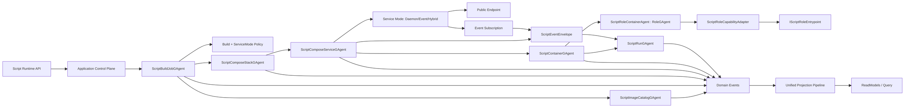
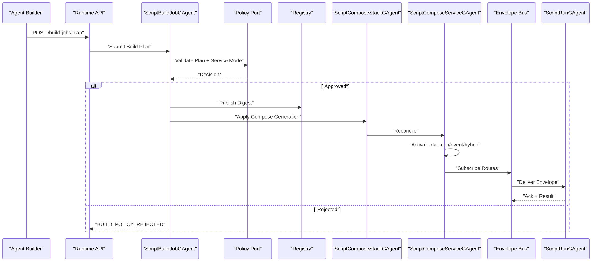

# AI Script Runtime 架构实施变更文档（Best Implementation v1.4）

## 1. 文档元信息
- 状态：Planned
- 版本：v1.4
- 日期：2026-02-28
- 适用分支：`feat/dynamic-gagent-script-runtime`
- 目标：在不依赖 `src/workflow/*` 的前提下，落地 Docker + Compose + Autonomous Build 语义对齐的 AI Script Runtime，复用 `RoleGAgent` 执行内核，并以 Actor 树 + Event Envelope 完成动态编排
- 上位蓝图：`docs/architecture/dynamic-gagent-csharp-script-runtime-requirements.md`

## 2. 最终决策（ADR 摘要）

### ADR-1：脚本能力接入采用 Adapter-only（冻结）
1. 仅允许脚本实现 `IScriptRoleEntrypoint`。
2. 禁止脚本直接继承 `RoleGAgent`/`AIGAgentBase<TState>`。
3. 平台通过 `ScriptRoleCapabilityAdapter` 映射脚本能力到 `IRoleAgent`。

### ADR-2：执行面复用 RoleGAgent
1. 平台宿主为 `ScriptRoleContainerAgent : RoleGAgent`。
2. 脚本不接管 Actor 生命周期，只提供能力快照。
3. 宿主仍遵守 `GAgentBase<TState>` 事件溯源模型。

### ADR-3：控制面自建，语义对齐 Docker
1. `Image`：不可变构建产物（digest）。
2. `Container`：基于 image digest 运行的实例。
3. `Exec Session`：容器内一次运行会话（run_id）。
4. `Registry`：tag/digest 解析与存储。

### ADR-4：事实源坚持 Actor 化
1. `Image/Compose/Service/Container/Run` 事实分别由 Actor 持有。
2. 中间层禁止 `id -> context` 事实态映射。
3. 回调线程只发内部事件，不直接改运行态。

### ADR-5：一致性策略采用“幂等键 + 乐观并发 + 显式冲突码”
1. 所有写接口必须接收 `Idempotency-Key`。
2. 所有可覆盖语义必须接收并校验 `If-Match` 版本。
3. 冲突必须返回领域冲突码，不允许隐式覆盖。

### ADR-6：沙箱策略必须接口化并可执行验证
1. 沙箱策略不是原则文本，必须以接口合同 + 测试门禁落地。
2. 编译、装载、执行、网络、资源配额必须分别可替换且可测。

### ADR-7：Host 承载策略采用 capability-only（冻结）
1. P0/P1 仅允许通过 `Aevatar.Bootstrap` capability 装配接入 Script Runtime。
2. 不创建独立 `Script Host API` 交付面，避免同版本双承载形态分叉。
3. 若后续需要独立 Host，必须新增 ADR 并在单一版本中明确唯一模式。

### ADR-8：编排策略采用 Script Compose + Actor 树收敛（冻结）
1. 编排单位为 `Compose Stack`，以声明式 spec 定义服务树。
2. 运行时由 `desired_generation -> observed_generation` 的 reconcile 流程收敛，不使用命令式串行工作流。
3. 跨 service/instance 消息统一走 `Event Envelope`，禁止服务间直接持有对方运行态引用。

### ADR-9：Autonomous Build Operator 受策略门禁约束（冻结）
1. 智能体可发起 `Plan -> Validate -> Approve -> Build -> Publish -> Deploy` 全流程。
2. 未通过策略校验的 build job 禁止进入 compose apply。
3. build 结果必须产出不可变 `image digest`，不得以 tag 直接发布到运行面。

### ADR-10：服务运行模式采用 daemon/event/hybrid 三态（冻结）
1. 每个 compose service 必须显式声明 `service_mode`。
2. daemon 模式负责长期对外服务，event 模式负责事件触发执行，hybrid 同时具备两种能力。
3. 模式切换必须通过 generation 变更收敛，不允许进程内直接热改事实态。

## 3. 口径一致性修复（Blocking Fix）

### 3.1 单一口径
1. 本文与上位蓝图统一为 `Adapter-only`。
2. `Native + Adapter` 双模式定义被废弃，不再进入 WBS 与验收矩阵。
3. 编排层口径统一为 `Compose + Actor Reconcile`，不引入 workflow 依赖。
4. 服务运行口径统一为 `daemon/event/hybrid`，自构建流程统一为 `build job` 闭环。

### 3.2 文档一致性守卫（新增）
1. 新增脚本：`tools/ci/architecture_doc_consistency_guards.sh`。
2. 守卫规则：
- 若实施文档出现 `Adapter-only`，则需求文档不得出现 `Native 模式`。
- 若任一文档出现 `双模式契约`，CI 失败。
- 若文档出现“独立 Host 可选”语义，CI 失败。

### 3.3 守卫资产落地状态（Closed）
1. 已落地 `tools/ci/architecture_doc_consistency_guards.sh`。
2. 已落地 `tools/ci/script_runtime_perf_guards.sh`。
3. 已落地 `tools/ci/script_runtime_availability_guards.sh`。
4. 已落地 `tools/ci/script_runtime_resilience_guards.sh`。

## 4. 基线与差距（与代码现状对照）

### 4.1 已有可复用能力
1. `IRoleAgent` 契约：`src/Aevatar.AI.Abstractions/Agents/IRoleAgent.cs`。
2. `RoleGAgent` 执行能力：`src/Aevatar.AI.Core/RoleGAgent.cs`。
3. `AIGAgentBase<TState>` 组合能力：`src/Aevatar.AI.Core/AIGAgentBase.cs`。
4. `GAgentBase<TState>` 事件溯源恢复：`src/Aevatar.Foundation.Core/GAgentBase.TState.cs`。

### 4.2 当前缺口
1. 无 `Image/Compose/Service/Container/Run` 领域 Actor 与事件。
2. 无脚本编译、审计、缓存、执行基础设施。
3. 无 Script Runtime 独立 API 与 Query 模型。
4. 无 Envelope 协议与路由端口。
5. 无 Autonomous Build Operator（plan/validate/approve/build/deploy）端口与事件。
6. 无 daemon/event/hybrid 运行模式治理与验收。
7. 无 Adapter-only 的强制治理与测试门禁。

## 5. 目标架构（To-Be）


### 5.1 主链路时序（Autonomous Build + Reconcile）


## 6. 领域模型与权威状态归属

### 6.1 Image 领域
1. Actor：`ScriptImageCatalogGAgent`。
2. 状态：
- `images[image_name][digest]`
- `tags[image_name][tag] -> digest`
- `image_versions[image_name]`
3. 事件：
- `ScriptImageBuiltEvent`
- `ScriptImagePublishedEvent`
- `ScriptImageDeprecatedEvent`
- `ScriptImageRevokedEvent`

### 6.2 Compose Stack 领域
1. Actor：`ScriptComposeStackGAgent`（一 stack 一 actor）。
2. 状态：
- `stack_id`
- `compose_spec_digest`
- `desired_generation`
- `observed_generation`
- `services[service_name]`
- `reconcile_status`
3. 事件：
- `ScriptComposeAppliedEvent`
- `ScriptComposeUpRequestedEvent`
- `ScriptComposeReconcileStartedEvent`
- `ScriptComposeConvergedEvent`
- `ScriptComposeDownRequestedEvent`
- `ScriptComposeFailedEvent`

### 6.3 Compose Service 领域
1. Actor：`ScriptComposeServiceGAgent`（一 service 一 actor）。
2. 状态：
- `stack_id`
- `service_name`
- `replicas_desired`
- `replicas_ready`
- `depends_on`
- `rollout_generation`
- `last_reconcile_result`
3. 事件：
- `ScriptComposeServiceScaledEvent`
- `ScriptComposeServiceInstanceStartedEvent`
- `ScriptComposeServiceInstanceStoppedEvent`
- `ScriptComposeServiceRolledOutEvent`
- `ScriptComposeServiceDependencyBlockedEvent`

### 6.4 Container 领域
1. Actor：`ScriptContainerGAgent`（一容器一 actor）。
2. 状态：
- `container_id`
- `stack_id/service_name`
- `image_digest`
- `runtime_profile`
- `status`
- `role_actor_id`
- `resource_quota_snapshot`
3. 事件：
- `ScriptContainerCreatedEvent`
- `ScriptContainerStartedEvent`
- `ScriptContainerStoppedEvent`
- `ScriptContainerDestroyedEvent`

### 6.5 Run 领域
1. Actor：`ScriptRunGAgent`（一 run 一 actor）。
2. 状态：
- `run_id`
- `stack_id/service_name/container_id`
- `status`
- `result/error`
- `started_at/completed_at`
3. 事件：
- `ScriptRunStartedEvent`
- `ScriptRunCompletedEvent`
- `ScriptRunFailedEvent`
- `ScriptRunCanceledEvent`
- `ScriptRunTimedOutEvent`

### 6.6 Build Job 领域
1. Actor：`ScriptBuildJobGAgent`（一 build job 一 actor）。
2. 状态：
- `build_job_id`
- `requested_by_agent_id`
- `target_stack_id/service_name`
- `build_plan_digest`
- `policy_decision`
- `result_image_digest`
- `status`
3. 事件：
- `ScriptBuildPlanSubmittedEvent`
- `ScriptBuildPolicyValidatedEvent`
- `ScriptBuildApprovedEvent`
- `ScriptBuildPublishedEvent`
- `ScriptBuildRolledBackEvent`

### 6.7 Service Mode 运行约束
1. `Daemon`：service actor 维持最小副本并对外提供 endpoint。
2. `Event`：service actor 仅在 envelope 到达后触发 run。
3. `Hybrid`：同一 service 同时维护 endpoint 与 event subscription。
4. 所有模式统一由 service actor 事实态驱动，不允许中间层进程内状态补丁。

## 7. 一致性、幂等与冲突协议（接口级）

### 7.1 幂等键规范
1. 写 API 必须携带 `Idempotency-Key`（HTTP Header）。
2. 幂等窗口默认 24h，可配置。
3. 同 key + 同请求体重复调用返回首次结果。
4. 同 key + 不同请求体返回 `IDEMPOTENCY_PAYLOAD_MISMATCH`。

### 7.2 乐观并发规范
1. 对 compose apply、tag 覆盖、service scale 等写操作必须携带 `If-Match`。
2. 版本不匹配返回 `VERSION_CONFLICT`。
3. 所有状态变更返回新 `ETag`。

### 7.3 冲突错误码（固定）
1. `IMAGE_TAG_CONFLICT`
2. `IMAGE_NOT_PUBLISHED`
3. `COMPOSE_SPEC_INVALID`
4. `COMPOSE_GENERATION_CONFLICT`
5. `SERVICE_DEPENDENCY_NOT_READY`
6. `SERVICE_MODE_CONFLICT`
7. `BUILD_POLICY_REJECTED`
8. `BUILD_APPROVAL_REQUIRED`
9. `CONTAINER_STATE_CONFLICT`
10. `RUN_ALREADY_TERMINAL`
11. `IDEMPOTENCY_PAYLOAD_MISMATCH`
12. `VERSION_CONFLICT`
13. `SCRIPT_EVENT_SOURCING_CONFLICT`
14. `SCRIPT_STATE_SCHEMA_CONFLICT`

### 7.4 脚本 Event Sourcing 约束（强制）
1. 脚本只能输出“副作用意图”（`custom_state`、read model 定义/关系/文档、发布 envelope），不能直接写平台存储。
2. `exec` 完成后必须先执行副作用一致性校验，再发布 run actor 事件，最后更新读侧快照（event-first）。
3. ReadModel 约束：
4. 定义必须包含 `key_field`，且 `indexes` 必须是 `fields` 子集。
5. relation 的 `from/to` read model 必须已存在（历史或本次定义），并且键字段必须在对应 `fields` 内。
6. document upsert 必须指向已定义 read model，`index_values` 键必须在该模型已声明索引中。
7. `custom_state` 采用单 `protobuf Any`，同一 service 在 run 内禁止类型漂移（`TypeUrl` 变更即冲突）。
8. 冲突统一失败为 `SCRIPT_EVENT_SOURCING_CONFLICT` / `SCRIPT_STATE_SCHEMA_CONFLICT`，run 状态转 `Failed`，禁止部分提交。

### 7.5 必须落地的接口合同
```csharp
public interface IIdempotencyPort
{
    Task<IdempotencyAcquireResult> AcquireAsync(string scope, string key, byte[] requestHash, CancellationToken ct);
    Task CommitAsync(string scope, string key, byte[] responseHash, CancellationToken ct);
}

public interface IConcurrencyTokenPort
{
    Task<ConcurrencyCheckResult> CheckAndAdvanceAsync(string aggregateId, string expectedVersion, CancellationToken ct);
}

public interface IImageReferenceResolver
{
    Task<ImageDigestResolveResult> ResolveAsync(string imageName, string tagOrDigest, CancellationToken ct);
}

public interface IScriptComposeSpecValidator
{
    Task<ComposeSpecValidationResult> ValidateAsync(ScriptComposeSpec spec, CancellationToken ct);
}

public interface IScriptComposeReconcilePort
{
    Task<ComposeReconcileResult> ReconcileAsync(string stackId, long desiredGeneration, CancellationToken ct);
}

public interface IAgentBuildPlanPort
{
    Task<BuildPlanResult> PlanAsync(BuildPlanRequest request, CancellationToken ct);
}

public interface IAgentBuildPolicyPort
{
    Task<BuildPolicyDecision> ValidateAsync(BuildPolicyRequest request, CancellationToken ct);
}

public interface IAgentBuildExecutionPort
{
    Task<BuildExecutionResult> ExecuteAsync(BuildExecutionRequest request, CancellationToken ct);
}
```

## 8. RoleGAgent 复用与 Adapter 注入

### 8.1 平台宿主 Agent
1. `ScriptRoleContainerAgent : RoleGAgent`。
2. 状态：`ScriptRoleContainerState`（digest、entrypoint、capability_hash）。
3. 事件：`ConfigureScriptRoleCapabilitiesEvent`。

### 8.2 注入流程
1. Container Start -> 创建/激活 `ScriptRoleContainerAgent`。
2. Adapter 从 artifact 实例化 `IScriptRoleEntrypoint`。
3. Adapter 生成 `ScriptRoleCapabilitySnapshot`。
4. 宿主 Agent 通过事件应用：
- `RoleAgentConfig`
- 工具定义（`IScriptToolFactory` -> `IAgentTool`）
- Hook 策略（白名单）

### 8.3 约束
1. 脚本不得直接调用 `SetModules`。
2. 脚本不得直接操作 `IActorRuntime`。
3. 所有脚本能力输出必须可序列化并入状态。

## 9. 编译、装载、沙箱与 Envelope 技术合同（可执行级）

### 9.1 强制接口
```csharp
public interface IScriptCompilationPolicy
{
    IReadOnlySet<string> AllowedReferences { get; }
    IReadOnlySet<string> BlockedNamespacePrefixes { get; }
    Task<PolicyValidationResult> ValidateAsync(ScriptSourceBundle bundle, CancellationToken ct);
}

public interface IScriptAssemblyLoadPolicy
{
    Task<ScriptAssemblyHandle> LoadAsync(CompiledScriptArtifact artifact, CancellationToken ct);
    Task<UnloadResult> UnloadAsync(ScriptAssemblyHandle handle, TimeSpan timeout, CancellationToken ct);
}

public interface IScriptSandboxPolicy
{
    Task<SandboxPrepareResult> PrepareAsync(ScriptExecutionContext context, CancellationToken ct);
}

public interface IScriptResourceQuotaPolicy
{
    Task<ResourceQuotaDecision> EvaluateAsync(ScriptExecutionContext context, CancellationToken ct);
}

public interface IScriptNetworkPolicy
{
    Task<NetworkAccessDecision> AuthorizeAsync(ScriptNetworkRequest request, CancellationToken ct);
}

public interface IEventEnvelopePublisherPort
{
    Task PublishAsync(ScriptEventEnvelope envelope, CancellationToken ct);
}

public interface IEventEnvelopeSubscriberPort
{
    Task<EnvelopeLeaseResult> SubscribeAsync(EnvelopeSubscribeRequest request, CancellationToken ct);
}

public interface IEventEnvelopeDedupPort
{
    Task<EnvelopeDedupResult> CheckAndRecordAsync(string scope, string dedupKey, TimeSpan ttl, CancellationToken ct);
}
```

### 9.2 装载与卸载硬约束
1. 采用可回收 `AssemblyLoadContext`（collectible=true）。
2. run 完成后必须触发卸载流程。
3. 卸载超时必须告警并标记容器为 `DEGRADED`。

### 9.3 安全硬约束
1. 默认拒绝文件系统写入与进程创建。
2. 默认拒绝出站网络，按 `IScriptNetworkPolicy` 放行。
3. 禁止反射访问平台私有核心服务。

### 9.4 Projection ownership/lifecycle 合同
1. Projection 会话必须通过显式 lease 句柄流转，禁止 `actor_id -> context` 反查模型。
2. 会话推进必须携带 `run_id + step_id + lease_id` 进行陈旧事件对账。
3. Checkpoint 提交与 lease 完成必须在 Actor 事件处理链路内确认。
4. 取消与超时只发布内部触发事件，最终状态推进由 Actor 串行处理。

```csharp
public interface IScriptProjectionSessionPort
{
    Task<ProjectionLeaseOpenResult> OpenAsync(ProjectionLeaseOpenRequest request, CancellationToken ct);
    Task<ProjectionLeaseRenewResult> RenewAsync(string leaseId, string expectedEtag, CancellationToken ct);
    Task<ProjectionLeaseCloseResult> CompleteAsync(string leaseId, string expectedEtag, CancellationToken ct);
    Task<ProjectionLeaseCloseResult> AbortAsync(string leaseId, string expectedEtag, string reason, CancellationToken ct);
}

public interface IScriptProjectionDispatchPort
{
    Task<ProjectionDispatchResult> DispatchAsync(
        string leaseId,
        string runId,
        string stepId,
        string eventTypeUrl,
        ReadOnlyMemory<byte> payload,
        CancellationToken ct);
}

public interface IScriptProjectionCheckpointPort
{
    Task<ProjectionCheckpointResult> CommitAsync(
        string leaseId,
        string streamId,
        long eventSequence,
        string expectedEtag,
        CancellationToken ct);
}
```

### 9.5 Event Envelope 硬约束
1. Envelope 必须包含 `trace_id/correlation_id/causation_id/dedup_key/type_url`。
2. Envelope 路由目标必须使用 `stack_id + service_name + instance_selector`，禁止运行时反查上下文字典。
3. 过期或陈旧 envelope 必须在 Actor 内显式拒绝，并记录拒绝事件。
4. 重试仅通过内部触发事件推进，不允许回调线程直接写状态。

### 9.6 Service Mode 与 Autonomous Build 合同
1. service mode 切换必须通过 compose generation 更新触发，不允许直接修改运行态。
2. daemon/hybrid 模式必须声明健康检查与最小副本门槛。
3. event/hybrid 模式必须声明 subscription 与并发上限。
4. build job 必须在策略通过后方可执行 publish/deploy。

```csharp
public interface IServiceModePolicyPort
{
    Task<ServiceModeDecision> ValidateAsync(ServiceModePolicyRequest request, CancellationToken ct);
}

public interface IBuildApprovalPort
{
    Task<BuildApprovalDecision> DecideAsync(BuildApprovalRequest request, CancellationToken ct);
}
```

## 10. API 变更设计（含一致性字段）

### 10.1 Command API
1. `POST /api/script-runtime/images:build`
2. `POST /api/script-runtime/images/{imageName}/tags/{tag}:publish`
3. `POST /api/script-runtime/build-jobs:plan`
4. `POST /api/script-runtime/build-jobs/{buildJobId}:validate`
5. `POST /api/script-runtime/build-jobs/{buildJobId}:approve`
6. `POST /api/script-runtime/build-jobs/{buildJobId}:execute`
7. `POST /api/script-runtime/build-jobs/{buildJobId}:rollback`
8. `POST /api/script-runtime/compose:apply`
9. `POST /api/script-runtime/compose/{stackId}:up`
10. `POST /api/script-runtime/compose/{stackId}:down`
11. `POST /api/script-runtime/compose/{stackId}/services/{serviceName}:scale`
12. `POST /api/script-runtime/compose/{stackId}/services/{serviceName}:rollout`
13. `POST /api/script-runtime/containers/{containerId}/exec`
   `exec` 请求体采用 `service_id + envelope`，`envelope` 为 `EventEnvelope`（protobuf JSON）；payload 业务语义在脚本内解析 `Any`，编排层不引入 `ScriptRoleRequest` 等中间语义模型。
14. `POST /api/script-runtime/runs/{runId}:cancel`
15. `POST /api/script-runtime/containers/{containerId}:stop`
16. `DELETE /api/script-runtime/containers/{containerId}`

### 10.2 一致性 Header 约定
1. 所有写接口：`Idempotency-Key` 必填。
2. 覆盖类写接口：`If-Match` 必填。
3. 所有写响应：返回 `ETag`。

### 10.3 Query API
1. `GET /api/script-runtime/images/{imageName}/tags/{tag}`
2. `GET /api/script-runtime/images/{imageName}/digests/{digest}`
3. `GET /api/script-runtime/compose/{stackId}`
4. `GET /api/script-runtime/compose/{stackId}/services`
5. `GET /api/script-runtime/compose/{stackId}/events`
6. `GET /api/script-runtime/build-jobs/{buildJobId}`
7. `GET /api/script-runtime/build-jobs`
8. `GET /api/script-runtime/containers/{containerId}`
9. `GET /api/script-runtime/containers/{containerId}/runs`
10. `GET /api/script-runtime/runs/{runId}`

## 11. 分阶段实施包（WBS）

### WP-1（P0）：Contracts + Core Skeleton
1. 新建 `Abstractions/Core`。
2. 落地 Image/BuildJob/Compose/Service/Container/Run 事件与状态。
3. 新建核心 GAgent 骨架。

### WP-2（P0）：RoleGAgent 复用 + Adapter-only
1. 新增 `ScriptRoleContainerAgent : RoleGAgent`。
2. 新增 `IScriptRoleEntrypoint` + `ScriptRoleCapabilityAdapter`。
3. 落地 capability snapshot 事件与状态应用。

### WP-3（P0）：一致性协议（幂等 + 并发）
1. 落地 `IIdempotencyPort` 与 `IConcurrencyTokenPort`。
2. API 接入 `Idempotency-Key/If-Match/ETag`。
3. 固化冲突错误码并补测试。

### WP-4（P0）：Compiler + Sandbox + Registry
1. 落地编译器端口与实现。
2. 落地 5 个沙箱策略接口与默认实现。
3. 落地 registry 与 digest 解析。

### WP-5（P0）：Compose Reconcile + Envelope
1. 新增 `ScriptComposeStackGAgent` 与 `ScriptComposeServiceGAgent`。
2. 落地 `IScriptComposeSpecValidator` 与 `IScriptComposeReconcilePort`。
3. 落地 Envelope 发布/订阅/去重端口与默认实现。

### WP-6（P0）：Autonomous Build Operator
1. 新增 `ScriptBuildJobGAgent` 与 build job 生命周期事件。
2. 落地 `IAgentBuildPlanPort/IAgentBuildPolicyPort/IAgentBuildExecutionPort`。
3. 落地 `IServiceModePolicyPort/IBuildApprovalPort` 并串接自动/人工批准分流。

### WP-7（P1）：Application + API
1. 新增应用服务（Image/BuildJob/Compose/Container/Run）。
2. 新增 build-job + compose lifecycle endpoint。
3. 仅接入现有 host 的 capability 组合扩展，不创建独立 Script Host。

### WP-8（P1）：Projection + Query
1. 新增 `Aevatar.AI.Script.Projection`。
2. 落地 reducer/projector/read model。
3. 接入统一 projection pipeline。

### WP-9（P1）：Guards + Tests + SLO
1. 新增 script 架构守卫与文档一致性守卫。
2. 新增 replay/adapter/sandbox/build/compose/envelope 合同测试。
3. 新增性能、可用性、韧性验收门槛。

## 12. 文件级变更清单（首批）

### 12.1 新增目录
1. `src/Aevatar.AI.Script.Abstractions/`
2. `src/Aevatar.AI.Script.Core/`
3. `src/Aevatar.AI.Script.Build/`
4. `src/Aevatar.AI.Script.Compose/`
5. `src/Aevatar.AI.Script.Application/`
6. `src/Aevatar.AI.Script.Infrastructure/`
7. `src/Aevatar.AI.Script.Projection/`
8. `test/Aevatar.AI.Script.Build.Tests/`
9. `test/Aevatar.AI.Script.Compose.Tests/`
10. `test/Aevatar.AI.Script.Core.Tests/`
11. `test/Aevatar.AI.Script.Infrastructure.Tests/`
12. `test/Aevatar.AI.Script.Hosting.Tests/`

### 12.2 修改现有装配点
1. `src/Aevatar.Bootstrap/Hosting/WebApplicationBuilderExtensions.cs`（新增 Script Runtime capability 装配入口）
2. `aevatar.slnx`（纳入新项目）
3. `tools/ci/architecture_guards.sh`（新增 script->workflow 与中间层映射守卫）
4. `tools/ci/solution_split_guards.sh`（加入 script 子解）
5. `tools/ci/solution_split_test_guards.sh`（加入 script 子解测试）
6. `tools/ci/architecture_doc_consistency_guards.sh`（新增）
7. `tools/ci/script_runtime_perf_guards.sh`（新增）
8. `tools/ci/script_runtime_availability_guards.sh`（新增）
9. `tools/ci/script_runtime_resilience_guards.sh`（新增）

## 13. 测试与验收矩阵（含性能/可用性）

| 目标 | 命令 | 通过标准 |
|---|---|---|
| 架构守卫 | `bash tools/ci/architecture_guards.sh` | 无 script->workflow 依赖、无中间层事实态映射 |
| 文档一致性守卫 | `bash tools/ci/architecture_doc_consistency_guards.sh` | `Adapter-only`、Compose、Host 策略口径无冲突 |
| 分片构建 | `bash tools/ci/solution_split_guards.sh` | 含 script 子解构建通过 |
| 分片测试 | `bash tools/ci/solution_split_test_guards.sh` | 含 script 子解测试通过 |
| 稳定性守卫 | `bash tools/ci/test_stability_guards.sh` | 无违规轮询等待 |
| Script Build | `dotnet test test/Aevatar.AI.Script.Build.Tests/Aevatar.AI.Script.Build.Tests.csproj --nologo` | build plan/policy/approval 合同通过 |
| Script Compose | `dotnet test test/Aevatar.AI.Script.Compose.Tests/Aevatar.AI.Script.Compose.Tests.csproj --nologo` | reconcile/envelope 合同通过 |
| Script Core | `dotnet test test/Aevatar.AI.Script.Core.Tests/Aevatar.AI.Script.Core.Tests.csproj --nologo` | replay 合同通过 |
| Script Infra | `dotnet test test/Aevatar.AI.Script.Infrastructure.Tests/Aevatar.AI.Script.Infrastructure.Tests.csproj --nologo` | 编译/沙箱/缓存测试通过 |
| Script API | `dotnet test test/Aevatar.AI.Script.Hosting.Tests/Aevatar.AI.Script.Hosting.Tests.csproj --nologo` | daemon/event/hybrid + compose API 测试通过 |
| 性能基线 | `bash tools/ci/script_runtime_perf_guards.sh` | P95 `exec start` < 200ms；P95 首 token < 800ms |
| 可用性基线 | `bash tools/ci/script_runtime_availability_guards.sh` | 30 分钟稳定性场景成功率 >= 99.5% |
| 故障恢复 | `bash tools/ci/script_runtime_resilience_guards.sh` | 强制 cancel/timeout/restart 后状态一致 |

## 14. SLO 与容量门槛（上线前必须达标）

| 指标 | 门槛 |
|---|---|
| `exec_start_latency_p95` | < 200ms |
| `first_token_latency_p95` | < 800ms |
| `run_success_rate_30m` | >= 99.5% |
| `daemon_service_uptime_30m` | >= 99.95% |
| `event_envelope_ack_latency_p95` | < 300ms |
| `compose_reconcile_latency_p95` | < 2s |
| `envelope_delivery_success_rate_30m` | >= 99.9% |
| `container_reclaim_time_p95` | < 5s |
| `script_alc_unload_success_rate` | >= 99.9% |

## 15. 发布与迁移策略
1. 阶段 1（影子发布）：开放 image build/publish + build-job plan/validate + compose apply + 只读 query。
2. 阶段 2（受控运行）：开放 build-job execute + compose up/scale/exec，仅 allowlist 租户。
3. 阶段 3（全面放开）：开放 autonomous build 自动批准策略，默认 capability 打开并发布迁移指南。
4. 回滚策略：按 capability 开关禁用写接口；保留 image/compose/container/run 审计事实。

## 16. 风险与缓解
1. 风险：脚本越权。
- 缓解：接口化沙箱策略 + 默认拒绝网络 + 资源配额。

2. 风险：并发冲突导致状态漂移。
- 缓解：`Idempotency-Key + If-Match + ETag + 固定冲突码`。

3. 风险：adapter 行为漂移。
- 缓解：`IRoleAgent` 合同测试 + golden snapshot 回归。

4. 风险：Envelope 乱序或重复导致错误推进。
- 缓解：`dedup_key + causation_id + generation` 对账，Actor 内拒绝陈旧 envelope。

5. 风险：智能体自构建误发布高风险变更。
- 缓解：build plan 风险分级 + 策略门禁 + 自动/人工批准分流 + 一键回滚。

6. 风险：容器泄漏。
- 缓解：ALC 可回收 + 强制卸载 + 回收时间门槛。

## 17. 完成定义（DoD）
1. Script Runtime 不依赖 workflow 即可独立运行。
2. 执行面复用 `RoleGAgent` 且脚本仅通过 Adapter 注入能力。
3. Compose actor 树可从事件流回放恢复。
4. Compose `desired_generation -> observed_generation` 收敛可验证。
5. Build Job `plan/validate/approve/execute/rollback` 闭环已落地并可审计回放。
6. daemon/event/hybrid 三种服务模式已落地并通过合同测试。
7. 幂等、并发冲突、错误码协议已落地并通过测试。
8. Envelope 协议、去重与路由合同已落地并通过测试。
9. 沙箱 5 策略接口已落地并通过安全测试。
10. API、Projection、测试、门禁、SLO 全部达标。
11. Host 承载策略保持 capability-only，无版本内双承载模式。

## 18. 执行清单
- [ ] WP-1 Contracts + Core Skeleton
- [ ] WP-2 RoleGAgent Reuse + Adapter-only
- [ ] WP-3 Consistency Protocol
- [ ] WP-4 Compiler + Sandbox + Registry
- [ ] WP-5 Compose Reconcile + Envelope
- [ ] WP-6 Autonomous Build Operator
- [ ] WP-7 Application + API
- [ ] WP-8 Projection + Query
- [ ] WP-9 Guards + Tests + SLO

## 19. 当前快照（2026-02-28）
- 已完成：
1. 实施文档修订到 v1.4（补齐 Compose 编排模型、Autonomous Build 闭环、daemon/event/hybrid 服务模式、Event Envelope 合同、API/WBS/SLO 同步）。
2. DynamicRuntime 代码主链路已落地（Image/Compose/Service/Container/Run/BuildJob、Adapter-only、脚本执行、基础策略端口）。
3. 多智能体业务仿真测试已落地并通过：`MultiAgentBusinessSimulation_ShouldAlignDockerLikeSemantics`。
4. 纯脚本有语义业务编排测试已落地并通过：`RefundBusiness_ShouldRunWithPureScripts_AndSimulatedLlm`（不改系统实现，脚本内模拟 LLM 决策）。
5. 本轮业务对齐审计已新增：`docs/audit-scorecard/dynamic-runtime-docker-alignment-business-test-2026-02-28.md`。
- 未完成：
1. Envelope 端到端投递执行闭环（订阅 -> 投递 -> run 消费 -> ack/retry）尚需完善。
2. 生产级 Compose Reconcile 策略（依赖拓扑、分批滚动、失败回滚）尚需完善。
3. SLO 长稳压测（availability/resilience/perf）尚需纳入正式门禁。
- 当前阻塞：无。
