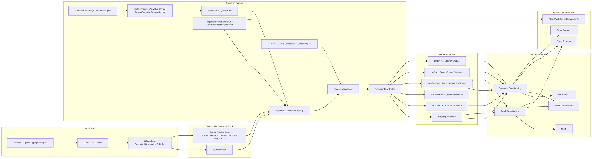
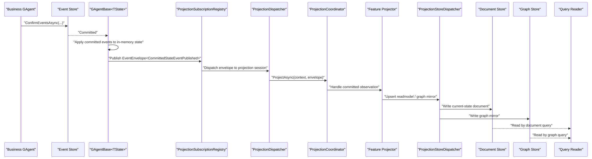
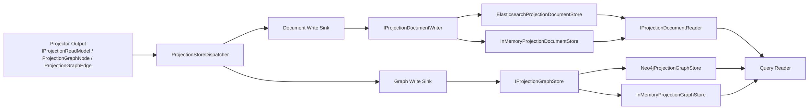
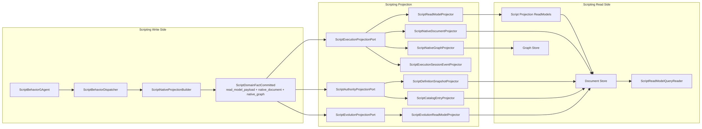
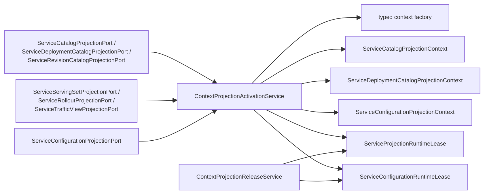
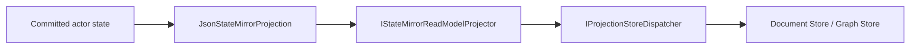
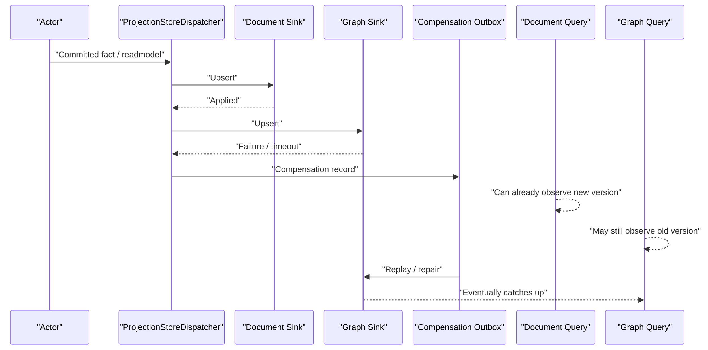

# Projection 系统全景架构与现存问题分析

## 1. 文档元信息

- 文档状态：`Active`
- 文档版本：`v1`
- 更新时间：`2026-03-16`
- 适用范围：
  - `src/Aevatar.Foundation.*`
  - `src/Aevatar.CQRS.Projection.*`
  - `src/Aevatar.Scripting.*`
  - `src/workflow/Aevatar.Workflow.*`
  - `src/platform/Aevatar.GAgentService*.Projection`

## 2. 结论摘要

当前投影体系已经完成了两条最关键的收口：

1. 写侧统一在 `GAgentBase<TState>` commit 成功后发布 `EventEnvelope<CommittedStateEventPublished>`，并携带 `state_event + state_root`。
2. workflow 的 `report/timeline` 状态机已经从 projection 内部 reducer 状态机前移到 `WorkflowRunInsightGAgent`。

因此，现行主链已经不再是“读侧再算一套状态机”，而是更接近：

`actor committed fact/state -> projection runtime -> multiple readmodels/live sinks`

但这还不是终态。当前最大的架构问题已经从“事实拥有者错位”转移为以下几类：

1. Projection Core 仍然是一个偏重的运行时子平台，混合了 lifecycle、ownership、session hub、compensation、replay。
2. workflow 仍保留 `projection -> aggregate actor -> projection` 的二次链，聚合与投影没有彻底分离。
3. `WorkflowRunInsightGAgent` 虽然成为语义拥有者，但语义密度过高，已经形成新的热点。
4. scripting 的 native/materialization 路径虽然已前推到写侧，但仍保留一套相对动态的 schema/compiler/materializer 组合。
5. document store 与 graph store 之间仍是显式最终一致，不存在跨 store 原子提交。
6. platform/GAgentService 侧已经收口到新的 projection port / core activation 口径，但多视图场景下仍保留较大的 `context/descriptor/runtime-lease` 矩阵。
7. `StateMirror` 是合法的辅助组件，但如果不明确它只是结构镜像工具，仍容易被误读成“第二套通用 projection 框架”。

## 3. 范围与术语

本文统一使用以下术语：

- `Committed Observation`
  - 指 `EventEnvelope<CommittedStateEventPublished>` 这条统一 committed 观察主链。
- `Feature Durable Fact`
  - 指 scripting 这类子系统在 committed observation 同源主链上发布的强类型 durable payload，例如 `ScriptDomainFactCommitted`。
- `Current-State ReadModel`
  - 指某个 actor 当前权威状态的查询副本。
- `Artifact / Export / Live Sink`
  - 指不再承担权威事实语义的派生副产品，例如导出、实时 run event sink、文件落地。
- `Projection Runtime`
  - 指订阅、分发、ownership、lifecycle、compensation、store fan-out 这些通用运行时能力。

## 4. Projection 系统总览

### 4.1 全局主链图

### 4.2 模块分层与代表文件

| 层 | 职责 | 代表文件 |
|---|---|---|
| Foundation | commit 后统一发布 committed observation | `src/Aevatar.Foundation.Abstractions/agent_messages.proto`, `src/Aevatar.Foundation.Core/GAgentBase.TState.cs` |
| Projection Core Abstractions | projector / coordinator / lifecycle / ownership 抽象 | `src/Aevatar.CQRS.Projection.Core.Abstractions/Abstractions/Pipeline/*` |
| Projection Core Runtime | 订阅、分发、activation、release、ownership、compensation | `src/Aevatar.CQRS.Projection.Core/Orchestration/*`, `src/Aevatar.CQRS.Projection.Core/Streaming/*` |
| Stores Abstractions | readmodel、document、graph 的通用持久化契约 | `src/Aevatar.CQRS.Projection.Stores.Abstractions/Abstractions/*` |
| Runtime Store Dispatch | 多 sink fan-out 与失败补偿触发 | `src/Aevatar.CQRS.Projection.Runtime/Runtime/ProjectionStoreDispatcher.cs` |
| Providers | 文档/图数据库具体实现 | `src/Aevatar.CQRS.Projection.Providers.Elasticsearch/*`, `src/Aevatar.CQRS.Projection.Providers.Neo4j/*`, `src/Aevatar.CQRS.Projection.Providers.InMemory/*` |
| Scripting Projection | authority/current-state/evolution/native materialization | `src/Aevatar.Scripting.Projection/*` |
| Workflow Projection | run current-state、insight bridge、timeline/graph/report、binding、live sink | `src/workflow/Aevatar.Workflow.Projection/*`, `src/workflow/Aevatar.Workflow.Presentation.AGUIAdapter/*` |
| Platform Projection | service catalog/configuration 等平台侧投影 | `src/platform/Aevatar.GAgentService.Projection/*`, `src/platform/Aevatar.GAgentService.Governance.Projection/*` |
| StateMirror Utility | 仅做结构镜像的通用辅助组件 | `src/Aevatar.CQRS.Projection.StateMirror/*` |

## 5. 写侧 committed observation 主链

### 5.1 语义说明

现行主链的关键点只有一个：投影默认只消费 committed 事实。

- `CommittedStateEventPublished`
  - 定义在 `src/Aevatar.Foundation.Abstractions/agent_messages.proto`
  - 由 `src/Aevatar.Foundation.Core/GAgentBase.TState.cs` 在 commit 后统一发布
  - 包含：
    - `state_event`
    - `state_root`
- scripting 还会在同源 committed 语义上追加 `ScriptDomainFactCommitted`
  - 定义在 `src/Aevatar.Scripting.Abstractions/script_host_messages.proto`

这条设计意味着：

1. projection 不再需要 query-time replay。
2. current-state readmodel 不再需要从旧文档反推出“现在应该是什么”。
3. actor 与 projection 的职责边界变得明确：
   - actor 决定业务语义
   - projection 负责物化

### 5.2 主链时序图

## 6. Projection Runtime / Lifecycle / Ownership / Compensation

### 6.1 运行时职责

当前 `Aevatar.CQRS.Projection.Core` 不只是“调一下 projector”，而是一个完整运行时。主要部件如下：

- lifecycle
  - `ProjectionLifecycleService<TContext, TCompletion>`
  - `EventSinkProjectionLifecyclePortBase<...>`
- activation / release
  - `ContextProjectionActivationService<...>`
  - `ContextProjectionReleaseService<...>`
- 订阅
  - `ProjectionSubscriptionRegistry<TContext>`
  - `ActorStreamSubscriptionHub<EventEnvelope>`
- 分发
  - `ProjectionDispatcher<TContext, TTopology>`
  - `ProjectionCoordinator<TContext, TTopology>`
- ownership
  - `ActorProjectionOwnershipCoordinator`
  - `ProjectionOwnershipCoordinatorGAgent`
- 实时事件分发
  - `ProjectionSessionEventHub<TEvent>`
- 补偿与重放
  - `ProjectionDispatchCompensationOutboxGAgent`
  - `DurableProjectionDispatchCompensator`
  - `ProjectionDispatchCompensationReplayHostedService`

### 6.2 Runtime 结构图

```mermaid
%%{init: {"maxTextSize": 100000, "flowchart": {"useMaxWidth": false, "nodeSpacing": 10, "rankSpacing": 50}, "themeVariables": {"fontSize": "10px"}}}%%
flowchart LR
    P1["Feature Projection Port\nWorkflowExecutionProjectionPort /\nScriptExecutionProjectionPort"]
    A1["ContextProjectionActivationService"]
    A2["ProjectionLifecycleService"]
    A3["ProjectionSubscriptionRegistry"]
    A4["ActorStreamSubscriptionHub<EventEnvelope>"]
    A5["ProjectionDispatcher"]
    A6["ProjectionCoordinator"]
    A7["Feature Projectors"]
    O1["ActorProjectionOwnershipCoordinator"]
    O2["ProjectionOwnershipCoordinatorGAgent"]
    S1["ProjectionSessionEventHub<TEvent>"]
    C1["ProjectionDispatchCompensationOutboxGAgent"]
    C2["DurableProjectionDispatchCompensator"]
    C3["ProjectionDispatchCompensationReplayHostedService"]
    R1["ContextProjectionReleaseService"]

    P1 --> A1 --> A2
    O2 --> O1 --> A1
    A2 --> A3 --> A4
    A3 --> A5 --> A6 --> A7
    A7 --> S1
    A7 --> C2 --> C1
    C3 --> C1
    P1 --> R1 --> A2
```

### 6.3 运行时边界判断

这层的收益很明确：

1. feature 模块不再自己维护 projection session、subscription、lease、ownership。
2. query-time priming 被 runtime-neutral 的 activation/lease 流程替代。
3. 多 projector fan-out 与失败补偿被收进统一基础设施。

但问题也同样明确：

1. 这已经是一个“子平台”，不是一个薄 orchestrator。
2. lifecycle、ownership、session event hub、compensation、replay 目前仍高度集中在同一运行时中。
3. 后续若继续增长，很容易再次形成“第二个内核”。

## 7. ReadModel / Store / Provider 物化栈

### 7.1 读模型根契约

仓库现在已经把通用 readmodel 收口为 actor-scoped current-state replica，核心根契约是：

- `src/Aevatar.CQRS.Projection.Stores.Abstractions/Abstractions/ReadModels/IProjectionReadModel.cs`

它要求每个 readmodel 至少具备：

- `Id`
- `ActorId`
- `StateVersion`
- `LastEventId`
- `UpdatedAt`

写入幂等/拒绝旧写的判断由：

- `ProjectionWriteResultEvaluator`

负责。

### 7.2 Store / Provider 结构图

### 7.3 一致性语义

这层现在的设计是：

1. 单个 sink 自己保证 OCC / 幂等 / 拒绝旧写。
2. `ProjectionStoreDispatcher<TReadModel>` 按注册顺序 fan-out 到多个 sink。
3. 失败时通过 `ProjectionStoreDispatchCompensator` 进入补偿/重放。

这意味着：

- 单 store 内可以做到“版本单调覆盖”。
- 跨 store 仍然只有最终一致。
- 补偿是修复路径，不是同步一致性机制。

## 8. Scripting Projection 架构

### 8.1 现状总结

scripting 是当前最复杂的投影子系统，因为它同时存在三类投影：

1. authority/current-state
2. semantic readmodel
3. native document / native graph

但与旧架构不同的是，这些语义现在已经大幅前推到了写侧：

- `ScriptBehaviorDispatcher`
  - 在 write-side 生成 `ScriptDomainFactCommitted`
- `ScriptNativeProjectionBuilder`
  - 在 write-side 把 semantic readmodel 编成 native document / graph durable payload
- `ScriptReadModelProjector`
  - 只物化 actor 已准备好的 readmodel contract
- `ScriptNativeDocumentProjector`
  - 只落 `native_document`
- `ScriptNativeGraphProjector`
  - 只落 `native_graph`

### 8.2 Scripting 架构图

### 8.3 Scripting 现存问题

虽然 write-side 前移已经完成，但 scripting 仍然是投影体系中最动态的一块，原因在于：

1. semantic readmodel、native document、native graph 三种形态并存。
2. `ScriptReadModelMaterializationCompiler`、`ScriptNativeProjectionBuilder` 这类组件仍保留较强 schema/compiler 味道。
3. 与 workflow 的“直接 state mirror / insight actor state -> readmodel”相比，scripting 的路径仍更依赖编译器式中间产物。

这不是错误，但它意味着：

- scripting 仍是 projection 体系中最可能继续演化的复杂热点。

## 9. Workflow Projection 架构

### 9.1 现状总结

workflow 当前已经分成两条清晰主链：

1. `WorkflowRunGAgent -> committed state -> WorkflowExecutionCurrentStateProjector`
2. `WorkflowRunGAgent -> WorkflowRunInsightBridgeProjector -> WorkflowRunInsightGAgent -> report/timeline/graph readmodels`

另有一条实时分支：

3. `WorkflowExecutionRunEventProjector -> ProjectionSessionEventHub<WorkflowRunEventEnvelope>`

因此，workflow 现在已经明确区分：

- current-state 查询
- insight/report 文档
- timeline 文档
- graph mirror
- AGUI/live event sink

但这里仍有一个没有收口的方向性错误：

- 第 2 条链路本质上仍是 `projection -> aggregate actor -> projection`
- 这意味着 `WorkflowRunInsightGAgent` 虽然是业务聚合 actor，却仍由 projector 驱动
- 这不是终态，只是比“projection 内部直接维护第二套状态机”更靠近正确方向的过渡态

### 9.2 Workflow 架构图

```mermaid
%%{init: {"maxTextSize": 100000, "flowchart": {"useMaxWidth": false, "nodeSpacing": 10, "rankSpacing": 50}, "themeVariables": {"fontSize": "10px"}}}%%
flowchart LR
    subgraph WW["Workflow Write Side"]
        A1["WorkflowRunGAgent"]
        A2["Committed EventEnvelope<CommittedStateEventPublished>"]
    end

    subgraph WP["Workflow Projection"]
        B1["WorkflowExecutionProjectionPort"]
        B2["WorkflowExecutionCurrentStateProjector"]
        B3["WorkflowRunInsightBridgeProjector"]
        B4["WorkflowExecutionRunEventProjector"]
        B5["WorkflowActorBindingProjector"]
    end

    subgraph WI["Workflow Insight Actor"]
        C1["WorkflowRunInsightGAgent"]
        C2["WorkflowRunInsight committed state"]
    end

    subgraph WR["Workflow ReadModels / Live Sinks"]
        D1["WorkflowExecutionCurrentStateDocument"]
        D2["WorkflowRunInsightReportDocumentProjector"]
        D3["WorkflowRunTimelineReadModelProjector"]
        D4["WorkflowRunGraphMirrorProjector"]
        D5["WorkflowRunInsightReportDocument"]
        D6["WorkflowRunTimelineDocument"]
        D7["WorkflowRunGraphMirrorReadModel"]
        D8["Graph Store"]
        D9["ProjectionSessionEventHub<WorkflowRunEventEnvelope>"]
        D10["WorkflowProjectionQueryReader"]
        D11["ProjectionWorkflowActorBindingReader"]
    end

    A1 --> A2 --> B1
    B1 --> B2 --> D1 --> D10
    B1 --> B3 --> C1 --> C2
    C2 --> D2 --> D5 --> D10
    C2 --> D3 --> D6 --> D10
    C2 --> D4 --> D7 --> D8 --> D10
    B1 --> B4 --> D9
    B1 --> B5 --> D11
```

### 9.3 Workflow 架构意义

这次 actor 化的收益非常明确：

1. `WorkflowRunInsightGAgent` 成为 insight/report/timeline 语义拥有者。
2. projection 不再直接维护 workflow report 状态机。
3. timeline 和 graph 已从 monolithic report 中拆开，按消费场景形成各自 readmodel。
4. AGUI/live sink 被明确降级为实时观察分支，不再和 durable readmodel 混用。

但要强调：

- “状态机从 projection 挪到 actor”不等于“边界已经彻底正确”
- 只要上游还是 `WorkflowRunInsightBridgeProjector` 在驱动这个 actor，聚合仍然没有完全回到业务主链

### 9.4 Workflow 现存问题

workflow 最大的剩余风险不是 ownership 本身，而是聚合与投影还没彻底分开：

1. `WorkflowRunInsightBridgeProjector` 让 projection 在驱动业务 aggregate actor。
2. `IProjectionProjector.InitializeAsync(...)` / `CompleteAsync(...)` 在这条链里被误用为 actor ensure、topology finalize 之类的业务/编排钩子。
3. `WorkflowRunInsightGAgent` 的语义密度很高。
4. 目前 timeline / report / graph 虽已拆分，但仍集中由一个 insight actor 提供上游语义。
5. 如果 workflow/AI event 类型继续增长，这个 actor 很容易再次变成“大状态机热点”。

正确终态应当是：

`business actor committed facts -> aggregate actor -> committed state -> projection -> readmodels`

而不是：

`business actor -> projection bridge -> aggregate actor -> projection -> readmodels`

## 10. Platform / GAgentService 投影收口结果

platform/GAgentService 侧这轮已经完成和 workflow/scripting 同口径的收口：

1. `*PortService` 命名已删除。
2. feature-specific activation/release wrapper 已删除。
3. 运行时统一切到 `ContextProjectionActivationService / ContextProjectionReleaseService`。
4. 端口已经拆成“一投影一端口”。

### 10.1 代表模块

- `src/platform/Aevatar.GAgentService.Projection/Orchestration/ServiceCatalogProjectionPort.cs`
- `src/platform/Aevatar.GAgentService.Projection/Orchestration/ServiceDeploymentCatalogProjectionPort.cs`
- `src/platform/Aevatar.GAgentService.Projection/Orchestration/ServiceRevisionCatalogProjectionPort.cs`
- `src/platform/Aevatar.GAgentService.Projection/Orchestration/ServiceServingSetProjectionPort.cs`
- `src/platform/Aevatar.GAgentService.Projection/Orchestration/ServiceRolloutProjectionPort.cs`
- `src/platform/Aevatar.GAgentService.Projection/Orchestration/ServiceTrafficViewProjectionPort.cs`
- `src/platform/Aevatar.GAgentService.Governance.Projection/Orchestration/ServiceConfigurationProjectionPort.cs`
- `src/platform/Aevatar.GAgentService.Projection/DependencyInjection/ServiceCollectionExtensions.cs`
- `src/platform/Aevatar.GAgentService.Governance.Projection/DependencyInjection/ServiceCollectionExtensions.cs`

### 10.2 当前形态图

### 10.3 结论

这类模块当前已经不再是“新旧风格并存”的问题，主要剩余点变成了组合面偏重：

1. 平台侧命名与主链已经一致。
2. activation/release 已经收回 core 通用实现。
3. 但 platform 多视图场景下仍保留较大的 `descriptor/context/runtime-lease` 矩阵。

也就是说，platform 这块的“风格债”已经基本消除，剩下的是“多视图模板矩阵复杂度债”。

## 11. StateMirror 的定位

### 11.1 StateMirror 不是第二主链

`Aevatar.CQRS.Projection.StateMirror` 是合法组件，但只能被理解成：

- 一个可选的 `State -> ReadModel` 结构镜像工具
- 不是通用业务投影框架
- 更不是和 committed observation 主链竞争的第二系统

### 11.2 StateMirror 位置图

### 11.3 正确边界

`StateMirror` 只适合：

1. 结构镜像
2. 字段重命名/忽略
3. 不涉及业务语义推导的 current-state readmodel

不适合：

1. 跨事件聚合
2. 业务状态机演算
3. timeline / insight / report / graph 这类语义派生

## 12. 一致性边界

### 12.1 当前一致性模型

当前系统的投影一致性不是“读到就等于全局强一致”，而是：

1. actor / event store 是最强一致的权威事实源。
2. 每个 readmodel store 自己保证 `StateVersion` 单调覆盖。
3. document store 与 graph store 之间没有跨 store 原子提交。
4. compensation / replay 只负责修复，不负责同步增强读一致性。

### 12.2 一致性边界图

### 12.3 正确理解

因此，query 侧的诚实表述应该是：

1. `current-state` readmodel 是 actor committed state 的最终一致副本。
2. graph/timeline/report 也是各自 committed 语义的最终一致副本。
3. 实时 AGUI/live sink 只表达“观察事件流”，不表达 durable query 真相。

## 13. 当前架构上还存在什么问题

### 13.1 Projection Core 仍然过重

问题表现：

- lifecycle、activation、release、ownership、session hub、compensation、replay 仍全部集中在 `Aevatar.CQRS.Projection.Core`。

影响：

1. 这层已经具备明显“子平台”特征。
2. 若 feature 继续增长，runtime 自身可能再次膨胀成第二个架构热点。

代表文件：

- `src/Aevatar.CQRS.Projection.Core/Orchestration/ProjectionLifecycleService.cs`
- `src/Aevatar.CQRS.Projection.Core/Orchestration/ContextProjectionActivationService.cs`
- `src/Aevatar.CQRS.Projection.Core/Orchestration/ProjectionDispatchCompensationOutboxGAgent.cs`
- `src/Aevatar.CQRS.Projection.Core/Orchestration/ProjectionOwnershipCoordinatorGAgent.cs`

### 13.2 Workflow 仍保留二次投影链

问题表现：

- `WorkflowRunInsightBridgeProjector` 仍位于 `WorkflowRunGAgent` 和 `WorkflowRunInsightGAgent` 之间。
- 这让业务聚合 actor 的输入依赖 projection runtime，而不是直接依赖业务 committed facts。
- `InitializeAsync(...)` / `CompleteAsync(...)` 的怪异感，本质上来自这条错位链路。

影响：

1. 聚合与投影职责仍然耦合。
2. projection 接口被迫承载 actor ensure、业务 finalize、runtime side-read 之类不属于 projector 的语义。
3. 这条链不删，`IProjectionProjector` 根接口就很难真正瘦下来。

代表文件：

- `src/workflow/Aevatar.Workflow.Projection/Projectors/WorkflowRunInsightBridgeProjector.cs`
- `src/Aevatar.CQRS.Projection.Core.Abstractions/Abstractions/Pipeline/IProjectionProjector.cs`
- `src/workflow/Aevatar.Workflow.Application/Orchestration/WorkflowExecutionTopologyResolver.cs`

### 13.3 Workflow insight actor 形成新的语义热点

问题表现：

- workflow insight 的 ownership 已经正确回到 actor，但 `WorkflowRunInsightGAgent` 聚合了过多 workflow/AI 解释逻辑。

影响：

1. 业务 ownership 是对的。
2. 但复杂度从 projection reducer 转移到了 insight actor。
3. 若 event 类型继续增长，这个 actor 可能演化为新的“大状态机”。

代表文件：

- `src/workflow/Aevatar.Workflow.Core/WorkflowRunInsightGAgent.cs`
- `src/workflow/Aevatar.Workflow.Core/WorkflowRunInsightStateMutations.cs`

### 13.4 Scripting 仍保留较强动态 materialization 特征

问题表现：

- scripting 已经把 native projection 前推到写侧，但 `ScriptReadModelMaterializationCompiler`、`ScriptNativeProjectionBuilder` 仍是一套较复杂的编译式物化机制。

影响：

1. 这使 scripting 成为当前最容易继续演进、继续复杂化的投影子系统。
2. 同样是 committed observation 主链，workflow 更接近“actor state -> readmodel”，scripting 更接近“schema/compiler -> durable payload -> readmodel”。

代表文件：

- `src/Aevatar.Scripting.Application/Runtime/ScriptBehaviorDispatcher.cs`
- `src/Aevatar.Scripting.Core/Materialization/ScriptReadModelMaterializationCompiler.cs`
- `src/Aevatar.Scripting.Core/Materialization/ScriptNativeProjectionBuilder.cs`

### 13.5 跨 store 原子一致性不存在

问题表现：

- `ProjectionStoreDispatcher<TReadModel>` 只是顺序 fan-out。
- Elasticsearch 与 Neo4j 之间不存在跨 store 事务。

影响：

1. `StateVersion` 可以在单 store 内保证单调覆盖。
2. 但 document/graph 之间仍可能在短时窗口里看见不同版本。
3. compensation/replay 可以修复，但不能消除这个窗口。

代表文件：

- `src/Aevatar.CQRS.Projection.Runtime/Runtime/ProjectionStoreDispatcher.cs`
- `src/Aevatar.CQRS.Projection.Providers.Elasticsearch/Stores/ElasticsearchProjectionDocumentStore.cs`
- `src/Aevatar.CQRS.Projection.Providers.Neo4j/Stores/Neo4jProjectionGraphStore.cs`

### 13.6 Platform/GAgentService 仍保留较大的多视图模板矩阵

问题表现：

- `ServiceProjectionRuntimeLease<TContext>`
- 多个 `Service*ProjectionContext`

已经不再保留旧 `*PortService` / feature-specific activation wrapper，但 service 平台存在多份近似的 `context + typed factory + runtime lease + DI registration` 组合。

影响：

1. 风格一致性问题已解决。
2. 剩余复杂度主要体现在 platform 多视图场景下的模板矩阵仍然偏大。
3. 后续若继续增加 service 视图，context/runtime-lease/DI 组合仍会继续增长。

代表文件：

- `src/platform/Aevatar.GAgentService.Projection/Orchestration/ServiceProjectionRuntimeLease.cs`
- `src/platform/Aevatar.GAgentService.Projection/Contexts/*`
- `src/platform/Aevatar.GAgentService.Governance.Projection/Orchestration/ServiceConfigurationProjectionPort.cs`
- `src/platform/Aevatar.GAgentService.Projection/DependencyInjection/ServiceCollectionExtensions.cs`

### 13.7 实时 live sink 与 durable readmodel 仍容易被误解

问题表现：

- workflow 里存在 `WorkflowExecutionRunEventProjector -> ProjectionSessionEventHub<WorkflowRunEventEnvelope>` 这条实时分支。

影响：

1. 这条链对 AGUI/WebSocket 很有价值。
2. 但它不是 durable readmodel，也不是 query truth。
3. 如果文档不反复强调，调用方很容易把它误读成“实时强一致查询”。

代表文件：

- `src/workflow/Aevatar.Workflow.Presentation.AGUIAdapter/WorkflowExecutionRunEventProjector.cs`
- `src/Aevatar.CQRS.Projection.Core/Streaming/ProjectionSessionEventHub.cs`

### 13.8 StateMirror 的概念边界仍需持续澄清

问题表现：

- `StateMirror` 是通用辅助组件，但其 README 很容易让人把它理解成“任何 projection 都可以直接套的通用主方案”。

影响：

1. 对简单 current-state readmodel 很有用。
2. 对 insight/report/timeline/graph 这类语义投影则是错误工具。
3. 若不持续收紧边界，新人可能再次把投影设计退化成“镜像一切”。

代表文件：

- `src/Aevatar.CQRS.Projection.StateMirror/README.md`
- `src/Aevatar.CQRS.Projection.StateMirror/Services/StateMirrorReadModelProjector.cs`

## 14. 建议的后续重构优先级

### P0：统一 platform projection 风格

目标：

- 把 platform/GAgentService 侧残留的 `*PortService` / activation wrapper 收口到新的 lifecycle/port base 口径。

### P1：继续压缩 Projection Core 的职责面

目标：

- 把 runtime 中的 ownership、session sink、compensation、replay 再拆成更清楚的 runtime-neutral capability 组合，避免形成过重子平台。

### P2：控制 WorkflowRunInsightGAgent 的复杂度增长

目标：

- 在继续扩展 workflow/AI 事件类型前，先定义 insight actor 的内部子域边界，避免再次形成 monolithic semantic actor。

### P3：继续收紧 scripting 的 materialization 复杂度

目标：

- 尽可能把 schema/compiler 复杂性继续前移到生成期或更窄的 write-side contract，避免 projection/runtime 再次沦为解释器。

### P4：持续强调 live sink 与 durable query 的边界

目标：

- 在 workflow/AGUI 文档与接口说明中持续强调：
  - live sink 是观察流
  - readmodel 才是查询真相

### P5：把 StateMirror 固定为辅助工具

目标：

- 继续在文档和示例中把 `StateMirror` 固定为“简单结构镜像工具”，而不是默认 projection 设计模板。

## 15. 最终判断

如果只看主干设计，当前 projection 架构已经完成了最难的一步：

- 事实 ownership 回到 actor
- committed observation 成为统一主链
- projection 重新退回物化层
- workflow insight 从 projection reducer 状态机转为 actor-owned state
- scripting native materialization 前移到写侧 durable contract

但还不能说“方向已经完全对了”。当前最需要继续纠正的，是 workflow 里仍残留的 `projection -> aggregate actor -> projection` 二次链。

所以现在的主要问题是：

1. workflow 聚合与 projection 还没有彻底分离
2. runtime 还偏重
3. 个别 actor 语义热点过于集中
4. 平台侧还有模板矩阵复杂度
5. 多 store 之间依然是诚实的最终一致，而不是强一致

这意味着后续重构应继续遵循同一原则：

`actor own semantics, aggregate actors own aggregation, projection only materializes, query only reads`

而不是重新引入第二套读侧业务框架。
