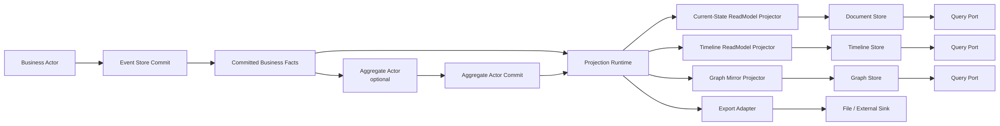

# Remaining Actorization Refactor Blueprint

## 1. 文档元信息

- 文档状态：`Active`
- 文档版本：`v1`
- 更新时间：`2026-03-16`
- 适用范围：
  - `src/Aevatar.Scripting.*`
  - `src/workflow/Aevatar.Workflow.*`
  - `src/Aevatar.CQRS.Projection.*`
  - `src/Aevatar.AI.Projection`
- 目标：在当前已完成的 `committed state -> readmodel` 主链基础上，清理剩余过渡实现，继续向“权威语义归 actor、聚合归业务 actor、projection 只做物化、query 只读 readmodel”的终态收敛。

## 2. 结论摘要

当前主链已经完成了两件关键事情：

1. `GAgentBase<TState>` 在 commit 后统一发布 `EventEnvelope<CommittedStateEventPublished>`，并携带 `state_event + state_root`。
2. workflow 的 `report/timeline` 状态机已经从 projection 内部状态机前移到 `WorkflowRunInsightGAgent`。

但这还不是最终态。剩余主债集中在 5 类：

1. `scripting` 仍在 projection/query 侧执行业务型 readmodel/query 逻辑。
2. `Projection Core` 仍保留 reducer 时代的通用抽象和默认注册路径。
3. workflow 仍保留 `projection -> aggregate actor -> projection` 的二次链；聚合 ownership 虽已回到 actor，但聚合触发仍错误地挂在 projection 生命周期里。
4. `workflow` 的 report/export 命名与外围 adapter 还没完全收口，但 timeline/graph 主查询链已经从 monolithic report 中拆开。
5. store dispatch compensation 与 workflow export artifact 仍带明显的 feature-specific 历史痕迹。

这份文档的目标不是重复已经完成的重构，而是明确剩余改造范围、终态边界、文件级动作和验收标准。

## 3. 当前完成态与剩余问题

### 3.1 已完成的关键收口

1. 权威 committed observation 已统一为 `CommittedStateEventPublished`。
2. current-state readmodel 不再允许 query-time replay 或 query-time priming。
3. workflow insight 状态机已经 actor 化，但链路仍是过渡态：
   - `WorkflowRunInsightBridgeProjector`
   - `WorkflowRunInsightGAgent`
   - `WorkflowRunInsightReportDocumentProjector`
   这代表 ownership 已回到 actor，但尚未做到“聚合与投影彻底分离”。
4. `WorkflowExecutionCurrentStateDocument` 已从 `WorkflowRunInsightReportDocument` 主链中剥离，当前态查询不再依赖旧 report reducer。

### 3.2 剩余问题总览

| 编号 | 问题 | 当前表现 | 影响 |
|---|---|---|---|
| R1 | `scripting` actor 化收口 | current-state、native document、native graph 已全部改为消费 actor committed durable fact | 该项主债已消除，剩余仅为文档同步 |
| R2 | reducer-era core 已退出主链 | 生产代码已移除 reducer 契约与注册，剩余仅为 README/活文档清理 | 新人仍可能被旧文档误导 |
| R3 | workflow 存在二次投影链 | `WorkflowRunInsightBridgeProjector -> WorkflowRunInsightGAgent -> readmodel projector` 让 projection 在驱动业务聚合 actor | 聚合与投影边界仍然错位，`Initialize/Complete` 被业务语义污染 |
| R4 | workflow report/export 外围层仍带历史命名 | `WorkflowRunInsightReportDocument` 仍承担 report/export 载体，外围 adapter 还未统一收口 | 报告链与主查询链的边界仍可继续收紧 |
| R5 | export adapter 已收口为独立导出层 | `IWorkflowRunReportExportPort` / `WorkflowRunReportExportWriter` 已与主查询链分离 | 该项主债已基本消除，剩余仅为零散旧文档 |
| R6 | compensation 已上移到 projection core | actor outbox、replay hosted service、durable compensator 已迁到 `Aevatar.CQRS.Projection.Core` | 该项主债已消除，剩余仅为文档同步 |
| R7 | 文档与部分命名残留旧术语 | 少数活文档仍需同步最后一轮主链与 export 命名收口 | 新人会被错误设计误导 |

## 4. 目标终态

### 4.1 终态原则

1. `actor` 是唯一业务语义拥有者。
2. 聚合若具有稳定业务语义，必须建模为业务 `aggregate actor`，而不是 projection actor。
3. `projection` 只负责把 committed 事实物化成一个或多个 readmodel。
4. `query` 只读取 readmodel，不负责补算事实。
5. 一个 actor 可以对应多个 readmodel，但每个 readmodel 必须有明确消费场景。
6. graph/export/search 都是 readmodel 或导出适配，不是第二套事实源。

### 4.2 终态主链

### 4.3 终态职责分层

| 分层 | 终态职责 | 不再承担的职责 |
|---|---|---|
| Actor | 业务状态、事件、聚合语义、稳定 readmodel 输入 | query-time 读取、projection lifecycle orchestration |
| Projection | committed 观察流订阅、readmodel 物化、store fan-out | 业务聚合、第二套业务状态机、readmodel 重算、行为语义解释 |
| Query | 已物化 readmodel 的读取与窄映射 | replay、priming、behavior dispatch |
| Infrastructure | provider/store/export adapter | 业务语义判断 |

## 5. 软件工程抽象

这轮剩余重构对应的核心软件工程概念如下：

### 5.1 Single Source of Truth

- `actor state + committed events` 是唯一真相。
- `readmodel` 是 materialized view，不是权威状态。

### 5.2 Materialized View

- current-state、timeline、graph 都是物化视图。
- 视图的划分由消费场景决定，而不是由“现在已有哪个文档”决定。

### 5.3 Ports and Adapters

- actor 对 projection 输出 committed observation。
- projection 对 store/export 输出 adapter 调用。
- query 只通过 read-side port 读模型，不反向穿透到 actor。

### 5.4 Replace Implicit Strategy with Explicit Ownership

旧架构里很多策略被藏在 reducer、query service、artifact sink、payload mapper 里。终态要求：

1. 业务策略留在 actor。
2. 物化策略留在 projector/materializer。
3. provider 只做 persistence semantics。

### 5.5 Interface Segregation

- `current-state query`
- `timeline query`
- `graph query`
- `export`

这些接口必须显式分开，不能继续让一个 `WorkflowRunInsightReportDocument` 同时承担全部用途。

## 6. 剩余改造工作包

## 6.0 WP0: Workflow 聚合与投影彻底分离

### 现状

workflow 当前虽然已经把 insight 状态机从 projection reducer 挪到了 `WorkflowRunInsightGAgent`，但主链仍然是：

`WorkflowRunGAgent -> WorkflowRunInsightBridgeProjector -> WorkflowRunInsightGAgent -> readmodel projector`

这意味着：

1. projection 仍在驱动业务聚合 actor。
2. `IProjectionProjector.InitializeAsync(...)` / `CompleteAsync(...)` 被拿来承载 actor ensure、拓扑补录这类业务/编排语义。
3. `WorkflowRunInsightBridgeProjector` 不是纯 projector，而是半个 business orchestrator。
4. `topology` 仍带 runtime side-read 与 finalize 补录的历史味道。

### 目标

把 workflow insight 收敛成真正的业务 aggregate actor 链：

1. `WorkflowRunInsightGAgent` 被明确视为业务 aggregate actor，而不是 projection actor。
2. `WorkflowRunInsightGAgent` 直接消费 root-owned committed business facts。
3. 删除 `projection -> aggregate actor -> projection` 二次链。
4. projection 恢复为单纯的 `committed fact/state -> readmodel` 物化层。

### 文件级动作

| 文件 | 动作 | 目标 |
|---|---|---|
| `src/workflow/Aevatar.Workflow.Projection/Projectors/WorkflowRunInsightBridgeProjector.cs` | `删除` | 取消 projection 驱动 aggregate actor |
| `src/workflow/Aevatar.Workflow.Core/WorkflowRunGAgent.cs` | `修改` | root actor 或其正式业务协议负责提交 insight 所需 committed facts |
| `src/workflow/Aevatar.Workflow.Core/WorkflowRunInsightGAgent.cs` | `保留并收紧` | 作为业务 aggregate actor，仅消费 committed business facts |
| `src/workflow/Aevatar.Workflow.Projection/Projectors/WorkflowRunInsightReportDocumentProjector.cs` | `保留` | 从 insight actor committed state 物化 report document |
| `src/workflow/Aevatar.Workflow.Projection/Projectors/WorkflowRunTimelineReadModelProjector.cs` | `保留` | 从 insight actor committed state 物化 timeline document |
| `src/workflow/Aevatar.Workflow.Projection/Projectors/WorkflowRunGraphMirrorProjector.cs` | `保留` | 从 insight actor committed state 物化 graph mirror |
| `src/Aevatar.CQRS.Projection.Core.Abstractions/Abstractions/Pipeline/IProjectionProjector.cs` | `修改` | 根接口默认只保留 `ProjectAsync(...)`；初始化/完成改成可选能力接口 |

### 验收标准

1. production path 中不再存在 `projection -> aggregate actor -> projection` 主链。
2. `WorkflowRunInsightGAgent` 的输入全部来自 committed business facts，而不是 bridge projector 回调。
3. `IProjectionProjector` 根接口不再强制所有 projector 实现 `InitializeAsync(...)` 和 `CompleteAsync(...)`。
4. workflow topology 若保留，必须来自正式 committed fact，而不是 runtime finalize 补录。

## 6.1 WP1: Scripting 彻底 actor 化

> 2026-03-16 进度：已完成。`ScriptReadModelProjector`、native document/graph projector 已切到 actor write-side 产出的 durable committed fact；`ScriptReadModelQueryReader` 已收口为 snapshot/document 读取；`OnQuery<TQuery, TResult>`、`ExecuteQueryAsync(...)`、`QueryTypeUrls`、`QueryResultTypeUrls` 等 declared-query 生产契约已从 scripting 主链删除；`IScriptBehaviorRuntimeCapabilities.GetReadModelSnapshotAsync(...)` 这类 runtime readmodel 侧读能力也已移除。

### 现状

以下路径仍在 projection/query 侧执行脚本行为语义：

- `src/Aevatar.Scripting.Projection/Projectors/ScriptReadModelProjector.cs`
- `src/Aevatar.Scripting.Projection/Projectors/ScriptNativeDocumentProjector.cs`
- `src/Aevatar.Scripting.Projection/Projectors/ScriptNativeGraphProjector.cs`
- `src/Aevatar.Scripting.Projection/Queries/ScriptReadModelQueryReader.cs`
- `src/Aevatar.Scripting.Abstractions/Behaviors/IScriptBehaviorBridge.cs`

当前这条主债已经收口完成：

1. current-state 主查询路径已经收口为 `actor -> committed fact -> readmodel`。
2. `ScriptBehaviorDispatcher` 在 write-side 基于 behavior artifact + schema plan 生成 durable `native_document/native_graph` 子契约。
3. 每条 `ScriptDomainFactCommitted` 的 semantic/native payload 都与该条 fact 自身的 post-event state/version 对齐，不再允许“中间版本 fact 复用最终状态”的错位。
3. `ScriptNativeDocumentProjector` 与 `ScriptNativeGraphProjector` 只消费 committed fact，不再解析 behavior artifact，也不再在 projection 中编译 materialization plan。

### 目标

把 scripting 查询面进一步收口成两段：

1. actor 输出“已经可被直接物化的 query-side state mirror/readmodel contract”
2. projection 只做 document/graph 物化

### 文件级动作

| 文件 | 动作 | 目标 |
|---|---|---|
| `src/Aevatar.Scripting.Abstractions/Behaviors/IScriptBehaviorBridge.cs` | `已完成主体` | 当前态 query contract 已从 production path 移除，仅保留写侧 dispatch/apply/build-readmodel |
| `src/Aevatar.Scripting.Application/Runtime/ScriptBehaviorDispatcher.cs` | `已完成` | write-side 同时产出 semantic readmodel 与 native durable projection contract |
| `src/Aevatar.Scripting.Core/ScriptBehaviorGAgent.cs` | `已完成主体` | committed 后发布由 write-side 已准备好的 durable readmodel contract |
| `src/Aevatar.Scripting.Projection/Projectors/ScriptReadModelProjector.cs` | `已完成` | 直接物化 actor 已给出的 readmodel contract |
| `src/Aevatar.Scripting.Projection/Projectors/ScriptNativeDocumentProjector.cs` | `已完成` | 只消费 `ScriptDomainFactCommitted.native_document` 并落库 |
| `src/Aevatar.Scripting.Projection/Projectors/ScriptNativeGraphProjector.cs` | `已完成` | 只消费 `ScriptDomainFactCommitted.native_graph` 并落库 |
| `src/Aevatar.Scripting.Projection/Queries/ScriptReadModelQueryReader.cs` | `已完成` | 只读 readmodel，不再解释业务语义 |
| `src/Aevatar.Scripting.Core/Ports/IScriptDefinitionSnapshotPort.cs` | `已收紧` | 当前态 query/projector 常规依赖已移除 |

### 验收标准

1. `ScriptReadModelProjector` 不再注入 `IScriptDefinitionSnapshotPort`。
2. `ScriptNativeDocumentProjector` / `ScriptNativeGraphProjector` 不再注入 `IScriptBehaviorArtifactResolver`。
3. `ScriptNativeDocumentProjector` / `ScriptNativeGraphProjector` 不再注入 `IScriptReadModelMaterializationCompiler`。
4. `ScriptReadModelQueryReader` 不再执行 `behavior.ExecuteQueryAsync(...)`。
5. scripting current-state 路径只依赖 committed observation 中已有的 durable 数据。
6. production path 中不存在 `OnQuery<TQuery, TResult>`、`QueryTypeUrls`、`QueryResultTypeUrls`。

## 6.2 WP2: Projection Core 去 reducer 化

> 2026-03-16 进度：已完成。`IProjectionEventReducer`、`Aevatar.AI.Projection/Reducers/*`、workflow host 对 reducer-era 扩展的注册均已移除；活文档也已同步收正为 current projector/applier model。

### 现状

主链代码已经完成去 reducer 化，但少数活文档仍沿用旧术语：

- `src/Aevatar.CQRS.Projection.Core.Abstractions/README.md`
- `docs/2026-03-15-cqrs-projection-readmodels-architecture.md`
- `docs/architecture/2026-03-16-remaining-actorization-refactor-blueprint.md`

### 目标

彻底明确：

1. runtime 只认识 `projector` / `applier`
2. 事件到读模型的旧 reducer 路由表不再作为框架主扩展点
3. 活文档不再引用已删除的 reducer-era 文件

### 文件级动作

| 文件 | 动作 | 目标 |
|---|---|---|
| `src/Aevatar.CQRS.Projection.Core.Abstractions/README.md` | `已完成` | 文档只保留 current projector/applier model |
| `src/Aevatar.CQRS.Projection.Core/README.md` | `已完成` | 文档已同步为 current projector/lifecycle port base 口径 |
| `docs/2026-03-15-cqrs-projection-readmodels-architecture.md` | `已完成` | 已删除对已删除 reducer 文件的引用 |
| `docs/architecture/2026-03-16-remaining-actorization-refactor-blueprint.md` | `已完成` | 已收正为“代码已完成，文档收尾” |

### 验收标准

1. 解决方案主链中不存在 `IProjectionEventReducer<,>` 的生产代码依赖。
2. host 组装不再注册 reducer-era 扩展。
3. 活文档不再把 reducer 作为现行主链扩展点。

## 6.3 WP3: Workflow readmodel 按消费场景拆分

> 2026-03-16 进度：已完成。`WorkflowRunTimelineDocument` 已落地，`WorkflowProjectionQueryReader` 已直接读取 timeline document；graph 已改由 `WorkflowRunGraphMirrorReadModel -> WorkflowRunGraphMirrorMaterializer -> Graph Store` 物化，不再从 `WorkflowRunInsightReportDocument` 派生。外围命名与活文档也已同步收口。

### 现状

`WorkflowRunInsightGAgent` 已成为语义拥有者，workflow 主查询面也已经按消费场景拆开：

- `src/workflow/Aevatar.Workflow.Projection/Projectors/WorkflowRunInsightReportDocumentProjector.cs`
- `src/workflow/Aevatar.Workflow.Projection/ReadModels/WorkflowRunReadModels.Partial.cs`
- `src/workflow/Aevatar.Workflow.Projection/ReadModels/WorkflowRunGraphMirrorMaterializer.cs`
- `src/workflow/Aevatar.Workflow.Projection/Orchestration/WorkflowProjectionQueryReader.cs`

当前结果：

1. `WorkflowRunInsightReportDocument` 已明确退回 report/export 载体。
2. timeline 与 graph 主查询链已脱离 monolithic report。
3. report/export 与主查询链的概念边界已通过命名和门禁固定。

### 目标

把 workflow 查询面拆成明确 readmodel，并保持 report/export 只作为外围 adapter：

1. `WorkflowExecutionCurrentStateDocument`
2. `WorkflowRunInsightReportDocument`
3. `WorkflowRunTimelineDocument` 或 timeline store
4. `WorkflowRunGraphMirror`

### 文件级动作

| 文件 | 动作 | 目标 |
|---|---|---|
| `src/workflow/Aevatar.Workflow.Projection/ReadModels/WorkflowRunReadModels.Partial.cs` | `已完成` | 已拆出 `WorkflowRunTimelineDocument` / `WorkflowRunGraphMirrorReadModel` |
| `src/workflow/Aevatar.Workflow.Projection/Projectors/WorkflowRunInsightReportDocumentProjector.cs` | `已完成` | 与 timeline/graph projector 并列，由同一 committed state fan-out 到多个 readmodel |
| `src/workflow/Aevatar.Workflow.Projection/Projectors/WorkflowRunTimelineReadModelProjector.cs` | `新增并完成` | timeline 成为单独消费场景的 readmodel |
| `src/workflow/Aevatar.Workflow.Projection/ReadModels/WorkflowRunGraphMirrorMaterializer.cs` | `新增并完成` | graph 改为从 graph mirror readmodel 物化 |
| `src/workflow/Aevatar.Workflow.Projection/Orchestration/WorkflowProjectionQueryReader.cs` | `已完成` | timeline query 直接读取 `WorkflowRunTimelineDocument` |
| `src/workflow/extensions/Aevatar.Workflow.Extensions.Hosting/WorkflowProjectionProviderServiceCollectionExtensions.cs` | `已完成` | provider 注册已覆盖 timeline document |

### 验收标准

1. 一个 readmodel 只服务一个稳定消费场景。
2. `WorkflowProjectionQueryReader` 不再从单个 `WorkflowRunInsightReportDocument` 读取 timeline。
3. graph mirror 不再从 report 派生。

## 6.4 WP4: Workflow export/artifact 降级为 adapter

> 2026-03-16 进度：已完成。workflow 导出侧已统一为 `report export` 语义，不再把主查询或 projection 主链表述成 artifact sink。

### 现状

导出链路已收口为明确的 export adapter：

- `src/workflow/Aevatar.Workflow.Application.Abstractions/Reporting/IWorkflowRunReportExportPort.cs`
- `src/workflow/Aevatar.Workflow.Application/Reporting/NoopWorkflowRunReportExporter.cs`
- `src/workflow/Aevatar.Workflow.Infrastructure/Reporting/FileSystemWorkflowRunReportExporter.cs`
- `src/workflow/Aevatar.Workflow.Infrastructure/Reporting/WorkflowRunReportExportOptions.cs`

### 目标

明确这条能力只是导出 adapter，不属于主查询模型，也不是 projection 主职责。

### 文件级动作

| 文件 | 动作 | 目标 |
|---|---|---|
| `IWorkflowRunReportExportPort.cs` | `已完成` | 已改为 export 语义 |
| `NoopWorkflowRunReportExporter.cs` | `保留` | 对齐 export 语义 |
| `FileSystemWorkflowRunReportExporter.cs` | `保留` | 明确是 file export adapter |
| `WorkflowRunReportExportOptions.cs` | `保留` | 对齐 export 语义 |
| `Workflow Application/Infrastructure` 注册文件 | `已完成` | 不再把导出能力表述成 artifact sink |

### 验收标准

1. workflow 主查询和导出能力在命名上彻底分离。
2. `artifact` 只保留在真正离线导出场景，不再用于 readmodel 主链。

## 6.5 WP5: Compensation 上移为 runtime 通用能力

### 现状

该项已完成。补偿能力已从 workflow feature 模块迁到 projection core：

- `src/Aevatar.CQRS.Projection.Core/Orchestration/ProjectionDispatchCompensationOutboxGAgent.cs`
- `src/Aevatar.CQRS.Projection.Core/Orchestration/DurableProjectionDispatchCompensator.cs`
- `src/Aevatar.CQRS.Projection.Core/Orchestration/ActorProjectionDispatchCompensationOutbox.cs`
- `src/Aevatar.CQRS.Projection.Core/Orchestration/ProjectionDispatchCompensationReplayHostedService.cs`

workflow 只保留注册，不再拥有专用补偿 actor/outbox/hosted service。

### 目标

把补偿能力提炼成 `Projection Runtime` 通用组件：

1. feature 模块只提供 readmodel/store binding
2. compensation actor/outbox 归 core/runtime
3. workflow 不再拥有特化的 dispatch compensation 类型

### 文件级动作

| 文件 | 动作 | 目标 |
|---|---|---|
| `ProjectionDispatchCompensationOutboxGAgent.cs` | `已完成` | runtime 通用 actor |
| `DurableProjectionDispatchCompensator.cs` | `已完成` | 与具体 readmodel 解耦 |
| `ActorProjectionDispatchCompensationOutbox.cs` | `已完成` | feature-neutral |
| `ProjectionDispatchCompensationReplayHostedService.cs` | `已完成` | runtime 通用 replay worker |

### 验收标准

1. workflow 模块里不再出现 projection compensation 的 feature-specific actor/outbox/hosted service 类型。
2. compensation core 可以复用于其它 readmodel。

## 6.6 WP6: 文档与命名清理

### 现状

以下文档或命名仍与当前实现不一致：

- `docs/2026-03-15-cqrs-projection-readmodels-architecture.md`
- `docs/SCRIPTING_ARCHITECTURE.md`
- `src/Aevatar.CQRS.Projection.Core/README.md`

### 目标

文档只描述当前有效主链：

1. `EventEnvelope<CommittedStateEventPublished>`
2. `actor -> committed observation -> projector -> readmodel`
3. 无 `ProjectionPayload`
4. 无 reducer-era 主链

### 验收标准

1. 当前文档中不再把 `ProjectionPayload` 当成现行主链契约。
2. 文档与代码的术语完全一致。

## 7. 分阶段实施顺序

### 阶段一：先拆 workflow 的二次投影链

原因：

1. 这是当前最核心的方向性错误，属于“聚合错放到 projection”。
2. `IProjectionProjector.InitializeAsync/CompleteAsync` 的怪异感，本质上都来自这条错误链。

动作：

1. 删除 `WorkflowRunInsightBridgeProjector`
2. 让 insight 输入回到正式 committed business fact
3. 收紧 `IProjectionProjector` 根接口

### 阶段二：再拆 `scripting`

原因：

1. 这是当前“语义仍在 projection/query 侧执行”的最大残留。
2. 它最直接违背“业务语义归 actor、query 只读 readmodel”的原则。

动作：

1. 前推 scripting current-state readmodel contract
2. 删除 `ScriptCommittedStateProjectionSupport`
3. 收紧 `ScriptReadModelQueryReader`

### 阶段三：再删 reducer-era core

动作：

1. 删除 `IProjectionEventReducer`
2. 清空 `Aevatar.AI.Projection` reducer 主链
3. 更新 workflow host 组装与 core README

### 阶段四：workflow readmodel 拆分

动作：

1. 按消费场景拆出 timeline/graph/report
2. query 直接面向多个 readmodel
3. graph 不再从 report 派生

### 阶段五：export/compensation 收口

动作：

1. 导出链改名并降级为 adapter
2. compensation 提炼到 runtime

### 阶段六：文档与门禁

动作：

1. 更新 `docs/`
2. 新增或修订门禁，防止 reducer/query-time behavior 执行回流

## 8. 建议新增门禁

1. `scripting_projection_behavior_execution_guard.sh`
   - 禁止 `Aevatar.Scripting.Projection` 注入 `IScriptBehaviorArtifactResolver`
   - 禁止 `Aevatar.Scripting.Projection` 注入 `IScriptDefinitionSnapshotPort`

2. `scripting_query_behavior_execution_guard.sh`
   - 禁止 `ScriptReadModelQueryReader` 调用 `behavior.ExecuteQueryAsync(...)`

3. `projection_reducer_core_guard.sh`
   - 禁止主链项目新增 `IProjectionEventReducer<,>` 生产依赖

4. `workflow_readmodel_scope_guard.sh`
   - 禁止 `WorkflowRunInsightReportDocument` 同时被 timeline/graph/current-state query 复用为唯一来源

5. `projection_aggregate_bridge_guard.sh`
   - 禁止在 feature projection 模块中新建 `*BridgeProjector -> *GAgent` 的业务聚合主链
   - 禁止 `IProjectionProjector.InitializeAsync/CompleteAsync` 再次承载 actor ensure、业务 finalize 或 runtime side-read

## 9. 终态验收清单

当以下条件全部满足，才算这轮“剩余 actor 化重构”完成：

1. scripting current-state 路径不再在 projection/query 侧执行 behavior 语义。
2. workflow 主链中不再存在 `projection -> aggregate actor -> projection`。
3. `IProjectionEventReducer` 从主框架退出。
4. workflow 的 current-state/timeline/graph/report 已拆成明确消费场景的 readmodel。
5. workflow export 不再使用 `artifact sink` 命名。
6. projection compensation 从 workflow feature 模块上移为 runtime 通用能力。
7. 文档中不再保留 `ProjectionPayload` 作为当前主链术语。
8. 全量 `build/test` 与 architecture guards 保持全绿。

## 10. 当前建议

如果继续编码，下一刀最值钱的顺序是：

1. `WP0 workflow aggregate/projection separation`
2. `WP1 scripting actorization`
3. `WP2 reducer core removal`

原因很简单：

1. 这三项决定的是“语义到底归谁”。
2. export/compensation/文档清理虽然也要做，但属于边界收口，不是主真相收口。
