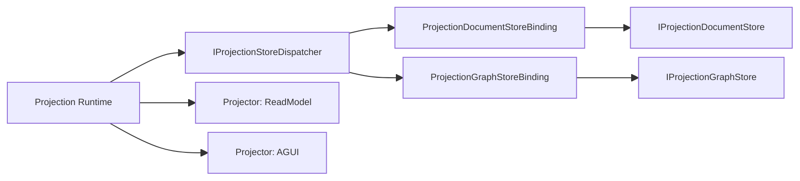

# Generic Event Sourcing + Provider ReadModel 全量重构执行文档（Detailed Refactor Blueprint）

## 1. 文档元信息
- 状态：Active
- 版本：v3.2
- 日期：2026-02-23
- 适用范围：`src/`、`test/`、`tools/ci/`、`docs/architecture/`
- 文档定位：唯一重构执行蓝图（需求、现状、差距、任务包、验收、门禁）
- 执行原则：删除优先于兼容，不保留历史兼容壳
- 最近门禁校验：`bash tools/ci/architecture_guards.sh`（2026-02-23，通过）

## 2. 背景与关键决策（统一认知）

### 2.1 EventStore 的语义边界
1. EventStore 存储的是领域事件流（`StateEvent` 封装），不是状态快照流。
2. 快照是恢复加速器，不是事实源。
3. 有状态 Actor 的恢复语义必须是 `Replay(EventStore) + 可选Snapshot加速`。
4. 事件处理（`TransitionState` / `IStateEventApplier<TState>`）与事件存储（`IEventStore`）是两个解耦关注点，可以并存，不冲突。

### 2.2 强制 Event Sourcing
1. 所有继承 `GAgentBase<TState>`（含间接继承）的有状态 Actor，必须走 `Command -> Domain Event -> Apply -> State`。
2. 不允许“可选开启 EventStore”的业务语义分叉。
3. 不允许自动生成状态快照事件替代领域事件。

### 2.3 快照与历史清理
1. 快照由 `EventSourcingRuntimeOptions` + `ISnapshotStrategy` 控制。
2. 历史事件清理由 `IEventStoreCompactionScheduler` 负责，采用“先登记、后异步执行”。
3. 执行时机在 Actor runtime 生命周期空闲点（deactivation hook），不是命令热路径同步删除。

### 2.4 Projection Provider 的职责边界
1. Provider（InMemory/Elasticsearch/Neo4j）只负责读模型存储能力，不绑定 Workflow/AI 业务语义。
2. Workflow 必须消费 Projection Runtime 抽象，不应直接依赖 `Providers.*`。
3. CQRS 与 AGUI 复用同一 Projection Pipeline 输入，不允许双轨实现。

## 3. 重构目标
1. 建立唯一写侧事实源：EventStore（强制事件优先）。
2. 建立可验证的状态演进链：显式领域事件 + 可重放同态。
3. 建立 Provider Runtime 单主链路：注册、选择、能力校验、Store 创建、观测统一。
4. 消除 Workflow 对具体 Provider 的基础设施耦合。
5. 建立启动期 fail-fast 与 CI 架构门禁，防止回归。

## 4. 范围与非范围

### 4.1 范围
- Foundation ES（Core + Runtime + Orleans runtime 接入）
- CQRS Projection Runtime（Abstractions/Core/Runtime + Providers）
- Workflow Projection 接入（Application/Projection/Infrastructure/Host）
- CI 架构门禁与测试合同

### 4.2 非范围
- 不定义业务 DSL 设计细节。
- 不展开 Elasticsearch/Neo4j 运维参数最佳实践。
- 不保留历史兼容路径或双写迁移壳。

## 5. 架构硬约束（必须满足）
1. 有状态 Actor 必须 Event Sourcing，恢复事实源仅来自 EventStore replay。
2. 命令侧必须显式产出领域事件，不允许自动反推事件。
3. 禁止在有状态 Actor 中直接修改 `State.*`（含间接继承链）。
4. Runtime 禁止反射注入 ES（`MakeGenericType` / `GetProperty().SetValue`）。
5. Projection Provider 项目禁止依赖 Workflow/AI 业务项目。
6. Workflow.Infrastructure 禁止直接依赖 `Aevatar.CQRS.Projection.Providers.*`。
7. Projection 中间层禁止持久事实态进程内 ID 映射（actor/run/session/entity）。
8. CQRS 与 AGUI 必须共享同一投影输入链路。

## 6. 当前基线（代码事实）

### 6.1 Event Sourcing 主链路（已落地）
- 核心类：
  - `src/Aevatar.Foundation.Core/GAgentBase.TState.cs`
  - `src/Aevatar.Foundation.Core/EventSourcing/EventSourcingBehavior.cs`
- 已生效语义：
  1. `ActivateAsync` 强制 `ReplayAsync` 恢复状态。
  2. `PersistDomainEventsAsync` 强制显式 `RaiseEvent -> ConfirmEventsAsync -> Apply`。
  3. `DeactivateAsync` 执行 `ConfirmEventsAsync + PersistSnapshotAsync`。
  4. `State` setter 受 `StateGuard.EnsureWritable()` 约束。
  5. `EnsureNoStateSnapshotEvents()` 禁止把 `TState` 当事件写入 EventStore。

### 6.2 快照 + 异步清理（已落地）
- 关键抽象与实现：
  - `src/Aevatar.Foundation.Core/EventSourcing/IEventStoreCompactionScheduler.cs`
  - `src/Aevatar.Foundation.Runtime/Persistence/DeferredEventStoreCompactionScheduler.cs`
  - `src/Aevatar.Foundation.Runtime/Actor/EventStoreCompactionDeactivationHook.cs`
  - `src/Aevatar.Foundation.Runtime/Actor/ActorDeactivationHookDispatcher.cs`
- 当前行为：
  1. 快照成功后只调度清理意图。
  2. 清理由 runtime deactivation hook 异步执行。
  3. 删除调用是 `IEventStore.DeleteEventsUpToAsync(...)`，不阻塞命令处理主路径。

### 6.3 Provider Runtime（已落地）
- 运行时主干：
  - `src/Aevatar.CQRS.Projection.Runtime/Runtime/ProjectionStoreDispatcher.cs`
  - `src/Aevatar.CQRS.Projection.Runtime/Runtime/ProjectionDocumentStoreBinding.cs`
  - `src/Aevatar.CQRS.Projection.Runtime/Runtime/ProjectionGraphStoreBinding.cs`
- Provider 项目：
  - `src/Aevatar.CQRS.Projection.Providers.InMemory`
  - `src/Aevatar.CQRS.Projection.Providers.Elasticsearch`
  - `src/Aevatar.CQRS.Projection.Providers.Neo4j`
- 当前行为：
  1. 一个 ReadModel 可绑定多个 Store（Document + Graph）。
  2. queryable binding 为可选（0..1）；若存在则用于 Get/List/Mutate。
  3. Provider 写路径日志结构已统一。

### 6.4 Workflow 接入现状（已完成）
- 入口：
  - `src/workflow/Aevatar.Workflow.Infrastructure/DependencyInjection/WorkflowCapabilityServiceCollectionExtensions.cs`
  - `src/workflow/extensions/Aevatar.Workflow.Extensions.Hosting/WorkflowProjectionProviderServiceCollectionExtensions.cs`
- 当前行为：
  1. `Workflow.Infrastructure` 不再直接依赖或注册 `Providers.*`。
  2. Provider 注册统一下沉到 Host/Extensions 层（`AddWorkflowProjectionReadModelProviders(...)`）。
  3. `AddAevatarPlatform(...)` 统一装配 AI + Workflow + Scripting + Provider 组合。

### 6.5 门禁现状（已落地）
- `tools/ci/architecture_guards.sh` 已覆盖：
  1. 反射 ES 注入禁用。
  2. Stateful Actor 直写 `State.*` 禁用（含继承链扫描）。
  3. Provider 业务依赖禁用。
  4. 中间层 ID 映射事实态禁用。
  5. `Workflow.Infrastructure` 禁止引用/using `Aevatar.CQRS.Projection.Providers.*`。

### 6.6 启动期能力预校验现状（已落地）
- 关键实现：
  - `src/workflow/Aevatar.Workflow.Projection/Orchestration/WorkflowReadModelStartupValidationHostedService.cs`
  - `src/workflow/Aevatar.Workflow.Projection/DependencyInjection/ServiceCollectionExtensions.cs`
- 当前行为：
  1. Host 启动阶段执行 read-model provider 选择 + 能力校验 dry-run。
  2. provider 缺失或能力不匹配可在启动阶段 fail-fast。
  3. 可通过 `WorkflowExecutionProjection:ValidateDocumentProviderOnStartup` 控制启用（默认开启）。

## 7. 需求分解与状态矩阵

| ID | 需求 | 验收标准 | 当前状态 | 证据 | 差距 |
|---|---|---|---|---|---|
| R-ES-01 | 强制事件优先恢复 | 所有 `GAgentBase<TState>` 恢复来自 replay | Done | `GAgentBase.TState.cs` | 无 |
| R-ES-02 | 显式事件构建 | 无自动派生事件主链路 | Done | `PersistDomainEventsAsync` + 守卫脚本 | 无 |
| R-ES-03 | 回放同态 | 关键 actor 有统一合同测试 | Done | `WorkflowGAgentCoverageTests` / `ProjectionOwnershipAndSessionHubTests` / `RoleGAgentReplayContractTests` + 守卫 | 无 |
| R-ES-04 | 静态装配 ES 行为 | Runtime 无反射注入 | Done | `architecture_guards.sh` | 无 |
| R-ES-05 | 禁止直写 State | 含间接继承链全部受控 | Done | `StateGuard` + awk 扫描门禁 | 无 |
| R-ES-06 | 快照后异步清理 | 由 runtime 空闲机制执行删除 | Done | `DeferredEventStoreCompactionScheduler` + hook | 无 |
| R-RM-01 | Provider 业务解耦 | Provider 不引用 Workflow/AI | Done | 门禁 + Provider csproj | 无 |
| R-RM-02 | 路由确定性 | 多 provider 未指定时报错 | Done | `ProjectionReadModelProviderSelector` | 无 |
| R-RM-03 | 启动期全量能力校验 | Host 启动时全绑定 fail-fast | Done | `WorkflowReadModelStartupValidationHostedService` + 测试 | 无 |
| R-RM-04 | 统一观测 | provider 写成功/失败日志规范统一 | Done | provider store 三实现 | 无 |
| R-WF-01 | Workflow 仅依赖抽象 | Workflow.Infrastructure 不依赖 `Providers.*` | Done | Infrastructure csproj + DI 已去 Provider 引用 | 无 |
| R-WF-02 | 单投影主链路 | AGUI 与 CQRS 共 pipeline 输入 | Done | `WorkflowExecutionAGUIEventProjector` | 无 |
| R-GOV-01 | 架构规则可自动化验证 | 规则进入 CI 门禁 | Done | `architecture_guards.sh` 新增 Workflow->Providers 规则 | 无 |

## 8. 差距详解

### 8.1 Gap-P（生产化）压测基线与常态化 smoke 未闭环
- 已完成：
  1. 生产级 `IEventStore` 后端已落地为 Garnet：`src/Aevatar.Foundation.Runtime.Persistence.Implementations.Garnet/GarnetEventStore.cs`。
  2. Orleans runtime 在 `PersistenceBackend=Garnet` 时自动绑定 `GarnetEventStore`，不再回退 `InMemoryEventStore`。
  3. Garnet EventStore 集成测试已补齐（环境变量门控）：`test/Aevatar.Foundation.Runtime.Hosting.Tests/GarnetEventStoreIntegrationTests.cs`。
- 仍待完成：
  1. 快照与事件裁剪参数压测基线（吞吐、恢复时延、数据增长曲线）。
  2. provider e2e smoke 的 nightly 常态化接入与告警治理。

## 9. 目标架构

### 9.1 分层与依赖方向
1. Domain：事件定义、状态模型、状态转移契约。
2. Application：编排端口与用例，不依赖 Provider 具体实现。
3. Infrastructure：技术实现但仍依赖抽象；Workflow.Infrastructure 不拼 Provider。
4. Host/Extensions：负责具体 Provider 组合与配置绑定。

### 9.2 Event Sourcing 目标链路

```mermaid
%%{init: {"maxTextSize": 100000, "flowchart": {"useMaxWidth": false, "nodeSpacing": 10, "rankSpacing": 50}, "themeVariables": {"fontSize": "10px"}}}%%
flowchart LR
    E1["Command Handler"] --> E2["RaiseEvent / PersistDomainEventsAsync"]
    E2 --> E3["IEventSourcingBehavior.ConfirmEventsAsync"]
    E3 --> E4["IEventStore.AppendAsync"]
    E4 --> E5["TransitionState / IStateEventApplier"]
    E5 --> E6["In-Memory State"]
    E6 --> E7["PersistSnapshotAsync"]
    E7 --> E8["IEventStoreCompactionScheduler.ScheduleAsync"]
    E8 --> E9["Runtime Deactivation Hook Dispatcher"]
    E9 --> E10["EventStoreCompactionDeactivationHook"]
    E10 --> E11["IEventStore.DeleteEventsUpToAsync"]
```

### 9.3 Projection Provider 目标链路

### 9.4 Workflow 目标边界
1. `Aevatar.Workflow.Infrastructure` 仅装配 Workflow 抽象能力。
2. 具体 Provider 注册放在 `Host` 或 `workflow/extensions/*` 组合包。
3. `AddWorkflowCapability(...)` 不再直接调用 `AddElasticsearch.../AddNeo4j.../AddInMemory...`。

## 10. 重构工作包（WBS）

### WP-1：Workflow 与 Provider 彻底解耦（优先级 P0，已完成）
- 目标：完成 R-WF-01。
- 改动范围：
  1. 删除 `src/workflow/Aevatar.Workflow.Infrastructure/Aevatar.Workflow.Infrastructure.csproj` 对三个 Provider 项目的引用。
  2. 重构 `src/workflow/Aevatar.Workflow.Infrastructure/DependencyInjection/WorkflowCapabilityServiceCollectionExtensions.cs`，移除具体 Provider using 与注册调用。
  3. 在 Host/Extensions 层新增组合入口（示例：`AddWorkflowProjectionProviders(...)`），统一承载 Provider 选择与配置。
  4. 调整 `src/workflow/Aevatar.Workflow.Host.Api/Program.cs` 与 `src/Aevatar.Mainnet.Host.Api/Program.cs` 的组合顺序。
- 产物：
  1. Workflow.Infrastructure 纯抽象消费。
  2. Host 级 Provider 组合扩展。
  3. 覆盖注册路径的单测/集测。
- DoD：
  1. `rg -n "Aevatar\.CQRS\.Projection\.Providers\." src/workflow/Aevatar.Workflow.Infrastructure` 无命中。
  2. 所有 Workflow Host 能正常启动并通过投影功能测试。

### WP-2：启动期全量能力预校验（优先级 P0，已完成）
- 目标：完成 R-RM-03。
- 设计：
  1. 新增 startup 校验服务（`IHostedService` 或 startup task）。
  2. 启动阶段遍历 read-model 绑定，调用 ProviderSelector + CapabilityValidator dry-run。
  3. 任何绑定失败直接终止启动（fail-fast）。
- 改动范围：
  - `src/Aevatar.CQRS.Projection.Runtime/*`
  - `src/workflow/Aevatar.Workflow.Projection/*`
  - `src/workflow/Aevatar.Workflow.Host.Api/*`（注册校验服务）
- 产物：
  1. 启动期校验实现。
  2. 启动失败测试：provider 未注册、能力不匹配、binding 非法。

### WP-3：Replay 同态合同测试矩阵（优先级 P1，已完成）
- 目标：完成 R-ES-03。
- 设计：
  1. 抽象统一测试模板：`Command -> Events -> Replay -> StateEquals`。
  2. 覆盖关键 actor 类别：
     - `src/workflow/Aevatar.Workflow.Core/WorkflowGAgent.cs`
     - `src/Aevatar.AI.Core/RoleGAgent.cs`
     - `src/Aevatar.CQRS.Projection.Core/Orchestration/ProjectionOwnershipCoordinatorGAgent.cs`
  3. 新增守卫：关键目录新增 `GAgentBase<TState>` 子类必须在合同测试中被引用。
- 产物：
  1. 合同测试基类与样例。
  2. 关键 actor 覆盖报告。

### WP-4：治理门禁补齐（优先级 P1，已完成）
- 目标：完成 R-GOV-01 剩余项。
- 改动范围：
  - `tools/ci/architecture_guards.sh`
- 新增规则：
  1. 禁止 `src/workflow/Aevatar.Workflow.Infrastructure/*.csproj` 引用 `Aevatar.CQRS.Projection.Providers.*.csproj`。
  2. 禁止 Workflow.Infrastructure 源码 `using Aevatar.CQRS.Projection.Providers.*`。
- 产物：
  1. 守卫脚本更新。
  2. 对应守卫测试或 CI 验证记录。

### WP-5：生产化增强（优先级 P2，部分完成）
- 目标：压实容量与稳定性。
- 内容：
  1. [x] 引入生产级 `IEventStore` 后端：Garnet（独立模块 + Orleans 自动装配）。
  2. [ ] 建立快照与压缩参数压测基线：吞吐、恢复时延、磁盘增长曲线。
  3. [ ] 将 provider e2e smoke 接入常态 CI（至少 nightly）。
- 说明：此工作包不影响 P0/P1 的架构闭环，可并行推进。

## 11. 里程碑与依赖

| 里程碑 | 日期（计划） | 依赖 | 交付 |
|---|---|---|---|
| M1 | 2026-02-25 | 无 | WP-1 完成，Workflow 解耦完成 |
| M2 | 2026-02-27 | M1 | WP-2 完成，启动期 fail-fast 生效 |
| M3 | 2026-03-01 | M1 | WP-3 完成，合同测试矩阵落地 |
| M4 | 2026-03-02 | M1 | WP-4 完成，门禁补齐 |
| M5 | 2026-03-06 | M2+M3+M4 | WP-5 余项闭环（压测+nightly smoke） |

## 12. 验证矩阵（需求 -> 命令 -> 通过标准）

| 需求 | 验证命令 | 通过标准 |
|---|---|---|
| R-ES-01/02/04/05/06 | `bash tools/ci/architecture_guards.sh` | 脚本通过，无 ES 反射注入/State 直写/违规路径 |
| R-RM-01/02/04 | `dotnet test test/Aevatar.CQRS.Projection.Core.Tests/Aevatar.CQRS.Projection.Core.Tests.csproj --nologo` | Provider 选择与能力测试通过 |
| R-WF-02 | `dotnet test test/Aevatar.Workflow.Host.Api.Tests/Aevatar.Workflow.Host.Api.Tests.csproj --nologo` | Workflow 投影与 AGUI 路径测试通过 |
| R-RM-03 | `dotnet test test/Aevatar.Workflow.Host.Api.Tests/Aevatar.Workflow.Host.Api.Tests.csproj --filter "*ReadModel*" --nologo` | 启动期能力校验失败/成功场景通过 |
| R-ES-03 | `dotnet test test/Aevatar.Foundation.Core.Tests/Aevatar.Foundation.Core.Tests.csproj --nologo` + 合同测试项目 | 关键 actor replay 同态全部通过 |
| 全量回归 | `dotnet build aevatar.slnx --nologo` + `dotnet test aevatar.slnx --nologo` | 构建+测试全绿 |

## 13. 完成定义（Final DoD）
1. 有状态 Actor 恢复事实源仅来自 EventStore replay。
2. 命令路径上不存在自动派生事件机制。
3. Workflow.Infrastructure 与 Provider 实现完全解耦。
4. ReadModel 能力协商在启动期可全量 fail-fast。
5. CQRS 与 AGUI 共用同一投影输入链路。
6. CI 守卫覆盖上述约束并在主干持续执行。

## 14. 风险与应对
1. 风险：Workflow 解耦后 Host 组合复杂度增加。
   - 应对：提供单一 Host 扩展入口，不允许业务重复拼装 Provider。
2. 风险：启动期全量校验增加启动耗时。
   - 应对：采用 dry-run，不触发真实写入；提供严格模式与开发模式开关。
3. 风险：合同测试扩大导致 CI 时间增长。
   - 应对：PR 快速集 + nightly 全量集分层执行。
4. 风险：生产 EventStore 语义偏离现有实现。
   - 应对：统一 `IEventStore` 合同测试套件，后端接入前强制通过。

## 15. 执行清单（可勾选）
- [x] 完成 WP-1：Workflow 解耦与 Host 组合下沉
- [x] 完成 WP-2：启动期全量能力校验
- [x] 完成 WP-3：Replay 合同测试矩阵
- [x] 完成 WP-4：Workflow->Providers 门禁补齐
- [ ] 完成 WP-5：压测基线与 nightly smoke 闭环

## 16. 当前执行快照（2026-02-23）
- 已完成：R-ES-01、R-ES-02、R-ES-03、R-ES-04、R-ES-05、R-ES-06、R-RM-01、R-RM-02、R-RM-03、R-RM-04、R-WF-01、R-WF-02、R-GOV-01
- 部分完成：WP-5-1（Garnet EventStore 生产后端 + Orleans 自动装配 + 集成测试）
- 当前主阻塞：压测基线与 nightly smoke 尚未接入

## 17. 变更纪律
1. 删除优先，不做兼容壳。
2. 代码先改，文档同步更新，不允许文档失真。
3. 新增能力必须挂在主链路上，不允许旁路“第二系统”。
