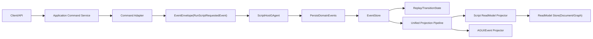
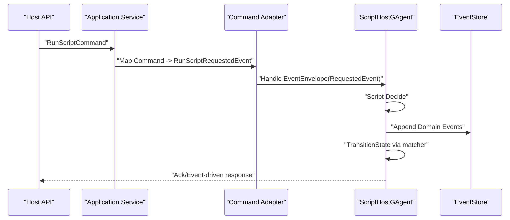

# C# Script GAgent 详细架构设计（基于需求文档）

## 1. 文档元信息
- 状态: In Progress
- 版本: v0.2
- 日期: 2026-03-01
- 需求基线: `docs/architecture/csharp-script-gagent-requirements.md`
- 适用范围: `Foundation/Core/CQRS/Workflow/Host` 相关子系统
- 文档目标: 将需求文档转化为可落地的详细架构设计与实施边界
- 最近实现快照: 首批项目骨架、写侧主链、投影路由、Host 装配与继承守卫已落地

## 2. 设计目标与不可妥协约束

### 2.1 目标
1. 提供一套通过 C# 脚本定义 GAgent 行为的架构能力。
2. 能力语义与静态 GAgent 对齐，尤其是 Event Sourcing、回放一致性、投影一致性。
3. 支持脚本自定义 State 与 ReadModel。
4. 与现有 `EventEnvelope` 主链完全兼容，不引入第二系统。

### 2.2 不可妥协约束
1. GAgent 不直接处理 Command。
2. 写侧主链必须是: `Application Command -> Requested Event(EventEnvelope) -> GAgent -> Domain Event -> Apply -> State`。
3. 读侧主链必须是: `EventEnvelope -> Unified Projection Pipeline -> ReadModel`。
4. `ScriptHostGAgent` 必须继承 `GAgentBase<ScriptHostState>`。
5. AI 复用只能组合，不允许 `ScriptHostGAgent` 继承 `RoleGAgent` 或 `AIGAgentBase<TState>`。
6. 运行态事实状态只能在 Actor 内或分布式状态中承载，禁止中间层字典事实态。

## 3. 架构总览

## 4. 分层与项目结构设计

### 4.1 分层职责
1. Domain: `ScriptHostGAgent`、状态机、领域事件。
2. Application: Command 到 Requested Event 的适配、用例编排。
3. Infrastructure: 脚本编译器、沙箱策略、缓存与版本解析。
4. Projection: Script reducer/projector/read model。
5. Host: DI 装配、能力开关、启动校验。

### 4.2 建议项目拆分
1. `src/Aevatar.Scripting.Abstractions`
2. `src/Aevatar.Scripting.Core`
3. `src/Aevatar.Scripting.Projection`
4. `src/Aevatar.Scripting.Hosting`
5. `test/Aevatar.Scripting.Core.Tests`
6. `test/Aevatar.Scripting.Projection.Tests` 或并入 `test/Aevatar.CQRS.Projection.Core.Tests`

## 5. 核心模型设计

### 5.1 Host State
`ScriptHostState` 采用稳定壳模型，承载脚本动态状态的序列化结果。

建议字段:
1. `script_id`
2. `revision`
3. `schema_hash`
4. `state_payload_json`
5. `last_applied_event_version`
6. `last_event_id`

### 5.2 事件模型

#### 请求事件（由 Application 适配后进入 EventEnvelope）
1. `RunScriptRequestedEvent`
2. `ConfigureScriptHostEvent`

#### 领域事件（写入 EventStore）
1. `ScriptDomainEventCommitted`
2. `ScriptStatePatchedEvent`
3. `ScriptExecutionFailedEvent`
4. `ScriptInternalTimerFiredEvent`

#### 规则
1. 请求事件用于触发决策。
2. 领域事件用于事实持久化与状态迁移。
3. 任一状态变化必须对应至少一个已提交领域事件。

## 6. 写侧详细链路

### 6.1 关键职责边界
1. Application 层负责 Command 校验与适配。
2. GAgent 层仅处理事件，不接受 Command 类型输入。
3. `PersistDomainEvent(s)` 是唯一写事实入口。
4. `TransitionState` 是唯一状态变化入口。

### 6.2 一致性语义
1. 写入成功后再 apply。
2. replay 与在线 apply 必须同态。
3. 请求事件必须携带 `correlation_id`、`run_id`、`script_revision`。

## 7. 脚本执行与沙箱架构

### 7.1 编译执行流程
1. 载入脚本文本与元数据。
2. 静态策略校验（禁用 API、命名空间白名单、类型限制）。
3. 生成可执行句柄（委托或受限 IR）。
4. 以 `script_id + revision + schema_hash` 作为缓存键。
5. 执行时注入 `ScriptExecutionContext`，只暴露受限端口。

### 7.2 沙箱策略
禁止能力示例:
1. `Task.Run`、`Thread`、`Timer` 等直接并发推进。
2. `lock/Monitor/ConcurrentDictionary` 作为事实状态维护。
3. 文件系统与网络直连。
4. 反射逃逸与动态加载非白名单程序集。

允许能力示例:
1. 通过 `IScriptAgentDefinition` 的决策回调输出领域事件。
2. 通过 `IAICapability` 发起 AI 调用请求。
3. 通过框架提供的时钟与内部事件调度端口触发延迟行为。

## 8. AI 能力复用架构（组合，不继承）

### 8.1 设计原则
1. `ScriptHostGAgent` 不继承任何 AI 基类。
2. 复用 `RoleGAgent/AIGAgent` 能力通过组合端口完成。

### 8.2 两种复用模式
1. 子 Actor 委托模式:
`ScriptHostGAgent` 创建或解析 `IRoleAgent` 子 actor，发送请求事件并消费返回事件。
2. 能力适配模式:
通过 `IAICapability` 抽象包裹现有 AI runtime，实现脚本可调用端口。

### 8.3 选择建议
1. 先落地子 Actor 委托模式，语义最贴近现有 `WorkflowGAgent`。
2. 再补 `IAICapability` 统一端口，降低脚本对角色实现细节耦合。

## 9. 读侧投影架构

### 9.1 接入原则
1. 只能接入统一 ProjectionCoordinator。
2. reducer 路由仅允许 `TypeUrl` 精确键匹配。
3. 未命中 reducer 事件为 no-op。

### 9.2 Projector 结构
1. `ScriptExecutionReadModelProjector`
2. `ScriptEventReducerBase<TEvent>`
3. `ScriptExecutionReadModel`

### 9.3 路由要求
1. `GroupBy(x => x.EventTypeUrl, StringComparer.Ordinal)`
2. `ToDictionary(..., StringComparer.Ordinal)`
3. `TryGetValue(typeUrl, out reducers)`
4. 禁止 `TypeUrl.Contains(...)`

## 10. 版本与回放治理

### 10.1 Revision 固化
1. 每个领域事件必须携带 `script_revision`。
2. replay 时按事件 revision 绑定对应脚本句柄。
3. 若 revision 缺失或不可解析，启动 fail-fast。

### 10.2 升级策略
1. 默认策略: 新实例生效，旧实例按旧 revision 运行至结束。
2. 在位升级策略: 必须显式迁移状态与 schema，附迁移事件。
3. 禁止隐式覆盖运行中 revision。

## 11. Actor 化运行态设计

### 11.1 内部触发事件模式
所有 `delay/timeout/retry` 均采用:
1. 异步等待
2. 发布内部触发事件
3. Actor 主线程消费并校验活跃态

### 11.2 对账键
内部事件至少包含:
1. `run_id`
2. `step_id`
3. `attempt`
4. `script_revision`

### 11.3 陈旧事件处理
1. Actor 内校验当前活跃态。
2. 不匹配则拒绝处理并记录观测日志。

## 12. 可观测性与审计

### 12.1 日志维度
1. `script_id`
2. `revision`
3. `actor_id`
4. `run_id`
5. `event_id`
6. `correlation_id`
7. `event_type_url`

### 12.2 指标
1. 脚本编译成功率与耗时
2. 脚本执行成功率与重试分布
3. 回放耗时与快照命中率
4. 投影延迟与失败补偿次数

### 12.3 审计工件
1. 运行时事件轨迹（事件序列）
2. 状态版本变化轨迹
3. 读模型版本与最后事件 ID 对账结果

## 13. 安全与隔离

1. 仅允许白名单程序集与 API。
2. 脚本执行上下文必须剥离宿主敏感能力。
3. 跨租户场景下，`script_id`、`actor_id`、存储命名空间必须隔离。
4. 默认拒绝动态外部依赖下载。

## 14. 门禁与验证设计

### 14.1 代码守卫
1. 复用 `tools/ci/architecture_guards.sh`
2. 复用 `tools/ci/projection_route_mapping_guard.sh`
3. 新增 `tools/ci/script_inheritance_guard.sh`

### 14.2 测试矩阵
1. 合约测试: 脚本契约、状态壳、事件契约。
2. 回放测试: 写入事件后重启恢复同态。
3. 投影测试: TypeUrl 精确路由与 no-op 语义。
4. 组合复用测试: AI delegate 路径可用且无继承耦合。
5. 集成测试: Host/Application/Actor/Projection 端到端闭环。

### 14.3 最低验证命令
1. `bash tools/ci/architecture_guards.sh`
2. `bash tools/ci/projection_route_mapping_guard.sh`
3. `dotnet build aevatar.slnx --nologo`
4. `dotnet test aevatar.slnx --nologo`

## 15. 实施顺序建议

1. 先落契约: `Abstractions + proto`。
2. 再落写侧: `ScriptHostGAgent + replay contract`。
3. 再落沙箱: `compiler + policy`。
4. 再落读侧: `projection/reducer/projector`。
5. 再落 AI 复用: `Role delegate/IAICapability`。
6. 最后落 Host 装配与全量验证。

## 16. 风险清单

1. 风险: 脚本执行能力过宽导致安全问题。
缓解: 白名单策略 + 启动前校验 + 运行时审计。
2. 风险: revision 漂移导致回放不一致。
缓解: 事件固化 revision + 回放强绑定。
3. 风险: 团队绕过约束直接让 GAgent 处理 Command。
缓解: 文档硬约束 + 应用层适配门禁 + 代码审查模板。
4. 风险: AI 复用通过继承快速实现导致边界污染。
缓解: 继承守卫脚本 + 组合端口测试用例。

## 17. 与需求文档对照关系

1. 本文对应需求文档中的 `R-SG-01 ~ R-SG-14`。
2. 关键新增细化:
- Command 与 EventEnvelope 的边界落位
- ScriptHost 与 AI 组合复用的双模式
- revision 回放绑定细节
- 运行态内部事件对账模型
- 安全与审计的可验证指标
