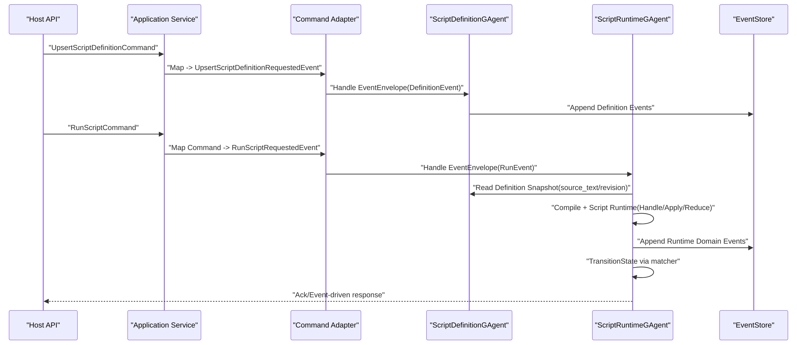

# C# Script GAgent 详细架构设计（基于需求文档）

## 1. 文档元信息
- 状态: Superseded-By-V2
- 版本: v0.5
- 日期: 2026-03-01
- 需求基线: `docs/architecture/csharp-script-gagent-requirements.md`
- 适用范围: `Foundation/Core/CQRS/Workflow/Host` 相关子系统
- 文档目标: 将需求文档转化为可落地的详细架构设计与实施边界
- 最近实现快照: 双 GAgent 写侧主链、定义快照强制加载、脚本能力上下文（AI/Invocation/Factory）、脚本状态回传链路、投影路由与 Host 装配已落地
- V2 接管文档: `docs/plans/2026-03-01-csharp-script-gagent-v2-replan.md`

## 2. 设计目标与不可妥协约束

### 2.1 目标
1. 提供一套通过 C# 脚本定义 GAgent 行为的架构能力。
2. 能力语义与静态 GAgent 对齐，尤其是 Event Sourcing、回放一致性、投影一致性。
3. 支持脚本自定义 State 与 ReadModel。
4. 与现有 `EventEnvelope` 主链完全兼容，不引入第二系统。

### 2.2 不可妥协约束
1. GAgent 不直接处理 Command。
2. 写侧主链必须是: `Application Command -> Requested Event(EventEnvelope) -> GAgent -> Domain Event -> Apply -> State`。
3. 读侧主链必须是: `EventEnvelope -> Unified Projection Pipeline -> ReadModel`。
4. 脚本定义与运行必须拆分为两个 GAgent：`ScriptDefinitionGAgent` 与 `ScriptRuntimeGAgent`，且均继承 `GAgentBase<TState>`。
5. AI 复用只能组合，不允许 `ScriptRuntimeGAgent` 继承 `RoleGAgent` 或 `AIGAgentBase<TState>`。
6. 运行态事实状态只能在 Actor 内或分布式状态中承载，禁止中间层字典事实态。
7. 脚本调用/创建任意 GAgent 必须经由 `IGAgentInvocationPort`/`IGAgentFactoryPort` 等受控端口，不得直接注入 `IServiceProvider` 获取具体 GAgent 实例。
8. GAgent 生命周期的 create/destroy/link/replay 只能由 `IActorRuntime` 管理；IOC `Scope` 仅用于依赖解析，不承担生命周期事实管理。
9. 完全自包含: 脚本源码字符串必须持久化在定义事实（事件/状态）中，回放不得依赖外部脚本仓库。
10. 编译产物不持久化；运行时可缓存，回放按 `revision + source_hash` 重编译。

## 2.3 V2 审计结论（2026-03-01）
本文件保留 V1 详细设计脉络，但当前实现审计显示以下问题仍未达成 V2 目标：
1. 脚本入口仍偏 `Decide` 单入口，未形成“多事件处理器 + 显式 Apply + ReadModel Reducer”完整契约。
2. 运行态事实事件被 `ScriptRunDomainEventCommitted` 统一封装，脚本领域语义表达仍偏弱。
3. 状态演进主要依赖 `state_payload_json`，未建立强类型状态演进治理边界。
4. 能力面仍未覆盖静态 GAgent 的完整能力集合（尤其 `Publish/Send/Hook/Module`）。
5. 沙箱治理仍偏黑名单策略，需升级为语义分析和权限双层模型。

后续详细架构与实施基线以 `docs/plans/2026-03-01-csharp-script-gagent-v2-replan.md` 的第 11、12 节为准。

## 3. 架构总览

```mermaid
%%{init: {"maxTextSize": 100000, "flowchart": {"useMaxWidth": false, "nodeSpacing": 10, "rankSpacing": 50}, "themeVariables": {"fontSize": "10px"}}}%%
flowchart LR
    C0["Client/API"] --> C1["Application Command Service"]
    C1 --> C2["Command Adapter"]
    C2 --> C3["EventEnvelope(UpsertScriptDefinitionRequestedEvent)"]
    C2 --> C4["EventEnvelope(RunScriptRequestedEvent)"]
    C3 --> C5["ScriptDefinitionGAgent"]
    C4 --> C6["ScriptRuntimeGAgent"]
    C5 --> C7["PersistDefinitionEvents"]
    C6 --> C8["PersistRuntimeDomainEvents"]
    C7 --> C9["EventStore"]
    C8 --> C9
    C9 --> C10["Replay/TransitionState"]
    C6 --> C11["LoadDefinitionSnapshot(source_text/revision/hash)"]
    C11 --> C6
    C9 --> C12["Unified Projection Pipeline"]
    C12 --> C13["Script ReadModel Projector"]
    C12 --> C14["AGUI/Event Projector"]
    C13 --> C15["ReadModel Store(Document/Graph)"]
    C6 --> C16["IGAgentInvocationPort / IGAgentFactoryPort"]
    C16 --> C17["IActorRuntime"]
    C17 --> C18["Target GAgent Tree"]
```

## 4. 分层与项目结构设计

### 4.1 分层职责
1. Domain: `ScriptDefinitionGAgent`、`ScriptRuntimeGAgent`、状态机、领域事件。
2. Application: Command 到 Requested Event 的适配、用例编排。
3. Infrastructure: 脚本编译器、沙箱策略、缓存与版本解析。
4. Projection: Script reducer/projector/read model。
5. Host: DI 装配、能力开关、启动校验。

### 4.2 建议项目拆分
1. `src/Aevatar.Scripting.Abstractions`
2. `src/Aevatar.Scripting.Core`
3. `src/Aevatar.Scripting.Projection`
4. `src/Aevatar.Scripting.Hosting`
5. `test/Aevatar.Scripting.Core.Tests`
6. `test/Aevatar.Scripting.Projection.Tests` 或并入 `test/Aevatar.CQRS.Projection.Core.Tests`

## 5. 核心模型设计

### 5.1 Definition State
`ScriptDefinitionState` 承载“自包含脚本定义事实”，作为回放唯一定义源。

建议字段:
1. `script_id`
2. `revision`
3. `source_text`
4. `source_hash`
5. `schema_hash`
6. `last_applied_event_version`
7. `last_event_id`

### 5.2 Runtime State
`ScriptRuntimeState` 承载运行态业务事实与编排进度。

建议字段:
1. `script_id`
2. `revision`
3. `state_payload_json`
4. `last_applied_event_version`
5. `last_event_id`
6. `definition_actor_id`

### 5.3 事件模型

#### 请求事件（由 Application 适配后进入 EventEnvelope）
1. `UpsertScriptDefinitionRequestedEvent`
2. `RunScriptRequestedEvent`
3. `ConfigureScriptRuntimeEvent`

#### 领域事件（写入 EventStore）
1. `ScriptDefinitionUpsertedEvent`
2. `ScriptDomainEventCommitted`
3. `ScriptStatePatchedEvent`
4. `ScriptExecutionFailedEvent`
5. `ScriptInternalTimerFiredEvent`

#### 规则
1. 定义请求事件与运行请求事件分属不同 GAgent 处理边界。
2. 领域事件用于事实持久化与状态迁移。
3. 任一状态变化必须对应至少一个已提交领域事件。
4. 运行时编译必须以定义态中的 `source_text` 为输入，不得直接依赖外部仓库。

## 6. 写侧详细链路

### 6.1 关键职责边界
1. Application 层负责 Command 校验与适配。
2. GAgent 层仅处理事件，不接受 Command 类型输入。
3. `ScriptDefinitionGAgent` 仅维护定义事实，`ScriptRuntimeGAgent` 仅维护运行事实。
4. `PersistDomainEvent(s)` 是唯一写事实入口。
5. `TransitionState` 是唯一状态变化入口。
6. 脚本调用其他 GAgent 仅能经由 `IGAgentInvocationPort`/`IGAgentFactoryPort`，不能直接解析具体 GAgent 实例。
7. 生命周期控制由 `IActorRuntime` 负责，IOC `Scope` 仅承担依赖解析与短生命周期资源。

### 6.2 一致性语义
1. 写入成功后再 apply。
2. replay 与在线 apply 必须同态。
3. 请求事件必须携带 `correlation_id`、`run_id`、`script_revision`。

## 7. 脚本执行与沙箱架构

### 7.1 编译执行流程
1. 从 `ScriptDefinitionGAgent` 载入 `source_text + source_hash + revision`。
2. 静态策略校验（禁用 API、命名空间白名单、类型限制）。
3. 生成可执行句柄（委托或受限 IR），并提取 `contract manifest`（input/output/state/readmodel）。
4. 以 `script_id + revision + schema_hash` 作为缓存键。
5. 执行时注入 `ScriptExecutionContext`（包含 `run_id/correlation_id/definition_actor_id/input_json/current_state_json`）和受控 `Capabilities` 端口。
6. 回放场景下按定义态重编译，不依赖外部脚本仓库。

### 7.2 沙箱策略
禁止能力示例:
1. `Task.Run`、`Thread`、`Timer` 等直接并发推进。
2. `lock/Monitor/ConcurrentDictionary` 作为事实状态维护。
3. 文件系统与网络直连。
4. 反射逃逸与动态加载非白名单程序集。

允许能力示例:
1. 通过 `IScriptPackageRuntime` 的脚本业务入口输出 `ScriptHandlerResult`（领域事件 + state/readmodel 载荷）。
2. 通过 `ScriptExecutionContext.Capabilities` 发起 `AskAI/Publish/SendTo/InvokeAgent/CreateAgent/DestroyAgent/Link/Unlink`。
3. 通过框架事件化机制触发延迟与内部事件，不允许脚本线程回调直接改状态。

## 8. AI 与通用 GAgent 复用架构（组合，不继承）

### 8.1 设计原则
1. `ScriptRuntimeGAgent` 不继承任何 AI 基类。
2. 复用 `RoleGAgent/AIGAgent` 与其他 GAgent 能力一律通过组合端口完成。
3. 端口实现可使用 IOC 解析依赖，但 GAgent 生命周期事实必须委托 `IActorRuntime`。

### 8.2 复用端口分层
1. AI 能力端口:
`IAICapability` 负责统一 AI 调用语义，内部可委托 `IRoleAgentPort` 对接 `RoleGAgent` 能力。
2. 通用调用端口:
`IGAgentInvocationPort` 负责向任意已存在 GAgent 发送事件（EventEnvelope 封装 + Runtime 调用）。
3. 通用创建端口:
`IGAgentFactoryPort` 负责按白名单创建/销毁/链接 GAgent，并把生命周期控制委托给 `IActorRuntime`。

### 8.3 生命周期边界
1. 端口实现禁止把 GAgent 实例缓存在 IOC `Scope` 并以其作为跨请求事实状态。
2. `IServiceProvider` 只用于解析端口依赖，不作为创建/恢复 GAgent 的权威入口。
3. 所有跨 actor 生命周期操作（create/destroy/link/unlink/restore）必须由 `IActorRuntime` 发起。

### 8.4 选择建议
1. 先落地 `IGAgentInvocationPort`，优先满足“调用任意 GAgent”能力并保持事件主链语义。
2. 再落地 `IGAgentFactoryPort`，补齐“受控创建任意 GAgent”与生命周期边界测试。
3. AI 侧持续通过 `IAICapability` 封装细节，不把 `RoleGAgent` 类型泄露到脚本契约面。

## 9. 读侧投影架构

### 9.1 接入原则
1. 只能接入统一 ProjectionCoordinator。
2. reducer 路由仅允许 `TypeUrl` 精确键匹配。
3. 未命中 reducer 事件为 no-op。

### 9.2 Projector 结构
1. `ScriptExecutionReadModelProjector`
2. `ScriptEventReducerBase<TEvent>`
3. `ScriptExecutionReadModel`

### 9.3 路由要求
1. `GroupBy(x => x.EventTypeUrl, StringComparer.Ordinal)`
2. `ToDictionary(..., StringComparer.Ordinal)`
3. `TryGetValue(typeUrl, out reducers)`
4. 禁止 `TypeUrl.Contains(...)`

## 10. 版本与回放治理

### 10.1 Revision 固化
1. 每个运行领域事件必须携带 `script_revision`。
2. `script_revision` 必须对应到 `ScriptDefinitionState` 中的 `source_text + source_hash`。
3. replay 时按 revision 读取定义态并重编译绑定脚本句柄。
4. 若 definition snapshot 缺失或 hash 不一致，启动 fail-fast。

### 10.2 升级策略
1. 默认策略: 新实例生效，旧实例按旧 revision 运行至结束。
2. 在位升级策略: 必须显式迁移状态与 schema，附迁移事件。
3. 禁止隐式覆盖运行中 revision。

## 11. Actor 化运行态设计

### 11.1 内部触发事件模式
所有 `delay/timeout/retry` 均采用:
1. 异步等待
2. 发布内部触发事件
3. Actor 主线程消费并校验活跃态

### 11.2 对账键
内部事件至少包含:
1. `run_id`
2. `step_id`
3. `attempt`
4. `script_revision`

### 11.3 陈旧事件处理
1. Actor 内校验当前活跃态。
2. 不匹配则拒绝处理并记录观测日志。

## 12. 可观测性与审计

### 12.1 日志维度
1. `script_id`
2. `revision`
3. `actor_id`
4. `run_id`
5. `event_id`
6. `correlation_id`
7. `event_type_url`

### 12.2 指标
1. 脚本编译成功率与耗时
2. 脚本执行成功率与重试分布
3. 回放耗时与快照命中率
4. 投影延迟与失败补偿次数

### 12.3 审计工件
1. 运行时事件轨迹（事件序列）
2. 状态版本变化轨迹
3. 读模型版本与最后事件 ID 对账结果

## 13. 安全与隔离

1. 仅允许白名单程序集与 API。
2. 脚本执行上下文必须剥离宿主敏感能力。
3. 跨租户场景下，`script_id`、`actor_id`、存储命名空间必须隔离。
4. 默认拒绝动态外部依赖下载。

## 14. 门禁与验证设计

### 14.1 代码守卫
1. 复用 `tools/ci/architecture_guards.sh`
2. 复用 `tools/ci/projection_route_mapping_guard.sh`
3. 新增 `tools/ci/script_inheritance_guard.sh`

### 14.2 测试矩阵
1. 合约测试: 脚本契约、状态壳、事件契约。
2. 回放测试: 写入事件后重启恢复同态。
3. 投影测试: TypeUrl 精确路由与 no-op 语义。
4. 组合复用测试: AI delegate 路径可用且无继承耦合。
5. 生命周期边界测试: 验证 Scope 不托管 GAgent 生命周期，create/destroy/replay 仅经 `IActorRuntime`。
6. 集成测试: Host/Application/Actor/Projection 端到端闭环。
7. 复杂业务场景测试: 多智能体脚本编排 + RoleGAgent/AI 集成 + 分支决策回归。
8. 双 GAgent 契约测试: Definition/Runtime 职责拆分与只读定义快照协议。
9. 自包含回放测试: 仅凭定义态 `source_text/source_hash/revision` 完成重编译回放。

### 14.3 最低验证命令
1. `bash tools/ci/architecture_guards.sh`
2. `bash tools/ci/projection_route_mapping_guard.sh`
3. `dotnet build aevatar.slnx --nologo`
4. `dotnet test aevatar.slnx --nologo`
5. `dotnet test test/Aevatar.Integration.Tests/Aevatar.Integration.Tests.csproj --filter "*Script*Definition*Runtime*"`
6. `dotnet test test/Aevatar.Scripting.Core.Tests/Aevatar.Scripting.Core.Tests.csproj --filter "*SelfContained*"`

## 15. 实施顺序建议

1. 先落契约: `Abstractions + proto(Definition/Runtime)`。
2. 再落定义侧: `ScriptDefinitionGAgent + self-contained source persistence`。
3. 再落写侧: `ScriptRuntimeGAgent + replay contract`。
4. 再落沙箱: `compiler + policy`。
5. 再落读侧: `projection/reducer/projector`。
6. 再落通用调用端口: `IGAgentInvocationPort`。
7. 再落 AI 复用: `Role delegate/IAICapability`。
8. 再落通用创建端口与生命周期护栏: `IGAgentFactoryPort + lifecycle tests`。
9. 最后落 Host 装配与全量验证。
10. 补齐复杂业务场景（保险理赔反欺诈）TDD 回归套件。

## 16. 风险清单

1. 风险: 脚本执行能力过宽导致安全问题。
缓解: 白名单策略 + 启动前校验 + 运行时审计。
2. 风险: revision 漂移导致回放不一致。
缓解: 事件固化 revision + 回放强绑定。
3. 风险: 团队绕过约束直接让 GAgent 处理 Command。
缓解: 文档硬约束 + 应用层适配门禁 + 代码审查模板。
4. 风险: AI 复用通过继承快速实现导致边界污染。
缓解: 继承守卫脚本 + 组合端口测试用例。
5. 风险: 误用 IOC Scope 托管 GAgent 生命周期导致回放与一致性语义破坏。
缓解: `IActorRuntime` 生命周期权威约束 + `IGAgentFactoryPort` 抽象 + 生命周期边界测试。
6. 风险: 缺乏复杂业务回归场景导致多智能体编排语义在重构中回退。
缓解: 固化业务场景测试设计并纳入 CI 回归。
7. 风险: 定义/运行未拆分导致单 agent 职责过载、版本与回放耦合复杂。
缓解: 双 GAgent 架构 + 跨 agent 契约测试 + 只读定义快照协议。
8. 风险: 非自包含存储导致外部脚本源不可用时无法恢复。
缓解: 定义态强制持久化 `source_text` 与 `source_hash`，回放重编译门禁。

## 17. 与需求文档对照关系

1. 本文对应需求文档中的 `R-SG-01 ~ R-SG-17`。
2. 关键新增细化:
- Command 与 EventEnvelope 的边界落位
- ScriptHost 与 AI/通用 GAgent 组合复用端口分层
- Definition/Runtime 双 GAgent 拆分与职责边界
- 自包含源码持久化与重编译回放语义
- `IActorRuntime` 生命周期权威与 IOC Scope 非生命周期边界
- revision 回放绑定细节
- 运行态内部事件对账模型
- 安全与审计的可验证指标

## 18. 复杂业务多智能体测试场景（TDD）

场景: 保险理赔反欺诈自动审核（Claim Case）

核心参与者:
1. `ScriptDefinitionGAgent`：脚本定义与版本事实权威。
2. `ScriptRuntimeGAgent`：编排与运行状态权威。
3. `RoleGAgent`：理赔文本结构化与 AI 判断（通过 `IAICapability`）。
4. `FraudRiskGAgent`：反欺诈评分。
5. `ComplianceRuleGAgent`：条款合规校验。
6. `HumanReviewGAgent`：高风险人工复核。

场景链路要求:
1. 先上报/更新脚本定义到 `ScriptDefinitionGAgent`，再触发运行。
2. 所有跨 agent 调用通过 `IGAgentInvocationPort`。
3. 仅在高风险/规则冲突分支使用 `IGAgentFactoryPort` 创建人工复核 agent。
4. 所有状态变化仍由领域事件驱动并可 replay 同态。
5. 读侧必须走统一 Projection Pipeline 更新 `ClaimCaseReadModel`。
6. 场景测试实现仅允许新增开发者脚本与测试夹具；不得修改任何 `src/` 基础生产代码。

测试覆盖要点:
1. 业务路径 A: 低风险 + 合规 -> Approve。
2. 业务路径 B: 高风险 -> ManualReview。
3. 业务路径 C: 合规失败 -> Reject。
4. 回放路径: 在线执行结果与 replay 结果完全一致。
5. 边界路径: Scope 释放不影响 Runtime 管理的 actor 生命周期事实。
6. 变更边界: `git diff --name-only -- src` 必须为空。

详细测试设计见:
`docs/plans/2026-03-01-multi-agent-script-ai-tdd-testcase.md`
