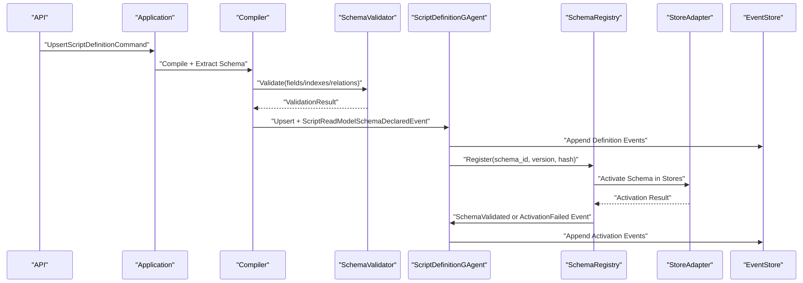
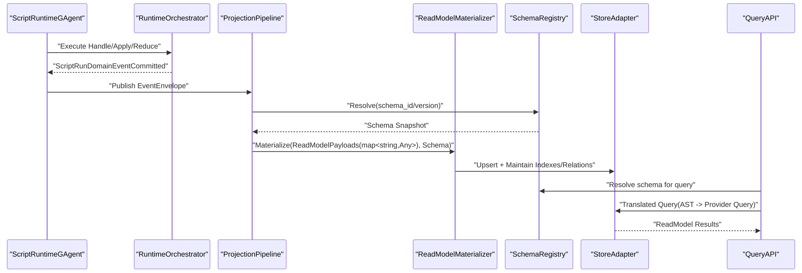

# C# Script GAgent 动态 ReadModel 架构重构文档（完整详细版）

## 1. 文档元信息
- 状态: Approved-For-Execution
- 版本: v1.0
- 日期: 2026-03-01
- 适用范围: `src/Aevatar.Scripting.*`、`src/Aevatar.CQRS.Projection.*`、`src/Aevatar.Host.*`
- 目标: 让脚本能够自定义 ReadModel 的动态字段、索引与关系，并由底层 Store/数据库自动解析与支持

## 2. 背景与问题
当前系统已经支持脚本返回 `map<string, Any>` 形式的 `ReadModelPayloads`，但缺少三类关键能力：
1. 缺少脚本可声明的结构化 ReadModel Schema（字段类型、索引、关系、版本）。
2. 缺少“Schema -> Store 能力”的统一下推层，无法把脚本声明自动转换为 Elasticsearch/Neo4j/SQL 等存储的索引与关系结构。
3. 缺少查询治理面，无法确保 Query 只访问脚本声明过的字段和关系。

这会导致：
1. 动态字段可写不可管，字段演进风险高。
2. 索引和关系依赖人工配置，脚本“自定义能力”不完整。
3. 多存储一致性不可验证，回放与在线语义容易偏移。

## 3. 重构目标与非目标

### 3.1 目标
1. 脚本可声明 ReadModel Schema，至少包含字段、索引、关系、版本。
2. 编译阶段提取并校验 Schema，定义态持久化并事件化发布。
3. 运行态按 Schema 写入动态文档，读侧统一通过 Projection Pipeline。
4. Store Adapter 自动下推索引与关系定义，支持多 provider。
5. Query 层基于 Schema 进行字段与关系白名单校验。
6. Schema 演进可回放、可迁移、可审计。

### 3.2 非目标
1. 不新增第二套投影主链。
2. 不允许脚本直接操作数据库连接或 Store SDK。
3. 不在框架内写任何业务场景特例分支。

## 4. 架构原则
1. 单一主链: `Command -> RequestedEvent -> DomainEvent -> Projection -> ReadModel`。
2. 双 GAgent 分离: Definition 管定义事实，Runtime 管运行事实。
3. Schema-as-Data: Schema 本身是事件溯源事实，而非配置文件旁路。
4. Store 抽象下推: 上层只依赖 Schema Port，不依赖具体数据库 SDK。
5. 回放同态: Schema 版本与运行事件共同决定投影结果。

## 5. 目标架构总览

```mermaid
%%{init: {"maxTextSize": 100000, "flowchart": {"useMaxWidth": false, "nodeSpacing": 10, "rankSpacing": 50}, "themeVariables": {"fontSize": "10px"}}}%%
flowchart LR
    A0["Script Source(IScriptPackageRuntime + Schema Contract)"] --> A1["Script Package Compiler"]
    A1 --> A2["Schema Validator"]
    A2 --> A3["Schema Capability Resolver"]
    A3 --> A4["ScriptDefinitionGAgent"]
    A4 --> A5["EventStore(Definition Facts)"]

    B0["RunScriptRequestedEvent"] --> B1["ScriptRuntimeGAgent"]
    B1 --> B2["Load Definition Snapshot + Schema Revision"]
    B2 --> B3["Execute Handle/Apply/Reduce"]
    B3 --> B4["ScriptRunDomainEventCommitted"]
    B4 --> B5["Unified Projection Pipeline"]

    B5 --> C1["Script ReadModel Projector"]
    C1 --> C2["ReadModel Materializer"]
    C2 --> C3["IScriptReadModelSchemaStoreAdapter"]
    C3 --> C4["Elasticsearch Adapter"]
    C3 --> C5["Neo4j Adapter"]
    C3 --> C6["SQL/Document Adapter"]

    C2 --> D1["ReadModel Store"]
    D1 --> D2["Query API(JSONPath/Relation Query)"]
```

## 6. 关键模型重构

### 6.1 脚本 Schema 契约模型
新增脚本 Schema 声明契约（建议在 `Aevatar.Scripting.Abstractions`）：
1. `ScriptReadModelSchemaDefinition`
2. `ScriptReadModelFieldDefinition`
3. `ScriptReadModelIndexDefinition`
4. `ScriptReadModelRelationDefinition`
5. `ScriptReadModelCapabilityHints`

建议结构（语义）：
1. `schema_id`
2. `schema_version`
3. `fields[]`: `name/type/nullable/path/constraints/default`
4. `indexes[]`: `name/paths/unique/order/provider_hints`
5. `relations[]`: `name/type(from,to)/source_path/target_schema/target_path/cardinality`
6. `provider_hints`: `elasticsearch/neo4j/sql` 特定提示

### 6.2 Definition State 扩展
`ScriptDefinitionState` 新增：
1. `read_model_schema`（`google.protobuf.Any`，承载 `ScriptReadModelSchemaSpec`）
2. `read_model_schema_hash`
3. `read_model_schema_version`
4. `read_model_schema_store_kinds`

新增事件：
1. `ScriptReadModelSchemaDeclaredEvent`
2. `ScriptReadModelSchemaValidatedEvent`
3. `ScriptReadModelSchemaActivationFailedEvent`

### 6.3 Runtime State 扩展
`ScriptRuntimeState` 保持运行快照字段为主，但补充：
1. `last_applied_schema_version`
2. `last_schema_hash`

## 7. 核心端口与分层

### 7.1 新增端口
1. `IScriptReadModelSchemaExtractor`
2. `IScriptReadModelSchemaValidator`
3. `IScriptReadModelSchemaCapabilityResolver`
4. `IScriptReadModelSchemaStoreAdapter`
5. `IScriptReadModelSchemaRegistry`
6. `IScriptReadModelQueryTranslator`

### 7.2 分层归属
1. Domain: Schema 领域事件与状态事实（Definition/Runtime）。
2. Application: Schema 生命周期编排（声明、激活、迁移、回滚）。
3. Infrastructure: Store Adapter、DDL/Mapping 生成器、Query 翻译器。
4. Host: Provider 装配与启动期 fail-fast 校验。

## 8. 编译与激活流程

### 8.1 编译期
1. 编译脚本并提取 ReadModel Schema。
2. 校验字段、索引、关系语义。
3. 按当前 provider 能力做兼容校验（例如全文索引、唯一约束、图关系能力）。
4. 写入 Definition 事件并持久化。

### 8.2 激活期
1. Definition 事件触发 Schema 激活任务。
2. Adapter 执行具体 Store 结构变更。
3. 成功后发布 `ScriptReadModelSchemaValidatedEvent`。
4. 失败发布 `ScriptReadModelSchemaActivationFailedEvent` 并阻断新 Revision 运行。

## 9. 投影执行与存储下推

### 9.1 统一投影链路
1. Runtime 产出 `ScriptRunDomainEventCommitted`（含 `StatePayloads/ReadModelPayloads`，均为 `map<string, Any>`）。
2. Projector 读取当前 Schema Revision。
3. Materializer 将 `ReadModelPayloads` 转为结构化动态文档。
4. Adapter 按 Schema 将文档写入目标 Store，并维护索引/关系。

### 9.2 Store 下推策略
1. Elasticsearch:
`fields -> mapping`，`indexes -> index template`，`relations -> reference fields + join hint`。
2. Neo4j:
`fields -> node properties`，`indexes -> constraint/index`，`relations -> relationship type + direction`。
3. SQL/Document:
`fields -> jsonb/generated columns`，`indexes -> btree/gin`，`relations -> FK/edge table or document reference`。

## 10. 查询层重构

### 10.1 Query 语义
1. 查询必须显式带 `schema_id + schema_version` 或由 runtime context 推导。
2. 仅允许访问 Schema 声明过的字段路径。
3. 关系查询必须命中声明过的 relation 名称。

### 10.2 查询翻译
1. `IScriptReadModelQueryTranslator` 将统一 Query AST 翻译为 provider 查询。
2. 翻译前做字段白名单校验和类型校验。
3. 不支持的操作 fail-fast 返回结构化错误。

## 11. 版本演进与迁移

### 11.1 Schema 版本策略
1. `schema_version` 与 `script_revision` 绑定记录。
2. 默认“新实例生效，旧实例按旧版本运行”。
3. 在位升级需显式迁移事件。

### 11.2 迁移机制
1. 新增 `ScriptReadModelSchemaMigrationPlannedEvent`。
2. 新增 `ScriptReadModelSchemaMigratedEvent`。
3. 迁移由 Actor 事件驱动，禁止外部线程直接批处理改事实状态。

## 12. 安全与治理
1. Schema 声明白名单: 限制字段数量、嵌套深度、索引数量、关系数量。
2. Provider 能力白名单: 禁止脚本声明超出租户权限的索引类型。
3. 启动期治理: Host 必须执行 schema-store 能力全量验证，失败即阻断启动或阻断脚本激活。
4. 审计维度: `script_id/revision/schema_version/provider/action/result/correlation_id`。

## 13. 可观测性
1. 指标:
`schema_validation_latency`、`schema_activation_success_total`、`schema_activation_failure_total`、`query_translation_failure_total`。
2. 日志:
结构化输出 schema hash、provider、relation 名、index 名。
3. 追踪:
从 Definition 声明到 Runtime 投影再到 Query 结果的完整链路追踪。

## 14. 失败语义与恢复
1. Schema 激活失败: 不影响历史版本读写，但阻断新 revision run。
2. 部分 Store 激活失败: 标记 provider degraded，按策略降级或阻断对应 query。
3. 回放恢复: 按事件流重建 Schema Registry，再恢复投影。

## 15. 关键时序图

## 16. 实施分期（无兼容性重构）
1. Phase-1 契约与状态:
新增 Schema 契约、Definition/Runtime 状态字段、事件模型。
2. Phase-2 编译与激活:
实现提取器/校验器/能力解析器/Schema Registry。
3. Phase-3 Store Adapter:
先落地 1 个主 provider（建议 Elasticsearch），再补 Neo4j/SQL。
4. Phase-4 Query 治理:
统一 Query AST、翻译器、字段关系白名单校验。
5. Phase-5 迁移与观测:
补齐 Schema 迁移事件、指标、审计、回放同态测试。

## 17. 测试与门禁策略
1. 合约测试:
Schema 提取、字段类型校验、关系与索引约束校验。
2. 集成测试:
脚本声明 schema -> 激活 -> 运行投影 -> 查询命中索引与关系。
3. 回放测试:
同一事件流在同一 schema version 下读模型一致。
4. 守卫:
`bash tools/ci/architecture_guards.sh`
5. 路由守卫:
`bash tools/ci/projection_route_mapping_guard.sh`
6. 稳定性守卫:
`bash tools/ci/test_stability_guards.sh`
7. 全量验证:
`dotnet build aevatar.slnx --nologo`
8. 全量测试:
`dotnet test aevatar.slnx --nologo`

## 18. 验收标准
1. 脚本可独立声明动态字段、索引、关系，并可持久化为定义事实。
2. 至少两个 Store provider 可自动解析并下推 schema 能力。
3. Query 层仅允许 schema 声明字段/关系访问，越权查询被拒绝。
4. schema 升级与迁移具备事件化记录、失败回滚与审计追踪。
5. 架构门禁、路由门禁、全量 build/test 全部通过。

## 19. 实施状态（2026-03-01）
### 19.1 已落地
1. 抽象层新增脚本 ReadModel schema 契约：
`ScriptReadModelDefinition/FieldDefinition/IndexDefinition/RelationDefinition`。
2. 编译层支持从脚本强类型契约提取：
脚本实现 `IScriptContractProvider`，返回 `ScriptContractManifest(ReadModelDefinition, ReadModelStoreCapabilities)`。
3. Definition 事件与状态新增 schema 元数据：
`read_model_schema/hash/version/read_model_schema_store_kinds`。
4. Runtime 事件与状态新增 schema 透传字段：
`read_model_schema_version/hash` 与 `last_applied_schema_version/last_schema_hash`。
5. Projection ReadModel 增加 schema 版本/哈希字段并由 reducer 写入。
6. Definition 内新增 schema 生命周期事件链：
`ScriptReadModelSchemaDeclaredEvent -> ScriptReadModelSchemaValidatedEvent/ScriptReadModelSchemaActivationFailedEvent`。
7. Schema 激活治理采用抽象存储形态校验（`Document/Graph`），
Scripting Core 不直接耦合具体 provider 名称。
8. TDD 覆盖新增：
编译提取测试、Definition 回放契约、Runtime 回放契约、Projection 路由与 proto 契约测试。

### 19.2 待落地（后续 phase）
1. 独立 `SchemaRegistry`（跨 Actor/跨节点一致性权威源）接管 schema 激活运行态。
2. 多 provider 自动 DDL/mapping 下推执行器（Elasticsearch/Neo4j/SQL 完整矩阵）。
3. Query AST 白名单校验与 provider translator。
4. Schema 迁移事件与回放对齐验证。

### 19.3 本轮契约重构补充（2026-03-01）
1. Runtime/Projection 的状态与读模型载荷统一为 `map<string, Any>`，不再使用单值快照字段。
2. 支持“无 State”模式：空 `StatePayloads` 即表示 stateless，不要求占位字段。
3. `ScriptDomainEventEnvelope` 改为 `Any Payload`，去除 `PayloadJson` 运行契约，避免 `Any -> JSON string` 回退。

## 20. 风险与应对
1. 风险: 脚本声明超大 schema 导致激活慢。
应对: 配额治理 + 激活超时 + 分阶段激活。
2. 风险: provider 能力不对齐导致语义漂移。
应对: capability resolver 在编译期 fail-fast。
3. 风险: schema 迁移破坏历史查询。
应对: 版本化查询 + 并行保留旧版视图 + 回放回归测试。

## 21. 与现有文档关系
1. 本文档是 `csharp-script-gagent-detailed-architecture.md` 在“动态 ReadModel Schema/索引/关系”维度的专项重构补充。
2. 本文档执行完成后，应把相关 requirement 矩阵回写到：
`docs/architecture/csharp-script-gagent-requirements.md`。
