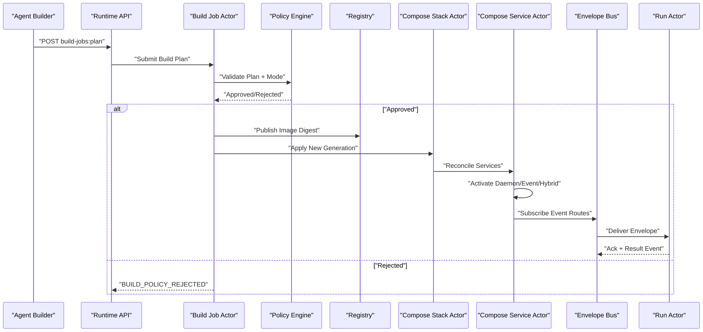

# AI Agent Script Container Runtime Blueprint（Docker + Compose + Autonomous Build 语义对齐版）

## 1. 文档元信息
- 状态：Proposed
- 版本：v3.3
- 日期：2026-02-28
- 适用范围：`src/`、`test/`、`docs/architecture/`、`tools/ci/`
- 目标：构建一套独立于 `src/workflow/*` 的 C# Script AI Agent 体系，对齐 Docker/OCI + Docker Compose 最佳实践，并支持智能体自主构建、长期对外服务与事件响应服务
- 分支：`feat/dynamic-gagent-script-runtime`

## 2. 术语评审结论（替换你的直觉名词）

| 你原先的直觉名词 | 推荐标准名词 | Docker/Compose 对齐语义 | 实现要求 |
|---|---|---|---|
| 定义 | Image | 不可变可分发运行单元 | 按 digest 不可变存储 |
| 实例 | Container | 基于 image 创建的可运行实例 | 生命周期独立、可启动/停止/销毁 |
| 脚本仓库 | Registry | image 存储与检索中心 | 支持 tag + digest 双索引 |
| 运行一次 | Exec Session | container 内的一次执行会话 | 独立 run_id，可取消/超时 |
| 装配环境 | Runtime | 容器启动与依赖注入环境 | 子容器隔离、可回收 |
| 多服务编排文件 | Compose Spec | 多服务声明式拓扑与依赖 | 版本化、可审计、可回放 |
| 一次编排发布 | Stack Deployment | 按 compose spec 拉起的服务树实例 | `desired_generation` 收敛到 `observed_generation` |
| 服务逻辑单元 | Compose Service | stack 内逻辑服务（可多副本） | service actor 持有事实态 |
| 智能体自构建任务 | Build Job | 智能体驱动的构建与发布闭环 | 必须通过策略门禁与审计 |
| 服务运行模式 | Service Mode | daemon/event/hybrid 三态 | 生命周期与SLO按模式约束 |

结论：后续文档与代码统一使用 `Image / Registry / Container / Exec Session / Compose Spec / Stack Deployment / Compose Service / Build Job / Service Mode / Runtime`。

## 3. 关键原则（最佳实践）
1. Build once, run many：Image 构建完成后不可变，多容器复用。
2. Image immutable：镜像内容只允许新增，不允许原地覆盖。
3. Runtime ephemeral：容器是运行态外壳，事实状态由 Actor 持久态与事件流承载。
4. Pin by digest：生产创建容器必须使用 digest，tag 仅作人类友好入口。
5. Least privilege：脚本运行最小权限、最小依赖、最小资源。
6. Single control plane：命令入口统一，禁止旁路“第二系统”。
7. Single projection pipeline：写侧事件统一进入现有 CQRS Projection Pipeline。
8. Actor is source of truth：跨请求/跨节点事实只在 Actor 持久态或分布式状态。
9. Declarative reconcile：Compose 编排以“期望状态 -> 收敛”驱动，而非命令式串行脚本。
10. Actor tree first：编排拓扑映射为 Actor 树，父子关系显式，禁止中间层暗箱路由。
11. Envelope-first messaging：跨服务消息一律通过 `Event Envelope`，附带 trace/correlation/causation 与幂等键。
12. Policy-guarded autonomy：智能体可自主构建/升级服务，但必须经过策略校验、审计与批准门槛。
13. Dual-mode serving：同一编排体系必须同时支持长期对外服务（daemon）与事件响应服务（event），并可组合为 hybrid。

## 4. 范围与非范围

### 4.1 范围
1. Script Image 模型、构建、发布、下线。
2. Script Registry（tag/digest 索引、拉取策略）。
3. Script Container 生命周期（create/start/stop/destroy）。
4. Exec Session 生命周期（run/cancel/timeout/retry）。
5. Script Compose Spec（多服务拓扑、依赖、扩缩容策略）。
6. Stack Deployment 生命周期（apply/up/reconcile/down）。
7. Event Envelope 协议与路由（跨 service/run）。
8. 动态 IoC 子容器与依赖隔离。
9. 与 `IRoleAgent`/`AIGAgentBase` 能力对齐。
10. 独立 API 面与读模型。
11. 安全、审计、观测、CI 门禁。
12. Autonomous Build Operator（计划、审计、构建、发布、回滚）。
13. Service Mode 管理（daemon/event/hybrid）与模式化 SLO。

### 4.2 非范围
1. 不依赖 Workflow DSL 或 Workflow 模块体系。
2. P0 不支持跨语言脚本。
3. P0 不做多租户计费。
4. P0 不做运行时任意第三方程序集加载市场。

## 5. 硬约束（必须满足）
1. 新体系项目禁止依赖 `src/workflow/*`。
2. Host 只做协议与装配，不做运行编排。
3. `Command -> Domain Event`，`Query -> ReadModel`，无写读混用。
4. 中间层禁止 `container_id/run_id/session_id/stack_id/service_id -> context` 事实态字典。
5. 回调线程只能发内部事件，不可直接改 Actor 运行态。
6. Container 运行镜像必须可追溯到 image digest。
7. 动态 IoC 仅实例级子容器，不允许根容器污染。
8. 脚本运行必须受白名单与资源限额约束。
9. 所有运行事件必须进入统一投影链路。
10. Compose 编排必须采用声明式期望状态与 generation 收敛模型。
11. Event Envelope 必须包含 `envelope_id/trace_id/correlation_id/causation_id/type_url/dedup_key/occurred_at`。
12. Stack 内跨 service 消息必须走 Envelope 路由，不允许服务间直接持有对方运行态引用。
13. 变更必须同时更新测试、门禁、文档。
14. 智能体生成的 build/compose 变更必须先通过策略门禁并固化为不可变 image digest，才允许进入部署收敛。
15. 每个 service 必须显式声明 `service_mode=daemon|event|hybrid`，禁止隐式默认模式。

## 6. 与现有 AI 主干的契约对齐

### 6.1 必须复用/兼容的现有能力
1. `IRoleAgent`：`SetRoleName`、`ConfigureAsync`。
2. `AIGAgentBase<TState>`：LLM、Tool、History、Hook、Middleware 能力组合。
3. `ILLMProviderFactory` 与 `IAgentToolSource`：Provider 与 Tool 生态接入。

### 6.2 兼容等级（冻结）
1. Adapter-only：脚本仅允许导出 `IScriptRoleEntrypoint`，由平台适配为 `IRoleAgent`。
2. 平台宿主（`ScriptRoleContainerAgent : RoleGAgent`）负责承接 `AIGAgentBase` 能力，不对脚本开放继承路径。
3. 发布门禁：未通过 Adapter 能力合同测试的 image 禁止发布。

## 7. 目标架构（Docker + Compose 对齐）

```mermaid
%%{init: {"maxTextSize": 100000, "flowchart": {"useMaxWidth": false, "nodeSpacing": 10, "rankSpacing": 50}, "themeVariables": {"fontSize": "10px"}}}%%
flowchart LR
    U["User/LLM"] --> API["Script Runtime API"]
    API --> CP["Control Plane (Application)"]
    CP --> BLD["Build Job Actor / Autonomous Build Operator"]
    BLD --> POL["Build & Service Mode Policy"]
    BLD --> IMG["Image Actor"]
    BLD --> CMP["Compose Stack Actor"]
    CMP --> SVC["Compose Service Actor"]
    SVC --> MOD["Service Mode Policy"]
    MOD --> PUB["Daemon Endpoint"]
    MOD --> SUB["Event Subscription"]
    SVC --> CTR["Container Actor"]
    CTR --> RUN["Exec Session Actor"]
    IMG --> REG["Registry"]
    CTR --> RT["Container Runtime + IOC Subcontainer"]
    RT --> AG["IRoleAgent-Compatible Script Agent"]
    SVC --> ENV["Event Envelope Bus"]
    SUB --> ENV
    ENV --> RUN
    CMP --> EVT["Domain Events"]
    BLD --> EVT
    SVC --> EVT
    CTR --> EVT
    RUN --> EVT
    EVT --> PROJ["Unified Projection Pipeline"]
    PROJ --> RM["ReadModel / Query / SSE / WS"]
```

## 8. 领域模型（推荐实现）

### 8.1 ScriptImage
1. `image_name`
2. `tag`
3. `digest`
4. `source_bundle`
5. `compiled_artifact_digest`
6. `capability_manifest`
7. `security_profile`
8. `status`（Draft/Published/Deprecated/Revoked）

### 8.2 ScriptContainer
1. `container_id`
2. `image_digest`
3. `runtime_profile`（cpu/memory/timeout）
4. `network_profile`
5. `secret_refs`
6. `status`（Created/Running/Stopped/Destroyed）

### 8.3 ExecSession
1. `run_id`
2. `container_id`
3. `entrypoint`
4. `input`
5. `status`（Pending/Running/Succeeded/Failed/Canceled/TimedOut）
6. `result`

### 8.4 ScriptComposeStack
1. `stack_id`
2. `compose_spec_digest`
3. `services[service_name]`
4. `desired_generation`
5. `observed_generation`
6. `reconcile_status`（Reconciling/Converged/Failed）

### 8.5 ScriptComposeService
1. `stack_id`
2. `service_name`
3. `image_ref`
4. `replicas_desired`
5. `replicas_ready`
6. `depends_on`
7. `restart_policy`
8. `rollout_policy`

### 8.6 ScriptEventEnvelope
1. `envelope_id`
2. `trace_id`
3. `correlation_id`
4. `causation_id`
5. `stack_id/service_name/container_id/run_id`
6. `type_url`
7. `schema_version`
8. `dedup_key`
9. `occurred_at`
10. `payload`

### 8.7 ScriptBuildJob
1. `build_job_id`
2. `requested_by_agent_id`
3. `target_stack_id/service_name`
4. `source_bundle_digest`
5. `build_plan_digest`
6. `policy_decision`（Pending/Approved/Rejected）
7. `result_image_digest`
8. `status`（Planned/Running/Succeeded/Failed/RolledBack）

### 8.8 ScriptServiceRuntimeProfile
1. `service_mode`（Daemon/Event/Hybrid）
2. `public_endpoints[]`（daemon/hybrid）
3. `event_subscriptions[]`（event/hybrid）
4. `min_replicas/max_replicas`
5. `event_concurrency_limit`
6. `graceful_shutdown_timeout`

## 9. 生命周期规范（对齐 Docker + Compose）

### 9.1 Image 生命周期
1. Build：源码 + 策略审计 + 编译生成 artifact。
2. Publish：写入 Registry，生成 digest，绑定 tag。
3. Pull：Container 创建时解析 image_ref 到 digest。
4. Deprecate/Revoke：禁止新容器创建，保留历史可审计性。

### 9.2 Container 生命周期
1. Create：基于 image digest 创建容器事实。
2. Start：构建实例 IoC 子容器并激活脚本 agent。
3. Stop：停止会话接收并释放运行资源。
4. Destroy：销毁容器资源，保留最小审计事实。

### 9.3 Exec 生命周期
1. Start：创建 run actor，绑定 run_id。
2. Execute：事件化推进，支持 cancel/timeout/retry。
3. Complete：发布结果事件并更新读模型。
4. Cleanup：释放 run scope 与临时资源。

### 9.4 Compose Stack 生命周期
1. Apply：提交 compose spec（版本化 + digest 化）。
2. Up：建立 stack root actor，进入 reconcile。
3. Reconcile：对比 `desired_generation` 与 `observed_generation`，按 service 依赖顺序收敛。
4. Rolling Update：按 rollout 策略替换实例并保持最小可用副本。
5. Scale：修改 `replicas_desired` 并收敛到 `replicas_ready`。
6. Down：按依赖反序有序回收 service/container/run。

### 9.5 Service Mode 生命周期
1. Daemon：持续对外提供 endpoint，受健康检查与最小副本约束。
2. Event：仅在事件到达时触发 run，执行完成后可回收到空闲态。
3. Hybrid：同时保持 daemon endpoint 与 event subscription，事件处理与在线服务共享同一事实源。
4. Mode Switch：模式切换必须通过 compose generation 变更触发，禁止进程内热改事实态。

### 9.6 Autonomous Build 生命周期
1. Plan：智能体提交 build plan（源码差异、目标 service、风险评估）。
2. Validate：策略引擎执行安全/依赖/资源/合规校验。
3. Approve：满足自动批准规则则继续，否则进入人工批准队列。
4. Build & Publish：编译并发布 image digest，记录 Build Job 事件链。
5. Deploy：更新 compose spec 并进入 reconcile。
6. Rollback：新 generation 不健康时回退到上一稳定 digest。

### 9.7 Autonomous Build -> Compose 收敛时序

## 10. 动态 IoC 最佳实践
1. 根容器只放平台能力，脚本依赖全部进实例子容器。
2. 子容器必须可异步销毁，并与 container lifecycle 绑定。
3. Secret 通过引用注入，不把明文写入 image。
4. 禁止脚本注册覆盖平台核心服务。
5. 运行会话使用 scoped service，run 结束强制回收。
6. Compose service 级依赖注入仅作用于 service 子树，禁止跨 service 污染。

## 11. 安全模型（最低可接受）
1. 编译前 AST/语义审计：禁用危险 API（进程启动、文件系统越权、反射逃逸）。
2. 编译引用白名单：仅允许授权程序集。
3. 运行资源限额：CPU、内存、执行时长、并发 run 数。
4. 网络策略：默认 deny，按 profile 放行。
5. 审计日志：记录 image digest、stack_id、service_name、container_id、run_id、caller。
6. Envelope payload 必须通过 schema 校验与大小限制。

## 12. API 设计（独立于 Workflow）

### 12.1 Image API
1. `POST /api/script-runtime/images:build`
2. `POST /api/script-runtime/images/{imageName}/tags/{tag}:publish`
3. `GET /api/script-runtime/images/{imageName}/tags/{tag}`
4. `GET /api/script-runtime/images/{imageName}/digests/{digest}`

### 12.2 Container API
1. `POST /api/script-runtime/containers:create`
2. `POST /api/script-runtime/containers/{containerId}:start`
3. `POST /api/script-runtime/containers/{containerId}:stop`
4. `DELETE /api/script-runtime/containers/{containerId}`

### 12.3 Exec API
1. `POST /api/script-runtime/containers/{containerId}/exec`
2. `POST /api/script-runtime/runs/{runId}:cancel`
3. `GET /api/script-runtime/runs/{runId}`
4. `GET /api/script-runtime/containers/{containerId}/runs`

### 12.4 Compose API
1. `POST /api/script-runtime/compose:apply`
2. `POST /api/script-runtime/compose/{stackId}:up`
3. `POST /api/script-runtime/compose/{stackId}:down`
4. `POST /api/script-runtime/compose/{stackId}/services/{serviceName}:scale`
5. `POST /api/script-runtime/compose/{stackId}/services/{serviceName}:rollout`
6. `GET /api/script-runtime/compose/{stackId}`
7. `GET /api/script-runtime/compose/{stackId}/services`
8. `GET /api/script-runtime/compose/{stackId}/events`

### 12.5 Autonomous Build API
1. `POST /api/script-runtime/build-jobs:plan`
2. `POST /api/script-runtime/build-jobs/{buildJobId}:validate`
3. `POST /api/script-runtime/build-jobs/{buildJobId}:approve`
4. `POST /api/script-runtime/build-jobs/{buildJobId}:execute`
5. `POST /api/script-runtime/build-jobs/{buildJobId}:rollback`
6. `GET /api/script-runtime/build-jobs/{buildJobId}`
7. `GET /api/script-runtime/build-jobs`

## 13. 需求矩阵（Docker + Compose 对齐版）

| ID | 需求 | 验收标准 | 当前状态 | 差距 |
|---|---|---|---|---|
| R-IMG-01 | Image 可构建 | build 成功返回 digest | Planned | 缺 build pipeline |
| R-IMG-02 | Image 不可变 | 相同 digest 内容不可改写 | Planned | 缺 immutability guard |
| R-IMG-03 | Tag 可追溯 | tag 可解析到唯一 digest | Planned | 缺 registry 模型 |
| R-CTR-01 | Container 生命周期完整 | create/start/stop/destroy 事件闭环 | Planned | 缺 container actor |
| R-CTR-02 | Digest 绑定运行 | 运行容器必须绑定 digest | Planned | 缺 pull policy |
| R-RUN-01 | Exec 可控 | cancel/timeout/retry 事件化生效 | Planned | 缺 run actor |
| R-CMP-01 | Compose 可声明式发布 | apply/up 后形成 stack actor 树 | Planned | 缺 compose actor |
| R-CMP-02 | Compose 可收敛 | desired/observed generation 最终一致 | Planned | 缺 reconcile engine |
| R-CMP-03 | Service 可扩缩容/滚动 | scale/rollout 事件可回放恢复 | Planned | 缺 service actor |
| R-ENV-01 | Envelope 协议统一 | 所有跨 service 消息走 envelope，含 trace/correlation | Planned | 缺 envelope bus |
| R-SVC-01 | 长期服务模式 | daemon 模式下 endpoint 连续可用且可滚动升级 | Planned | 缺 mode runtime |
| R-SVC-02 | 事件响应模式 | event 模式可按 envelope 触发 run 并完成去重对账 | Planned | 缺 event activation |
| R-AUTO-01 | 智能体自主构建 | build plan->validate->build->publish->deploy 闭环可追溯 | Planned | 缺 build operator |
| R-AUTO-02 | 自构建安全门禁 | agent 产物未过策略校验不得部署 | Planned | 缺 policy gate |
| R-AI-01 | IRoleAgent 兼容 | Adapter-only 合同达标（脚本不可直接实现 IRoleAgent） | Planned | 缺适配层 |
| R-IOC-01 | 子容器隔离 | 跨容器服务无污染 | Planned | 缺容器工厂 |
| R-SEC-01 | 安全白名单 | 非白名单 API 可阻断发布或运行 | Planned | 缺审计器 |
| R-PROJ-01 | 统一投影 | Image/Compose/Container/Run 事件可查询 | Planned | 缺 reducer/projector |
| R-GOV-01 | CI 守卫 | workflow 依赖与反模式可阻断 | Planned | 缺专项脚本 |

## 14. 重构工作包（WBS）

### WP-1：Image/Registry 领域（P0）
- 交付：Image Actor、Registry Port、tag/digest 索引。
- DoD：build/publish/pull 最小闭环。

### WP-2：Compose 编排领域（P0）
- 交付：Stack Actor、Service Actor、Reconcile 协议、Envelope Bus。
- DoD：apply/up/scale/rollout/down 可收敛且可回放。

### WP-3：Autonomous Build 领域（P0）
- 交付：Build Job Actor、Plan/Validate/Approve/Execute 协议、策略门禁端口。
- DoD：智能体自构建闭环可追溯，可阻断高风险变更。

### WP-4：Container/Exec 领域（P0）
- 交付：Container Actor、Exec Actor、生命周期事件。
- DoD：create/start/exec/stop/destroy 可回放恢复。

### WP-5：IRoleAgent 兼容层（P0）
- 交付：Adapter-only 契约（`IScriptRoleEntrypoint -> ScriptRoleCapabilityAdapter -> IRoleAgent`）。
- DoD：脚本 agent 能力可被平台以 `IRoleAgent` 语义稳定调用。

### WP-6：Script Runtime + IOC（P0）
- 交付：编译器、沙箱、子容器工厂、缓存。
- DoD：隔离、安全、回收三个维度可测试。

### WP-7：API + Query + Projection（P1）
- 交付：独立 API、read model、实时输出。
- DoD：可查询 image/build-job/compose/container/run 全状态。

### WP-8：治理与门禁（P1）
- 交付：架构守卫、稳定性守卫、合同测试矩阵。
- DoD：违规提交可自动阻断。

## 15. 验证矩阵（与实施文档同口径）

| 范围 | 命令 | 通过标准 |
|---|---|---|
| 架构守卫 | `bash tools/ci/architecture_guards.sh` | 通过且无 workflow 依赖回流 |
| 文档一致性守卫 | `bash tools/ci/architecture_doc_consistency_guards.sh` | `Adapter-only`、Compose、Host 策略口径一致 |
| 投影路由 | `bash tools/ci/projection_route_mapping_guard.sh` | TypeUrl 精确路由通过 |
| 分片构建 | `bash tools/ci/solution_split_guards.sh` | Foundation/AI/CQRS/Hosting 通过 |
| 分片测试 | `bash tools/ci/solution_split_test_guards.sh` | Foundation/CQRS/Workflow 分片测试通过 |
| 稳定性守卫 | `bash tools/ci/test_stability_guards.sh` | 无违规轮询等待 |
| Script Build | `dotnet test test/Aevatar.AI.Script.Build.Tests/Aevatar.AI.Script.Build.Tests.csproj --nologo` | build plan/policy/approval 合同通过 |
| Script Compose | `dotnet test test/Aevatar.AI.Script.Compose.Tests/Aevatar.AI.Script.Compose.Tests.csproj --nologo` | reconcile/envelope 合同通过 |
| Script Core | `dotnet test test/Aevatar.AI.Script.Core.Tests/Aevatar.AI.Script.Core.Tests.csproj --nologo` | Image/Container/Run 合同通过 |
| Script Infra | `dotnet test test/Aevatar.AI.Script.Infrastructure.Tests/Aevatar.AI.Script.Infrastructure.Tests.csproj --nologo` | 沙箱与 IOC 隔离通过 |
| Script API | `dotnet test test/Aevatar.AI.Script.Hosting.Tests/Aevatar.AI.Script.Hosting.Tests.csproj --nologo` | daemon/event/hybrid + compose API 合同通过 |
| 性能基线 | `bash tools/ci/script_runtime_perf_guards.sh` | P95 `exec start` < 200ms；P95 首 token < 800ms |
| 可用性基线 | `bash tools/ci/script_runtime_availability_guards.sh` | 30 分钟稳定性场景成功率 >= 99.5% |
| 故障恢复 | `bash tools/ci/script_runtime_resilience_guards.sh` | cancel/timeout/restart 后状态一致，且回收与卸载达标 |

## 16. SLO 门槛（上线前必须达标）

| 指标 | 门槛 |
|---|---|
| `exec_start_latency_p95` | < 200ms |
| `first_token_latency_p95` | < 800ms |
| `run_success_rate_30m` | >= 99.5% |
| `daemon_service_uptime_30m` | >= 99.95% |
| `event_envelope_ack_latency_p95` | < 300ms |
| `compose_reconcile_latency_p95` | < 2s |
| `envelope_delivery_success_rate_30m` | >= 99.9% |
| `container_reclaim_time_p95` | < 5s |
| `script_alc_unload_success_rate` | >= 99.9% |

## 17. 风险与应对
1. 风险：tag 漂移导致运行不可复现。
- 应对：生产创建容器只允许 digest；tag 仅用于解析。

2. 风险：脚本越权执行。
- 应对：发布前审计 + 运行时配额 + 网络默认拒绝。

3. 风险：容器泄漏与内存增长。
- 应对：生命周期强绑定 + 异步回收 + 指标告警。

4. 风险：Envelope 乱序导致重复推进。
- 应对：`dedup_key + causation_id + expected_generation` 对账，陈旧 envelope 丢弃。

5. 风险：智能体自构建误发布高风险变更。
- 应对：plan 风险分级 + 策略门禁 + 自动/人工批准分流 + 可审计回滚。

6. 风险：与 AI 主干契约分叉。
- 应对：`IRoleAgent` 兼容性合同测试作为强制门禁。

## 18. 执行清单与快照（2026-02-28）
- [ ] WP-1 Image/Registry
- [ ] WP-2 Compose 编排领域
- [ ] WP-3 Autonomous Build 领域
- [ ] WP-4 Container/Exec
- [ ] WP-5 IRoleAgent 兼容层
- [ ] WP-6 Script Runtime + IOC
- [ ] WP-7 API + Query + Projection
- [ ] WP-8 治理与门禁

当前状态：文档已完成 Docker + Compose 语义重构，代码尚未开始。
