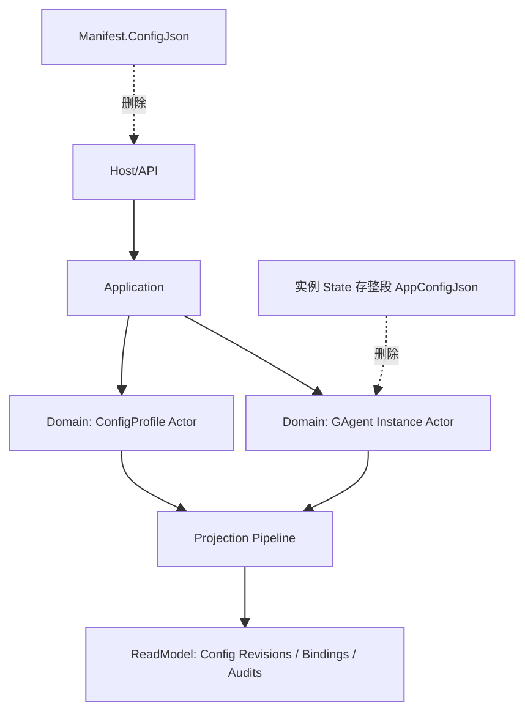
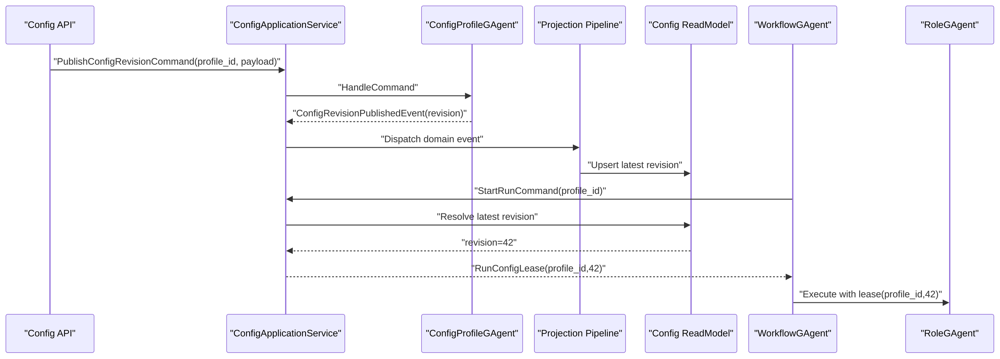

# GAgent 配置系统彻底重构蓝图（不兼容版）

## 1. 文档元信息
- 状态：`Proposed`
- 版本：`v1`
- 日期：`2026-03-05`
- 范围：`Aevatar.Foundation.* / Aevatar.AI.* / workflow/*`
- 决策级别：`Architecture Breaking Change`

## 2. 背景与关键决策
当前 GAgent 配置机制同时使用两条事实链路：
1. `Manifest.ConfigJson`（框架配置持久化）
2. 领域事件 + `State`（部分配置字段事件化）

该设计导致配置事实源不唯一、配置作用域不明确（实例级/类型级/运行级混杂）、大规模实例更新成本线性增长，并引入回放同态风险。

本蓝图做以下不可逆决策：
1. 删除 `GAgentBase<TState, TConfig>` 配置持久化模型。
2. 删除“实例 State 持久化整段配置 JSON”的模型。
3. 建立“配置 Profile Actor 作为唯一配置事实源”。
4. 配置生效改为“实例绑定 Profile 引用 + run 级 lease 固定 revision”。
5. 不做兼容，不保留旧事件协议回放语义。

## 3. 重构目标
1. 配置事实源唯一：跨实例共享配置只存一份。
2. 配置作用域清晰：`Profile 级`、`Instance 级引用`、`Run 级固定 revision`。
3. 更新复杂度下降：配置更新从 `O(实例数)` 降为 `O(1)` 写入。
4. 回放同态：实例回放不依赖 `Manifest.ConfigJson`。
5. 严格分层：配置治理进入独立 Domain/Application/Infrastructure/Host 主链路。

## 4. 范围与非范围
范围：
1. Foundation 配置基类、Manifest 配置职责、Actor 配置绑定机制。
2. AI `RoleGAgent` 配置事件与状态结构。
3. Workflow -> Role 配置注入与运行时配置解析路径。
4. 配置命令/查询 API 与投影读模型。

非范围：
1. 旧事件流在线迁移工具。
2. 旧 API 字段兼容层。
3. 历史实例无损平滑升级。

## 5. 架构硬约束（必须满足）
1. 配置事实源只能是 `ConfigProfile` 事件流状态；禁止 `Manifest.ConfigJson` 承载业务配置语义。
2. `GAgent State` 仅保存运行态与配置引用，不保存可跨实例共享的大配置内容。
3. 配置更新命令只能写 `ConfigProfile Actor`，不得 fanout 写所有实例 Actor。
4. run 执行必须显式固定 `profile_id + revision`，禁止运行中隐式漂移。
5. Query 只能读配置 ReadModel；Command 只能通过配置 Actor 产生日志化事件。
6. 禁止中间层维护 `instance_id -> config` 进程内事实态映射。

## 6. 当前基线（代码事实）
1. `GAgentBase<TState, TConfig>` 在激活/配置变更时读写 `Manifest.ConfigJson`。
   - 证据：`src/Aevatar.Foundation.Core/GAgentBase.TState.TConfig.cs`
2. `RoleGAgent` 将 `app_config_*` 写入 `RoleGAgentState`，并由 `SetRoleAppConfigEvent` 驱动补丁。
   - 证据：`src/Aevatar.AI.Core/RoleGAgent.cs`
   - 证据：`src/Aevatar.AI.Abstractions/ai_messages.proto`
3. 测试已承认“双事实源拼接恢复”语义（基础配置来自 manifest，app config 来自回放）。
   - 证据：`test/Aevatar.AI.Tests/RoleGAgentReplayContractTests.cs`

## 7. 目标架构总览

## 8. 新领域模型
### 8.1 ConfigProfile（共享配置聚合）
聚合根：`ConfigProfileGAgent`

主键建议：
1. `profile_scope`（如 `role-agent`）
2. `profile_id`

状态：
1. `LatestRevision`
2. `Revisions`（不可变快照元信息：`revision/hash/schema/version/timestamp`）
3. `Status`（`Active/Archived`）

命令：
1. `CreateConfigProfileCommand`
2. `PublishConfigRevisionCommand`
3. `ArchiveConfigProfileCommand`

事件：
1. `ConfigProfileCreatedEvent`
2. `ConfigRevisionPublishedEvent`
3. `ConfigProfileArchivedEvent`

### 8.2 InstanceConfigBinding（实例绑定聚合）
落点：每个业务 Actor 的 `State`，仅保存引用：
1. `BoundProfileId`
2. `BoundRevisionPolicy`（`Pinned` 或 `TrackLatest`）
3. `PinnedRevision`（当 `Pinned` 时必填）

命令：
1. `BindInstanceConfigProfileCommand`
2. `PinInstanceConfigRevisionCommand`

事件：
1. `InstanceConfigProfileBoundEvent`
2. `InstanceConfigRevisionPinnedEvent`

### 8.3 RunConfigLease（运行级配置租约）
运行开始时签发不可变租约：
1. `run_id`
2. `profile_id`
3. `revision`
4. `issued_at`

规则：
1. 同一 `run_id` 全程固定 revision。
2. 配置更新只影响后续新 run。

## 9. 新分层职责
### 9.1 Domain
1. 配置 Profile 事件溯源状态机。
2. 实例绑定状态机。
3. run 级 lease 不变量校验。

### 9.2 Application
1. 配置命令编排服务（发布 revision、绑定实例、签发 lease）。
2. 配置查询服务（最新 revision、指定 revision、绑定关系）。
3. Workflow/Role 启动流程中的 lease 注入。

### 9.3 Infrastructure
1. `ConfigProfile` 事件存储适配。
2. 配置投影到统一 Projection Pipeline。
3. ReadModel 提供器（InMemory/Elasticsearch/Neo4j）。

### 9.4 Host
1. 配置管理 API（command/query 分离）。
2. Workflow/Chat API 仅透传 `profile_id` 或 `lease`，不承载业务配置拼装。

## 10. 协议重构（不兼容）
### 10.1 删除的协议/字段
1. 删除 `GAgentBase<TState, TConfig>`。
2. 删除 `Manifest.ConfigJson` 的业务配置语义。
3. 删除 `RoleGAgentState.app_config_json/app_config_codec/app_config_schema_version`。
4. 删除 `SetRoleAppConfigEvent`。
5. 删除 `ConfigureRoleAgentEvent` 中承载共享配置 JSON 的职责。

### 10.2 新协议
1. `ConfigureRoleAgentEvent` 仅承载实例不可共享元信息（如 `role_name`、运行策略引用）。
2. 新增配置域事件：
   - `ConfigProfileCreatedEvent`
   - `ConfigRevisionPublishedEvent`
   - `InstanceConfigProfileBoundEvent`
   - `RunConfigLeaseIssuedEvent`
3. API 输入统一为单语义字段：
   - `profile_id`
   - `revision_policy`
   - `revision`（可选，显式 pin）

## 11. 关键执行链路

## 12. 迁移策略（不兼容切换）
1. 新集群/新命名空间启动，旧配置流与旧事件流不回放。
2. 冻结旧 API 写入，导出“逻辑配置定义”到离线文件。
3. 通过新配置 API 批量导入 Profile 与 revision。
4. 重建实例绑定关系（绑定到 profile，不导入旧实例配置快照）。
5. 流量切换到新 API 与新运行时。
6. 删除旧配置代码与旧测试契约，执行全量门禁。

## 13. 删除清单（必须执行）
1. `src/Aevatar.Foundation.Core/GAgentBase.TState.TConfig.cs`
2. `AgentManifest.ConfigJson` 字段及相关读写逻辑
3. `SetRoleAppConfigEvent`（proto + contract + handler + tests）
4. `RoleGAgentState` 中 `app_config_*` 字段
5. 文档中所有“app config 写入 RoleGAgentState”描述

## 14. 风险与治理
1. 风险：切换期配置缺失导致 run 启动失败。
   - 治理：`StartRun` 前强校验 `profile_id/revision`，缺失即 fail-fast。
2. 风险：配置 revision 暴增导致读模型膨胀。
   - 治理：保留 revision 元数据索引与归档策略。
3. 风险：run 使用“latest”造成不可重复执行。
   - 治理：所有 run 入场时强制签发 lease 并写事件。

## 15. 验证矩阵
| ID | 验证目标 | 命令 | 通过标准 |
|---|---|---|---|
| V1 | 架构分层与禁用旧模式 | `bash tools/ci/architecture_guards.sh` | 无违例 |
| V2 | 事件路由正确性 | `bash tools/ci/projection_route_mapping_guard.sh` | 无违例 |
| V3 | 分片构建通过 | `bash tools/ci/solution_split_guards.sh` | 全绿 |
| V4 | 分片测试通过 | `bash tools/ci/solution_split_test_guards.sh` | 全绿 |
| V5 | 全量测试通过 | `dotnet test aevatar.slnx --nologo` | 全绿 |
| V6 | 轮询等待门禁 | `bash tools/ci/test_stability_guards.sh` | 无违例 |

## 16. 完成定义（Final DoD）
1. 代码中不存在 `Manifest.ConfigJson` 的业务配置读写。
2. 代码中不存在实例状态持久化共享配置 JSON。
3. 配置更新路径仅剩 `ConfigProfile` 命令链路。
4. run 路径均携带 `RunConfigLease`。
5. 统一投影链路上可查询 `Profile/Revision/Binding/Lease` 读模型。
6. 文档、测试、门禁全部更新并通过。

## 17. 实施工作包（WBS）
1. `WP1`：Foundation 配置基类删除与 Manifest 清理。
2. `WP2`：ConfigProfile Domain（命令、事件、状态机）。
3. `WP3`：Instance 绑定与 Run Lease 机制。
4. `WP4`：AI/Workflow 接入新配置解析路径。
5. `WP5`：Projection/ReadModel 与 Host API。
6. `WP6`：旧契约删除、文档与测试重建、CI 守卫升级。

## 18. 附录：命名与目录建议
1. `src/Aevatar.Configuration.Domain`
2. `src/Aevatar.Configuration.Application`
3. `src/Aevatar.Configuration.Infrastructure`
4. `src/Aevatar.Configuration.Host`
5. `src/Aevatar.AI.Abstractions` 仅保留 AI 语义事件，不再承载配置中心语义

