# Aevatar.Mainnet.Host.Api Distributed Architecture (Orleans + TM + Kafka)

## 目标

将 `src/Aevatar.Mainnet.Host.Api` 从单机默认运行模式扩展为可配置的分布式运行模式：

- Actor Runtime: `Orleans`
- Stream Backend: `MassTransitAdapter`
- Transport: `Kafka`

默认仍保留 InMemory 模式；仅当 `ActorRuntime:Provider=Orleans` 时启用分布式 Silo。

## 入口与装配

- 程序入口：`src/Aevatar.Mainnet.Host.Api/Program.cs`
- 分布式入口扩展：`src/Aevatar.Mainnet.Host.Api/Hosting/MainnetDistributedHostBuilderExtensions.cs`
- 分布式配置模板：`src/Aevatar.Mainnet.Host.Api/appsettings.Distributed.json`

`Program.cs` 装配顺序：

1. `AddAevatarDefaultHost(...)`（Bootstrap + Runtime Provider 选择）
2. `AddMainnetDistributedOrleansHost()`（按配置启用 Orleans Silo）
3. `AddWorkflowCapabilityWithAIDefaults()`
4. `AddWorkflowMakerExtensions()`

## 关键配置

### ActorRuntime

- `ActorRuntime:Provider=Orleans`
- `ActorRuntime:OrleansStreamBackend=MassTransitAdapter`
- `ActorRuntime:MassTransitTransportBackend=Kafka`
- `ActorRuntime:MassTransitKafkaBootstrapServers`
- `ActorRuntime:MassTransitKafkaTopicName`
- `ActorRuntime:MassTransitKafkaConsumerGroup`

### Orleans

- `Orleans:ClusteringMode` (`Localhost` / `Development`)
- `Orleans:ClusterId`
- `Orleans:ServiceId`
- `Orleans:SiloHost`
- `Orleans:PrimarySiloEndpoint`
- `Orleans:SiloPort`
- `Orleans:GatewayPort`
- `Orleans:QueueCount`
- `Orleans:QueueCacheSize`

## 运行拓扑

```mermaid
%%{init: {"maxTextSize": 100000, "flowchart": {"useMaxWidth": false, "nodeSpacing": 10, "rankSpacing": 50}, "themeVariables": {"fontSize": "10px"}}}%%
flowchart LR
    A["Client / API Caller"] --> B["Aevatar.Mainnet.Host.Api"]
    B --> C["IActorRuntime (Orleans)"]
    C --> D["RuntimeActorGrain / Domain Actors"]
    D --> E["Orleans Stream Provider"]
    E --> F["MassTransit Queue Adapter"]
    F --> G["Kafka Topic"]
    G --> F
    F --> E
    E --> D
```



## 语义说明

- 写路径保持 `Command -> Event`，事件通过 Orleans Stream + Kafka 扩散。
- Stream Forward/Topology 的权威状态仍在 Orleans Grain（`IStreamTopologyGrain`），非中间层进程内事实态。
- 该版本不改业务层编排逻辑，仅替换 runtime 与传输实现。
- `Localhost` 模式使用 `UseLocalhostClustering`，适合本机多进程开发。
- `Development` 模式使用 `UseDevelopmentClustering + ConfigureEndpoints`，可通过主节点实现多机测试集群。
- 生产跨主机集群建议替换为持久化 Membership Provider。

## 启动示例

```bash
docker compose up -d kafka
# MassTransit 9 需要 License（MT_LICENSE 或 MT_LICENSE_PATH）
# export MT_LICENSE="<your-base64-license>"
ASPNETCORE_ENVIRONMENT=Distributed dotnet run --project src/Aevatar.Mainnet.Host.Api
```

## 多机测试集群（Docker）

仓库提供 `docker-compose.mainnet-cluster.yml` + `tools/cluster/*.sh`：

```bash
export MT_LICENSE="<your-base64-license>"
bash tools/cluster/start-mainnet-cluster.sh
```

节点入口：

- `http://localhost:19081`
- `http://localhost:19082`
- `http://localhost:19083`

停止：

```bash
bash tools/cluster/stop-mainnet-cluster.sh
```

## 验证

```bash
dotnet build src/Aevatar.Mainnet.Host.Api/Aevatar.Mainnet.Host.Api.csproj --nologo
```
