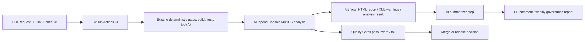

# Aevatar NDepend 与 AI 自动化质量治理集成蓝图（2026-03-08）

## 1. 文档元信息

- 状态：Proposed
- 版本：R1
- 日期：2026-03-08
- 目标分支：`chore/ndepend-ai-automation-integration-20260308`
- 适用范围：
  - `.github/workflows/ci.yml`
  - `tools/ci`
  - `docs/architecture`
  - 计划新增 `.ndepend/`
  - 计划新增 `artifacts/ndepend/`
- 非目标：
  - 用 NDepend 替换现有 `tools/ci/*.sh` 架构门禁
  - 让 AI 直接决定 PR 是否可合并
  - 在本轮同时引入 SonarQube、CodeQL、Stryker 等第二批治理平台
  - 在本轮实现全自动代码修复与自动合并
- 文档定位：本蓝图用于指导仓库以“确定性质量门禁 + AI 解释与协作层”的方式，引入 NDepend 到现有 GitHub Actions 流程，并形成 PR 评审、主干趋势和架构治理闭环。

## 2. 背景与关键决策（统一认知）

当前仓库已经具备较强的确定性质量门禁能力：

1. `ci.yml` 已将 PR、push、schedule 区分为多条独立门禁链路。
2. `tools/ci/architecture_guards.sh` 已承载大量仓库级架构硬约束。
3. `tools/ci/coverage_quality_guard.sh` 已将覆盖率纳入强制门禁。
4. 当前仍缺少一个面向 `.NET` 的统一质量度量引擎，用于承载复杂度、耦合度、依赖关系、技术债、趋势监控与基线比较。
5. 当前也缺少一层“对人友好”的自动解释能力，无法把静态报告压缩成可直接消费的 PR 评论、周报和重构候选清单。

本次集成采用以下关键决策：

### 决策 A：保留现有脚本门禁为仓库级权威规则

- `tools/ci/architecture_guards.sh`、`test_stability_guards.sh`、`coverage_quality_guard.sh` 继续保留。
- 仓库特有的强架构约束，仍以脚本、测试、编译规则为第一事实源。
- NDepend 不替代这些规则，而是补上“复杂度/依赖/趋势/技术债”治理维度。

### 决策 B：NDepend 只承担确定性分析与质量门禁

- NDepend 负责：
  - 复杂度、耦合、依赖、代码规则、技术债、趋势分析
  - 质量门禁判定
  - 结构化报告与 HTML 报告产出
- NDepend 作为 CI 中的确定性步骤运行，返回非零退出码时直接 fail。

### 决策 C：AI 不做裁决，只做解释、聚合、归因与建议

- AI 不直接参与 merge gate 判定。
- AI 只消费：
  - `NDepend` 产出的确定性结果
  - 当前 PR diff
  - 仓库架构文档与规则说明
- AI 输出：
  - PR 评论
  - 新增问题摘要
  - 重构建议
  - 周期性趋势解读

### 决策 D：质量裁决保持单一权威链路

- 能否合并由以下确定性结果共同决定：
  - `dotnet build/test`
  - 现有 `tools/ci` 门禁
  - NDepend `Quality Gates`
- AI 评论不应成为第二套隐式门禁，更不能出现“CI 通过但 AI 口头否决”的双轨治理。

### 决策 E：采用分阶段灰度接入

- Phase 1：只生成 NDepend 报告，不阻断 PR。
- Phase 2：对“新问题/新债务/关键依赖违规”启用 `Quality Gates`。
- Phase 3：引入 AI PR 评论，仅解释增量问题。
- Phase 4：引入主干/定时趋势报告和治理看板。

### 决策 F：优先使用 MultiOS CLI 集成

- 仓库当前 CI 运行在 GitHub Actions Ubuntu runner 上。
- 首选 `NDepend.Console.MultiOS.dll` 接入，原因是：
  - 更贴近现有 `tools/ci/*.sh` 脚本化风格
  - 易于本地 macOS 复现
  - 输出路径、报告归档与 AI 消费链路更可控
- 若后续组织已具备官方 GitHub Action License，可再评估切换或补充官方 action。

### 决策 G：PR 只聚焦增量问题，不回灌全量历史债务

- AI 评论默认只关注：
  - 本次改动新增的问题
  - 被本次改动放大的问题
  - 与当前 diff 直接相关的趋势退化
- 历史存量债务通过主干报告和周期性治理任务处理，不在 PR 中一次性倾倒。

## 3. 重构目标

本次集成的可验收目标如下：

1. 在仓库中建立可版本化的 NDepend 项目配置，并支持 GitHub Actions Ubuntu 与本地 macOS 复现。
2. 在现有 CI 流程中新增 NDepend 分析步骤，产出 HTML 报告、结构化结果与质量门禁状态。
3. 将复杂度、耦合、依赖边界、新增技术债等指标纳入确定性质量门禁。
4. 引入 AI 汇总层，将 NDepend 输出与 PR diff 结合，形成简洁的增量评论。
5. 保持“AI 只解释、NDepend 只判定”的职责边界，避免双轨裁决。
6. 在主干或定时任务中生成趋势报告，支持治理优先级排序。
7. 文档、门禁、脚本与 CI 配置形成闭环，并可被新成员按文档复现。

## 4. 范围与非范围

### 4.1 范围

- 设计并落地 NDepend 目录结构与项目文件
- 将 NDepend 接入 GitHub Actions CI
- 定义首批 Quality Gates 和规则分类
- 产出供 AI 消费的报告与摘要输入
- 设计 AI PR 评论与周期性治理报告的执行方式
- 定义本地复现、主干基线、历史结果归档策略
- 同步更新架构文档与操作约定

### 4.2 非范围

- 本轮不替换现有 Roslyn analyzers、coverage guard、architecture guards
- 本轮不把 AI 变成强制 merge reviewer
- 本轮不做全仓历史债务大规模清理
- 本轮不要求所有 NDepend 规则一次到位
- 本轮不引入第二个静态分析平台形成平台竞争

## 5. 架构硬约束（必须满足）

1. 必须保持 `Domain / Application / Infrastructure / Host` 分层约束的现有权威来源不变。
2. 必须先 `build/test`，再运行 NDepend；禁止跳过编译事实直接给 AI 产出结论。
3. 必须由 NDepend `Quality Gates` 或现有脚本的退出码决定构建失败；AI 不得直接决定 pass/fail。
4. 必须使用相对路径维护 `.ndproj`，保证 Ubuntu runner 与本地 macOS 可复用。
5. 必须将 NDepend 视为“.NET 深度治理补充层”，而非仓库架构规则的唯一来源。
6. 必须保证 AI 只消费确定性输入，不允许 AI 通过自由搜索或猜测直接裁决代码质量。
7. 必须优先对“新增问题/新增债务”设门禁，避免首次接入即因历史问题淹没团队。
8. 必须保留报告归档路径，使问题可追溯、可复核、可比较。
9. 必须提供本地复现命令，避免质量问题只能在 CI 上观察。
10. 文档、脚本、CI 与阈值变更必须同步演进。

## 6. 当前基线（代码事实）

| 事实 | 代码证据 | 结论 |
| --- | --- | --- |
| GitHub Actions 已有 PR / push / schedule 多种执行模式 | `.github/workflows/ci.yml` | 现有 CI 结构适合追加独立 NDepend job |
| 已存在快速门禁层，且在 PR 上执行 | `.github/workflows/ci.yml` 中 `fast-gates` | NDepend 可作为独立补充，不必挤进所有现有脚本 |
| 架构硬约束主要由 shell guard 承载 | `tools/ci/architecture_guards.sh` | 仓库已采用“脚本即门禁”的治理方式 |
| 覆盖率已经被强制纳入 CI 质量门禁 | `tools/ci/coverage_quality_guard.sh` | NDepend 可复用覆盖率结果做更高级别质量判定 |
| 现有 CI 已有 `Restore and Build`、`dotnet test`、coverage job | `.github/workflows/ci.yml`、`tools/ci/coverage_quality_guard.sh` | NDepend 应插入到现有产物之后，而不是重复构建 |
| 当前仓库没有 NDepend 项目文件与 NDepend CI 步骤 | `.github/workflows/ci.yml`、`tools/ci/*` 当前基线 | NDepend 尚未接入 |
| 当前仓库没有 AI 消费静态分析结果的 PR 评论环节 | `.github/workflows/ci.yml` 当前基线 | 需要新增 AI 汇总步骤与评论策略 |

## 7. 需求分解与状态矩阵

| ID | 需求 | 验收标准 | 当前状态 | 证据 | 差距 |
| --- | --- | --- | --- | --- | --- |
| NAI-01 | 引入 NDepend 项目配置 | 仓库包含可复用 `.ndproj`，路径相对化 | 未实现 | 当前无 NDepend 配置 | 需新增配置目录与规则文件 |
| NAI-02 | CI 可执行 NDepend 分析 | Ubuntu runner 上可成功产出 HTML/XML/分析结果 | 未实现 | 现有 CI 无 NDepend job | 需新增脚本、下载/授权、归档 |
| NAI-03 | 复杂度/耦合/依赖可做门禁 | 至少一组核心 Quality Gates 可 fail build | 未实现 | 当前只靠 shell/coverage 门禁 | 需定义首批 gate 与阈值 |
| NAI-04 | 与现有门禁职责不冲突 | 仓库级硬规则仍在 `tools/ci`；NDepend 负责深度治理 | 未实现 | 当前未定义边界 | 需文档化职责分层 |
| NAI-05 | AI 仅评论增量问题 | PR 评论只聚焦新增或变差项 | 未实现 | 当前无 AI 评论链路 | 需定义输入、模板与阈值 |
| NAI-06 | 主干有趋势比较能力 | 可与历史分析结果比较并输出趋势 | 未实现 | 当前无 NDepend 历史基线 | 需建立基线和历史结果目录/工件 |
| NAI-07 | 本地可复现 | macOS 可通过统一命令跑出分析结果 | 未实现 | 当前无本地说明 | 需补命令与目录规范 |
| NAI-08 | 接入后不造成治理噪声失控 | 首次接入不因历史债务全面阻断 PR | 未实现 | 当前无增量治理策略 | 需定义基线与灰度启用方案 |

## 8. 差距详解

### 8.1 缺少 .NET 深度质量模型

当前仓库的架构治理主要依赖：

- shell 脚本扫描
- 编译与测试
- 覆盖率门禁

这些门禁足够强，但更偏“明确禁止项”和“基础质量下限”，尚未形成以下统一视图：

- 圈复杂度与代码体积热点
- 类型/程序集耦合度
- 层间依赖图与趋势漂移
- 技术债增量
- 新问题与历史问题的基线比较

### 8.2 缺少可比较的质量基线

NDepend 的核心价值之一不只是“看到问题”，更是“比较本次与基线的变化”。  
当前仓库虽有 PR 与主干 CI，但还没有：

- 按主干保存的分析结果
- PR 相对主干的质量增量判定
- 可持续的趋势记录和周报入口

这会导致团队只能看到一次性检查结果，无法判断治理是否变好。

### 8.3 缺少面向人的自动解释层

即使后续接入 NDepend，如果只保留原始 HTML/XML 报告，也会存在两个问题：

1. 工程师需要手动打开大报告定位和筛选。
2. PR 审查阶段很难快速判断“这次改动真正值得关注的 1-3 个问题是什么”。

因此需要 AI 作为解释层，但必须限制其输入和输出边界。

### 8.4 缺少职责分工与噪声控制策略

如果没有明确规则，NDepend 与现有 `tools/ci` 可能会重复表达类似约束，AI 也可能重复输出大量历史问题。  
因此接入前必须先定义：

- 哪类问题由 `tools/ci` 承担
- 哪类问题由 NDepend 承担
- 哪类问题只做报告不做阻断
- 哪类问题允许 AI 评论

### 8.5 许可证与跨平台执行路径尚未确定

仓库当前运行环境包括：

- GitHub Actions Ubuntu
- 本地 macOS

NDepend 接入前还需确定：

- Build Machine License 或 GitHub Action License 的采购方式
- CI 中 NDepend 二进制来源与缓存方式
- 本地开发者如何安装与复现

## 9. 目标架构

### 9.1 总体结构



### 9.2 逻辑分层

- 第一层：仓库硬门禁
  - `build/test`
  - `tools/ci/architecture_guards.sh`
  - `tools/ci/test_stability_guards.sh`
  - `tools/ci/coverage_quality_guard.sh`
- 第二层：NDepend 深度治理
  - 复杂度
  - 耦合
  - 依赖关系
  - 技术债
  - 规则与质量门禁
  - 趋势比较
- 第三层：AI 协作层
  - 解释新增问题
  - 给出优先级建议
  - 生成 PR 评论或周报
  - 不做最终裁决

### 9.3 推荐目录结构

```text
.ndepend/
  Aevatar.ndproj
  rules/
  baselines/
tools/ci/
  ndepend_quality_guard.sh
  ndepend_ai_summary.sh
artifacts/ndepend/
  <timestamp-or-run-id>/
docs/architecture/
  ndepend-ai-automation-integration-blueprint-2026-03-08.md
```

### 9.4 首批 Quality Gates 策略

首批 gate 不追求全量，而追求“低噪声 + 高价值”：

1. `New High Severity Issues since Baseline = 0`
2. `New Debt since Baseline <= agreed threshold`
3. `New Methods with Cyclomatic Complexity > threshold = 0`
4. `Forbidden Namespace / Assembly Dependency Violations = 0`
5. `Critical Coverage Regression = 0`

其中：

- “仓库业务/架构特有”约束，优先保留在 `tools/ci`。
- “依赖图、复杂度、技术债、趋势”优先放到 NDepend。
- 覆盖率总阈值仍由现有 `coverage_quality_guard.sh` 保底；NDepend 只用于表达更高阶规则，例如“新代码未覆盖”或“相对基线显著下降”。

### 9.5 AI 输入输出边界

AI 输入必须限制为：

- 当前 PR diff
- NDepend `InfoWarnings.xml`
- NDepend 质量门禁结果摘要
- 仓库架构原则文档

AI 输出限定为：

- 1 条 PR 评论或 1 份 Markdown 报告
- 最多列出少量高优先级新增问题
- 每条问题必须映射到确定性来源，不允许脱离证据自由发挥

## 10. 重构工作包（WBS）

| 工作包 | 目标 | 范围 | 产物 | DoD | 优先级 | 状态 |
| --- | --- | --- | --- | --- | --- | --- |
| WP-01 | 确定接入方式与许可证策略 | 选择 MultiOS CLI 或官方 action；明确 license secret | 接入决策、Runner 约束、secret 方案 | 在 CI 与本地复现路径都明确 | P0 | Proposed |
| WP-02 | 建立 NDepend 配置骨架 | 新增 `.ndproj`、规则文件、相对路径、输出目录规范 | `.ndepend/` 目录与配置 | 可以在本地和 CI 成功跑出报告 | P0 | Proposed |
| WP-03 | 接入 CI 分析与报告归档 | 新增 `tools/ci/ndepend_quality_guard.sh` 与 workflow job | CI job、artifact、失败语义 | PR/main/schedule 均能按策略执行 | P0 | Proposed |
| WP-04 | 定义首批质量门禁 | 复杂度、耦合、依赖、新债务等 gate | gate 列表、阈值、基线策略 | 新问题可阻断，历史问题不淹没团队 | P0 | Proposed |
| WP-05 | 引入 AI PR 评论层 | 解析 XML、过滤增量、生成 Markdown 评论 | `ndepend_ai_summary.sh` 或等效 automation | PR 只输出增量高价值问题摘要 | P1 | Proposed |
| WP-06 | 建立趋势与治理节奏 | main/schedule 保留历史分析结果并生成周报 | 趋势工件、周报模板、治理清单 | 可看见质量趋势而非单次结果 | P1 | Proposed |
| WP-07 | 治理文档与操作规范闭环 | 更新架构文档和 runbook | 文档、命令、常见问题 | 新成员可按文档完成复现 | P1 | Proposed |

## 11. 里程碑与依赖

### M0：接入准备

- 明确许可证模式
- 确认 runner 安装方式
- 明确 artifact 保存策略

依赖：

- `NDEPEND_LICENSE_KEY` 或等价授权方案
- GitHub Actions artifact 权限

### M1：报告模式落地

- `.ndproj` 进入仓库
- NDepend 在 CI 中成功运行
- HTML/XML 工件可下载
- 先不阻断 PR

依赖：

- `build/test` 产物可被 NDepend 消费
- 本地 macOS 可按同一项目文件运行

### M2：质量门禁落地

- 新增高严重度问题与关键依赖违规开始阻断
- 新债务阈值开始生效

依赖：

- 主干基线首次建立
- 团队确认阈值

### M3：AI 评论落地

- PR 中自动生成 NDepend 增量评论
- 评论只聚焦新增问题

依赖：

- XML 结果稳定
- 评论模板和过滤策略评审完成

### M4：趋势治理落地

- 主干或定时任务保存历史结果
- 每周生成趋势摘要和重构候选清单

依赖：

- 工件保留策略
- 负责人认领与治理节奏

## 12. 验证矩阵（需求 -> 命令 -> 通过标准）

| 需求 | 命令 | 通过标准 |
| --- | --- | --- |
| 基础编译与测试不回退 | `dotnet build aevatar.slnx --nologo` `dotnet test aevatar.slnx --nologo` | 现有主链路通过 |
| 现有架构门禁不回退 | `bash tools/ci/architecture_guards.sh` | 现有规则继续生效 |
| 现有覆盖率门禁不回退 | `bash tools/ci/coverage_quality_guard.sh` | 现有覆盖率阈值继续通过 |
| NDepend 本地可运行 | `dotnet "${NDEPEND_HOME}/net10.0/NDepend.Console.MultiOS.dll" ".ndepend/Aevatar.ndproj" /OutDir "artifacts/ndepend/local"` | 成功产出 `NDependReport.html` 与结构化结果 |
| NDepend 可作为 CI 质量门禁 | `bash tools/ci/ndepend_quality_guard.sh` | 当 Quality Gate fail 时脚本返回非零；通过时返回零 |
| AI 可生成增量评论 | `bash tools/ci/ndepend_ai_summary.sh --report-dir artifacts/ndepend/local --base-ref origin/main --output artifacts/ndepend/local/summary.md` | 生成 Markdown，且仅包含增量问题 |
| 主干趋势可比较 | 在 `main` 或 `schedule` job 运行 NDepend 并保留历史分析结果 | 报告可显示与基线/历史结果的比较 |

## 13. 完成定义（Final DoD）

满足以下条件时，本次集成视为完成：

1. 仓库已存在可版本化的 `.ndproj` 与相关规则配置。
2. GitHub Actions 可在 PR、主干或定时任务中运行 NDepend。
3. 至少一组高价值 Quality Gates 已启用，并可对新增问题 fail build。
4. AI 评论链路已落地，且只对增量问题做解释，不直接做裁决。
5. 本地 macOS 具备清晰可执行的复现步骤。
6. 历史结果与趋势报告可以被归档和比较。
7. 现有 `tools/ci` 门禁与覆盖率门禁未被削弱或替代。
8. 文档、脚本、CI 配置同步提交并可复核。

## 14. 风险与应对

| 风险 | 影响 | 应对 |
| --- | --- | --- |
| 许可证或二进制分发方式不稳定 | CI 无法稳定运行 | 优先确定 Build Machine License 与缓存方案；先在单 job 验证 |
| 首次接入历史问题过多 | 团队被噪声淹没，PR 全红 | 先基于 baseline 启用“新问题”门禁，再逐步抬阈值 |
| NDepend 与现有脚本重复表达同类规则 | 治理源头分裂、维护成本上升 | 明确规则归属：仓库特有约束在 `tools/ci`，深度度量在 NDepend |
| AI 评论过长或偏离代码事实 | 审查体验下降 | 强制 AI 只读取结构化结果与 PR diff，限制输出条数与模板 |
| CI 时长显著增加 | 降低开发反馈速度 | 先独立 job 跑报告模式，评估耗时后决定是否只在 PR/main/schedule 运行 |
| `.ndproj` 使用绝对路径 | 本地与 CI 结果不一致 | 强制使用相对路径并纳入文档与 review 检查 |
| AI 输出与门禁结果不一致 | 团队对治理链路失去信任 | 明确“AI 解释，NDepend 判定”，并在评论中回链到确定性工件 |

## 15. 执行清单（可勾选）

- [ ] 确认 NDepend 许可证方案与 Runner 安装方式
- [ ] 新增 `.ndepend/Aevatar.ndproj`
- [ ] 设计首批 NDepend 规则与 Quality Gates
- [ ] 新增 `tools/ci/ndepend_quality_guard.sh`
- [ ] 在 `.github/workflows/ci.yml` 中接入 NDepend job
- [ ] 增加 NDepend 工件归档与历史结果保留
- [ ] 新增 AI 汇总脚本或等效自动化步骤
- [ ] 定义 PR 评论模板与噪声控制规则
- [ ] 定义主干 / schedule 趋势治理节奏
- [ ] 补齐本地复现命令与操作说明

## 16. 当前执行快照（2026-03-08）

- 已完成：
  - 明确采用“NDepend 做确定性深度治理，AI 做解释层”的总体方案
  - 梳理现有 `ci.yml`、`architecture_guards.sh`、`coverage_quality_guard.sh` 基线
  - 形成分阶段接入蓝图、WBS、里程碑与验收矩阵
- 部分完成：
  - 已确定优先使用 `NDepend.Console.MultiOS.dll` 的方向，但尚未完成许可证与 runner 分发决策
  - 已形成首批 gate 范围，但具体阈值尚未冻结
- 阻塞项：
  - 许可证采购或试用策略
  - 主干 baseline 的保存方式
  - AI 评论执行载体与 token 权限边界

## 17. 变更纪律

1. 新增仓库特有架构规则时，优先落在 `tools/ci` 或测试，不得只写进 AI 提示词。
2. 新增 NDepend 规则或 Quality Gate 时，必须同步说明其归属、阈值、证据与预期噪声。
3. 修改门禁阈值时，必须同时更新文档与基线说明，避免“静默放宽”。
4. AI 评论模板变更时，必须确保输出继续引用确定性结果，而非自由发挥。
5. 所有新建工作文档、脚本与工件目录不得被误加到解决方案中。
6. 如后续引入 SonarQube、CodeQL 等平台，必须先重新评估职责边界，避免形成第二套权威主链路。
