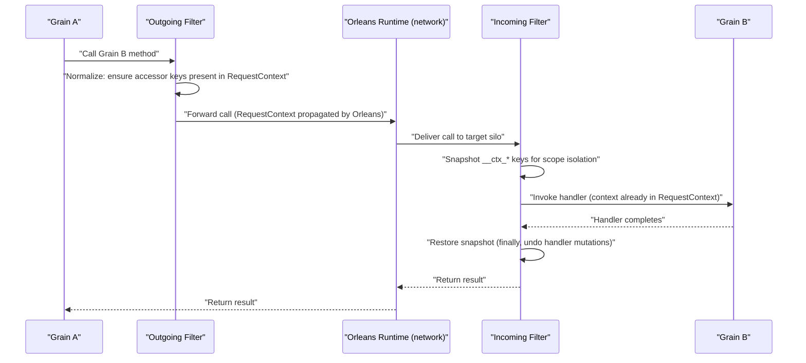
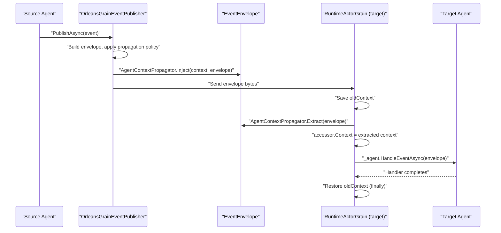

# Orleans AgentContext 适配设计（Grain 入站恢复、出站透传）

## 1. 背景与目标

当前 `AsyncLocalAgentContextAccessor` 仅覆盖本地异步流上下文，不具备 Orleans 跨 Grain 调用链语义。
本设计目标是在 **不改变领域语义** 的前提下，完成 Orleans 运行时适配：

- Grain **入站**：自动恢复 `AgentContext`。
- Grain **出站**：自动透传 `AgentContext`。
- 事件链路：继续通过 `EventEnvelope.Metadata` 传播，与 Grain 调用链保持一致。

## 2. 设计边界

### 2.1 In Scope

- `Aevatar.Foundation.Runtime.Implementations.Orleans` 内新增 Orleans 适配实现。
- 替换 Orleans Runtime 中 `IAgentContextAccessor` 的注册实现。
- 增加入站/出站 Grain Call Filter。
- 在 Orleans 事件发布与消费点接入上下文注入/恢复。

### 2.2 Out of Scope

- 不改变 `IAgentContext` 接口定义。
- 不修改业务域事件模型。
- 不引入中间层全局字典缓存作为上下文事实源。

## 3. 架构原则对齐

- 单一事实源：跨 Grain 调用事实由 `RequestContext` 与 `EventEnvelope.Metadata` 承载。
- 分层清晰：上下文桥接仅在 Orleans Infrastructure 层实现。
- 无中间层事实缓存：禁止 `Dictionary<actorId, context>` 等长期映射。
- 渐进演进：保留 `AsyncLocal` 本地实现；Orleans 环境使用专用适配器覆盖。

## 4. 现状与问题

当前 Orleans 运行时中，`IAgentContextAccessor` 仍注册为 `AsyncLocalAgentContextAccessor`。
结果：

- 同一进程内异步流可以读到上下文；
- 跨 Grain 调用无法保证自动透传；
- 事件入站恢复与 RPC 入站恢复没有统一策略。

## 5. 目标架构

```mermaid
%%{init: {"maxTextSize": 100000, "flowchart": {"useMaxWidth": false, "nodeSpacing": 10, "rankSpacing": 50}, "themeVariables": {"fontSize": "10px"}}}%%
flowchart LR
    A["Caller Grain"] --> B["OutgoingGrainCallFilter"]
    B --> C["RequestContext"]
    C --> D["IncomingGrainCallFilter"]
    D --> E["Callee Grain Handler"]
    E --> F["OrleansGrainEventPublisher"]
    F --> G["EventEnvelope.Metadata"]
    G --> H["RuntimeActorGrain.HandleEnvelopeAsync"]
    H --> I["AgentContext restored, business handler runs"]
```



## 6. 详细设计

### 6.1 Orleans 专用 Accessor（桥接）

新增 `OrleansAgentContextAccessor`（建议位置：`src/Aevatar.Foundation.Runtime.Implementations.Orleans/Context/`）：

- `Context.get`：返回基于 `RequestContext` 的桥接 `IAgentContext`；
- `Context.set`：语义为 **replace**（先清空再导入），确保作用域恢复正确；
- `Context = null`：清空当前 `RequestContext` 上下文键。

**命名统一约定**：

- 键前缀：使用 `AgentContextPropagator.MetadataPrefix`（`"__ctx_"`），禁止硬编码。
- 上下文实现：`get` 返回 `RequestContextAgentContext`（代理模式），读写直接桥接 `RequestContext`，保证 `accessor.Context.Set/Get` 即时生效。

**代理模式（活引用）**：`get` 不返回快照副本，而是返回一个代理对象，其 `Set/Get/Remove/GetAll` 直接操作 `RequestContext`。这确保业务代码 `accessor.Context.Set("k", "v")` 后立即可 `accessor.Context.Get<string>("k")` 读到，与 `AsyncLocalAgentContextAccessor` 的行为语义一致。

桥接伪代码：

```csharp
internal sealed class RequestContextAgentContext : IAgentContext
{
    public T? Get<T>(string key)
    {
        var raw = RequestContext.Get($"{AgentContextPropagator.MetadataPrefix}{key}");
        return raw is T typed ? typed : default;
    }

    public void Set<T>(string key, T value) =>
        RequestContext.Set(
            $"{AgentContextPropagator.MetadataPrefix}{key}",
            value?.ToString() ?? "");

    public void Remove(string key) =>
        RequestContext.Remove($"{AgentContextPropagator.MetadataPrefix}{key}");

    public IReadOnlyDictionary<string, object?> GetAll()
    {
        var prefix = AgentContextPropagator.MetadataPrefix;
        var result = new Dictionary<string, object?>();
        foreach (var key in RequestContext.Keys ?? [])
            if (key.StartsWith(prefix))
                result[key[prefix.Length..]] = RequestContext.Get(key);
        return result;
    }
}

public sealed class OrleansAgentContextAccessor : IAgentContextAccessor
{
    private static readonly RequestContextAgentContext Proxy = new();

    public IAgentContext? Context
    {
        get
        {
            var prefix = AgentContextPropagator.MetadataPrefix;
            foreach (var key in RequestContext.Keys ?? [])
                if (key.StartsWith(prefix))
                    return Proxy;
            return null;
        }
        set
        {
            // Replace: clear all MetadataPrefix keys, then import new context
            var prefix = AgentContextPropagator.MetadataPrefix;
            foreach (var key in (RequestContext.Keys ?? []).ToList())
                if (key.StartsWith(prefix))
                    RequestContext.Remove(key);

            if (value == null) return;
            foreach (var (k, v) in value.GetAll())
                if (v != null)
                    RequestContext.Set($"{prefix}{k}", v.ToString() ?? "");
        }
    }
}
```

**值类型约束**：`IAgentContext` 的值接受 `object?`，但跨 Grain/跨事件传播时，`RequestContext` 和 `EventEnvelope.Metadata`（`map<string, string>`）均要求可序列化为字符串。因此 AgentContext 的值在传播语义下 **限定为 `string`**。非 string 类型在注入时执行 `ToString()`，恢复时只还原为 `string`。消费方如需原始类型应自行解析。

说明：`AsyncLocalAgentContextAccessor` 保留，用于 Local Runtime；Orleans Runtime 通过 DI 覆盖注册。

### 6.2 入站作用域隔离（IIncomingGrainCallFilter）

新增 `OrleansAgentContextIncomingFilter : IIncomingGrainCallFilter`。

由于 `OrleansAgentContextAccessor.get` 返回的代理直接桥接 `RequestContext`，入站时 **不需要显式"恢复"操作**——调用方写入的 `__ctx_*` 键已随 `RequestContext` 自动到达目标 Grain。

IncomingFilter 的核心价值是 **作用域隔离**：防止 grain handler 对上下文的修改（如新增/覆盖键）泄漏到调用方。

逻辑：

1. 进入调用前，快照当前 `RequestContext` 中的 `__ctx_*` 键值（oldSnapshot）；
2. `await context.Invoke()`；
3. `finally` 中从 oldSnapshot 恢复（清除 handler 可能新增的键，还原被覆盖的值）。

关键点：

- 隔离必须是作用域化（try/finally），不能"只设不还"。
- 不在 filter 内维护服务级映射状态。
- 快照仅用于 finally 恢复，非长期持有。

**Reentrant Grain 并发安全**：Orleans `RequestContext` 基于 `AsyncLocal`（逻辑调用链），每个入站请求独立维护自己的 `RequestContext` 副本。即使 grain 配置为 `[Reentrant]`，多个请求交替执行时各自的 `RequestContext` 互不干扰，filter 的 try/finally 恢复在 reentrant 场景下天然安全。验证要求：集成测试必须包含 reentrant grain 并发调用场景（见 Section 9）。

### 6.3 出站规范化（IOutgoingGrainCallFilter）

新增 `OrleansAgentContextOutgoingFilter : IOutgoingGrainCallFilter`。

在代理模式下，`accessor.Context.Set` 已直接写入 `RequestContext`，Orleans 自动传播到目标 Grain。因此 OutgoingFilter **不是唯一透传路径**，其职责是 **防御性规范化**：

1. 读取 `accessor.Context`；
2. 确认当前上下文键值与 `RequestContext` 中的 `__ctx_*` 键一致（若存在非代理路径写入的差异，以 accessor 为准同步到 `RequestContext`）；
3. 调用 `await context.Invoke()`。

关键点：

- 代理模式下此步骤通常是 no-op（数据已在 `RequestContext` 中）；其价值在于：保证非代理路径（如事件链路恢复后 `accessor.Context = extracted` 再发起 grain 调用）也能正确透传。
- 只做"当前调用链"规范化，不缓存历史上下文。
- 键空间隔离：filter 仅管理 `AgentContextPropagator.MetadataPrefix` 前缀键，不触碰其他 `RequestContext` 键。

### 6.4 事件链路（EventEnvelope）对齐

复用现有 `AgentContextPropagator`：

- 出站：在 `OrleansGrainEventPublisher` 创建 envelope 后，调用 `AgentContextPropagator.Inject(accessor.Context, envelope)` 注入上下文到 `Metadata`；
- 入站：`RuntimeActorGrain.HandleEnvelopeAsync` 在调用 `_agent.HandleEventAsync` 前，调用 `AgentContextPropagator.Extract(envelope)` 恢复上下文并写入 `accessor.Context`；
- 执行完成后在 `finally` 中恢复旧上下文（避免污染后续事件处理）。

**Propagator 桥接路径**：`AgentContextPropagator.Extract` 返回 `AsyncLocalAgentContext` 实例（内存快照）。在 Orleans 环境中，该实例被赋值给 `OrleansAgentContextAccessor.Context`（set），accessor 的 set 会遍历 `GetAll()` 将键值逐个写入 `RequestContext`。写入完成后，代理 `RequestContextAgentContext` 自动能读到这些键。因此 `Extract` 无需改造，桥接由 accessor 的 set 语义完成。Orleans 实现与 Propagator 共享 `AgentContextPropagator.MetadataPrefix`，命名统一。

说明：RPC 链路依赖 `RequestContext`，事件链路依赖 `EventEnvelope.Metadata`，两者通过 `IAgentContextAccessor` 在处理点统一。两条链路的恢复时机不同（RPC 在 IncomingFilter，事件在 HandleEnvelopeAsync），但由于 `RequestContext` 基于 `AsyncLocal` 的逻辑调用链隔离，不存在竞态。

### 6.5 依赖注入与装配

在 `Aevatar.Foundation.Runtime.Implementations.Orleans.DependencyInjection.ServiceCollectionExtensions` 调整：

- `Replace` `IAgentContextAccessor` 为 `OrleansAgentContextAccessor`；
- 注册 `IIncomingGrainCallFilter` 与 `IOutgoingGrainCallFilter`；
- 保持非 Orleans Runtime 的现有注册不变。

**注册落点约束（实现前置确认）**：

- 运行时服务注册仍放在 `AddAevatarFoundationRuntimeOrleans(this IServiceCollection services, ...)`；
- Orleans Grain Call Filter 的挂载放在 `AddAevatarFoundationRuntimeOrleans(this ISiloBuilder builder, ...)` 内，通过 `builder.AddIncomingGrainCallFilter<TFilter>()` / `builder.AddOutgoingGrainCallFilter<TFilter>()`（或与当前 Orleans 版本等价的 API）完成；
- 禁止在 Host/API 层单独拼装另一套上下文管线，避免双轨注册。

### 6.6 降级与容错

Filter 内部必须 catch 上下文快照/恢复异常，降级为"无上下文"继续执行，不得因 context propagation 失败阻断业务调用链。

```csharp
// IncomingFilter pseudocode with scope isolation + degradation
public async Task Invoke(IIncomingGrainCallContext context)
{
    Dictionary<string, object?>? snapshot = null;
    try
    {
        snapshot = SnapshotContextKeys();
    }
    catch (Exception ex)
    {
        _logger.LogWarning(ex, "AgentContext snapshot failed, proceeding without isolation");
    }
    try
    {
        await context.Invoke();
    }
    finally
    {
        if (snapshot != null)
            RestoreContextKeys(snapshot);
    }
}

private static Dictionary<string, object?> SnapshotContextKeys()
{
    var prefix = AgentContextPropagator.MetadataPrefix;
    var snap = new Dictionary<string, object?>();
    foreach (var key in RequestContext.Keys ?? [])
        if (key.StartsWith(prefix))
            snap[key] = RequestContext.Get(key);
    return snap;
}

private static void RestoreContextKeys(Dictionary<string, object?> snapshot)
{
    var prefix = AgentContextPropagator.MetadataPrefix;
    foreach (var key in (RequestContext.Keys ?? []).ToList())
        if (key.StartsWith(prefix) && !snapshot.ContainsKey(key))
            RequestContext.Remove(key);
    foreach (var (key, value) in snapshot)
        RequestContext.Set(key, value);
}
```

若需完全禁用 context propagation（如紧急回滚），可通过 DI 不注册 filter 实现，无需代码变更。

### 6.7 Orleans API 兼容性确认（硬前置条件）

**硬前置条件**：`RequestContext` 必须提供可枚举入口（`Keys` 或 `Entries`）。本设计的 `SnapshotContextKeys()`、`RestoreContextKeys()` 以及 `RequestContextAgentContext.GetAll()` 均依赖键枚举能力，无法回退到"逐键读取"——动态上下文下无法预知所有键名。

确认路径：

- Orleans 10.0.1（当前仓库版本）：MS Learn 文档确认存在 `RequestContext.Keys` 和 `RequestContext.Entries`，满足前置条件。
- 文档伪代码中使用的 `RequestContext.GetAllEntries()` 为伪 API，实现时统一替换为 `RequestContext.Keys` 配合 `RequestContext.Get(key)`。
- 若未来升级到不提供可枚举 API 的版本，需重新设计快照/恢复机制（blocker，不可降级）。

交付要求：在实现 PR 描述中注明"采用的 RequestContext 枚举 API + Orleans 版本适配说明"。

## 7. 时序图

### 7.1 RPC 链路（Grain-to-Grain 调用）



### 7.2 事件链路（EventEnvelope 传播）



## 8. 验收标准（Definition of Done）

- 跨 Grain 调用链（>=3 层深度）可自动读取调用方上下文键值。
- Grain 事件发布后，目标处理方可恢复同一上下文（键值精确匹配）。
- 并发调用下无上下文串扰：>=10 并发不同 context 的调用互不污染（含 reentrant grain 场景）。
- 不新增中间层长期字典事实态。
- `dotnet build aevatar.slnx --nologo` 通过。
- 相关 Orleans/Context 测试通过（新增集成测试 + 现有回归）。
- Filter 异常不阻断业务调用链（降级验证）。
- 字符串语义确认：`Set<int>(key, 42)` 在 Orleans 适配下 `Get<int>(key)` 返回 `default`，`Get<string>(key)` 返回 `"42"`；测试必须覆盖此行为边界。

## 9. 测试方案

建议新增以下测试：

1. **RPC 透传**：`Outgoing->Incoming` 跨 Grain 调用，验证上下文键值端到端传递。
2. **多层调用链**：A -> B -> C，验证 context 在 3 层调用链中完整传播。
3. **Envelope Metadata 入站恢复**：发布事件后目标 grain 可从 envelope 恢复上下文。
4. **并发隔离**：10+ 并发调用不同 context，验证互不污染。
5. **Reentrant Grain 隔离**：`[Reentrant]` grain 上同时接收多个请求，验证 context 隔离。
6. **空上下文兼容**：null/empty context 不抛异常，正常透传空值。
7. **Filter 降级**：模拟 context 恢复异常，验证业务调用不中断。
8. **键空间隔离**：非 `AgentContextPropagator.MetadataPrefix` 前缀的 `RequestContext` 键不被 filter 影响。
9. **字符串语义边界**：`Set<int>(key, 42)` 后验证 `Get<int>(key)` 返回 `default(int)`，`Get<string>(key)` 返回 `"42"`。确认非 string 类型经 `ToString()` 后不可逆还原的行为。

## 10. 风险与缓解

- 风险：`RequestContext` 键冲突。
  缓解：统一使用 `AgentContextPropagator.MetadataPrefix`，并预留保留键清单。filter 仅管理该前缀键。

- 风险：上下文泄漏到后续请求。
  缓解：入站 filter `try/finally` 恢复快照。

- 风险：事件与 RPC 行为不一致。
  缓解：统一 `IAgentContextAccessor`，并在两条链路都接入 propagator。

- 风险：Filter 异常导致业务中断。
  缓解：filter 内 catch 异常并降级为无上下文，记录 structured log（见 6.6）。

- 风险：高频调用链性能开销。
  缓解：`MetadataPrefix` 键空间通常 < 10 个键，读写成本可忽略。集成测试中增加吞吐量基准对比（有 filter vs 无 filter），确认 P99 延迟增量 < 1ms。

- 风险：值类型丢失（非 string 类型经 `ToString()` 序列化后无法还原）。
  缓解：文档明确传播语义下值限定为 `string`（见 6.1 值类型约束）。测试覆盖 `Set<int>` / `Get<int>` 边界行为（见 9.9）。

## 11. 实施步骤（最小改动）

1. 新增 `RequestContextAgentContext`（代理）与 `OrleansAgentContextAccessor`（桥接 `RequestContext`）。
2. 新增入站/出站 Grain Filter（含降级逻辑）。
3. 调整 Orleans DI 注册。
4. 在 `OrleansGrainEventPublisher` 与 `RuntimeActorGrain` 接入上下文传播。
5. 增加测试并执行定向验证。

## 12. 开发前置检查清单（Checklist）

实现前必须完成以下确认：

1. **Orleans API 可用性**：确认 `RequestContext.Keys` / `RequestContext.Entries` 可枚举（硬前置条件，见 6.7）。
2. **Filter 注册路径**：确认 `ISiloBuilder` 扩展中可用的入站/出站 filter 注册 API（见 6.5）。
3. **键前缀与保留键**：统一使用 `AgentContextPropagator.MetadataPrefix`，禁止硬编码 `"__ctx_"`；与现有系统键不冲突。
4. **命名统一与代理模式**：`OrleansAgentContextAccessor`、Filter、Propagator 均引用 `AgentContextPropagator.MetadataPrefix`；`get` 返回 `RequestContextAgentContext`（代理），读写直接桥接 `RequestContext`，不返回快照副本。
5. **降级策略**：确认 filter 异常仅告警并降级，不阻断业务调用链。
6. **测试范围**：确认第 9 节测试用例覆盖（含 reentrant 并发隔离、字符串语义边界）。

## 13. 验证命令（提交前）

涉及本设计实现的提交，至少执行以下命令：

- `dotnet restore aevatar.slnx --nologo`
- `dotnet build aevatar.slnx --nologo`
- `dotnet test aevatar.slnx --nologo`
- `bash tools/ci/test_stability_guards.sh`

若改动涉及 Orleans Runtime 相关测试，建议额外执行：

- `dotnet test test/Aevatar.Foundation.Runtime.Hosting.Tests/Aevatar.Foundation.Runtime.Hosting.Tests.csproj --nologo`
