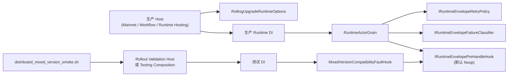

# Orleans Mixed-Version 生产能力与测试验证解耦重构蓝图（Proposed）

## 1. 文档元信息

1. 状态：`Proposed`
2. 版本：`v1`
3. 日期：`2026-03-07`
4. 决策级别：`Architecture Refactor`
5. 适用范围：
   - `src/Aevatar.Foundation.Runtime.Implementations.Orleans*`
   - `src/Aevatar.Foundation.Runtime.Hosting`
   - `src/Aevatar.Mainnet.Host.Api*`
   - `test/Aevatar.Foundation.Runtime.Hosting.Tests`
   - `tools/ci/distributed_mixed_version_smoke.sh`
   - `docs/architecture/orleans-rolling-upgrade-mixed-version-design.md`
6. 非范围：
   - mixed-version 生产能力本身的删除或降级
   - Orleans durable callback reminder-only 主策略回退
   - Kafka / MassTransit 传输栈改写
7. 本版结论：
   - `mixed-version rolling upgrade` 是正式生产特性，用于发布新版本时在同一 Orleans 集群内热更新。
   - `AEVATAR_TEST_*` 只能作为验证该生产特性的测试注入器，不得继续直接混入生产运行时主路径。
   - 本重构目标是结构性分离生产能力与测试验证，而不是仅靠命名或注释区分。

## 2. 背景

当前仓库已经明确：

1. mixed-version 是生产环境能力，不是测试专用脚本。
2. 运行时必须支持 old/new 版本在同一集群共存，并依靠 retry / dedup / replay 在滚动升级期间保持可用与收敛。
3. 仓库仍保留 mixed-version smoke 和相关集成测试，作为发布前验证链路的一部分。

但当前实现仍存在“生产路径与测试路径缠在一起”的结构问题：

1. [RuntimeActorGrain.cs](src/Aevatar.Foundation.Runtime.Implementations.Orleans/Grains/RuntimeActorGrain.cs) 在同一激活路径里同时加载：
   - `RuntimeEnvelopeRetryPolicy`（生产语义）
   - `CompatibilityFailureInjectionPolicy`（测试注入语义）
2. [CompatibilityFailureInjectionPolicy.cs](src/Aevatar.Foundation.Runtime.Implementations.Orleans/Grains/CompatibilityFailureInjectionPolicy.cs) 直接读取：
   - `AEVATAR_TEST_NODE_VERSION_TAG`
   - `AEVATAR_TEST_FAIL_EVENT_TYPE_URLS`
3. [RuntimeEnvelopeRetryPolicy.cs](src/Aevatar.Foundation.Runtime.Implementations.Orleans/Grains/RuntimeEnvelopeRetryPolicy.cs) 也仍直接从环境变量装配生产策略：
   - `AEVATAR_RUNTIME_AUTO_RETRY_MAX_ATTEMPTS`
   - `AEVATAR_RUNTIME_AUTO_RETRY_DELAY_MS`
4. [tools/ci/distributed_mixed_version_smoke.sh](tools/ci/distributed_mixed_version_smoke.sh) 目前直接发布并启动主宿主二进制。

问题不在 mixed-version feature 本身，而在 feature 与验证手段还没有边界化。

## 3. 当前问题

### P1. 生产 runtime 直接感知测试环境变量

当前 `RuntimeActorGrain` 激活时直接调用：

1. `CompatibilityFailureInjectionPolicy.FromEnvironment()`
2. `RuntimeEnvelopeRetryPolicy.FromEnvironment()`

这导致同一个运行时类型同时承担：

1. 生产滚动升级处理职责
2. 测试注入装配职责
3. 环境变量解释职责

这违反“生产能力通过显式配置建模，测试验证通过独立测试入口建模”的边界要求。

### P2. 测试故障注入实现位于生产程序集

当前 `CompatibilityFailureInjectionPolicy` 放在：

1. `src/Aevatar.Foundation.Runtime.Implementations.Orleans/Grains/CompatibilityFailureInjectionPolicy.cs`

它虽然被标记为 test-only，但仍属于生产程序集的一部分。结果是：

1. 生产代码树中保留了明显测试语义的类型。
2. 生产 host 只要配置错误，就可能误启测试故障注入。
3. 阅读 runtime 代码的人很难快速判断“什么是生产特性、什么是验证钩子”。

### P3. mixed-version smoke 直接依赖生产宿主

当前 `distributed_mixed_version_smoke.sh` 直接发布：

1. `src/Aevatar.Mainnet.Host.Api/Aevatar.Mainnet.Host.Api.csproj`

这意味着 CI/staging 的验证路径与生产宿主仍然耦合在一起。虽然能工作，但边界不够清晰：

1. 测试注入依赖主宿主加载。
2. 生产宿主不得不容纳验证型配置面。
3. 发布、验证、运维文档不容易清楚地区分“正式配置”和“验证配置”。

### P4. 生产配置面还没有成为 typed options 权威事实源

当前 mixed-version 的生产语义主要体现在 `RuntimeEnvelopeRetryPolicy`，但它仍直接从环境变量解释参数。  
仓库已经有 [AevatarOrleansRuntimeOptions.cs](src/Aevatar.Foundation.Runtime.Implementations.Orleans.Streaming/AevatarOrleansRuntimeOptions.cs)，却还没有把 mixed-version rollout 策略正式收敛进 typed options。

结果：

1. 生产配置与实现细节绑定过紧。
2. Host / DI / 文档三处不易保持完全一致。
3. 后续若新增 replay、backlog gate、SLO guard，仍会继续散落在 env 解析逻辑里。

## 4. 目标架构

### 4.1 总体原则

1. `mixed-version rolling upgrade` 作为生产能力，必须保留在生产 runtime 主链内。
2. `compatibility failure injection` 作为验证手段，必须从生产 runtime 主链中剥离。
3. 生产代码只感知显式能力抽象，不直接感知 `AEVATAR_TEST_*`。
4. 测试故障注入只能通过单独 testing composition / validation host 装配。
5. smoke / integration 继续保留，但不再通过生产宿主隐式承载测试逻辑。

### 4.2 目标组件图



### 4.3 目标分层

生产层只保留：

1. `RollingUpgradeRuntimeOptions`
2. `IRuntimeEnvelopeRetryPolicy`
3. `IRuntimeEnvelopeFailureClassifier`
4. `IRuntimeEnvelopePreHandleHook`
5. `NoopRuntimeEnvelopePreHandleHook`

测试层只保留：

1. `MixedVersionCompatibilityFaultHook`
2. 测试环境变量解析
3. smoke / integration 专用装配
4. rollout validation host 或 testing service registration

## 5. 核心重构决策

### 5.1 生产能力配置化

新增正式生产 options：

1. `RollingUpgradeRuntimeOptions`
2. 或将其作为 `AevatarOrleansRuntimeOptions.RollingUpgrade` 子结构

建议字段：

1. `EnableRuntimeRetry`
2. `MaxRetryAttempts`
3. `RetryDelayMs`
4. `EnableReplaySupport`
5. `EnableUpgradeDiagnostics`

原则：

1. 生产 runtime 只从 typed options 读取 mixed-version rollout 策略。
2. Host 可继续从环境变量绑定，但 env 解析不再藏在 grain 内部类型里。

### 5.2 测试注入抽象化

新增一个通用预处理钩子，而不是在 grain 里硬编码测试策略：

```csharp
public interface IRuntimeEnvelopePreHandleHook
{
    ValueTask<RuntimeEnvelopePreHandleResult> BeforeHandleAsync(
        EventEnvelope envelope,
        CancellationToken ct);
}
```

生产默认实现：

1. `NoopRuntimeEnvelopePreHandleHook`

测试实现：

1. `MixedVersionCompatibilityFaultHook`

关键点：

1. 生产 runtime 只知道“是否有预处理钩子”，不知道 `AEVATAR_TEST_*`。
2. `MixedVersionCompatibilityFaultHook` 只能在 testing composition 中注册。

### 5.3 测试实现移出生产主程序集

新增专用 testing 载体，二选一：

1. `src/Aevatar.Foundation.Runtime.Testing`
2. `src/Aevatar.Mainnet.Host.Api.RolloutValidation`

推荐组合：

1. `Aevatar.Foundation.Runtime.Testing`
   - 放测试钩子、测试 options、testing DI
2. `Aevatar.Mainnet.Host.Api.RolloutValidation`
   - 专门给 smoke / staging rollout validation 用

生产宿主：

1. `Aevatar.Mainnet.Host.Api`
   - 不引用 testing assembly

验证宿主：

1. `Aevatar.Mainnet.Host.Api.RolloutValidation`
   - 显式引用 testing assembly
   - 明确是 rollout validation binary，不是生产发布二进制

### 5.4 双 DI 入口

生产 DI：

1. `AddAevatarFoundationRuntimeOrleans(...)`
2. 只注册生产能力实现

测试 DI：

1. `AddAevatarFoundationRuntimeMixedVersionValidationForTesting(...)`
2. 只注册测试钩子和测试配置解释器

要求：

1. 主宿主不得调用 testing DI。
2. smoke host 必须显式调用 testing DI，不能再靠主宿主隐式承载。

### 5.5 反向保险

生产宿主启动时增加 fail-fast 保护：

1. 若检测到 `AEVATAR_TEST_NODE_VERSION_TAG`
2. 或检测到 `AEVATAR_TEST_FAIL_EVENT_TYPE_URLS`

则：

1. 记录高等级错误并拒绝启动
2. 或明确要求 `EnableTestingHooks=true` 才允许继续

原则：

1. 测试注入配置误入生产时必须是显式失败，而不是静默生效。

## 6. 详细实施设计

### 6.1 WP1：把生产 mixed-version 配置收敛到 typed options

#### 6.1.1 目标

让 grain 不再直接读取 `AEVATAR_RUNTIME_*`。

#### 6.1.2 主要改动

1. 扩展 [AevatarOrleansRuntimeOptions.cs](src/Aevatar.Foundation.Runtime.Implementations.Orleans.Streaming/AevatarOrleansRuntimeOptions.cs)
2. 新增 `RollingUpgradeRuntimeOptions`
3. `RuntimeEnvelopeRetryPolicy` 改成从 options 构造
4. 删除 `RuntimeEnvelopeRetryPolicy.FromEnvironment()`

#### 6.1.3 影响文件

1. `src/Aevatar.Foundation.Runtime.Implementations.Orleans.Streaming/AevatarOrleansRuntimeOptions.cs`
2. `src/Aevatar.Foundation.Runtime.Implementations.Orleans/Grains/RuntimeEnvelopeRetryPolicy.cs`
3. `src/Aevatar.Foundation.Runtime.Implementations.Orleans/DependencyInjection/ServiceCollectionExtensions.cs`
4. `src/Aevatar.Foundation.Runtime.Implementations.Orleans/Grains/RuntimeActorGrain.cs`

#### 6.1.4 验收标准

1. grain 内不再出现 `Environment.GetEnvironmentVariable("AEVATAR_RUNTIME_...")`
2. 生产 runtime retry 策略全部来自 typed options

### 6.2 WP2：引入通用 pre-handle hook，替代测试策略硬编码

#### 6.2.1 目标

把测试注入从 grain 内联逻辑剥出来。

#### 6.2.2 主要改动

1. 新增 `IRuntimeEnvelopePreHandleHook`
2. 新增 `NoopRuntimeEnvelopePreHandleHook`
3. `RuntimeActorGrain` 仅调用 hook
4. 删除 grain 对 `CompatibilityFailureInjectionPolicy` 的直接依赖

#### 6.2.3 影响文件

1. `src/Aevatar.Foundation.Runtime.Implementations.Orleans/Grains/RuntimeActorGrain.cs`
2. `src/Aevatar.Foundation.Runtime.Implementations.Orleans/*` 新增 hook 抽象与 noop 实现
3. 删除或移动 `CompatibilityFailureInjectionPolicy.cs`

#### 6.2.4 验收标准

1. `RuntimeActorGrain` 中不再出现 `AEVATAR_TEST_*`
2. `CompatibilityFailureInjectionPolicy` 不再属于生产 runtime 主程序集

### 6.3 WP3：新增 testing assembly / rollout validation host

#### 6.3.1 目标

让 smoke 和 staging 验证不再直接依赖生产宿主二进制。

#### 6.3.2 方案

新增：

1. `src/Aevatar.Foundation.Runtime.Testing`
2. `src/Aevatar.Mainnet.Host.Api.RolloutValidation`

其中：

1. `Aevatar.Foundation.Runtime.Testing`
   - `MixedVersionCompatibilityFaultHook`
   - `MixedVersionValidationOptions`
   - `AddAevatarFoundationRuntimeMixedVersionValidationForTesting()`
2. `Aevatar.Mainnet.Host.Api.RolloutValidation`
   - 引用生产 host 组合
   - 额外调用 testing DI
   - 专门用于 smoke / staging rollout 验证

#### 6.3.3 影响文件

1. 新增 `src/Aevatar.Foundation.Runtime.Testing/*`
2. 新增 `src/Aevatar.Mainnet.Host.Api.RolloutValidation/*`
3. `tools/ci/distributed_mixed_version_smoke.sh`

#### 6.3.4 验收标准

1. smoke 脚本不再发布 `Aevatar.Mainnet.Host.Api`
2. 生产 host 不再直接引用 testing assembly

### 6.4 WP4：测试配置面收口

#### 6.4.1 目标

测试环境变量只能由 testing composition 解释。

#### 6.4.2 主要改动

保留：

1. `AEVATAR_TEST_NODE_VERSION_TAG`
2. `AEVATAR_TEST_FAIL_EVENT_TYPE_URLS`

但只允许出现在：

1. testing assembly
2. smoke script
3. 集成测试 fixture

不再允许出现在：

1. 生产 runtime grain
2. 生产宿主 `Program`
3. 生产 DI 主链

#### 6.4.3 验收标准

1. `src/` 生产程序集扫描不到 `AEVATAR_TEST_`
2. 除 testing assembly / test project / tools 外，无代码直接引用这些变量

### 6.5 WP5：文档与门禁同步

#### 6.5.1 新增 guard

1. 禁止 `src/` 非 testing 项目出现 `AEVATAR_TEST_`
2. 禁止生产宿主项目引用 `Aevatar.Foundation.Runtime.Testing`
3. 禁止 `CompatibilityFailureInjectionPolicy` 留在生产 runtime 程序集

#### 6.5.2 文档同步

1. 更新 [orleans-rolling-upgrade-mixed-version-design.md](docs/architecture/orleans-rolling-upgrade-mixed-version-design.md)
2. 增加 rollout validation host 使用说明
3. 增加“生产发布配置 vs 验证配置”对照表

## 7. 推荐项目结构

### 7.1 生产侧

1. `src/Aevatar.Foundation.Runtime.Implementations.Orleans`
   - `RuntimeActorGrain`
   - `RuntimeEnvelopeRetryPolicy`
   - `IRuntimeEnvelopePreHandleHook`
   - `NoopRuntimeEnvelopePreHandleHook`
2. `src/Aevatar.Foundation.Runtime.Implementations.Orleans.Streaming`
   - `AevatarOrleansRuntimeOptions`
   - `RollingUpgradeRuntimeOptions`
3. `src/Aevatar.Mainnet.Host.Api`
   - 生产宿主

### 7.2 测试/验证侧

1. `src/Aevatar.Foundation.Runtime.Testing`
   - `MixedVersionCompatibilityFaultHook`
   - `MixedVersionValidationOptions`
   - testing DI
2. `src/Aevatar.Mainnet.Host.Api.RolloutValidation`
   - rollout validation 宿主
3. `tools/ci/distributed_mixed_version_smoke.sh`
   - 只启动 validation host

## 8. 迁移顺序

1. `WP1`：先把生产 retry 配置 options 化。
2. `WP2`：再把 test injection 从 `RuntimeActorGrain` 剥成 hook。
3. `WP3`：新增 testing assembly 和 validation host。
4. `WP4`：改 smoke script、integration fixture、文档。
5. `WP5`：加 guard，禁止回流。

原因：

1. 先稳定生产路径，再切验证路径，风险最低。
2. 这样不会在中途打断 mixed-version 现有 smoke/test 覆盖。

## 9. 风险与控制

### 9.1 最大风险

1. 将测试注入移出后，mixed-version smoke 可能暂时失去旧节点故障模拟能力。
2. validation host 若与生产 host 组合漂移，可能出现“验证通过但生产配置不同”的假阳性。
3. options 化过程中，retry 默认值若变化，可能影响 rollout 收敛速度。

### 9.2 控制措施

1. validation host 复用生产 host 组合，只允许额外追加 testing DI。
2. 保持 `RuntimeEnvelopeRetryPolicy` 默认值语义不变。
3. 在迁移期间先保留旧 smoke，直到新 validation host 全绿后再删除旧路径。

## 10. 测试矩阵

### 10.1 单元

1. `RuntimeEnvelopeRetryPolicy` options binding tests
2. `NoopRuntimeEnvelopePreHandleHook` tests
3. `MixedVersionCompatibilityFaultHook` tests

### 10.2 集成

1. `OrleansMassTransitRuntimeIntegrationTests`
2. `DistributedMixedVersionClusterIntegrationTests`
3. rollout validation host boot tests

### 10.3 smoke

1. `bash tools/ci/distributed_mixed_version_smoke.sh`

### 10.4 门禁

1. `bash tools/ci/architecture_guards.sh`
2. 新增专项 guard：
   - forbid `AEVATAR_TEST_` in production projects
   - forbid production host -> testing assembly reference

## 11. DoD

满足以下条件才算完成：

1. `mixed-version rolling upgrade` 仍保留为正式生产特性。
2. `RuntimeActorGrain` 不再直接读取 `AEVATAR_TEST_*`。
3. 生产 runtime 不再直接包含测试故障注入实现。
4. smoke / CI 可继续验证 old/new mixed cluster 收敛。
5. 生产宿主与验证宿主边界清楚，文档与配置说明同步。
6. `build/test/guards` 全部通过。

## 12. 推荐下一步

如果按“最小风险、最大收益”推进，我建议立即执行：

1. `WP1`：把 `RuntimeEnvelopeRetryPolicy` 从 env 读取改成 typed options。
2. `WP2`：为 `RuntimeActorGrain` 引入 `IRuntimeEnvelopePreHandleHook`。
3. `WP3`：新增 `Aevatar.Foundation.Runtime.Testing`，把 `CompatibilityFailureInjectionPolicy` 迁出生产程序集。

这三步完成后，生产与测试的边界就已经从“注释级”提升为“代码结构级”。
