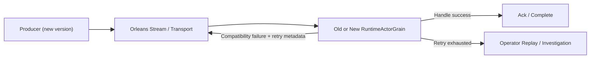

# Orleans Mixed-Version Rolling Upgrade Design (No-Downtime Target)

## 1. Background and Goal

This is a production runtime feature, not a test-only compatibility shim.
Its purpose is to allow hot rollout / rolling upgrade of new versions while old and new binaries
coexist in the same Orleans cluster.

The runtime must support mixed-version processing during platform-managed rolling upgrade (for example, Kubernetes rolling update):

- Run old/new versions in one Orleans cluster during migration.
- Allow incompatible event handling failures on old nodes.
- Convert failures into retryable queue workflow and recover on new nodes.
- Remain correct while old instances are gradually replaced by platform orchestration.

Primary operational objective:

- Service remains available during upgrade.
- Message loss is zero.
- Failed messages are retryable with structured diagnostics.

## 2. Scope and Non-Goals

In scope:

- Runtime failure classification and retry routing.
- Idempotency and replay safety under duplicate delivery.
- Mixed-version test automation in CI.
- Runtime acceptance gates during platform rollout.

Out of scope:

- Strict event-version routing by explicit version gate.
- Full compatibility guarantee for intentionally breaking schema changes.
- Node orchestration actions (scale out/in, pod replacement, rollout strategy), which are handled by platform layer.

### 2.1 Production Feature vs Test Validation

- Production feature:
  - mixed-version old/new nodes run concurrently in one cluster during release rollout
  - runtime retry + dedup + replay semantics keep service available and drive convergence
- Test/staging validation helper:
  - `AEVATAR_TEST_NODE_VERSION_TAG`
  - `AEVATAR_TEST_FAIL_EVENT_TYPE_URLS`
  - these switches only inject synthetic old-node compatibility failures so the production feature can be verified deterministically
  - they are not the production mixed-version feature flag

## 3. Design Constraints (Repository Rules Alignment)

- Keep strict layering: `Domain / Application / Infrastructure / Host`.
- Do not keep cross-node factual state in in-process dictionaries at middleware layer.
- Actor lifecycle and authoritative runtime facts remain in Orleans grain state or distributed state abstraction.
- Maintain `Command -> Event` and `Query -> ReadModel`.
- Keep projection and stream dispatch contracts explicit and testable.

## 4. Target Runtime Behavior

### 4.1 Runtime States During Rollout

1. Mixed mode: old/new versions process traffic concurrently.
2. Compatibility-failure mode: old version fails for unknown/incompatible events and schedules runtime retry.
3. Convergence mode: retries increasingly succeed on new version instances.
4. Stabilized mode: retry backlog returns to baseline after rollout converges.

### 4.2 Failure and Recovery Path

When old node cannot process a new event (unknown type, deserialization issue, unsupported contract):

1. Catch exception in runtime handling boundary.
2. Classify error as retryable compatibility error.
3. RuntimeActorGrain builds a new retry envelope with attempt metadata and republishes to the same stream transport path.
4. New-version node eventually handles the event successfully.
5. If max retry exceeded, stop runtime auto-retry and surface failure for operational handling/replay.

### 4.3 End-to-End Flow

## 5. Required Functional Capabilities

### 5.1 Runtime Retry Policy (Single Layer)

- Keep a single retry layer in `RuntimeActorGrain`; do not add another retry stack in Kafka consumer.
- Error categories:
  - `RetryableCompatibilityError`
  - `RetryableTransientError`
  - `NonRetryableBusinessError`
- Runtime auto-retry controls (environment):
  - `AEVATAR_RUNTIME_AUTO_RETRY_MAX_ATTEMPTS`
  - `AEVATAR_RUNTIME_AUTO_RETRY_DELAY_MS`
- Mandatory metadata in runtime retry envelope:
  - `message_id`
  - `event_type_url`
  - `source_actor_id`
  - `attempt`
  - `first_seen_utc`
  - `last_error_code`

### 5.2 Idempotency

- Use stable idempotency key: `actor_id + envelope_id`.
- Keep dedup durable across node restarts (not process-local only).
- Enforce at runtime event handling boundary before side effects.

### 5.3 Replay

- Support explicit replay for failed envelopes in mixed-version tests and operations.
- Replay operation requires correlation id and audit record.
- Replay outcome must be observable (success/failure/skip).

### 5.4 Schema Evolution Rules

- Protobuf evolution must remain additive for compatibility changes.
- No field number reuse.
- Breaking schema updates must use new event type, then rely on retry path during mixed mode.

## 6. Proposed Change List (By Area)

## 6.1 Runtime Handling Boundary

Primary file to extend:

- `src/Aevatar.Foundation.Runtime.Implementations.Orleans/Grains/RuntimeActorGrain.cs`

Planned changes:

- Wrap `HandleEnvelopeAsync` execution with policy-driven error classification.
- Convert compatible failure categories into retry publishing instead of silent drop.
- Emit structured logs/metrics for retry decisions.
- Keep existing dedup check before event processing.

## 6.2 Runtime Service API

Primary file to evaluate for extension:

- `src/Aevatar.Foundation.Runtime.Implementations.Orleans/Actors/OrleansActorRuntime.cs`

Planned changes:

- Add runtime-level operation hooks for replay and poison-message management.
- Ensure destroy/link/unlink flows preserve idempotent behavior under retries.

## 6.3 Grain Contract (Optional Minimal Extension)

Primary file:

- `src/Aevatar.Foundation.Runtime.Implementations.Orleans/Grains/IRuntimeActorGrain.cs`

Optional additions:

- Administrative methods for replay diagnostics and retry state visibility if needed.
- Keep interface changes minimal to reduce rollout risk.

## 6.4 Host Composition and Config

Existing distributed host docs and entry points:

- `docs/architecture/mainnet-host-api-distributed-orleans-tm-kafka.md`
- Host bootstrapping under `src/Aevatar.Mainnet.Host.Api/Hosting/`

Planned config additions:

- Runtime auto-retry env:
  - `AEVATAR_RUNTIME_AUTO_RETRY_MAX_ATTEMPTS`
  - `AEVATAR_RUNTIME_AUTO_RETRY_DELAY_MS`
- Compatibility-failure injection env (test only):
  - `AEVATAR_TEST_NODE_VERSION_TAG`
  - `AEVATAR_TEST_FAIL_EVENT_TYPE_URLS`
  - Purpose: validate the production rolling-upgrade feature by forcing selected event types to fail on designated old nodes.

## 6.5 Transport Adapter Simplification

- Kafka consumer keeps transport responsibility only: validate envelope and dispatch.
- Transport layer does not implement retry policy to avoid duplicate retry stacks.
- Runtime failure policy remains the single business-close retry authority.

## 6.6 Observability

Required telemetry:

- `runtime_envelope_total`
- `runtime_envelope_failed_total`
- `runtime_envelope_retry_total`
- `runtime_envelope_dedup_dropped_total`
- `runtime_retry_backlog`

Add per-version dimension where available:

- `node_version=old|new`

## 7. Runtime Acceptance Gates During Platform Rollout

This system design does not own rollout orchestration. Platform (for example Kubernetes) controls instance replacement.  
System responsibility is to satisfy runtime gates while rollout is ongoing:

1. Compatibility failures are captured and routed to retry, not dropped.
2. Retry backlog remains bounded and converges within timeout.
3. Message loss remains zero.
4. Overall success rate remains above SLO threshold.

Operational fallback signal:

- If retry backlog grows continuously or success rate drops below SLO, pause rollout at platform layer and investigate runtime failures.

## 8. Integration Test Plan (Primary)

Target test project:

- `test/Aevatar.Foundation.Runtime.Hosting.Tests/`

Extend existing:

- `test/Aevatar.Foundation.Runtime.Hosting.Tests/OrleansDistributedCoverageTests.cs`

Add new integration classes:

- `OrleansMassTransitRuntimeIntegrationTests.cs`
- `DistributedMixedVersionClusterIntegrationTests.cs`

### 8.1 Mandatory Scenarios

1. `Old3_New3_MixedCluster_ShouldKeepServiceAvailable`
   - Given 3 old + 3 new nodes
   - When normal and new-version events are produced
   - Then overall success remains above threshold and no message loss

2. `OldNode_UnknownEvent_ShouldRouteToRetry_ThenSucceedOnNewNode`
   - Given old node cannot deserialize/handle event
   - When processing occurs in mixed cluster
   - Then event is retried and completed by new node

3. `KafkaTransport_ShouldAutoRetryAndSucceedOnNewNode_AfterOldNodeStops`
   - Given old node fails with compatibility injection
   - When runtime auto-retry is enabled
   - Then retried envelope is eventually consumed by new node

4. `DuplicateDeliveries_ShouldNotCauseDuplicateSideEffects`
   - Given same envelope delivered multiple times
   - When dedup key already recorded
   - Then side effects execute once

5. `InstanceTurnover_ShouldConvergeWithoutBacklogExplosion`
   - Given mixed cluster steady state
   - When platform replaces old instances with new instances
   - Then retry backlog converges and service remains healthy

6. `KafkaTransport_ShouldReplayAndSucceedOnNewNode_AfterOldNodeInjectionFailure`
   - Given an envelope failed on old node
   - When operator/test replays envelope on new node
   - Then replay succeeds and result is observable

### 8.2 CI Gate Suggestions

Fail PR if any condition is true:

- Message loss detected.
- Mixed-version tests fail.
- Retry backlog does not converge within timeout.

Suggested commands to include in CI stage:

- `dotnet test test/Aevatar.Foundation.Runtime.Hosting.Tests/Aevatar.Foundation.Runtime.Hosting.Tests.csproj --nologo`
- `bash tools/ci/distributed_3node_smoke.sh`
- New mixed-version smoke script (to add): `bash tools/ci/distributed_mixed_version_smoke.sh`

## 9. Open Decisions

1. Retry-at-runtime policy defaults and operational override strategy.
2. Whether to expose replay admin API in host layer now or in later phase.
3. Metrics exposure scope for rollout gates (`retry_enqueued_total`, `retry_success_total`, version-tag dimensions).

## 10. Delivery Milestones

M1:

- Runtime failure classification and retry routing.
- Runtime retry policy hardening and telemetry.

M2:

- Replay tooling and idempotency hardening.
- Mixed-version integration test suite in CI gate.

M3:

- Runtime acceptance verification under platform-managed rollout in target environment.
